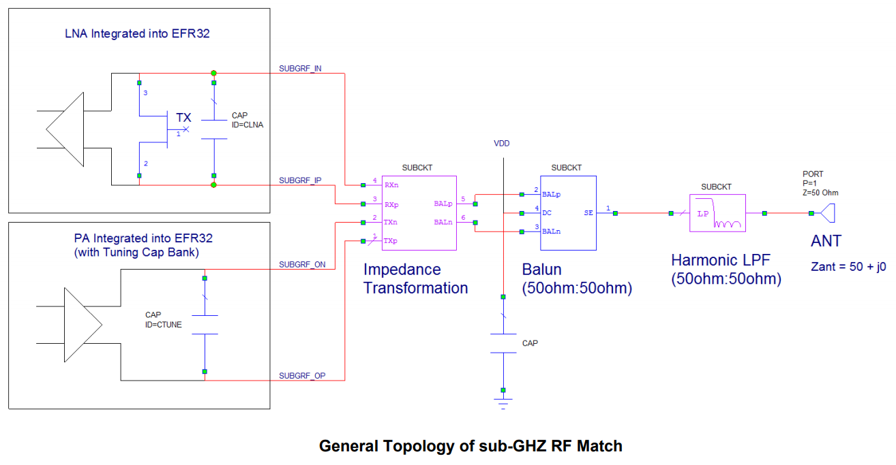

# Schematic Design
The customer want to design its own schematic of project. First of all the customer should find a reference from Silabs' web source. Then study the schematic with hardware design consideration and RF circuits matching guide if interest. And make its own schematic based on the reference design and actual applications.
## Find the relative reference design from Silabs' website
There are relative reference designs for all of the solutions in the website. Basically the reference designs differ from frequency bands, output power levels, DC-DC regulator configurations, and chip packages. 
- Frequency bands: 

  2.4GHz for: Proprietary, BLE, and Zigbee;

  Sub-G for:  Proprietary, Z-Wave.

- Output power levels: 

  0dBm, +8dBm, +10dBm, +13~14dBm, +20dBm.
- DC-DC regulator configuration: 

  Use it for power efficiency; 
 
  Don’t use it for saving cost.

- Chip packages:

  32/48/68 pins QFN package and 125pins BGA package for EFR32 chips.

For example, you want to search the reference schematic of proprietary chip, you can go to the following web page:

In this page, you can move mouse to Products tab, then the pop-down menu will appear with Wireless products which include the Proprietary item, then click left button of your mouse. And it will enter the Proprietary product list page as following:

You can find the generations of proprietary products as listed in the bottom table. You can select EFR32FG1 series 1 sub-GHz and 2.4GHz SoCs for more details:

In this page, you can find the brief introduction of the proprietary series 1 chips and the parameter list of each chips. Ignore the chips list, you can click the View Document in this page and acess the documents list pages directly:

For example, If you want to look for 434MHz +10dBm output power reference design, you can click item EFR32FG1 BRD4251B 2400/433 MHz 10dBm Radio Board Full Design Package and down load the reference design package to your local address.
The schematic likes:[BRD4251B](https://www.silabs.com/documents/public/schematic-files/EFR32FG1-BRD4251B-B00-schematic.pdf)

But keep in mind that this reference design can be applied to a cluster of chips that have difference packages and frequency band configurations. So you can just replace the chips to your interest chip with different package and frequency band.
## Hardware design considerations
After you get the reference design, you may have the concern why the reference is designed like this. Therefor Silabs provides a lot of application notes or reference manue for customer reference. For basical hardware considerations, you can refer to the following application note for detail descriptions:[AN0002.1](https://www.silabs.com/documents/public/application-notes/an0002.1-efr32-efm32-series-1-hardware-design-considerations.pdf). And there are several hardware considerations in different divisions as following:
- Power supply configurations: 
  - General requirements: VREGVDD = AVDD, must be the highest voltage on  EFR32; DVDD,IOVDD,RFVDD,PAVDD =< AVDD; DECOUPLE < DVDD
  - If internal DC-DC is not used, typically tie all the power pins to the main power supply.
  - If internal DC-DC is used, typically tie VREGVDD, AVDD, IOVDD to the main power supply, tie DVDD, RFVDD to DCDC output (VREGSW), tie PAVDD to DCDC output if TXP =< +13dBm, tie PAVDD to VMCU main supply if TXP > +13dBm.

  For more information, please refer to application notes: [AN0948](https://www.silabs.com/documents/public/application-notes/an0948-power-configurations-and-dcdc.pdf)
- Debug connector and reset pin:
  - Serial wire debug

    The Serial Wire Debug (SWD) interface is supported by all EFR32 Wireless Gecko Series devices and consists of the SWCLK (clock input) and SWDIO (data in/out) lines, in addition to the optional SWO (serial wire output). The SWO line is used for instrumentation trace and program counter sampling, and is not needed for flash programming and normal debugging. However, it can be valuable in advanced debugging scenarios, and designers are strongly encouraged to include this along with the other SWD signals.And more there are VCOM port and PTI trace port in the mini simplicity studio debug port. This allow the debug port to do powerful program, control, and trace functions.
  The debug port map and description is as following:
  
  Most commonly it recommends to reserve this debug port in custom boards to facilitate the debug and test purpose.

  - JTAG debug

    EFR32 Wireless Gecko Series devices optionally support JTAG debug using the TCLK (clock), TDI (data input), TDO (data output), and TMS (input mode select) lines. TCLK is the JTAG interface clock. TDI carries input data, and is sampled on the rising edge of TCLK. TDO carries output data and is shifted out on the falling edge of TCLK. Finally, TMS is the input mode select signal, and is used to navigate through the Test Access Port (TAP) state machine.
    The 10-pin Cortex debug port is defined as following:
    

  For more information for debug connecors, please refer to [AN0958](https://www.silabs.com/documents/public/application-notes/an958-mcu-stk-wstk-guide.pdf)
  - Reset pin

    There are a weak pull-up resistor and a low pass filter at reset pin inside the chip. It will allow reset pin floated and prevent noise glitches from outside interfer. It recommends not pull-up reset pin outside the chip.

- External clock source:

  EFR32 Wireless Gecko Series devices support different external clock sources to generate the high and low frequency clocks in addition to the internal LF and HF RC oscillators. The possible external clock sources for both the LF and HF domains areexter nal oscillators (square or sine wave) or crystals/ceramic resonators.

  - Low Frequency Clock Sources

    An external low frequency clock can be supplied from a crystal/ceramic resonator or from an external clock source.It can source a low-frequency clock from an external source such as a TCXO or VCXO.
  
  - Low Frequency Clock Sources

    The high frequency clock can be sourced from a crystal or ceramic resonator or from an external square or sine wave source. It can source a high-frequency clock from an external source such as a TCXO or VCXO.
    
For additional information on the external oscillators, refer to the application note, [AN0016.2](https://www.silabs.com/documents/public/application-notes/an0016.2-efr32-series-2-oscillator-design-considerations.pdf)

## RF circuits matching guide 
The EFR32 Wireless Gecko Series devices include chip variants that provide 2.4 GHz-only operation, sub-GHz-only operation, or dual-band (2.4GHz and sub-GHz)operation.For RF matching circuits design of these bands, there are 2 application notes described the methods. One is for sub-GHz band, and the other is for 2.4GHz band.

The matching effort strives to simultaneously achieve several goals:
- Provide for tying together the TX and RX signal paths, external to the RFIC.
- Provide the desired nominal TX output power level (measured at the connector to the antenna / load).
- Obtain this nominal TX output power at the nominal supply voltage.
- Provide optimal RX Sensitivity.
- Minimize current consumption (i.e., maximize efficiency).
- Comply with regulatory specifications for spurious emissions.

- Matching circuits design for sub-GHz band 
  The sub-GHz LNA and PA circuits in EFR32 RFICs are fully differential and are not tied together inside the chip. As a result, a total of four pins are required on the RFIC to provide access to the LNA and PA circuits: SUBGRF_OP/ON for the TX output, and SUBGRF_IP/IN for the RX input.
  [AN923](https://www.silabs.com/documents/public/application-notes/AN923-subGHz-Matching.pdf) describes the matching method in detail.

   The matching circuits consist of impedance transformation block, Balun, and Low Pass Filter as following picture shows:
  
  The matching circuits are classified into 2 types due to the balun difference. One is for low frequency band(<500MHz), and another is for high frequency band(>500MHz)
  
  

  And more the matching circuits are different from components values which classified with output power levels and sub frequency bands:

  Matching components value table:
  
  Performance table:
  

- Matching circuits design for 2.4GHz band
  The 2.4 GHz front end has a unified, single-ended TX and RX pin (2G4RF_IOP), so the TX and RX paths are tied together internally. The 2G4RF_ION TX pin has to be grounded at the pin. Externally, a single-ended matching network and harmonic filtering are required.

  2 main 2.4 GHz matching topologies are presented here:

  A ladder 2-element LC match for up to 10 dBm power levels:

  
  
  A ladder 4-element LCLC match for up to 20 dBm power levels:

  

The performances:
   Tx output power and harmonics:

   
  
   Rx sensitivity:
    
  

## Customize the schematic design to fit the application
   There are several points should be considered before a project's schematic design:
- Which protocol do you want to use?
  Proprietary can provide most flexible communication protocol. Zigbee and BLE are more professional with network communication and control. Z-Wave is more safety for door lock application.
- Does your product care about power efficiency? Is your product battery powered?
  Please consider to use internal DC-DC regulator if power efficiency is critical.
- What frequency band does your product work in?
  Basically 2.4GHz is used in Zigbee, BLE, and some cases for Proprietary;
  Sub-G bands are used for Proprietary and Z-wave.
- What output power requirement with your product?
  Consider the output power requirement base on range, RF regulation, and power consumption restriction.

Based on above considerations, you can customize the reference schematic to your own product.

