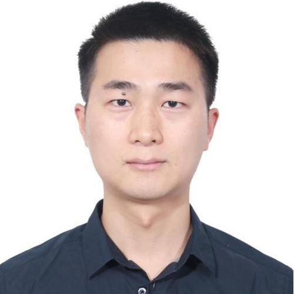

Home | [Zigbee](Zigbee) | [Bluetooth](Bluetooth-Boot-Camp) | [ZWave](ZWave-Boot-Camp) | [Proprietary](Proprietary-Boot-Camp) | [Hardware](Hardware-Boot-Camp) | [Common](Common)

********
# Welcome

Welcome to the Torch IoT Developer Boot Camp. These pages are intended for those who is learning about the IoT development. The Boot Camp consists of various wireless products. Including Zigbee, Bluetooth, Z-Wave, Proprietary, Wireless hardware. Each of the product learning paths are divided into two parts. 

- One day workshop for the beginner. 
- Series of workshop for intermediate.

The beginner can start with the one day workshop to get familiar with basic concepts of the wireless knowledge, development environment setup, and know how to build their first IoT product from scratch. And becomes the entry level of the IoT developer. 

After that, we can continue to pickup any interesting topics from the series of workshops, focus on the real need during their development process. Become intermediate level developer. 

And for the advanced level, we'd recommended to take a deep look into the Zigbee spec from official website, and Application notes, KBA, User Guide from Silicon Labs web site. That won't be covered by our course here.  

# Start our adventure

On top of this page, you will find several small icons following with text of wireless protocol name. 

* __Zigbee, Bluetooth, ZWave and Proprietary__ are different wireless protocols
* __Hardware__ introduce the wireless hardware knowledge
* __Common__ introduce the common IoT knowledge that not limited with specific wireless protocol. 

Click on the topic you are interested to start our adventure. 

If you are complete new to IoT, It is recommended to start with [IoT Introduction](IoT-Introduction). 

********

### Want to contribute to this Wiki?
[Fork it and send a pull request](https://github.com/MarkDing/IoT-Developer-Boot-Camp-Wiki) 

# Contributors
<table border="1">
  <tr>
    <th></th>
    <th> Mark Ding，现居住在深圳的物联网开发者。 他对于如何把复杂的技术问题通过简单的方式传递给物联网开发者充满浓厚的兴趣。他和他的小伙伴们建立了TorchIoTBootCamp小组，贡献了大量关于Zigbee, Bluetooth, Z-Wave, 无线硬件等文章和培训课程视频，发表到GitHub，Zhihu，Bilibili网站。</th>
  </tr>
  <tr>
    <th></th>
    <th> Cheng Yuan，物联网领域从业人员。目前主要关注于低功耗蓝牙，蓝牙mesh网络，蓝牙定位技术在IoT领域的应用，同时对于MCU, Zigbee等也有少量的涉猎。作为TorchIoTBootCamp小组成员之一，不断致力于IoT相关知识的分享，以让更多人了解IoT。</th>
  </tr>
  <tr>
    <th></th>
    <th> Victor Hu，物联网半导体技术工程师。专注于物联网智能家居领域，熟悉市场主流的物联网无线协议，包括BLE ，Zigbee，Wi-Fi，Z-Wave等。</th>
  </tr>
  <tr>
    <th></th>
    <th> Jessica Zheng，物联网应用工程师，2020年毕业于南特大学综合理工学院，同年加入Silicon Labs，专注于物联网技术中的BLE和Z-Wave协议，对行业动态与最新技术充满兴趣。在业余时间，Jessica喜欢看电影，跑步和打篮球。</th>
  </tr>
  <tr>
    <th></th>
    <th> Andrea Nagy，现居住于布达佩斯的物联网硬件应用工程师，Andrea还在工作之余到大学里教授无线通讯课程。</th>
  </tr>
  <tr>
    <th></th>
    <th> Jun Fan，现居住于深圳的物联网硬件应用工程师，在无线通讯领域耕耘近20年，业内人士都称他为范大哥。</th>
  </tr>
  <tr>
    <th></th>
    <th> Patrik Toth，现居住于布达佩斯的物联网应用工程师，专注于Zigbee无线协议，对BLE和Z-Wave都有涉猎。</th>
  </tr>
  <tr>
    <th></th>
    <th> Eric Su，现居住于深圳的物联网应用工程师，专注IoT领域多年，熟悉蓝牙与subG私有协议。</th>
  </tr>
</table>

