

Table of Contents 

- [1. 介绍](#1-介绍)
- [2. BLE 物理层和链路层](#2-ble-物理层和链路层)
  - [2.1 BLE 物理层](#21-ble-物理层)
  - [2.2 BLE 链路层](#22-ble-链路层)
- [3. 蓝牙Mesh发布/订阅系统](#3-蓝牙mesh发布订阅系统)
- [4. 管理型网络泛洪](#4-管理型网络泛洪)
- [5. 节点特性](#5-节点特性)
- [6. 网络拓扑](#6-网络拓扑)
- [7. 基础概念和术语](#7-基础概念和术语)
  - [7.1 设备和节点](#71-设备和节点)
  - [7.2 元素和地址](#72-元素和地址)
  - [7.3 模型](#73-模型)
- [8. 系统架构](#8-系统架构)
- [9. 安全机制](#9-安全机制)

********
## [点击这里观看视频课程][video-tutorial]

# 1. 介绍
Bluetooth SIG组织在2017年7月17日发布了蓝牙Mesh标准. 蓝牙Mesh不同于传统Bluetooth Low Energy(BLE)协议的1对1, 1对多的通信方式, 它实现了多对多的通信. 这使得mesh网络中的各个节点之间可以相互通信. 蓝牙Mesh协议建立在BLE的物理层和链路层之上, 也就是说它可以和BLE 4.0及以上版本的蓝牙设备通信. 注意这并不意味着它支持所有BLE最新的特性, 譬如低功耗蓝牙的LE Coded PHY及2M PHY, 在现有的Bluetooth Mesh规范中并不支持. 

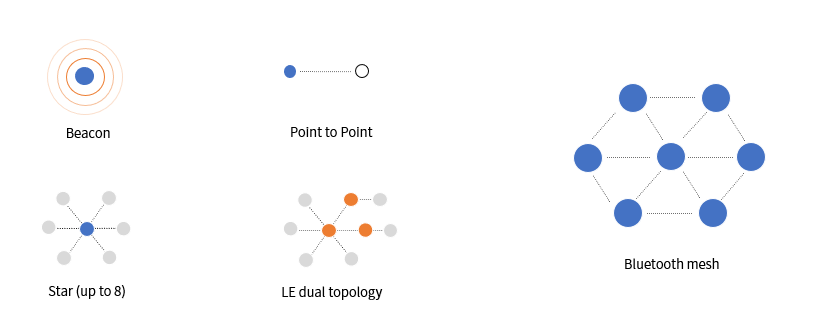

# 2. BLE 物理层和链路层
我们首先来了解BLE的物理层和链路层
## 2.1 BLE 物理层
BLE工作在2.4GHz ISM频段2402MHz-2480MHz. BLE定义了40个信道, 每个信道2MHz宽度. 其中有3个广播信道, 图中绿色标示的37, 38, 39信道. 它们被用于设备的发现, 广播等功能. 这三个信道所处的频段正好避开了和同样工作在2.4GHz频段的WiFi最常用的第1, 6, 11信道  减少正常通信的干扰. 其他37个信道用做BLE建立连接后的双向数据传输, 叫做数据信道. 在打开蓝牙的自适用跳频功能后, 设备将会自动侦测干扰来选择合适的工作信道. 这两种信道类型正是对应于BLE的两种主要通讯模式Advertising 和 Connection. 蓝牙Mesh在网络内部节点间的通信只采用了Advertising的方式

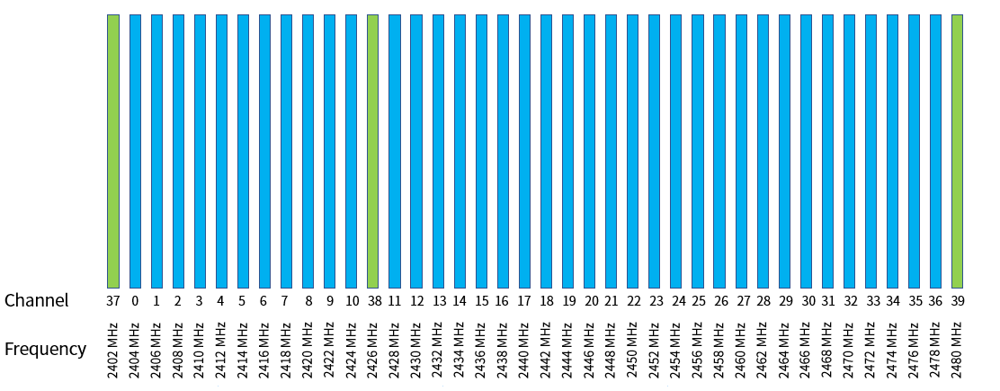

## 2.2 BLE 链路层
Advertising是指蓝牙广播设备在3个广播信道里以特定的时间间隔发送消息, 同时蓝牙扫描设备以特定时间长度的的扫描窗口和间隔, 依次扫描3个广播信道来接收广播设备发送过来的信息. 图中三个不同颜色的柱状图表示37,38,39三个广播信道. 广播设备连续在三个信道里发送消息, 间隔为20ms. 而扫描设备的扫描窗口时间为30ms, 扫描间隔为40ms, 一次扫描一个信道. 
蓝牙Mesh设备在网络内部通信时, 以尽可能接近100%的占空比来扫描广播信道. 也就是说扫描窗口时间等于扫描间隔, 以确保信息不会丢失. 
蓝牙Mesh设备在发送特定信息的时候并不会像普通BLE广播要等一个广播间隔, 而是延迟一小段随机时间就立即发送出去.

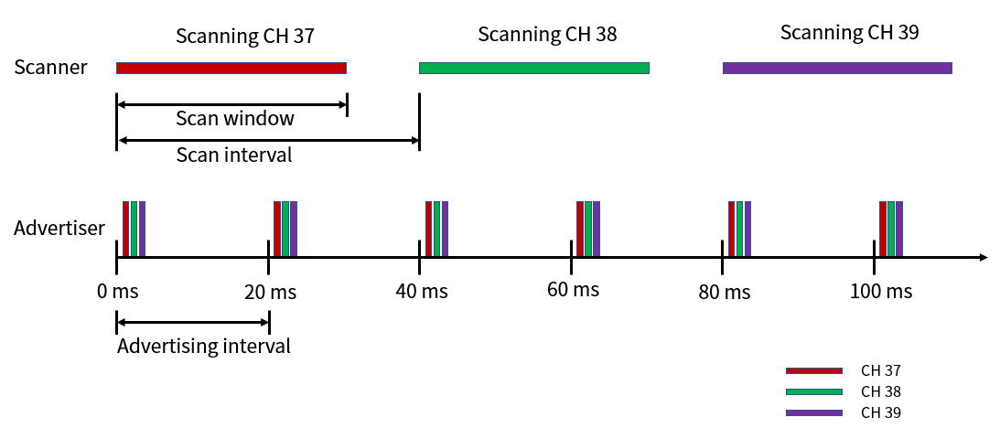

# 3. 蓝牙Mesh发布/订阅系统
蓝牙Mesh使用发布/订阅(publish/subscribe)消息系统. 就像你订阅的微信的公众号, 作者发布的文章会广播给每个订阅者. 微信作者就是发布者(Publisher), 而你就是一个订阅者(Subscriber). 我们来看看它的优点.
如图中所示 开关和灯是直接建立连接的. 那么每个灯要记住是那些开关能控制它, 而开关同样要记住那些灯是它要控制的. 

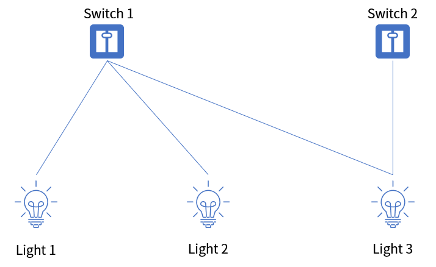

如果灯泡3坏了, 更换了一个灯泡4. 不仅灯泡4自己要设置哪那些开关要控制它, 而且同时开关1和2也要更新自己的设置, 把灯泡3的信息用灯泡4来替换. 系统里的个体的改动会影响到其他关联个体. 

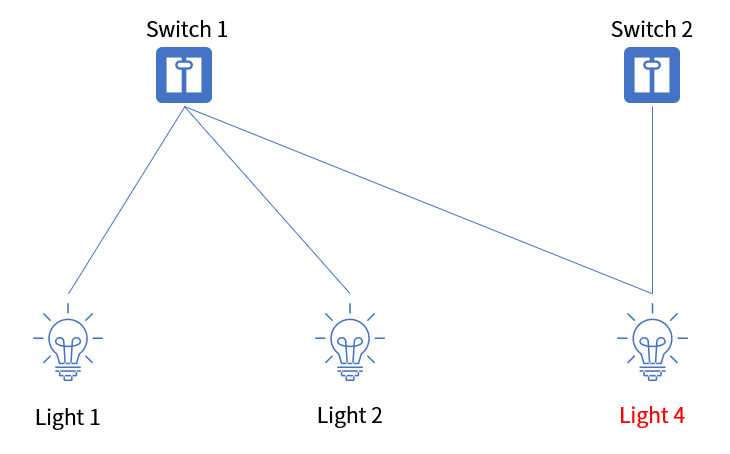

那么我们可以考虑引入组(Group)的概念来实现松耦合(independent). 我们把有关联的开关和灯放在同一个组, 并取个易懂的名称, 如厨房和花园. 开关发布消息到组地址, 而灯则订阅来自组地址的消息. 组成发布/订阅系统. 

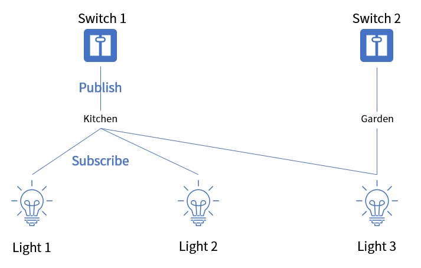

开关记录它要发布组地址列表, 灯则记录它的订阅组地址列表. 如果要更换灯泡, 只需要重新设置新灯泡里的订阅列表即可, 不用修改开关那边发布列表的设置. 开关只需要发布消息到厨房或花园的组播地址, 无需关心订阅者的情况.

# 4. 管理型网络泛洪
蓝牙Mesh网络使得设备可以在广阔的区域中安装, 同时每个设备之间保持通信. 消息可以在在无线覆盖范围之内的设备之间直接通信, 也可以通过中继设备和无线覆盖范围之外的设备通信. 消息可以被多次中继, 从而实现非常广阔的消息传输. 蓝牙Mesh采用的是管理型网络泛洪方式来进行网络信息的传输, 即网络中所有具备中继功能的设备都会转发收到的消息. 优点是无需特定的路由设备, 确保消息多路径传输无障碍的到达目的设备
缺点是可能会对网络消息泛滥造成通信延迟. 
所以蓝牙Mesh采用以下措施来优化泛洪通信来减少不必要的冗余信息传输
* **Message cache**: 
  设备都会缓存收到消息的关键信息, 以确定是否已经转发过此消息, 如果是就忽略此消息. Message cache需要至少能缓存两条消息.
* **Time to Live(TTL)**:
  每个消息都会包含一个Time to Live(TTL)的值, 来限制中继的次数, 最大可以中继126次. 消息每转发一次TTL的值就减1, TTL值为1就不再转发. 

# 5. 节点特性
蓝牙Mesh的节点都具有收发消息的功能, 同时节点可以选配一些特性, 如中继(relay), 代理(Proxy), 好友(Friend)和低功耗(Low Power).

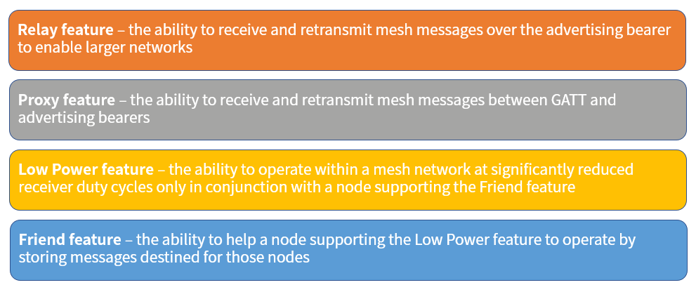

* **中继特性**:
  那些使能了此特性的节点可以通过Advertising Bearer接收并转发消息给mesh网络其他设备. 它只转发不在消息缓存和TTL的值大于1的消息, 转发前会把TTL的值减1. 这里的Bearer是指蓝牙Mesh协议中的承载层, 它主要是把BLE数据抽象并供上层使用. 目前定义了两种承载: 广播承载和GATT承载, 分别对应BLE的Advertising和Connection方式. 
* **代理特性**: 为了能够兼容市场上数十亿台不支持蓝牙Mesh的BLE设备如手机, 平板电脑等, 使能这个特性的节点能够采用BLE GATT Bearer的方式在数据信道和BLE设备通信, 并且代理节点会把来自手机和平板电脑的消息通过Advertising的方式转发给mesh网络其他设备. 
* **友谊特性**: 它包含两个子特性, 好友和低功耗特性. 对于功耗敏感比如纽扣电池供电设备使能低功耗特性, 在大部分时间处于休眠状态, 在较长的时间间隔醒来一次. 但是在睡眠期间的传递给它的消息就有很大可能错失掉, 于是使能好友特性的设备可以帮助与之组合的低功耗设备缓存消息, 低功耗设备从休眠中醒来后向它的好友设备查询消息并作出相应的处理. 

# 6. 网络拓扑
图中所示的蓝牙Mesh网络拓扑. 针对使能了不同特性的节点, 分别称呼为低功耗节点, 好友节点, 中继节点. 

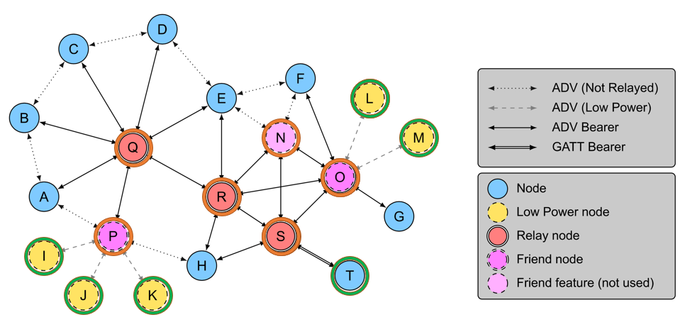

节点之间的连线表示无线信号覆盖范围内的直接连接, 对无线信号覆盖范围外的节点之间的通信需要经过中继节点. 如图中的Q,R,S进行消息转发到达目的节点. 图中有3个好友节点, 其中节点P和O分别有3个和2个低功耗节点组合, 好友节点N没有低功耗节点组合. 
节点T是BLE设备, 通过GATT Bearer方式和代理中继节点S进行通信, 节点S必须转发所有和节点T的消息传输. 比如BLE节点T要发送消息给低功耗节点L. 首先节点T通过GATT Bearer在数据信道发消息给节点S, 然后节点S通过Advertising Bearer方式在广播信道转发消息. 节点H,R,O,N都在其无线信号覆盖范围并接收到消息, 节点O作为低功耗节点L的好友会储存收到的消息, 在节点L从睡眠中醒来后会查询好友节点O来取得这个发送给它的消息并做相应的处理. 

# 7. 基础概念和术语
这里我们介绍蓝牙mesh的基础概念和术语. 

## 7.1 设备和节点
一个蓝牙设备(如插座)在没有加网前被称为Unprovisioned Device. 启动配置设备(Provisioner)通过Provisioning蓝牙设备
完成认证, 创建网络密钥, 蓝牙设备成为未配置的蓝牙节点(Node). 

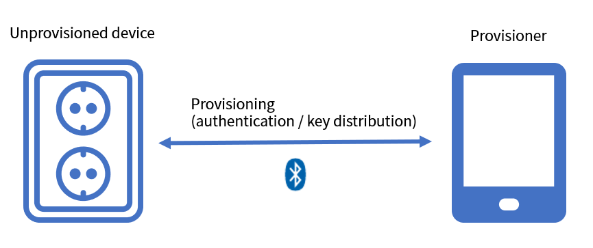

未配置好的节点是不能做任何事情的, Provisioner再进行节点配置
绑定应用层和网络层密钥, 设置模型的发布/订阅等. 完成上述动作后蓝牙设备(Device)成为蓝牙Mesh网络里的功能节点(Node)

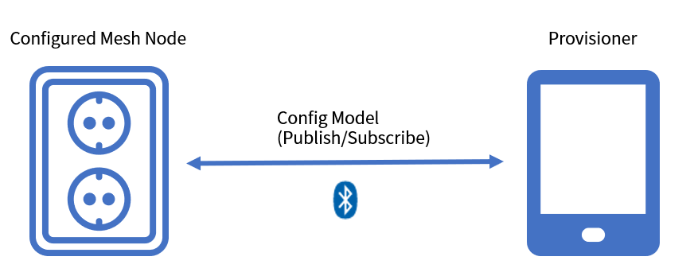

## 7.2 元素和地址
一个节点可以包含1个或多个元素(Elements), 比如一个双孔插座板, 每个插孔就是一个元素. 

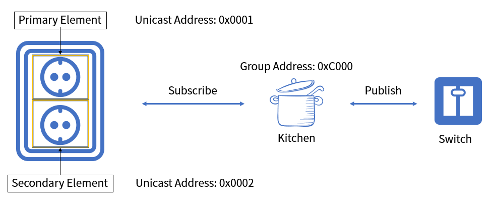

* 每个元素在加网的过程会被分配唯一的**单播地址**(Unicast Address), 地址范围是0x0001-0x7FFF. 
* 还有一个**组播地址**(Group Address)就是前面讲到的发布/订阅机制里的厨房, 花园等. 元素订阅特定的组播地址, 就会收到发布者发送到此地址的消息. 组播地址范围0xC000-0xFEFF. 
* 还有**虚拟地址**(Virtual Address), 每一个虚拟地址逻辑上对应一个128-bit的Label UUID. 通过对该Label UUID作哈希运算得出虚拟地址的低14位数值. 虚拟地址的范围为0x8000-0xBFFF. 

## 7.3 模型
模型(Models)顾名思义就是定义了基本功能的最小单位模型, 比如设备的开关 灯光亮度调节等
模型包含了三个部分:

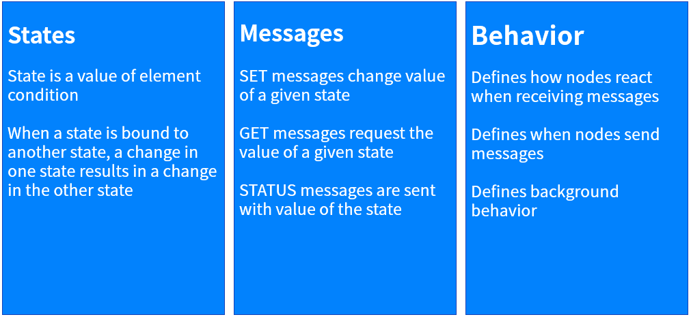

* **状态**(State)表明一个元素的当前状态. 比如灯泡中包含开关和亮度的状态值. 不同状态可以设置为绑定关系(Bound State). 比如灯泡亮度为非零值时, 开关状态应该是开. 而灯泡亮度调整到0的时候, 其开关状态也应该被设置为关闭.
* **消息**(Message)有SET/GET/STATUS三种类型, 分别用来设置请求发送状态值. 
* **行为**(Behavior)定义了模型在接收到消息后所作的动作行为. 比如开关模型定义的行为就是在收到了SET的消息后, On/Off的状态就要变为SET消息里给定的值. 如果收到了GET消息那么就把On/Off的状态通过STATUS消息传给询问方. 

蓝牙Mesh的消息通信是基于服务器/客户端的架构, 对外提供状态访问接口的叫做服务器(server), 而来访问服务器端状态的叫做客户端(client). 
模型分为三种:
* **服务器模型**(Server model): 定义了一个包括状态,绑定状态和消息的集合. 比如灯包含有通用开关服务器模型(Generic OnOff Server)
和灯亮度服务器模型(Light Lightness Server). 
* **客户端模型**(Client model): 定义了一群消息用来请求改变服务器端的状态. 客户端模型不含有状态(State). 比如开关中含有通用开关客户端模型(Generic OnOff Client)以及灯亮度客户端模型(Light Lightness Client). 
* **控制模型**(Control model): 可以包含上述两种模型的功能

目前SIG定义好的模型包括Generic, Sensors, Time and Scenes, Lighting. 客户产品如果不在列表的话可以定义Vendor Model来实现相应的功能. 

为了方便理解, 图中是灯和开关的模型简化示意图

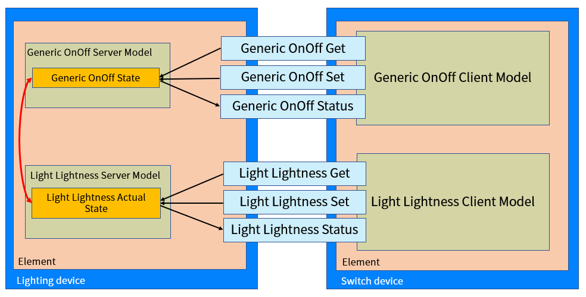

左边灯的元素中含有通用开关(Generic OnOff)和灯的亮度(Light Lightness)服务器模型, 分别包含通用开关(Generic OnOff)和灯亮度(Light Lightness Actual)状态. 两个状态是绑定状态关系. 

右边开关设备元素中包含了通用开关(Generic OnOff)和灯亮度(Light Lightness)客户端模型. 通过消息来获知设置服务器端元素的状态. 客户端模型不含有状态. 

# 8. 系统架构
蓝牙mesh的协议栈是层级结构

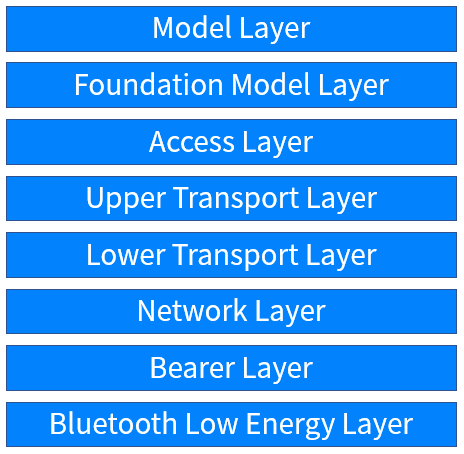

* 最低层就是**BLE层**, 就像一开始介绍的蓝牙mesh建立在BLE物理层和链路层之上, 采用Advertising和Connection两种数据传输方式. 
* **承载层**(Bearer Layer)把BLE层的数据抽象并供上层使用. 目前定义了两种承载: 广播承载和GATT承载. 分别对应BLE的Advertising和Connection方式. 
* **网络层**(Network Layer)负责基于地址的消息传输. 实现中继和代理特性以及对信息进行网络层加解密和认证行为. 
* **底层传输层**(Lower Transport Layer)负责将数据分段和重组. 
* **上层传输层**(Upper Transport Layer)负责应用层信息数据的加密, 解密和认证. 它还定义了节点间传输控制信息, 包括了朋友特性的应用实现. 
* **接入层**(Access Layer)负责定义应用数据的格式. 定义并控制应用数据在上层传输层的加密解密的过程. 它确保从下层接收到的数据是正确的并传输到更高层的应用. 
* **基础模型层**(Foundation Model Layer)负责定了状态, 消息, 模型等, 实现mesh网络的配置. 
* **模型层**(Model Layer)负责标准化用户应用场景的实例, 比如灯模型, 传感器模型等. 

# 9. 安全机制
最后我们谈谈蓝牙Mesh的安全机制. 

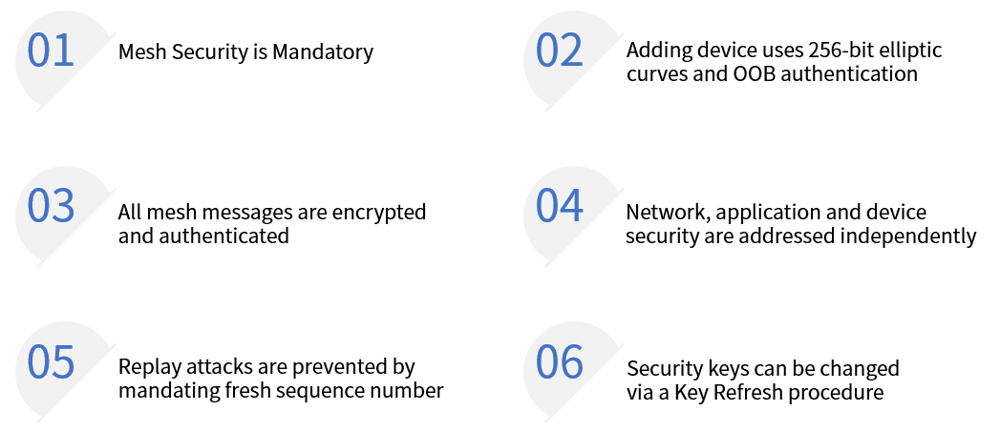

* 蓝牙mesh的安全是强制性的
* 设备加网的过程是采用了256 bit椭圆曲线加密和带外数据认证的方式
* 所有mesh的消息都经过128 bit AES-CCM加密和认证
* 加密和认证在网络层和应用层都得以实现
* 重发攻击被消息里包含强制更新序列号的方式所阻止
* 在mesh网络中通过刷新密钥来防止垃圾桶攻击

[video-tutorial]:https://www.bilibili.com/video/BV1DV411m7HV