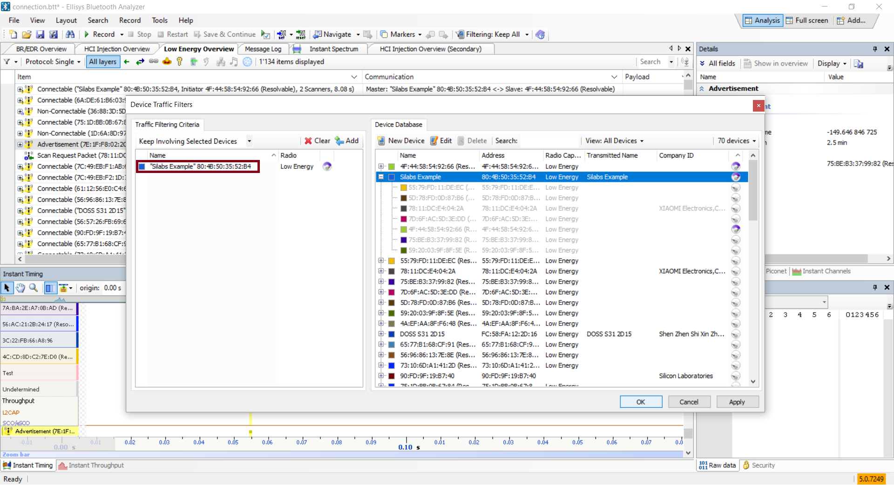
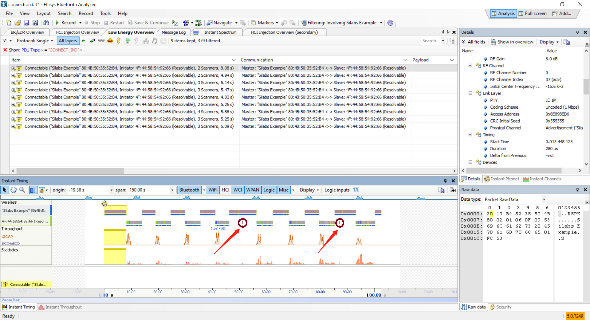
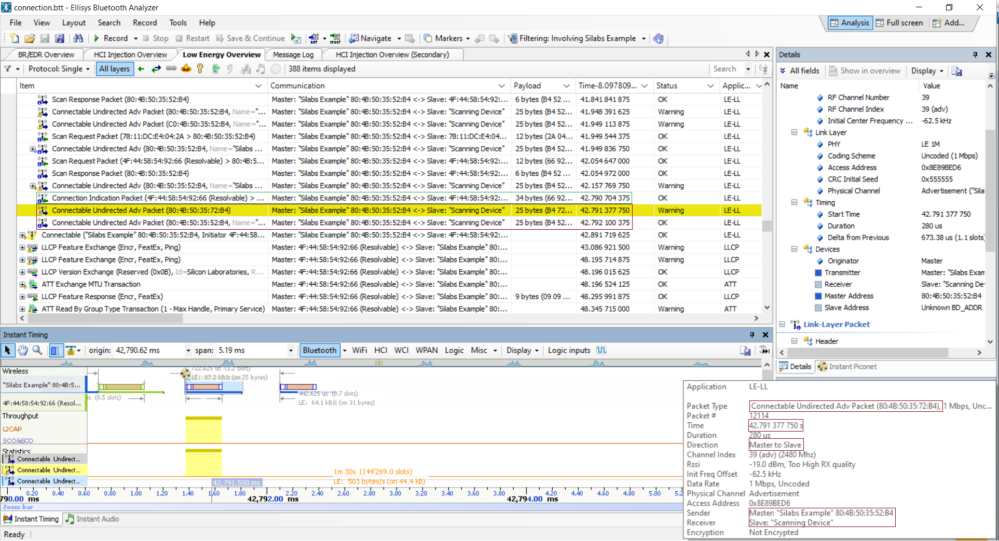
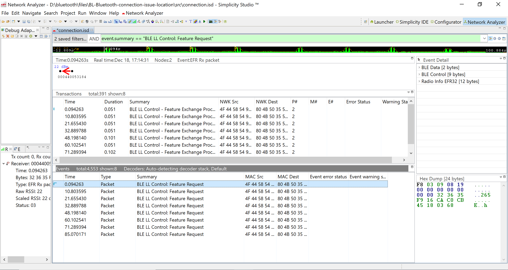
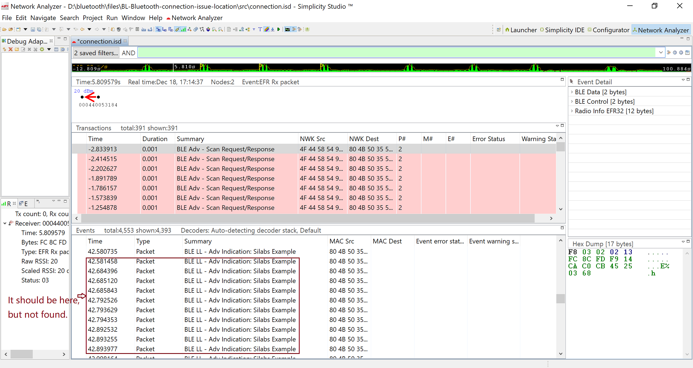

Table of Contents 

- [1. Introduction](#1-introduction)
- [2. Prerequiesite](#2-Prerequisite)
- [3. Analyzer Captured Data](#3-Analyzer-Captured-Data)
- [4. Conclusion](#4-Conclusion)

# 1. Introduction
Sometime Bluetooth GATT connect failure happen, to avoid or improve this, it needs to locate the failure cause by which side(GATT Client or Server) or stop at which step. The Simplicity Studio got the helpful tool Network Analyzer. Packets over the air can be captured by the WSTK and decoded detailly. The captured data is provided by the EFR32 device RF layer. In some case it is possible that the data don't even capture by EFR32 device RF layer, this will cause Network Analyzer cannot capture the data. Here introduce another powerful tool [Ellisys Bluetooth Tracker](https://www.ellisys.com/products/btr1), it designed to support concurrent capture and analysis of Bluetooth Low Energy and Wi-Fi communications, as well as a wide variety of wired interfaces. And analyzer BLE behave base on captured data on these 2 tools.

# 2. Prerequisite 

## 2.1. Hardware Requirement
* 1 [WSTK with EFR32MG22 radio boards(BRD4182A)](https://www.silabs.com/development-tools/wireless/efr32xg22-wireless-starter-kit)
* 1 smart phone, here use [HUAWEI BTV-W09](https://www.amazon.com/MediaPad-Android-Marshmallow-Moonlight-Warranty/dp/B01LB08BH6), Android 7.0
* 1 [Ellisys Bluetooth Tracker](https://www.ellisys.com/products/btr1)

The BRD4182A radio board supports three wireless protocols. Bluetooth LE/Mesh, Zigbee and Proprietary. Here use it on Bluetooth LE.

    

 
HUAWEI BTV-W09, Run EFR connect App for connect with EFR32xG22.

    

 
Ellisys Bluetooth Tracker, capture BLE packet over the air, include traffic between EFR32xG22 and smart phone.

    

 

## 2.2. Software Requirement
**Simplicity Studio** is a free Eclipse-based Integrated Development Environment (IDE) and a collection of value-add tools provided by Silicon Labs. Developers can use Simplicity Studio to develop, debug and analyze their applications. Use it Network Analyzer for packets capture.  

**Ellisys Bluetooth Analyzer** Support BLE air data concurrent capture, use for compare with data captured by Network Analyzer.

## 2.3. Data Capture
Download test software on EFR32xG22. Start both Network Analyzer and Ellisys Bluetooth Analyzer capture. Manually operate connect and disconnect on smart phone EFR connect. Retry several times then stop the capture and save the data. How to capture the air data, here will not going into the detail, refer these links for more information, [Network Analyzer](https://www.silabs.com/documents/login/presentations/tech-talk-using%20silabs-network-analyzer.pdf), [Ellisys Bluetooth Analyzer](https://www.ellisys.com/products/download/bta_manual.pdf).

# 3. Analyzer Captured Data
After captured, got [.btt](files/BL-Bluetooth-connection-issue-location/src/connecton.btt) file on Ellisys Bluetooth Analyzer and [.isd](files/BL-Bluetooth-connection-issue-location/src/connecton.isd) file on Network Analyzer.

## 3.1. Data on Ellisys Bluetooth Analyzer
Too many traffic on the data, set filter to make it more clear.

    

 
Show "Silabs Example" relevant packets only.

    

 
Filter the Connection Indication Packet to check how many connect request from the smart phone side.

    

 
Found 9 Connection Indication packets.

    

 
Found 10 feature request packets.

    

 
Found 8 feature response packets.

    

 
Found 8 termination packets.

    

 
According to above findings, there are 10 connect request from the smart phone, but only 8 connect successful, 8 connect termination.
There are only 9 Connection Indication packets after filtering, double check in "Instant Timing" view, it can found 10 Connection Indication packets, so this should be Ellisys Bluetooth Analyzer software's bug.
These findings same as test result, 10 connection tries 8 connect successful. Next step is locate which connect request fail.
Check over all traffic in "Instant Timing" view, there are 2 points looks different. 

    

 
To get the exact timing, set the first connection indication as time reference(0 point).

    

 
Zoom in and move to 42.7x", it can found the Connection Indication  Packet from the smart phone side, but "Silabs Example" device ignore and send out Connectable Undirected Adv Packet.
Checking the following packet, not found feature response packet. It is here.

    

 
The other connection failure point is the same, remember the time 42.7x", and check traffic at that point on Network Analyzer captured data.

## 3.2. Data on Network Analyzer
Here also need to filter the traffic.

    

 
Found 8 connection indication packets.

    

 
Found 8 Feature Request packets.

    

 
Found 8 Feature Response packets.

    

 
Found 8 Terminate packets.

    

 
According to this findings, on EFR32xG22 side, there are 8 connect request from the smart phone and 8 connect successful, 8 connect termination.

Set time 0 point at first connection indication packet, then it get the same time reference with Ellisys Bluetooth Analyzer. 

    

 
Move to 42.7x" point for checking. There should be a connection indication packet around time point 42.7x", but not found.

    

 

# 4. Conclusion
The smart phone side have sent out connection indication packet, but the EFR32xG22 device cannot catch and response, so the issue is cause by EFR32xG22 device side, it does not recieve the connection indication packet.
By set the time reference point at the first connection indication packet, it is easy to compare air data capture by Network Analyzer and Ellisys Bluetooth Analyzer, it helps to locate the issue cause by which side, which step.
