[English](Bluetooth-connection-issue-diagnostics) | Chinese

目录 

- [1. 介绍](#1-介绍)
- [2. 先决条件](#2-先决条件)
- [3. 分析捕获到的数据](#3-分析捕获到的数据)
- [4. 结论](#4-结论)

# 1. 介绍
开发过程中有时遇到蓝牙连接失败, 为了避免或改善这种情况, 需要定位连接失败的原因是哪一方 ( master / slave) 造成的或停在连接过程的哪一步. Simplicity Studio 有个很有用的工具 Network Analyzer, 使得无线数据包可以被WSTK捕获并进行详细解码. 捕获的数据由 EFR32xG22 设备 RF 层提供. 在某些情况下, EFR32xG22 设备 RF 层可能没有正常捕捉到数据, 这直接导致 Network Analyzer 无法获取数据. 这里介绍另一个强大的工具 [Ellisys Bluetooth Tracker](https://www.ellisys.com/products/btr1), 可以用来对 BLE 或 Wi-Fi 通信的并发捕获和分析, 同时也支持各种的有线接口. 可以在这两个工具上捕获的数据基础上分析 BLE 的行为. 前些时间收到客户反馈, 客户做完静电测试与老化测试后, 特定的一些EFR32xG22有时遇到蓝牙连接失败, 客户把坏片送来检验, 我们将坏片换到 BRD4182 radio 板上去复现问题。下面讨论根据这两个工具如何诊断和定位问题. 

# 2. 先决条件 

## 2.1. 硬件要求
* 1 [WSTK with EFR32xG22 radio boards(BRD4182A坏片板)](https://www.silabs.com/development-tools/wireless/efr32xg22-wireless-starter-kit)
* 1 智能手机, 这里用 [HUAWEI BTV-W09](https://www.amazon.com/MediaPad-Android-Marshmallow-Moonlight-Warranty/dp/B01LB08BH6), Android 7.0
* 1 [Ellisys Bluetooth Tracker](https://www.ellisys.com/products/btr1)

BRD4182A radio 板支持三种无线协议,  Bluetooth LE/Mesh, Zigbee and Proprietary. 这里用的是 Bluetooth LE.

  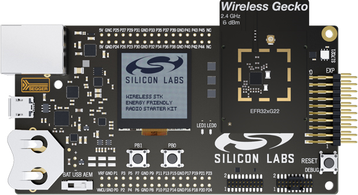  

 
华为 BTV-W09, 通过 EFR connect 来与 EFR32xG22 连接.

    

 
Ellisys Bluetooth Tracker, 并发抓取空中数据包, 包括 EFR32xG22 和智能手机之间通信的数据包.
  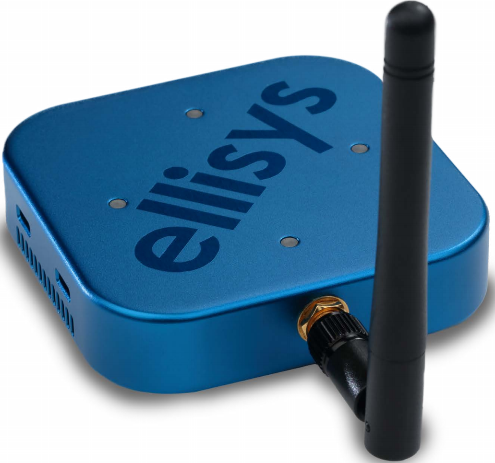  

 

## 2.2. 软件要求
**Simplicity Studio** 是一个免费的基于 Eclipse 的集成开发环境 (IDE), Silicon Labs 在此基础提供了一系列的非常有用的工具. 开发人员可以使用 Simplicity Studio 来开发, 调试并分析其应用程序. 这里用它的 Network Analyzer 抓包.  

**Ellisys Bluetooth Analyzer** 支持空中数据并发捕获, 用于与 Network Analyzer所捕获的数据进行比较.

## 2.3. Data Capture
对 EFR32xG22 烧录测试软件. 启动 Network Analyzer 与 Ellisys Bluetooth Analyzer. 操作智能手机应用 EFR connect 连接和断开. 重复测试几次, 然后停止并保存数据. 如何捕捉数据, 这里将不深入细节, 参阅这些链接了解更多信息 [Network Analyzer](https://www.silabs.com/documents/login/presentations/tech-talk-using%20silabs-network-analyzer.pdf), [Ellisys Bluetooth Analyzer](https://www.ellisys.com/products/download/bta_manual.pdf).

# 3. 分析捕获到的数据
抓到数据后，Ellisys Bluetooth Analyzer会保存成[.btt](files/BL-Bluetooth-connection-issue-diagnostics/src/connecton.btt) 文件，Network Analyzer 会保存成 [.isd](files/BL-Bluetooth-connection-issue-diagnostics/src/connecton.isd) 文件.

## 3.1. Data on Ellisys Bluetooth Analyzer
太多数据包了, 设置过滤条件, 方便分析.

  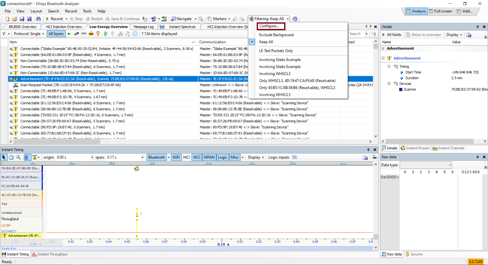  

 
只显示 "Silabs Example" 相关的数据包.

  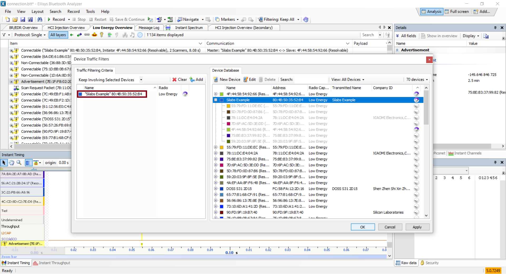  

 
过滤只保留 Connection Indication 包来检验从智能手机端发出多少次连接请求.

  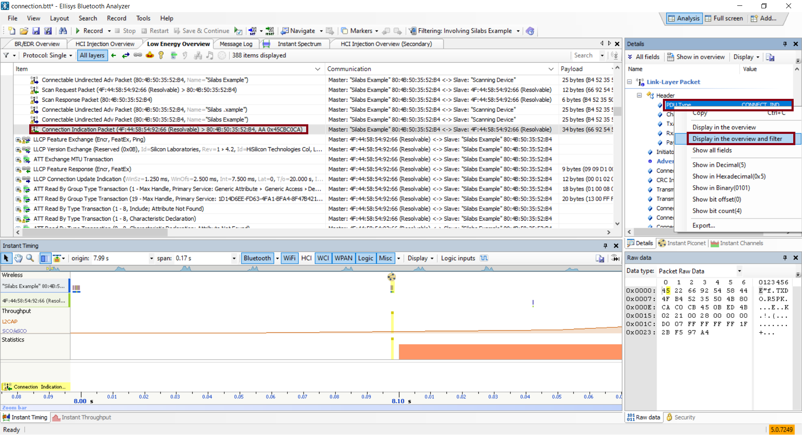  

 
有 9 个 Connection Indication 包.

  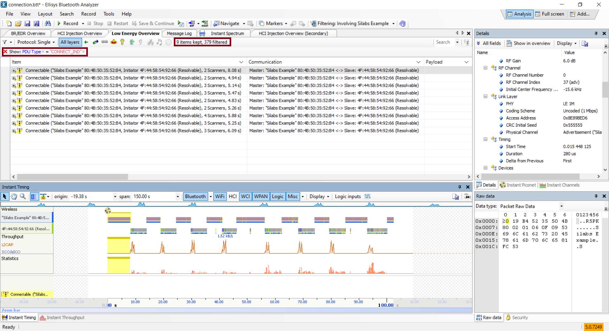  

 
有 10 个 feature request 包.

  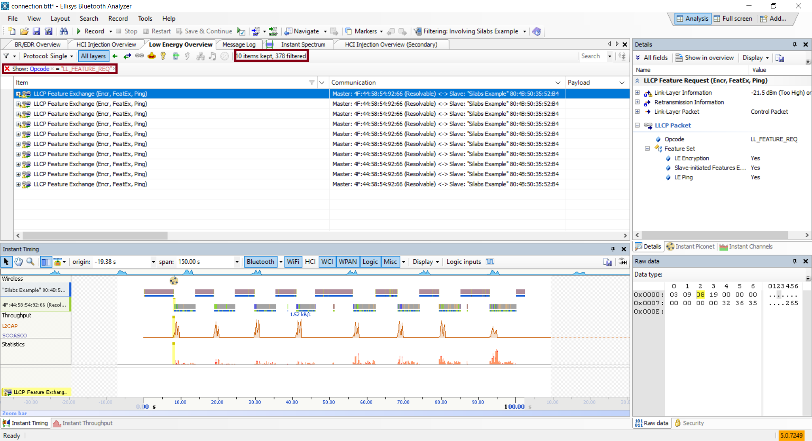  

 
有 8 个 feature response 包.

  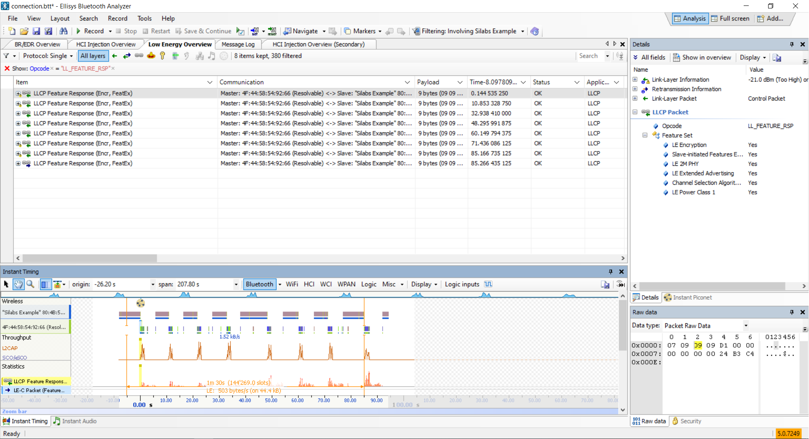  

 
有 8 个 termination 包.

  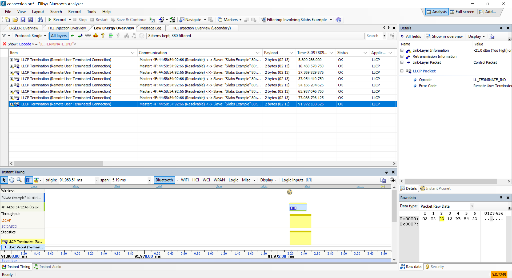  

 
从上述信息看, 智能手机端发出了 10 次连接请求, 然而只有 8 次连接成功, 8 次连接终止.
过滤后只有 9 个 Connection Indication 包, 这点存疑, 通过 仔细检查 "Instant Timing" 窗口, 发现有 10 个 Connection Indication 包,所以这应该是 Ellisys Bluetooth Analyzer 软件 bug.
上述发现与实际测试结果吻合,  10 次连接尝试, 8 次连接成功. 下一步就是要定位哪次连失败了.
在 "Instant Timing" 窗口观察所有数据包, 发现有两个地方不一样. 

  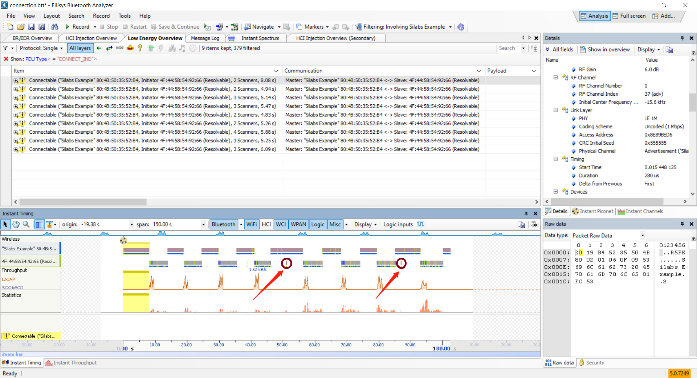  

 
为了获得准确的时间参照点, 将第一个 Connection Indication 设置为时间参考 0 点.

  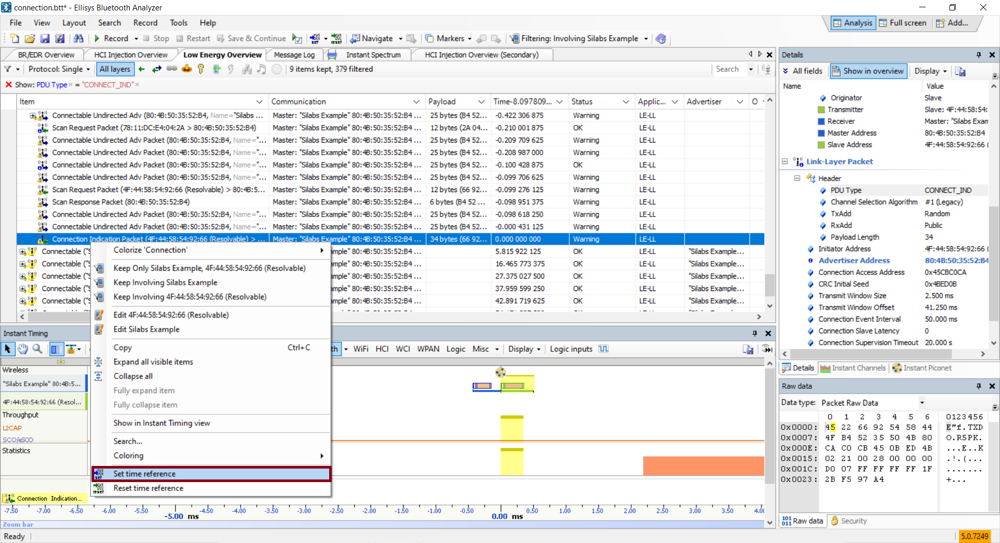  

 
放大并移到 42.7x 秒处, 能看到有从智能手机发出来的 Connection Indication 包, 但 "Silabs Example" 设备没有对其有反应而是直接再发Connectable Undirected Adv 广播包.
检查其后边的几个数据包,  没有发现有 feature response 包. 问题就在这里了.

  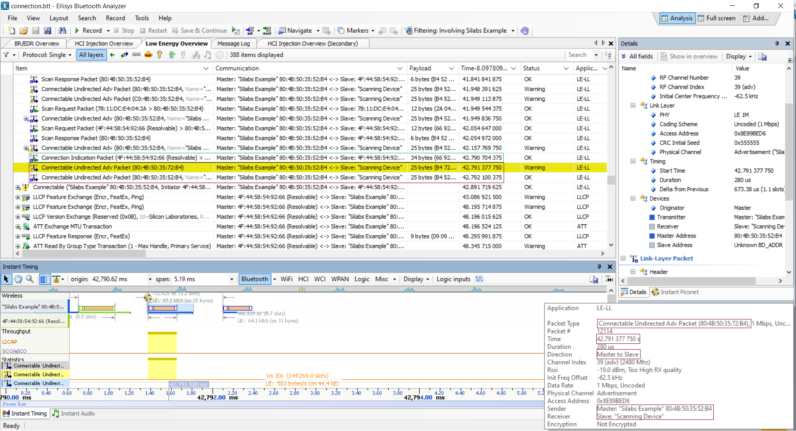  

 
还有另一处问题点也可以通过同样的方法定位到. 现在记住这个 42.7x 秒的时间点, 等下需要在 Network Analyzer 所用抓数据中, 看这个时间点的数据.

## 3.2. Data on Network Analyzer
这里同样需要过滤一些空中数据.

  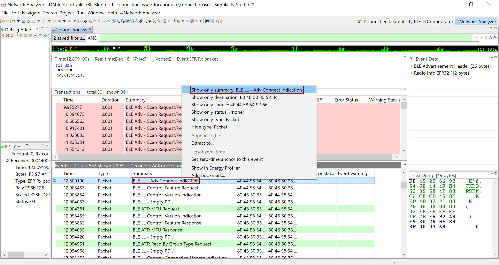  

 
过滤后, 有 8 个 connection indication 包.

  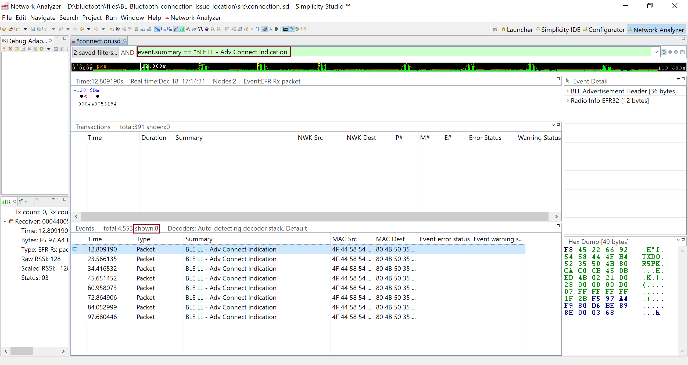  

 
有 8 个 Feature Request 包.

  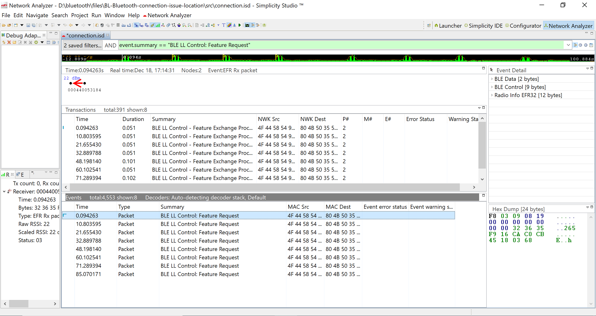  

 
有 8 个 Feature Response 包.

  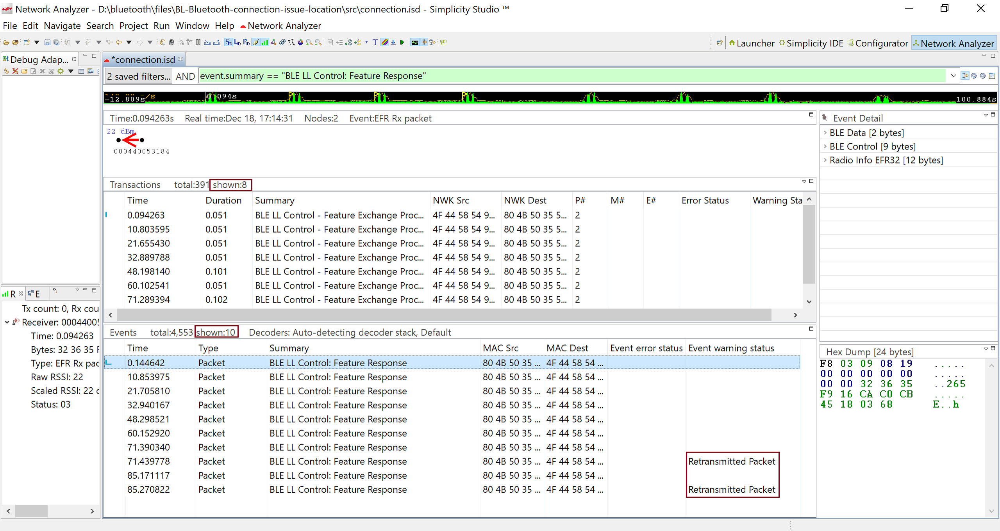  

 
有 8 个 Terminate 包.

  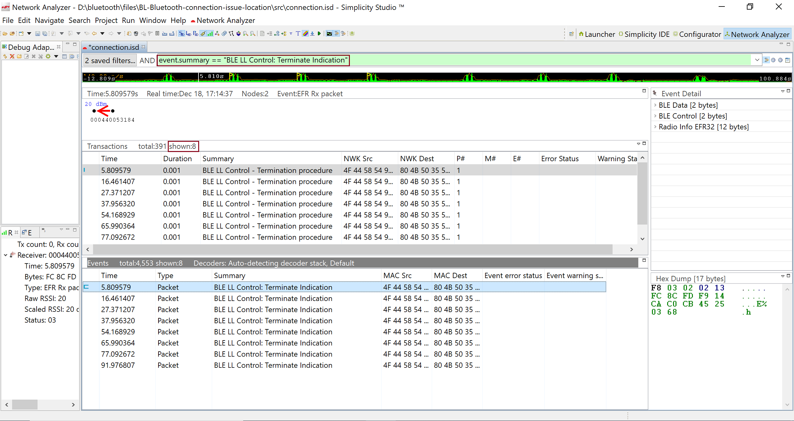  

 
从上述结果来看, 在 EFR32xG22 这边, 收到来自智能手机的 8 个连接请求, 8 次连接成功, 8 次连接终止.

同样以第一个connection indication 包设为时间轴 0 点, 这样能得到与Ellisys Bluetooth Analyzer匹配的时间轴. 

  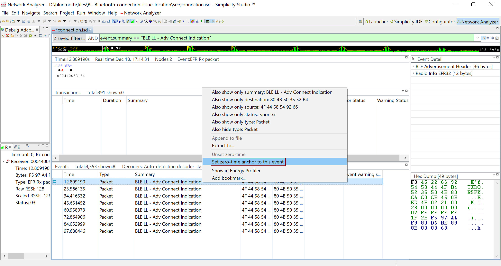  

 
转到 42.7x 秒处去检查, 时间点42.7x 秒前后本应有一个 connection indication 包,  在这里并没有出现.

  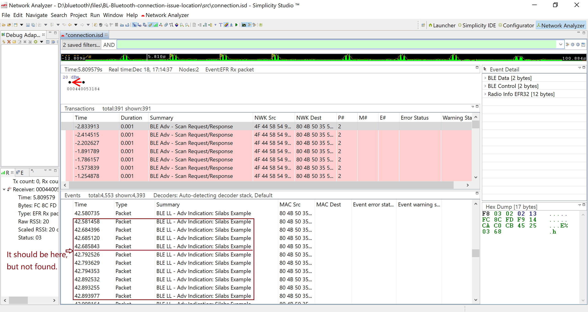  

 

# 4. 结论
智能手机侧已经发送了connection indication包, 但是坏片 EFR32xG22设备无法捕捉到并做响应, 所以这个问题是由坏片 EFR32xG22设备侧造成的, 它没能收到 connection indication包.
通过在第一个connection indication包上设置时间参考点, 很容易比较Network Analyzer 与 Ellisys Bluetooth Analyzer捕获的空气数据, 这样有助于定位问题是由哪边, 哪一步引起的.
