[English](BLE-Interoperability-Test-and-Common-Issue-Diagnostic.md) | 中文 

<details>
<summary><font size=5>Table of Contents</font> </summary>

- [1.  概要](#1--概要)
- [2. IOP 测试](#2-iop-测试)
  - [2.1. 基本要求](#21-基本要求)
    - [2.1.1. 硬件要求](#211-硬件要求)
    - [2.1.2. 软件要求](#212-软件要求)
    - [2.1.3. 手机应用要求](#213-手机应用要求)
    - [2.1.4. 手机操作系统版本最低要求](#214-手机操作系统版本最低要求)
  - [2.2. 配置 IOP 测试](#22-配置-iop-测试)
  - [2.3. 执行 IOP 测试](#23-执行-iop-测试)
  - [2.4. 日志与数据分享](#24-日志与数据分享)
- [3. 诊断工具](#3-诊断工具)
  - [3.1. UART 日志](#31-uart-日志)
  - [3.2. 网络分析仪](#32-网络分析仪)
  - [3.3. 智能手机 btsnoop 日志](#33-智能手机-btsnoop-日志)
  - [3.4. 第三方监听器](#34-第三方监听器)
  - [3.5. 频谱分析仪](#35-频谱分析仪)
- [4. 实例分析](#4-实例分析)
  - [4.1. 智能手机无法发现新开发的BLE设备](#41-智能手机无法发现新开发的ble设备)
    - [现象](#现象)
    - [原因是什么呢](#原因是什么呢)
  - [4.2. 写特征值导致连接断开](#42-写特征值导致连接断开)
  - [4.3. 吞吐量](#43-吞吐量)
- [参考](#参考)

</details>

# 1.  概要
互操作性 (IOP) 是蓝牙的基石，也是现在蓝牙设备无处不在的关键原因之一。
它使最终用户能够混搭使用不同供应商设备，而不必担心连接问题。
例如，B 公司的智能手表可以连接 A 公司的心率监测器，来检索并显示心率信息。

因此，当厂家为其产品设计寻找蓝牙方案时，
方案供应商是否可以提供在其蓝牙解决方案与第三方设备之间IOP测试的方法，这一点是至关重要的。

蓝牙设备最常见的用例之一是与智能手机交互，其中手机应用程序对蓝牙设备发送指令和控制。
由于智能手机存量巨大, 硬件（即蓝牙芯片组）, 蓝牙软件（BLE Link Layer, BLE host stack), 还有OS版本差异大，智能手机用来做IOP测试是各大蓝牙芯片厂商常规作法。

<div align="center">
  
</div>

未做互操作性测试可能会出现如下风险,
- 设备无法被发现
- 连接不可靠
- 操作不正常
- 数据丢失

芯科科技提供一个软件架构来测试EFR32系列soc与目前市场上大量智能手机之间的互操作性。这个软件框架用于定期对大量设备进行互操作性测试。

我们有两个相关的应用说明文档, [AN1346](https://www.silabs.com/documents/public/application-notes/an1346-running-ble-iop-test.pdf) 描述了由硬件套件组成的芯科科技互操作性测试框架。

[AN1309](https://www.silabs.com/documents/public/application-notes/an1309-ble-interop-testing-report.pdf) 提供测试设置详细信息、测试用例及基于智能手机的测试结果。

# 2. IOP 测试
## 2.1. 基本要求
### 2.1.1. 硬件要求
IOP嵌入式软件可用于芯科科技几乎所有支持蓝牙的开发板。

### 2.1.2. 软件要求
我们从Bluetooth SDK 3.3.0开始，提供IOP测试的例程，Bluetooth SDK 是 Simplicity Studio 5 的一个组成部分。关于 Simplicity Studio 5 的更多信息请参考 [Simplicity Studio 5 documentation](https://docs.silabs.com/simplicity-studio-5-users-guide/5.2.1/ss-5-users-guide-getting-started/install-ss-5-and-software).

### 2.1.3. 手机应用要求

在手机上使能IOP测试，需要安装EFR connect 这个应用，版本2.4 或更新的版本。这个应用有 [Android](https://play.google.com/store/apps/details?id=com.siliconlabs.bledemo&hl=en&gl=US) 与 [iOS](https://apps.apple.com/us/app/efr-connect/id1030932759) 两个版本，原码可以从[GitHub](https://github.com/SiliconLabs?q=efrconnect&type=&language=&sort=)获取.

请确保在做IOP测试之前，手机 **没有已绑定** 将要测试的EFR32设备，可以从手机的蓝牙设定中确认。如果有已绑定的设备，请在执行测试前删除。

### 2.1.4. 手机操作系统版本最低要求

EFR Connect 应用要求的最低操作系统版本为 Android™ 9 或 iOS®12。

## 2.2. 配置 IOP 测试

IOP 测试包括在手机设备和运行互操作性测试嵌入式软件的 EFR32 SoC 之间执行的一系列 BLE 操作。

<div align="center">
  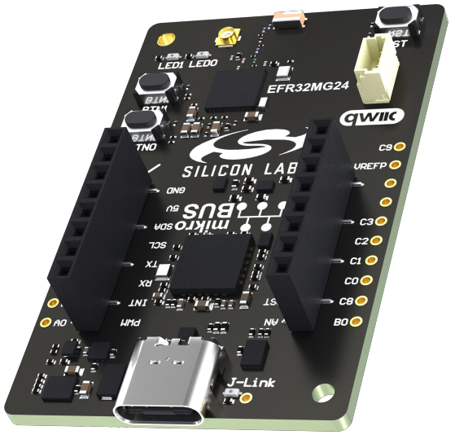
</div>

给要测试的板创建一个 **Bluetooth - SoC Interoperability Test** 工程，编译并烧录。

运行脚本 **iop_create_bl_files.sh** (MacOS/Linux用) 或 **iop_create_bl_files.ps1** (Windows powershell用). 脚本会在工程下的*output_gbl* 文件夹里生成两个gbl文件 *ota-dfu_ack.gbl* 与 *ota-dfu_non_ack.gbl*。

<div align="center">
  
</div>

在IOP测试期间，这两个文件要提供给EFR Connect手机应用。将文件复制到手机本地存贮空间或手机可以访问到的网络云盘。*ota-dfu_ack.gbl* 给前面一个 OTA 测试用， *ota-dfu_non_ack.gbl* 给后面一个 OTA 测试.

Bootloader也要烧录，不然程序可能跑不起来。烧bootloader，可以自己给相应的芯片建一个bootloader工程, 或烧录 Launcher 视图中 预编译的 **Demo**, 如 **Bluetooth - SoC Thermometer** 。 烧录 预编译的 **Demo** 会同时把bootloader 和 应用程序 一起烧到EFR32设备上。 然后重新烧一次相应的正确的应用程序把原有的覆盖了就可以了。

烧录好之后，EFR32 设备会有提示信息，可能从主板LCD显示，也可以是UART debug 打印，有些板可能没有LCD等显示屏，这种情况下可以在PC 串口端查看信息，如下。

<div align="center">
  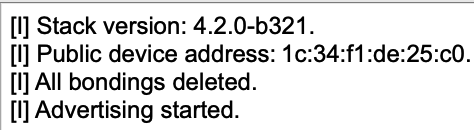
</div>

在智能手机上，启动 EFR Connect app，app会自动打开Develop视图。 点击Interoperability Test图块以检索显示附近在运行 IOP 测试软件设备的列表。 点击要测试的设备。 App会自动转到 IOP 视图，可以点击“Run Tests”开始测试。

<div align="center">
  
</div>

## 2.3. 执行 IOP 测试

在 IOP 测试开始运行后，app会按顺序检验测试相应的用例，并在测试完成时指示 Pass/Fail，如下图所示。

<div align="center">
  
</div>

除了OTA 与 security 测试外，大多数测试不需要用户干预.

在 OTA 测试期间，app会提示上传 gbl 文件。 可以使用 OS 标准方法从本地或云存储中检索该文件。 第一个 OTA 测试，必须使用 *ota-dfu_ack.gbl*，第二个 OTA 测试，必须使用 *ota-dfu_non_ack.gbl*。

<div align="center">
  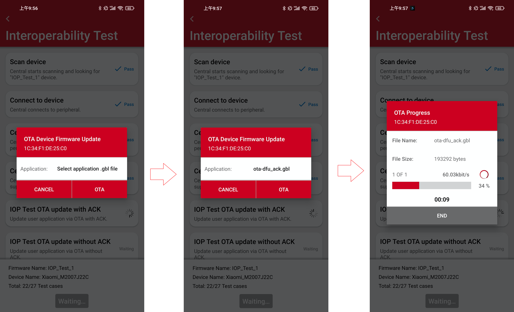
</div>

在security测试过程中，会多次提示手机端与设备绑定。 其中有提示需要简单的确认（Just Works 配对），也有提示需要输入 PIN（经过身份验证的配对），PIN key 可以从主板显示屏或 UART 日志中读取。

<div align="center">
  
</div>

<div align="center">
  
</div>

## 2.4. 日志与数据分享

在app完成测试后，可以重新运行测试或分享结果。

<div align="center">
  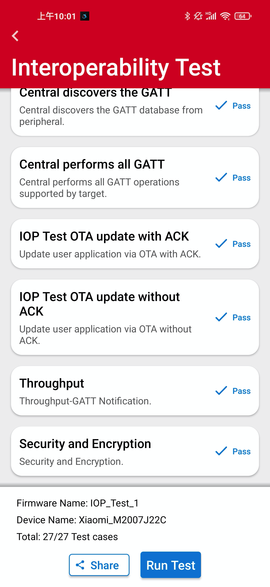
</div>

如果要重新运行测试的话，首先要**复位EFR32设备**，通过按板上的reset按键。另外需要手机上也要**删除已绑定**设备信息。

上图中 *Share* 选项允许通过操作系统标准介质共享测试日志，例如云存储（例如，Dropbox、Google Drive、iCloud 等）或电子邮件，或将其保存在本地。 该日志为 xml 格式，包含有关手机型号、操作系统版本、蓝牙连接参数和每次测试结果的信息。 以下是在搭载 Android 10 的 Redmi Note 9 上运行 IOP 测试的测试日志示例。请为我们保存并分享测试日志。请分享到[IOP test report](https://forms.office.com/Pages/ResponsePage.aspx?id=ItjbVDFSIEuUTW9KvNVB-zbTuzn4jSBMi-DX0CwRTpVUREsyTVZETFdaQ0RWRlhaUzRTVE4wWjVQSC4u&wdLOR=c13C01B02-3CE9-6944-8764-F62B8159186A)。


<div align="center">
  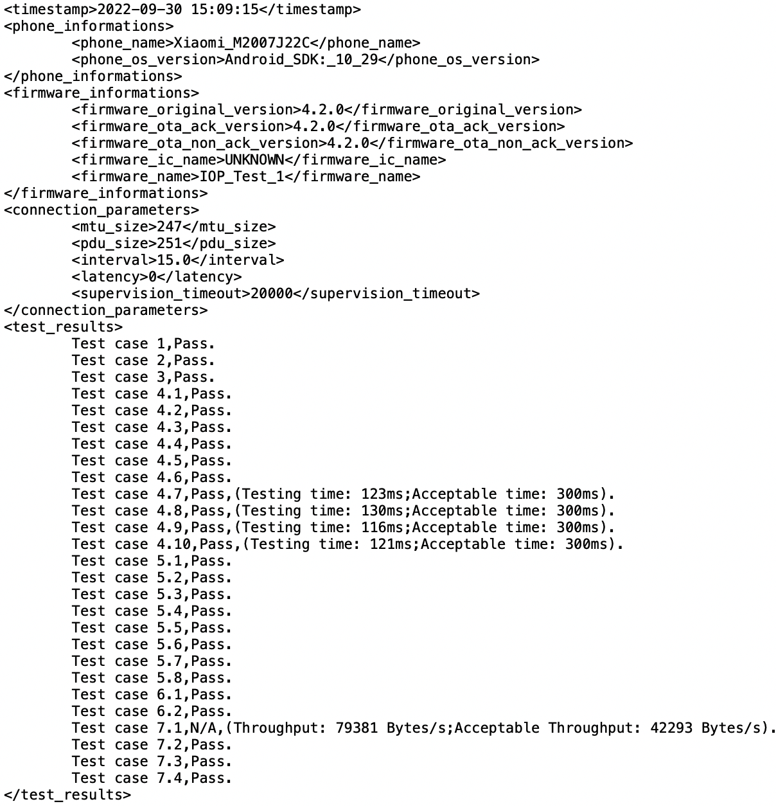
</div>

# 3. 诊断工具
互操作性测试不是最终目的，只是用来检查开发中的BLE设备是否有问题，并在产品开发阶段把问题解决。
除了调试运行这种老方法，还有下面一些常用的调试和分析方法。

## 3.1. UART 日志
这个是通过 UART 发送记录数据，这些数据可以被 PC 上的串口终端捕获。
SSv5下BLE工程，需要安装以下 software components:
   1. Services -> IO Stream -> IO Stream: USART
   2. Application -> Utility -> Log

然后以这种方式添加日志。 这样我们可以在可疑点打印日志或注销一些关键参数。
```c
      app_log("This is a bug!\r\n");
```      
## 3.2. 网络分析仪 
使用网络分析仪，用户可以通过称为数据包跟踪接口 (PTI) 的专用串行硬件接口访问无线电收发器的数据缓冲区。 然后可以通过 USB 或以太网将 PTI 数据传输到运行 Simplicity Studio 的计算机。 然后，时间戳数据可以在网络分析仪中进行解释和显示。 网络分析仪作为 Simplicity Studio 工具集的一部分提供。

PTI 是一个直接 提供对无线电发射器/接收器帧控制器的串行数据访问 接口。 大多数芯科科技的开发套件都嵌入了 PTI 并可以直接使用。 PTI 引脚是公开的或配置的，定制硬件时也可以使用网络分析功能。 这个接口是在硬件中实现的，因此应用程序没有额外的软件开销。

<div align="center">
  
</div>

时钟和数据信号连接到帧控制器以监控芯片接收/发送的所有数据包。 在芯片中，有一个专用的信号用于触发调试适配器对每一个PTI帧加注时间戳。 Network Analyzer 可以从任何连接的适配器的节点捕获数据，可以同时在多个节点捕获数据。 可以显示来自实时会话和录制会话的数据。 Network Analyzer 将会话数据保存到 ISD (.isd) 文件，该文件是存储会话数据和网络状态的压缩文件。 其中，网络状态也包含用户所修改的显示设置，网络分析仪会在重新加载会话文件时恢复这些设置。

要开始抓取无线电数据，右键单击调试适配器并选择"Connect"。 然后，再次右键单击调试适配器并选择"Start Capture"。

<div align="center">
  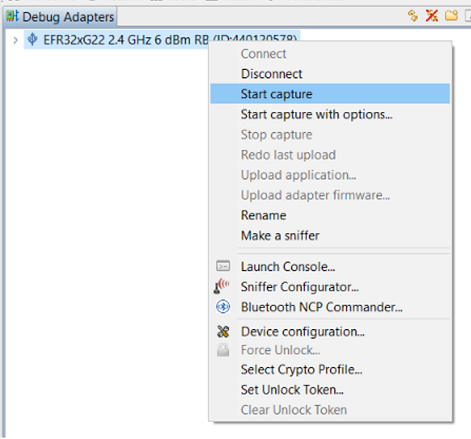
</div>

这会自动打开网络分析仪视图，其中记录了交互数据，并且可以对每个数据包进行解码，以便在需要时进行进一步分析。 在测试或捕获结束时，可以通过 File -> Save as 保存跟踪记录，如下图所示。

<div align="center">
  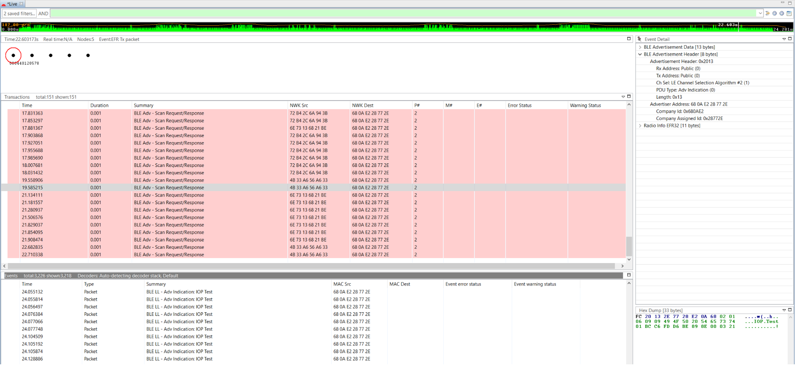
</div>

## 3.3. 智能手机 btsnoop 日志
大多数 Android 手机都支持 snoop HCI 日志功能，让用户可以检查手机端发生的事情（命令和事件）。 这个日志功能需要在开发人员选项中启用该功能。
如何访问开发者选项和启用 Snoop HCI 日志记录因手机而异，日志文件存贮位置也可能不同，因此需要根据手机型号搜索信息和方法。

<div align="center">
  
</div>

以红米Note 9为例，在键盘输入 **\*#\*#5959#\*#\*** 启动和停止snoop日志，日志文件保存在/sdcard/MIUI/debug_log/common/bt_log.../CsLog_.../BT_HCI_....cfa。

可以用 [Frontline Capture File Viewer](https://fte.com/support/download.aspx?demo=SD&type=capture&iid=1v)
查看这个类型的log文件。

<div align="center">
  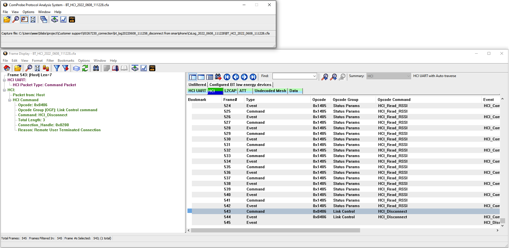
</div>

## 3.4. 第三方监听器
可以捕获空中所有数据包的嗅探器在分析问题时真的有帮助，有时候需要检查所有这些日志以诊断是否有 IOP 问题。 这里介绍一下 [Ellisys Bluetooth tracker](https://www.ellisys.com/products/btr1/download.php)。 支持并发捕获BLE空中数据包。

<div align="center">
  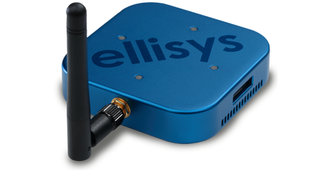
</div>

文件以 *.btt 后缀保存.
<div align="center">
  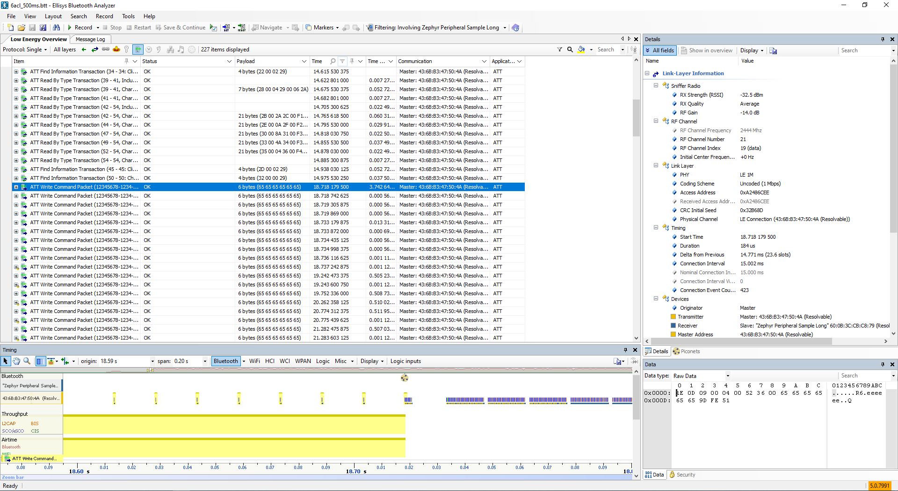
</div>

## 3.5. 频谱分析仪
有时需要检查射频特性，会用到频谱分析仪。这里介绍 [Anritsu MS2692A](https://www.anritsu.com/en-US/test-measurement/products/ms2692a), 这是一个强大的工具，可以检查发射功率，频率，甚至可以解析空中数据包。

<div align="center">
    
</div> 

# 4. 实例分析
在新产品开发过程中，可能会遇到各种问题，我们举些例子，使用上面提到的日志或工具进行诊断。

## 4.1. 智能手机无法发现新开发的BLE设备
### 现象
- UART日志指示设备已系统启动，有广播
- 网络分析仪可以看到广播信息
- 就是无法通过扫描设备（如智能手机）检测到

<div align="center">
  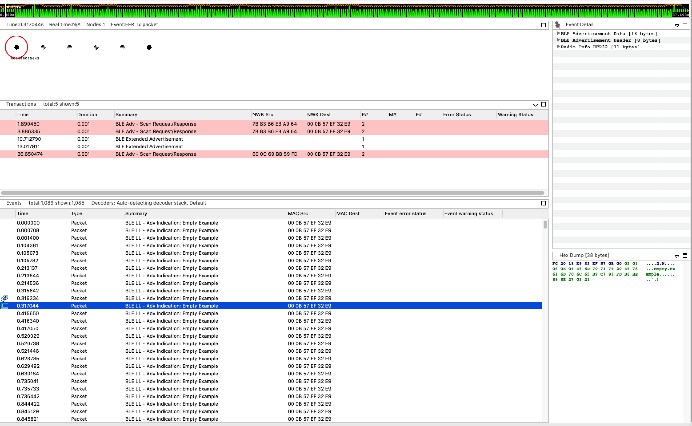  
</div> 

### 原因是什么呢
对于这类问题，首先怀疑的应该是中心频率偏移。
根据 [UG434](https://www.silabs.com/documents/public/user-guides/ug434-bluetooth-c-soc-dev-guide-sdk-v3x.pdf),  HFCLK 精度要保证在 ±50 ppm 以内。 
所以我们应该首先通过频谱仪检查中心频率偏移。 我们使用MS2692A信号分析仪，辐射测试就可以。

在 EFR32 设备应用程序上，需要以下软件组件来支持应用程序级别的射频测试。
- Bluetooth -> Stack -> DTM -> Direct Test Mode

在 sl_bt_evt_system_boot_id 下添加下面的代码片段，让它进入 DTM 并发出 CW 信号。 检查通道 0，2.402GHz。
```c
      sc = sl_bt_test_dtm_tx_cw(sl_bt_test_pkt_carrier,
                                0,
                                sl_bt_test_phy_1m,
                                100);
      app_assert_status(sc);
      break;
```   
进入 DTM 测试模式，也可以使用 NCP 模式, 参考 [AN1267](https://www.silabs.com/documents/public/application-notes/an1267-bt-rf-phy-evaluation-using-dtm-sdk-v3x.pdf).

如果发现中心频率偏移大，则应通过配置 Ctune 进行微调。
<figure>
  
  
</figure>

先用这个命令读取当前值.
```bash
commander ctune get
```
然后设置并在频谱仪上检查中心频率，如果仍然不符合要求，然后再重复一次或多次。 对于 EFR32 系列 2，取值范围为 0 到 511。数值越小，频率越高。

```bash
commander ctune set --value xxx
```
<figure>
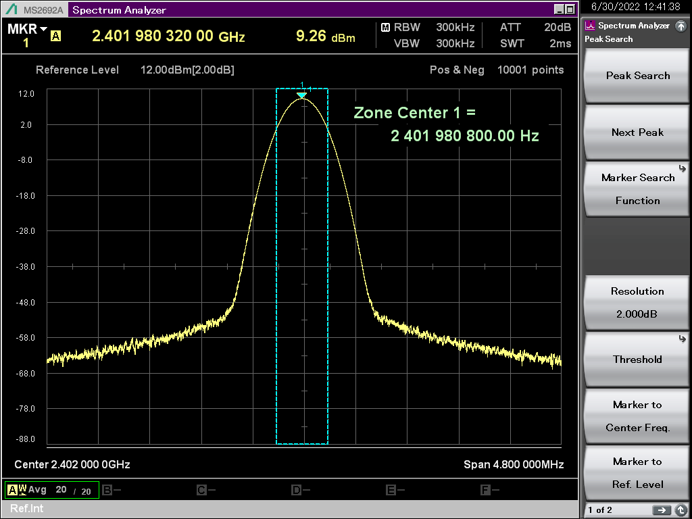  
  
</figure>

调好频率后，注释掉debug DTM代码并烧录，运行，再次扫描，此时设备应该出现了，点击连接，可以正常工作了。
然后我们就得知前面无法发现的原因是中心频率偏移太大。

## 4.2. 写特征值导致连接断开
有用户报告写特征值导致连接断开。 只能写入一次成功，GATT 客户端的后续写入将无法被 GATT 服务器端接收。 过一会后，连接将被终止。
这种问题通常发生在用户类型的特征操作上。 有关特性值类型的更多信息，请参阅[Different Characteristic Value Types](https://docs.silabs.com/bluetooth/4.0/general/gatt-protocol/using-characteristics-value-types)。

如果使用"user"类型，则特征值存储在应用层，这意味着用户应该负责为特征值分配、维护和释放 一个合适的缓冲区。 此外，需要通过以下 API 将写入/读取响应发送回对端设备，以响应 GATT 写入/读取请求。

```c
sl_bt_gatt_server_send_user_read_response(uint8_t      connection,
                                          uint16_t  characteristic,
                                          uint8_t      att_errorcode,
                                          size_t      value_len,
                                          const uint8_t*      value,
                                          uint16_t* sent_len);

sl_bt_gatt_server_send_user_write_response(uint8_t connection,
                                           uint16_t characteristic,
                                           uint8_t  att_errorcode);
```

<div align="center">
    
</div> 

当GATT Sever接收到写请求时，会生成 sl_bt_evt_gatt_server_user_write_request 事件。 此时，用户决定如何使用本地缓冲区处理写入请求中的数据，并通过 sl_bt_gatt_server_send_user_write_response 响应。
如果不向GATTClient端发送写响应，则连接将在 30 秒后终止。

<div align="center">
    
</div> 

在 sl_bt_evt_gatt_server_user_write_request 事件下发送写响应后，问题将得到解决。

## 4.3. 吞吐量
在使用手机测试吞吐量时，很难获得或接近理论吞吐量。
例如，如果使用 251 字节 PDU notification　在 2 Mbps PHY 上进行测试，则理论吞吐量为：

**(251 – 4 – 3) byte / (1060 + 150 + 40 + 150) us = 174,285 bytes/sec = 1,394,280 bps**

在不需要ACK的情况下，可以在一个连接间隔内发送任意数量的数据包。 因此，连接间隔不应直接影响吞吐量。

但要知道每个连接事件的最大数据包数取决于 BLE 协议栈/芯片组。

我们通过 Ellisys 检查此功能。
在 iPhone 8 plus 上测试。 我们可以更改连接间隔并捕获空中数据以进行确认。
这是 30ms 的连接间隔。
<figure>
  
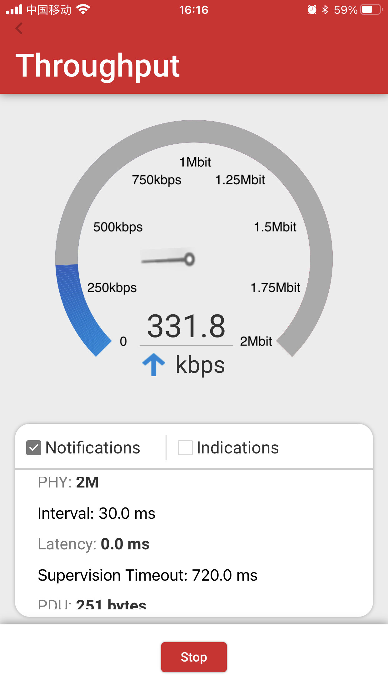  
</figure>

这是 120ms 的连接间隔。
<figure>
  
   
</figure>

一个连接的最大数据包数为 5，有时甚至更少，增加连接间隔无济于事，这个特性会直接影响吞吐量性能。
# 参考
[AN1346: Running the BLE Interoperability (IOP) Test](https://www.silabs.com/documents/public/application-notes/an1346-running-ble-iop-test.pdf)

[AN1309: Bluetooth Low Energy Interoperability Testing Report](https://www.silabs.com/documents/public/application-notes/an1309-ble-interop-testing-report.pdf)