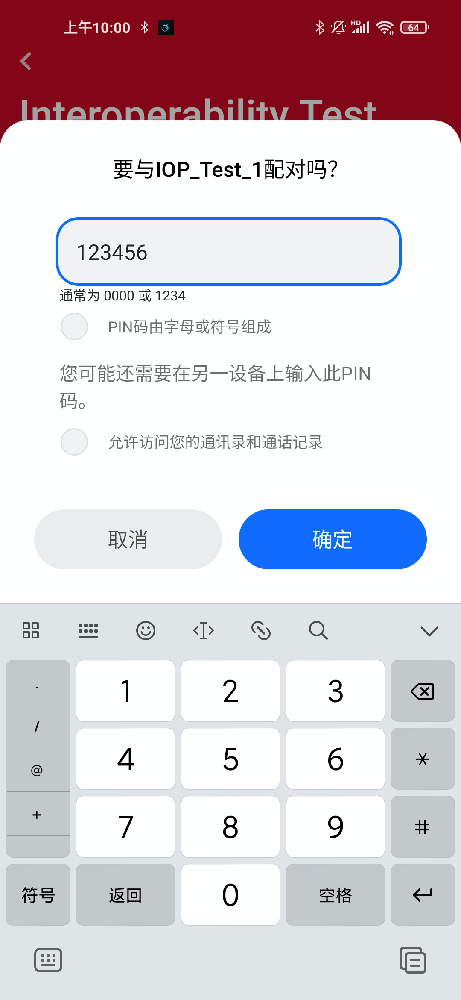

English | [中文](BLE-Interoperability-Test-and-Common-Issue-Diagnostic-cn.md) 

<details>
<summary><font size=5>Table of Contents</font> </summary>

- [1. Overview](#1-overview)
- [2. IOP Test](#2-iop-test)
  - [2.1. Prerequisites](#21-prerequisites)
    - [2.1.1. Hardware Requirements](#211-hardware-requirements)
    - [2.1.2. Software Requirements](#212-software-requirements)
    - [2.1.3. Mobile App Requirements](#213-mobile-app-requirements)
    - [2.1.4. Minimum Mobile Operating System Versions](#214-minimum-mobile-operating-system-versions)
  - [2.2. Setup IOP Test](#22-setup-iop-test)
  - [2.3. Running the IOP Test](#23-running-the-iop-test)
  - [2.4. Logging and Sharing Data](#24-logging-and-sharing-data)
- [3. Diagnostic Tools](#3-diagnostic-tools)
  - [3.1. UART Log](#31-uart-log)
  - [3.2. Network Analyzer](#32-network-analyzer)
  - [3.3. Smartphone btsnoop Log](#33-smartphone-btsnoop-log)
  - [3.4. Third Party Sniffer](#34-third-party-sniffer)
    - [3.5. Spectrum Analyzer](#35-spectrum-analyzer)
- [4. Diagnostic Example](#4-diagnostic-example)
  - [4.1. BLE Device Cannot Be Detected](#41-ble-device-cannot-be-detected)
    - [Phenomenon](#phenomenon)
    - [Cause Analyze](#cause-analyze)
  - [4.2. Characteristic Write Cause Disconnect](#42-characteristic-write-cause-disconnect)
  - [4.3. Throughput](#43-throughput)
- [Reference](#reference)

</details>

# 1. Overview 
Interoperability(IOP) is a cornerstone of Bluetooth and one of the key reasons why this wireless technology has become ubiquitous. 
It enables end users to mix and match devices between different vendors without fearing connectivity issues. 
For example, whether a heart rate monitor from a company A will connect to a smart watch from a company B to retrieve and display the heart rate information.

It is therefore essential that when a customer is looking for a Bluetooth solution supplier for his design, 
the supplier can provide means to test IOP between his Bluetooth solution and 3rd party devices.

One of the most common use cases for Bluetooth enabled devices is interaction with smartphones where a mobile app is used for command and control of the Bluetooth device. 
This use case places IOP in the spotlight because of the large number of permutations between smartphone hardware (namely Bluetooth chipset), 
low level firmware (typically BLE link layer), mobile OS (typically BLE host stack), and mobile OS version.

<div align="center">
  
</div>

The issues that may cause by lack of Interoperability testing,
- Device not found
- Unreliable connection
- Incorrect operation
- Loss of data

Silicon Labs provides a framework to test IOP between the EFR32 family of SoCs and a large number of smartphones currently on the market. 
This framework is used to run IOP testing against a large list of devices periodically. 

[AN1346](https://www.silabs.com/documents/public/application-notes/an1346-running-ble-iop-test.pdf)  describes Silicon Labs IOP test framework comprising of hardware kits, embedded software, and mobile app.

[AN1309](https://www.silabs.com/documents/public/application-notes/an1309-ble-interop-testing-report.pdf) provides test setup details, test cases, and extension of the results based on the Bluetooth qualification of the smart phones.

# 2. IOP Test
## 2.1. Prerequisites
### 2.1.1. Hardware Requirements
The IOP embedded software is available for virtually any Silicon Labs kit that supports Bluetooth technology.

### 2.1.2. Software Requirements

The IOP example application is available beginning with Bluetooth SDK 3.3.0. Install Simplicity Studio 5 and the Bluetooth SDK that is part of the GSDK. For more information about installing Simplicity Studio 5, see the [Simplicity Studio 5 documentation](https://docs.silabs.com/simplicity-studio-5-users-guide/5.2.1/ss-5-users-guide-getting-started/install-ss-5-and-software).

### 2.1.3. Mobile App Requirements

To enable IOP testing framework on a smartphone, install the EFR Connect mobile app, version 2.4 or newer. The app is available for both [Android](https://play.google.com/store/apps/details?id=com.siliconlabs.bledemo&hl=en&gl=US) and [iOS](https://apps.apple.com/us/app/efr-connect/id1030932759) and the source is available on [GitHub](https://github.com/SiliconLabs?q=efrconnect&type=&language=&sort=). The APK is provided on GitHub in case you'd like to install it standalone.

Ensure that there is **no existing bond** with the embedded device before initiating the IOP test sequence, which you can check from the phone Bluetooth settings. If the device is already bonded, the bond must be removed before proceeding with IOP testing.

### 2.1.4. Minimum Mobile Operating System Versions

The minimum OS versions supported by the EFR Connect mobile app are Android™ 9 and iOS®12.

## 2.2. Setup IOP Test

The IOP test consists of a sequence of BLE operations executed between a mobile device and an EFR32 SoC running the interoperability test embedded software.

<div align="center">
  
</div>

To flash the embedded software into one of the supported boards, create the example **Bluetooth - SoC Interoperability Test**, build it, and flash it to the target. 

Then run the script **iop_create_bl_files.sh** (for MacOS/Linux) or **iop_create_bl_files.ps1** (for Windows powershell). The script generates two files into the *output_gbl* folder that is inside the project folder: *ota-dfu_ack.gbl* and *ota-dfu_non_ack.gbl*.

<div align="center">
  
</div>

These files must be provided to the IOP Test on EFR Connect mobile app when prompted to do so. Copy them to the mobile phone's local storage or a cloud drive that is accessible from the mobile phone. The file *ota-dfu_ack.gbl* is used for the first OTA test and *ota-dfu_non_ack.gbl* for the second OTA test.

Note that you must have a bootloader flashed to the board as well, otherwise the firmware will not run. To flash a bootloader, either create a bootloader project or run a precompiled **Demo** on your device from the Launcher view. Like **Bluetooth - SoC Thermometer** demo. Precompiled demos flash both bootloader and application images to the device. Then flash your own application image to overwrite the demo application but leave the bootloader in place. 

Once the example and bootloader are flashed to the target you should see the information on the mainboard display. For the board that without display (e.g., Explorer Kit) then we will see information being sent out through the UART, which can be captured by a terminal on the PC. Show as below.

<div align="center">
  
</div>

On your smartphone, launch the EFR Connect mobile app, which automatically opens in Develop view. Tap the Interoperability Test tile to bring up a list of all the nearby boards running the IOP Test firmware. Tap the board that you want to test against. The app automatically goes to the IOP view, where you can tap “Run Tests” to get started.

<div align="center">
  
</div>

## 2.3. Running the IOP Test

After the IOP test sequence starts running, the mobile app scrolls through the test cases and indicates Pass/Fail when the test is completed, as shown below.

<div align="center">
  
</div>

Most tests do not require user intervention, except for the OTA and security tests. 

During OTA tests you are prompted to upload the gbl file. The file can be retrieved from local or cloud storage, using OS standard methods. For the first OTA test the *ota-dfu_ack.gbl* must be used, and for the second OTA test *ota-dfu_non_ack.gbl*. 

<div align="center">
  
</div>

During the security tests, you are prompted several times to bond with the device on the mobile app side. Some of those prompts require simple confirmation (Just Works pairing) while other prompts require entering a PIN (authenticated pairing), which can be read from the mainboard display or from the UART logs.

<div align="center">
  
</div>

<div align="center">
  
</div>

## 2.4. Logging and Sharing Data

After the test is finalized on the mobile app, you can rerun the test or share the results.

<div align="center">
  
</div>

To rerun the tests, first **reset the embedded device** by pressing the reset button on the board. Additionally, **remove the bond** from the phone’s Bluetooth settings.

The *Share* option allows sharing the test log through OS-standard mediums, such as cloud storage (e.g., Dropbox, Google Drive, iCloud, and so on) or email, or saving it locally. The log is in xml format and contains information about the phone model, OS version, Bluetooth connection parameters, and the result of each test. Below is an example of a test log from running IOP test on a Redmi Note 9 with Android 10. Please help to share the test result to [IOP test report](https://forms.office.com/Pages/ResponsePage.aspx?id=ItjbVDFSIEuUTW9KvNVB-zbTuzn4jSBMi-DX0CwRTpVUREsyTVZETFdaQ0RWRlhaUzRTVE4wWjVQSC4u) for us.

<div align="center">
  
</div>

# 3. Diagnostic Tools
Interoperability testing is not the ultimate goal, it's used to check whether there is any problem with the developing BLE device and solve the problem in the product development stage. 
Besides debugging projects on Simplicity IDE, there are some common debugging and analysis methods.

## 3.1. UART Log
That is send logging data over UART, which can be captured by a terminal emulator on the PC. 
In SSv5 BLE project, enable it by install the following software components:
   1. Services -> IO Stream -> IO Stream: USART
   2. Application -> Utility -> Log

Then add log in this way. By this we can print log at suspect point or log out some key parameter.
```c
      app_log("This is a bug!\r\n");
```      
## 3.2. Network Analyzer 
With Network Analyzer, users can tap into the data buffers of the radio transceiver via a dedicated serial hardware interface called the Packet Trace Interface (PTI). PTI data can be then transferred via USB or Ethernet to a computer running Simplicity Studio. Finally, the time-stamped data can be interpreted and displayed in Network Analyzer. It is provided as part of the Simplicity Studio tool set.

PTI is an interface, which provides serial data access directly to the radio transmitter/receiver frame controller. Most Silicon Labs’ development kits have the PTI embedded and ready to use. It is also possible to use the network analysis features when working on custom hardware if the PTI pins are exposed via a debug interface. It is implemented in hardware so there is no software overhead for the application.

<div align="center">
  
</div>

A clock and data signal are connected to the frame controller to monitor all packets received/transmitted by the chip. At the chip level, a signal is dedicated to trigger the timestamping of each PTI frame by the debug adapter. Network Analyzer can capture data from nodes of any connected adapters, either from one node at a time or from multiple nodes. It can display data from Live sessions as well as Recorded sessions. Network Analyzer saves session data to an ISD (.isd) file, which is a compressed file that stores session data and the network state. Network state includes display settings such as map modifications, which the Network Analyzer restores when you reload the session file.

To start the radio capture, right-click the debug adapter and select "Connect". Then, right-click the debug adapter once again and select "Start Capture".

<div align="center">
  
</div>

This automatically opens the Network Analyzer perspective, where the traffic is logged and every packet can be decoded for further analysis if required. At the end of the test or capture, the trace can be saved through File -> Save as, as shown below.

<div align="center">
  
</div>

## 3.3. Smartphone btsnoop Log
Most of Android phone support snoop HCI log feature, this insure user can check what happen(command and event) on the phone side. It needs to enable the feature in Developer options.
How to access developer options and enable Snoop HCI logging can vary from phone to phone, and the log file location can be different, so need to search the information or method according to the phone.

<div align="center">
  
</div>

Take Redmi Note 9  for an example，it start and stop the snoop log by input **\*#\*#5959#\*#\*** on key pad, its log file save at /sdcard/MIUI/debug_log/common/bt_log.../CsLog_.../BT_HCI_....cfa.

The [Frontline Capture File Viewer](https://fte.com/support/download.aspx?demo=SD&type=capture&iid=1v)
 should use for view this type of log data.

<div align="center">
  
</div>

## 3.4. Third Party Sniffer
A sniffer which can capture all the traffic in the air can real help, sometime need to check all these logs for diagnosing the IOP issue. Here we introduce [Ellisys Bluetooth tracker](https://www.ellisys.com/products/btr1/download.php). It supports BLE air data concurrent capture.

<div align="center">
  
</div>

It save log data in *.btt type.
<div align="center">
  
</div>

### 3.5. Spectrum Analyzer
Sometime we need to check the RF feature, need to use some spectrum analyzer. Here we introduce [Anritsu MS2692A](https://www.anritsu.com/en-US/test-measurement/products/ms2692a), powerful tool for checking TX power, frequency and even help to read the air data.

<div align="center">
    
</div> 

# 4. Diagnostic Example
During new product development, it may face various issues, let's take some example and use above mentioned log or tools for diagnosing.

## 4.1. BLE Device Cannot Be Detected
### Phenomenon
- UART log indicate device have system boot and advertising
- Network Analyzer can see the advertising
- Just not able to detect by scan device, like smartphone

<div align="center">
    
</div> 

### Cause Analyze
For this kind of issue, the first suspect should be central frequency offset. 
According to [Core Specification 5.3](https://www.bluetooth.org/DocMan/handlers/DownloadDoc.ashx?doc_id=521059) section "4.2.1 Active clock accuracy", the drift must be not more than ±50 ppm. 
So we should first check the central frequency offset by a spectrum analyzer. We use MS2692A Signal Analyzer for it, the conducted testing is preferred but radiation testing is OK.

On the EFR32 device application, it needs the following software component to support RF test on application level.
- Bluetooth -> Stack -> DTM -> Direct Test Mode

Add below code snippet under sl_bt_evt_system_boot_id to make the device enter DTM and send out CW signal. Check on channel 0, 2.402GHz.
```c
      sc = sl_bt_test_dtm_tx_cw(sl_bt_test_pkt_carrier,
                                0,
                                sl_bt_test_phy_1m,
                                100);
      app_assert_status(sc);
      break;
```   
An easy way to perform the DTM tests is to use a PC running the NCP Commander as the Upper Tester, and the EFR32 device be configured to operate in NCP mode. Please refer to [AN1267](https://www.silabs.com/documents/public/application-notes/an1267-bt-rf-phy-evaluation-using-dtm-sdk-v3x.pdf).

If found the central frequency got a big offset, then it should be finetune by configure the Ctune.
<figure>
  
  
</figure>

Read it first by this command.
```bash
commander ctune get
```
Then set it and check central frequency on spectrum analyzer, still not meet the requirement then try again and again. For EFR32 series 2 the value scope is from 0 to 511. Lower value means a higher frequency.

```bash
commander ctune set --value xxx
```
<figure>
  
  
</figure>

After finetune the frequency, comment out the debug DTM code and try to scan again, now the device should appear, click to connect, it should work fine. 
Then we know the root cause is central frequency offset too big.

## 4.2. Characteristic Write Cause Disconnect
Some user reported characteristic write cause connection terminate. Only able to write successful onetime, the following write from GATT client will not able to receive by the GATT server. After a while, the connection will be terminated with the [error code](https://docs.silabs.com/gecko-platform/latest/common/api/group-status) 0xxxxx.
This usually happen on User Types of Characteristics operation. For more information about Characteristic value type please refer to [Different Characteristic Value Types](https://docs.silabs.com/bluetooth/4.0/general/gatt-protocol/using-characteristics-value-types).

If use "user" as the value type, the value of the characteristic is stored in the application layer, which means the users should be responsible for allocating, maintaining, and freeing a suitable buffer for the characteristic value. Additionally, respond to the GATT write/read requests by sending write/read response back to the peer device via below APIs.

```c
sl_bt_gatt_server_send_user_read_response(uint8_t      connection,
                                          uint16_t  characteristic,
                                          uint8_t      att_errorcode,
                                          size_t      value_len,
                                          const uint8_t*      value,
                                          uint16_t* sent_len);

sl_bt_gatt_server_send_user_write_response(uint8_t connection,
                                           uint16_t characteristic,
                                           uint8_t  att_errorcode);
```

<div align="center">
    
</div> 

When a write request is received, sl_bt_evt_gatt_server_user_write_request event is generated. At this point, users decide how to handle the value with the local buffer against the data in write request and respond it via sl_bt_gatt_server_send_user_write_response.
If not send write response to the client, the connection will terminate after 30 seconds.

<div align="center">
    
</div> 
After send write respond under sl_bt_evt_gatt_server_user_write_request event, the issue will be solved.

## 4.3. Throughput
While testing throughput with phone, it is hard to get or take close to the theoretical throughput.
For example, if test on 2 Mbps PHY with 251-byte PDU notification, the theoretical throughput is:

**(251 – 4 – 3) byte / (1060 + 150 + 40 + 150) us = 174,285 bytes/sec = 1,394,280 bps**

In case that acknowledgment is not required, any number of packets can be sent within one connection interval. As a result, the connection should not directly influence the throughput.

But it is important to know that maximum number of packets per connection event is dependent on the BLE stack/chipsets.

Let check this feature by Ellisys.   
The figures below illustrate the max throughput that can be reached on iPhone 8 plus.   
30ms connection interval.
<figure>
  
  
</figure>

120ms connection interval.
<figure>
  
   
</figure>

The maximum packet number for a connection is 5, sometimes it's even less, increase connection interval could not help, this real impact the Throughput performance.
# Reference
[AN1346: Running the BLE Interoperability (IOP) Test](https://www.silabs.com/documents/public/application-notes/an1346-running-ble-iop-test.pdf)

[AN1309: Bluetooth Low Energy Interoperability Testing Report](https://www.silabs.com/documents/public/application-notes/an1309-ble-interop-testing-report.pdf)