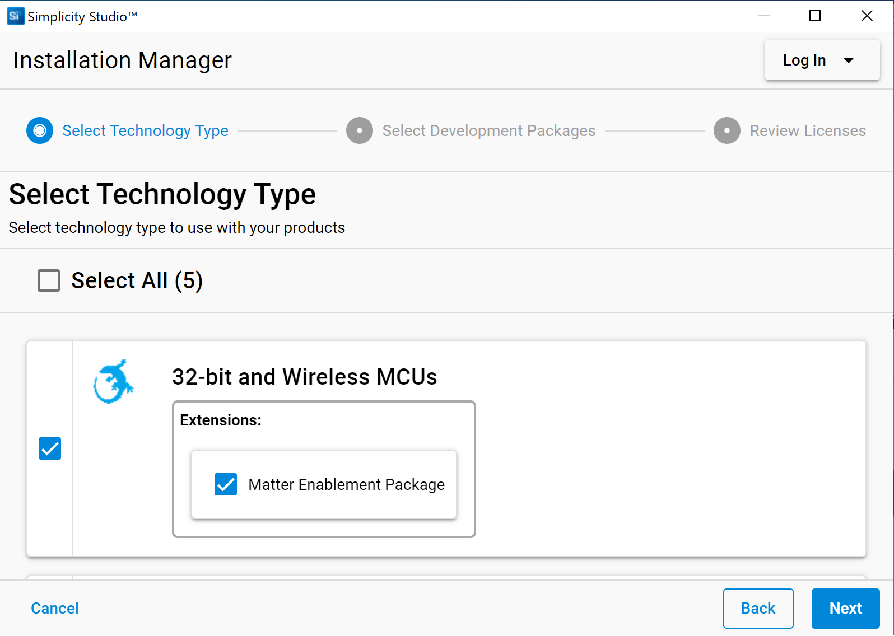

[English](BLE-Preparatory-Course.md) | 中文

Table of Contents 

- [1. 介绍](#1-介绍)
- [2. 先决条件](#2-先决条件)
  - [2.1. 硬件要求](#21-硬件要求)
    - [2.1.1 EK板](#211-ek板)
    - [2.1.2 工作电脑](#212-工作电脑)
  - [2.2. 软件需求](#22-软件需求)
- [3. BLE应用程序开发入门](#3-ble应用程序开发入门)
  - [3.1. 连接您的硬件](#31-连接您的硬件)
  - [3.2. 使用Gecko Bootloader](#32-使用gecko-bootloader)
  - [3.3. 创建并编译BLE项目](#33-创建并编译ble项目)
  - [3.4. 测试你的项目](#34-测试你的项目)
- [4. BLE基础知识](#4-ble基础知识)
- [5. 结论](#5-结论)

***

# 1. 介绍
如果您是Silicon Labs开发环境和BLE解决方案的新手，那么我们建议您仔细阅读并完成此预备课程。该文档描述了如何使用Bluetooth SDK和Simplicity Studio以及兼容的无线入门套件（EK 板）来进行BLE开发，以及在开始本次培训系列课程之前应该了解的BLE基本知识。  
并且提供了分步说明来演示如何创建基本的BLE项目，以检查开发环境是否已准备就绪。  
下图说明了设置开发环境的工作流程。

    

  

*** 

# 2. 先决条件

## 2.1. 硬件要求
### 2.1.1 EK板
在培训之前您应该收到了我们提供的一套EK板。可以用这个EK板来完成培训中实验部分内容。

### 2.1.2 工作电脑
以下是Simplicity Studio v5对于工作电脑的要求，在进行无线项目开发时，我们强烈建议你准备一台至少具有8GB RAM内存的工作电脑。  

|操作系统 | 版本|
|- |:---|
|Windows | Windows 10 (64-bit)|
|macOS | 10.15 Catalina|
|Linux | Ubuntu 20.04 LTS|

|硬件配置 | 要求|
|- |:---|
|CPU | 1 GHz或更高|
|内存 | 无线项目开发要求至少8 GB RAM|
|磁盘空间 | 无线项目开发要求至少7 GB可用磁盘空间|

## 2.2. 软件需求
要开发 BLE 应用程序，您需要通过安装 Simplicity Studio、蓝牙 SDK 和兼容的工具链来设置您的软件开发环境。

Simplicity Studio 是适用于所有 Silicon Labs 技术、SoC 和模块的统一开发环境。 
它使您能够访问特定于目标设备的 Web 和 SDK 资源、软件和硬件配置工具，以及具有行业标准代码编辑器、编译器和调试器的集成开发环境 (IDE)。 
使用 Simplicity Studio，您可以获得一整套用于网络分析和代码相关能源分析的高级增值工具。 动手实验部分需要 GSDK v4.1.2 或更高版本。

如果您没有安装 Simplicity Studio V5，请连接到 [Simplicity Studio 5](https://www.silabs.com/developers/simplicity-studio) 下载安装包，并运行 Simplicity Studio 安装应用程序。

**注意**：为获得更好的无线项目开发体验，请逐条确认如下信息。  
1. 请确保您的工作电脑具有8 GB或更多的RAM内存，以及超过7 GB的可用磁盘空间。
2. 如果使用Windows（建议使用Windows 10），则强烈建议将Simplicity Studio安装到**C：** 盘。否则，你需要在Simplicity Studio v5的安装盘中，重新创建一个新的workspace，并切换到该workspace。  

首次启动Simplicity Studio时，它将显示一个许可协议对话框。接受协议的条款，然后单击[Next]。  

    

  

下一步是SDK位置选择，推荐使用默认设置，点击 [Next] 接着点击 [Install].

许可协议对话框再次出现，全部勾选，点击 [Done].

    

  

然后是登录界面，如果您还没有注册Silicon Labs账号，我们建议你点击[Create an Account]进行注册。
你也可以选择点击右侧 [Skip log in for now]，以暂时跳过注册流程。  

    

  

这里点击右侧 [Install by technology type].  

    

  

选上 32-bit and Wireless MCUS, 此选项将安装无线 SDK，包括蓝牙 SDK 和相关工具包。

    

  

Package Installation Options, 用默认配置，点击 [Next].

    

  

许可协议对话框再次出现，全部勾选，点击 [Next].

    

  

安装开始进行，这需要点时间，请耐心等待。

    

  

GSDK 安装完成后，蓝牙 SDK 已安装，编译器工具链 GCC 也已安装，Simplicity Studio 请求重启。 如果显示安装失败，则需要重新安装。 

    

  

如果已经尝试了几次，但仍旧没有安装成功，我们建议从 [github](https://github.com/SiliconLabs/gecko_sdk)下载GSDK然后再导入。方法请参考下图。

    

  
Simplicity Studio 重启后，我们可以查看 SDK 版本。 培训中的动手实验要求 GSDK v4.1.2 或更高版本。

    

  

*** 

# 3. BLE应用程序开发入门
作为准备课程，本节的目的是提供逐步说明，以演示如何开始使用**Bluetooth - SoC Empty**示例项目，以验证您的开发环境是否已搭建完成。

## 3.1. 连接您的硬件
**注意**: 如果您还没有开发套件，请在Launcher视图左下角的“My Products”选项卡中键入开发板名“ EK2703A ”。并跳至“ [创建并编译BLE项目](#33-创建并编译ble项目)”部分。

    

 

## 3.2. 使用Gecko Bootloader
Bootloader是存储在保留的闪存中的一段程序，可以初始化设备，更新固件image并可能执行某些完整性检查。如果怀疑应用程序没有运行，请先检查Bootloader，因为缺少Bootloader会导致程序无法运行。  
有两种可能方法加载Bootloader到目标板上。   
*	使用Silicon Labs的预编译的image（不适用于所有电路板）。 
*	创建自己的Bootloader项目。 

第一个选项是最简单的解决方案。 过滤并仅留下 Demos 列表，选择 **Bluetooth - SoC Blinky** 并单击 RUN 按钮。

    

第二种方法是创建和编译您自己的Bootloader。 可以对其进行自定义和添加新功能，但当前文档不会详细说明。
1.	Launcher 视图 -> EXAMPLE PROJECTS & DEMOS, 选上 Bootloader , 在过滤器中输入 "apploader".  然后可以看到 **Bootloader - SoC Bluetooth AppLoader OTA DFU** 列在顶部.  

    

2.	选中 **Bootloader - SoC Bluetooth AppLoader OTA DFU**. 点击 [CREATE].  

3.	可以重命名工程, 勾选 “Copy contents”. 点击 [FINISH].  

    

4.	点上方锤子图标  编译， 右键点击 s37 文件, 点 [Flash to Device...]转到烧录界面，选正确的设备烧录。

    

## 3.3. 创建并编译BLE项目
通过连接 EK 板，Simplicity Studio 将自动在启动器视图中列出可用的示例应用程序，单击示例项目上的 [CREATE]，Simplicity Studio 将根据所选示例新建一个项目。

**注意**：如果您还没有 EK 板，您也可以在 launcher 视图左下角的 "My Products" 选项卡中输入板名称“EK2703A”。 Simplicity Studio 也会自动在 launcher 视图中列出可用的示例应用程序。

以下是分步说明。
1. 在左侧的 "Debug Adapters"或 "My Products" 选项卡中选择您的设备。 并检查所选的 SDK 版本是否为所需的版本。
2. 在EXAMPLE PROJECTS & DEMOS视图中，选中Bluetooth，输入"empty"进行过滤。 然后我们可以在顶部看到列表出现 **Bluetooth - SoC Empty** 。

    

  

3. 选中  **Bluetooth - SoC Empty**, 点击 [CREATE] 创建新工程, 这里可以直接点击 [FINISH].  
4. 通过上方锤子图标 [Build] 编译工程.  
5. 编译应该没有错误地完成。. 
6. 右键点击 s37 文件， 点 [Flash to Device...] 转到烧录界面，选正确的设备烧录。 

**注意**：您应该在build console中的编译日志末尾得到类似如下

    

  

  <b>Figure 3‑6 Submit the build log</b>

   

## 3.4. 测试你的项目
将编译生成的 image 下载到您的开发套件后，就可以与设备进行通信了。 UART日志默认是不开启的，所以我们需要在智能手机上查看。安装并打开EFR connect. 在Browser视图中可以看到名为 Empty Ex... 设备,这就是我们的目标设备了。

    

  <b>Figure 3‑7 Test your project</b>

   

*** 

# 4. BLE基础知识
BLE培训将涵盖BLE基础知识、xG24和SSv5介绍、如何优化功耗、如何实现OTA DFU、BGM/CGM应用、BLE智能钥匙、IOP和室内定位等主题。
虽然这一系列培训我们将对BLE原理作一些基本介绍，但强烈建议在参加本系列课程之前先阅读下面这个文档。

[UG103.14: Bluetooth LE Fundamentals](https://www.silabs.com/documents/public/user-guides/ug103-14-fundamentals-ble.pdf)  

***

# 5. 结论
我们希望您已顺利完成预备课程，并搭建好开发环境，为接下来的 BLE 培训课程做准备。
