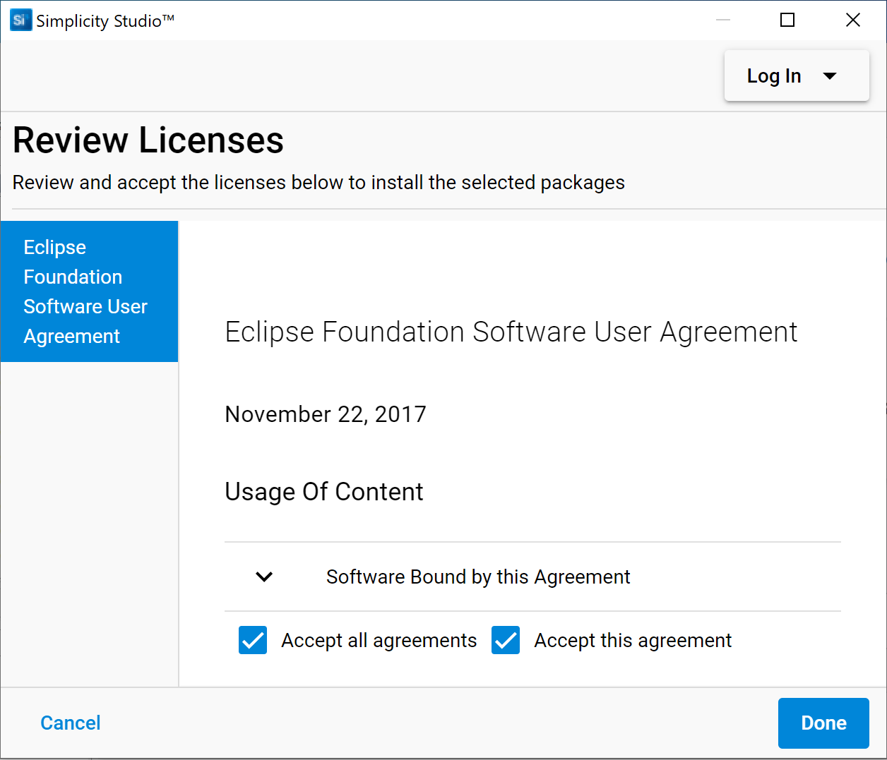
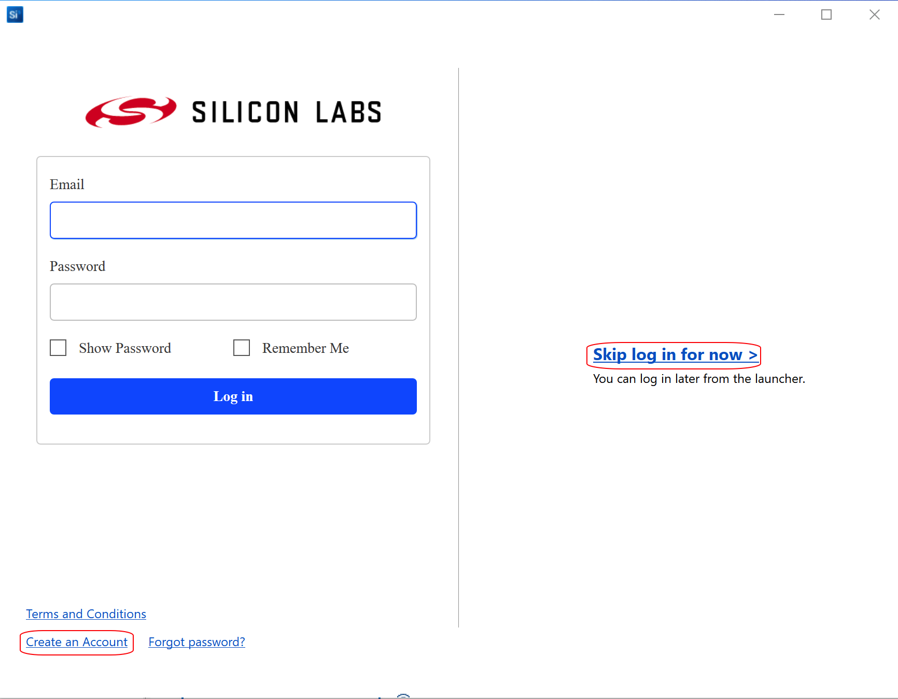
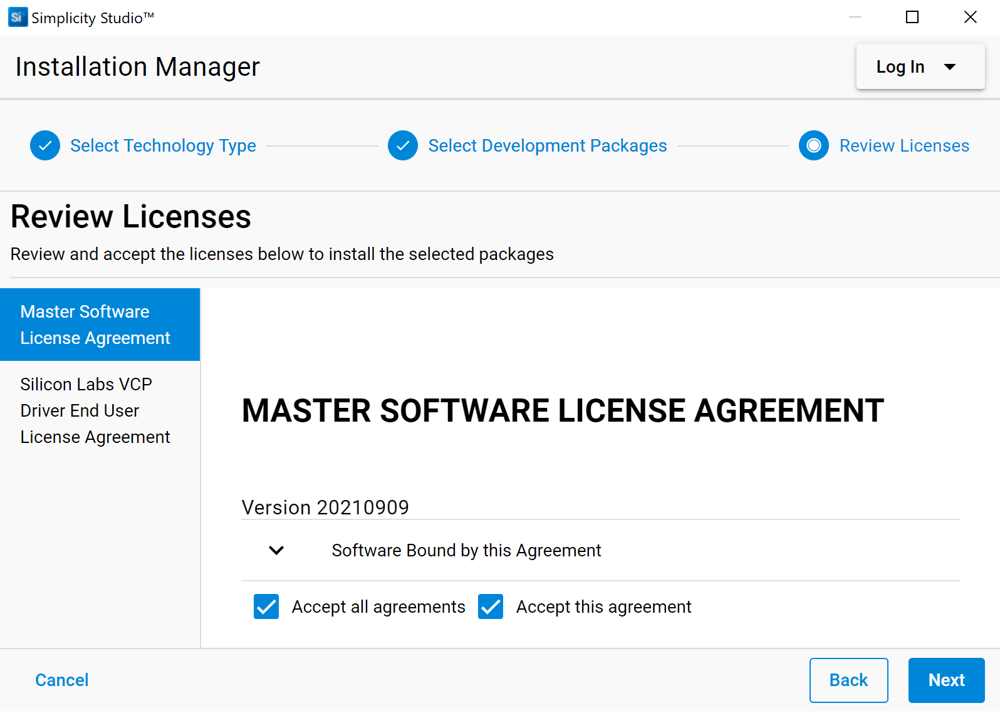
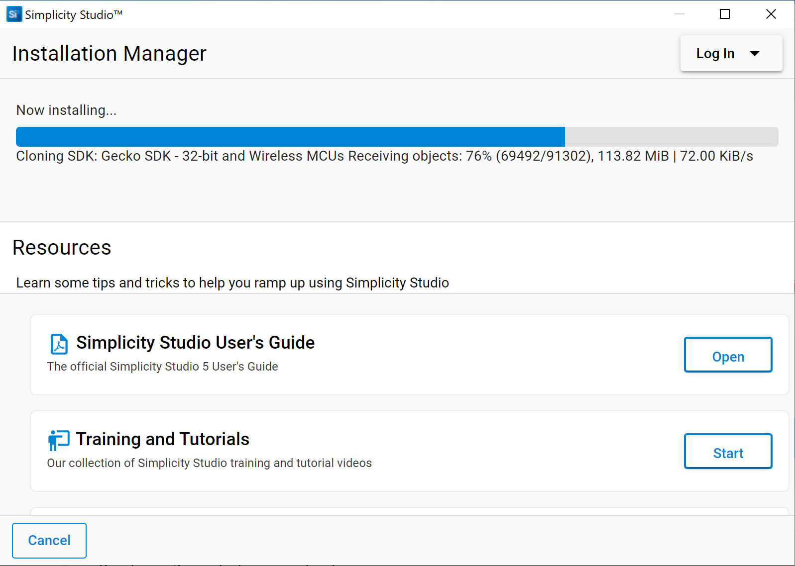
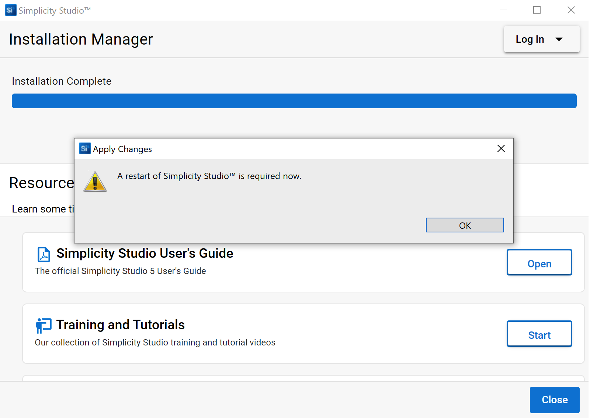
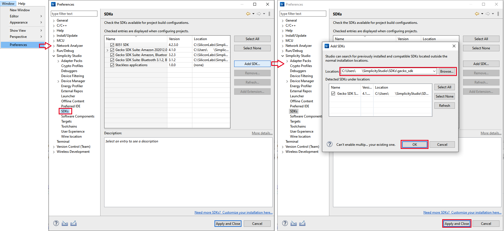
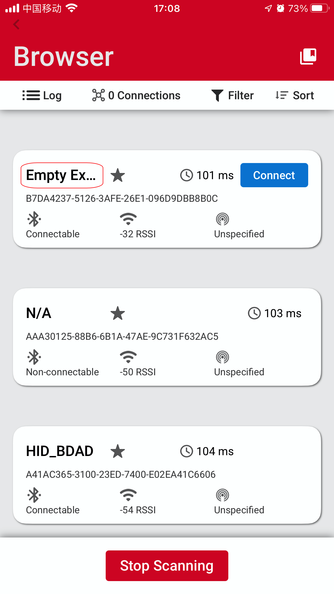

English | [中文](BLE-Preparatory-Course-cn.md)

Table of Contents 

- [1. Introduction](#1-introduction)
- [2. Prerequisites](#2-prerequisites)
  - [2.1. Hardware requirements](#21-hardware-requirements)
    - [2.1.1 Explorer Kit](#211-explorer-kit)
    - [2.1.2 Working Computer](#212-working-computer)
  - [2.2. Software requirements](#22-software-requirements)
- [3. Getting started with BLE Application Development](#3-getting-started-with-ble-application-development)
  - [3.1. Connect your Hardware](#31-connect-your-hardware)
  - [3.2. Using Gecko Bootloader](#32-using-gecko-bootloader)
  - [3.3. Create and Build the BLE project](#33-create-and-build-the-ble-project)
  - [3.4. Test your project](#34-test-your-project)
- [4. Fundamental Knowledge of BLE](#4-fundamental-knowledge-of-ble)
- [5. Conclusion](#5-conclusion)

***

# 1. Introduction
This is a preparatory course that you should take if you are new to the Silicon Labs development environment and BLE solution. The document describes how to get started with BLE development using the Bluetooth SDK and Simplicity Studio with a compatible Explorer kit(EK) board, and also the fundamental BLE knowledge you should understand before beginning to study the BG24 training courses.  
And step-by-step instructions are provided to demonstrate how to create a basic BLE project for checking if the development environment is ready on your end.  
The figure below illustrates the working flow for setting up the development environment.  

    

  

*** 

# 2. Prerequisites

## 2.1. Hardware requirements
### 2.1.1 Explorer Kit
Before following the procedures in this guide you should have purchased one of the Bluetooth development kits. You can use the [EFR32xG24 Dev Kit](https://www.silabs.com/development-tools/wireless/efr32xg24-dev-kit) or [xG24 Explorer Kit](https://www.silabs.com/development-tools/wireless/efr32xg24-dev-kit) in the training hands-on.  

### 2.1.2 Working Computer
Below is the system requirements of the Simplicity Studio v5, and it's strongly recommended to prepare a working computer has at least 8GB RAM for wireless project development.

|Operating System | Version|
|- |:---|
|Windows | Windows 10 (64-bit)|
|macOS | 10.15 Catalina|
|Linux | Ubuntu 20.04 LTS|

|Hardware Component | Item|
|- |:---|
|CPU | 1 GHz or better|
|Memory | **8 GB for Wireless Protocol development**|
|Disk Space | 7 GB for Wireless Dynamic Protocol support|

## 2.2. Software requirements
To develop BLE applications, you will need to setting up your software development environment by installing Simplicity Studio, Bluetooth SDK and the compatible toolchains.  

Simplicity Studio is the unified development environment for all Silicon Labs technologies, SoCs, and modules. It provides you with access to the target device-specific web and SDK resources, software and hardware configuration tools, and an integrated development environment (IDE) featuring industry-standard code editors, compilers, and debuggers. With Simplicity Studio, you get a complete set of advanced value-add tools for network analysis and code-correlated energy profiling. GSDK v4.1.2 or later will be require for the hands-on section.

If you do not have Simplicity Studio V5 installed, please connect to [Simplicity Studio 5](https://www.silabs.com/developers/simplicity-studio) to download the installation package, and run the Simplicity Studio installation application.  
**Note**: For better wireless protocol development experience, please check the items below one by one.  
1. Make sure that your PC has 8 GB or more RAM memory and more than 7 GB disk space available.  
2. If you are using the Windows (Windows 10 is recommended), it highly recommended to install the Simplicity Studio to the **C:** drive. Otherwise, you need to create another workspace locates at the same drive as your Simplicity Studio installed, and switch to that workspace.  

When Simplicity Studio first launches, it presents a License Agreement dialog. Accept the terms of the agreement and click [Next].  

    

  

Next step is SDK location selection, recommend to use default setting, click [Next] > and then click [Install].

License Agreement dialog again, all check on, click [Done].

    

  

Then it require to log in. If you have no account, we will suggest click [Create an Account] for creating a new account and log in then. You can also skip the Log in process for now by clicking right side [Skip log in for now].  

    

  

Click right side [Install by technology type].  

    

  

Check on 32-bit and Wireless MCUS, this option will inlstall Wireless SDK include Bluetooth SDK and relevant tooltaich.

    

  

Package Installation Options, use default setting, click [Next].

    

  

License Agreement dialog again, all check on, click [Next].

    

  

Installing, this will take time.

    

  

After GSDK installation complete, Bluetooth SDK have installed, the compiler toolchain GCC have installed as well, Simplicity Studio request a restart. If it show Installation Fail, then need to re-install. 

    

  

If you have tried serveral time but not install sucessful, we recommend download GSDK from [github](https://github.com/SiliconLabs/gecko_sdk) then import it. Refer to below figure. 

    

  
After Simplicity Studio restart, then we can check the SDK version. The training hands-on request GSDK v4.1.2 or later.

    

  

*** 

# 3. Getting started with BLE Application Development
As a preparatory course, the purpose of this section is providing a step-by-step instructions to demonstrate how to get start with the **Bluetooth - SoC Empty** example project to verify that the development environment is setting done on your side.  

## 3.1. Connect your Hardware
**Note**: If you don't have Explorer kit yet, please just type the board name "EK2703A" in the "My Products" tab on the lower-left of the launcher perspective. And jump to the section [Create and Build the BLE project](#33-create-and-build-the-ble-project).  

Connect your EK board using a type C USB cable to the PC on which has Simplicity Studio installed. 

    

 

## 3.2. Using Gecko Bootloader
A bootloader is a program stored in reserved flash memory that can initialize a device, update firmware images, and possibly perform some integrity checks. If the application seems to do not running, always check the bootloader, because lack of it causes program crash.  
There are two possible way to have a bootloader application.  
*	Use Silicon Labs pre-built image (not for all boards).  
*	Create your own bootloader project.  

The 1st option is the easiest solution. Filter and left Demos list only, select **Bluetooth - SoC Blinky** and click RUN button.

Each Gecko SDK contain pre-built bootloader images for different boards. 

    

The 2nd way is to create and build your own bootloader application. It is possible to customize and add new features to it, but the current lab doesn’t detail these possibilities.  
1.	In Launcher perspective -> EXAMPLE PROJECTS & DEMOS, check Bootloader on, input "apploader" for filting.  Then we can see **Bootloader - SoC Bluetooth AppLoader OTA DFU** list on the top.  

    

2.	Select **Bootloader - SoC Bluetooth AppLoader OTA DFU**. Click [CREATE].  

3.	Rename the project, select “Copy contents”. Click [FINISH].  

    

4.	Build by clicking on the  and select the s37 file, go to [Flash to Device...] and select the device for programming.  

    

## 3.3. Create and Build the BLE project
By having the EK board connected, the Simplicity Studio will automatically list the available example application in the launcher perspective, click [CREATE] on example project, the Simplicity Studio will new a project based on the selected example.  

**Note**: If you don't have EK board yet, you also can just type the board name "EK2703A" in the "My Products" tab on the lower-left of the launcher perspective. The Simplicity Studio will automatically list the available example application in the launcher perspective as well.  

Below is the step-by-step instructions.  
1. Select you Device in the "Debug Adapters" or "My Products" tab on the left. And check the selected SDK version is the required one.  
2. In EXAMPLE PROJECTS & DEMOS view, check Bluetooth on, input "empty" for filting.  Then we can see **Bluetooth - SoC Empty** list on the top. 

    

  

3. Select  **Bluetooth - SoC Empty**, Click [CREATE] for create a new project, then click [FINISH] directly.  
4. Build you project by clicking [Build] in the top tool bar.  
5. The build should complete with no errors. 
6. Right-click the generated hex file, go to [Flash to Device...] and select the device for programming.  

**Note**: You should got similar as below at the end of the build log in the build console

    

  

## 3.4. Test your project
After the image has been downloaded to your development kit, it's possible to communicate with the device. The UART log is not enable by default, so we need to check it on smartphone.We need to install and open our Bluetooth app EFR Connect. In Brower view, we can see the "Empty Ex..." device, this is our target device.

    

*** 

# 4. Fundamental Knowledge of BLE
The BLE training will cover the topics of BLE Basic Knowledge, xG24 and SSv5 introduction, how to optimize for power consumption, how to implement OTA DFU , BGM/CGM appliacaton, BLE smart Key, IOP  and indoor position.  
Although this series of training are designed for new to Silicon Labs BLE solution, it highly recommended to go though the documentations below before attending this series course.  
[UG103.14: Bluetooth LE Fundamentals](https://www.silabs.com/documents/public/user-guides/ug103-14-fundamentals-ble.pdf)  

***

# 5. Conclusion
We hope that you have completed the preparatory course well, and set up the development environment as the preparation for the coming BLE training course. 
