[English](MG24-Bluetooth-OTA-hands-on.md) | 中文

<details>
<summary><font size=5>Table of Contents</font> </summary>

- [1. 概述](#1-概述)
- [2. Bootloader 简介](#2-Bootloader-简介)
- [3. Bluetooth OTA 升级](#3-Bluetooth-OTA-升级)
  - [3.1. 使用 AppLoader 进行设备固件升级(In-Place OTA)](#31-使用-AppLoader-进行设备固件升级In-Place-OTA)
    - [3.1.1. AppLoader 简介](#311-AppLoader-简介)
    - [3.1.2. 基于 SDK Version 4.0 的 Gecko Bootloader 配置](#312-基于-SDK-Version-4.0-的-Gecko-Bootloader-配置)
    - [3.1.3. In-Place OTA 升级过程](#313-In-Place-OTA-升级过程)
      - [3.1.3.1. 固件部分更新的基本步骤](#3131-固件部分更新的基本步骤)
      - [3.1.3.2. 固件全部更新的基本步骤](#3132-固件全部更新的基本步骤) 
      - [3.1.3.3. 从用户应用程序触发重启到DFU模式](#3133-从用户应用程序触发重启到DFU模式)
  - [3.2. 在用户应用程序中实现设备固件更新 ](#32-在用户应用程序中实现设备固件更新)
    - [3.2.1. 从用户应用程序更新固件的基本步骤 ](#321-从用户应用程序更新固件的基本步骤)
    - [3.2.2. 使能 Gecko Bootloader API](#322-使能-Gecko-Bootloader-API)
    - [3.2.3. 应用程序完成蓝牙 OTA 更新示例实现](#323-应用程序完成蓝牙-OTA-更新示例实现)
    - [3.3. Silicon Labs OTA GATT Service](#33-Silicon-Labs-OTA-GATT-Service)
- [4. 实验](#4-实验)
  - [4.1. 实验介绍](#41-实验介绍)
  - [4.2. 实验工具准备](#42-Lab-Requirements)
  - [4.3. In-Place OTA 实验步骤](#43-In-Place-OTA-实验步骤)
  - [4.4. User Application DFU 实验步骤](#44-User-Application-DFU-实验步骤)
- [参考文档](#参考文档)
</details>

*** 

# 1. 概述
本教程解释如何通过蓝牙 Over-The-Air(OTA) 更新来执行设备固件升级(DFU)。任何在 GATT 配置文件中启用 OTA 更新的芯片都支持 OTA 升级。蓝牙 SDK 中提供的大多数示例应用程序都已经在代码中添加了支持 OTA 升级的组件。在这些例子中，DFU 模式是通过 Silicon Labs OTA service 触发的，该 service 包含在应用程序的 GATT 数据库中。可以通过在项目中安装 OTA DFU 软件组件来添加 OTA 功能。 

# 2. Bootloader 简介
Silicon Labs Gecko Bootloader 是 Silicon Labs 所有较新的 mcu 和无线 mcu 的常见 Bootloader。可以配置 Gecko Bootloader 来执行各种引导加载功能，从设备初始化到固件升级。GBL (Gecko Bootloader) 是 Gecko Bootloader 升级固件使用一种专有格式。这些 images 的文件扩展名为 “.gbl”。 关于 GBL 文件格式的其他信息请参考 [UG103.6: Bootloader Fundamentals](https://www.silabs.com/documents/public/user-guides/ug103-06-fundamentals-bootloading.pdf)。 

根据组件/插件的配置，Gecko Bootloader 可以设置为 standalone 模式(也称为 standalone bootloader)或 application 模式(也称为application bootloader)来执行固件升级。组件(GSDK 4.0及更高版本)和插件(旧版本 GSDK )可以通过 Simplicity Studio IDE 来启用和配置。 

如果有需要进一步了解 bootloader 及 UART/OTA DFU 的相关知识，请参考[an1086-gecko-bootloader-bluetooth.pdf](https://www.silabs.com/documents/public/application-notes/an1086-gecko-bootloader-bluetooth.pdf).

# 3. Bluetooth OTA 升级
本章将介绍如何通过 Apploader(In-Place OTA)和 User Application 来实现设备固件更新。

## 3.1. 使用 AppLoader 进行设备固件升级(In-Place OTA)
使用 Silicon Labs 蓝牙 SDK 开发的蓝牙应用程序包括两部分：AppLoader 和用户应用程序。AppLoader 是一个小型独立应用程序，需要支持 In-Place OTA 更新。AppLoader 可以独立于用户应用程序运行。它包含蓝牙协议栈的最小版本，仅包括执行 OTA 更新所需的那些功能。AppLoader中禁用了任何不需要支持 OTA 更新的蓝牙功能，以最大限度地减少 flash 占用空间。

### 3.1.1. Apploader 简介
AppLoader 的功能和限制总结如下：</br>
• 启用用户应用程序的 OTA 更新。</br>
• AppLoader 本身也可以更新。</br>
• 仅支持一个蓝牙连接，仅支持 GATT Server 角色。</br>
• 不支持加密和其他安全功能，例如绑定。</br>
• PTI 未启用，因此无法将网络分析器与 AppLoader 一起使用</br>

注意：SDK v3.x 或更高版本中的 AppLoader 要求 Gecko Bootloader 版本必须为v1.11或更高版本才能支持 OTA。

用户应用程序放置在 AppLoader 之后的 flash 空间中。SDK 中提供了默认 linker 脚本用来放置用户应用程序，以便它可以存放在 AppLoader 之后的下一个 flash 扇区开始的位置。用户应用程序包含一个功能齐全的蓝牙协议栈版本，它可以独立于 AppLoader 运行。如果不需要支持 In-place OTA 更新，则可以完全删除 AppLoader 以释放 flash 空间以供其他用途（代码空间或数据存储)。

### 3.1.2. 基于 SDK Version 4.0 的 Gecko Bootloader 配置

从 SDK v4.0 版本开始，Apploader 也可以包含在 Bootloader 中。下图展示了这种新的布局: 
<div align="center">
    
</div> 
要使用在 Bootloader 中的 Apploader，需要更改应用程序的起始地址，以便在应用程序之前有足够的空间供 Bootloader 和 Apploader 使用。这种新的布局在 Series 1 设备中是不可能的，所以这种新方法只能用于Series 2设备。对于 Series 2设备，这是新的默认配置。

### 3.1.3. In-Place OTA 升级过程 

OTA 的大部分功能都是由 AppLoader 自主处理的，这大大简化了应用程序开发。用户应用程序的最低要求是有一种方法可以触发重启到 DFU 模式。在这种情况下，重新启动到 DFU 模式意味着设备重置后，运行的是 AppLoader 而不是用户应用程序。待升级的固件上传完成后，AppLoader 将重新启动设备，使其回到正常模式即开始运行用户应用程序。 

可以通过多种方式触发重启进入 DFU 模式。这取决于应用程序开发人员来决定哪一个是最适用的。下面几节将详细解释如何在用户应用程序中完成此操作。

AppLoader 支持两种类型的更新:</br>  
- 完整更新:BootLoader 和用户应用程序都被更新  
- 部分更新:只有用户应用程序被更新

当从一个 SDK 版本迁移到另一个版本时，总是建议进行完整的更新。AppLoader 的大小取决于 SDK 版本。如果需要用旧的 AppLoader 版本去升级新的应用程序固件，这样操作可能会导致OTA更新失败。

#### 3.1.3.1. 固件部分更新的基本步骤 
采用部分更新的方式可以升级蓝牙协议栈和用户应用程序。在部分更新期间，BootLoader 没有被修改。使用 AppLoader 完成部分更新过程如下： 

1. • OTA 客户端连接到目标设备。</br>
   • Client 请求目标设备重启进入 DFU 模式。</br>
2. • 重启后，客户端再次连接。在第二次连接中, 目标设备正在运行 bootloader 中的 AppLoader 程序。</br>
   • OTA 客户端将新的固件镜像(application.gbl)上传至目标设备。</br>
   • AppLoader 将接收到的新的应用程序直接覆盖掉旧的应用程序。</br>
3. • 当上传完成, 连接关闭, AppLoader 重新启动设备使其回归到正常模式。</br>
   • 更新完成。</br>
<div align="center">
    
</div> 

#### 3.1.3.2. 固件全部更新的基本步骤
完整更新可以同时更新包含 AppLoader 的 bootloader 和用户应用程序。完整更新分两步完成。更新 bootloader 总是会删除用户应用程序，因此 bootloader 更新之后必须立刻进行应用程序的更新。完整更新的第一阶段更新包含 AppLoader 的 bootloader，它包括以下步骤：

1. • OTA 客户端连接到目标设备。</br> 
   • Client 请求目标设备重启进入DFU模式。</br>
2. • 重启后, 客户端再次连接。在第二次连接期间, 目标设备在运行 bootloader 中 AppLoader 程序。</br>
   • 新的 bootloader 镜像(bootloader.gbl)被上传到目标设备。AppLoader 将镜像复制到下载区域(在 Gecko Bootloader 配置中指定)。</br>
3. • 当上传完成且连接关闭时, AppLoader 会重新启动并请求 First stage Secure Element 安装下载的镜像。</br> 
   • First stage Secure Element 使用下载的新的 bootloader 镜像更新旧的 BootLoader。重新启动后, 将运行包含新的 AppLoader 的 BootLoader。</br>
<div align="center">
  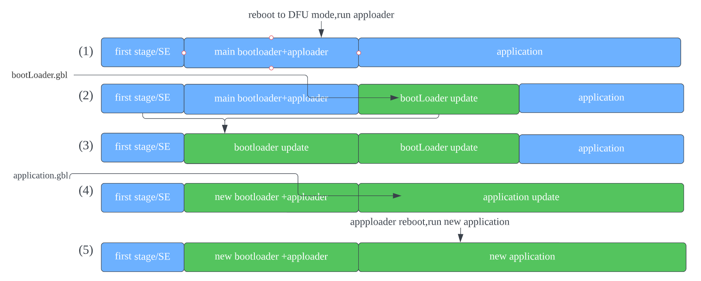  
</div> 
在  bootLoader 更新结束时，设备不包含有效的用户应用程序，因此 appLoader 将保持在 DFU 模式。为了完成应用程序更新，将按照与部分更新相同的操作顺序上传一个新的用户应用程序，部分更新的具体步骤请参考3.1.3.1章节。

推荐使用 SDK 4.1.x，并使用 “SoC Bluetooth Apploader OTA DFU” 的 bootloader 示例代码。请参考下图创建 bootloader 工程，其默认添加了蓝牙 AppLoader OTA DFU 组件。
<div align="center">
    
</div> 

#### 3.1.3.3. 用户应用程序触发重启到DFU模式 
在用户应用程序中启用 OTA 的最低功能要求是实现一个“钩子”，允许设备重新启动到 DFU 模式。在蓝牙 SDK 示例代码中，通过 Silicon Labs OTA Service 去触发设备重新启动到 DFU 模式。下面的代码片段来自 SDK 的 示例代码 SoC empty example。进入 DFU 模式的代码与其他示例是类似的。
<div align="center">
  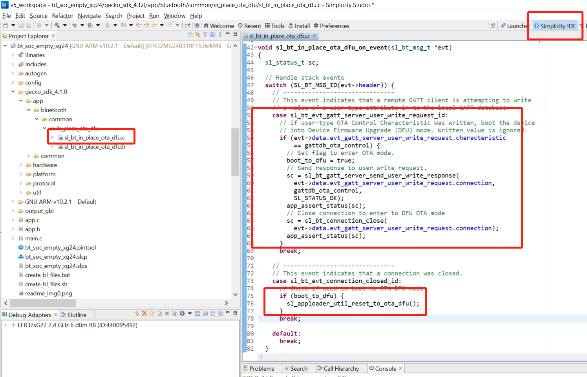  
</div> 

## 3.2. 在用户应用程序中实现设备固件更新 
Silicon Labs 蓝牙 SDK 支持在用户应用程序中去实现固件更新的功能。这种 OTA 升级方式可以采用自定义的 GATT Service 或 Silicon Labs OTA Service，并且可以使用支持内部或外部存储的 bootloader。但bootloader必须定义至少一个下载区域，并且该区域必须足够大以适合完整的 GBL 文件，下载区域不能与用户应用程序重叠。

### 3.2.1. 用户应用程序更新固件的基本步骤 
一般的固件升级顺序在[UG489: Silicon Labs Gecko Bootloader User's Guide for GSDK 4.0 and Higher](https://www.silabs.com/documents/public/user-guides/ug489-gecko-bootloader-user-guide-gsdk-4.pdf)和[UG266: Silicon Labs Gecko Bootloader User's Guide for GSDK 3.2 and Lower](https://www.silabs.com/documents/public/user-guides/ug266-gecko-bootloader-user-guide.pdf)中有解释。 基本步骤总结如下：

1. • 应用程序通过调用```bootloader_init()```，来初始化 Gecko bootloader。</br>
   • 通过```bootloader_getInfo```获取 bootlader 信息。slot 的存储信息可以通过```bootloader_getStorageSlotInfo```来获取。</br>
   • 遍历整个存储区域, 使用```bootloader_readStorage```来读取每块区域的内容。</br>
   • 调用```bootloader_eraseStorageSlot(0)```擦除下载区域。</br>
2. • OTA 客户端连接到目标设备, 并请求目标设备重启进入 DFU 模式。</br>
   • 使用应用程序的 OTA 功能接收更新的镜像(完整的 GBL 文件), 应用程序通过调用```bootloader_writeStorage()```将接收到的字节写入下载区域。</br>
3. • (可选)用户应用程序可以通过调用```bootloader_verifyImage()```来验证接收到的 GBL 文件的完整性。</br>
4. • 在重新启动之前, 调用```bootloader_setAppImageToBootload(0)```来指定存储新镜像的 slot ID。 </br>
   • 重启并调用```bootloader_rebootAndInstall()```来执行重启及更新。</br>
5. • 更新完成, 执行新的应用程序。

<div align="center">
  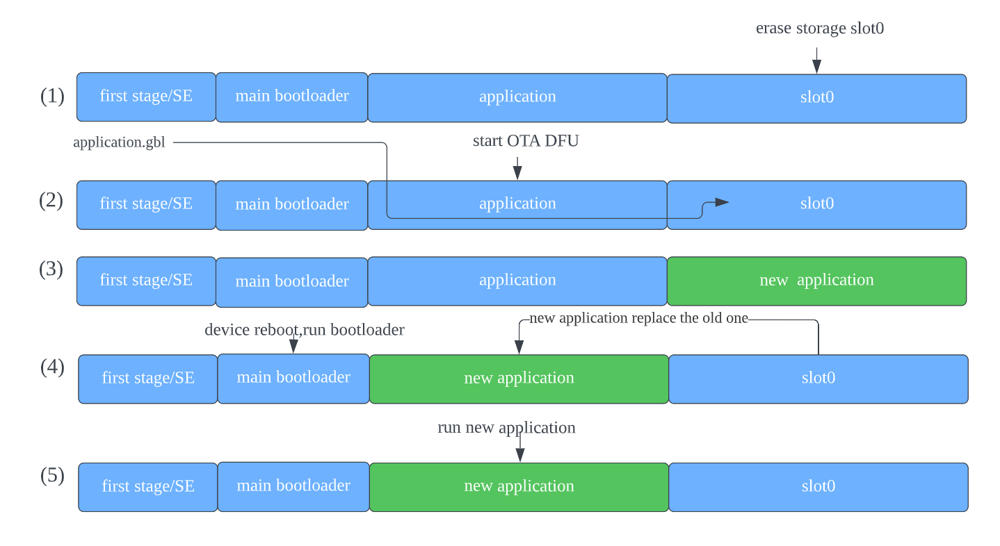  
</div>


这里假设只配置了一个下载区域，因此上面函数调用中的 slot 索引设置为0。 注意：上面步骤(2)中的擦除过程需要几秒钟才能完成。如果新镜像是通过蓝牙连接下载的，那么 supervision timeout 时间必须设置得足够长，以避免连接断开。可以在打开蓝牙连接之前，提前擦除下载区域。或者在写入过程中一次性擦除一个 flash 页面的下载区域。 这可以使用```bootloader_eraseRawStorage()```来完成。

### 3.2.2. 使能 Gecko Bootloader API
Gecko bootloader 通过 bootloader 中的函数表公开应用程序接口。为了能够从蓝牙应用程序中调用 Gecko bootloader 函数，必须将以下源文件添加到项目中:</br>
btl_interface.c (common interface)</br>
btl_interface_storage.c (interface to storage functionality)</br>

这些文件在下面的路径中找到 (更精确的路径由SDK版本决定):</br>
```\gecko_sdk_suite\<version>\platform\bootloader\api\```

从 SDK v3.0 开始，默认情况下这些文件会复制到示例项目中，但必须将相应的包含文件添加到调用任何 Gecko bootloader 的源文件中</br>
```#include "btl_interface.h"```</br>
```#include "btl_interface_storage.h"```</br>

### 3.2.3. 应用程序完成蓝牙 OTA 更新的示例实现
软件组件提供了用户应用程序控制的 OTA 更新的实现示例。要使用它，只需将 “Application OTA DFU” 组件添加到项目中:</br> 
<div align="center">
    
</div>

添加完 "Application OTA DFU" 组件后，"app_ota_dfu" 文件夹将自动生成。"app_ota_dfu" 文件夹下的代码将按照3.1.3.2章节在应用程序中执行固件升级。在工程目录下的 gatt_configuration.btconf 文件将自动添加 "Silicon Labs OTA Data Characteristics"。
<div align="center">
  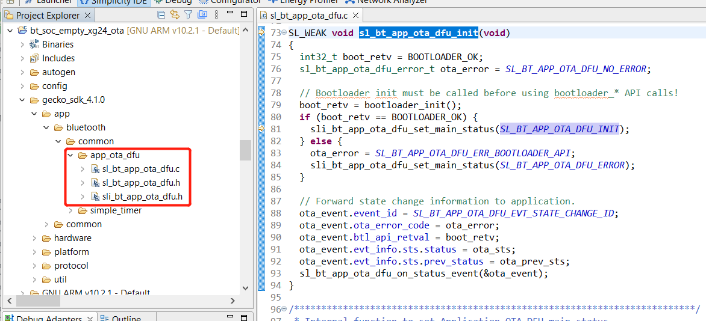  
</div>

## 3.3 Silicon Labs OTA GATT Service
项目中的 XML 定义了 Silicon Labs OTA service。它是一个使用 128 位 UUID 值的自定义 service。 Service 内容和 UUID 值是固定不变的，不能修改。

OTA service 的 characteristic 如下表所示。service 本身的 UUID 值为```1d14d6eefd63-4fa1-bfa4-8f47b42119f0``` </br>
<div align="center">
  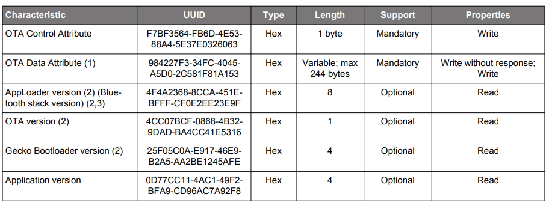  
</div>  
<div align="center">
  <b>Figure 3-3‑1 Silicon Labs OTA Service Characteristics</b>
</div>  
</br> 

注:</br>  
- 1.用户应用程序中 GATT 数据库不包含该特性。
- 2.运行在 DFU 模式下，AppLoader 会自动添加版本信息。它在用户应用程序 GATT 数据库中是可选的。
- 3.版本信息显示了从 SDK 2.7.0 开始的 AppLoader 版本。

<div align="center">
  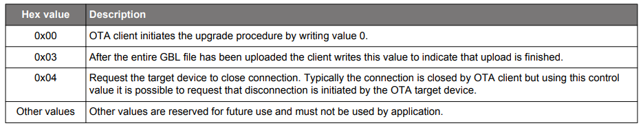  
</div>  
<div align="center">
  <b>Figure 3-3‑2 Possible Control Words Written to the OTA Control Characteristic</b>
</div>  
</br> 
在 DFU 模式下，AppLoader 使用上述完整的 OTA service。这些 attribute 定义使 apploader 可以接收远端蓝牙设备上传的新固件，并完成 OTA 升级。用户应用程序的 GATT 数据库只包括完整 OTA service 的一个子集。使用 apploader 完成 OTA 升级时，应用程序不能在其 GATT 数据库中包含 OTA data attribute。

从用户应用程序的角度来看，只有 OTA control attribute 是需要的。在包含的 OTA 功能的示例应用程序中，当客户端将值写入 OTA control attribute 时，将触发 OTA 过程。用户应用程序不处理任何与 OTA 升级相关的数据传输， 因此 OTA 数据属性被排除在用户应用程序的GATT之外。也可以使用其他触发方式进入 OTA 模式，因此在应用程序的 GATT 数据库中包含 OTA control attribute 并不是绝对必要的，可以从应用程序 GATT 中排除整个 OTA service。然而应该注意的是，如果需要与来自 SDK 或 EFR connect 智能手机应用程序的OTA示例相兼容，OTA 触发必须按照上述 OTA control attribute 来实现。

<div align="center">
  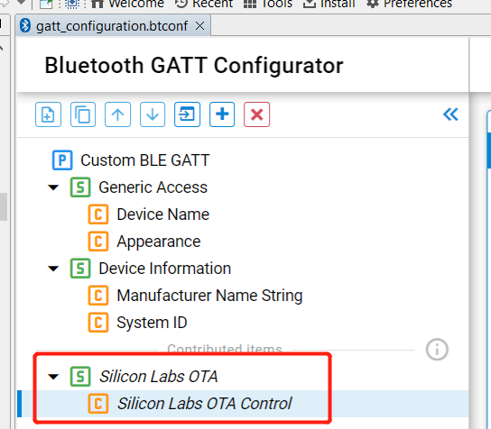  
</div>  
<div align="center">
  <b>Figure 3-3‑3  The OTA Control Characteristic in the Application</b>
</div>  
</br>

如果 OTA 更新完全在应用程序代码中实现，如3.2节所述。在用户应用程序中实现设备固件更新，最低的应用要求是包括 OTA control 和 OTA data attribute。更详细的 OTA Service 信息请参考4.4节的 gatt-configuration.btconf 文件。

<div align="center">
    
</div>  
<div align="center">
  <b>Figure 3-3‑4  The OTA Control Characteristic and the OTA Data characteristic in the Application</b>
</div>  
</br>


# 4 实验 
## 4.1 实验介绍
为了更加直观的显示 OTA 是否成功，在4.3章节 In-Place OTA 实验中，把 bluetooth - SoC Empty SDK 示例应用程序升级为 bluetooth - SoCThermometer example 应用程序。在章节 4.4 的用户应用程序DFU实验中， 把 bluetooth - SoC Empty 示例的设备名改为 "OTA test"。这样用户可以很容易地检查用户应用程序的功能是否发生了变化。 

## 4.2 实验工具准备
- Bluetooth-capable radio board（EFR32MG24-BRD2703A）</br>
- Simplicity Studio 5</br>
- 安装有 EFR Connect App 的 Android 或 iOS Android 移动设备( [Android](https://play.google.com/store/apps/details?id=com.siliconlabs.bledemo&hl=en&gl=US) / [iOS](https://apps.apple.com/us/app/efr-connect/id1030932759)), EFR Connect App 源码 [GitHub](https://github.com/SiliconLabs?q=efrconnect&type=&language=&sort=)</br>

## 4.3 In-Place OTA 实验步骤

1.把 EFR32MG24 设备连接到 PC 并在 Simplicity Studio 选中设备。
<div align="center">
    
</div> 

2.在 Preferred SDK 中选择 Gecko SDK Suite v4.1.0（在本实验中使用的是 v4.1.0，建议使用最新的SDK）。
<div align="center" >
    
</div> 

3.在 Simplicity Studio Launcher 创建```SoC Bluetooth Apploader OTA DFU```示例项目。 
<div align="center">
    
</div> 

4.创建的项目将显示在 “Project Explorer” 上，然后单击锤击图标编译工程。选择 “bootloader-apploader-mg24.s37" 点击鼠标左键，然后选择 "Flash to Device”，将固件镜像烧录到设备上。
<div align="center">
  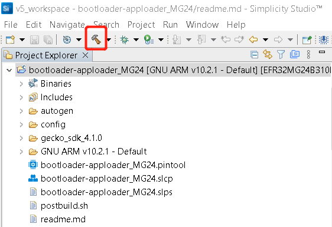  
</div> 
<div align="center">
    
</div>

5.在 Simplicity Studio Launcher 创建 Bluetooth - SoC Empty example。
<div align="center">
  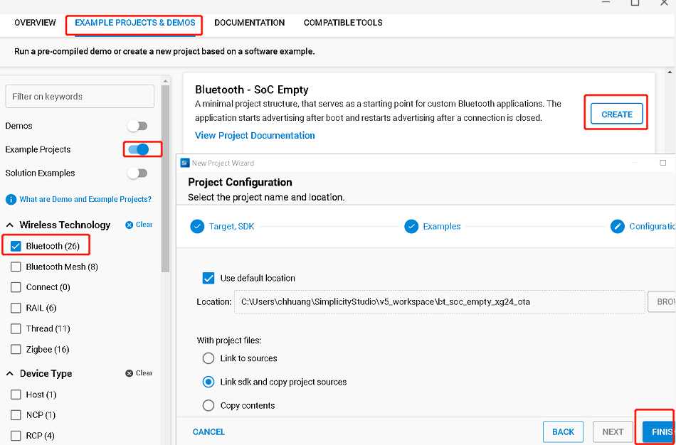  
</div> 

6.编译```Bluetooth - SoC Empty```工程，并将固件烧录到设备上。然后就能在 EFR connect app 中搜索到名为 "Empty Example" 的ble设备。
<div align="center">
    
</div>

7.在 Simplicity Studio Launcher创建 ```Bluetooth - SoC Thermometer``` example。
<div align="center">
    
</div>

8.编译```Bluetooth - SoC Thermometer```工程，并双击 create_bl_files.bat 脚本。在运行 create_bl_files.bat 脚本之前，首先你需要提前定义好两个环境变量，```PATH_SCMD``` 和 ```PATH_GCCARM```。脚本运行后会在你的工程下创建文件名为 output_gbl 的文件夹，里面存储着 .gbl 升级文件。

• application.gbl: 用户应用程序 (包含完整的蓝牙协议栈)
• application-crc.gbl: 带有 CRC32 checksum 的用户应用程序
<div align="center">
    
</div> 
<div align="center">
    
</div> 

9.打开手机上的 EFR Connect 应用程序，并按照下图操作。首先找到 "OTA DFU" 按钮，并选择 "Speed" 配置的 "PARTIAL OTA"选项。在手机上找到第 8 步创建的 application.gbl 文件，然后点击 "OTA"。最终你将在 EFR connect 应用程序中搜索到 Thermometer 示例。
<div align="center">
  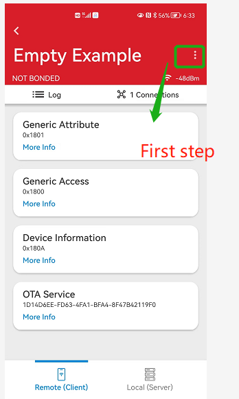  
   
</div> 

<div align="center">
   
    
</div>

<div align="center">
  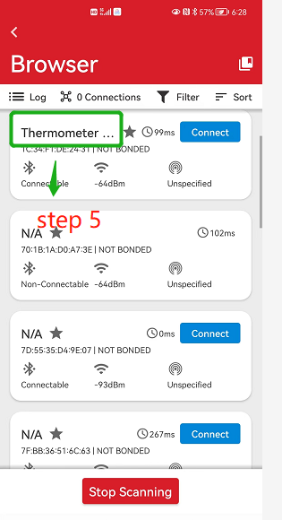  
</div>

## 4.4. 用户应用程序 DFU 实验步骤
1.把 EFR32MG24 设备连接到 PC 并在 Simplicity Studio 选中设备。
<div align="center">
    
</div> 

2.在 Preferred SDK 中选择 Gecko SDK Suite v4.1.0（在本实验中使用的是 v4.1.0，建议使用最新的SDK）。
<div align="center" >
    
</div> 

3.在 Simplicity Studio Launcher 创建 ```Bootloader - Soc Internal Storage``` 示例项目，并命名为 bootloader-storage-internal-single-1536k-xg24。
<div align="center">
  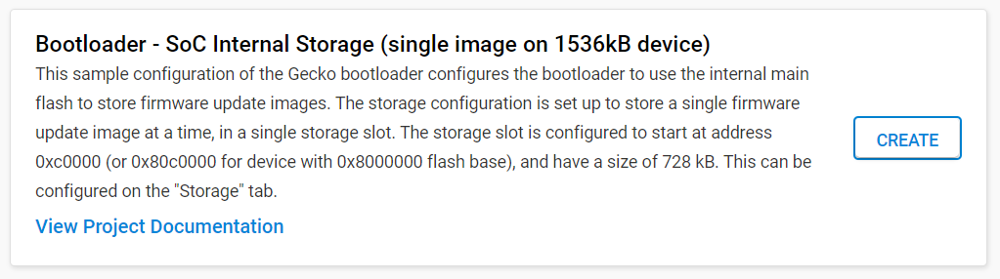  
</div> 

4. 在 "Project Explorer" 一栏中会显示创建的工程，单击锤击图标进行编译。选择 "bootloader-storage-internal-single-1536k-xg24.s37" 点击鼠标左键，然后选择 "Flash to Device" 选项，将固件烧录到设备上。

5. 在 Simplicity Studio Launcher 中创建名为 bt_soc_empty_xg24_ota 的 ```Bluetooth - SoC Empty``` 的示例代码。</br>

6. 双击代码工程下的 bt_soc_empty_xg24_ota.slcp 文件，并参考3.2.3章节添加 "Application OTA DFU" 组件，并卸载掉 "In-Place OTA DFU" 组件。
<div align="center">
    
</div>

7. 编译 bt_soc_empty_xg24_ota 工程，并将固件烧录到设备上，然后即可在手机上的 EFR connect 上搜索到名为 "Empty Example" 的ble设备。 </br>

8. 双击工程下的 gatt_configuration.btconf 文件，选择 "Device Name"，然后把 "Value settings" 设置为 "OTA test" 和 "8" 字节。编译 "bt_soc_empty_xg24_ota" 工程，双击工程目录下的create_bl_files.bat 脚本，然后将 "application.gbl" 文件传送到手机上。
<div align="center" >
  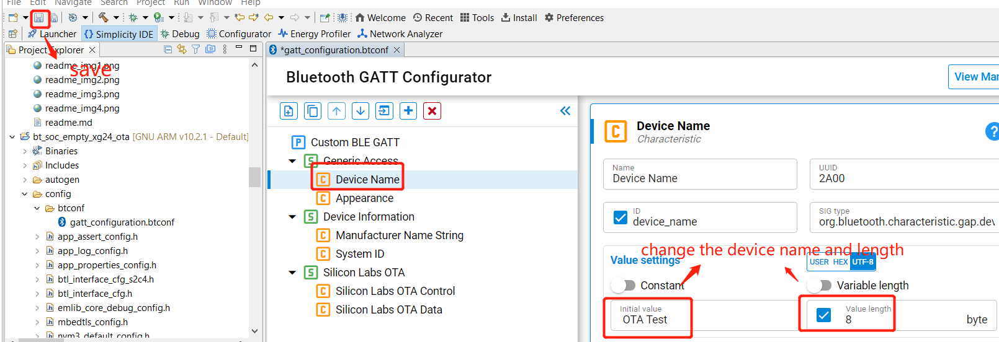  
</div>    

9. 打开手机上的 EFR Connect app 并参考 4.3 章节的第 9 步。首先找到 "OTA DFU" 按钮，并选择 "Speed" 配置的 "PARTIAL OTA"选项。在手机上找到找到第 8 步创建的 application.gbl 文件，然后点击 "OTA"。最终你将在 EFR connect 应用程序中搜索到名为 "OTA test" 的设备。
<div align="center">
    
</div>

# 参考文档

[UG103.6: Bootloader Fundamentals](https://www.silabs.com/documents/public/user-guides/ug103-06-fundamentals-bootloading.pdf)   
[an1086-gecko-bootloader-bluetooth](https://www.silabs.com/documents/public/application-notes/an1086-gecko-bootloader-bluetooth.pdf)   
[UG489: Silicon Labs Gecko Bootloader User's Guide for GSDK 4.0 and Higher](https://www.silabs.com/documents/public/user-guides/ug489-gecko-bootloader-user-guide-gsdk-4.pdf)   
[UG266: Silicon Labs Gecko Bootloader User's Guide for GSDK 3.2 and Lower](https://www.silabs.com/documents/public/user-guides/ug266-gecko-bootloader-user-guide.pdf)   
[How to use bootloader and ota in your project](https://docs.silabs.com/bluetooth/3.3/lab-manuals/how-to-use-bootloaders-and-ota-in-your-project)   
