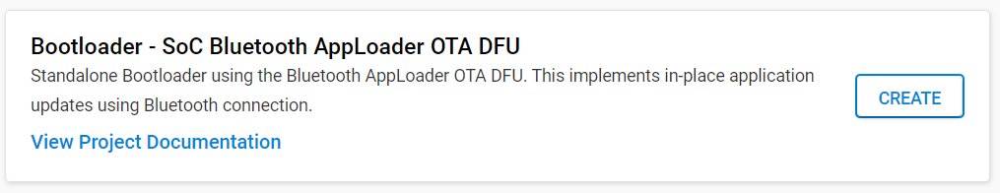
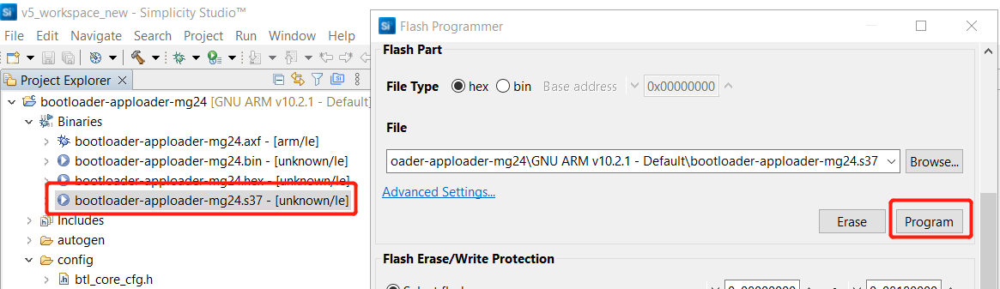

English | [中文](MG24-Bluetooth-OTA-hands-on-cn.md)

<details>
<summary><font size=5>Table of Contents</font> </summary>

- [1. Overview](#1-Overview)
- [2. Bootloader Introduction](#2-Bootloader-Introduction)
- [3. Bluetooth OTA Upgrade](#3-Bluetooth-OTA-Upgrade)
  - [3.1. Implementing Device Firmware Update with AppLoader(In-Place OTA)](#31-Implementing-Device-Firmware-Update-with-AppLoaderIn-Place-OTA)
    - [3.1.1. AppLoader Introduction](#311-AppLoader-Introduction)
    - [3.1.2. Gecko Bootloader Configuration from SDK version 4.0](#312-Gecko-Bootloader-Configuration-from-SDK-version-4.0)
    - [3.1.3. In-Place OTA Process](#313-In-Place-OTA-Process)
      - [3.1.3.1. Basic Steps to Partial Update Firmware from the AppLoader](#3131-Basic-Steps-to-Partial-Update-Firmware-from-the-AppLoader)
      - [3.1.3.2. Basic Steps to Full Update Firmware from the AppLoader](#3132-Basic-Steps-to-Full-Update-Firmware-from-the-AppLoader) 
      - [3.1.3.3. Triggering Reboot into DFU Mode from the User Application](#3133-Triggering-Reboot-into-DFU-Mode-from-the-User-Application)
  - [3.2. Implementing Device Firmware Update in the User Application](#32-Implementing-Device-Firmware-Update-in-the-User-Application)
    - [3.2.1. Basic Steps to Update Firmware from the User Application](#321-Basic-Steps-to-Update-Firmware-from-the-User-Application)
    - [3.2.2. Enabling Gecko Bootloader API](#322-Enabling-Gecko-Bootloader-API)
    - [3.2.3. Example Implementation of Bluetooth OTA Update under Application Control](#323-Example-Implementation-of-Bluetooth-OTA-Update-under-Application-Control)
  - [3.3. Silicon Labs OTA GATT Service](#33-Silicon-Labs-OTA-GATT-Service)
- [4. Lab](#4-Lab)
  - [4.1. Lab Introduction](#41-Lab-Introduction)
  - [4.2. Lab Requirements](#42-Lab-Requirements)
  - [4.3. In-Place OTA Lab Steps](#43-In-Place-OTA-Lab-Steps)
  - [4.4. User Application DFU Lab Steps](#44-User-Application-DFU-Lab-Steps)
- [Reference](#reference)
</details>

*** 

# 1. Overview 
This tutorial explains how to perform a Device Firmware Upgrade (DFU) with Bluetooth Over-The-Air (OTA) update. Any chip that has OTA-updates enabled in their GATT profile can have an OTA upgrade. Most of the example applications provided in the Bluetooth SDK already have OTA support built into the code. In these examples, the DFU mode is triggered through the Silicon Labs OTA service that is included as part of the application’s GATT database. OTA functionality can be added by installing the OTA DFU software component in your project.

# 2. Bootloader Introduction
The Silicon Labs Gecko Bootloader is a common bootloader for all the newer MCUs and wireless MCUs from Silicon Labs. The Gecko Bootloader can be configured to perform a variety of bootload functions, from device initialization to firmware upgrades. The Gecko Bootloader uses a proprietary format for its upgrade images, called GBL (Gecko Bootloader file). These images are produced with the file extension “.gbl”. Additional information on the GBL file format is provided in [UG103.6: Bootloader Fundamentals](https://www.silabs.com/documents/public/user-guides/ug103-06-fundamentals-bootloading.pdf).

The Gecko Bootloader can be configured to perform firmware upgrades in standalone mode (also called a standalone bootloader) or in application mode (also called an application bootloader), depending on the component/plugin configuration. Components (in GSDK 4.0 and higher) and plugins (in older GSDKs) can be enabled and configured through the Simplicity Studio IDE.

If you need to get more detailed information on Silicon Labs Gecko Bootloader and UART/OTA DFU with Silicon Labs Bluetooth application, please refer to [an1086-gecko-bootloader-bluetooth.pdf](https://www.silabs.com/documents/public/application-notes/an1086-gecko-bootloader-bluetooth.pdf).

# 3. Bluetooth OTA Upgrade
This chapter will introduce how to implement device firmware update functionality by AppLoader (In-Place OTA) and the User Application.

## 3.1. Implementing Device Firmware Update with AppLoader(In-Place OTA)
A Bluetooth application developed with Silicon Labs Bluetooth SDK comprises two parts: AppLoader and the user application. AppLoader is a small standalone application that is required to support in-place OTA updates. AppLoader can run independently of the user application. It contains a minimal version of the Bluetooth stack, including only those features that are necessary to perform the OTA update. Any Bluetooth features that are not necessary to support OTA updates are disabled in AppLoader to minimize the flash footprint.

### 3.1.1. AppLoader Introduction
The AppLoader features and limitations are summarized below:</br>
• Enables OTA updating of user application.</br>
• The AppLoader itself can also be updated.</br>
• Only one Bluetooth connection is supported, GATT server role only.</br>
• Encryption and other security features such as bonding are not supported.</br>
• PTI is not enabled so it is not possible to use the Network Analyzer with the AppLoader.</br>

Note: AppLoader in SDK v3.x or higher requires that the Gecko Bootloader version must be v1.11 or later to support OTA.

The user application is placed in code flash after AppLoader. The default linker script provided in the SDK places the user application so that it starts at the next flash sector following AppLoader. The user application contains a full-featured version of the Bluetooth stack and it can run independently of the AppLoader. If in-place OTA update does not need to be supported then the AppLoader can be removed completely to free up flash for other use (code space or data storage). 

### 3.1.2. Gecko Bootloader Configuration from SDK version 4.0

From SDK version v4.0, the Apploader can also be included in the Bootloader. The following picture shows an example of this new layout:
<div align="center">
    
</div> 
To use the Apploader from the Bootloader, the start address of the application needs to be changed so there will be enough space for the Bootloader and the Apploader before the application. This is not possible in Series 1 devices, so this new method can only be used for Series 2 devices. For Series 2 devices, this is the new default configuration.

### 3.1.3. In-Place OTA Process
Most of the OTA functionality is handled autonomously by the AppLoader, which greatly simplifies application development. The minimum requirement for the user application is for a way to trigger a reboot into DFU mode. Rebooting into DFU mode in this context means that after the device is reset, the AppLoader is run instead of the user application. After the upload is complete, AppLoader will reboot the device back into normal mode.

Reboot into DFU mode can be triggered in a variety of ways. It is up to the application developer to decide which is most applicable.The following sections explain in detail how this is done in the user application.

AppLoader supports two types of update:</br>
• Full update: both Bootloader and the user application are updated</br>
• Partial update: only the user application is updated</br>
 
A full update is always recommended when moving from one SDK version to another. The size of AppLoader can vary depending on the SDK version. This may prevent a partial OTA update if the new application image overlaps with the old AppLoader version.

#### 3.1.3.1. Basic Steps to Partial Update Firmware from the AppLoader
With partial update, it is possible to update the Bluetooth stack and user application. BootLoader is not modified during partial update. The partial update process using AppLoader consists of following steps:

1. • OTA client connects to target device.</br>
   • Client requests target device to reboot into DFU mode.</br>
2. • After reboot, client connects again. During the 2nd connection, target device is running AppLoader which is contained in bootloader image file(not the user application).</br>
   • New firmware image (application.gbl) is uploaded to the target.</br>
   • AppLoader copies the new application on top of the existing application.</br>
3. • When upload is finished and connection closed, AppLoader reboots back to normal mode.</br>
   • Update complete.</br>
<div align="center">
    
</div> 

#### 3.1.3.2. Basic Steps to Full Update Firmware from the AppLoader
Full update enables updating both the bootloader which contain AppLoader and the user application. Full update is done in two steps. Updating the bootloader always erases the user application and therefore bootloader update must always be followed by application update. The first phase of full update updates the bootloader which contain AppLoader and it consists of following steps:

1. • OTA client connects to target device.</br>
   • Client requests target device to reboot into DFU mode.</br>
2. • After reboot, client connects again. During the 2nd connection, target device is running AppLoader in bootloader image file(not the user application).</br>
   • New bootloader image (bootloader.gbl) is uploaded to the target. AppLoader copies the image into the download area (specified in Gecko bootloader configuration).</br>
3. • When upload is finished and connection closed, AppLoader reboots and requests the first stage/Secure Element to install the downloaded image.</br>
   • The first stage/Secure Element will overwrite the main bootloader with the new image. After reboot, the new bootloader which contain new apploader is started.</br>
<div align="center">
    
</div> 

At the end of the bootLoader update, the device does not contain a valid user application and therefore appLoader will remain in DFU mode. To complete the update, a new user application is uploaded following the same sequence of operations that were described for the partial update.

It is recommended to use Gecko SDK 4.1.0 "SoC Bluetooth AppLoader OTA DFU" project that appLoader has been added by default. Create the example bootloader project below,and the component of Bluetooth AppLoader OTA DFU has been added.
<div align="center">
    
</div> 

#### 3.1.3.3. Triggering Reboot into DFU Mode from the User Application
The minimum functional requirement to enable OTA in the user application is to implement a "hook" that allows the device to be rebooted into DFU mode. By default, this is done through the Silicon Labs OTA service. The following code snippet is from the SoC empty example supplied with the SDK. The code to enter DFU mode is similar in the other examples.
<div align="center">
    
</div> 

## 3.2. Implementing Device Firmware Update in the User Application
It is possible to implement the firmware update functionality completely in the user application. This makes it possible to use a custom GATT service instead of the Silicon Labs OTA service. To use this update mechanism, any application bootloader configuration may be used, using internal or external storage. At least one download area must be defined and the area must be large enough to fit the full GBL file. The download area must not overlap with the user application.

### 3.2.1. Basic Steps to Update Firmware from the User Application
The general firmware upgrade sequence is explained in [UG489: Silicon Labs Gecko Bootloader User's Guide for GSDK 4.0 and Higher](https://www.silabs.com/documents/public/user-guides/ug489-gecko-bootloader-user-guide-gsdk-4.pdf) and [UG266: Silicon Labs Gecko Bootloader User's Guide for GSDK 3.2 and Lower](https://www.silabs.com/documents/public/user-guides/ug266-gecko-bootloader-user-guide.pdf). 

The basic steps are summarized below.

1. • Application initializes the Gecko bootloader by calling ```bootloader_init()```.</br>
   • Get bootlader information by ```bootloader_getInfo```.Storage slot information can be got by ```bootloader_getStorageSlotInfo```.</br>
   • Run through the full storage and read the context in chunks by ```calling bootloader_readStorage```.</br>
   • The download area is erased by calling ```bootloader_eraseStorageSlot(0)```.</br>
2. • OTA client connects to target device.Client requests target device into DFU mode.</br>
   • The update image (full GBL file) is received over-the-air, application writes the received bytes to the download area by calling ```bootloader_writeStorage()```.</br>
3. • (optional) Application can verify the integrity of the received GBL file by calling ```bootloader_verifyImage()```.</br>
4. • Before rebooting, call ```bootloader_setAppImageToBootload(0)``` to specify the slot ID where new image is stored.</br>
   • Reboot and instruct Gecko bootloader to perform the update by calling ```bootloader_rebootAndInstall()```.</br>
5. • Update complete,run new application.</br>
<div align="center">
    
</div>

It is assumed here that only one download area is configured and therefore the slot index in the above function calls is set to 0.Note that the erase procedure in step (2) above takes several seconds to complete. If the new image is downloaded over a Bluetooth connection then the supervision timeout must be set long enough to avoid connection drops. Alternatively, the download area can be erased in advance, before the Bluetooth connection is opened. A third alternative is to erase the download area one flash page at a time while the writing progresses. This can be done using ```bootloader_eraseRawStorage()```.

### 3.2.2. Enabling Gecko Bootloader API
Gecko bootloader has an application interface exposed through a function table in the bootloader. To be able to call Gecko bootloader functions from your Bluetooth application, the following source files must be added into the project:</br>
btl_interface.c (common interface)</br>
btl_interface_storage.c (interface to storage functionality)</br>

These files are found in the Gecko SDK suite in the following directory (exact path depends on installed SDK version):</br>
```\gecko_sdk_suite\<version>\platform\bootloader\api\```

Starting with SDK v3.0, these files are copied to the sample projects by default but the corresponding include files must be added to the source file(s) that call any Gecko bootloader functions:</br>
```#include "btl_interface.h"```</br>
```#include "btl_interface_storage.h"```</br>

### 3.2.3. Example Implementation of Bluetooth OTA Update under Application Control
An example implementation of application-controlled OTA update is provided as a Software Component. To use it, simply add the "Application OTA DFU" component to the project:</br>
<div align="center">
    
</div>

After add "Application OTA DFU" component,"app_ota_dfu" folder will be automatically generated.The code of "app_ota_dfu" folder follow the section 3.1.3.2 to implement device firmware update in the user application.The gatt_configuration.btconf file will automatically add "Silicon Labs OTA Data Characteristics" in the project tree.
<div align="center">
    
</div>

## 3.3. Silicon Labs OTA GATT Service
The XML representation in the project defines the Silicon Labs OTA service. It is a custom service using 128-bit UUID values. The service content and the UUID values are fixed and must not be changed.</br>
The OTA service characteristics are described in the following table. The UUID value of the service itself is ```1d14d6eefd63-4fa1-bfa4-8f47b42119f0```.</br>
<div align="center">
    
</div>  
<div align="center">
  <b>Figure 3-3‑1 Silicon Labs OTA Service Characteristics</b>
</div>  
</br> 

Notes:</br> 
- (1) This characteristic is excluded from the user application GATT database.
- (2) Version information is automatically added by AppLoader when running in DFU mode. These are optional in the application GATT database.
- (3) This characteristic exposes AppLoader version starting from SDK 2.7.0; was stack version in earlier versions.

<div align="center">
    
</div>  
<div align="center">
  <b>Figure 3-3‑2 Possible Control Words Written to the OTA Control Characteristic</b>
</div>  
</br> 

In DFU mode, AppLoader uses the full OTA service described above. This allows a remote Bluetooth device to upload a new firmware image, as described later in this chapter. The GATT database of the user application includes only a subset of the full OTA service. The application must not include the OTA data characteristic in its GATT database.

<div align="center">
    
</div>  
<div align="center">
  <b>Figure 3-3‑3  The OTA Control Characteristic in the Application</b>
</div>  
</br>

If the OTA update is implemented fully in application code, as described in section 3.2. Implementing Device Firmware Update in the User Application. The minimum application requirement is to include the OTA control and the OTA Data characteristic. For more detailed OTA service information, please refer to section 4.4. gatt-configuration.btconf file.

From the user application viewpoint, only the OTA control attribute is relevant. In the OTA host example reference implementation that is included in the SDK, the OTA procedure is triggered when the client writes value 0 to the OTA control attribute. The user application does not handle any data transfers related to OTA upgrades and therefore the OTA Data Attribute is excluded from the user application’s GATT. 

<div align="center">
    
</div>  
<div align="center">
  <b>Figure 3-3‑4  The OTA Control Characteristic and the OTA Data characteristic in the Application</b>
</div>  
</br>

It is also possible to use an application-specific trigger to enter OTA mode, and therefore it is not absolutely necessary to include the OTA control attribute in the application’s GATT database. If reboot into DFU mode is handled using some other mechanism, then it is possible to exclude the whole OTA service from the application GATT. However, it should be noted that to be compatible with the OTA host example from the SDK or the EFR Connect smartphone app the OTA trigger must be implemented as described above.

# 4. Lab 
## 4.1. Lab Introduction

For tutorial purposes, the Bluetooth - SoC Empty SDK example application will be upgraded to the Bluetooth - SoC Thermometer example application in section 4.3 In-Place OTA Lab Step. In section 4.4 User Application DFU Lab Steps,the Bluetooth - SoC Empty SDK example application will be changed device name as "OTA test". So users can easily check that the functionality of the user application has changed.


## 4.2. Lab Requirements
- Bluetooth-capable radio board（EFR32MG24-BRD2703A）</br>
- Simplicity Studio 5</br>
- Android or iOS mobile device</br>
- Download EFR Connect mobile app, version 2.4 or newer( [Android](https://play.google.com/store/apps/details?id=com.siliconlabs.bledemo&hl=en&gl=US) / [iOS](https://apps.apple.com/us/app/efr-connect/id1030932759)),and the source is available on [GitHub](https://github.com/SiliconLabs?q=efrconnect&type=&language=&sort=)

## 4.3. In-Place OTA Lab Steps
1. Connect the kit to your computer and select it in Simplicity Studio.</br>
<div align="center">
    
</div> 

2. Select Gecko SDK Suite v4.1.0 in Preferred SDK.</br>
<div align="center" >
    
</div> 

3. Create the ```Bootloader - SoC Bluetooth Apploader OTA DFU ```example project from Simplicity Studio Launcher.</br>
<div align="center">
    
</div> 

4. The created project will display on the "Project Explorer", then click the hammer icon to build the project. After building the bootloader image, right click on the "bootloader-apploader-mg24.s37" and select "Flash to Device" for programming the image to the device.
<div align="center">
    
</div> 
<div align="center">
    
</div>

5. Create the ```Bluetooth - SoC Empty example``` project from Simplicity Studio Launcher.</br>
<div align="center">
    
</div> 

6. Build the ```Bluetooth - SoC Empty``` project and flash the firmware image to the device, then EFR connect can discover the device named "Empty Example". </br>
<div align="center">
    
</div> 

7. Create the ```Bluetooth - SoC Thermometer``` example project.</br>
<div align="center">
    
</div> 

8. Build the ```Bluetooth - SoC Thermometer project``` and double click on the create_bl_files.bat script in the project tree. You may need to define two environment variables ```PATH_SCMD``` and ```PATH_GCCARM``` before running the script. The script creates a folder named output_gbl under your project and .gbl upgrade image files in this folder:

 • application.gbl: user application (including full Bluetooth stack)</br>
 • application-crc.gbl: user application with a CRC32 checksum</br>

Transfer the "application.gbl" file in the output_gbl folder to the phone.

<div align="center">
    
</div> 
<div align="center">
    
</div> 

9. Open the EFR Connect app on your phone and follow up the picture below. Frist find the "OTA DFU" button, and select the "PARTIAL OTA" with "Speed" configuration. Find the application.gbl which is created by step 8. Then click the "OTA". Eventually, you'll search Thermometer Example in your "EFR Connect" app.
<div align="center">
    
   
</div> 

<div align="center">
   
    
</div>

<div align="center">
    
</div>

## 4.4. User Application DFU Lab Steps
1. Connect the kit to your computer and select it in Simplicity Studio.</br>
<div align="center">
    
</div> 

2. Select Gecko SDK Suite v4.1.0 in Preferred SDK.</br>
<div align="center" >
    
</div> 

3. Create the ```Bootloader - Soc Internal Storage ```example project named bootloader-storage-internal-single-1536k-xg24 from Simplicity Studio Launcher.</br>
<div align="center">
    
</div> 

4. The created project will display on the "Project Explorer", then click the hammer icon to build the project. After building the bootloader image, right click on the "bootloader-storage-internal-single-1536k-xg24.s37" and select "Flash to Device" for programming the image to the device.

5. Create the ```Bluetooth - SoC Empty``` example project from Simplicity Studio Launcher named bt_soc_empty_xg24_ota.</br>

6. Double click on the bt_soc_empty_xg24_ota.slcp file in the project tree. Then remove "In-Place OTA DFU" component and add the "Application OTA DFU" component according to the section 3.2.3.
<div align="center">
    
</div>

7. Build the "bt_soc_empty_xg24_ota" project and flash the firmware image to the device, then EFR connect can discover the device named "Empty Example" </br>

8. Double click on the gatt_configuration.btconf file in the project tree. Select the "Device Name", then set the "Value settings" as "OTA test" and "8" byte. Build the "bt_soc_empty_xg24_ota" project, and double click on the create_bl_files.bat script in the project tree. Transfer the "application.gbl" file in the output_gbl folder to the phone.
<div align="center" >
    
</div>    

9. Open the EFR Connect app on your phone and follow up the picture in section 4.3 step 9. Frist find the OTA DFU button, and select the PARTIAL OTA with "Speed" configuration. Find the application.gbl which is created by step 9. Then click the OTA. Eventually, you'll search "OTA test" in your "EFR Connect" app.
<div align="center">
    
</div>
# Reference

[UG103.6: Bootloader Fundamentals](https://www.silabs.com/documents/public/user-guides/ug103-06-fundamentals-bootloading.pdf)   
[an1086-gecko-bootloader-bluetooth](https://www.silabs.com/documents/public/application-notes/an1086-gecko-bootloader-bluetooth.pdf)   
[UG489: Silicon Labs Gecko Bootloader User's Guide for GSDK 4.0 and Higher](https://www.silabs.com/documents/public/user-guides/ug489-gecko-bootloader-user-guide-gsdk-4.pdf)   
[UG266: Silicon Labs Gecko Bootloader User's Guide for GSDK 3.2 and Lower](https://www.silabs.com/documents/public/user-guides/ug266-gecko-bootloader-user-guide.pdf)   
[How to use bootloader and ota in your project](https://docs.silabs.com/bluetooth/3.3/lab-manuals/how-to-use-bootloaders-and-ota-in-your-project)   
