English | [中文](BLE-Power-consumption-optimization_cn.md)

<details>
<summary><font size=5>Table of Contents</font> </summary>

- [1. Overview](#1-overview)
- [2. Current Consumption Test Tool ](#2-current-consumption-test-tool)
- [3. Optimizing Current Consumption](#3-optimizing-current-consumption)
  - [3.1. Advertising Interval vs Current Consumption](#31-advertising-interval-vs-current-consumption)
  - [3.2. TX power: 0 dBm vs 8 dBm](#32-tx-power-0-dBm-vs-8-dBm)
  - [3.3. Current Profile: Connectable vs Non-Connectable Advertising Mode](#33-current-profile-connectable-vs-non-Connectable-advertising-mode)
  - [3.4. Current Profile: Deep Sleep Mode](#34-current-profile-deep-sleep-mode)
  - [3.5. Current Profile: Connection Interval](#35-current-profile-connection-interval)
  - [3.6. Current Profile: Peripheral Latency](#36-current-profile-peripheral-latency)
  - [3.7. Current Consumption: 1M vs 2M PHY](#37-current-consumption-1M-vs-2M-PHY)
  - [3.8. The Command of Force Radio to Idle State](#38-the-command-of-force-radio-to-idle-state)
  - [3.9. LE Power Control](#39-LE-power-control)
- [4. Lab](#4-lab)
- [5. Summary](#5-summary)
- [Reference](#reference)
</details>

***

# 1. Overview 
Current consumption or, more generally, energy usage is a major concern in battery-powered products. Bluetooth Low Energy has the potential to add wireless connectivity to your device while keeping its energy consumption low. To achieve low energy consumption, however, you need to optimize the Bluetooth application depending on the use case for optimum power reduction.

There are two main factors affecting current consumption in a Bluetooth Low Energy (BLE) device. They are the amount of power transmitted and the total amount of time that the radio is active (TX and RX). The amount of transmit power required depends on the range required between central and peripheral. Range is greatly affected by the environment such as obstacles and the amount of 2.4 GHz traffic present. The first tip is not to transmit more power than required. The amount of time that a radio is active is determined by how often the radio must transmit or receive and the length of time required to transmit or receive. The first, and probably most obvious, tip is to keep characteristics small. Don’t use a 32 bit integer if 8 bits will do.

In general, the power consumption of a BLE device can be optimized by setting appropriate advertising interval, connection parameter and TX power.

# 2. Current Consumption Test Tool 
The Energy Profiler in Simplicity Studio is a software tool that works together with the Advanced Energy Monitoring (AEM) circuitry built into the WSTK main board. It allows measuring the current consumption of the test device in real-time.
<div align="center">
    
</div>  
<div align="center">
  <b>Figure 2‑1 Energy Profiler Tool</b>
</div>  
</br>  
Click "Quick Access" with left mouse button, and select "Start Energy Capture". Then select the device which need monitor the power consumption and click "OK". You can see the power consumption of the device.
<div align="center">
  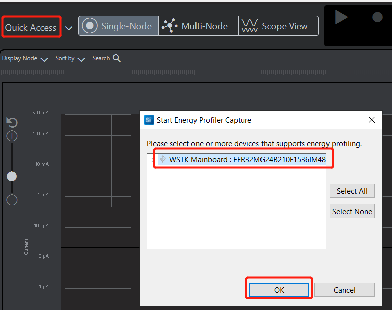  
</div>  
<div align="center">
  <b>Figure 2‑2 Start Energy Profiler Capture</b>
</div>  
</br>  

<div align="center">
    
</div>  
<div align="center">
  <b>Figure 2‑3 Power Consumption with Energy Profiler</b>
</div>  
</br> 

The AEM on the Wireless STK Mainboard (BRD4001A) is capable of measuring currents in the range of 0.1 µA to 95 mA. The second stage amplifier amplifies the signal with two different gain settings with the transition occurring around 250 µA. For currents above 250 µA, the AEM is accurate within 0.1 mA. When measuring currents below 250 µA, the accuracy increases to 1 µA. Even though the absolute accuracy is 1 µA in the sub 250 µA range, the AEM can detect changes in the current consumption as small as 0.1 µA.   

The Wireless Pro Kit Mainboard (BRD4002A) is the successor to the Wireless Starter Kit Mainboard (BRD4001A), which comes with some improvements and added features including increased AEM measurement range and sample rate. The AEM circuitry on the Wireless Pro Kit Mainboard is capable of measuring current signals in the range of approximately 0.1 µA to 495 mA. The expected typical accuracy of the AEM on the Wireless Pro Kit Mainboard is within 1 %, except for currents in the low tens of microamps where offset errors start to dominate. In this low current region, the expected typical accuracy is some hundred nanoamps.   

<div align="center">
    
</div>  
<div align="center">
  <b>Figure 2‑4 Advanced Energy Monitor Parameters</b>
</div>  
</br> 

If you need a more precise measure of current consumption. Using DC power analyzer is a good choice. Keysight N6705 DC power analyzer is a multifunctional power system that can be used as a multi-output DC power supply and waveform/data capture function for oscilloscopes and data recorders.

N6705 DC power analyzer parameter configuration:</br>
- Set 3.3V supply voltage</br>
- Display Trace: Current</br>
- Sample Period: 0.02048ms</br>
- Data Log Ranges:</br>
  - Voltage: Auto</br>
  - Current: Auto</br>

<div align="center">
    
</div>  
<div align="center">
  <b>Figure 2‑5 Power Consumption with N6705C DC Power Analyzer</b>
</div>  
</br> 

# 3. Optimizing Current Consumption
This section describes a series of optimization methods about current consumption in detail.
## 3.1. Advertising Interval vs Current Consumption
Advertising interval is adjustable, from 20 ms to 40.96 s (non-connectable: minimum is 100 ms). Increasing advertising interval can significantly decrease the average current consumption of a BLE device. For instance, increasing advertising interval from 100 ms to 2 s drops the average current consumption by 93%.
<div align="center">
  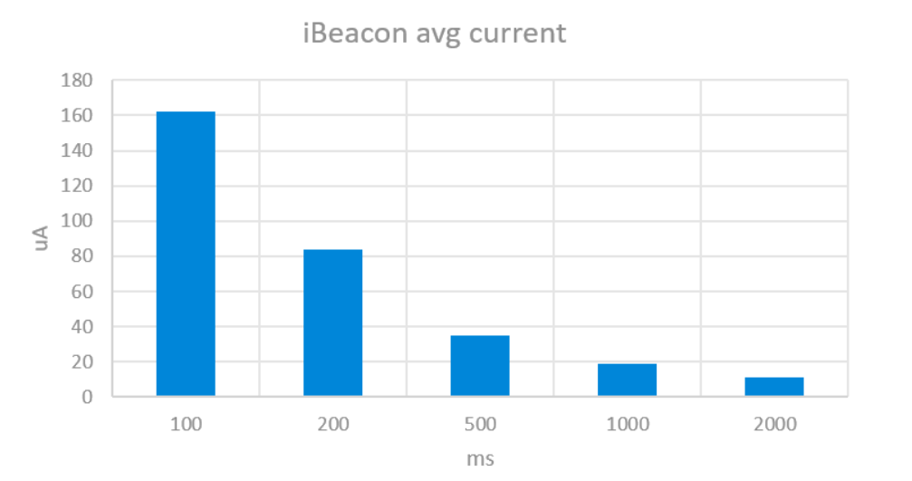  
</div>  
<div align="center">
  <b>Figure 3‑1 IBeacon Average Current Consumption with Different Advertising Interval</b>
</div>  
</br> 

## 3.2. TX power: 0 dBm vs 8 dBm
The transmit power is adjustable, from -26 dBm to +10 dBm (default is 8 dBm if the device supports it). 0 dBm is enough to cover about 10 to 15 m range, based on tests made with iBeacon example and mobile phone. The transmission power can easily be changed in applications using the API call to ```sl_bt_system_set_tx_power()```.

Changing the TX power from 8 dBm to 0 dBm can reduce the current consumption by more than 120% using 100 ms advertising interval, and 105% using 1 s advertising interval.
<div align="center">
  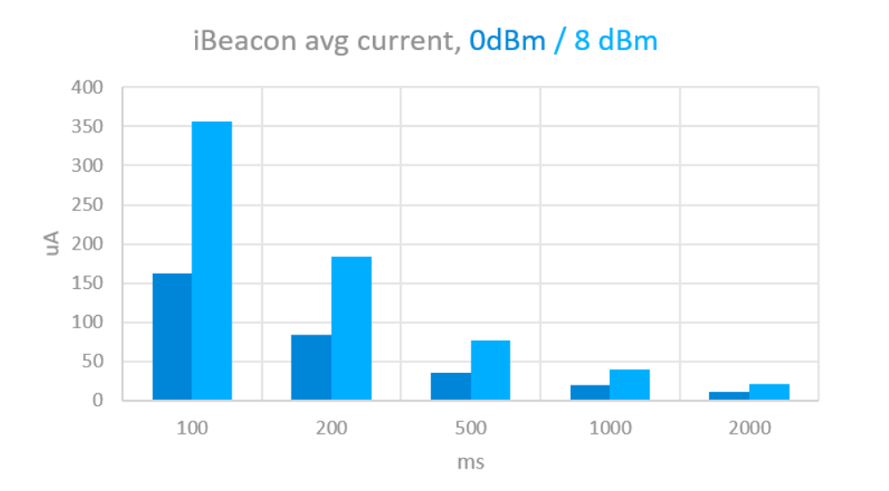  
</div>  
<div align="center">
  <b>Figure 3‑2 IBeacon Average Current Consumption with Different Advertising Interval and TX Power</b>
</div>  
</br> 

## 3.3. Current Profile: Connectable vs Non-Connectable Advertising Mode
Non-connectable mode supports only the TX operation, whereas connectable mode of advertising supports both TX and RX operations.
<div align="center">
  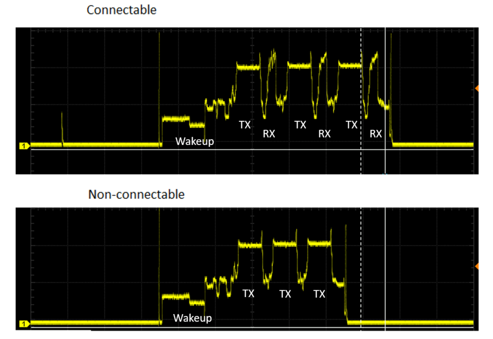  
</div>  
<div align="center">
  <b>Figure 3‑3-1 Connectable and Non-connectable Advertising Current</b>
</div>  
</br> 

<div align="center">
  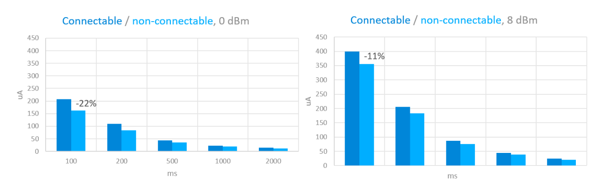  
</div>  
<div align="center">
  <b>Figure 3‑3-2 Average Current Consumption of Connectable and Non-connectable Advertising Mode with Different TX Power</b>
</div>  
</br> 

## 3.4. Current Profile: Deep Sleep Mode
If deep sleep is enabled (as in most of the examples), the device can enter EM2 mode automatically between advertising events. Deep sleep is only disabled if a peripheral of software component (e.g., UART) disables it. For example, consider switching off debug logs via UART in your final code because UART may disable deep sleep.
<div align="center">
  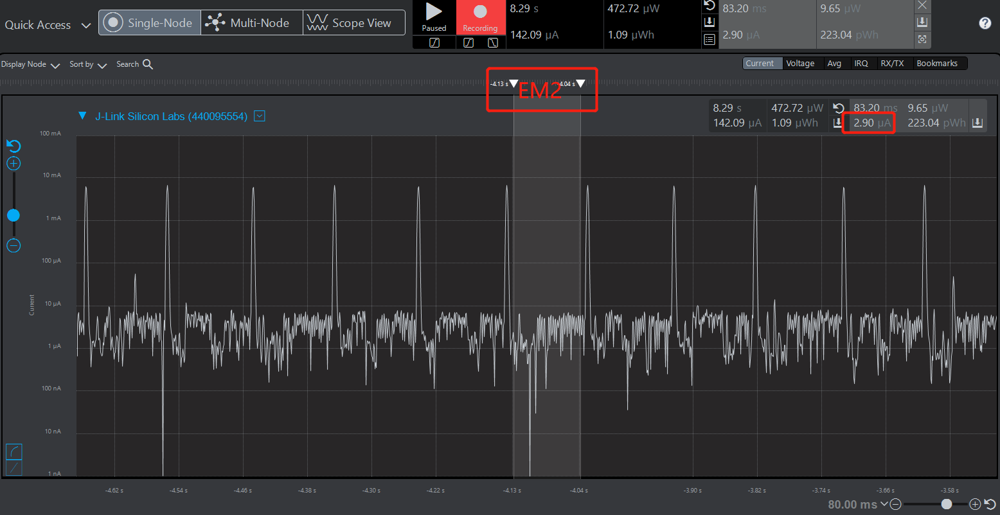  
</div>  
<div align="center">
  <b>Figure 3‑4-1 EM2 Sleep Mode Current Consumption</b>
</div>  
</br> 

Debug connectivity can be disabled to reduce current consumption. In the Bluetooth - SoC Empty project,debug connectivity is enabled by default. It can be enabled by setting the EM2DBGEN bit in the EMU_CTRL register, and will consume about 0.5 uA extra supply current.

<div align="center">
    
</div>  
<div align="center">
  <b>Figure 3‑4-2 Allow Debugger to Remian Connected in EM2</b>
</div>  
</br> 

Note: When disble debugger to remian connected in EM2 and most of time the program stay in EM2 state, it would be hard to program the EFR32BG24 device.  
You can use commander to recovery the device as follows:     ```commander device recover --device efr32mg24 ```

In some cases, going to EM3 and EM4 between advertising may be possible to save energy. This, however, only applies to non-connectable advertisements, and should be solved by the application.

In EM3 the LFXO/LFRCO is not running so we need to use some other clock source for the BURTC in which the stack timing is based on. The ULFRCO can be used and it is an extremely low power oscillator which is always running and its frequency can vary from 0.944kHz to 1.095kHz based on EFR32xG2X datasheet, but for this particular usage the higher inaccuracy is not problematic. The Bluetooth stack does not work in EM3 Stop mode. Note, however, while EM2 Deep Sleep mode means a huge energy saving compared to EM1 Sleep mode, in EM3 Stop mode the current consumption drops only with around tenth of microamperes compared to EM2 Deep Sleep mode. 

Going deeper into the energy modes EM4 brings more substantial energy savings in sleep mode which can be beneficial above certain sleep periods. In EM4 there is very little functionality, RAM and register retention is lost and wake up requires a system reset to return back to EM0.

One of the peripherals supported in EM4 is the BURTC which can be clocked from the ULFRCO to generate periodic wake-ups. These wake-ups will effectively reset the device but as we are again not activating the LFXO, which takes the longest to stabilize, it is possible to have very a short wake-up time. Therefore, you are advised to use LFRCO instead of LFXO as the clock source in scenarios that require a short wake-up time. 

There is demo code which can wake up periodically from EM4 to send ibeacon.
https://github.com/SiliconLabs/bluetooth_applications/tree/master/bluetooth_using_em4_energy_mode_in_bl_ibeacon_app

## 3.5. Current Profile: Connection Interval
As with advertising, the connection interval has a direct impact on the current consumption. The connection interval can be adjusted between 7.5 ms and 4 s and is an easy way to trade-off between latency/throughput and average current consumption.

The following picture shows the current consumption of connection with Empty Packet Transfer (Active Time 1.5 ms), and 15 ms Connection Interval.
<div align="center">
    
</div>  
<div align="center">
  <b>Figure 3‑5-1 15ms Connection Interval Current Consumption</b>
</div>  
</br> 
 
The following graph shows the average current required to keep the connection up, with different connection intervals (at 0 dBm TX power). The RF duty cycle is calculated based on the 1.5 ms activity in each interval.
<div align="center">
    
</div> 
<div align="center">
  <b>Figure 3‑5-2 Average Current vs Duty Cycle</b>
</div>  
</br> 

## 3.6. Current Profile: Peripheral Latency
Peripheral latency ensures that the peripheral device can skip N connection intervals if it does not have anything to transmit. Note, however, that the central device still needs to poll the peripheral at every connection interval. Peripheral latency can be set using sl_bt_connection_set_parameters() API.
Average Current Consumption: Peripheral Latency OFF (Upper Graph) vs Peripheral Latency Value of 5 (Lower Graph)
With a connection interval of 15 ms, in the above graphs, changing the peripheral latency value to 5 can drop down the average current consumption.
<div align="center">
  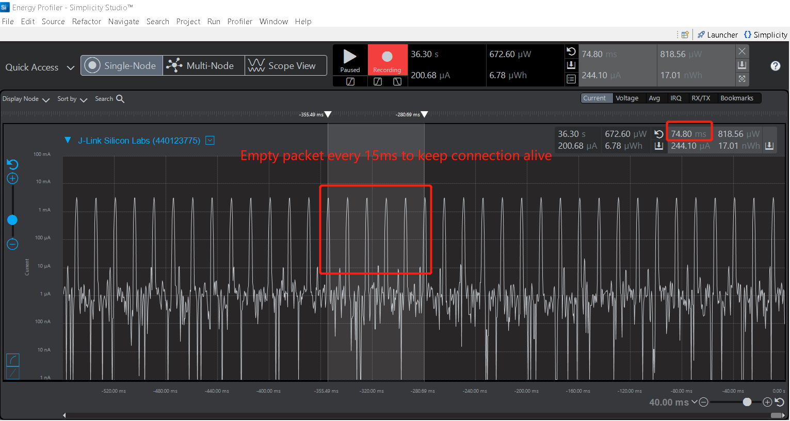   
</div>  
<div align="center">
  <b>Figure 3‑6-1 15ms Connection Interval With Peripheral Latency OFF</b>
</div>  
</br> 

<div align="center">
  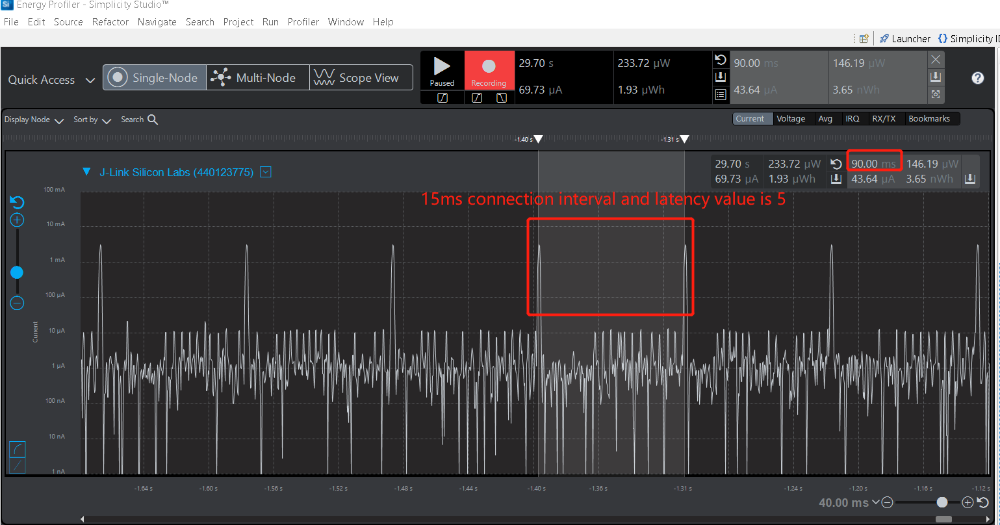   
</div>  
<div align="center">
  <b>Figure 3‑6-2 15ms Connection Interval With Peripheral Latency of 5</b>
</div>  
</br> 

## 3.7. Current Consumption: 1M vs 2M PHY
Bluetooth 5 introduced 2M PHY for faster throughput and higher energy efficiency. This can lower the average current by reducing the air time of the radio and allowing the MCU to sleep more. The following graph compares the current consumption for a short packet transmission over 1M (up) and 2M (down) PHYs connections with a connection interval of 15 ms, in both cases. Going from 1M to 2M PHY, the energy consumption is reduced by 16%. For larger data transmissions the gain can be even higher.
<div align="center">
    
</div>  
<div align="center">
  <b>Figure 3‑7-1 1M PHY Power Consumption with 15ms Connection Interval</b>
</div>  
</br> 

<div align="center">
    
</div>  
<div align="center">
  <b>Figure 3‑7-2 2M PHY Power Consumption with 15ms Connection Interval</b>
</div>  
</br> 

## 3.8. The Command of Force Radio to Idle State 
There is a command  ```sl_status_t sl_bt_system_halt (uint8_t halt) ``` which can force radio to idle state and allow device to sleep.Advertising, scanning, connections, and software timers are halted by this command. Halted operations resume after calling this command with parameter 0. Connections stay alive if the system is resumed before connection supervision timeout.

Use this command only for a short time period (a few seconds at maximum). Although it halts Bluetooth activity, all tasks and operations still exist inside the stack with their own concepts of time. Halting the system for a long time period may have negative consequences on stack's internal.</b> 

Please refer to [bluetooth API document](https://docs.silabs.com/bluetooth/3.3/a00031#ga118a2db70124acb277df27767c656618)

```sl_status_t sl_bt_system_halt	(uint8_t halt)```	

## 3.9. LE Power Control
LE Power Control(LEPC) is a new feature introduced in BLE 5.2, which can be used to adjust a connected peer device’s transmit power level based on the received signal strength. 

Received Signal Strength Indication（RSSI）can be used to indicate how “good” the signal is. RSSI decreases when distance increases.Golden Range means optimum RSSI range for reception.The device can still reveive outside this range

<div align="center">
  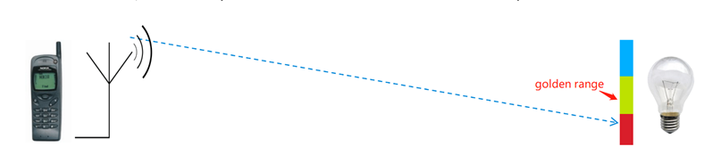  
</div>  
<div align="center">
  <b>Figure 3‑9-1 Golden Range of LE Power Control</b>
</div>  
</br> 

If device is far away, local device get bad RSSI and can request to raise TX power of remote device. But but already at maximum Power Control doesn’t help. It also tells how much more power it needs (dB) to get the RSSI into the ”golden range”.If devices are close to each other, local device get good RSSI and can request to decrease TX power of remote device. It can saves Tx Power on transmitter side.Tx Power setting is separate for both directions.

<div align="center">
    
</div>  
<div align="center">
  <b>Figure 3‑9-2 Both Directions of LE Power Control</b>
</div>  
</br> 

If the LE Power Control feature is enabled (both on the central and the peripheral), the Bluetooth stack can automatically lower the TX power on connections, when the two devices are close to each other.The feature is used only in connections and does not affect advertisements. To enable LECP, install the Power Control software component in your project. The minimum TX power setting has no effect in Bluetooth stack if the LE Power Control is not enabled. The default golden range relatively rigid and the power levels are not changed easily. Once the RSSI goes out of the golden range the required change is rather big. For instance, by changing the golden range to min = -45 dBm and max = -35 dBm the power level change will become more sensitive and required changes are larger meaning practically all available power levels will be used. 

<div align="center">
  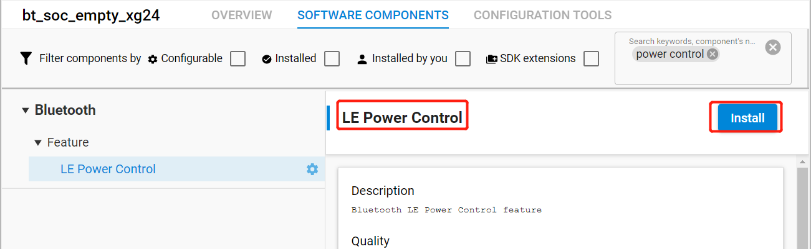  
</div>  
<div align="center">
  <b>Figure 3‑9-3 LE Power Control Component</b>
</div>  
</br> 

<div align="center">
  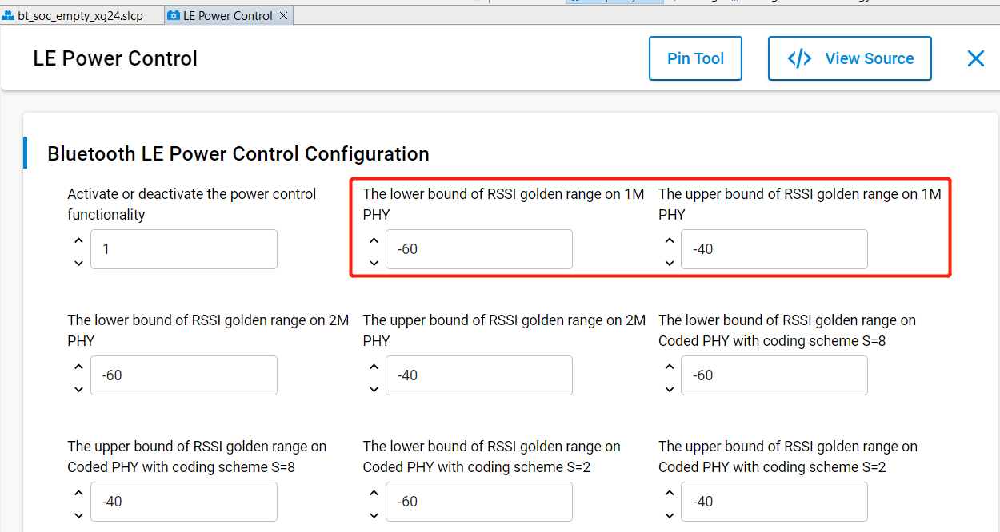  
</div>  
<div align="center">
  <b>Figure 3‑9-4 LE Power Control Configuration</b>
</div>  
</br> 

# 4. Lab 
This simple example demonstrates the impact of advertising and connection parameters on the power consumption of a BLE device. Follow the instructions below and verify the result by using the Energy Profile perspective in Simplicity Studio.

1. Create a new  ```Bluetooth - SoC Empty-xxx ``` project in Simplicity Studio.
<div align="center">
    
</div> 
<div align="center">
  <b>Figure 4‑1 Creating Bluetooth - SoC Empty Project</b>
</div>  
</br> 

2. Open app.c file and replace the system_boot event handler with the following code.
   
```
void sl_bt_on_event(sl_bt_msg_t *evt)
{
  int16_t pwr_min;    
  int16_t pwr_max;    
  switch (SL_BT_MSG_ID(evt->header)) {
   // This event indicates the device has started and the radio is ready.
   // Do not call any stack command before receiving this boot event!
    case sl_bt_evt_system_boot_id:
       // Set TX power
       sc = sl_bt_system_set_tx_power(0, 0, &pwr_min, &pwr_max);
       app_assert_status(sc);
    ... 
    } 
```
   
3. The Bluetooth specification allows the advertising interval to be a value between 20 ms and 40.96 s. In this configuration, the application uses default settings for the advertising interval (100 ms), and +10 dBm on a EFR32MG24. This configuration results in an average current of 257 uA.
<div align="center">
  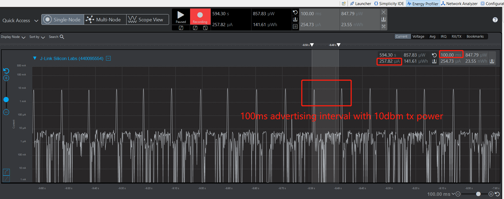  
</div>  
<div align="center">
  <b>Figure 4‑2 Current Consumption of 100ms Advertising Interval with 10dbm Tx Power</b>
</div>  
</br> 

4. Set the transmit power to 8 dBm in app.c by changing ```sl_bt_system_set_tx_power(0, 100, &pwr_min, &pwr_max);```to ```sl_bt_system_set_tx_power(0, 80, &pwr_min, &pwr_max);```

Rebuild and download again to see the current consumption. This configuration results in an average current of 211 uA.
 <div align="center">
  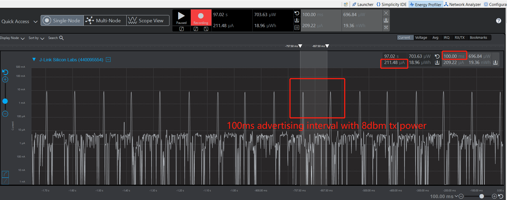  
</div>  
<div align="center">
  <b>Figure 4‑3 Current Consumption of 100ms Advertising Interval with 8dbm Tx Power</b>
</div>  
</br> 

5. Set the transmit power to 0 dBm in app.c by changing ```sl_bt_system_set_tx_power(0, 80, &pwr_min, &pwr_max);```to ```sl_bt_system_set_tx_power(0, 0, &pwr_min, &pwr_max);```.

Rebuild and download again to see the current consumption. This configuration results in an average current of 149 uA.
<div align="center">
    
</div>  
<div align="center">
  <b>Figure 4‑4 Current Consumption of 100ms Advertising Interval with 0dbm Tx Power</b>
</div>  
</br>
 
6. Increase the advertising interval to 1000 ms in app.c by changing ```sl_bt_advertiser_set_timing(advertising_set_handle, 160, 160, 0, 0);```
to ```sl_bt_advertiser_set_timing(advertising_set_handle, 1600, 1600, 0, 0);```.

Then, rebuild and download once more to see current consumption.This configuration results in an average current of 18.96 uA.
<div align="center">
    
</div>  
<div align="center">
  <b>Figure 4‑5 Current Consumption of 1s Advertising Interval with 0dbm Tx Power</b>
</div>  
</br>

7. Connect to the device using the Silicon Labs EFR Connect app and check the power consumption. The below figure shows the power consumption of the device when connected with an mobile phone. Another factor affecting average current consumption is the connection interval. A short connection interval results in higher throughput but also incurs an energy cost while a longer connection interval limits data throughput but also provides energy savings. The default connection intervals used by iOS and Android are currently 30 ms and 50 ms respectively. So need to add the following code to set connection intervals as 30ms.

```
    case sl_bt_evt_connection_opened_id:
         sl_bt_connection_set_parameters(evt->data.evt_connection_opened.connection, 24,24,0,100,0,0xffff);
         break;
```
As shown below, the average current at 0 dBm and a 30 ms connection interval is approximately 162.98 uA.
 <div align="center">
    
</div>  
<div align="center">
  <b>Figure 4‑6 Current Consumption of 30ms Connection Interval with 0dbm Tx Power</b>
</div>  
</br>

8. Change the connection interval to 300ms.

```sl_bt_connection_set_parameters(evt->data.evt_connection_opened.connection, 240, 240, 0, 1000, 0, 0xffff);```

 Rebuild and download and connect again with the mobile app. The energy profiler perspective should show the new connection parameters in use. By using a longer connection interval, 300 ms, the average current is to approximately 22.5 uA.
 <div align="center">
    
</div>  
<div align="center">
  <b>Figure 4‑7 Current Consumption of 300ms Connection Interval with 0dbm Tx Power</b>
</div>  
</br>

9. Change the peripheral latency to 5 by changing the code, as follows:</br> 
From ```sl_bt_connection_set_parameters(evt->data.evt_connection_opened.connection, 240, 240, 0, 1000, 0, 0xffff);``` to  ```sl_bt_connection_set_parameters(evt->data.evt_connection_opened.connection, 240, 240, 5, 1000, 0, 0xffff);```

Rebuild and download the application again and connect with the mobile app.
 <div align="center">
  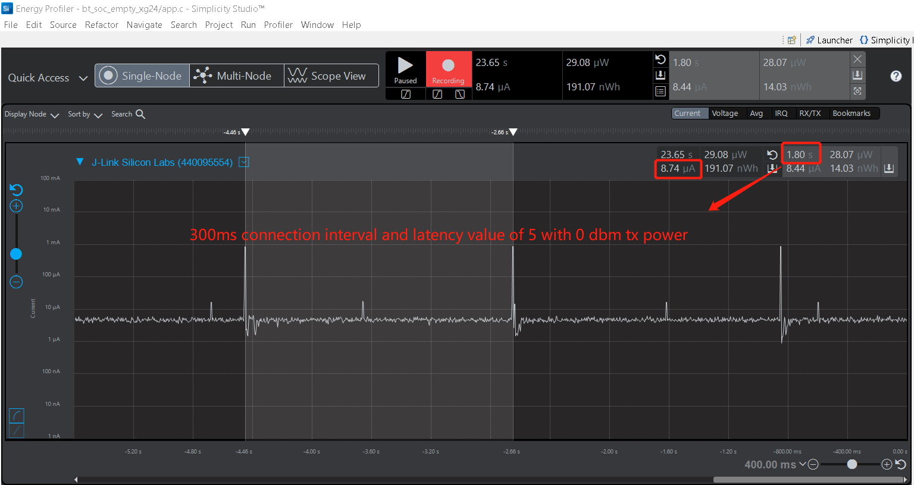  
</div>  
<div align="center">
  <b>Figure 4‑8 Current Consumption of 300ms Connection Interval and the peripheral latency to 5 with 0dbm Tx Power</b>
</div>  
</br>

By increasing the peripheral latency, i.e., the number of intervals the peripheral can skip when it has no data to send, to 5 the average current drops below 8.7 uA.
Select the connection parameters carefully so that several retries are possible to ensure stable connections. The supervision timeout must be greater than (1+latency) * 2 * max_connection_interval. As a result, if the maximum connection interval is chosen to be 950 ms and the timeout is set to the maximum, 32 seconds then the maximum latency allowed is 15 and it allows for 2 retries. However, this will result in an unstable connection.

# 5. Summary
Several factors affecting power consumption have been described in this article. In actual product development, the appropriate connection parameters and transmit power should be selected according to the user's application scenario. Low current consumption can extend battery life, but using longer connection intervals and peripheral latency will lead to throughput degradation and an unreliable or unstable connection. So the connection parameters need to be chosen carefully.

# Reference

[Optimizing current consumption in bluetooth low energy devices](https://docs.silabs.com/bluetooth/4.0/general/system-and-performance/optimizing-current-consumption-in-bluetooth-low-energy-devices)    
[The command of force radio to idle state](https://docs.silabs.com/bluetooth/3.3/a00031#ga118a2db70124acb277df27767c656618)   
[Bluetooth tx power settings](https://docs.silabs.com/bluetooth/4.0/general/system-and-performance/bluetooth-tx-power-settings)    
