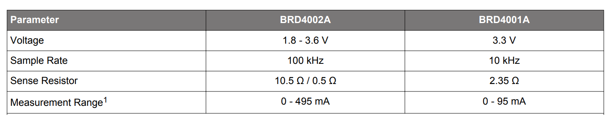

[English](BLE-Power-consumption-optimization.md) | 中文

<details>
<summary><font size=5>Table of Contents</font> </summary>

- [1. 概述](#1-概述)
- [2. 电流消耗的测试工具](#2-电流消耗的测试工具)
- [3. 优化电流消耗的方法](#3-优化电流消耗的方法)
  - [3.1. 电流消耗: Advertising Interval](#31-电流消耗-advertising-interval)
  - [3.2. TX power: 0 dBm vs 8 dBm](#32-tx-power-0-dBm-vs-8-dBm)
  - [3.3. 电流消耗: Connectable vs Non-Connectable Advertising 模式](#33-电流消耗-connectable-vs-non-Connectable-advertising-模式)
  - [3.4. 电流消耗: Deep Sleep Mode](#34-电流消耗-Deep-Sleep-Mode)
  - [3.5. 电流消耗: Connection Interval](#35-电流消耗-connection-interval)
  - [3.6. 电流消耗: Peripheral Latency](#36-电流消耗-peripheral-latency)
  - [3.7.电流消耗: 1M vs 2M PHY](#37-电流消耗-1M-vs-2M-PHY)
  - [3.8. 强制无线电空闲状态命令](#38-强制无线电空闲状态命令)
  - [3.9. LE Power Control](#39-LE-power-control)
- [4. 实验](#4-实验)
- [5. 总结](#5-总结)
- [Reference](#reference)
</details>

***

# 1. 概述
电流消耗，或者一般来说，电量使用是电池供电产品的主要问题。低能耗蓝牙有能力在保持其低功耗的同时为您的设备添加无线连接。然而，为了实现低功耗，您需要根据你的应用场景优化蓝牙应用程序，以实现最低的功耗。

影响低功耗蓝牙 (BLE) 设备电流消耗的两个主要因素是传输的功率大小和无线电处于活跃状态的总时间量（TX 和 RX）。所需的传输功率大小取决于 central 设备和 peripheral 设备之间的空间距离。 空间距离受障碍物和 2.4 GHz 频段干扰等环境因素影响很大，不要采用超过所需传输距离的功率。无线电的活跃时间取决于使用无线电传输或接收的频繁程度以及传输或接收所需的时间长度。 关于这点最需要注意的是使用尽量小的 characteristics 的数值。如果可以使用 8 位，请不要使用 32 位整数。

一般来说，BLE设备的功耗可以通过 advertising interval，connection parameter 和发送功率来调整。

# 2. 电流消耗的测试工具
Simplicity Studio 中的 Energy Profiler 是一种软件工具，可与 WSTK 主板中内置的高级能量监控 (AEM) 电路一起使用。它允许实时测量测试设备的电流消耗。
<div align="center">
    
</div>  
<div align="center">
  <b>Figure 2‑1 Energy Profiler Tool</b>
</div>  
</br>  
鼠标左键点击 “Quick Access”，选择 “Start Energy Capture”，选择需要监控功耗的设备，点击 “OK”，即可看到该设备的功耗情况。
<div align="center">
    
</div>  
<div align="center">
  <b>Figure 2‑2 Start Energy Profiler capture</b>
</div>  
</br>  

<div align="center">
    
</div>  
<div align="center">
  <b>Figure 2‑3 使用 Energy Profiler 测试电流消耗</b>
</div>  
</br> 

无线STK主板(BRD4001A)上的 AEM 能够测量 0.1μA 至 95mA 的电流。第二级放大器以两种不同的增益设置放大信号，在 250μA 左右发生转换。对于 250μA 以上的电流，AEM的准确度在 0.1mA 以内。当测量 250μA 以下的电流时，准确度提高到 1μA。虽然在 250 µA范围内的绝对精度是 1μA，但AEM可以检测到 0.1μA 的电流消耗变化。

无线 Pro 套件主板(BRD4002A)是无线 Starter 套件主板(BRD4001A)的升级款，具有一些改进和增加的功能，包括增加AEM测量范围和采样率。无线 Pro Kit 主板上的 AEM 电路能够测量大约 0.1μA 到 495mA 范围内的电流信号。无线 Pro Kit 主板上 AEM 的预期精度在 1% 以内。由于偏移误差的影响，在测量低几十微安的电流时预期的精度是几百纳安。

<div align="center">
    
</div>  
<div align="center">
  <b>Figure 2‑4 Advanced Energy Monitor Parameters</b>
</div>  
</br>

如果你需要更加精确的测量电流消耗的值，可以考虑使用直流电源分析仪。Keysight N6705直流电源分析仪是一款多功能的电源系统，它既可作为多输出直流电源，又具备示波器和数据记录器的波形/数据捕获功能。

N6705 直流电源分析仪参数配置:</br>
- 设置 3.3V 供电电压</br>
- Display Trace: Current</br>
- Sample Period: 0.02048ms</br>
- Data Log Ranges:</br>
  - Voltage: Auto</br>
  - Current: Auto</br>

<div align="center">
    
</div>  
<div align="center">
  <b>Figure 2‑4 使用 N6705C 直流电源分析仪测试电流消耗</b>
</div>  
</br> 

# 3. 优化电流消耗的方法
本节详细介绍了一系列关于优化电流消耗的方法。

## 3.1 电流消耗: Advertising Interval
Advertising interval 是可以调整的，从 20 ms 到 40.96 s (non-connectable: 最小是 100 ms)。通过增加 advertising interval，可以显著降低BLE设备的平均电流消耗。例如，将advertising interval 从 100ms 增加到 2s 可以降低 93% 的平均电流消耗。
<div align="center">
    
</div>  
<div align="center">
  <b>Figure 3‑1 在不同的 Advertising Interval 下 iBeacon 平均电流消耗 </b>
</div>  
</br> 

## 3.2 TX power: 0 dBm vs 8 dBm
发射功率可调，从 -26 dBm 到 +8dBm（默认为 8dBm)。使用 iBeacon 示例和 Android 手机进行的测试，0dBm 足以覆盖大约 10 到 15m 的范围。使用函数```sl_bt_system_set_tx_power()```，即可在应用程序中更改传输功率。

将 TX 功率从 8dBm 更改为 0dBm 可以使用 100ms advertising interval 将减少120%的电流消耗，使用 1s advertising interval 可以减少 105% 的电流消耗。
<div align="center">
    
</div>  
<div align="center">
  <b>Figure 3‑2 在不同的 Advertising Interval 及发射功率下 iBeacon 平均电流消耗</b>
</div>  
</br> 

## 3.3 电流消耗: Connectable vs Non-Connectable Advertising 模式
Non-connectable advertising 只支持 TX 发送操作，而 connectable advertising 同时支持 TX 发送和 RX 接收操作。 
<div align="center">
    
</div>  
<div align="center">
  <b>Figure 3‑3-1 Connectable 和 Non-connectable Advertising Current</b>
</div>  
</br> 

<div align="center">
    
</div>  
<div align="center">
  <b>Figure 3‑3-2 Connectable 和 Non-connectable Advertising 模式在不同发射功率下的平均电流消耗</b>
</div>  
</br> 

## 3.4 电流消耗: Deep Sleep Mode
如果启用了deep sleep mode(就像大多数例子中那样)，设备可以在 advertising 事件的空隙内自动进入EM2 模式。当软件组件(如 UART)的外围设备禁用深度睡眠时，会无法进入深度睡眠。因此需要考虑在代码中关闭使用 UART 接口的调试日志，因为 UART 可能会禁用深度睡眠。
<div align="center">
    
</div>  
<div align="center">
  <b>Figure 3‑4-1 EM2 Sleep Mode 电流消耗</b>
</div>  
</br> 

关闭 EM2 下 Debugger 的连接可以减小电流消耗。EMU_CTRL 寄存器中的 EM2DBGEN 比特可以使能 Debugger 的连接，这个配置的电流消耗在 0.5uA 左右。

<div align="center">
    
</div>  
<div align="center">
  <b>Figure 3‑4-2 允许debugger在 EM2 下保持连接</b>
</div>  
</br> 

注：当关闭 EM2 下的 Debugger 的连接，同时程序大部分时间也处于 EM2 状态，在向 EFR32MG24 烧录程序的时候会遇到失败的情况。这时可以用 commander 命令进行恢复，然后即可重新烧录带BootLoader 的程序，命令如下：    ```commander device recover --device efr32mg24```

在某些情况下，在 advertising 之间使用 EM3 和 EM4 可能会更加节省能源。然而，这只适用于 non-connectable advertising，并需要在应用程序中添加相关代码来实现。

在 EM 3中，LFXO/LFRCO 没有运行，因此基于的 BURTC 的 stack 时间基准需要使用其他时钟源。可以使用 ULFRCO，在 EFR32xG2X datasheet 中讲述它是一种一直运行的极低功率下的振荡器，其频率可以从 0.944kHz 到 1.095kHz 之间，对于这种使用场景不需要更高的精确度。请注意：蓝牙协议栈在 EM3 Stop mode 下无法工作。与 EM1 Sleep mode 相比 EM2 Deep Sleep mode 意味着巨大的节能，而 EM3 Stop mode 与 EM2 Deep Sleep mode 相比，电流消耗只下降了约十分之一微安培。

进入到更加省电的模式即 EM4 状态，它在睡眠模式中能节省最大程度的能量。在 EM4 中开启的功能很少，RAM 和寄存器保留丢失，因此在唤醒设备时需要系统重置才能回到 EM0。EM4 中支持的外设之一是 BURTC，可以通过使用 ULFRCO 来计时，以生成周期性唤醒。由于我们需要在唤醒设备时再次激活 LFXO，而 LFXO 需要较长的时间来稳定，因此需要一定的唤醒时间。为了减小 EM4 的唤醒时间，建议使用LFRCO 替换 LFXO 作为时钟源。

如下是一个在 EM4 下周期发送 ibeacon 的 demo 代码。
https://github.com/SiliconLabs/bluetooth_applications/tree/master/bluetooth_using_em4_energy_mode_in_bl_ibeacon_app

## 3.5 电流消耗: Connection Interval
与 advertising 一样，connection interval 对电流消耗也有直接的影响。connection interval 可以在 7.5ms 到 4s 之间根据使用场景进行调整，确保同时满足产品对延迟/吞吐量和平均电流消耗的要求。如下是空包传输连接时间(激活时间 1.5ms)，connection interval 15ms 的平均电流消耗。
<div align="center">
    
</div>  
<div align="center">
  <b>Figure 3‑5-1 15ms Connection Interval 电流消耗</b>
</div>  
</br> 

下图显示了在不同的connection interval( 0dBm TX功率)下，保持连接所需的平均电流。RF duty cycle 是根据每个 connection interval 内 1.5ms 激活时间来计算的。
<div align="center">
    
</div> 
<div align="center">
  <b>Figure 3‑5-2 Average Current vs Duty Cycle</b>
</div>  
</br> 

## 3.6 电流消耗: Peripheral Latency
Peripheral latency 可以确保，当外围设备没有任何东西要传输时，它可以跳过 N 个 connection interval。但是请注意，中心设备仍然需要在每个 connection interval 轮询外围设备。Peripheral latency 可以使用 ```sl_bt_connection_set_parameters()``` API来设置。  

平均电流消耗: Peripheral latency OFF(上图) vs Peripheral latency 值为 5 (下图)  

在上述图中，connection interval 为 15 ms。将 latency 值改为 5 可以有效的降低平均电流消耗。 

<div align="center">
     
</div>  
<div align="center">
  <b>Figure 3‑6-1 在15ms Connection Interval 下latency为 0 的电流消耗</b>
</div>  
</br> 
<div align="center">
     
</div>  
<div align="center">
  <b>Figure 3‑6-2 在15ms Connection Interval 下latency为 5 的电流消耗</b>
</div>  
</br> 

## 3.7 电流消耗: 1M vs 2M PHY
Bluetooth5 协议引入 2M PHY，可实现更高的吞吐量并更有效的降低功耗。2M PHY 可以减少 advertising 的激活时间，使 MCU 睡眠时间更长，进而降低平均电流消耗。下面的图比较了在 connection interval 为 15ms 下 1M(上)和2M(下)的 PHY ，短数据包传输的电流消耗。从 1M 到 2M PHY，能耗降低了16%。对于较大的数据传输，增益甚至可以更高。 
<div align="center">
    
</div>  
<div align="center">
  <b>Figure 3‑6-1 在 1M PHY 下 15ms Connection Interval 的电流消耗</b>
</div>  
</br>

<div align="center">
    
</div>  
<div align="center">
  <b>Figure 3‑6-2 在 2M PHY 下 15ms Connection Interval 的电流消耗</b>
</div>  
</br> 

## 3.8 强制无线电进入空闲状态命令
有一个命令可以强制无线电进入空闲状态并允许设备进入睡眠状态。Advertising、scanning、connections，和软件计时器被此命令停止。使用参数 0 调用此命令后，恢复正常状态。如果系统在connection supervision timeout 之前恢复，则连接保持活动状态。
仅在短时间内使用此命令（最多几秒钟）。虽然它会停止蓝牙活动，但所有任务和操作仍然存在于蓝牙协议栈中，并具有自己的时间戳。长时间停止系统可能会对协议栈的内部产生负面影响。

请参考 [bluetooth API document](https://docs.silabs.com/bluetooth/3.3/a00031#ga118a2db70124acb277df27767c656618)。

sl_status_t sl_bt_system_halt (uint8_t halt)

## 3.9. LE Power Control
LE 功率控制(LEPC)是 BLE 5.2 中引入的一项新功能，可用于根据接收到的信号强度调整所连接的对端设备的发射功率。

RSSI是接受信号强度的指示，根据 RSSI 可以判断接受信号的强弱，当两个无线连接的设备距离变大时，RSSI 就会变小。黄金范围是指最佳的 RSSI 接收范围。设备能持续的接收这个范围的信号。

<div align="center">
    
</div>  
<div align="center">
  <b>Figure 3‑9-1 Golden Range of LE Power Control</b>
</div>  
</br> 

当两个无线通信设备距离较远时，本地设备接收对端设备的报文，其 RSSI 信号强度会很弱，这时需要请求对端设备增大发送功率。如果对端设备还没达到最大的发送功率，本地设备也会告诉对端需要增大多少发送功率才能达到最佳的黄金范围的 RSSI 信号。如果对端设备还没达到最小的发送功率，当两个无线通信设备距离较近时，本地设备接收对端设备的报文，其RSSI信号强度会很强，这时需要请求对端设备减小发送功率。注意：发送功率的调解是双向进行的。

<div align="center">
    
</div>  
<div align="center">
  <b>Figure 3‑9-2 Both Directions of LE Power Control</b>
</div>  
</br> 

如果启用了 LE Power Control 特性(在中心设备和外设设备上都启用)，当两个设备相距较近时，蓝牙协议栈可以自动降低连接时的 TX 功率。该功能仅用于连接，不影响 advertisements。要启用 LECP, 请在项目中安装 LE Power Control 组件。在默认配置的黄金范围内和功率水平不容易改变，一旦 RSSI 超出黄金范围，所需的变化就相当大。例如，通过将黄金范围更改为 min = -45dBm 和 max = -35dBm， 功率级别的变化将变得更加敏感，所需的变化将更大，这意味着几乎所有可用的功率级别将被使用。

<div align="center">
    
</div>  
<div align="center">
  <b>Figure 3‑9-3 LE Power Control Component</b>
</div>  
</br> 

<div align="center">
    
</div>  
<div align="center">
  <b>Figure 3‑9-4 LE Power Control Configuration</b>
</div>  
</br> 

# 4.实验(Demo 设置)
这个简单的例子展示了 advertising 和 connection parameters 对 BLE 设备功耗的影响。按照下面的说明，在 SimplicityStudio 中使用 Energy Profile 工具来验证结果。 

1.在 SimplicityStudio 创建一个新的 ```Bluetooth - SoC Empty-xxx ``` 工程。</b>
<div align="center">
    
</div> 

2.打开 app.c 文件，并用下面的代码替换掉```system_boot event handler```的代码。</b>

```
void sl_bt_on_event(sl_bt_msg_t *evt)
{
  int16_t pwr_min;    
  int16_t pwr_max;    
  switch (SL_BT_MSG_ID(evt->header)) {
   // This event indicates the device has started and the radio is ready.
   // Do not call any stack command before receiving this boot event!
    case sl_bt_evt_system_boot_id:
       // Set TX power
       sc = sl_bt_system_set_tx_power(0, 100, &pwr_min, &pwr_max);
       app_assert_status(sc);
    ... 
    } 
```

3.蓝牙规范允许 advertising interval 在 20ms 到 40.96s 之间的任何值。在此配置中，应用程序使用缺省配置发布间隔(100ms)，在 EFR32MG24 上使用 +10dbm。 这种配置的平均电流为 257uA。 
<div align="center">
    
</div>  
<div align="center">
  <b>Figure 4‑1 10dbm Tx Power 下 100ms Advertising Interval 的电流消耗</b>
</div>  
</br> 

4.通过在 app.c 中把```sl_bt_system_set_tx_power(0, 100， &pwr_min， &pwr_max)```设置为```sl_bt_system_set_tx_power(0，80，&pwr_min， &pwr_max)```， 将发送功率设置为 8dBm。重新编译工程并将固件烧录到板子中，以查看电流消耗情况。该配置的平均电流为 211uA。
 <div align="center">
    
</div>  
<div align="center">
  <b>Figure 4‑2 8dbm Tx Power 下 100ms Advertising Interval 的电流消耗</b>
</div>  
</br> 

5.通过在 app.c 中把```sl_bt_system_set_tx_power(0，80，&pwr_min，&pwr_max)```设置为```sl_bt_system_set_tx_power(0，0，&pwr_min， &pwr_max)```，将发送功率设置为 0dBm。重新编译工程并将固件下载到板子中，以查看电流消耗情况。该配置的平均电流为 149 uA。
<div align="center">
    
</div>  
<div align="center">
  <b>Figure 4‑3 0dbm Tx Power 下 100ms Advertising Interval 的电流消耗</b>
</div>  
</br>

6.通过在app.c把```sl_bt_advertiser_set_timing(advertising_set_handle，160，160，0，0)```, 设置为```sl_bt_advertiser_set_timing(advertising_set_handle，1600，1600，0)```, 将advertising interval增加到 1000 ms。然后, 重新编译工程并将固件下载到板子中，以查看电流消耗情况。该配置的平均电流为 18.96uA。 
<div align="center">
    
</div>  
<div align="center">
  <b>Figure 4‑4 0dbm Tx Power 下 1s Advertising Interval 的电流消耗</b>
</div>  
</br>

7.使用 Silicon Labs EFR Connect 应用程序连接设备并检查功耗。下图为设备连接手机时的平均电流消耗，它可以通过调整 connection interval 来进行优化。较短的 connection interval 会使吞吐量变大，但也会带来更大的电量消耗，而较长的connection interval会降低数据的吞吐量，但也可以节省电量消耗。目前 iOS 和 Android 的默认 connection interval 间隔分别为 30ms 和 50ms。因此需要添加以下代码, 将 connection interval 设置为 30ms。

```
    case sl_bt_evt_connection_opened_id:
         sl_bt_connection_set_parameters(evt->data.evt_connection_opened.connection，24，24，0，100，0，0xffff);
         break;
```
如下图所示，在 0dBm 和 30ms connection interval 下的电流消耗大约为 162.98 uA。
 <div align="center">
    
</div>  
<div align="center">
  <b>Figure 4‑5 0dbm Tx Power 下 30ms Connection Interval 电流消耗</b>
</div>  
</br>

8.将 connection interval 修改到300ms。</b>
 ```sl_bt_connection_set_parameters(evt->data.evt_connection_opened.connection，240，240，0，1000，0，0xffff);```。 </b>
重新编译工程并将固件下载到板子中。设备再次连接到移动设备上的应用程序EFR connect。在 connection interval(300 ms) 时，平均电流约为22.5uA。 </b>
 <div align="center">
    
</div>  
<div align="center">
  <b>Figure 4‑6 0dbm Tx Power 下 300ms Connection Interval 电流消耗</b>
</div>  
</br>

9.通过在代码中把```sl_bt_connection_set_parameters(evt->data.evt_connection_opened.connection，240，240，0，1000，0，0xffff)```修改为```sl_bt_connection_set_parameters(evt->data.evt_connection_opened.connection，240，240，5，1000，0，0xffff)```，即latency设置为5。

重新编译工程并将固件下载到板子中，并再次连接到移动设备上的EFR connect app。
 <div align="center">
    
</div>  
<div align="center">
  <b>Figure 4‑7 0dbm Tx Power 下 300ms Connection Interval 同时 latency 为 5 的电流消耗</b>
</div>  
</br>
通过增加latency，即外设在没有数据发送时可以跳过的间隔数设置到 5，平均电流下降到 8.7uA 以下。  

谨慎的选择连接参数，超时时间必须设置为大于  (1+latency) * 2 * max_connection_interval。 因此如果选择最大 connection interval 为 950 ms，并将超时设置为最大 32s，则允许的最大延迟（latency）为 15，允许两次重试，但是这将导致连接不稳定。

# 4.总结
本文介绍了影响电流消耗的几个因素。在实际的产品开发中，应根据用户的应用场景选择合适的 advertising interval，connection parameter 和发射功率。低电流消耗可以延长电池寿命，但使用较长的 connection interval 和 latency 将导致吞吐量下降和不稳定的连接，因此需要谨慎选择连接参数。

# Reference

[Optimizing current consumption in bluetooth low energy devices](https://docs.silabs.com/bluetooth/4.0/general/system-and-performance/optimizing-current-consumption-in-bluetooth-low-energy-devices)    
[The command of force radio to idle state](https://docs.silabs.com/bluetooth/3.3/a00031#ga118a2db70124acb277df27767c656618)   
[Bluetooth tx power settings](https://docs.silabs.com/bluetooth/4.0/general/system-and-performance/bluetooth-tx-power-settings)    
