中文 | [English](BLE-indoor-position.md) 

<details>
<summary><font size=5>Table of Contents</font> </summary>

- [1. 概述](#1-概述)
- [2. 测向理论](#2-测向理论)
  - [2.1. 到达角 (AoA)](#21-到达角-aoa)
  - [2.2. 出发角 (AoD)](#22-出发角-aod)
  - [2.3. 角度估算](#23-角度估算)
    - [2.3.1. Constant Tone Extension](#231-constant-tone-extension)
      - [2.3.1.1. 连接模式](#2311-连接模式)
      - [2.3.1.2. 非连接模式](#2312-非连接模式)
      - [2.3.1.3. Silicon Labs 改进型模式](#2313-silicon-labs-改进型模式)
    - [2.3.2. 解析IQ采样值](#232-解析iq采样值)
  - [2.4. 位置计算](#24-位置计算)
    - [2.4.1. 角度估算](#241-角度估算)
    - [2.4.2. 位置计算](#242-位置计算)
- [3. 实验](#3-实验)
  - [3.1. 前提条件](#31-前提条件)
    - [3.1.1. 硬件要求](#311-硬件要求)
    - [3.1.2. 软件要求](#312-软件要求)
  - [3.2. 测试环境](#32-测试环境)
  - [3.3. 设置天线阵列板](#33-设置天线阵列板)
  - [3.4. 设置标签](#34-设置标签)
  - [3.5. 运行 AoA 主机示例应用程序](#35-运行-aoa-主机示例应用程序)
    - [3.5.1. 安装并运行 Mosquitto MQTT 代理](#351-安装并运行-mosquitto-mqtt-代理)
    - [3.5.2. 构建和运行 AoA 主机定位器示例应用程序](#352-构建和运行-aoa-主机定位器示例应用程序)
    - [3.5.3. Building and Running the Host Positioning sample application](#353-building-and-running-the-host-positioning-sample-application)
  - [3.6. 测试结果](#36-测试结果)
- [参考](#参考)

</details>

*** 

#  1. 概述
定位技术有着非常广泛的应用，例如在全球范围内普遍使用的GPS。然而，GPS在室内环境下并不能很好地工作，因此需要有一种切实可行的室内定位技术，可以使用追踪系统来追踪单个物体的位置（或方向），或者让设备自行追踪其在室内环境中的位置。这种定位系统可用于追踪仓库中的资产、追踪商场中的人员，或者人们可以使用它来确定自己的方向及位置。有两种传统的方法来计算物体所在的位置：三边测量和三角测量。   

三边测量意味着确定物体与多个位置固定的定位器间的距离，并通过找到满足所有距离测量的点来确定位置。距离可以通过接收信号强度(RSSI)测量或飞行时间测量来确定。不过，RSSI测量其精确度并不高，而飞行时间测量则需要高度准确的时间测量。   

三角测量意味着确定固定位置定位器看到被测物体的角度（或被测物看到固定位置定位器的角度），然后由各个角度的交点来确定被测物的位置。与使用 RSSI 测量的三边测量相比，这种方法可以提供更准确的位置，同时不依赖于高精度时钟，其成本比飞行时间测量所需的硬件成本更低。然而，它需要一个天线阵列和一种可以确定信号方向（角度）的计算方法。   

本文描述了到达角和出发角的测向方法背后的理论基础。并讨论了蓝牙5.1是如何支持测向功能，以及Silicon Labs如何使用蓝牙协议栈和实时定位软件库(RTL lib)提供测向(DF)解决方案，以加快用户产品的开发。同时，我们还讨论了如何在办公环境中搭建演示环境，并进行实际环境下的演示。   

#  2. 测向理论
##  2.1. 到达角 (AoA)
复杂的测向理论可以简化为以下基本原理：如果多个接收天线并排放置，单个发射器发射的无线电波将以不同的相位到达不同的天线。从不同天线上所接收到信号的相位差，就可以计算出无线电波的方向。   
由于角度是相对于接收器确定的，因此我们也将这种技术称之为到达角。   

<div align="center">
  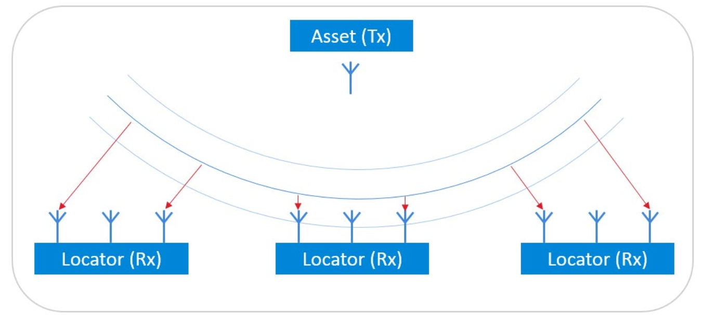  
</div>  
<div align="center">
  <b>图 2‑1 到达角</b>
</div>  
</br>  
如是无线电信号在测量期间不改变频率（即未调制），并且接收天线之间的距离小于波长的一半以确保没有发生相位反转，那么由相位差就可以明确地得出信号的入射角度。   

##  2.2. 出发角 (AoD)
上面的设置也可以反过来。如果多个天线以相同的初始相位发射无线电波，那么单个天线可以测量不同入射波的相位差，并计算得出自己相对于发射天线阵列的方向。由于角度是相对于天线发射阵列来确定的，因此这种用例称为出发角。   

<div align="center">
  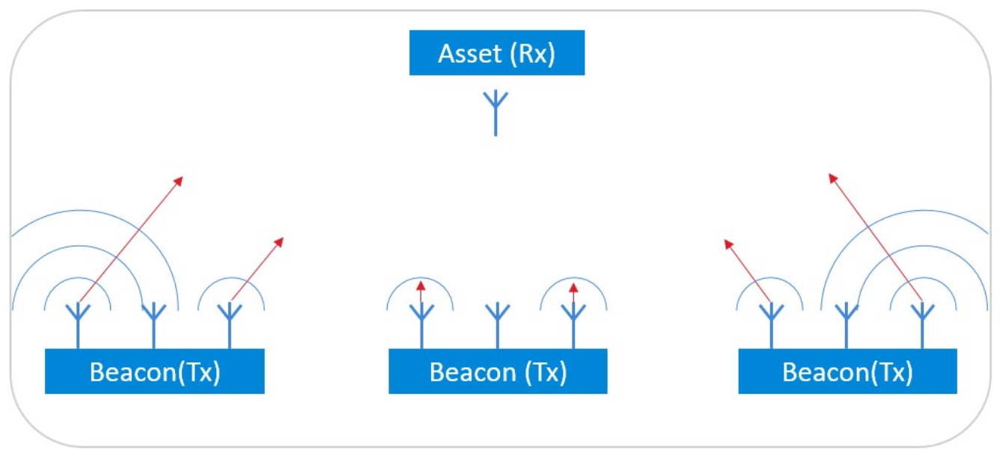  
</div>  
<div align="center">
  <b>图 2‑2 出发角</b>
</div>  
</br>  

请注意，在AoD场景下，发射器（信标）必须在每个天线上以相同的频率发射，这是角度计算的先决条件。这也意味着天线不能同时传输，否则它们的信号会相互干扰。为了解决这个问题，发射设备必须在发射天线之间顺序切换，接收端必须知道天线阵列配置和相应的切换顺序。   

##  2.3. 角度估算
###  2.3.1. Constant Tone Extension
为了确定输入信号的角度，必须在足够长的时间段内发送具有连续相位、恒定幅度和恒定频率的信号，以便所有接收器天线都能对其进行采样。   
蓝牙 5.1 引入了一种新方法来请求和发送CW（连续波）信号。作为普通数据包的扩展，此扩展被称为Constant Tone Extension (CTE)，在请求发送CTE时，它会在普通数据包的CRC之后发送。   
<div align="center">
    
</div>  
<div align="center">
  <b>图 2‑3 带 CTE 的蓝牙测向信号</b>
</div>  
</br>  

CTE 既可以通过连接（在接收到 LL_CTE_REQ 数据包后的 LL_CTE_RSP 数据包中）发送，也可以通过周期性广播（在 AUX_SYNC_IND 数据包中）发送。此外，Silicon Labs蓝牙协议栈提供了一种私有的解决方案，其中CTE可以在扩展广播（AUX_ADV_IND 数据包）中发送，这使得Direction Finding在所能定位的资产数量方面更具可扩展性。   

#### 2.3.1.1. 连接模式
基于连接的模式由蓝牙SIG规范所定义。面向连接的测向使用LL_CTE_RSP数据包来发送CTE信号，这些数据包通过蓝牙连接发送以作为LL_CTE_REQ PDU的响应包。   

下图所示是CTE信号的请求过程，它用于请求远端设备链路层发送包含 LL_CTE_RSP PDU 和CTE的数据包。远端设备将回应一个 LL_CTE_RSP PDU，该PDU 包括所请求类型的CTE，其长度大于或等于所请求的长度。反之，远端设备的链路层将响应一个 LL_REJECT_EXT_IND PDU。   

<div align="center">
  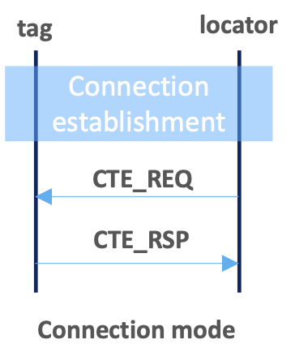  
</div>  
<div align="center">
  <b>图 2‑4 连接模式下CTE信号</b>
</div>  
</br>  

通过Network analyzer抓取的网络数据说明了在基于连接的场景中如何发送CTE。   
<div align="center">
    
</div>  
<div align="center">
  <b>图 2‑4 连接模式下CTE请求流程</b>
</div>  
</br>  

#### 2.3.1.2. 非连接模式
非连接模式下，蓝牙测向技术使用蓝牙周期性广播，并将CTE信号附加在AUX_SYNC_IND PDU中。   

<div align="center">
  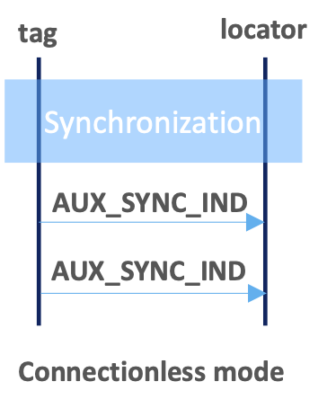  
</div>  
<div align="center">
  <b>Figure 2‑5 非连接模式下CTE信号</b>
</div>  
</br>  

通过Network analyzer抓取的网络数据说明了在非连接模式下如何发送CTE。   
<div align="center">
  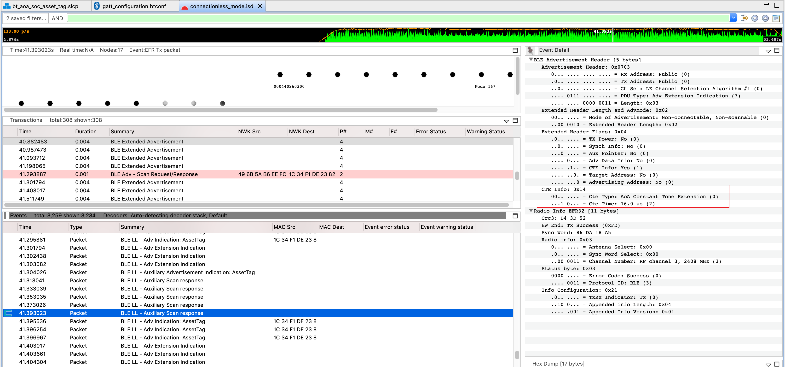  
</div>  
<div align="center">
  <b>Figure 2‑6 非连接模式下CTE信号</b>
</div>  
</br>  

#### 2.3.1.3. Silicon Labs 改进型模式
Silicon Labs 资产标签示例应用程序在扩展广播中发送 CTE，这是Silicon Labs独有的解决方案，因此采用这种模式的标签只能与支持该模式的Silicon Labs定位器一起使用。   
该解决方案的优点是它使用扩展广播，与基于连接和周期性广播的方法相比，它不需要在标签或定位器端存储同步信息或蓝牙连接的信息，可以有效减小系统RAM的消耗。该解决方案的扩展性比其他两个好得多，可以同时支持数百个标签一起使用。   

<div align="center">
    
</div>  
<div align="center">
  <b>图 2‑7 Silicon Labs 改进型模式</b>
</div>  
</br>  

通过Network analyzer抓取的网络数据说明了在 Silicon Labs改进型模式下如何发送CTE。   
<div align="center">
  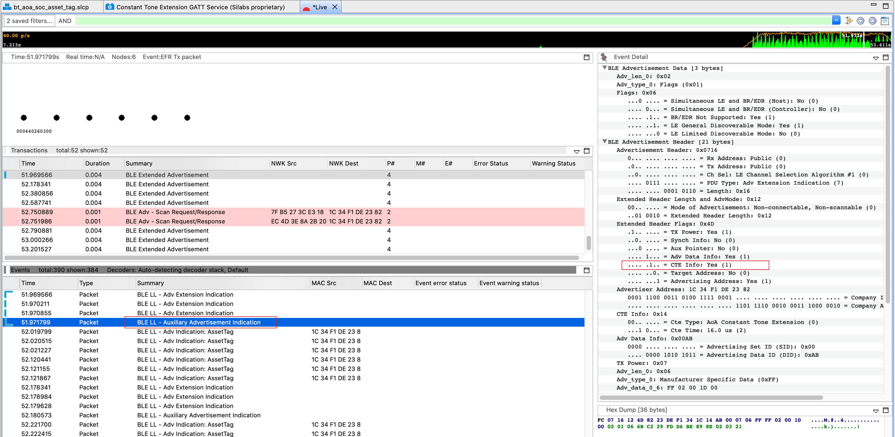  
</div>  
<div align="center">
  <b>Figure 2‑8 Silicon Labs改进型模式CTE信号</b>
</div>  
</br>  

### 2.3.2. 解析IQ采样值
虽然CTE是一个简单的连续波，其长度为16 μs到160 μs，但是依据蓝牙核心规范(Vol. 6, Part B, Section 2.5)，它被划分为几个周期。   

CTE的前 4 μs 称为guard period，接下来的 8 μs 称为reference period。在reference period之后，CTE由一系列交替的switch slot和sample slot组成，每个长度为1 μs或2 μs，具体由应用程序指定。   
在使用蓝牙定位技术时，CTE发送端和接收端必须支持 2-µs 长的switch slot和sample slot，可选择性支持 1-µs 长的switch slot和sample slot。采用2-μs 时隙可以在具有更长转换时间的天线之间使用更便宜的 RF 开关，采用1-μs时隙则可以对每个天线进行多次采样，这有助于降低噪声的影响以提高精度。   

<div align="center">
  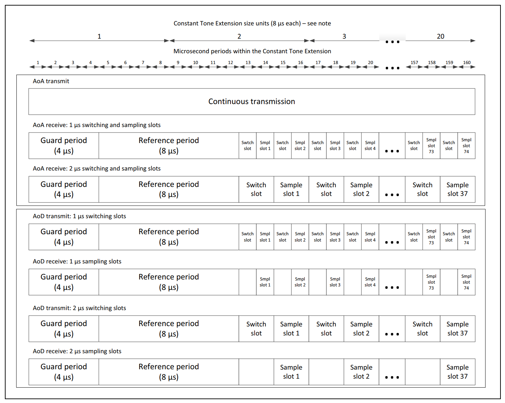  
</div>  
<div align="center">
  <b>图 2‑9 CTE结构</b>
</div>  
</br>  

一旦CTE启动，radio就开始以其原始采样率对基带信号的同相 (I) 和正交 (Q) 分量进行采样。然后将样本下采样至1个样本/μs的采样率。前4个样本（在guard period中获取）被丢弃，然后 8 个样本（在reference period中获取）将存储在样本缓冲区中。最后，在switch slot中获取的每个样本都被丢弃，在sample slot中获取的每个样本都将存储在样本缓冲区中。   

此时，共计有 N = 8 + (L – 12) / 2 / S 个同相 (I) 和正交 (Q) 样本存储在缓冲区中，其中 L 是 CTE 的长度，以微秒为单位, S 是以微秒为单位的slot长度。I 和 Q 样本合并到具有 2N 个元素的公共 IQ 样本缓冲区中，I和Q样本交替：I(0)、Q(0)、I(1)、Q(1)、I(2 ), Q(2), I(3), Q(3), ... I(N), Q(N)。   
如果slot为 1-us 且 CTE 的长度为 160us，则总共将有 82 个 I/Q 对，总共 164 个字节。N = 8 + (160-12) / 2 / 1 = 8+74 = 82   

使用Silicon Labs方案，可以非常方便的从回调函数“aoa_cte_on_iq_report”中获取I/Q采样数据。   
<div align="center">
    
</div>  
<div align="center">
  <b>图 2‑10 IQ 采样值</b>
</div>  
</br>  

理想情况下，所有天线应该同时采样，以便于计算它们之间的相位差。然而，单radio的系统无法做到这一点。要实现对多个天线采样，只能采用时间分割的方法，也就是在连续的时间内对多个天线进行逐个连续采样，然后再对相位作补偿。在reference period中的采样，都是在同一天线上进行的，我们可以用它来测量1 μs间隔内的实际相移，作为相位补偿值。   

考虑到这一点，基带中 CTE 信号的频率为 fΔ + foffset，根据蓝牙规范，其中 fΔ = 250kHz，foffset 在 10kHz 左右。因此，具有 1-μs 差异的两个连续样本之间的相移约为 𝜙 = 2𝜋(fΔ + foffset)𝑡 ≅ 2𝜋 ∙ 0.25 ∙ 1 = 0.5𝜋 = 90°。考虑到频率偏移，它可能会在 80°-100° 之间变化。   
使用𝜙 = atan2(−𝑄, 𝐼)，我们可以很容易的从采样所得出的I/Q原始数据计算信号的瞬时相位。以reference period为例，计算得出两个连续样本之间的相移在 85° 左右。   
<div align="center">
  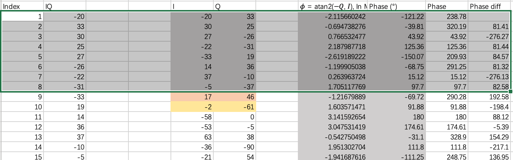  
</div>  
<div align="center">
  <b>图 2‑11 相移</b>
</div>  
</br>  

## 2.4. 位置计算
在不知道定位器距离标签的准确距离，或标签是否被限制在某2D平面中移动的情况下，使用单个天线阵列只能提供标签的方向，但不能给出其具体位置。   
要确定标签的精确位置，必须使用多个天线阵列。通过使用多个天线阵列，可以使用三角测量来确定标签的位置。标签可以在由测向算法确定的方向上所绘制的线的交点处找到。三角测量也可以使用三边测量来进行补充，将RSSI测量值添加到AoX系统中可以进一步增强位置计算的精度。   

<div align="center">
    
</div>  
<div align="center">
  <b>图 2‑12 具有多个天线阵列的标签定位</b>
</div>  
</br>  

### 2.4.1. 角度估算
从IQ 样本估算到达角 (AoA) 或出发角 (AoD) 并非易事，尤其是在充满各种无线反射信号的真实环境中。   
为了减轻开发人员的负担并加快产品的开发过程，Silicon Labs提供了一个实时定位库 (RTL lib)，用于处理从蓝牙协议栈所接收的 IQ采样值，实现多路径检测以及方位角和俯仰角计算，并通过API将数据提供给应用程序。   

<div align="center">
  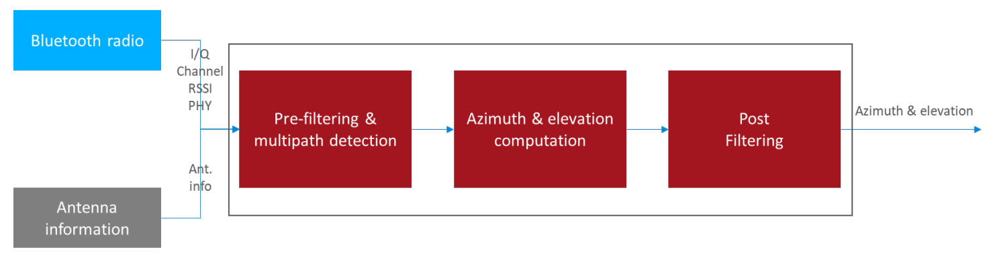  
</div>  
<div align="center">
  <b>图 2‑13 角度估算</b>
</div>  
</br>  

### 2.4.2. 位置计算
此外，RTL库还能够使用三角测量，在多定位器场景中估算被跟踪标签的位置。多个定位器从同一标签接收CTE，在已知各个定位器位置的前提下，使用定位器的位置和估算的角度（AoA）作为输入值，即可以估算得出标签所在的位置。   
<div align="center">
  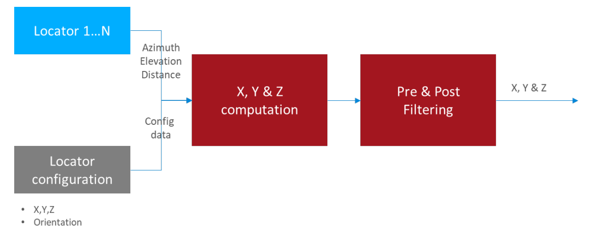  
</div>  
<div align="center">
  <b>图 2‑14 位置计算</b>
</div>  
</br>  

使用 Silicon Labs RTL 库的实时定位系统的一般架构如下所示：
<div align="center">
  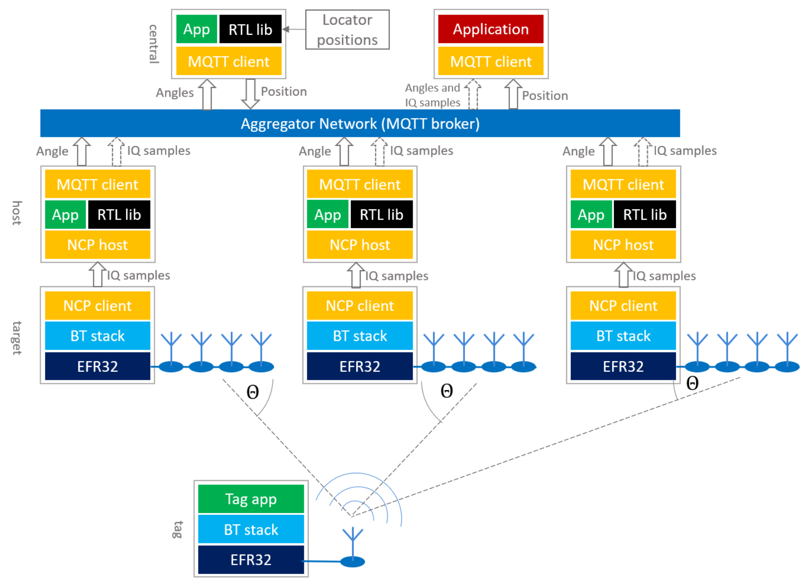  
</div>  
<div align="center">
  <b>Figure 2‑15 定位系统框图</b>
</div>  
</br>  

如架构图所示，Locator工作在网络协处理器 (NCP) 模式，即协议栈运行在EFR32芯片上，但应用程序运行在主机上用于处理IQ采样。定位器应用程序输出估算的角度数据或将IQ采样数据直接转发到上层。   
目前，由于EFR32芯片的计算能力有限，它仅支持NCP模式的定位器，即在撰写本文时，EFR32 芯片上暂时无法运算RTL库。   

定位器可以通过多种方式连接到中央处理器。Silicon Labs的参考实现使用 MQTT 从定位器收集角度数据或 IQ 采样。使用MQTT可以灵活地在分布式网络，或者使用localhost的单个 PC 上运行主机示例应用程序，来收集各个locator端所计算得出的角度数据或者IQ采样。   

使用RTL 在中央PC上估算得出位置信息之后，就取决于用户的应用程序如何处理数据，例如，用户可以将位置集成到他们的室内地图和导航系统中。   

# 3. 实验
本章节重点介绍如何搭建AoA演示环境。这包括如何创建AoA Asset Tag项目并使用不同的 CTE 模式。实验中，我们还将展示如何编译主机示例应用程序 aoa_locator，以根据天线阵列所捕获的 IQ 数据估算角度。以及如何设置Silicon Labs提供的定位主机应用程序来实现标签的定位。   

为了简化使用 Silicon Labs 的 RTL 库的配置和开发，我们还提供了蓝牙测向工具套件，以通过交互式图形界面配置单个或多个蓝牙定位器，以评估RTL库的性能。AoA Positioning Tool演示应用程序则可以用于演示RTL库的位置估算功能。    

## 3.1. 前提条件
### 3.1.1. 硬件要求
对于本实验，你将需要以下硬件：   

* 4个或更多WSTK主开发板   
* 4个或更多EFR32BG22天线阵列板（推荐使用双极化天线阵列板BRD4191A）   
* 1 个 Thunderboard BG22 (BRD4184A) 或 1 个 Thunderboard xG24 (BRD2601B)    

### 3.1.2. 软件要求
* Simplicity Studio v5    
  * Gecko SDK v4.1.1 或更高版本   
  * Bluetooth SDK 4.1.1 或更高版本   

## 3.2. 测试环境
本实验将向你展示我们如何在办公环境中设置AoA演示，演示中将包含 1 个标签和 6 个定位器。所有的天线阵列都固定在天花板上，面朝下，这可以确保在测试环境下标签与定位器间更好的直视路径。正如我们在 AN1296 中推荐的那样，天线之间的距离为 3-5 m。   

* 地点：办公环境，开放空间，测量区有很多桌子、金属架子、隔间   
* 定位器距地面高度：2.5 m   
* 标签离地高度：1.5 m   
* 测试范围：50 m2   
下面是具体的测试环境，及定位器的坐标和方向的拓扑结构图。   
<div align="center">
    
</div>  
<div align="center">
  <b>图 3‑1 办公室环境</b>
</div>  
</br>  

<div align="center">
  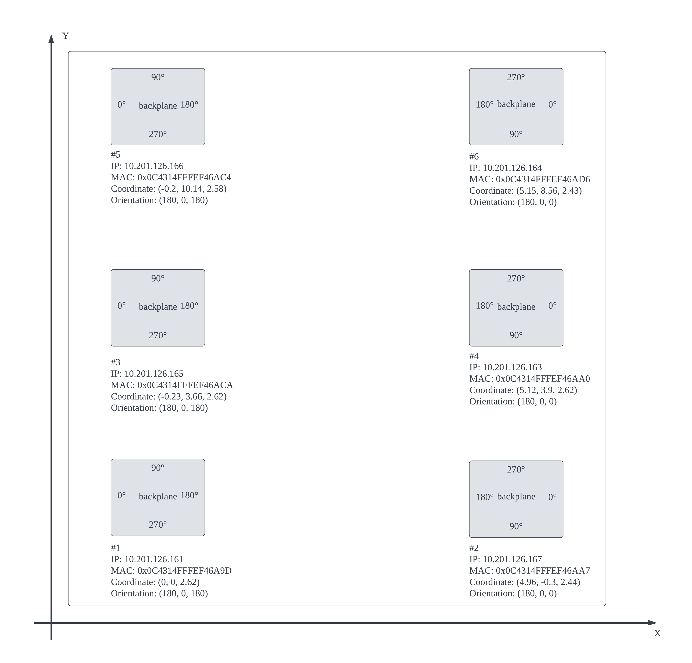  
</div>  
<div align="center">
  <b>图 3‑2 定位器拓扑结构</b>
</div>  
</br>  

## 3.3. 设置天线阵列板
要设置演示，首先需要在天线阵列板上烧录正确的软件。   
1. 启动 Simplicity Studio 5。   
2. 通过 USB 或以太网连接将天线阵列板连接到 PC。   

<div align="center">
  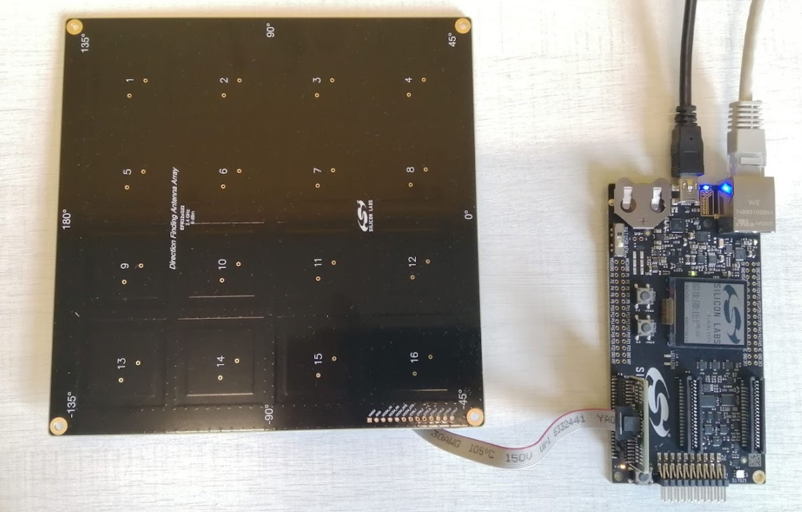  
</div>  
</br>  

3. 在Simplicity Studio Debug Adapters视图中选择天线阵列板（Direction Finding board），并确保选择 Gecko SDK Suite v4.1.0（或更高版本）作为当前所使用的SDK。   

<div align="center">
    
</div>  
<div align="center">
  <b>图 3‑3 设置天线阵列板</b>
</div>  
</br>  

4. 选择 Example Projects & Demos 选项卡，过滤蓝牙技术类型，然后找到Bluetooth – NCP AOA Locator 演示示例。   
<div align="center">
  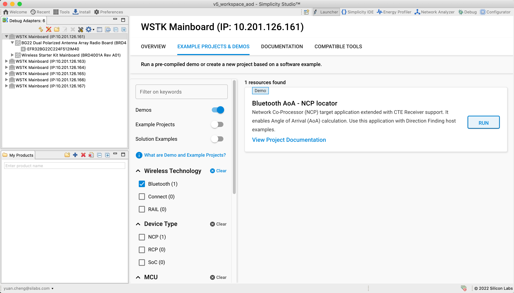  
</div>  
<div align="center">
  <b>图 3‑4 设置天线阵列板</b>
</div>  
</br>  

5. 单击 RUN以下载并在你的板上运行示例程序。（注意：该示例程序已包括了一个引导加载程序，如果你从源代码创建NCP AoA Locator应用程序，则还必须将引导加载程序烧录至设备中）

## 3.4. 设置标签
接下来，在EFR32xG22 或 EFR32xG24 开发板上烧录标签侧软件。请注意，SDK中预编译的演示程序仅适用于 Thunderboard BG22，对于其它板，用户需要自行创建AoA Asset Tag项目，并将其与Bootloader程序一起烧录到设备中。
以下说明适用于 Thunderboard BG22。   

1. 将 Thunderboard BG22 连接到 PC。   
2. 在 Debug Adapters 视图中选择开发板，并确保选择 Gecko SDK Suite v4.1（或更高版本）作为默认的SDK。   
3. 切换到示例项目和演示选项卡，过滤蓝牙技术类型，然后找到蓝牙AoA – SoC Asset Tag演示程序。   
4. 如果这是一个新的 Thunderboard BG22，请按下它的重置按钮。在某些板上，出厂默认固件会在 30 秒后将设备置于 EM4 睡眠模式，因此在烧录器烧录演示程序之前需要重新启动设备。   
5. 单击RUN以下载并运行演示程序。   

如果你使用的是 EFR32xG24 开发套件，SDK中并没有直接可用的预编译演示程序，你需要创建“Bluetooth AoA – SoC Asset Tag”项目，编译并下载到开发套件中。
在默认情况下，Bluetooth AoA - SoC Asset Tag示例程序支持 Silicon Labs 改进型 CTE 模式。如果你想切换到非连接模式，则应卸载*Constant Tone Extension GATT Service (Silabs Proprietary)*软件组件，然后安装*Constant Tone Extension GATT Service (Connectionless)*组件。

我们推荐使用 Thunderboard BG22来作为AoA系统的评估和开发。此外，Silicon Labs 还提供了另一种 EFR32BG22 标签设计，它是一个可以直接复制粘贴的蓝牙资产标签参考设计。它的大小与CR2032钮扣电池差不多，其中包括 BG22 蓝牙 SoC、HFXO 和 LFXO（可选）晶体、PCB天线和匹配组件以及可选传感器（加速度计和气压计）以及简单的人机交互接口（按钮和 LED）。   

<div align="center">
  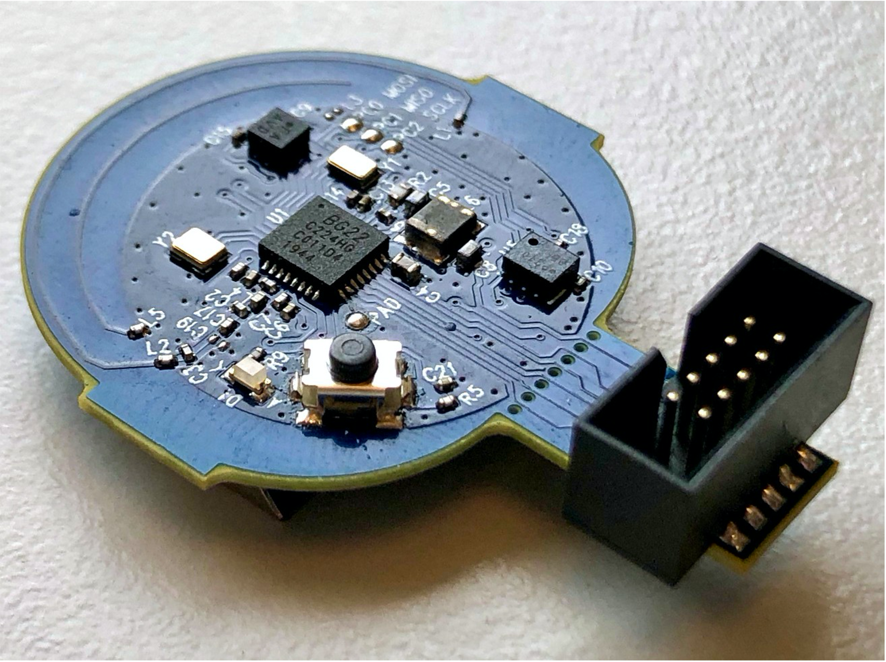  
</div>  
<div align="center">
  <b>图 3‑5 EFR32BG22 标签参考设计</b>
</div>  
</br>  

EFR32BG22标签参考设计的设计文件可以从[Technical Library](https://www.silabs.com/support/resources.ct-schematic-and-layout-files?query=EFR32BG22%20Tag) 下载。   

## 3.5. 运行 AoA 主机示例应用程序
### 3.5.1. 安装并运行 Mosquitto MQTT 代理
在编译和运行任何主机示例应用程序之前，必须安装 Mosquitto MQTT 代理。安装完成后，确保 mosquitto 服务正在运行。   

### 3.5.2. 构建和运行 AoA 主机定位器示例应用程序
安装好最新的蓝牙SDK后，使用命令``` cd $GSDK_DIR/app/bluetooth/example_host/bt_aoa_host_locator ```跳转到 example_host/bt_aoa_host_locator 目录，然后使用命令 ```make``` 编译项目。   

项目编译完成后，在```bt_aoa_host_locator``` exe文件夹内将会生成一个可执行文件。使用以下命令运行应用程序：   
```bt_aoa_host_locator -t <tcp_address> | -u <serial_port> [-b <baud_rate>] [-f] [-l <log_level_filter>] [-m <mqtt_address>[:<port>]] [-c <config>] [-h]```

```-h``` 选项可用于打印帮助消息，以了解所有可用选项。

假设你通过TCP/IP连接来访问天线板，请执行以下命令运行应用程序，< config >是locator对应的配置文件。
```./exe/bt_aoa_host_locator -t 10.201.126.68 -c <config>```

AoA 定位器配置是角度估算的重要步骤，它包含天线类型（模式）的配置选项、CTE 配置、角度估算参数、允许的标签列表和角度掩码等。当使用 Silicon Lab 的双极化天线板（即 BRD4191A）的默认设置时，无需配置即可启动主机应用程序。在任何其他情况下，用户则必须在运行前或运行期间修改配置。

AoA 定位器主机应用程序的整个配置文件或特定配置参数可以通过MQTT即时更新，而无需重建和停止应用程序。

### 3.5.3. Building and Running the Host Positioning sample application
切换到“example_host/bt_host_positioning”目录并使用```make```编译项目，在exe文件夹中生成一个可执行文件```bt_host_positioning```。使用以下命令运行应用程序：```bt_host_positioning -c <config>```

定位配置文件包含了定位程序和单个AoA定位器主机程序所使用的配置，包括天线类型（模式）、CTE 配置、角度估算参数、允许的标签列表和角度掩码，以及多定位器拓扑设置（每个定位器的坐标和方向）等。
要了解有关定位配置的更多信息，请参阅[AN1296](https://www.silabs.com/documents/public/application-notes/an1296-application-development-with-rtl-library.pdf)。

## 3.6. 测试结果
我们在实际场景下进行测试，以评估多定位器系统的定位精度。将标签固定在三脚架上，其高度约为1.5m，我们将它分别移动到如下 3 个不同的位置。
<div align="center">
  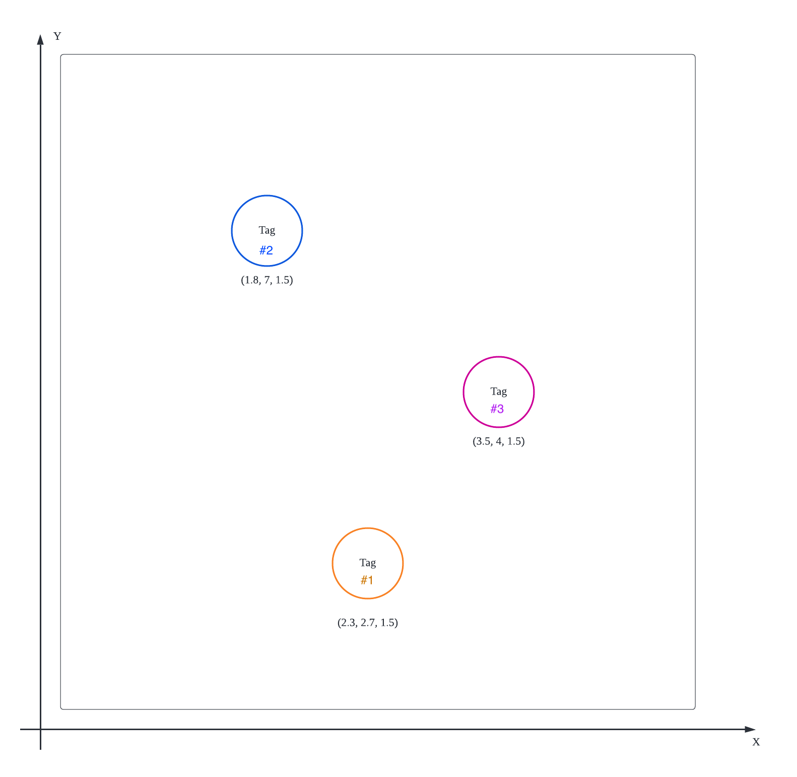  
</div>  
<div align="center">
  <b>图 3‑6 标签的实际位置</b>
</div>  
</br>  

下面是AoA定位系统所估算得出的标签位置。
<div align="center">
    
</div>  
<div align="center">
  <b>图 3‑7 #1标签的估算位置</b>
</div>  
</br>  

<div align="center">
  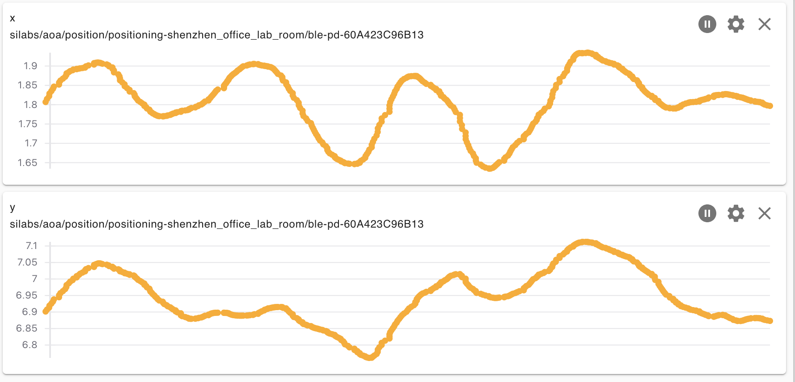  
</div>  
<div align="center">
  <b>图 3‑8 #2标签的估算位置</b>
</div>  
</br>  

<div align="center">
    
</div>  
<div align="center">
  <b>图 3‑9 #3标签的估算位置</b>
</div>  
</br>  

# 参考
[AN1296: Application Development with Silicon Labs’ RTL Library](https://www.silabs.com/documents/public/application-notes/an1296-application-development-with-rtl-library.pdf)   
[AN1297: Custom Direction-Finding Solutions using the Silicon Labs Bluetooth Stack](https://www.silabs.com/documents/public/application-notes/an1297-custom-direction-finding-solutions-silicon-labs-bluetooth.pdf)   
[QSG175: Silicon Labs Direction Finding Solution Quick-Start Guide](https://www.silabs.com/documents/public/quick-start-guides/qsg175-direction-finding-solution-quick-start-guide.pdf)   
[UG514: Using the Bluetooth® Direction Finding Tool Suite](https://www.silabs.com/documents/public/user-guides/ug514-using-bluetooth-direction-finding-tool-suite.pdf)   
