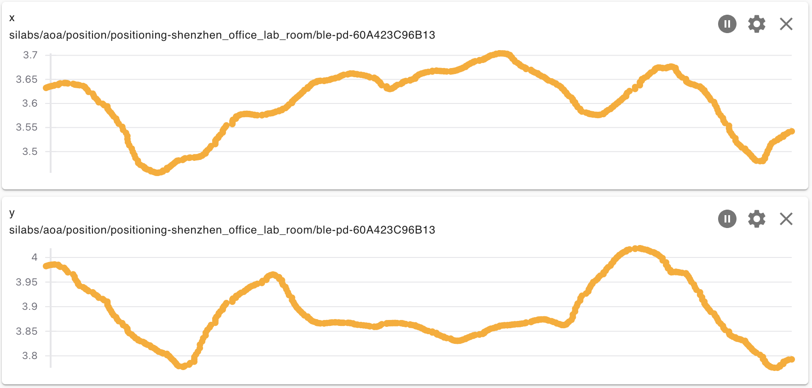

English | [中文](BLE-indoor-position-cn.md) 

<details>
<summary><font size=5>Table of Contents</font> </summary>

- [1. Overview](#1-overview)
- [2. Direction Finding Theory](#2-direction-finding-theory)
  - [2.1. Angle of Arrival (AoA)](#21-angle-of-arrival-aoa)
  - [2.2. Angle of Departure (AoD)](#22-angle-of-departure-aod)
  - [2.3. Determine the Angle of Arrival or Departure](#23-determine-the-angle-of-arrival-or-departure)
    - [2.3.1. Constant Tone Extension](#231-constant-tone-extension)
      - [2.3.1.1. Connection-Based](#2311-connection-based)
      - [2.3.1.2. Connectionless](#2312-connectionless)
      - [2.3.1.3. Silicon Labs Enhanced](#2313-silicon-labs-enhanced)
    - [2.3.2. Interpreting IQ Samples](#232-interpreting-iq-samples)
  - [2.4. Location Finding](#24-location-finding)
    - [2.4.1. Angle estimation](#241-angle-estimation)
    - [2.4.2. Position calculation](#242-position-calculation)
- [3. Lab](#3-lab)
  - [3.1. Prerequisites](#31-prerequisites)
    - [3.1.1. Hardware Requirements](#311-hardware-requirements)
    - [3.1.2. Software Requirements](#312-software-requirements)
  - [3.2. Test Environment](#32-test-environment)
  - [3.3. Set up the Antenna Array Board](#33-set-up-the-antenna-array-board)
  - [3.4. Set Up the Tag](#34-set-up-the-tag)
  - [3.5. Run the AoA Host Sample Application](#35-run-the-aoa-host-sample-application)
    - [3.5.1. Install and run the Mosquitto MQTT broker](#351-install-and-run-the-mosquitto-mqtt-broker)
    - [3.5.2. Building and Running the AoA Host Locator sample application](#352-building-and-running-the-aoa-host-locator-sample-application)
    - [3.5.3. Building and Running the Host Positioning sample application](#353-building-and-running-the-host-positioning-sample-application)
  - [3.6. Testing result](#36-testing-result)
- [Reference](#reference)

</details>

*** 

# 1. Overview 
Positioning technologies have many useful applications, one example being GPS, which is widely used all over the world. Unfortunately, GPS does not work very well indoors, so there is a real need for better indoor positioning technologies. The goal is to track the locations (or direction) of individual objects with an external tracking system, or for a device to track its own location in an indoor environment. This kind of locating system can be used to track assets in a warehouse or people in a shopping mall, or people can use it to find their own directions. There are two conventional methods to calculate the position of an asset: trilateration and triangulation.   

Trilateration means determining the distance of the asset from multiple fixed-position locators and determining the position by finding the point that satisfies all distance measurements. The distance can be determined by Received Signal Strength Indicator (RSSI) measurement or by Time of Flight measurement. Unfortunately, RSSI measurement can be very inaccurate and Time of Flight measurement needs highly accurate time measurement.   

Triangulation means determining the angles under which the fixed-position locators see the asset (or under which the asset sees the fixed-position locators). The position of the asset is then determined by the intersection point of the lines of sight. This method can give a more accurate position than trilateration with RSSI measurement and requires less expensive hardware than Time of Flight measurement. However, it needs an antenna array and a method with which the direction (angle) of the incoming signal can be determined.   

This document describes the theory behind direction finding of estimating arrival and departure angles. And discusses how Bluetooth 5.1 supports direction finding implementations, and how Silicon Labs provide the Direction Finding (DF) solution using the Silicon Labs Bluetooth LE stack and the Real Time Locating Library (RTL lib) to accelerate customer's time to marketing, also discusses how to set up the demo in an office environment.  

# 2. Direction Finding Theory
## 2.1. Angle of Arrival (AoA)
The complicated theory of Direction Finding can be simplified to the following fact: if multiple receiver antennas are placed next to each other, the radio waves emitted by a single transmitter will reach the different antennas in different phases. From this phase difference, the direction the radio waves came from can be calculated.   
Since the angle is determined relative to the receiver, this use case is called Angle of Arrival estimation.   

<div align="center">
    
</div>  
<div align="center">
  <b>Figure 2‑1 Angle of Arrive</b>
</div>  
</br>  
Assuming that the incoming signal does not change frequency during measurement (that is, it is unmodulated) and that the distance between the receiver antennas is shorter than half of the wavelength to make sure there's no phase inversion happening, the phase difference unequivocally determines the angle of incidence.   

## 2.2. Angle of Departure (AoD)
The setup above can also be reversed. If multiple antennas transmit waves with the same initial phase, then a single antenna can measure the phase differences of the different incoming waves and it can calculate its own direction relative to the transmitting antenna array. Since the angle is now determined relative to the transmitter, this use case is called Angle of Departure estimation.   

<div align="center">
    
</div>  
<div align="center">
  <b>Figure 2‑2 Angle of Departure</b>
</div>  
</br>  

Note that transmitters (Beacons) have to transmit with the same frequency on each antenna because that is a prerequisite for the angle calculation. This also means that the antennas cannot transmit at the same time, since their signals would interfere. To solve this issue, the transmitter device must sequentially switch between the transmitting antennas, and the receiving side must know the antenna array configuration and switching sequence.   

## 2.3. Determine the Angle of Arrival or Departure

### 2.3.1. Constant Tone Extension
To determine the angle of the incoming signal it is essential to transmit a signal with continuous phase, constant amplitude, and constant frequency over a time period long enough to be sampled by all receiver antennas.   
Bluetooth 5.1 introduced a new method to request and send short CW (continuous wave) signals as an extension of a normal package. This extension is called Constant Tone Extension (CTE), and it is sent after the CRC of the package when requested.   
<div align="center">
    
</div>  
<div align="center">
  <b>Figure 2‑3 Bluetooth direction finding signal with CTE</b>
</div>  
</br>  

CTEs can be sent both through a connection (in LL_CTE_RSP packets after an LL_CTE_REQ packet was received), and in periodic advertisements (in AUX_SYNC_IND packets). Additionally, the Silicon Labs Bluetooth stack provides a non-standard solution where CTEs can be sent in extended advertisements (AUX_ADV_IND packets), which makes Direction Finding much more scalable regarding the number of assets to be located.   

#### 2.3.1.1. Connection-Based 
The connection-based mode is defined by the SIG specification. Connection-oriented direction finding conveys the CTE using new LL_CTE_RSP packets that are sent over the connection in response to LL_CTE_REQ PDUs.

The Constant Tone Extension Request procedure is used to request the remote Link Layer to send a packet containing an LL_CTE_RSP PDU and a Constant Tone Extension. Then the remote Link Layer shall respond with an LL_CTE_RSP PDU that includes a Constant Tone Extension of the requested type and whose length is greater than or equal to that requested. Otherwise, the remote Link Layer shall respond with an LL_REJECT_EXT_IND PDU.   

<div align="center">
    
</div>  
<div align="center">
  <b>Figure 2‑4 Connection scenario</b>
</div>  
</br>  

The captured network traffic below illustrate how to send the CTE in the connection-based scenario.
<div align="center">
    
</div>  
<div align="center">
  <b>Figure 2‑4 Connection mode CTE request procedure</b>
</div>  
</br>  

#### 2.3.1.2. Connectionless
Connectionless direction finding makes use of Bluetooth periodic advertising and the CTE is appended to the AUX_SYNC_IND PDUs.

<div align="center">
    
</div>  
<div align="center">
  <b>Figure 2‑5 Connectionless scenario</b>
</div>  
</br>  

The captured network traffic below illustrate how to send the CTE in the connectionless scenario.
<div align="center">
    
</div>  
<div align="center">
  <b>Figure 2‑6 Connectionless mode CTE</b>
</div>  
</br>  

#### 2.3.1.3. Silicon Labs Enhanced
The Silicon Labs asset tag sample app sends CTEs in extended advertisements, which is not a standard solution, and therefore can only be used with Silicon Labs locators.   
The advantage of this solution is that it uses extended advertisements, in which case no synchronization information needs to be stored on the locator for each tag, in contrast to connections and periodic advertisements. This solution scales much better than the other two and can be used with hundreds of tags.   

<div align="center">
    
</div>  
<div align="center">
  <b>Figure 2‑7 Silicon Labs Enhanced scenario</b>
</div>  
</br>  

The captured network traffic below illustrate how to send the CTE in the Silicon Labs enhanced scenario.
<div align="center">
    
</div>  
<div align="center">
  <b>Figure 2‑8 Silicon Labs enhanced mode CTE</b>
</div>  
</br>  

### 2.3.2. Interpreting IQ Samples
Although the Constant Tone Extension is a simple continuous wave – with a variable length of 16 μs to 160 μs – it is divided into periods as defined in the Bluetooth Core Specification (Vol. 6, Part B, Section 2.5).  

The first 4 μs of the Constant Tone Extension is called the guard period and the next 8 μs is called the reference period. After the reference period, the Constant Tone Extension consists of a sequence of alternating switch slots and sample slots, each either 1 μs or 2 μs long, as specified by the application using the CTE Transmitter and CTE Receiver APIs.   
The 2-µs long switch and sample slots are mandatory to support; the 1-µs-long switch and sample slots are optional to support. 2-μs slots make it possible to use a cheaper RF switch between the antennas that has a longer transition time. 1-μs slots make it possible to sample each antenna multiple times, which can help reduce the effect of noise and result in better accuracy.   

<div align="center">
    
</div>  
<div align="center">
  <b>Figure 2‑9 Constant Tone Extension structure</b>
</div>  
</br>  

Once a CTE has started, the radio starts sampling the In-phase (I) and Quadrature (Q) components of the baseband signal with its native sample rate. The samples are then downsampled to 1 sample/μs sample rate. The first 4 samples (taken in the guard period) are discarded, then 8 samples (taken in the reference period) are stored in the sample buffer. Finally, every sample taken in switching slots is discarded and every sample taken in sample slots is stored in the sample buffer.   

At this point, N = 8 + (L – 12) / 2 / S number of samples are in both the In-phase (I) and in the Quadrature (Q) sample buffer, where L is the length of the CTE in microseconds, and S is the length of the slots in microseconds. The I and Q samples are merged into a common IQ sample buffer with 2N elements so that I and Q samples follow each other alternating:
I(0), Q(0), I(1), Q(1), I(2), Q(2), I(3), Q(3), … I(N), Q(N).   
In case of 1-us slots and length of the CTE is 160us, there will be total 82 I/Q pair that is 164 bytes in total.
N = 8 + (160-12) / 2 / 1 = 8+74 = 82

It's pretty easy to get the I/Q sample data from the IQ report callback function "aoa_cte_on_iq_report", below is the IQ raw data.   
<div align="center">
    
</div>  
<div align="center">
  <b>Figure 2‑10 IQ sample</b>
</div>  
</br>  

Ideally, all antennas should be sampled at the same time to easily calculate the phase difference between them. However, this is not possible with a single radio. The only way to sample more than one antenna is time division, which also means that the sampling is shifted in time. Since the reference samples are taken on the same antenna, they can be used to measure the actual phase shift over a 1-μs time period.    
Considering this, the frequency of the CTE signal in the baseband is fΔ + foffset, where fΔ = 250kHz according to the Bluetooth specification, and foffset is in the order of 10kHz. Consequently, the phase shift between two consecutive samples with a 1-μs difference is around 𝜙 = 2𝜋(fΔ + foffset)𝑡 ≅ 2𝜋 ∙ 0.25 ∙ 1 = 0.5𝜋 = 90°. Taking the offset frequency into account as well, it might vary between 80°-100°.   
And it's easy to retrieve the instantaneous phase of the signal with 𝜙 = atan2(−𝑄, 𝐼). Take the reference period as a example, the phase shift between two consecutive samples is around 85°.   
<div align="center">
    
</div>  
<div align="center">
  <b>Figure 2‑11 Phase shift</b>
</div>  
</br>  

## 2.4. Location Finding
Without knowing the accurate distance of the asset or if the asset is constrained to move in a 2D plane, one antenna array can provide the direction of the asset, but not its position.   
To determine the precise position of the asset, multiple antenna arrays must be used. By using more than one antenna array, the position of the asset can be determined using triangulation. The asset can be found at the intersection of the lines drawn in the directions determined by the direction-finding algorithm. Triangulation can also be supplemented with trilateration. Adding RSSI measurements to the direction estimations can further enhance the position estimation.   

<div align="center">
    
</div>  
<div align="center">
  <b>Figure 2‑12 Asset Positioning with Multiple Antenna Arrays</b>
</div>  
</br>  

### 2.4.1. Angle estimation
Estimating the Angle of Arrival (AoA) or Angle of Departure (AoD) from IQ samples is not trivial, especially in a real environment full of reflections.   
To ease the burden for developers and to speed up time-to-market, Silicon Labs provides a Real Time Locating library (RTL lib), which processes the IQ samples received from the Bluetooth stack, implements multipath detection and azimuth and elevation calculation, and exposes the data to the application via an open API.   

<div align="center">
    
</div>  
<div align="center">
  <b>Figure 2‑13 Angle estimation</b>
</div>  
</br>  

### 2.4.2. Position calculation
Furthermore, the RTL library is also able to estimate the location of a tracked asset in a multi-locator scenario using triangulation, where multiple locators receive CTEs from the same asset tag, provided that the library knows the position of each locator.   
In this case the positions of the locators and the estimated angles (AoA) serve as the input, and the estimated location is the output.   
<div align="center">
    
</div>  
<div align="center">
  <b>Figure 2‑14 Positioning calculation</b>
</div>  
</br>  

The general architecture of an RTLS using Silicon Labs RTL library looks like this:
<div align="center">
    
</div>  
<div align="center">
  <b>Figure 2‑15 Positioning calculation</b>
</div>  
</br>  

As illustrated in the general architecture, the Locator works in a Network Co-Processor (NCP) mode, that is, the stack runs on the EFR32 chip, but the application runs on a host computer for processing the IQ samples. The locator application outputs the estimated angle data or forwards the IQ sample data to the upper layer directly.   
Currently, due to the limited computational capacity of the EFR32 chips, only NCP mode is supported, that is the RTL library cannot be used on the EFR32 chip at the time of this writing.   

The locators can connect to the central PC in many ways. Silicon Labs’ reference implementation uses MQTT to collect angle data or IQ samples from locators, since it gives the flexibility to run the host sample apps on a distributed network as well as on a single PC using localhost, but other implementations can be used as well.   

Once the positions are estimated on the central PC by using the RTL, it is up to the user’s application how to process the data. For example, user can integrate the position to their indoor mapping and navigation system.   

# 3. Lab
This lab focuses on how to set up the AoA demo. That includes how to build the AoA Asset Tag project and enable different CTE mode support, also will show how to build the host example application aoa_locator for estimating the angle from the IQ data captured by the antenna array, as well as how to set up the positioning host application for calculating the position with RTL provided by Silicon Labs.    

For easing the configuration and development with the Silicon Labs’ RTL library, we also provide the Bluetooth Direction Finding Tool Suite to configure single locator and multi-locator setup through interactive graphical interfaces and evaluate the performance of the RTL library. And the AoA Positioning Tool demo application can demonstrate the location estimation of the RTL library.   

## 3.1. Prerequisites
### 3.1.1. Hardware Requirements
For this lab you will need the following hardware:   
* 4 WSTK Main Development Board   
* 4 EFR32BG22 Direction Finding boards (Dual Polarized Antenna Array Radio Board BRD4191A is highly recommended)   
* 1 Thunderboard BG22 (BRD4184A) or 1 Thunderboard xG24 (BRD2601B)   

### 3.1.2. Software Requirements
* Simplicity Studio v5
  * Gecko SDK Suite 4.1.1 or later
  * Bluetooth SDK 4.1.0 or later

## 3.2. Test Environment
This lab will show you how did us set up the AoA demo in the office environment, there will be 1 tag, and 6 locators included in the demo. All of the antenna arrays are fixed on the ceiling, facing down. This ensures a better line of sight in the testing room. And the distance between the antennas is 3-5 m as we recommended in AN1296. 

* Location: Office environment, open space, lots of desks, shelves, and cubicles in the measurement area   
* Locator height from floor: 2.5 m   
* Tag height from floor: 1.5 m   
* Testing range: 50 m2   

Below is testing environment and the topology of the multi-locator setup which defined the coordinates and orientation of each locator.
<div align="center">
    
</div>  
<div align="center">
  <b>Figure 3‑1 Office Environment</b>
</div>  
</br>  

<div align="center">
    
</div>  
<div align="center">
  <b>Figure 3‑2 Topology of locators setup</b>
</div>  
</br>  

## 3.3. Set up the Antenna Array Board
To set up the demo, first install software on the antenna array board.
1. Start Simplicity Studio 5.
2. Attach the antenna array board to the PC via USB or ethernet connection.

<div align="center">
    
</div>  
</br>  

3. Select the antenna array board (Direction Finding board) in Simplicity Studio Debug Adapters view, and make sure that Gecko SDK Suite v4.1.0 (or later) is selected as Preferred SDK.

<div align="center">
    
</div>  
<div align="center">
  <b>Figure 3‑3 Set up antenna array board</b>
</div>  
</br>  

4. Select the Example Projects & Demos tab, filter for Bluetooth technology type, and find the Bluetooth – NCP AOA Locator demo.   
<div align="center">
    
</div>  
<div align="center">
  <b>Figure 3‑4 Set up antenna array board</b>
</div>  
</br>  

5. Click RUN to download and run the demo on your board. (Note: the demo also includes a bootloader. If you build the AoA locator application from source, a bootloader must also be flashed to the device.)

## 3.4. Set Up the Tag
Next, install software on the board with an EFR32xG22 or EFR32xG24 part (the tag). Please note that a precompiled demo is only available for the Thunderboard BG22. For other boards, build the example project with the same name, and flash it to the device along with a bootloader.   
The instructions below are for the Thunderboard BG22.   
1. Connect a Thunderboard BG22 to the PC.   
2. Select the board in the Debug Adapters view, and make sure that Gecko SDK Suite v4.1 (or later) is selected as Preferred SDK.   
3. Go to the Example Projects & Demos tab, filter for Bluetooth technology type, and find the Bluetooth AoA – SoC Asset Tag demo.   
4. If this is a new Thunderboard, push its reset button. On some boards the factory default firmware puts the device into EM4 sleep mode after 30 seconds, so the device must be restarted before the programmer can load the demo.   
5. Click RUN to download and run the demo.   

If you are using the EFR32xG24 DEV kit, there is no precompiled demo available for it, you need to create "Bluetooth AoA – SoC Asset Tag" project, build and download it to the kit.   
By default, the Bluetooth AoA - SoC Asset Tag example project supports Silicon Labs enhanced CTE mode. If you'd like to switch to Connectionless mode, the *Constant Tone Extension GATT Service (Silabs Proprietary)* software component should be uninstalled and install the *Constant Tone Extension GATT Service (Connectionless)* component then.   

For evaluation and development purposes, the Thunderboard BG22 is recommended. And Silicon Labs also provided another EFR32BG22 tag design which is a complete copy-paste reference design for a Bluetooth asset tag. It's around the size of a CR2032 battery that includes a BG22 Bluetooth SoC, HFXO and LFXO (optional) crystal, PCB trace antenna and matching components and optional sensors (accelerometer and barometer) and a simple user interface (button and led).   

<div align="center">
    
</div>  
<div align="center">
  <b>Figure 3‑5 EFR32BG22 Tag Reference Design</b>
</div>  
</br>  

The design files for the BG22 tag reference design can be downloaded from [Technical Library](https://www.silabs.com/support/resources.ct-schematic-and-layout-files?query=EFR32BG22%20Tag).   

## 3.5. Run the AoA Host Sample Application
### 3.5.1. Install and run the Mosquitto MQTT broker
The Mosquitto MQTT broker is mandatory to be installed before compiling and running any host sample applications. After finishing the installation, make sure the mosquitto service is running.   

### 3.5.2. Building and Running the AoA Host Locator sample application
After installing the latest Bluetooth SDK, navigate to the example_host/bt_aoa_host_locator directory
``` cd $GSDK_DIR/app/bluetooth/example_host/bt_aoa_host_locator ```   
Build the project using the ```make``` command

After the project is built, an executable file ```bt_aoa_host_locator``` is generated inside the exe folder. Run the application using the following command:

```bt_aoa_host_locator -t <tcp_address> | -u <serial_port> [-b <baud_rate>] [-f] [-l <log_level_filter>] [-m <mqtt_address>[:<port>]] [-c <config>] [-h]```

```-h``` option is provided for printing the help message to understand all of the available options.   

Suppose you are accessing the antenna board via TCP/IP connection, execute the command below to run the application.
```./exe/bt_aoa_host_locator -t 10.201.126.68 -c <config>```

The AoA locator configuration is an important step in angle estimation, it contains the configuration option of antenna type (mode), CTE configuration, angle estimation parameters, the allowed list of tags, and angle masks. The host application can be started without a configuration when using the default settings with Silicon Lab’s dual polarized antenna board (i.e BRD4191A). In all other cases, modifying the configuration before or during runtime becomes mandatory.

The whole configuration file or specific configuration parameters of the AoA locator host application can be updated through MQTT on the fly without rebuilding and stopping the application. 

### 3.5.3. Building and Running the Host Positioning sample application
Change to the "example_host/bt_host_positioning" directory and build the project with ```make```, an executable file ```bt_host_positioning``` is generated inside the exe folder. Run the application using the following command:
```bt_host_positioning -c <config>```

The positioning configuration file contains the whole AoA configurations used by the positioning and single AoA locator host examples, including the antenna type (mode), CTE configuration, angle estimation parameters, the allowed list of tags, and angle masks, as well as the topology of the multi-locator setup (coordinates and orientation of each locator).   
To learn more information about the positioning configuration, please refer to [AN1296](https://www.silabs.com/documents/public/application-notes/an1296-application-development-with-rtl-library.pdf).

## 3.6. Testing result
We ran the test for evaluating the accuracy for positioning of the multi-locator system. The tag on a tripod at the hight of 1.5m, and we move it to 3 different locations as below. 
<div align="center">
    
</div>  
<div align="center">
  <b>Figure 3‑6 Real position of the tag</b>
</div>  
</br>  

Below is the estimated location of the tags with the RTL library.
<div align="center">
    
</div>  
<div align="center">
  <b>Figure 3‑7 Estimated position #1 of the tag</b>
</div>  
</br>  

<div align="center">
    
</div>  
<div align="center">
  <b>Figure 3‑8 Estimated position #2 of the tag</b>
</div>  
</br>  

<div align="center">
    
</div>  
<div align="center">
  <b>Figure 3‑9 Estimated position #3 of the tag</b>
</div>  
</br>  

# Reference
[AN1296: Application Development with Silicon Labs’ RTL Library](https://www.silabs.com/documents/public/application-notes/an1296-application-development-with-rtl-library.pdf)   
[AN1297: Custom Direction-Finding Solutions using the Silicon Labs Bluetooth Stack](https://www.silabs.com/documents/public/application-notes/an1297-custom-direction-finding-solutions-silicon-labs-bluetooth.pdf)   
[QSG175: Silicon Labs Direction Finding Solution Quick-Start Guide](https://www.silabs.com/documents/public/quick-start-guides/qsg175-direction-finding-solution-quick-start-guide.pdf)   
[UG514: Using the Bluetooth® Direction Finding Tool Suite](https://www.silabs.com/documents/public/user-guides/ug514-using-bluetooth-direction-finding-tool-suite.pdf)   