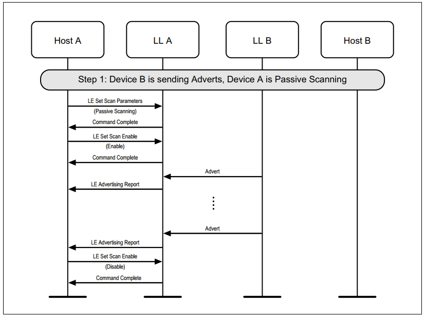
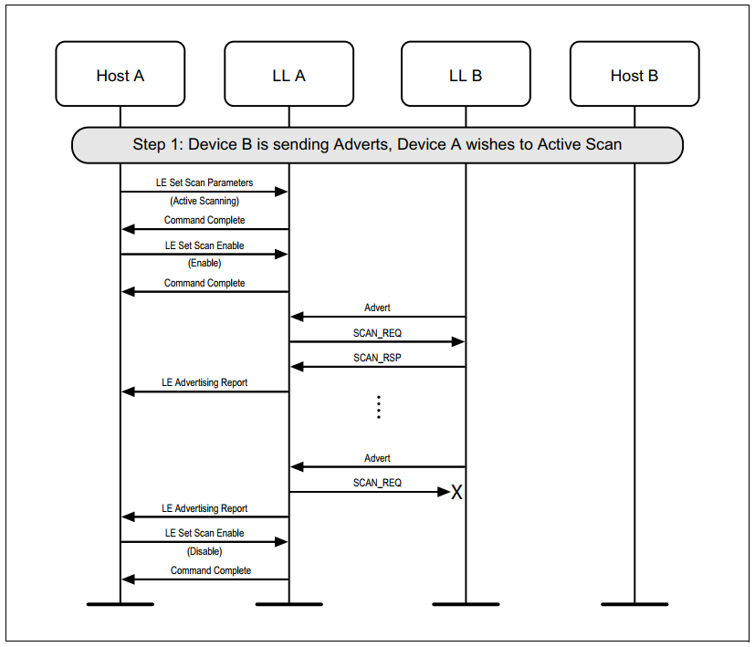
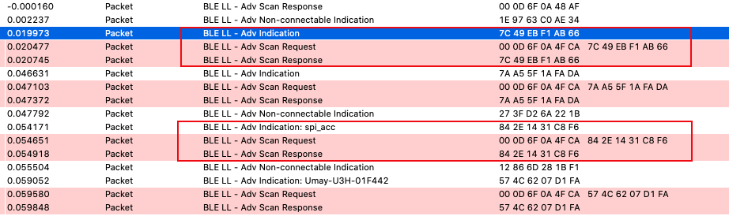
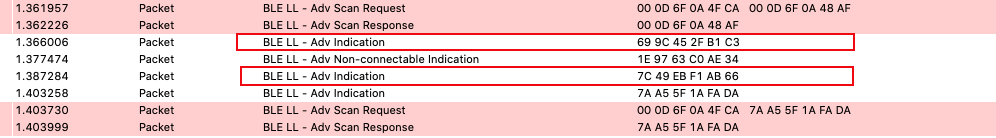
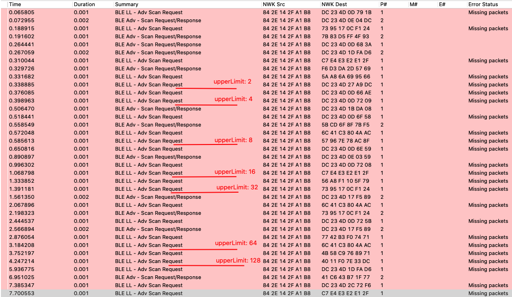
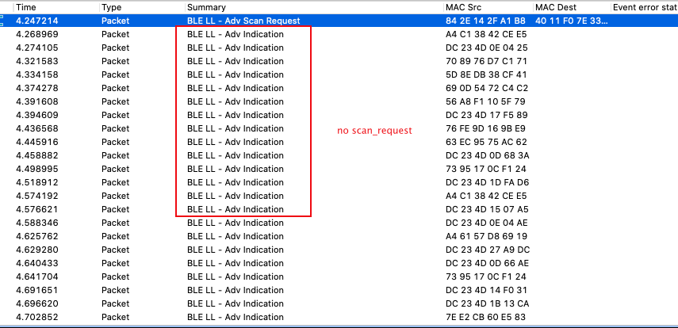

<details>
<summary><font size=5>Table of Contents</font> </summary>  

- [1. Introduction](#1-introduction)
- [2. Message Sequence Charts](#2-message-sequence-charts)
  - [2.1. Passive Scanning](#21-passive-scanning)
  - [2.2. Active Scanning](#22-active-scanning)
- [3. Implementation With Silicon Labs Bluetooth SDK](#3-implementation-with-silicon-labs-bluetooth-sdk)
  - [3.1. Slave](#31-slave)
  - [3.2. Master](#32-master)
- [4. Test](#4-test)
- [5. Backoff procedure](#5-backoff-procedure)
- [6. Note](#6-note)
</details>

********

# 1. Introduction
Bluetooth scans can either be passive or active.   
When in passive scanning, the bluetooth Link Layer will only receive packets, it shall not send any packets.    
In active scanning, the Link Layer shall listen for advertising PDUs and, depending on the advertising PDU type, it may request an advertiser to send additional information.   

# 2. Message Sequence Charts
## 2.1. Passive Scanning
A device can use passive scanning to find advertising devices in the area. This would receive advertising packets from peer devices and report these to the Host.   
Please see the figure below for the message sequence charts of passive scanning.

<div align="center">
    
</div>  
</br> 

## 2.2. Active Scanning
Master device use active scanning to obtain more information about devices that may be useful to populate a user interface. Active scanning involves more Link Layer advertising messages.   
Please see the figure below for the message sequence charts of active scanning.   
<div align="center">
    
</div>  
</br> 

# 3. Implementation With Silicon Labs Bluetooth SDK
This section show you how to use active scan to get additional information form the advertising device. You can also refer to [KBA_BT_0203](https://www.silabs.com/community/wireless/bluetooth/knowledge-base.entry.html/2017/12/27/providing_extra_data-0jco) for more information.   

## 3.1. Slave
To set up scan responses, the API function *gecko_cmd_le_gap_bt5_set_adv_data()* can be used. For more information about how to use this API, please see the [BGAPI reference manual](https://docs.silabs.com/bluetooth/latest/le-gap#cmd-le-gap-bt5-set-adv-data).   
Below is the code snippet to demonstrate how to set the advertising packet and scan response packets.   

```c
uint8 adv_data[31] = {0x02,0x01,0x06,
            0x17,0x09, 0x53, 0x63, 0x61, 0x6e, 0x20, 0x52, 0x65, 0x73, 0x70, 0x6f, 0x6e, 0x73, 0x65, 0x20, 0x54, 0x65, 0x73, 0x74, 0x20, 0x41, 0x70, 0x70}; /* starting from byte #4 complete local name, nBytes to follow, "Scan test"*/

uint8 scan_resp_data[31] = {0x02,0x01,0x06,
                      0x11,0x07,0x18,0x7f,0x1e,0x00,0xde,0x25,0x06,0x8d,0xde,0x4f,0x9e,0xf4,0x50,0xa7,0xb1,0x4a, /*only 21 bytes ... still have room for TX power*/
              0x02, 0x0A, 0x03}; 	/* indicate tx power  = 0 dBm*/

rsp = gecko_cmd_le_gap_bt5_set_adv_data(0, 0,sizeof(adv_data),adv_data)->result;
printLog("set adv data, result 0x%x\r\n", rsp);

/* scan response data*/
rsp = gecko_cmd_le_gap_bt5_set_adv_data(0, 1, sizeof(scan_resp_data), scan_resp_data)->result;
printLog("set scan response data, result 0x%x\r\n", rsp);

/* Start general advertising and enable connections. */
gecko_cmd_le_gap_start_advertising(0, le_gap_user_data, le_gap_connectable_scannable);
```

## 3.2. Master
On the master side, set the scan type as "Active scanning" using the API function *gecko_cmd_le_gap_set_discovery_type()*. And the event "gecko_evt_le_gap_scan_response_id" will be triggered once any advertising or scan response packet that is received by the device's radio while in scanning mode.   

If you are using the Bluetooth Mesh SDK, as Mesh data traffic is carried over advertising events and the Bluetooth mesh stack is scanning continuously when the Bluetooth mesh stack is active, by default, the Bluetooth mesh stack filters out advertising events so that the application is not burdened by them.   
If the application needs to process advertising events, you should use the BGAPI command "*cmd_mesh_node_set_adv_event_filter*" to unblock particular types of events.   
For example, the code snippet below unblocks both the events for Connectable undirected advertising and Scan Response.   
```c
gecko_cmd_mesh_node_set_adv_event_filter(0x09,0,0);
```

# 4. Test
After getting the master and slave settled done, we can just use the network analyzer to capture the network trace.   
We can find from the network log that the scanner will send "Adv Scan Request" out after receiving "Adv Indication".   

<div align="center">
    
</div>  
</br> 

However, we do find that sometimes the scanner will not send out the "Scan Request" to the advertiser after receiving the "Adv Indication".   

<div align="center">
    
</div>  
</br> 

So how does the Bluetooth Link Layer decide if need to send the scan request to the advertiser ?   

We have implemented active scanner backoff procedure to avoid collisions with other scanners as described in [Core v5.2, Vol 6, Part B, 4.4.3.2 Active scanning](https://www.bluetooth.com/specifications/specs/core-specification/). For that reason, scanner may not send scan request packet for every single adv packet.   

# 5. Backoff procedure
The scanner shall run a backoff procedure to minimize collisions of scan request PDUs from multiple scanners. An example of such a procedure is given in the following paragraphs.   
The backoff procedure uses two parameters, backoffCount and upperLimit, to restrict the number of scan request PDUs sent when collisions occur on scan response PDUs. Upon entering the Scanning State, the upperLimit and backoffCount are set to one.   

On every received ADV_IND, ADV_SCAN_IND, or scannable AUX_ADV_IND PDU that is allowed by the scanner filter policy and for which a scan request PDU is to be sent, the backoffCount is decremented by one until it reaches the value of zero. The scan request PDU is only sent when backoffCount becomes zero.   
After sending a scan request PDU the Link Layer listens for a scan response PDU from that advertiser. If the scan response PDU was not received from that advertiser, it is considered a failure; otherwise it is considered a success. On every two consecutive failures, the upperLimit is doubled until it reaches the value of 256. On every two consecutive successes, the upperLimit is halved until it reaches the value of one. After success or failure of receiving the scan response PDU, the Link Layer sets backoffCount to a new pseudo-random integer between one and upperLimit.   

Please check the network log below what we captured from a dense network, it has more than 40 slave devices around for advertising and there are many scanner doing the active scan simultaneously.   

Upon entering the scanning state, the upperLimit is set to 1, and on every two consecutive failures, the upperLimit is doubled, we can find that at the time 4.247214s, the upperLimit will be 128.   
The Link Layer sets backoffCount to a new pseudo-random integer between one and upperLimit, suppose it's 100, so the scanner will not send scan_request packet for the next 100 adv packet.   

<div align="center">
    
</div>  
</br> 

<div align="center">
    
</div>  
</br> 

# 6. Note
Actually, for any time critical data, it's not recommended to use scan request. It's better to use extended advertising if you need to transmit more data. Please see the [KBA_BT_0206](https://www.silabs.com/community/wireless/bluetooth/knowledge-base.entry.html/2018/08/10/extended_advertising-aEID) for more information about the extended advertising.   