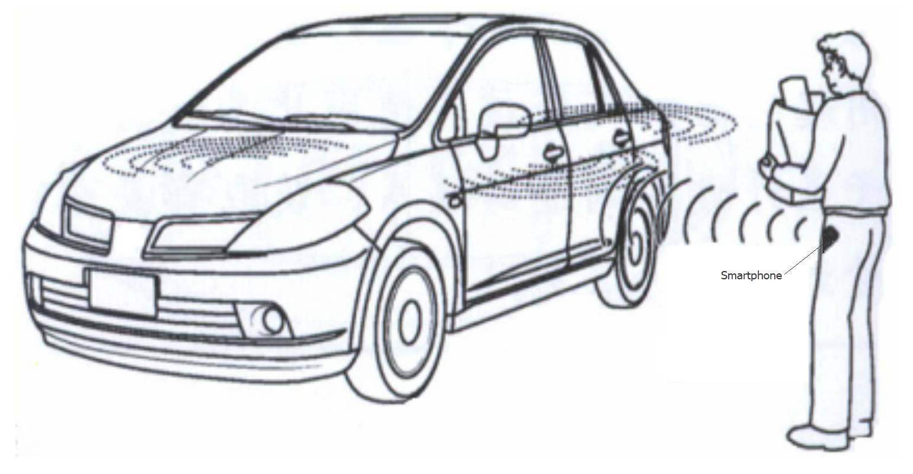
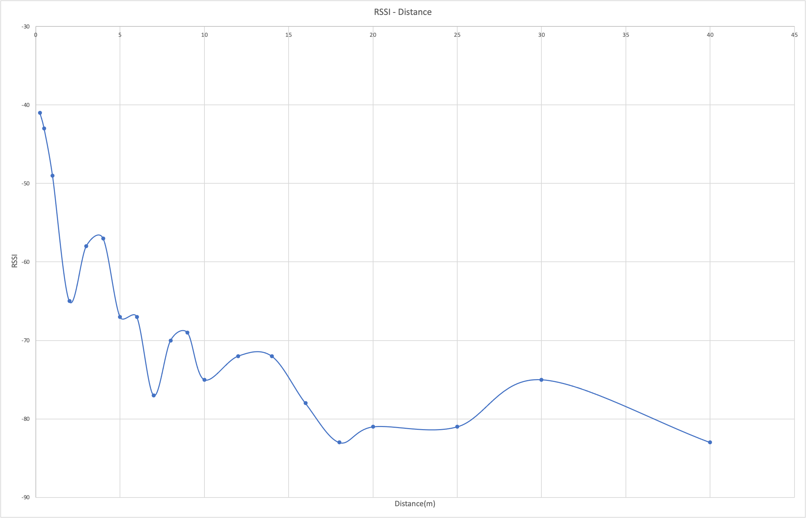
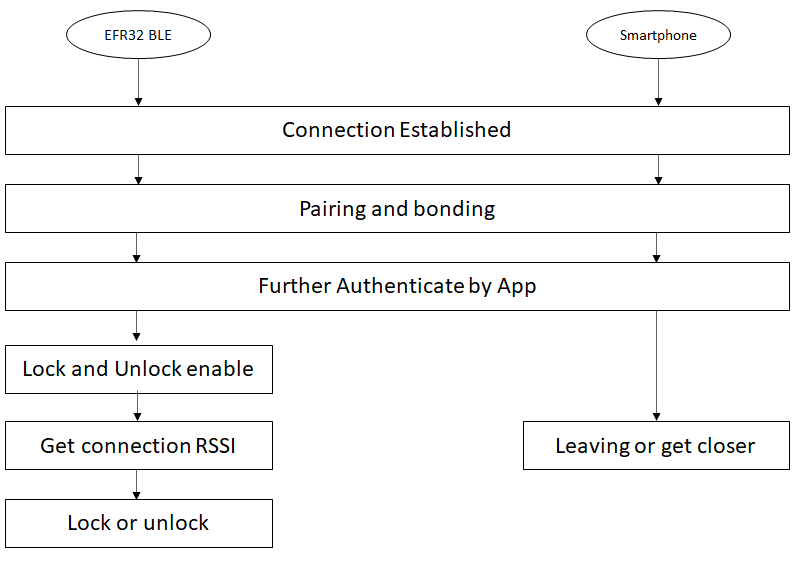
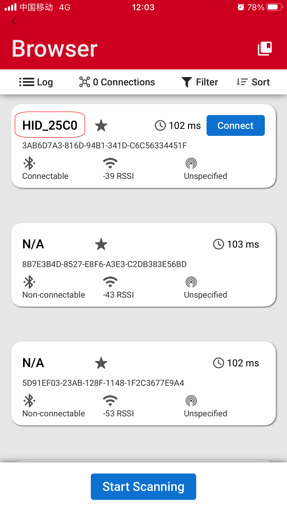
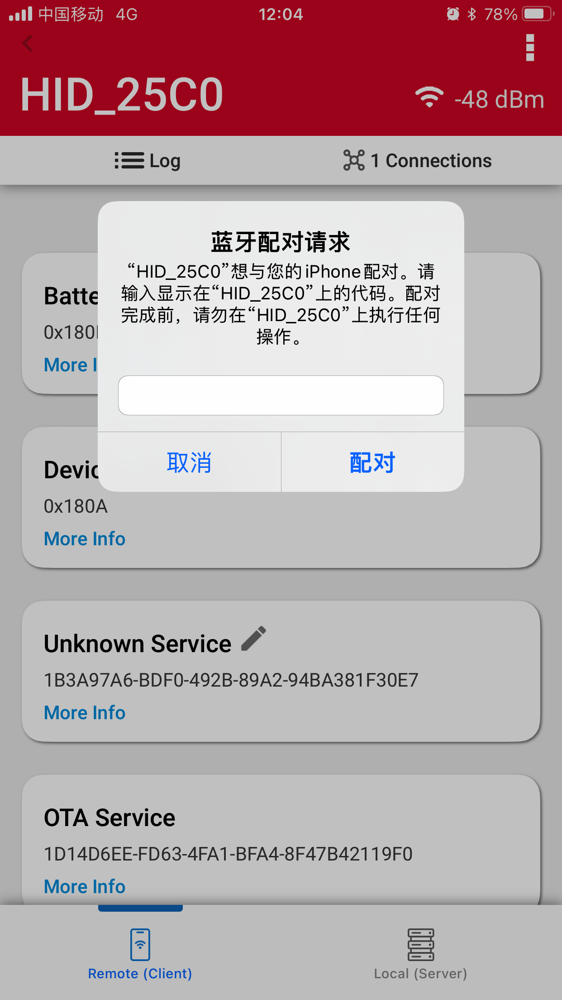
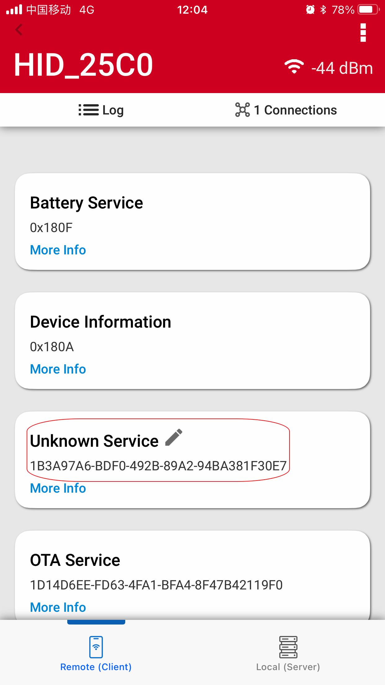
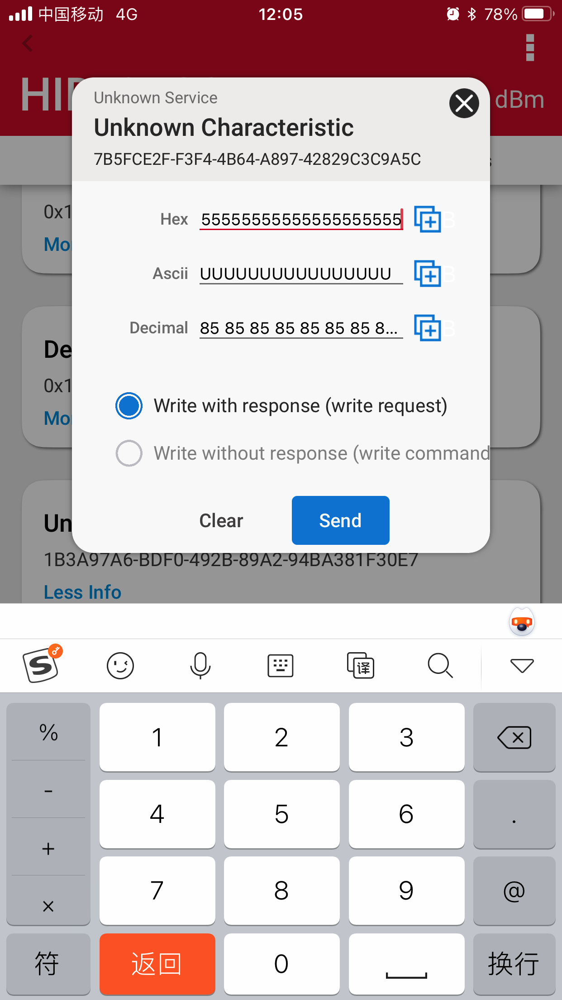
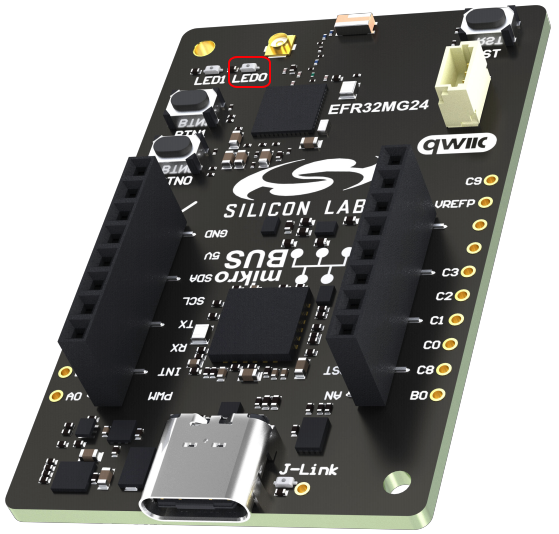

[English](Bluetooth-Smart-Key-and-Demo.md) | 中文
<details>
<summary><font size=5>Table of Contents</font> </summary>

- [1. 概述](#1-概述)
- [2. 技术介绍](#2-技术介绍)    
  - [2.1. HID](#21-hid)    
    - [2.1.1. 安全](#211-安全)    
    - [2.1.2. 自动重连](#212-自动重连)    
  - [2.2. RSSI 与距离](#22-rssi-与距离)        
    - [2.2.1. 什么是 RSSI](#221-什么是-rssi)        
    - [2.2.2. RSSI 转换成距离](#222-rssi-转换成距离)    
  - [2.3. 工作流程](#23-工作流程)
- [3. Demo 搭建](#3-demo-搭建)    
  - [3.1. 基本要求](#31-基本要求)        
    - [3.1.1. 硬件要求](#311-硬件要求)        
    - [3.1.2. 软件要求](#312-软件要求)    
  - [3.2. 工程配置](#32-工程配置)    
  - [3.3. Demo](#33-demo)
- [参考](#参考)

</details>

# 1. 概要 
PKE（Passive Keyless Entry）是一种汽车安全系统，当用户靠近汽车时自动运行，接近或拉动门把手时解锁门，当用户走开或离开时触摸汽车时上锁。 该系统还可以用于保护电动自行车、建筑物或建筑物区域。

这种设备可以存放在用户的口袋或包中进行操作，这与标准的远程无钥匙进入 (RKE) 设备不同，RKE需要用户握住设备并按下按钮来锁定或解锁汽车。 PEK可以基于BLE、NFC、UWB、UHF等无线技术。

智能手机原生支持BLE，如果手机能用于上面提到的安全系统，那可是真正的简化了人们出行和汽车解锁的方式，人们不需要随身携带钥匙或设备，只需要携带智能手机，而现在大部分人手机不离身。

<div align="center">
  
</div> 

将一个 BLE HID 设备添加到汽车中，基于智能手机的智能钥匙是可行的。 HID 主机和 HID 设备之间存在自动重新连接机制。 然后连接的RSSI可以用于确定锁定和解锁。 而且它不需要应用程序在后台运行，对用户极为友好。

# 2. 技术介绍
## 2.1. HID
HID（人机接口设备）是主要目的是允许用户与计算机交互的设备，它基于[HID 规范](https://www.usb.org/hid)。
主机和设备是 HID 协议中的两个实体。 设备是直接与人类交互的实体，例如键盘或鼠标。
蓝牙 HID 设备必须基于 [HID over GATT profile](https://www.bluetooth.com/specifications/specs/hid-over-gatt-profile-1-0/)实现。 除了 HID 服务，此配置文件还需要电池服务和设备信息服务。 我们提供 [HID keypad example](https://github.com/SiliconLabs/bluetooth_applications/tree/3eafcf19ac5ed5284be92b65803c53ae333b7197/bluetooth_hid_keyboard)。
这里要讲的用例不涉及通过 Reports 进行的 HID 数据交换，我们将仅讨论其安全性和重新连接功能。
## 2.1.1. 安全
无线通信中最常见的威胁是：
- 被动窃听
- 主动窃听 = 中间人 (MITM)
- 隐私（跟踪）

蓝牙针对这些威胁定义了 5 种不同的安全功能：
- 配对 — 在设备之间创建可信关系（密钥生成、密钥交换、身份信息交换）
- 绑定 — 存储在配对期间创建的密钥以供以后连接
- 设备身份验证 — 验证设备是否具有相同的密钥（受 MITM 保护）
- 加密 — 数据机密性（使用 FIPS 或 NIST 批准的 AES128-CCM 算法）
- 数据签名（消息完整性）— 防止数据更改

实际配对过程取决于设备 I/O 功能和应用程序定义的安全要求。
- Just works — 适用于没有 UI 的设备。无需用户交互。没有 MITM 保护。在 Just works 配对的情况下，无法确认连接设备的身份。设备将与加密配对，但无需身份验证。
- 密码输入 — 用户需要输入远程方显示的密码。提供 MITM 保护
- 数字比较 — 用户需要确认两个设备显示的密钥。提供 MITM 保护
- 带外(OOB) — 例如与 NFC 交换的加密密钥

更多信息可以参考 [Pairing Processes](https://docs.silabs.com/bluetooth/latest/general/security/pairing-processes)。

[Core Specification 5.3](https://www.bluetooth.org/DocMan/handlers/DownloadDoc.ashx?doc_id=521059) 定义了有3种安全模式，如下表。
|    Security Mode    | Description                               |
|---------------------|-------------------------------------------|
| Security Mode 1     | 无数据签名                   |
| Security Mode 2     | 数据签名                      |
| Mixed Security Mode | 上述两种混用        |


芯科的BLE stack 只支持安全模式 1。 这个安全模式又有 4 安全级别。
安全级别是连接的一种属性。 使用不同的安全特性使得每个连接具有不同的安全级别。下面总结了不同的安全级别的差异。
| Security Level | Description                                                            |
|----------------|------------------------------------------------------------------------|
| Level 1        | 无安全性                                                            |
| Level 2        | 未经过身份验证的加密配对(just work 配对) |
| Level 3        | 经过身份验证的加密配对 (legacy 配对)     |
| Level 4        | 经过身份验证的安全连接，使用128位加密密钥进行加密(Bluetooth 4.2 后支持) |

更多信息可以参考 [Using Bluetooth Security Features in Silicon Labs Bluetooth SDK](https://docs.silabs.com/bluetooth/latest/general/security/using-bluetooth-security-features-in-silicon-labs-bluetooth-sdk)。 

HID 设备强制要求绑定并使用 LE 安全模式 1，安全级别 2 或 3，这两个level都需要链路加密，使用 AES128-CCM 算法进行数据加密。

## 2.1.2. 自动重连
当连接因链路丢失而终止时，HID 主机将始终自动重新连接到已知的 HID 设备，直到用户通过蓝牙适配器菜单手动删除或忘记该设备。
详细描述可以在[HID over GATT Profile](https://www.bluetooth.com/specifications/specs/hid-over-gatt-profile-1-0/)中找到。 智能手机系统可能不允许应用程序在后台运行或任意杀死应用程序，系统级别的自动重新连接确实很有帮助，不用担心这一类问题。

如需更好的兼容 iOS 设备，还请参阅[Apple Accessory Design Guidelines](https://developer.apple.com/accessories/Accessory-Design-Guidelines.pdf)。

## 2.2. RSSI 与距离
### 2.2.1. 什么是 RSSI
RSSI（接收信号强度指示器）指示正在接收的功率电平。 它以 dBm 为单位测量，通常为负值。 负值越大表示设备越远。 例如，值为 -40 表示设备在附近，而值为 -90 表示设备在相对远端。 因此，RSSI 的值可用于推断低功耗蓝牙发射器和接收器设备之间的距离关系。

<div align="center">
  
</div>

基于RSSI的距离测量的准确性，会受到许多因素的影响，例如发射设备的输出功率、接收设备的性能、障碍物以及发射机与接收设备的距离。 RSSI 和距离之间的关系不是线性的，不是很精确，即使在固定的位置或距离上，也可能得到变化的 RSSI 值。 但它基本上能反映远近关系，通过优化算法计算RSSI平均值会有助于提高准确性。

### 2.2.2. RSSI 转换成距离
RSSI与距离转换测量建立 RSSI 和距离之间的比例。 我们可以参考[Google Android Beacon Library](https://altbeacon.github.io/android-beacon-library/distance-calculations.html)指南中介绍的测量和计算步骤。

基于信号强度 (RSSI) 的最准确距离测算可以通过针对特定设备的已知距离/RSSI 值表进行功率比对来获得。 这里使用公式 d=A*(r/t)^B+C，其中 d 是以米为单位的距离，**r** 是设备测量的 RSSI，**t** 是 1 处的参考 RSSI 仪表。 A、B 和 C 是常数。 有关如何计算公式常数 A、B 和 C，请参阅文档计算公式常数。

下面是我们芯科蓝牙协议栈在距离分别在 1 m 以内或大于 1 m 的情况下使用的更接近现实的公式。
|      距离    |    公式     |
|-------------|----------------|
|小于 1 米      | d = (r/t)^10.0
|大于 1 米      | d = A*(r/t)^B+C

其中:

- d – 估计距离（米）
- t – 1米时的RSSI值（dBm)
- r – 实际测量出来的RSSI(dBm)
- A - 常量参数, 0.7
- B - 常量参数, 5.1
- C - 常量参数, 0.111

下面是通过测量的RSSI 来估算距离，距离为 1 m 处的信标广播功率为 -40 dBm。

以-55dBm的实测信号为例，

```c
d = 0.7 * powf(ratio, 5.1) + 0.111 = 0.7 *((-55/-40)^5.1) + 0.111 = 0.7*5.074+ 0.111 = 3.662745
```

## 2.3. 工作流程
先连接配对绑定，上锁和解锁功能需要经过app认证后才能开启。 APP可以是自己开发的APP、可以是微信/支付宝小程序，也可以临时使用我们的EFR connect。

<div align="center">
  
</div>

# 3. Demo 搭建
本节讨论如何演示，如何创建和编译示例应用程序。

## 3.1. 基本要求
### 3.1.1. 硬件要求
这个演示将会用到如下硬件:
* 1 EFR32xG24 EK板
* 1 智能手机

### 3.1.2. 软件要求
- Simplicity Studio v5
     + Gecko SDK Suite 4.1.2 or later
     + Bluetooth SDK 4.2.0 or later
- EFR Connect 手机 App
     + 允许访问位置信息，  “使用app时允许” 就可以。  允许了才可以发现蓝牙设备。

## 3.2. 工程配置
1. 为EFR32xG24 创建 'Bluetooth - SoC Empty' 工程。 重命名为"xG24_training_HID", 这里把 "Copy contents" 勾选上
2. 安装如下 software components:
   1. Services -> IO Stream -> IO Stream: USART
   2. Application -> Utility -> Log
   3. Services -> Simple timer service
   4. Platform -> Driver -> LED -> Simple LED
   5. Platform -> Driver -> Button -> Simple Button
   6. Bluetooth -> NVM -> NVM Support
3. 使能 floating point printf(), 参考 [KBA](https://community.silabs.com/s/article/floating-point-print-with-gcc?language=en_US)
4. 在GATT Configurator导入附件[gatt_configuration.btconf](files/BL-Bluetooth-Smart-Key-and-Demo/src/gatt_configuration.btconf)
5. 拷贝附件 [app.c](files/BL-Bluetooth-Smart-Key-and-Demo/src/app.c) 文件到工程中 (如果文件已存在直接覆盖)
6. 编译并烧录到 EFR32 设备上

## 3.3. Demo
1. 打开 "EFR Connect app"，扫描设备， 找到 "HID_xxxx"的设备
<div align="center">
  
</div>

2. 连接配对. 应用中的passkey可以通过说明书或二维码给出。
<div align="center">
  
</div>

3. 找到用做认证的特定服务.
<div align="center">
  
</div>

4. 通过写特定的KEY值做认证，KEY 值可以通过使用手册或别的方式给出。
<div align="center">
  
</div>

5. 带着手机远离与靠近，来回重复几次，看看有没有上锁解锁动作， 板上有一个红色LED，用来指示上锁解锁，灯亮是开锁，灭是上锁。看看是不是远离断开连接后，靠近能不能重连开锁。
<div align="center">
  
</div>


# 参考
[Pairing Processes](https://docs.silabs.com/bluetooth/latest/general/security/pairing-processes)  
[HID keypad example](https://github.com/SiliconLabs/bluetooth_applications/tree/3eafcf19ac5ed5284be92b65803c53ae333b7197/bluetooth_hid_keyboard)    
[AN1302: Bluetooth Application Security Design](https://www.silabs.com/documents/public/application-notes/an1302-bluetooth-application-security-design-considerations.pdf)   


