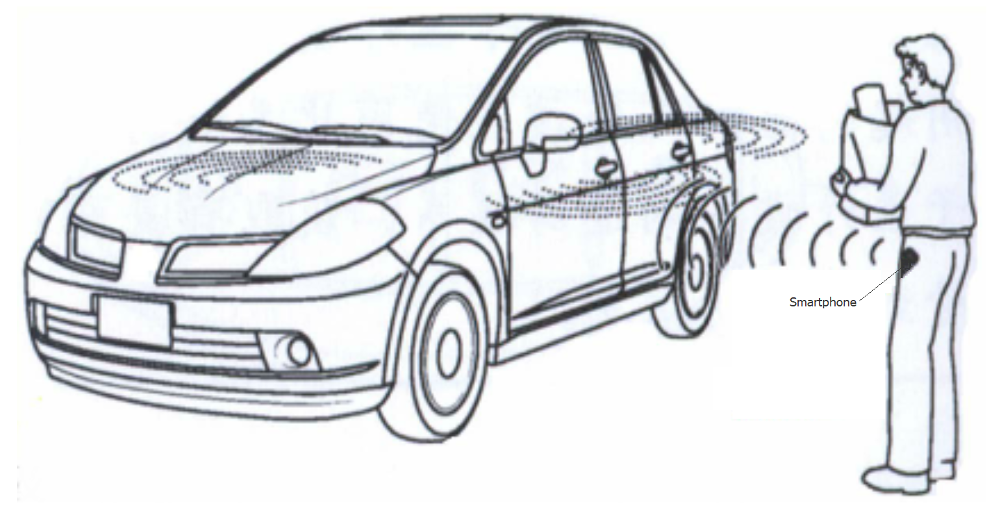
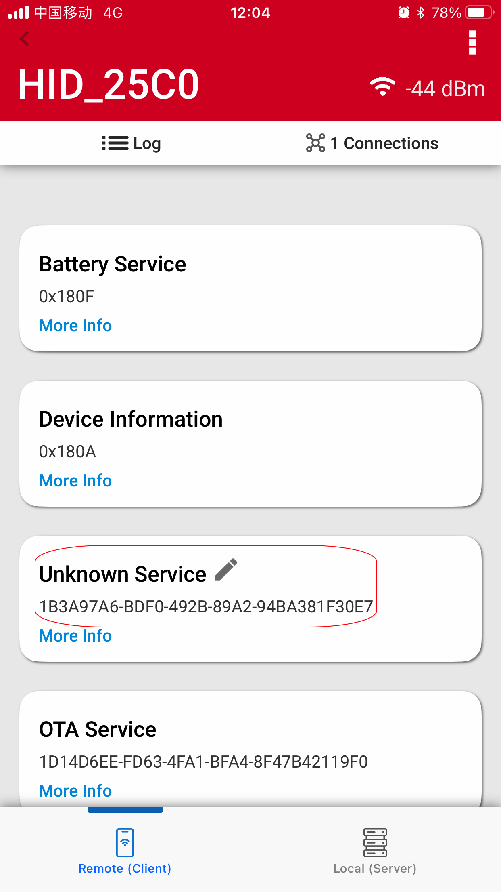

English | [中文](Bluetooth-Smart-Key-and-Demo-cn.md) 

<details>
<summary><font size=5>Table of Contents</font> </summary>

- [1. Overview](#1-overview)
- [2. Technical Introduction](#2-technical-introduction)
    - [2.1. HID](#21-hid)
      - [2.1.1. Security](#211-security)
      - [2.1.2.  Reconnection](#212-reconnection)
    - [2.2. RSSI to Distance](#22-rssi-to-distance)
      - [2.2.1 RSSI](#221-rssi)
      - [2.2.2. Convert RSSI to Distance](#222-convert-rssi-to-distance)
    - [2.3. Workflow](#23-workflow)
- [3. Demo Setup](#3-demo-setup)
    - [3.1. Prerequisites](#31-prerequisites)
      - [3.1.1. Hardware Requirements](#311-hardware-requirements)
      - [3.1.2. Software Requirements](#312-software-requirements)
    - [3.2. Project Setup](#32-project-setup)
    - [3.3 Demo](#33-demo)
- [Reference](#reference)

</details>

# 1. Overview 
PKE(Passive Keyless Entry) is an automotive security system that operates automatically when the user is in proximity to the car, unlocking the door on approach or when the door handle is pulled and locking it when the user walks away or touches the car on exit. The systems are also used to secure E-bike, buildings or areas of buildings.

This kind of device can operate while stored in the user's pocket or bag, unlike a standard remote keyless entry (RKE) device, which requires the user to hold the device and push a button to lock or unlock the car. It can be based on BLE, NFC, UWB, UHF and so on.

Smartphone native support BLE, if it can use for the mentioned security system, that's really simplify people travel and car unlock way, people no need take the key or device along, only need to bring the smartphone, the fact is that most people can not live without smartphone.

<div align="center">
  
</div> 

Add one BLE HID device into the car, smartphone based smart key should be possible. There is automatic reconnection mechanism between HID host and HID device. Then the connection RSSI can be used for determination lock and unlock. And it no need the app run in background, friendly to user.

# 2. Technical Introduction
## 2.1. HID
HID(human interface device) are devices whose primary purpose is to allow users to interface with computers, it is based on [HID specification](https://www.usb.org/hid). 
The host and the device are two entities in the HID protocol. The device is the entity that directly interacts humans, such as a keyboard or mouse. 
A Bluetooth HID Device must implement the [HID over GATT profile](https://www.bluetooth.com/specifications/specs/hid-over-gatt-profile-1-0/). In addition to HID Service, this profile requires the Battery Service and the Device Information Service too. We provide [HID keypad example](https://github.com/SiliconLabs/bluetooth_applications/tree/3eafcf19ac5ed5284be92b65803c53ae333b7197/bluetooth_hid_keyboard).
HID data exchange through Reports is not involved in the use case, we will only discuss its security and reconnection feature here. 

## 2.1.1. Security
The most common threats in wireless communications are:
- Passive eavesdropping
- Active eavesdropping = Man in the Middle (MITM)
- Privacy (tracking)

Bluetooth defines 5 distinct security features against these threats:
- Pairing — creating trusted relationships between devices (Key Generation, Key Exchange, Identity Information Exchange)
- Bonding — storing the keys created during pairing for later connections
- Device authentication — verification that devices have the same keys (Protected from MITM)
- Encryption — data confidentiality (FIPS or NIST approved AES128-CCM algorithm used)
- Data signing (Message integrity) — protection against data alteration

Pairing process depends on the device I/O capabilities and the security requirements defined by the application.
- Just works — For devices without UI. No user interaction required. No MITM protection. In case of Just works pairing there is no possibility to confirm the identity of the connecting devices. Devices will pair with encryption but without authentication.
- Passkey entry — User needs to enter a passkey the remote party displays. Provides MITM protection
- Numeric comparison — User needs to confirm passkeys both devices display. Provides MITM protection
- Out-of-band — Encryption keys exchanged for example with NFC

More details can be found in [Pairing Processes](https://docs.silabs.com/bluetooth/latest/general/security/pairing-processes).

According to [Core Specification 5.3](https://www.bluetooth.org/DocMan/handlers/DownloadDoc.ashx?doc_id=521059), there are 3 security mode, list in below.
|    Security Mode    | Description                               |
|---------------------|-------------------------------------------|
| Security Mode 1     | Without signing of data                   |
| Security Mode 2     | With signing of data                      |
| Mixed Security Mode | Support both Security Mode 1 and 2        |


Security mode 1 is the only mode supported for Bluetooth Low Energy in the Silicon Labs’ BLE stack. There are 4 Security levels under Security mode 1.
Security level is a property of a connection. Using different security features can lead to different security levels per connection. The different levels summarized below.
| Security Level | Description                                                            |
|----------------|------------------------------------------------------------------------|
| Level 1        | No security                                                            |
| Level 2        | Unauthenticated pairing with encryption (paired with just work method) |
| Level 3        | Authenticated pairing with encryption (paired with legacy pairing)     |
| Level 4        | Authenticated Secure Connections pairing with encryption using a 128-bit strength encryption key (Paired with LE secure pairing which is Bluetooth 4.2 feature) |

More details can be found in [Using Bluetooth Security Features in Silicon Labs Bluetooth SDK](https://docs.silabs.com/bluetooth/latest/general/security/using-bluetooth-security-features-in-silicon-labs-bluetooth-sdk). 

HID devices mandatory request bond and use LE Security Mode 1, Security Level 2 or 3, both of which require an encrypted link, use AES128-CCM algorithm for data encryption.

## 2.1.2. Auto Reconnection
When a connection is terminated due to link loss, the HID Host will always automatically reconnect to a known HID device until the user manually forgets the device through the Bluetooth adaptor menu. 
The detailed description can be found in [HID over GATT Profile](https://www.bluetooth.com/specifications/specs/hid-over-gatt-profile-1-0/). Smartphone system may not allow app run in background or kill the app arbitrarily, system-level auto-reconnect really helps.

For better compatibility with iOS devices, please also refer to [Apple Accessory Design Guidelines](https://developer.apple.com/accessories/Accessory-Design-Guidelines.pdf).

## 2.2. RSSI to Distance
### 2.2.1 RSSI
RSSI(Received Signal Strength Indicator) is indication of the power level being received. It's measured in decibels, dBm, on a logarithmic scale and usually is negative. A more negative number indicates the device is further away. For example, a value of -40 indicates the device is close while a value of -90 indicates the device is far away. So the value of the RSSI can be used to infer the distance between the Bluetooth LE transmitter and receiver devices.

<div align="center">
  
</div>

The accuracy of the distance measurement depends on the RSSI which will affected by many factors such as the output power of the transmitting device, the capability of the receiving device, obstacles and the distance of the transmitter from the receiving device. Relationship between RSSI and distance is not linearity, not very accuracy, it is possible to get variation of the RSSI value even on a fixed location or distance. However it basically reflect far and near, take several time then calculate the average RSSI will help to improve the accuracy.

### 2.2.2. Convert RSSI to Distance
RSSI–distance conversion (one-dimensional scale) measurements establish the scale between RSSI and distance. We can refer to the measurement and calculation steps introduced in the [Google Android Beacon Library](https://altbeacon.github.io/android-beacon-library/distance-calculations.html) guideline.

Despite formulas suggested by signal theory, the most accurate predictor of distance based on signal strength (RSSI) can be obtained by doing a power regression against a known table of distance/RSSI values for a specific device. This uses the formula d=A*(r/t)^B+C, where d is the distance in meters, **r** is the RSSI measured by the device and **t** is the reference RSSI at 1 meter. A, B, and C are constants. For how to calculate the formula constants A,B and C, please see the documentations [Calculating Formula Constants](https://altbeacon.github.io/android-beacon-library/distance-calculations2.html).

Below are the more realistic formula we are using for the case of the distance is within 1 m or more than 1 m respectively.
|   Distance  |    Formula     |
|-------------|----------------|
|Within 1 m   | d = (r/t)^10.0
|More than 1 m| d = A*(r/t)^B+C

Where:

- d – estimated distance in meters
- t – tx power in dBm at 1 m
- r – measured signal value (RSSI) in dBm
- A - constant, 0.7
- B - constant, 5.1
- C - constant, 0.111

Below is the estimated distance with the measured RSSI, the tx power at 1 m is -40 dBm.

Take the -55dBm measured signal as an example,

```c
d = 0.7 * powf(ratio, 5.1) + 0.111 = 0.7 *((-55/-40)^5.1) + 0.111 = 0.7*5.074+ 0.111 = 3.662745
```

## 2.3. Workflow
The lock and unlock function can be enabled only after authentication via app. The app can be self-developed app, wechat/Alipay mini program, or temporary use of our EFR connection.

<div align="center">
  
</div>

# 3. Demo Setup
This section discuss how to set up the demo, how to create and build the example application.

## 3.1. Prerequisites
### 3.1.1. Hardware Requirements
This demo will need the following hardware:
* 1 EFR32xG24 Explorer Kit Board
* 1 Smartphone

### 3.1.2. Software Requirements
- Simplicity Studio v5
     + Gecko SDK Suite 4.1.2 or later
     + Bluetooth SDK 4.2.0 or later
- EFR Connect Mobile App
     + Accept Location Access.  “While using the App” will work.

## 3.2. Project Setup
1. Create a new 'Bluetooth - SoC Empty' project for the EFR32xG24 device. Rename it as "xG24_training_HID", check the "Copy contents" on.
2. Install the following software components:
   1. Services -> IO Stream -> IO Stream: USART
   2. Application -> Utility -> Log
   3. Services -> Simple timer service
   4. Platform -> Driver -> LED -> Simple LED
   5. Platform -> Driver -> Button -> Simple Button
   6. Bluetooth -> NVM -> NVM Support
3. Enable floating point printf(), refer to [KBA](https://community.silabs.com/s/article/floating-point-print-with-gcc?language=en_US).
4. Import the attached [gatt_configuration.btconf](files/BL-Bluetooth-Smart-Key-and-Demo/src/gatt_configuration.btconf) file in the GATT Configurator.
5. Copy the attached [app.c](files/BL-Bluetooth-Smart-Key-and-Demo/src/app.c) file into the project (overwriting the existing one).
6. Build and flash the project to the EFR32 device.

## 3.3 Demo
1. Open "EFR Connect app" for scan, find the devcie "HID_xxxx"
<div align="center">
  
</div>

2. Connnect and pair accordingly, the passkey have set in application and should provide on manual or QR code.
<div align="center">
  
</div>

3. Find out the specify service.
<div align="center">
  
</div>

4. Authenticate on the app, send the key which may provided by manual or QR code.
<div align="center">
  
</div>

5. Move with the smartphone, check if it can lock and unlock or not, there is one LED(red) for indicate, LED on is unlock while off means locked. Press button 0 for remove the bonded information.
<div align="center">
  
</div>


# Reference
[Pairing Processes](https://docs.silabs.com/bluetooth/latest/general/security/pairing-processes)  
[HID keypad example](https://github.com/SiliconLabs/bluetooth_applications/tree/3eafcf19ac5ed5284be92b65803c53ae333b7197/bluetooth_hid_keyboard)    
[AN1302: Bluetooth Application Security Design](https://www.silabs.com/documents/public/application-notes/an1302-bluetooth-application-security-design-considerations.pdf)   


