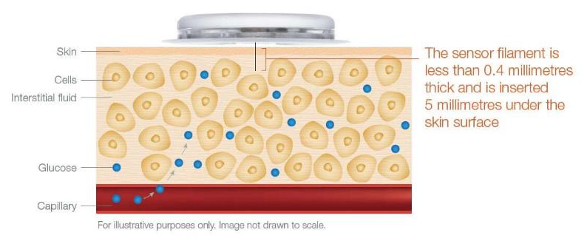
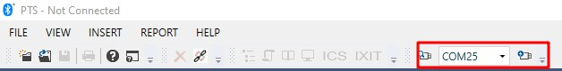
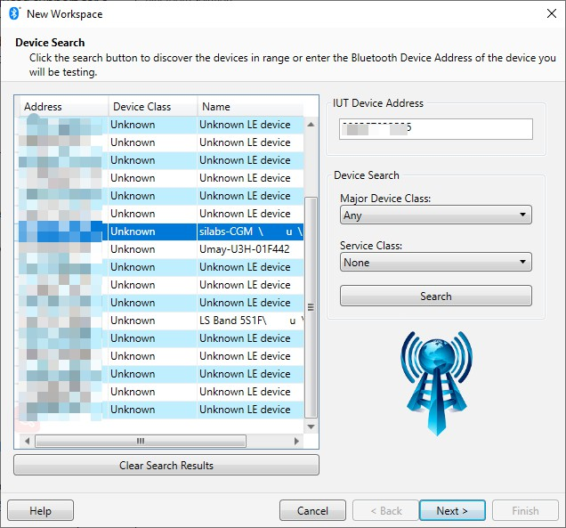
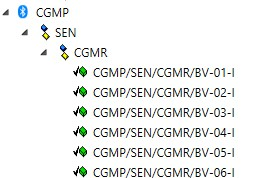
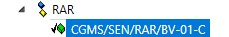
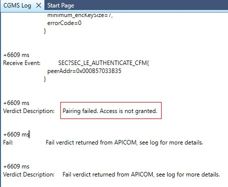

[English](Bluetooth-portable-medical-application-with-high-accuracy-ADC.md) | 中文

<details>
<summary><font size=5>Table of Contents</font> </summary>

- [1 概述](#1-概述)
  - [1.1 为什么在便携式医疗设备中使用蓝牙？](#11-为什么在便携式医疗设备中使用蓝牙)
  - [1.2 什么是便携式医疗设备？](#12-什么是便携式医疗设备)
- [2 技术介绍](#2-技术介绍)
  - [2.1 如何优化能效](#21-如何优化能效)
  - [2.2 提高便携式医疗设备的准确性](#22-提高便携式医疗设备的准确性)
    - [2.2.1 xG24 ADC](#221-xg24-adc)
  - [2.3 便携式医疗设备中的安全](#23-便携式医疗设备中的安全)
  - [2.4 典型框图](#24-典型框图)
  - [2.5 **CGM**（连续血糖监测仪）](#25-cgm连续血糖监测仪)
    - [2.5.1 SIG CGM  service/profile](#251-sig-cgm--serviceprofile)
    - [2.5.2 SIG CGM service/profile 的结构](#252-sig-cgm-serviceprofile-的结构)
    - [2.5.3 SIG CGM 的工作原理](#253-sig-cgm-的工作原理)
- [3 如何开发](#3-如何开发)
  - [3.1 从 SoC empty创建](#31-从-soc-empty创建)
  - [3.2 烧录程序](#32-烧录程序)
  - [3.3 应用测试](#33-应用测试)
    - [3.3.1 OTA service](#331-ota-service)
    - [3.3.2 创建客户应用app](#332-创建客户应用app)
      - [3.3.2.1 获取所有数据](#3321-获取所有数据)
      - [3.3.2.2 定期获取数据](#3322-定期获取数据)
      - [3.3.2.3 请求获取数据](#3323-请求获取数据)
  - [3.4 如何做 CGM profile 认证](#34-如何做-cgm-profile-认证)
    - [3.4.1 PTS 设置](#341-pts-设置)
    - [3.4.2 创建测试workspace](#342-创建测试workspace)
    - [3.4.3 如何测试](#343-如何测试)
    - [3.4.4 Reference](#344-reference)
     </details>

# 1 概述

##  1.1 为什么在便携式医疗设备中使用蓝牙？

启用了无线功能的设备和应用程序必须具有强大的安全性、小尺寸和高能效，以实现长寿命和低成本的准确和安全操作。低功耗蓝牙 (BLE) 可以满足所有要求，为制造商和设备制造商提供一种最佳的无线解决方案。

<div align="center">
  
</div> 

## 1.2 什么是便携式医疗设备？

便携式医疗设备会**持续**监测和跟踪患者的生理状况。医疗保健专业人员可以通过蓝牙连接，在智能手机应用程序上远程查看收集到的健康数据。无线连接的便携式和可穿戴医疗设备对于实现门诊护理服务至关重要。

低功耗蓝牙是便携式医疗设备部署最多的无线连接技术，例如**BGM**（血糖仪）、**CGM**（连续血糖监测仪）、血压监测仪、脉搏血氧仪、胰岛素泵、心脏监测仪系统等等。


# 2 技术介绍

设计便携式医疗设备时需要了解什么？下面是医疗设备制造的三大设计注意事项。

## 2.1 如何优化能效

便携式医疗设备的产品寿命可能从几天，几个月甚至几年时间不等。这使得功耗优化颇具挑战性，可能是关键的设计考虑因素。Silicon Labs的 EFR32 xG24系列芯片中的巧妙布局设计最大限度地降低了待机和活动模式下的总 SoC 功耗（包括 MCU 和wireless）。使用纽扣电池，您可以实现长达 数年以上的运行。

## 2.2 提高便携式医疗设备的准确性

高精度是医疗设备的首要设计考虑因素之一。我们的EFR32 xG24系列芯片上的模拟前端使您能够设计高精度的医疗产品，其中包括 16 位模数转换器、12 位数模转换器和精确的片上电压基准。先进的 Series 2 设计确保模拟模块在蓝牙无线电操作期间能正常执行。

### 2.2.1 xG24 ADC  

IADC支持三种工作模式:

普通模式(所有型号) ；

高速模式，输出分辨率为12-16bit；

高精度模式(某些型号)，为低速率、高性能应用优化，具有20位输出分辨率。

ADC输出分辨率取决于过采样率（OSR）和数字平均设置（digital averaging settings）。 在这个项目中，我们设置过采样率为32x，数字平均为16x，此时IADC采样率为4.8 kbps，

分辨率公式：分辨率= 11 + log2(过采样率*数字平均)，此时分辨率= 11 + log2(32 * 16) = 20。 

##  2.3 便携式医疗设备中的安全

便携式医疗设备收集、处理和传输私人健康数据，使安全成为关键的设计考虑因素。 Silicon Labs 的蓝牙解决方案在各个层面都受到保护，可保护您的便携式医疗设备免受最复杂的逻辑、物理和无线攻击，从而保护患者的隐私。我们的 Secure Vault 固件使世界上[第一个获得 Arm PSA Level 3 认证的无线 SoC](https://www.silabs.com/security/third-party-accreditation)，Silicon Labs已针对 IoT 设备安全性进行了独立测试， 使 OEM厂商对使用Silicon Labs的解决方案充满信心。

##  2.4 典型框图

<div align="center">
  
</div> 

上图是一个典型的便携式医疗设备设计框图，包括无线 SoC、模拟前端、传感器/执行器接口和显示功能。 Silicon Labs EFR32 xG24 芯片包括了无线 SoC 和 MCU 功能。

##  2.5 **CGM**（连续血糖监测仪）

1. 连续血糖监测仪 (CGM) 是一种用于持续监测血糖的设备，供需要胰岛素的糖尿病患者使用，例如：患有 I 型、II 型糖尿病或其他类型糖尿病（例如妊娠糖尿病）的人。

<div align="center">
  
</div> 

***本文档侧重于蓝牙部分，而不是生物传感器和 AFE。市场上的BGM/CGM产品一般没有通用的生物传感器和AFE解决方案，部分厂商有自己的专有解决方案。***

2. 连续血糖监测（CGM）系统会在白天和晚上持续检查血糖水平，并可以通过***蓝牙***提醒您，如果您的血糖水平过高或过低，系统会发出警报，

3. 计量单位为mmol/L（毫摩尔每升）或mg/DL（毫克每分升），换算为：

```值 [mg/dL] = 18.02 * 值 [mmol/L]```

4. 健康成人（无糖尿病）饭前的正常血糖（葡萄糖）水平应在3.9-6.1 mmol/L（70-110 mg/DL）。

### 2.5.1 SIG CGM  service/profile

在本节中，将会解释 SIG CGM service/profile的结构以及它是如何工作的。

基本上，profile规范包含了collector和sensor的特征和行为，并且是service的集合，而service则专注于sensor的特征和行为。

### 2.5.2 SIG CGM service/profile 的结构

SIG 已经有连续血糖监测的service/profile，此外，还有CGMS.TS 和 CGMP.TS 的测试用例规范。这些文档都可以在SIG官网下载。

Profile定义了两个角色：CGM Sensor 和 Collector。 CGM 传感器是测量葡萄糖水平浓度的设备，而collector是从 CGM 传感器接收葡萄糖测量值和其他相关数据的设备。
• CGM sensor应为 GATT  server。
• CGM collector应为 GATT client。
在任意一个时间，CGM sensor应只连接到一个collector。

<div align="center">
  
</div> 

在实际情况下，collector可以是智能手机上运行的 APP或者电脑。

下面是一个 SIG CGM service，它包括以下特性，

<div align="center">
  
</div> 

CGM collector可以请求 CGM sensor执行特定步骤，需要将特定的Op code写入 **CGM Specific Ops Control Point/Record Access Control Point**这两个characteristic。

### 2.5.3 SIG CGM 的工作原理

1. 准备一个CGM sensor和一个collector，CGM sensor应该初始化一个CGM service，

2. CGM sensor将进入 GAP 可连接模式并在有数据发送到collector时开始广播。collector通常会扫描 CGM sensor，并执行 GAP 连接建立过程，
3. 建立连接后，collector应执行 GATT Discovery the service and characteristics，包括以下内容：

+ CGM Measurement Characteristic
+ CGM Feature Characteristic
+ CGM Status Characteristic
+ CGM Session Start Time Characteristic
+ CGM Session Run Time Characteristic
+ Record Access Control Point Characteristic
+ CGM Specific Ops Control Point Characteristic

4. Collector 需要和 Sensor 绑定，

5. collector应配置CCCD(客户端特征配置描述符)以根据需要启用notification或indication。
6. Collector 应将 Set CGM **Communication Interval** 这个Op Code 写入 **CGM Specific Ops Control Point**。例如，写入参数 0x05 会将 CGM sensor内的 CGM 通信间隔值设置为 5 分钟。
7. Collector 应将 **Start Session** 的Op Code写入**CGM Specific Ops Control Point**. 
8. Collector应将其实际时间（面向用户的时间）发送到 sensor的 **CGM 会话开始时间** ，计算会话开始时间。这应该在会话启动后至少执行一次。会话开始时间结构为日期时间+时区+夏令时偏移量，
9. CGM 测量记录包含两个重要字段：CGM Glucose Concentration Field，即 CGM 葡萄糖浓度和 Time Offset Field，Time Offset 字段与 CGM Session Start Time 结合使用，表示每个CGM 测量值与会话开始时间的时间差，
10. Collector可以通过两种方式接收来自sensor的**CGM 测量**值：定期和请求，

+ **定期通知**：如果 CGM 会话正在运行，CGM sensor会在设备特定间隔（测量时间间隔）中定期测量葡萄糖水平。当 CGM 通信间隔设置为定期通信时，CGM 传感器会定期发送自上次通信间隔通知以来发生的最近 CGM 测量的通知。
+ **请求通知**：如果 CGM 会话正在运行并且客户端错过了一些 CGM 测量（例如，由于链路丢失，或 CGM 会话已停止），客户端可能会写值到 **Record Access Control Point**，从患者记录数据库中请求特定数据，这会触发 CGM 测量特征值的即时通知。

11. 要停止 CGM 会话，collector应将 **Stop Session** 的Op Code写入 **CGM Specific Ops Control Point**，CGM sensor就会停止测量。
12. 当连接因连接断连而终止时，collector应尝试重新连接到 sensor。

# 3 如何开发

下面演示使用 **xG24 explorer kit** 来开发 **Continuous Glucose Monitoring** 。

该工程会使用到Simplicity Studio V5.4.0.0 和 GSDK v4.1.0，如果您使用较新的 GSDK，可能需要进行一些代码修改。另外还有EFR connect app（版本 2.5.0）或客户开发的应用程序。

## 3.1 从 SoC empty创建 ##

1. 创建一个SoC empty 工程，

2. 在Simplicity Studio中安装以下components：

   IO stream: USART(instance name: vcom), Log, Simple timer service,IADC，

3. 导入 Simplicity Studio 文件夹中的 CGM.btconf，

4. 将src文件夹中的所有文件复制到你的SoC empty工程文件夹中，

5. 编译工程并烧录到xG24 explorer kit。

## 3.2 烧录程序

1. 准备一个 xG24 explorer 套件，将其连接到 PC，
2. 在Simplicity Studio里烧录bootloader.s37，再烧录 xG24-Bluetooth-CGM.s37, 
3. 如果手机之前与设备绑定过，请将设备里的绑定信息和手机里的绑定信息都擦除，保证状态同步。

## 3.3 应用测试

打开 EFR connect app，找到 silabs-CGM，连接，

这个设备注意有两个服务，Continuous Glucose Monitoring 和 OTA service，您可以使用 EFR connect app来操作 CGM sensor。

<div align="center">
   
</div> 

### 3.3.1 OTA service

用于 OTA 升级，请参考[AN1086: Using the Gecko Bootloader with the Silicon Labs Bluetooth® Applications](https://www.silabs.com/documents/public/application-notes/an1086-gecko-bootloader-bluetooth.pdf) 了解更多信息。

### 3.3.2 创建客户应用app

如果客户想要创建自己的应用程序来和 CGM sensor交互，下面是操作过程。

#### 3.3.2.1 获取所有数据

1. 设置0x2AA7特性（**CGM Measurement**）的notify和0x2A52特性（**Record Access Control Point**）的indicate，
2. 将 HEX 0401 写入 0x2A52，
3. 在0x2A52上会有1个indication（0x05000400），表示默认有4条记录。

客户端可以通过两种方式接收 CGM 测量特征值：定期和请求

#### 3.3.2.2 定期获取数据

1. 设置0x2AA7特征值 notify（**CGM Measurement**）
2. 设置0x2AAC特性值 indicate（**GM Specific Ops Control Point**），

3. 将 HEX 1A 写入 0x2AAC，表示开始会话，您可以在 CGMS.TS.p6 中找到这个测试用例：CGMS/SEN/CGMCP/BV-22-C [CGM Specific Ops – ‘Start Session’，

4. 0x2AAC 中会收到 indication表示启动会话成功，

5. CGM sensor将定期向 0x2AA7 特征值发送notification，直到将 0x1B 写入 0x2AAC（停止会话），

6. 将“1B”写入 0x2AAC 停止会话。

#### 3.3.2.3 请求获取数据

1. 设置0x2AA7特征值 notify（**CGM Measurement**）
2. 设置0x2A52特性值indicate（**Record Access Control Point**），
3. 将HEX 0105写入0x2A52，表示上报第一条记录，
4. 0x2AA7 特征值上会有 1 个notification。

## 3.4 如何做 CGM profile 认证

***蓝牙认证包含：RF-PHY, link layer，host layer, 本次测试关注的是如何使用PTS进行profile认证，而不是描述整个蓝牙认证过程，***

### 3.4.1 PTS 设置

本次测试软件为Profile Tuning Suit(PTS)，可以到[SIG website](https://apps.bluetooth.com/mysettings#/ptsdownload) 下载，最新版本为8.1.2，请注意PTS也有可能会有一些问题，您可以通过 PTS 提出工单（点击 HELP->PTS issue）。

硬件为PTS dongle，您可以在[SIG 商店](https://store.bluetooth.com/) 购买。这个dongle作为 CGM collector。

本文档使用新的 LE only dongle（支持core v5.2）。

<div align="center">
  
</div> 

另外需要下载 [PTS Firmware Upgrade Software](https://www.bluetooth.com/develop-with-bluetooth/qualification-listing/qualification-test-tools/profile-tuning-suite/)，来更新dongle的固件。

### 3.4.2 创建测试workspace

首先，将dongle插入电脑，打开PTS软件，

然后单击“连接”到dongle。

<div align="center">
  
</div> 

创建一个新的workspace进行测试。

<div align="center">
  
</div> 

确保 xG24 explorer kit 现在可以工作，然后选择 silabs-CGM，点击下一步，

<div align="center">
  
</div> 

在本次测试中，我们选择 CGMP 和 CGMS 加入到测试，点击完成。

<div align="center">
  
</div> 

记得选择 TSPC_ALL 来解锁所有的测试用例。

<div align="center">
  
</div> 

展开所有测试用例，需要测试通过 CGM service 以及profile里的所有 sensor 部分，如果需要测试app逻辑，则需要测试collector部分，

<div align="center">
  
</div> 

<div align="center">
  
</div> 

整个PTS界面如下，

<div align="center">
  
</div> 

### 3.4.3 如何测试

我们以CGMS/SEN/RAR/BV-01-C为例，详细测试流程可以参考 CGMS.TS.p6 第 4.12 节 CGMS/SEN/RAR/BV-01-C[Report Stored Records – ‘All records’]。

测试通过后，测试项目会有一个PASS标志，如下所示，

<div align="center">
  
</div> 

如果出现问题，测试项目将显示失败标志，如下所示，

<div align="center">
  
</div> 

如果测试失败，可以检查日志，

<div align="center">
  
</div> 

从日志中我们可以发现CGM sensor之前和collector配对过，sensor里的信息没有擦除，而collector可能把这个信息擦除了，这时可以把sensor里的配对信息也擦除掉，测试就可以通过了。

### 3.4.4 Reference

CGM的规范都可以在Bluetooth SIG网站https://www.bluetooth.com/specifications/specs/上找到，搜索CGM，

<div align="center">
  
</div> 

点击 CGMP 和 CGMS 下载规范，点击 TS 下载测试用例规范。
