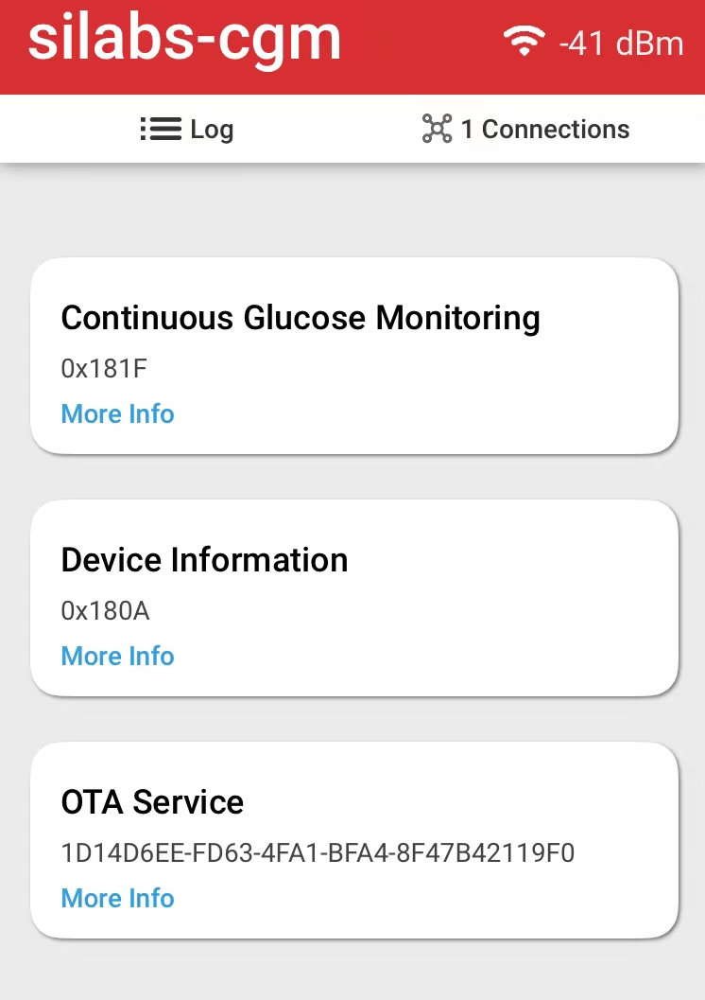
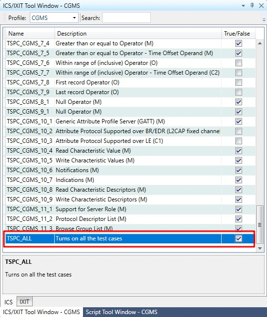

English | [中文](Bluetooth-portable-medical-application-with-high-accuracy-ADC-cn.md) 
<details>
<summary><font size=5>Table of Contents</font> </summary>

- [1. Overview](#1-overview)
  - [1.1. Why Use Bluetooth in Portable Medical Devices?](#11-why-use-bluetooth-in-portable-medical-devices)
  - [1.2. What Are Portable Medical Devices?](#12-what-are-portable-medical-devices)
- [2. Technical introduction](#2-technical-introduction)
  - [2.1. How to Optimize Power Efficiency](#21-how-to-optimize-power-efficiency)
  - [2.2. Increasing Accuracy of Portable Medical Devices](#22-increasing-accuracy-of-portable-medical-devices)
    - [2.2.1. xG24 ADC](#221-xg24-adc)
  - [2.3. IoT Security in Portable Medical Devices](#23-iot-security-in-portable-medical-devices)
  - [2.4. Typical Block Diagram](#24-typical-block-diagram)
  - [2.5. **CGM**( continuous glucose monitors)](#25-cgm-continuous-glucose-monitors)
    - [2.5.1. SIG CGM service/profile](#251-sig-cgm-serviceprofile)
    - [2.5.2. The structure of SIG CGM service/profile](#252-the-structure-of-sig-cgm-serviceprofile)
    - [2.5.3. How SIG CGM works](#253-how-sig-cgm-works)
- [3. Demo](#3-demo)
  - [3.1. Create from an SoC empty example](#31-create-from-an-soc-empty-example)
  - [3.2. Setup](#32-setup)
  - [3.3. App Test](#33-app-test)
    - [3.3.1. OTA service](#331-ota-service)
    - [3.3.2. Customer app test](#332-customer-app-test)
      - [3.3.2.1. Report Number of Stored Records – ‘All records’](#3321-report-number-of-stored-records--all-records)
      - [3.3.2.2. Get Glucose data periodically](#3322-get-glucose-data-periodically)
      - [3.3.2.3. Get requested Glucose data records](#3323-get-requested-glucose-data-records)
  - [3.4. How to do CGM service/profile qualification](#34-how-to-do-cgm-serviceprofile-qualification)
    - [3.4.1. PTS setup](#341-pts-setup)
    - [3.4.2. Create a test workspace](#342-create-a-test-workspace)
    - [3.4.3. start to test](#343-start-to-test)
    - [3.4.4. Reference](#344-reference)
</details>

# 1. Overview

## 1.1. Why Use Bluetooth in Portable Medical Devices?

The enabling wireless devices and applications must feature robust IoT device security, small form-factor, and high energy-efficiency to enable accurate and safe operation with long life and low cost. Bluetooth Low Energy (BLE) checks all the boxes, providing manufacturers and device makers with an optimal wireless solution.

<div align="center">
    
</div>   

## 1.2. What Are Portable Medical Devices?

Portable medical devices monitor and track a patient’s physiological conditions **continuously**. The collected health data can be viewed remotely on a smartphone app via a Bluetooth connection by a healthcare professional. The wireless connected portable and wearable medical devices are crucial in enabling outpatient ambulatory care services. 

Bluetooth Low Energy is the most deployed wireless connectivity technology for portable medical devices such as **BGM**(blood glucose meters), **CGM**( continuous glucose monitors), blood pressure monitors, pulse oximeters, insulin pumps, cardiac monitoring systems, and more. 


# 2. Technical introduction

What do you need to know when designing portable medical devices? Read on for the top 3 design considerations for medical device makers. 

## 2.1. How to Optimize Power Efficiency

The product lifetime in portable medical devices can vary from days to months of stocking and use before disposal. This makes power optimization challenging and a crucial design consideration. The ingenious layout design in our EFR32 Series 2 chipsets minimizes the total SoC power consumption (including the MCU and radio) in standby and active modes. You can achieve up to 10+ years of operation with a coin cell battery for your devices. It also provides a smart way to enable long shelf-life for products sold over the counter. 

## 2.2. Increasing Accuracy of Portable Medical Devices

High accuracy is one of the top design considerations for medical devices. The analog front-ends on our EFR32 Series 2 hardware enable you to design highly accurate medical products – these include a 16-bit analog to digital converter, 12-bit digital to analog converter, and precise on-chip voltage references. The advanced Series 2 design ensures that the analog blocks perform as expected during the Bluetooth radio operation. 

### 2.2.1. xG24 ADC

The IADC supports three operational modes: Normal Mode (all devices): Flexible speed and performance, 12-16 bits output resolution

High Accuracy Mode (select devices): Optimized for low-rate, high performance applications, with 20 bit output resolution

ADC output resolution depends on the OSR and digital averaging settings. In this project, we set oversampling rate to 32x; digital averaging to 16x, 

The IADC sampling rate is 4.8 kbps with an oversampling rate of 32*16 = 512,

resolution formula resolution = 11 + log2(oversampling * digital averaging), in this case resolution = 11 + log2(32 * 16) = 20.

## 2.3. IoT Security in Portable Medical Devices

Portable medical devices collect, process, and transmit private health data, making security your critical design consideration. Silicon Labs’ Bluetooth solution is secured at all levels to safeguard your portable medical devices against the most sophisticated logical, physical, and wireless attacks, protecting your patients' privacy. Our Secure Vault firmware enabled the world’s [first wireless SoCs to achieve Arm PSA Level 3 certification](https://www.silabs.com/security/third-party-accreditation) and gives confidence to OEMs and technology that Silicon Labs' solutions have been tested independently for IoT device security.

## 2.4. Typical Block Diagram

<div align="center">
   
</div>   

Block diagram of typical portable medical device design with wireless SoC, analog front end, sensors/actuator interface and display capabilities. Silicon Labs EFR32 covers both the Wireless SoC & MCU capabilities. 

## 2.5. **CGM**( continuous glucose monitors)

1. A continuous glucose monitor (CGM) is a device used for monitoring blood glucose on a continual basis by insulin-requiring people with diabetes, e.g. people with type I, type II diabetes or other types of diabetes (e.g. gestational diabetes).

<div align="center">
   
</div> 

***This document focus on Bluetooth part, not the biological sensors and AFE. Generally, there are no common biological sensors and AFE solutions for the BGM/CGM product in marketing, some of the manufacturers have their own proprietary solutions.***

1. Continuous Glucose Monitoring (CGM) systems continually check glucose levels throughout the day and night and can alert you through ***Bluetooth***, if your glucose levels go too high or too low, the system will alert you.

2. the measurement unit is mmol/L(millimole per litre) or mg/DL(milligrams per deciliter), the conversion is:

```value [mg/dL] = 18.02 * value [mmol/L]```

4. The normal blood sugar (glucose) level for a healthy adult (without diabetes) should be between 3.9-6.1 mmol/L (70-110 mg/DL) before meals.

### 2.5.1. SIG CGM service/profile

This section will explain the structure of the SIG CGM service/profile and how it works.

Basically, the profile contains all the collector and sensor's characteristics and behaviors, while the service focus on sensor's characteristics and behaviors.

### 2.5.2. The structure of SIG CGM service/profile

The SIG published Continuous Glucose Monitoring Service and Continuous Glucose Monitoring Profile, and in additional, there are test case specifications called CGMS.TS and CGMP.TS. these documents are in doc folder of this repo.

The profile defines two roles: CGM Sensor and Collector. The CGM Sensor is the device that measures the Glucose level concentration and the Collector is the device that receives the Glucose measurement and other related data from a CGM Sensor.
• The CGM Sensor shall be a GATT Server.
• The Collector shall be a GATT Client.
At any given time, a CGM Sensor shall be connected to **only** one Collector.

<div align="center">
   
</div> 

In the real situation, the collector maybe an APP runs on a smartphone. 

Below is a SIG CGM service, it includes many characteristics.

<div align="center">
   
</div> 

The Collector shall write to **CGM Specific Ops Control Point/Record Access Control Point** using one of the supported Op Codes to request a CGM Sensor to perform a procedure. 

### 2.5.3. How SIG CGM works 

1. Prepare one CGM sensor and one collector, The CGM Sensor shall instantiate one and only one CGM Service.

2. The CGM Sensor will enter a GAP Connectable Mode and start advertising when it has data to send to the Collector. The Collector will typically execute a GAP connection establishment procedure such that it is scanning for the CGM Sensor. 
3. When a connection is established,  the Collector shall perform the GATT Discovery the service and characteristics, include below:

+ CGM Measurement Characteristic
+ CGM Feature Characteristic
+ CGM Status Characteristic
+ CGM Session Start Time Characteristic
+ CGM Session Run Time Characteristic
+ Record Access Control Point Characteristic
+ CGM Specific Ops Control Point Characteristic

4. The Collector shall bond with the CGM Sensor,

5. The Collector shall configure the Client Characteristic Configuration descriptor to enable notifications or indications as needed.
6. The Collector shall write the Set CGM **Communication Interval** Op Code to the **CGM Specific Ops Control Point**. For example, writing a parameter of 0x05 will set the CGM Communication Interval value to 5 minutes within the CGM Sensor. 
7. The Collector shall write the Op Code for **Start Session** to the **CGM Specific Ops Control Point**. 
8. The Collector shall send its actual time (user facing time) to the CGM Sensor  to enable the CGM Sensor **CGM Session Start Time** to calculate its Session Start Time. This should be done at least once after a Session is started. The session start time struct is Date time+time zone+DST offset.
9. the CGM measurement record contains two important fields: CGM Glucose Concentration Field which is CGM glucose concentration, and Time Offset Field, The Time Offset field is used in conjunction with the CGM Session Start Time to represent the time difference of the separate CGM measurements in relation to the session start time.
10. There are two ways that a collector can receive notifications from sensor **CGM Measurement** value: periodic and requested. 

+ **Periodic Notifications**: If a CGM session is running, the CGM Sensor measures the glucose level periodically in a device specific interval (Measurement time interval). When the CGM Communication Interval is set for periodic communication, the CGM Sensor periodically sends notifications of the most recent CGM measurements that have occurred since the last communication interval notification.
+ **Requested Notifications**: If a CGM session is running and the client misses some CGM measurements (e.g., due to link loss, or the CGM session is stopped), the client may write to the **Record Access Control Point** to request specific data from the patient record database, which triggers immediate notifications of the CGM Measurement characteristic value.

11. To stop the CGM session the Collector shall write the Op Code for **Stop Session** to the **CGM Specific Ops Control Point.** The CGM Sensor then stops the measurement.
12. When a connection is terminated due to link loss, a Collector should attempt to reconnect to the CGM Sensor.

# 3. Demo

The demo implemented the Bluetooth Continuous Glucose Monitoring Profile.

It will Simplicity Studio V5.4.0.0 and GSDK v4.1.0, if you use newer GSDK, it may need some code modification, and xG24 explorer kit

EFR connect app(version 2.5.0) or customer app.

## 3.1. Create from an SoC empty example ##

1. create a SoC empty project,
2. install IO stream: USART(instance name: vcom), Log, Simple timer service, IADC,
3. import the CGM.btconf located in SimplicityStudio folder,
4. copy all files in the src folder to your SoC empty project folder.
5. build the project and flash to the xG24 explorer kit.

## 3.2. Setup

1. Prepare a xG24 explorer kit, connect it to a PC,
2. Flash bootloader.s37 and Bluetooth - Continuous Glucose Monitoring .s37,
3. If the phone was bonded with the device before,  please remove the device from the Bluetooth setting in the phone.

## 3.3. App Test

Open EFR connect app, filter silabs-CGM, connect it.

There are two major services, Continuous Glucose Monitoring, and the OTA service, you can use EFR connect app to operate the CGM sensor.

<div align="center">
   
</div> 

### 3.3.1. OTA service

Used for OTA upgrade, please refer to [AN1086: Using the Gecko Bootloader with the Silicon Labs Bluetooth® Applications](https://www.silabs.com/documents/public/application-notes/an1086-gecko-bootloader-bluetooth.pdf) for more information.

### 3.3.2. Customer app test

If the customer want to build their own app to interactive with the CGM sensor, here is the logic.

#### 3.3.2.1. Report Number of Stored Records – ‘All records’

1. set notify of 0x2AA7 characteristic(**CGM Measurement**) and indicate of  0x2A52 characteristic(**Record Access Control Point**),
2. write HEX 0401 to 0x2A52,
3. there will be 1 indication(0x05000400) in 0x2A52, it means there are 4 records by default.

There are two ways that a client can receive the CGM Measurement Characteristic values: periodic and requested

#### 3.3.2.2. Get Glucose data periodically

1. set notify of 0x2AA7 characteristic(**CGM Measurement**),

2. set indicate of 0x2AAC characteristic(**CGM Specific Ops Control Point**),

3. write HEX 1A to 0x2AAC, it means start session, you can find this test case in CGMS.TS.p6: CGMS/SEN/CGMCP/BV-22-C [CGM Specific Ops – ‘Start Session’,

4. there will be 1 indication in 0x2AAC to show that start session success,

5. the CGM sensor will continuous send notifications to 0x2AA7 characteristic until write 0x1B to 0x2AAC(stop session),

6. write "1B" to 0x2AAC to stop the session.

#### 3.3.2.3. Get requested Glucose data records

1. set notify of 0x2AA7 characteristic(**CGM Measurement**)

2. set indicate of 0x2A52 characteristic(**Record Access Control Point**),

3. write HEX  0105 to 0x2A52, it means to report the first record,

4. there will be 1 notification in 0x2AA7 which is the first record.

## 3.4. How to do CGM service/profile qualification

in this section, xG24 explorer kit acts as CGM sensor role, PTS dongle acts as CGM collector role.

***This test focus on how to use PTS, not describer the whole Bluetooth qualification process.***

### 3.4.1. PTS setup

The test includes hardware and software. The software is Profile Tuning Suit(PTS), you can go to [SIG website](https://apps.bluetooth.com/mysettings#/ptsdownload) to download, the latest version is 8.1.2, please note the PTS may have some issues, you can raise a ticket through PTS(click HELP->PTS issue).

The hardware is PTS dongle, you can purchase it in [SIG store](https://store.bluetooth.com/). The dongle acts as CGM collector. 

This document use the new LE only dongle(up to core v5.2 supported).

<div align="center">
   
</div> 


In additional, you need to download [PTS Firmware Upgrade Software](https://www.bluetooth.com/develop-with-bluetooth/qualification-listing/qualification-test-tools/profile-tuning-suite/), in case the dongle does not have the latest firmware.

### 3.4.2. Create a test workspace

Firstly, plug in the dongle to the PC, open PTS software,

then click "connect" to the dongle.

<div align="center">
   
</div> 

create a new workspace for testing.

<div align="center">
   
</div> 

make sure the xG24 explorer kit is working now, then choose the CGM sensor, in this case, the CGM sensor's name is "silabs-CGM", click next, 

<div align="center">
   
</div> 

in this test, we select CGMP and CGMS to the test Suite, click finish.

<div align="center">
   
</div> 

remember select TSPC_ALL to unlock all the test cases.

<div align="center">
   
</div> 

expand all the test cases in this panel, you should pass all the CGM service and the sensor part of the CGM profile,

<div align="center">
   
</div> 

<div align="center">
   
</div> 

the whole picture is below,

<div align="center">
   
</div> 

### 3.4.3. start to test

The test case is associated with the SIG test suite, let's take CGMS/SEN/RAR/BV-01-C as an example. The test procedure is described in  CGMS.TS.p6 section 4.12 CGMS/SEN/RAR/BV-01-C [Report Stored Records – ‘All records’].

After test, the test item will have a PASS flag shown below,

<div align="center">
   
</div> 

if something got wrong, the test item will have a failed flag as below,

<div align="center">
   
</div> 

and it is time to check the log, 

<div align="center">
   
</div> 

from the log, we can find that the CGM sensor has paired with the collector before, while the collector did not remember this or the key is removed by accident, after erase the sensor's flash, the sensor and collector return to initial mode, the test case can be passed.

### 3.4.4. Reference

All of the specifications of CGM can be found at the Bluetooth SIG website https://www.bluetooth.com/specifications/specs/, search CGM, 

<div align="center">
   
</div> 

click CGMP and CGMS to download the specification, click TS to download the test case specification.

For your convenience, all the documents are in the doc folder of this repo.
