[English](EFR32xG24-Product-Introduction-and-Bluetooth-Development-Start-Guide.md) | 中文

<details>
<summary><font size=5>Table of Contents</font> </summary>

- [1. Silicon Labs EFR32xG24产品介绍](#1-silicon-labs-efr32xg24产品介绍)
  - [1.1. 产品概述](#11-产品概述)
  - [1.2. 产品亮点](#12-产品亮点)
  - [1.3 蓝牙产品组合](#13-蓝牙产品组合)
- [2. Simplicity Studio v5介绍](#2-simplicity-studio-v5介绍)
- [3. 使用SSv5进行蓝牙应用开发](#3-使用ssv5进行蓝牙应用开发)
  - [3.1. 前提条件](#31-前提条件)
    - [3.1.1. 硬件](#311-硬件)
    - [3.1.2. 软件](#312-软件)
  - [3.2. 创建和配置蓝牙项目](#32-创建和配置蓝牙项目)
    - [3.2.1. 创建一个SoC-Empty蓝牙项目](#321-创建一个soc-empty蓝牙项目)
  - [3.3. Component 安装](#33-component-安装)
- [4. 多设备Energy Profiler](#4-多设备energy-profiler)
- [5. 网络分析仪](#5-网络分析仪)
  - [5.1. 抓取蓝牙数据包](#51-抓取蓝牙数据包)
  - [5.2. 分析蓝牙网络数据](#52-分析蓝牙网络数据)
    - [5.2.1. 建立连接的消息序列图](#521-建立连接的消息序列图)
- [6. 附录](#6-附录)

</details>

*** 

# 1. Silicon Labs EFR32xG24产品介绍
## 1.1. 产品概述
Silicon Labs EFR32xG24 是全球首款内置 AI/ML 硬件加速器的无线物联网 SoC，它适用于智能家居、医疗设备、工业应用和楼宇自动化等领域。Silicon Labs 全新的EFR32xG24 具有极高的能效和无线性能，已通过PSA Level 3安全性认证。凭借其高性能的2.4 GHz 射频、低电流消耗、AI/ML 硬件加速器和 Secure Vault 等关键功能，物联网设备制造商可以用它来创建智能、功能强大且节能的产品，同时强悍的安全性可以使其免受远程和本地网络攻击。EFR32xG24内部包含的Cortex®-M33，最高运行频率可达 78.0 MHz，它片上闪存高达 1536 kB，RAM最大为256 kB，这为无线软件协议及上层应用软件开发提供了大量的资源，同时也为产品的软件升级提供了足够的空间。   

EFR32xG24 Wireless Gecko 系列 SoC 可为物联网设备提供安全、节能的多协议无线网络支持。在SoC上具有78 MHz ARM Cortex-M33 处理器、高性能的2.4 GHz无线电和AI/ML硬件加速器，可将机器学习算法的处理速度提高 10 倍，以有效减少Cortex-M33的工作量，从而显著降低系统整体功耗。EFR32xG24 支持多种2.4 GHz物联网无线协议，包括Proprietary、BLE、Bluetooth Mesh（EFR32BG24 和 EFR32MG24）以及 Zigbee、OpenThread、Matter 和动态多协议 (EFR32MG24)。   

EFR32xG24 SoC 已通过PSA Level 3 安全认证。其专用安全引擎Secure Vault，提供高级安全功能，包括高级硬件加密、基于RTSL的安全启动、篡改检测和安全密钥管理。用户也可以使用 Silicon Labs 定制零件制造服务 (CPMS) 订购具有定制安全功能的 EFR32xG24 SoC。   

综上所述，EFR32BG24无线SoC 是适用于智能家居、照明和便携式医疗设备的BLE无线连接的理想解决方案。   

## 1.2. 产品亮点
EFR32 Wireless Gecko 是一个高度集成、低功耗的无线片上系统 (SoC)，它具有丰富的MCU外设和高性能的无线电外设。下面是EFR32xG24 SoC的系统框图。   
<div align="center">
  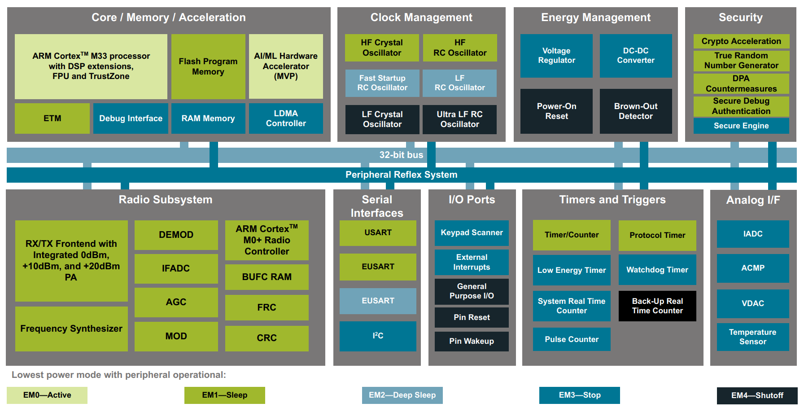  
</div>  
<div align="center">
  <b>图 1.1. EFR32xG24 SoC 系统框图</b>
</div>  
</br>  

**ARM® Cortex®-M33**   
* 78 MHz (FPU and DSP)   
* TrustZone®   
* 高达1536kB 的片上Flash   
* 高达256kB 的片上RAM   

**高性能Radio**   
* 高达 +19.5 dBm 发射功率   
* -97.6 dBm RX @ BLE 1 Mbps   
* -105.7 dBm RX @ BLE 125 kbps   
* -105.4 dBm RX @ 15.4   
* Wi-Fi 共存   
* RX 天线分集   

Silicon Labs EFR32xG24 拥有高达 +19.5 dBm 的输出功率，和行业领先的接收灵敏度。   
Silicon Labs 的managed Wi-Fi coexistence支持单线、两线和三线 PTA实现。并且可以协调蓝牙、802.15.4 和 Wi-Fi间的2.4 GHz射频资源。   

**低系统功耗**
* 5.0 mA 发射电流 @ 0 dBm   
* 19.1 mA 发射电流 @ +10 dBm   
* 4.4 mA 接收电流 (BLE 1 Mbps)   
* 5.1 mA 接收电流 (250 kbps 802.15.4)   
* 33.4 µA/MHz   
* 1.3 µA EM2，具有 16 kB RAM 和完整的 Radio RAM 保留，RTC 从 LFXO 或 LFRCO 运行   

得益于Silicon Labs在IoT产品功耗方面的优势，EFR32xG24非常适合对系统功耗要求极高的产品。它提供有行业领先的功耗性能，在10 dBm发射功率下，发射电流仅为19.1 mA，在1 Mbps GFSK接收状态下，电流消耗为4.4 mA。与功耗仅为1.3uA的EM2状态相结合，可在有效降低系统功耗，延长电池寿命。   

**专用安全内核**   
* Secure Vault™ - 中/高

Silicon Labs EFR32xG24 SoC 提供具有行业领先安全功能的无线物联网连接，包括 Arm TrustZone 和 PSA Level 3的认证。依据不同的芯片型号及 Secure Element的实现，EFR32xG24 支持不同的 Secure Vault 级别。请参阅数据手册了解更多信息。   

**人工智能/机器学习**   
* AI/ML 硬件加速器 (MVP)   

矩阵向量处理器 (MVP) 旨在从主处理器分担计算密集型数据处理运算，特别是复杂的矩阵浮点乘法和加法运算。同时，MVP 硬件支持到达角 (AoA)中的MUSIC（MUltiple SIgnal Classification）算法计算的加速，以及机器学习 (ML) 或线性代数等其他复杂计算加速。   

**低功耗外设**   
* EUSART, USART, I2C   
* 20-bit ADC, 12-bit VDAC, ACMP   
* 精度为+/- 1.5°C 温度传感器   
* 时钟精度达到500ppm的32kHz PLFRCO   

EFR32xG24 SoC上包含有完整的数字及高性能的模拟外设，可以使用该SoC来开发完整的IoT应用程序。   
EFR32xG24 提供有高精度 ADC，特定的器件可以支持20 位高精度模式（16 位 ENOB）。无需外部ADC，即可对微弱信号进行精准测量。此功能非常适合用于需要测量人体生命体征信号的医疗应用。   
在精准模式下，SoC所集成的低频 (32.768 kHz) RC 振荡器（LFRCO），使硬件能够在温度变化时根据 HFXO 晶体频率定期重新校准，以提供精度为 +/-500 ppm 的32.768 kHz时钟源。   

## 1.3 蓝牙产品组合
无论你是为智能家居、医疗应用还是工业应用开发物联网产品，Silicon Labs都拥有最为完整的蓝牙产品组合之一。我们丰富的蓝牙SoC和模组，再加上大量的开发工具，为强大、可靠和安全的蓝牙连接应用开发提供了一站式资源。   
<div align="center">
  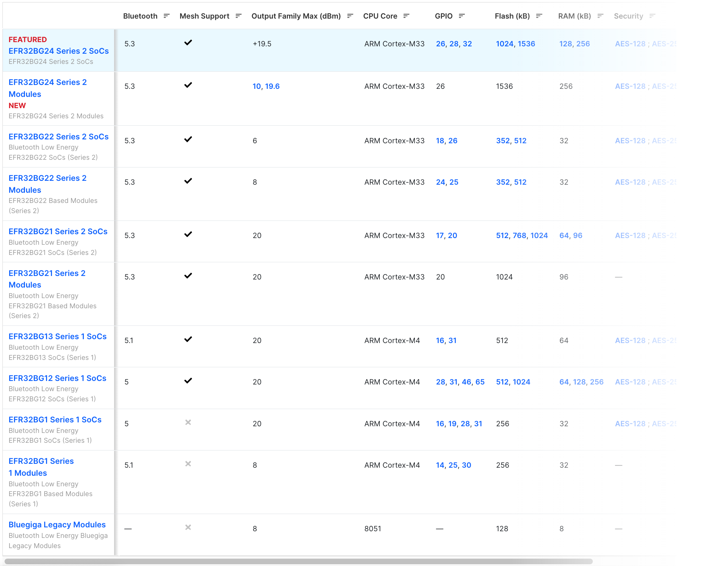  
</div>  
<div align="center">
  <b>图 1.2 Silicon Labs 低功耗蓝牙和蓝牙网状网络产品</b>
</div>  
</br>  


# 2. Simplicity Studio v5介绍
Simplicity Studio 是适用于Silicon Labs所有IoT技术、SoC和模组的统一开发环境。它使你能够快速访问IoT产品的所有文档和SDK资源、软件和硬件配置工具，以及符合行业标准的代码编辑器、编译器和调试器的集成开发环境 (IDE)。使用 Simplicity Studio，你还可以获得一整套用于无线网络分析和系统能耗分析的高级工具。   
Simplicity Studio 免费为无线物联网开发人员提供最先进的开发工具集。    

**Energy Profiler**   
开发节能无线应用程序——逐行优化代码以实现低功耗。   
<div align="center">
    
</div>   
<div align="center">
  <b>图 2.1. Energy Profiler</b>
</div>  
</br>  

**Network Analyzer**   
加速无线网络故障排除——捕获系统中所传输的无线数据，并以用户可读的格式对其进行分析。   
<div align="center">
  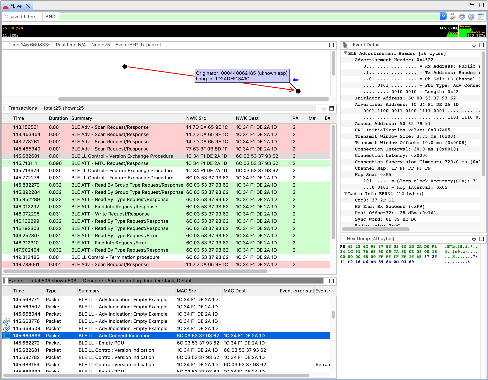  
</div>   
<div align="center">
  <b>图 2.2. Network Analyzer</b>
</div>  
</br>  

**Simplicity Commander**   
可用于加密、烧录、签名和创建固件以及许多其他用途的重要工具。   
<div align="center">
    
</div>   
<div align="center">
  <b>图 2.3. Simplicity Commander</b>
</div>  
</br>  

**Bluetooth GATT Configurator**   
为蓝牙应用创建和配置 GATT数据库。可在不同项目之间进行导入或导出数据库。同时，EFR Connect移动应用程序上也可以使用该数据库。  
<div align="center">
    
</div>   
<div align="center">
  <b>图 2.4. Bluetooth GATT Configurator</b>
</div>  
</br>  

**Bluetooth Mesh Configurator**   
为Bluetooth Mesh应用配置网络节点参数和model，并可以在不同项目之间导出和导入蓝牙mesh配置。   
<div align="center">
  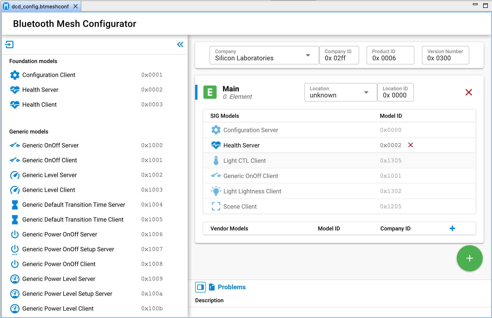  
</div>   
<div align="center">
  <b>图 2.5. Bluetooth Mesh Configurator</b>
</div>  
</br>  

**Radio Configurator**   
为proprietary应用程序配置无线电PHY参数。这使得用户可以完全自定义调制解调器，定义数据包前导码、同步字和其他选项，以满足他们的系统需求。   
<div align="center">
    
</div>   
<div align="center">
  <b>图 2.6. Radio Configurator</b>
</div>  
</br>  

**Bluetooth NCP Commander**   
用于控制 NCP target的图形化用户界面。你可以执行最常见的 BLE 功能（例如广播、扫描、连接、DTM 测试等）。同时，这也是一个可用于组建和配置蓝牙Mesh网络的工具。   
<div align="center">
    
</div>   
<div align="center">
  <b>图 2.7. Bluetooth NCP Commander</b>
</div>  
</br>  

**Direction Finding Toolsuite**   
一套可视化的工具，可用于设置蓝牙定位系统。使用此工具集，你可以轻松构建和配置多定位器系统，系统将实时的报告tag的位置信息，以帮助你更快地启动和评估蓝牙测向解决方案。   

# 3. 使用SSv5进行蓝牙应用开发
为了改善开发者体验，Silicon Labs重新设计了Simplicity Studio的底层框架以及Gecko SDK开发套件的架构。Simplicity Studio 5中的所有项目现在都构建在基于组件的Gecko平台上。Simplicity Studio 5包含有项目配置工具，它可提供非常方便的软件组件管理、组件的可配置性和组件间的依赖性管理。   

基于蓝牙SDK v3.0或更高版本中的蓝牙应用程序也具有这个新的软件架构，在新的SDK上，我们更新了蓝牙的API，并且完全重新设计了GATT 配置器。此外，现在可以在单独的头文件中对协议栈进行配置，并且可以使用组件编辑器将平台组件添加到项目中，而不需要手动复制和包含任何文件。借助于SSv5和最新的GSDK中基于组件的项目配置功能，将有效简化并缩短蓝牙开发流程。   

在以下部分中，将展示如何使用EFR32BG24 Explorer Kit来创建新的蓝牙项目，并使用基于组件的配置器配置协议栈。然后将演示如何安装“iBeacon”组件来扩展示例项目的功能。   

## 3.1. 前提条件
为了完成这部分，你需要提前准备：   

### 3.1.1. 硬件
EFR32xG24 Explorer Kit (EK2703A)   
USB Type-C 线缆   
WSTK BRD4001A 或 WSTK PRO BRD4002A（可选：使用Simplicity Studio中的energy profiler进行功耗分析）   

### 3.1.2. 软件
Simplicity Studio v5   
Gecko SDK Suite 4.1.1 或更高版本   

## 3.2. 创建和配置蓝牙项目

### 3.2.1. 创建一个SoC-Empty蓝牙项目
从零开始来开发蓝牙应用程序非常困难，因此在蓝牙SDK中附带了许多涵盖最常见用例的演示项目和示例代码。在蓝牙应用程序开发中，最常用的参考示例是 SoC-Empty，本节将向你展示如何来使用示例应用程序创建蓝牙项目。   

你可以从 Launcher Perspective中的不同位置来开始一个项目，我们建议从 File 菜单开始。   

1. 使用 USB 线缆将 EFR32xG24 Explorer Kit连接到你的计算机。   
2. 启动 Simplicity Studio v5 IDE。   
3. 选择File >> New >> Silicon Labs Project Wizard。   
4. 检查你的 SDK、IDE/toolchain，确保正确选择后单击“下一步”。   

<div align="center">
  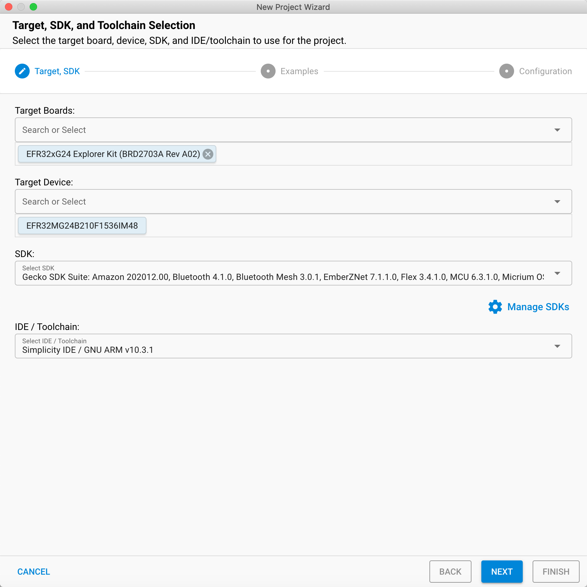   
</div>  
<div align="center">
  <b>图 3.1. 创建蓝牙项目 </b>
</div>  
</br>  

5. 在示例项目选择对话框中，过滤 Bluetooth 并选择 SoC-Empty，点击NEXT   
<div align="center">
  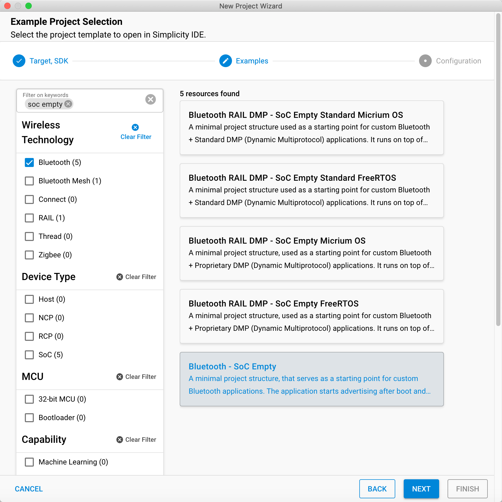   
</div>  
<div align="center">
  <b>图 3.2. 创建SoC-Empty项目 </b>
</div>  
</br>  

6. 根据项目需要，重命名你的项目，并选择你希望通过链接到 SDK 还是将SDK内容全部复制到你的项目中。单击完成。   
<div align="center">
  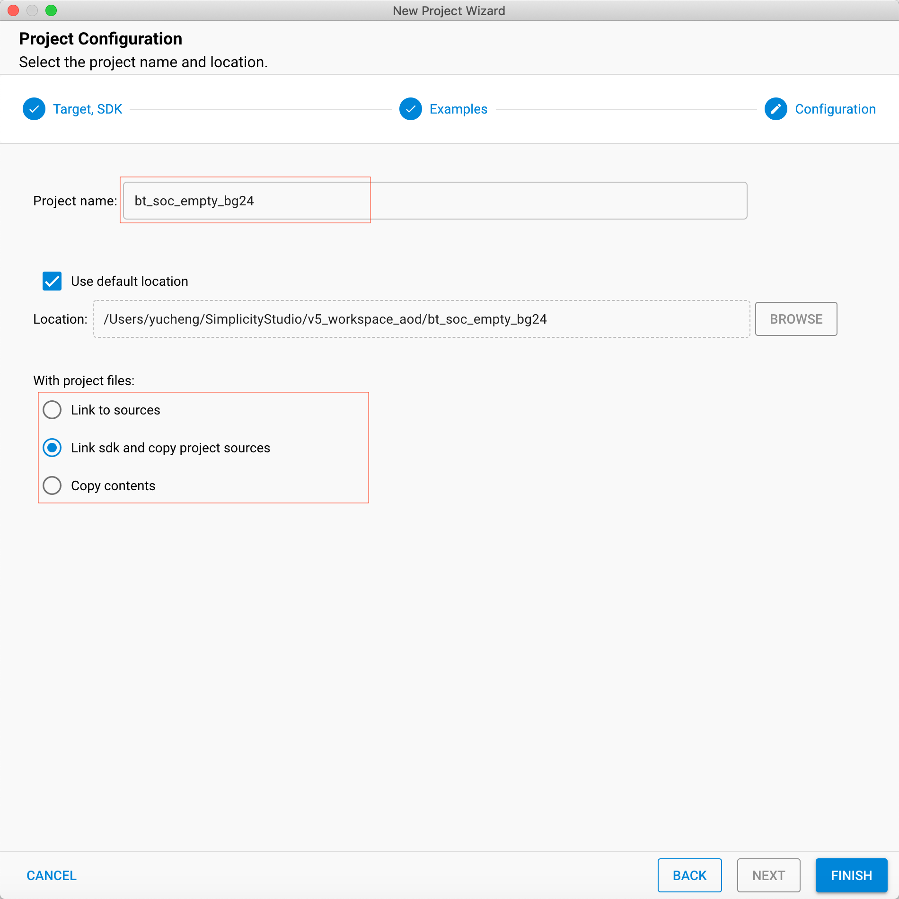   
</div>  
<div align="center">
  <b>图 3.3. 重命名项目 </b>
</div>  
</br>  

创建项目后，项目会自动打开readme选项卡。其他两个选项卡“GATT Configurator”和“Project Configurator”也会同时打开。   
<div align="center">
  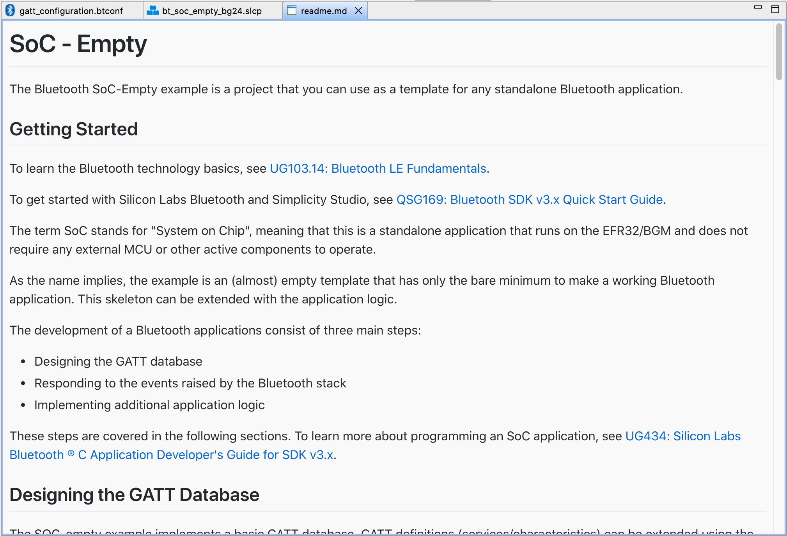   
</div>  
<div align="center">
  <b>图 3.4. 项目的Readme文件 </b>
</div>  
</br>  

切换到 GATT Configurator。GATT Configurator 是一个简单易用的工具，可帮助你构建自己的 GATT 数据库，并在保存时自动将数据库结构转换为 C 代码。   
例如，可以尝试将设备名称从默认的“Empty Example”修改为任何值，但是，请确保所设置的值长度与实际的设备名称长度相符合。   

<div align="center">
  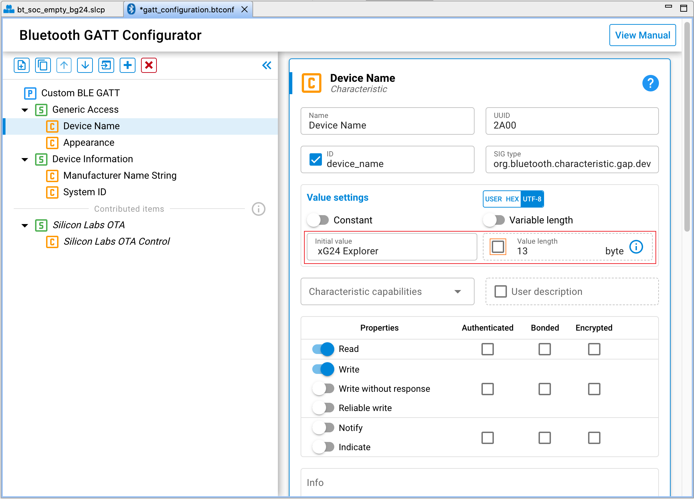   
</div>  
<div align="center">
  <b>图 3.5. 配置项目 </b>
</div>  
</br>  

要编译你的项目，请单击 Simplicity IDE 上的编译按钮（锤子图标），它将编译项目并在项目文件夹中生成烧录文件。右键单击烧录文件并单击“Flash to Device”以将其烧录至设备中。   
<div align="center">
     
</div>  
<div align="center">
  <b>图 3.6. 编译并烧录至设备 </b>
</div>  
</br>  

将应用程序烧录至你的设备后，你可以使用手机端的EFR Connect移动应用程序来扫描并找到蓝牙广播信号。   
启动EFR Connect，点击Develop选项卡，然后点击蓝牙浏览器。按RSSI降序对扫描的设备进行排序，你将能够轻松找到设备。点击设备可获取其所提供的更多数据信息。   
<div align="center">
  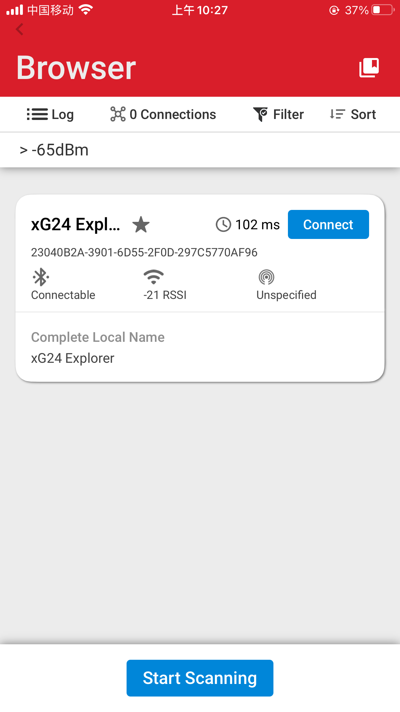   
</div>  
<div align="center">
  <b>图 3.7. 使用EFR Connect扫描设备 </b>
</div>  
</br>  

注意：从蓝牙 SDK 版本 2.7.0.0 开始，所有设备都必须加载 Gecko Bootloader 以使得应用程序可以正确运行。当你开始时，最简单的方法是烧录SDK中所包含的预编译的演示固件，这些演示固件中已经包含了Bootloader程序。当你重新烧录所编译的应用程序时，它会覆盖掉原有的演示固件，但Bootloader仍然存在。随后，你也可以构建自己的Bootloader程序，如[UG266: Silicon Labs Gecko Bootloader User’s Guide](https://www.silabs.com/documents/public/user-guides/ug266-gecko-bootloader-user-guide.pdf) （适用于 GSDK 3.2 及更低版本）或[UG489: Silicon Labs Gecko Bootloader User’s Guide](https://www.silabs.com/documents/public/user-guides/ug489-gecko-bootloader-user-guide-gsdk-4.pdf) （适用于 GSDK 4.0 及更高版本）中所述.   

## 3.3. Component 安装
如前面章节所述，从蓝牙 SDK v3.x 开始，所有的蓝牙应用项目都是基于Gecko Platform组件化的架构。用户可以通过 Simplicity Studio 的组件编辑器快速安装和配置软件特性和功能。组件安装过程中，Simplicity Studio将会自动完成如下操作：   

1. 将对应的 SDK 文件从 SDK 文件夹复制到项目文件夹中。   
2. 将指定组件的所有依赖项复制到项目文件夹中。   
3. 将新的所包含目录添加到项目设置中。   
4. 将配置文件复制到 /config 文件夹中。   
5. 修改相应的自动生成文件，以将组件集成到应用程序中。   

本节演示如何扩展设备功能以广播 iBeacon。iBeacon是Simplicity Studio的组件编辑器中可用的组件，可以完全集成到蓝牙应用程序中以自动执行特定的事件处理程序，而无需任何额外的代码。   

要查看组件库，请单击项目的 .slcp 选项卡，然后单击Software Components。许多过滤器和关键字搜索可帮助你快速找到各种所需的组件。点击Bluetooth >> Application >> iBeacon >> Install，iBeacon组件将被安装，所有相关的源文件将自动添加到项目中。   

<div align="center">
     
</div>  
<div align="center">
  <b>图 3.8. 安装iBeacon组件 </b>
</div>  
</br>  

编译应用程序将并将其烧录至设备，使用EFR Connect你将能够同时扫描到legacy广播及iBeacon。   
<div align="center">
     
</div>  
<div align="center">
  <b>图 3.9. 扫描iBeacon </b>
</div>  
</br> 

EFR32xG24 Explorer Kit包括一个 mikroBUS™ 插座和 Qwiic® 连接器，因此用户可以使用来自 mikroE、sparkfun、AdaFruit 和 Seeed Studios 的大量现成的扩展板为套件添加新的功能。mikroBUS 插座允许插入通过 SPI、UART 或 I2C 与 EFR32BG24 所连接的 mikroBUS 扩展板进行通讯。Qwiic 连接器可用于通过I2C连接来自 Qwiic Connect System 的硬件。   
Simplicity Studio v5以及最新的Gecko SDK提供了丰富的外设驱动组件（例如 I2CSPM、SPIDRV、UARTDRV），可以简化驱动外部组件的开发过程，以提高用户的开发效率。   

# 4. 多设备Energy Profiler
多设备Energy Profiler是一个附加工具，你可以使用它实时测量设备在运行过程中的能耗。可以轻松找到峰值和平均电流消耗，并检测睡眠模式下的电流消耗。   

需要注意的是，Dev Kit（例如 xG24-DK2601B）或 Explorer Kit（例如 xG24-EK2703A）并不支持能量分析，因为它们没有 AEM（高级能量监视器）电路，所以如果你想使用Energy profiler来对Dev Kit、Explorer Kit或用户设计板进行能量监测，则需要借助于额外的无线入门套件 (WSTK)主板，并将其设置为“DEBUG MODE: OUT”模式，为测试设备供电以进行电流测量。它们之间的连接器在[AN958: Debugging and Programming Interfaces for Custom Designs](https://www.silabs.com/documents/public/application-notes/an958-mcu-stk-wstk-guide.pdf)中有详细说明，下图所示的 Mini Simplicity 10 针连接器可用于所有EFM32或EFR32开发板与被测板的连接。   

<div align="center">
  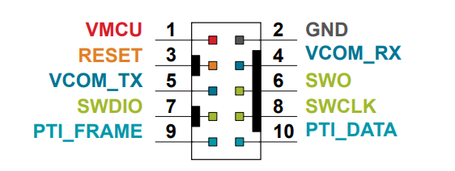  
</div>  
<div align="center">
  <b>Figure 4‑1 10 Pin Mini Simplicity Connector Pin-Out</b>
</div>  
</br>  

如AN958中所述，使用 Silicon Labs调试适配器板 (BRD8010A) 是通过Mini Simplicity 10针连接器与Silicon Labs STK 或 WSTK 开发套件连接的最简单方式。   

<div align="center">
  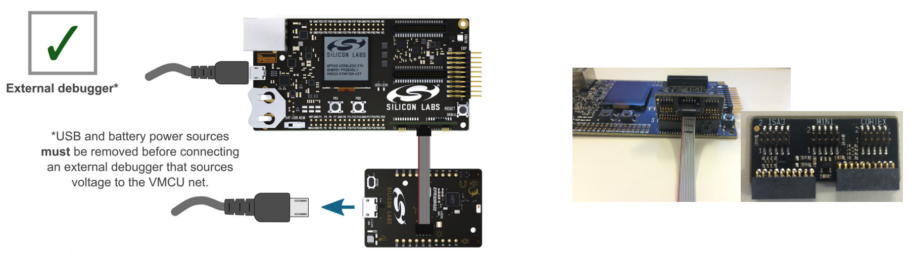  
</div>  
<div align="center">
  <b>Figure 4‑2 与BRD4001A相连</b>
</div>  
</br>  

使用WSTK 主板 (BRD4001A) 时，需使用调试适配器板BRD8010A来使用Mini Simplicity连接器。如果使用 Wireless Pro Kit 主板 (BRD4002A)，请直接使用主板上的 Mini Simplicity 连接器。Wireless Pro Kit主板是Wireless Starter Kit主板的升级版本，它具有一些改进和附加功能，包括增加了AEM的测量范围和采样率、可变VMCU电压控制、操纵杆和 Mini Simplicity 连接器等。    

<div align="center">
    
</div>  
<div align="center">
  <b>Figure 4‑3 与BRD4002A相连</b>
</div>  
</br>  

注意：EFR32BG24的SDK中示例应用程序默认启用了EM2 调试功能（请参阅 init_mcu.c），它会增加了电流消耗开销，因此实际测量值会比datasheet中的电流数值稍高。你可以在“Device Init: EMU”组件中禁用 EM2 中的调试连接。

要对当前项目进行能耗分析，请单击菜单栏中的“Tools”并选择“Energy Profiler”或右键单击项目资源管理器视图中的 .slcp 文件并选择“Profile As >> Simplicity Energy Profiler Target”。这会自动编译你的项目，将其烧录至设备，然后启动 Energy Profiler，并切换到Energy Profiler视图。

以 SoC-iBeacon 项目为例，根据 SoC-iBeacon 应用程序的默认设置，Series 2 EFR32BG24 设备将使用DC-DC, 它每 100 ms 以 0 dBm TX 发射功率广播一个iBeacon，帧为 46 个八位字节.   
下图显示了 913.08s 测量周期的平均电流消耗，你也可以通过单击并拖动鼠标来测量任何选定范围内的平均功耗。一旦选择了一个范围，就会显示一个浅灰色部分，该部分显示了所选区域的能量统计信息。   
下面的黄色范围说明了我们在 EM2 模式下测量的电流消耗为 2.9uA。   
注意：当前设备在EM2下，256 kB RAM 和完整的 Radio RAM中的所有内容将会保留，同时运行LFXO作为RTC的时钟源。   

<div align="center">
    
</div>  
<div align="center">
  <b>Figure 4‑4 xG24运行SoC-iBeacon程序的功耗分析 </b>
</div>  
</br>  

# 5. 网络分析仪
Silicon Labs 网络分析仪是一种免费的数据包捕获和调试工具，可用于调试各种短距离无线协议，如低功耗蓝牙、Zigbee、Proprietary等。

有了它，用户可以通过被称为数据包跟踪接口 (PTI) 的专用串行硬件接口来访问无线电收发器的数据缓冲区。PTI 是一个接口，可以直接访问无线电发射器/接收器帧控制器的串行数据，然后可以通过 USB 或以太网将 PTI 数据传输到运行 Simplicity Studio 的计算机。最后，网络分析仪可以结合时间戳信息对网络数据进行分析和显示。 

<div align="center">
  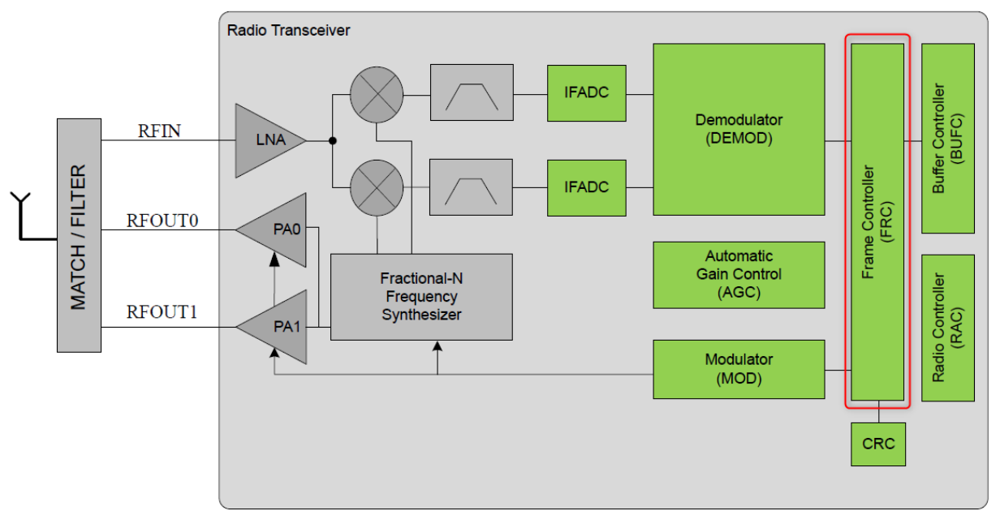  
</div>  
<div align="center">
  <b>图 5.1. PTI接口 </b>
</div>  
</br>  

Network Analyzer 通过图形化的界面来查看网络通讯数据、事件所持续时间等，可以显著地加快IoT无线应用程序的开发过程。

大多数 Silicon Labs 的开发套件，例如无线入门套件 (WSTK)、开发套件 (DK) 和Explorer Kit (EK)，都嵌入了 PTI 并可随时使用。如果在用户板上，PTI引脚已经通过调试接口连接至Silicon Labs 开发板，你同样可以使用网络分析仪来对其网络通讯进行分析。   

## 5.1. 抓取蓝牙数据包
Network Analyzer 可以从连接的适配器捕获数据，并支持实时或离线分析显示所抓取的网络通讯数据。

以下过程描述了如何在设备上启动网络分析仪来捕获数据：

1. 在 Preferences > Simplicity Studio > SDKs 中选择所需的 SDK。
2. 在 Preferences > Network Analyzer > Decoding > Stack Version 中，确保在解码首选项中添加了“Bluetooth Low Energy”。你也可以选择“auto-detecting decoder stack”，网络分析仪将自动捕获和解码不同协议栈的数据。
3. 连接到适配器
<div align="center">
    
</div>  
<div align="center">
  <b>图 5.2. 连接适配器 </b>
</div>  
</br>  

4. 开始捕获
<div align="center">
  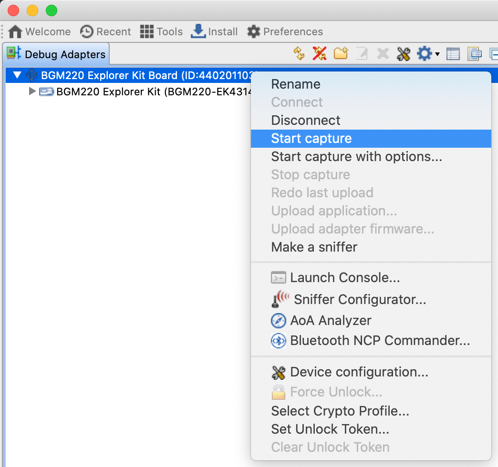  
</div>  
<div align="center">
  <b>图 5.3. 开始抓取网络数据 </b>
</div>  
</br>  

5. BLE网络数据将在实时会话中显示
<div align="center">
    
</div>  
<div align="center">
  <b>图 5.4. 网络数据 </b>
</div>  
</br>  

**Bookmarks**   
书签可用于标记事件，它对于在巨大的网络数据文件中快速指向某个事件非常有用。你可以选择要添加书签的任何事件或事务，然后右键单击它并单击“Add bookmark...”，输入书签名称。
<div align="center">
  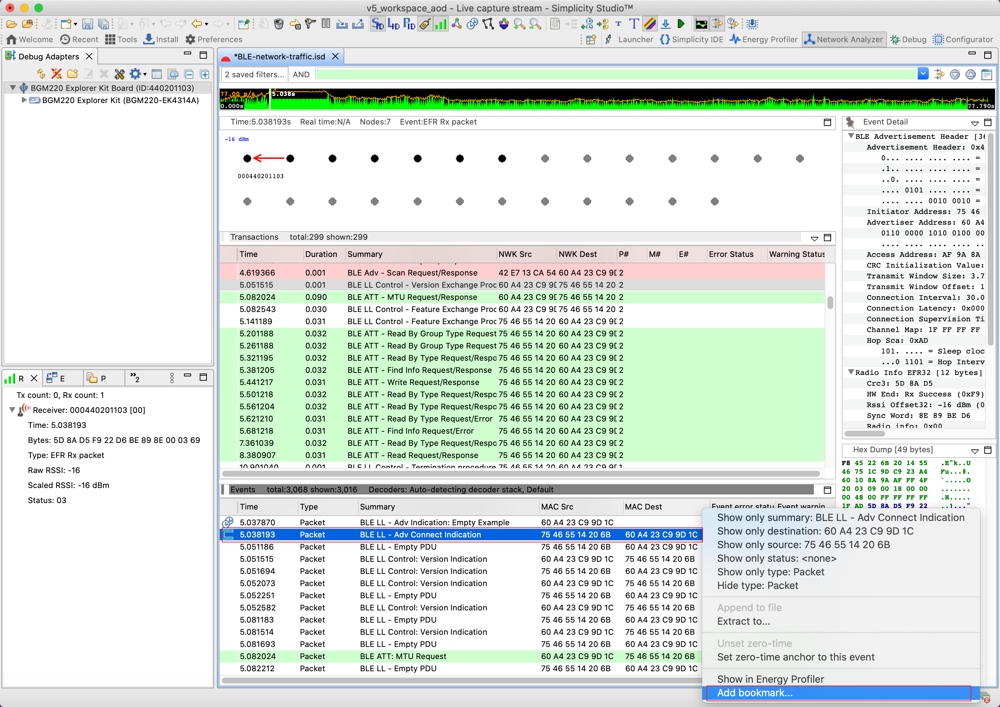  
</div>  
<div align="center">
  <b>图 5.5. 添加书签 </b>
</div>  
</br>  

**Set Zero-Time Anchor**   
时间戳是分析特定事件或事务时非常重要的信息，网络分析仪可以灵活的设置零时间锚点，它可以有效的帮助验证例如广播或连接时序（广告间隔、连接间隔等）。

选择特定事务或事件，右键单击以打开菜单，然后单击Set zero-time event anchor to this event。
<div align="center">
  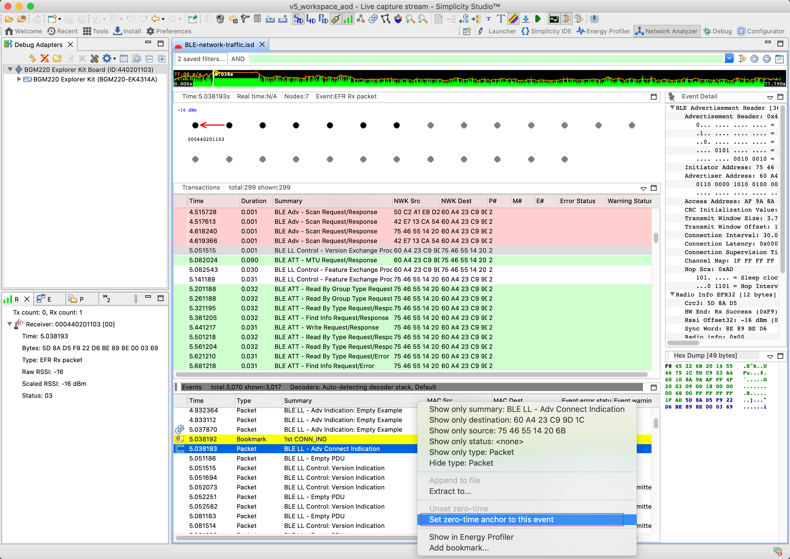  
</div>  
<div align="center">
  <b>图 5.6. 设定零时间点 </b>
</div>  
</br>  

**Filters**   
网络分析仪将监控EFR32所接收/传输的所有数据包，因此用户需要使用过滤器来过滤他们感兴趣的事务和事件。   
网络分析器支持使用内置或手动设置过滤器。对于手动过滤器，可以使用逻辑表达式组合多个过滤器：   
• && - 与运算符
• || – 或运算符
或者，也可以使用以下条件对单个过滤器进行操作：
• == - Equals
• != - Not equal
• |= - Contains

以下示例说明如何过滤 BLE 主设备“75 46 55 14 20 6B”和从设备“60 A4 23 C9 9D 1C”之间的事务。   
```(transaction.source == "60 A4 23 C9 9D 1C" && transaction.dest == "75 46 55 14 20 6B") || (transaction.dest == "60 A4 23 C9 9D 1C" && transaction.source == "75 46 55 14 20 6B")```   

<div align="center">
    
</div>  
<div align="center">
  <b>图 5.7. 添加过滤器 </b>
</div>  
</br>  

## 5.2. 分析蓝牙网络数据
本节介绍如何分析所捕获的低功耗蓝牙网络数据

### 5.2.1. 建立连接的消息序列图
以发起连接过程为例，主设备可以发起与广播设备的连接。下图是成功建立连接的消息序列，并在连接建立之后，两个设备间相互发送应用程序数据。(BLUETOOTH CORE SPECIFICATION Version 5.2 | Vol 6, Part D, 5.1 INITIATING A CONNECTION)   

<div align="center">
    
</div>  
<div align="center">
  <b>图 5.8. 建立连接的消息序列图 </b>
</div>  
</br> 

在时序图中，设备B正在发送广播包，设备 A 正在扫描以查找广播设备。连接发起方可以发送连接请求（CONNECT_IND PDU）来请求链路层进入连接状态。   
<div align="center">
    
</div>  
<div align="center">
  <b>图 5.9. 发送 CONNECT_IND </b>
</div>  
</br>  

如果广播设备从其所允许的连接发起方接收到包含其设备地址的 CONNECT_IND PDU，则链路层应退出广播状态并转换到peripheral角色中的连接状态。
如下图所示，在所抓取的网络数据中，连接发起方“75 46 55 14 20 6B”将 CONNECT_IND PDU 发送给广播设备“60 A4 23 C9 9D 1C”。

<div align="center">
  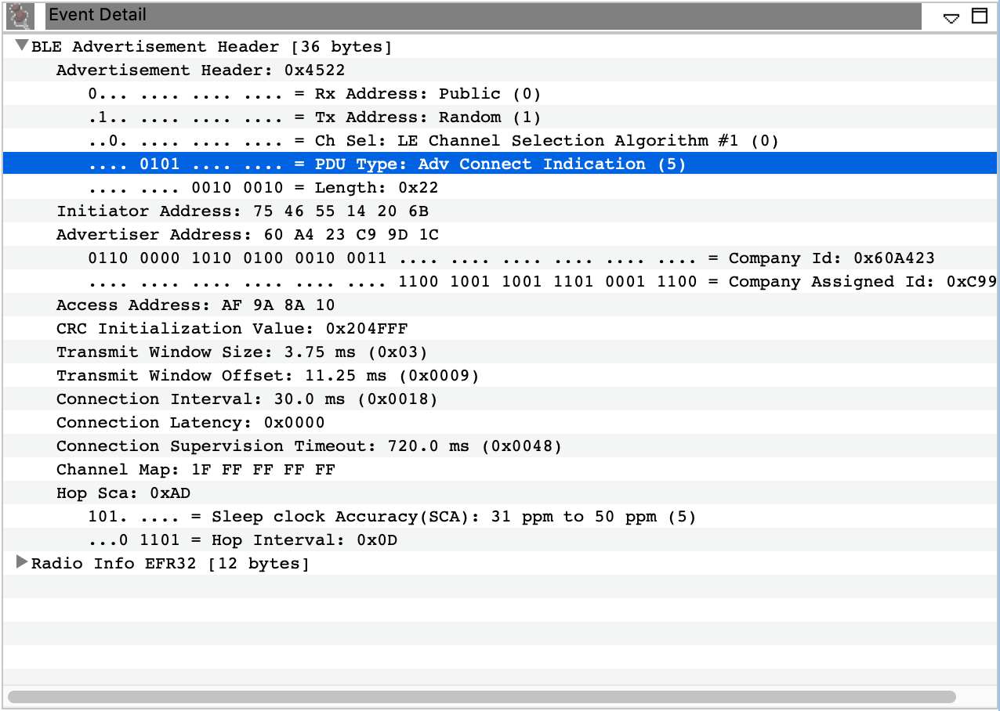  
</div>  
<div align="center">
  <b>图 5.10. CONNECT_IND 数据包 </b>
</div>  
</br>  

连接发起方在主广播信道上发送CONNECT_IND PDU后，其链路层将处于Connection状态。主机应在发送窗口内开始发送第一个数据包。广播设备在主广播信道上收到一个 CONNECT_IND PDU 后，其链路层也将处于 Connection 状态。从设备将开始侦听传输窗口内的第一个数据包。   

在进入连接状态之后，将交换链路层参数信息，例如版本信息等（companyID、subVerNum、linkLayerVer）。主设备或从设备的链路层都可以通过发送 LL_VERSION_IND PDU 来启动此过程。如果链路层接收到 LL_VERSION_IND PDU 并且尚未发送 LL_VERSION_IND，则链路层应向对端设备发送 LL_VERSION_IND PDU。   
当从对端设备接收到 LL_VERSION_IND PDU 时，该过程完成。   
<div align="center">
    
</div>  
<div align="center">
  <b>图 5.11. 发送 LL_VERSION_IND </b>
</div>  
</br>  

LL_VERSION_IND CtrData 由三个字段组成：
<div align="center">
  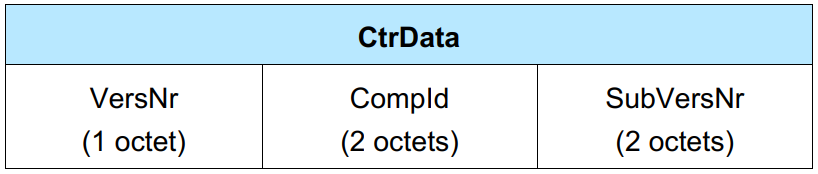  
</div>  
<div align="center">
  <b>图 5.12. LL_VERSION_IND 数据包</b>
</div>  
</br>  

* VersNr 字段应包含蓝牙链路层规范的版本 (参见 [Assigned Numbers](https://www.bluetooth.com/specifications/assigned-numbers/) ). 在EFR32xG24上使用Silicon Labs蓝牙 SDK v3.2.x 或更高版本，可支持蓝牙 5.3，因此版本为 0x0C。   
<div align="center">
    
</div>  
<div align="center">
  <b>图 5.13. Bluetooth Core Specification 版本 </b>
</div>  
</br>  

* CompId 字段应包含蓝牙控制器制造商的公司标识符。   
<div align="center">
    
</div>  
<div align="center">
  <b>图 5.14. 公司标识符 </b>
</div>  
</br>  

* SubVersNr 字段应包含蓝牙控制器的唯一标识符。   

<div align="center">
    
</div>  
<div align="center">
  <b>图 5.15. 蓝牙控制器标识符 </b>
</div>  
</br>  

# 6. 附录
[Simplicity Studio® 5 User's Guide](https://docs.silabs.com/simplicity-studio-5-users-guide/latest/ss-5-users-guide-overview/)   
[QSG169: Bluetooth® Quick-Start Guide for SDK v3.x and Higher](https://www.silabs.com/documents/public/quick-start-guides/qsg169-bluetooth-sdk-v3x-quick-start-guide.pdf)   
[UG533: EFR32xG24 Explorer Kit User's Guide](https://www.silabs.com/documents/public/user-guides/ug533-xg24-ek2703a.pdf)   
[AN1317: Using Network Analyzer with Bluetooth® Low Energy and Mesh](https://www.silabs.com/documents/public/application-notes/an1317-network-analyzer-with-bluetooth-mesh-le.pdf)   
[Managing Coexistence Between Wi-Fi, Zigbee, Thread, and Bluetooth](https://www.silabs.com/wireless/wi-fi/wi-fi-coexistence)   