English | [中文](EFR32xG24-Product-Introduction-and-Bluetooth-Development-Start-Guide-cn.md) 

<details>
<summary><font size=5>Table of Contents</font> </summary>

- [1. Silicon Labs EFR32xG24 Product Introduction](#1-silicon-labs-efr32xg24-product-introduction)
  - [1.1. Product Overview](#11-product-overview)
  - [1.2. Product Highlights](#12-product-highlights)
  - [1.3 Bluetooth portfolio](#13-bluetooth-portfolio)
- [2. Simplicity Studio v5](#2-simplicity-studio-v5)
- [3. Bluetooth application development with SSv5](#3-bluetooth-application-development-with-ssv5)
  - [3.1. Prerequisites](#31-prerequisites)
    - [3.1.1. Hardware](#311-hardware)
    - [3.1.2. Software](#312-software)
  - [3.2. Creating and Configuring a Bluetooth Project](#32-creating-and-configuring-a-bluetooth-project)
    - [3.2.1. Create an SoC-Empty Bluetooth Project](#321-create-an-soc-empty-bluetooth-project)
  - [3.3. Component Installation](#33-component-installation)
- [4. Multi-Node Energy Profiler](#4-multi-node-energy-profiler)
- [5. Network analyzer](#5-network-analyzer)
  - [5.1. Capture Bluetooth LE Packets](#51-capture-bluetooth-le-packets)
  - [5.2. Analyze Bluetooth LE network traffic](#52-analyze-bluetooth-le-network-traffic)
    - [5.2.1. Message Sequence Charts of Initiating a Connection](#521-message-sequence-charts-of-initiating-a-connection)
- [6. Appendix](#6-appendix)

</details>

*** 

# 1. Silicon Labs EFR32xG24 Product Introduction
## 1.1. Product Overview
Silicon Labs EFR32xG24 is the world’s first wireless IoT SoC with a built-in AI/ML hardware accelerator for smart homes, medical devices, industrial applications, and building automation. The new Silicon Labs EFR32xG24 features ultimate energy-efficiency and wireless performance with PSA Certification Level 3 security. With key features like high performance 2.4 GHz RF, low current consumption, an AI/ML hardware accelerator and Secure Vault, IoT device makers can create smart, robust, and energy-efficient products that are secure from remote and local cyber-attacks. A Cortex®-M33 running up to 78.0 MHz and up to 1536 kB of Flash and 256 kB of RAM provides maximum resources for software, designs, protocols, and peripherals while leaving room for growth.   

The EFR32xG24 Wireless Gecko family of SoCs enables secure, energy-friendly multiprotocol wireless networking for IoT devices. The single-die solution combines a 78 MHz ARM Cortex-M33 processor, high-performance 2.4 GHz radio, and AI/ML hardware accelerator for processing machine learning algorithms up to 10x faster consuming significantly less power, while offloading the Cortex M33 so applications have more cycles to do other work. EFR32xG24 supports a broad range of 2.4 GHz wireless IoT protocols including Proprietary, Bluetooth Low Energy and Bluetooth mesh (EFR32BG24 and EFR32MG24) as well as Zigbee, OpenThread, Matter and Multiprotocol (EFR32MG24).   
The EFR32xG24 SoCs incorporates the PSA Level 3 Certified Secure Vault. Secure Vault provides a dedicated security engine that provides advanced security features including an advanced hardware crypto, Secure Boot with RTSL, Tamper Detect and Secure Key Management. The EFR32xG24 SoCs can be ordered with customized security capabilities using the Silicon Labs Custom Part Manufacturing Service (CPMS).    

The EFR32BG24 Wireless SoC is an ideal solution for BLE IoT wireless connectivity for smart home, lighting and portable medical devices.   

## 1.2. Product Highlights
The EFR32 Wireless Gecko is a highly integrated, configurable and low power wireless System-onChip (SoC) with a robust set of MCU and radio peripherals. Below is the block diagram for the EFR32xG24 System-On-Chip series.   
<div align="center">
  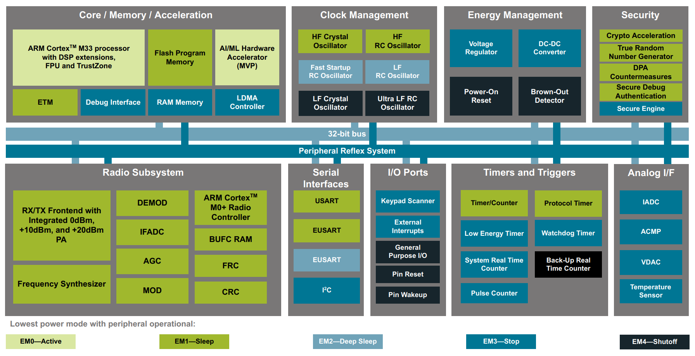  
</div>  
<div align="center">
  <b>Figure 1.1. EFR32xG24 System-On-Chip Block Diagram</b>
</div>  
</br>  

**ARM® Cortex®-M33**   
* 78 MHz (FPU and DSP)   
* TrustZone®   
* Up to 1536kB of Flash   
* Up to 256kB of RAM   

**High Performance Radio**   
* Up to +19.5 dBm TX   
* -97.6 dBm RX @ BLE 1 Mbps   
* -105.7 dBm RX @ BLE 125 kbps   
* -105.4 dBm RX @ 15.4   
* Wi-Fi Coexistence   
* RX Antenna Diversity   

Silicon Labs EFR32xG24 features the best RF performance with output power of up to +19.5 dBm and world-leading receive sensitivity.   
Silicon Labs’ managed Wi-Fi coexistence supports one, two, and three wire PTA implementations and can coordinate 2.4 GHz RF traffic for co-located Bluetooth, 802.15.4, and Wi-Fi radios.   

**Low Power**
* 5.0 mA TX @ 0 dBm   
* 19.1 mA TX @ +10 dBm   
* 4.4 mA RX (BLE 1 Mbps)   
* 5.1 mA RX (250 kbps 802.15.4)   
* 33.4 µA/MHz   
* 1.3 µA EM2 with 16 kB RAM and full Radio RAM retention, RTC running from LFXO or LFRCO   

Building upon a Silicon Labs strength, the EFR32xG24 is ideally suited for low power performance, offering industry leading active currents including 19.1 mA transmit current @10 dBm and 4.4 mA receive current for 1 Mbps GFSK. The low active current combined with the 1.3μA for EM2 offers power savings over the competition, increasing battery life.   

**Dedicated Security Core**   
* Secure Vault™ - Mid / High   

Silicon Labs EFR32xG24 SoCs provide wireless IoT connectivity with industry-leading security capabilities including Arm TrustZone and PSA Certification Level 3. Depending on the part and SE implementation, EFR32xG24 supports different Secure Vault levels. Please refer to the datasheet for more information.   

**AI/ML**   
* AI/ML Hardware Accelerator (MVP).   

The Matrix Vector Processor (MVP) is designed to offload the major computationally intensive floating point operations, particularly matrixed complex floating point multiplications and additions. The MVP hardware supports the acceleration of the key Angle-of-Arrival (AoA) MUSIC (MUltiple SIgnal Classification) algorithm computations, as well as other heavily floating-point computational problems such as Machine Learning (ML) or linear algebra.   

**Low-power Peripherals**   
* EUSART, USART, I2C   
* 20-bit ADC, 12-bit VDAC, ACMP   
* Temperature sensor +/- 1.5°C   
* 32kHz, 500ppm PLFRCO   

The complete set of digital and high performance analog peripherals allow complete applications to run on the EFR32xG24 SoC.   
The EFR32xG24 can provide a high accuracy ADC, select devices support a high accuracy 20-bit mode (16-bits of ENOB) that eliminating the need for an external ADC. It's very valuable for measuring relatively slow and small signals. This feature is ideally suited for medical applications in measuring human body vital signs.   
The integrated low-frequency (32.768 kHz) RC oscillator in precision mode enables hardware that periodically recalibrates the LFRCO against the HFXO crystal frequency when temperature changes to provide a fully internal 32.768 kHz clock source with +/-500 ppm accuracy.    

## 1.3 Bluetooth portfolio
Whether you are developing IoT applications for smart homes, medical applications, or industrial environments, Silicon Labs has one of the most complete Bluetooth portfolios available. Our broad range of Bluetooth SoCs and modules, coupled with a vast collection of development tools, provides a one-stop resource for robust, reliable, and secure Bluetooth connectivity.   
<div align="center">
  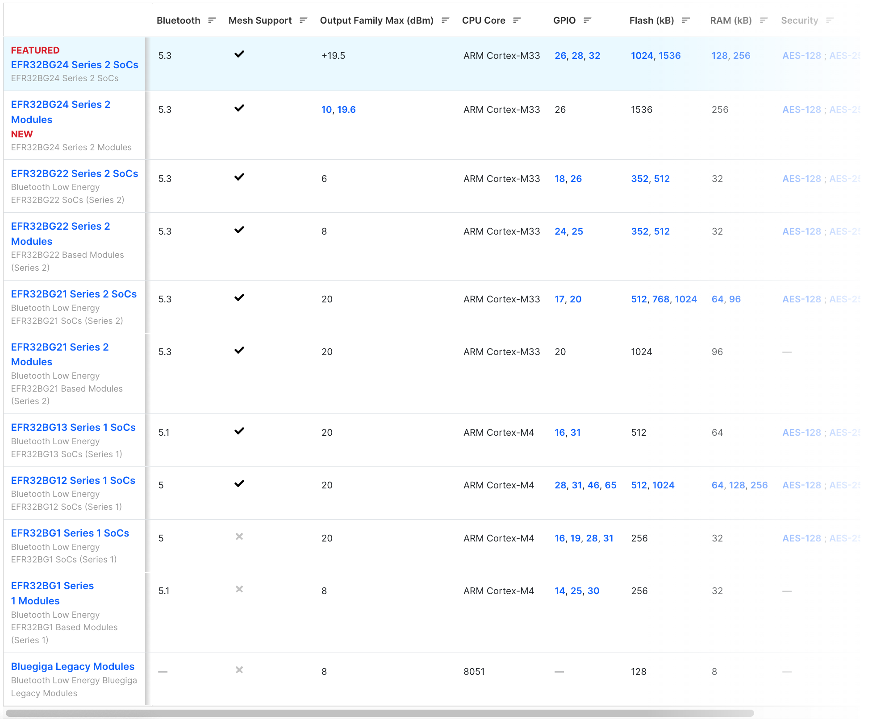  
</div>  
<div align="center">
  <b>Figure 1.2. Silicon Labs Bluetooth Low Energy and Bluetooth mesh product</b>
</div>  
</br>  

# 2. Simplicity Studio v5
Simplicity Studio is the unified development environment for all Silicon Labs technologies, SoCs, and modules. It provides you with access to the target device-specific web and SDK resources, software and hardware configuration tools, and an integrated development environment (IDE) featuring industry-standard code editors, compilers, and debuggers. With Simplicity Studio, you get a complete set of advanced value-add tools for network analysis and code-correlated energy profiling.   
Simplicity Studio provides wireless IoT developers with the most advanced set of development tools at no cost.   

**Energy Profiler**   
Develop energy-efficient wireless applications – Optimize your code for low power consumption line by line.   
<div align="center">
  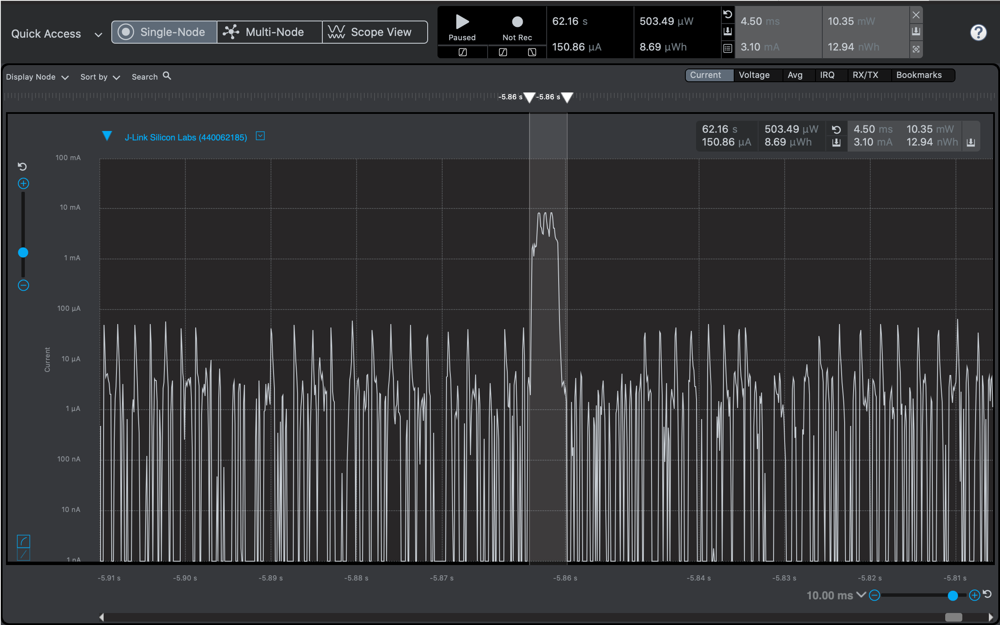  
</div>   
<div align="center">
  <b>Figure 2.1. Energy Profiler</b>
</div>  
</br>  

**Network Analyzer**   
Speed-up wireless troubleshooting – Capture the raw wireless traffic flowing in the system and analyze it in a human-readable format.   
<div align="center">
  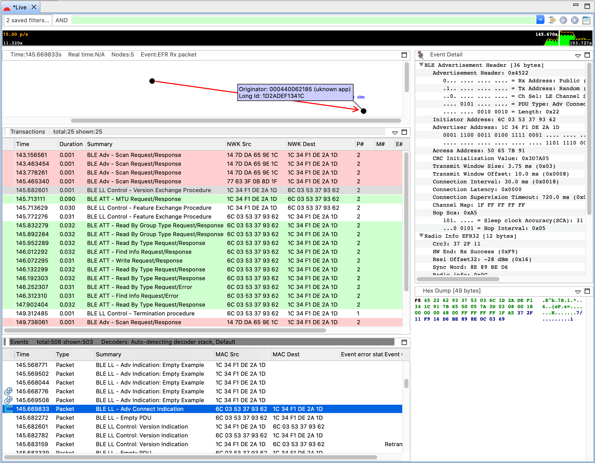  
</div>   
<div align="center">
  <b>Figure 2.2. Network Analyzer</b>
</div>  
</br>  

**Simplicity Commander**   
An essential tool for encrypting, flashing, signing, and creating firmware binaries among the many other purposes.   
<div align="center">
  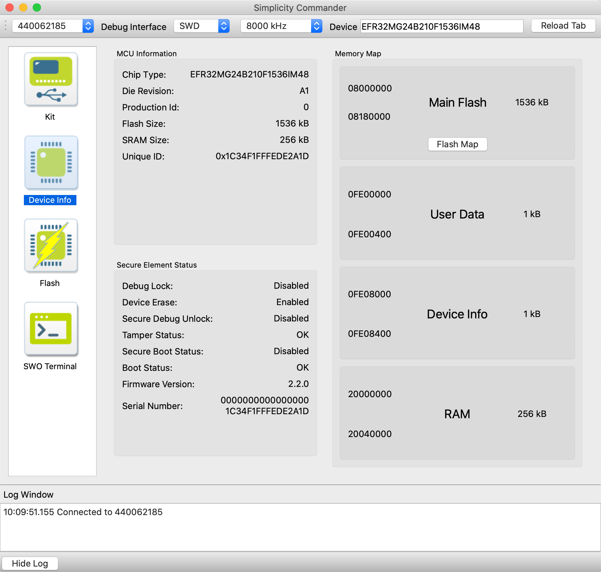  
</div>  
<div align="center">
  <b>Figure 2.3. Simplicity Commander</b>
</div>   
</br>  

**Bluetooth GATT Configurator**   
Create and configure the GATT database on your Bluetooth Low Energy firmware. Export and import the database between different projects or with GATT Configurator on EFR Connect mobile app.   
<div align="center">
  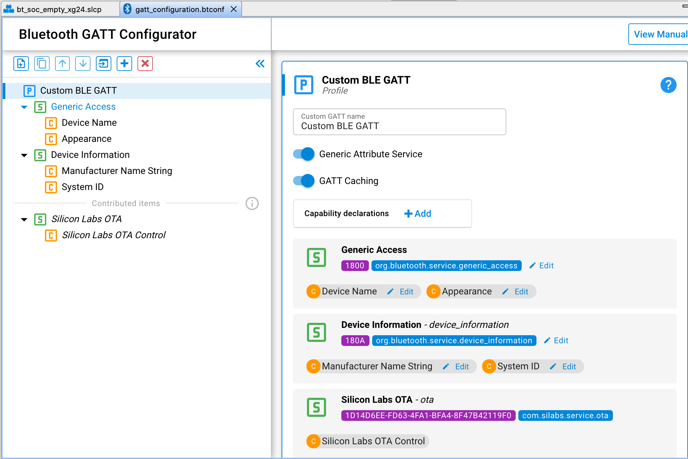  
</div>   
<div align="center">
  <b>Figure 2.4. Bluetooth GATT Configurator</b>
</div>   
</br>  

**Bluetooth Mesh Configurator**   
Configure Bluetooth mesh node parameters and models on your firmware. Export and import the Bluetooth Configuration between different projects.   
<div align="center">
  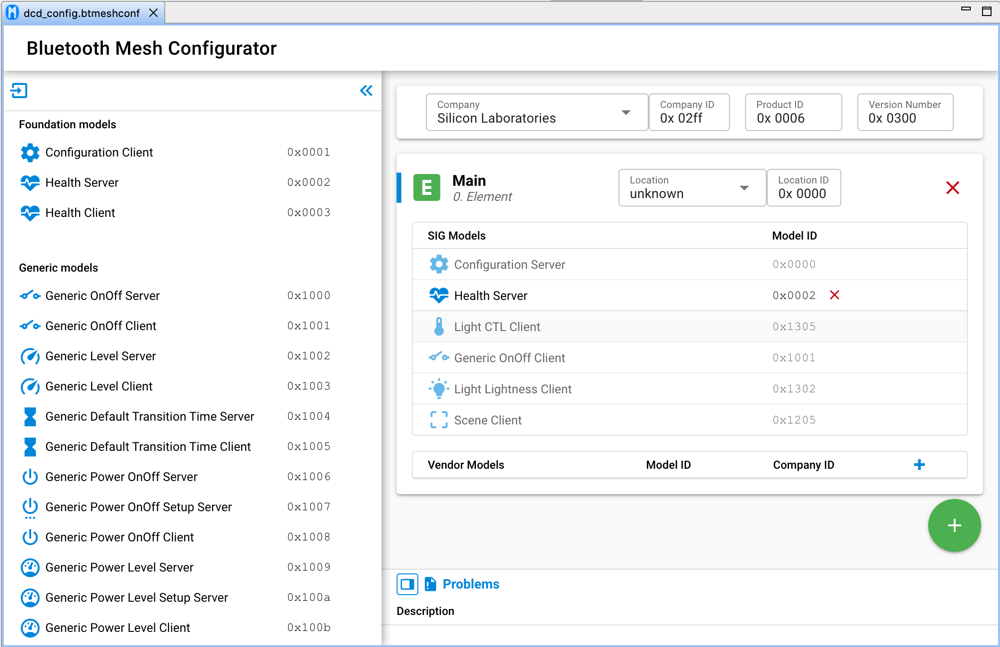  
</div>   
<div align="center">
  <b>Figure 2.5. Bluetooth Mesh Configurator</b>
</div>   
</br>  

**Radio Configurator**   
Configure the radio PHY parameters for your proprietary applications. That makes the user can fully customize the modem to fit their needs, and define the packet preamble, sync word and other options.   
<div align="center">
  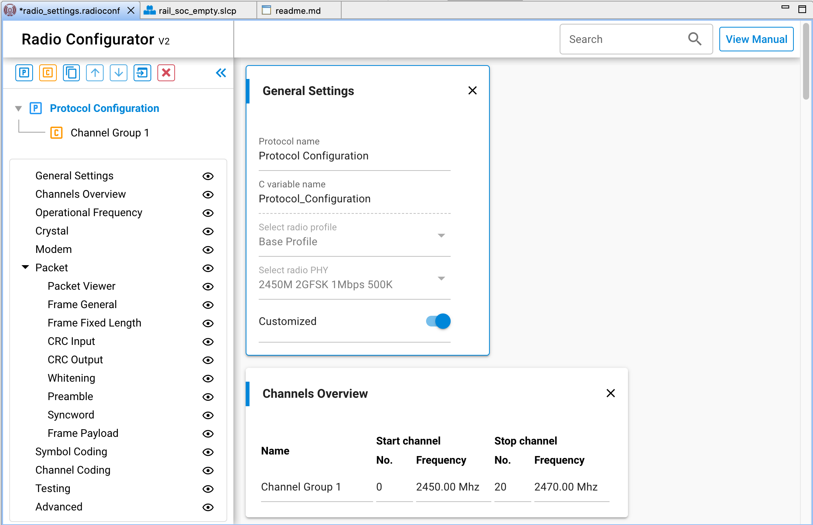  
</div>   
<div align="center">
  <b>Figure 2.6. Radio Configurator</b>
</div>   
</br>  

**Bluetooth NCP Commander**   
An intuitive graphical user interfaces for controlling your NCP target. You can perform the most common BLE functions (such as advertising, scanning, connections, DTM test), and this is a tool can be used to provision and configure Bluetooth Mesh devices.   
<div align="center">
  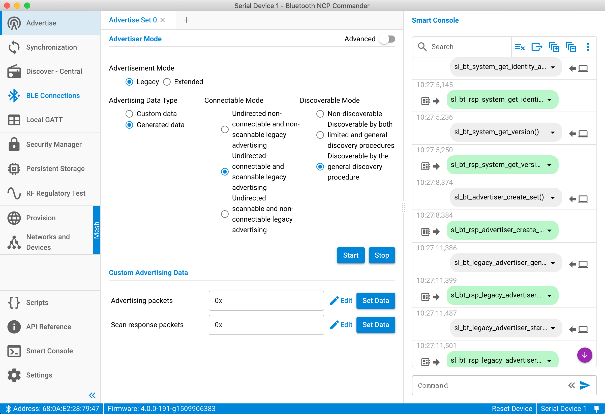  
</div>   
<div align="center">
  <b>Figure 2.7. Bluetooth NCP Commander</b>
</div>   
</br>  

**Direction Finding Toolsuite**   
A visual set of tools to setup a multi-locator positioning system, with this tool set, you can build and configure the multilocator system easily, and observe the location of your assets in real time together with location data. It can help to get your Bluetooth Direction Finding solution up and running faster.   

# 3. Bluetooth application development with SSv5
For improving the developer experience, Silicon Labs redesigned the underlying framework of the Simplicity Studio as well as the architecture of the Gecko software development kit. All of the projects in the Simplicity Studio 5 are now built on a Gecko Platform component-based architecture. Simplicity Studio 5 includes project configuration tools that provide an enhanced level of software component discoverability, configurability, and dependency management.   

The Bluetooth applications in Bluetooth SDK v3.0 or later also have a new software architecture, the Bluetooth API is updated, and the GATT configurator is completely redesigned. Additionally the stack can now be configured in separate header files, and platform components can be added to the project with the Component Editor instead of copying and including files manually.   

With SSv5 and the latest GSDK, Bluetooth developers will benefit from the component-based project configuration features.   

In the following section, it will show how to create a new Bluetooth project using EFR32BG24 explorer kit and configure the stack with component based configurator. Then will demonstrate how to install the "iBeacon" component to extend the functionality of the example project.

## 3.1. Prerequisites
For finishing this part, you'll need the following:

### 3.1.1. Hardware
EFR32xG24 Explorer Kit board (EK2703A)   
USB Type-C cable   
WSTK BRD4001A or WSTK PRO BRD4002A (Optional for Energy Profiling in Simplicity Studio)   

### 3.1.2. Software
Simplicity Studio v5   
Gecko SDK Suite 4.1.1 or later   

## 3.2. Creating and Configuring a Bluetooth Project

### 3.2.1. Create an SoC-Empty Bluetooth Project
Because starting application development from scratch is difficult, the Bluetooth SDK comes with a number of built-in demos and examples covering the most frequent use cases. The most common starting point for Bluetooth application development is the SoC-Empty example, this section will show you how to get started with the example application.   

You can start a project from different locations in the Launcher Perspective, and we suggest starting from the File menu.
1. Connect the EFR32xG24 explorer kit to your computer using the USB cable.
2. Launch Simplicity Studio v5 IDE.
3. Select File >> New >> Silicon Labs Project Wizard.
4. Review your SDK, IDE/toolchain, Click NEXT after you changing that properly.
<div align="center">
  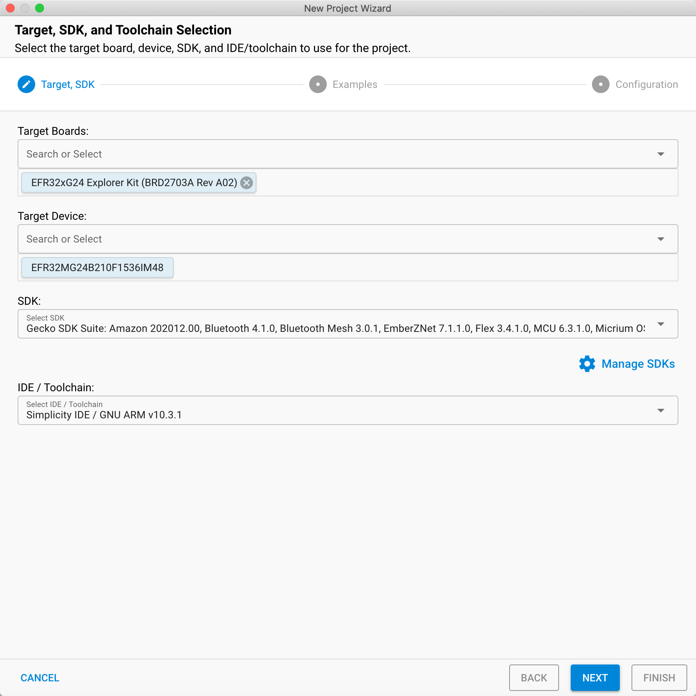   
</div>  
<div align="center">
  <b>Figure 3.1. Create BLE Project</b>
</div>   
</br>  

5. On the Example Project Selection dialog, filter on Bluetooth and select SoC Empty. Click NEXT
<div align="center">
  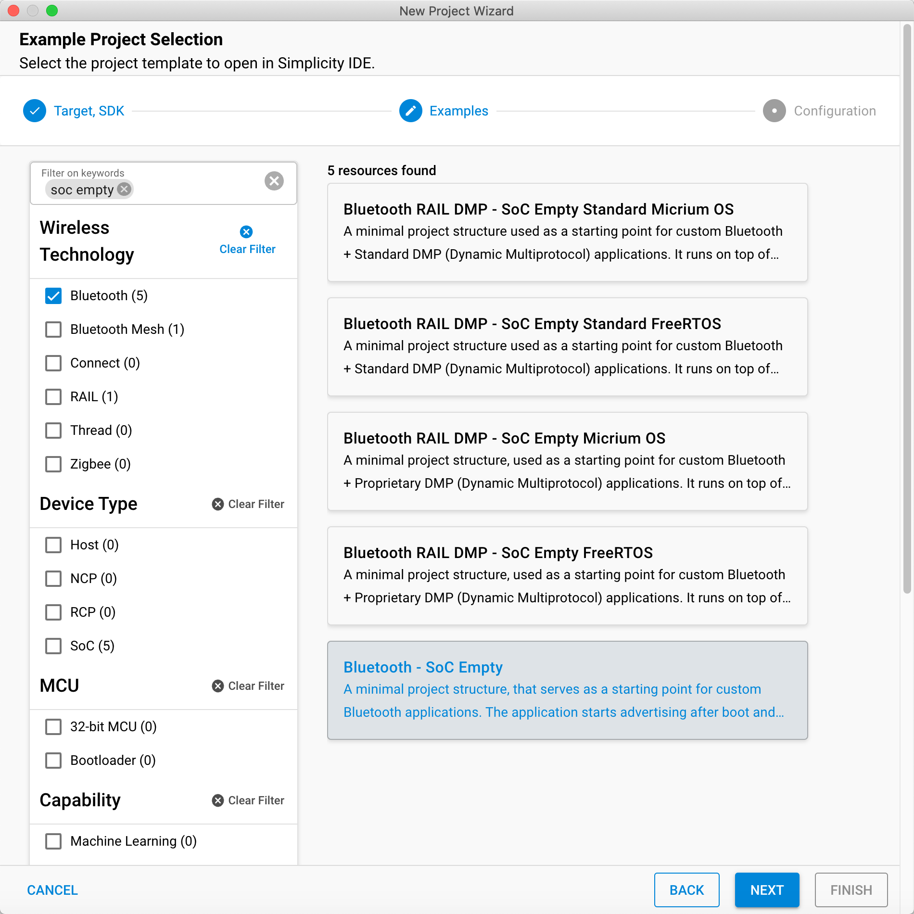   
</div>  
<div align="center">
  <b>Figure 3.2. Create a SoC-Empty project</b>
</div>   
</br>  

6. Rename your project if you wish, and choose would you like to link to the SDK or copy contents to your project. Click FINISH.
<div align="center">
     
</div>  
<div align="center">
  <b>Figure 3.3. Rename your project</b>
</div>   
</br>  

Once creating the project, the project opens on a readme tab, and other two tabs "GATT Configurator" and "Project Configurator" will be available in parallel.   
<div align="center">
  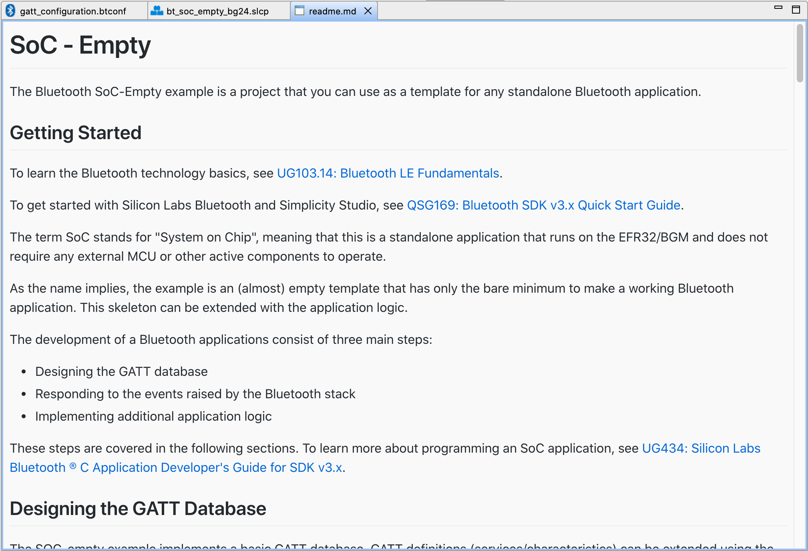   
</div>  
<div align="center">
  <b>Figure 3.4. Readme of the project</b>
</div>   
</br>  

Navigate to the visual GATT Configurator. The GATT Configurator is a simple-to-use tool to help you build your own GATT database, and it will automatically convert the database structure into C code upon saving.   
You can just try to modify the device name from the default "Empty Example" to any value, however, please make sure the Value length is exact same as the length of the device name.

<div align="center">
  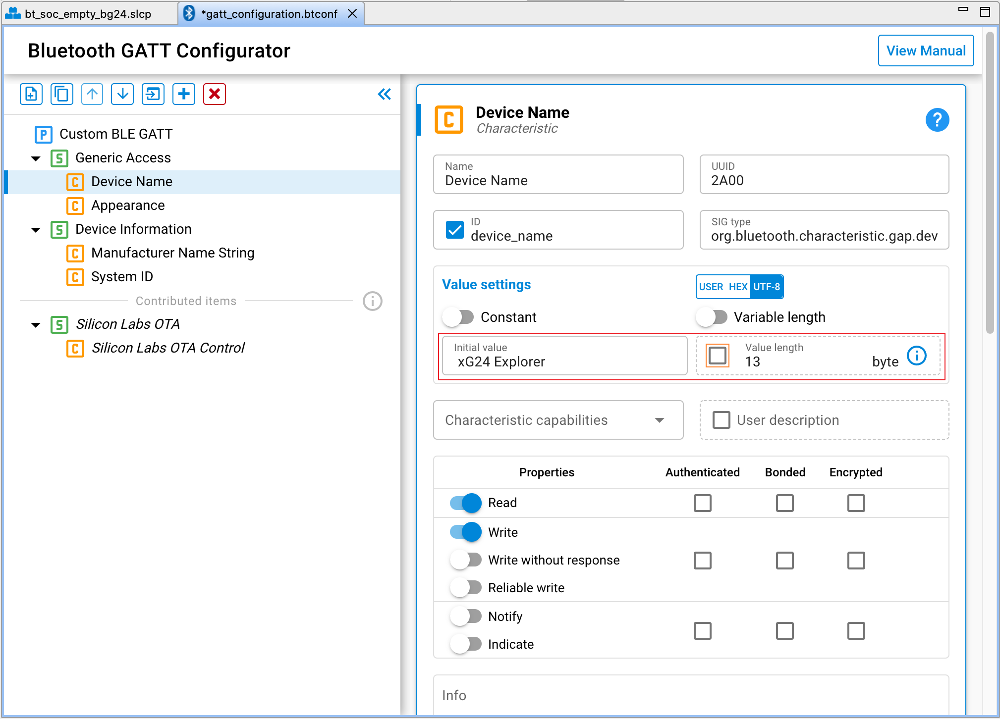   
</div>  
<div align="center">
  <b>Figure 3.5. Configure the project</b>
</div>   
</br>  

To build your project click Build (hammer icon) on the Simplicity IDE, it will build the project and generate the images in the project folder. Right click the image and click "Flash to Device" for programming the application image.   
<div align="center">
  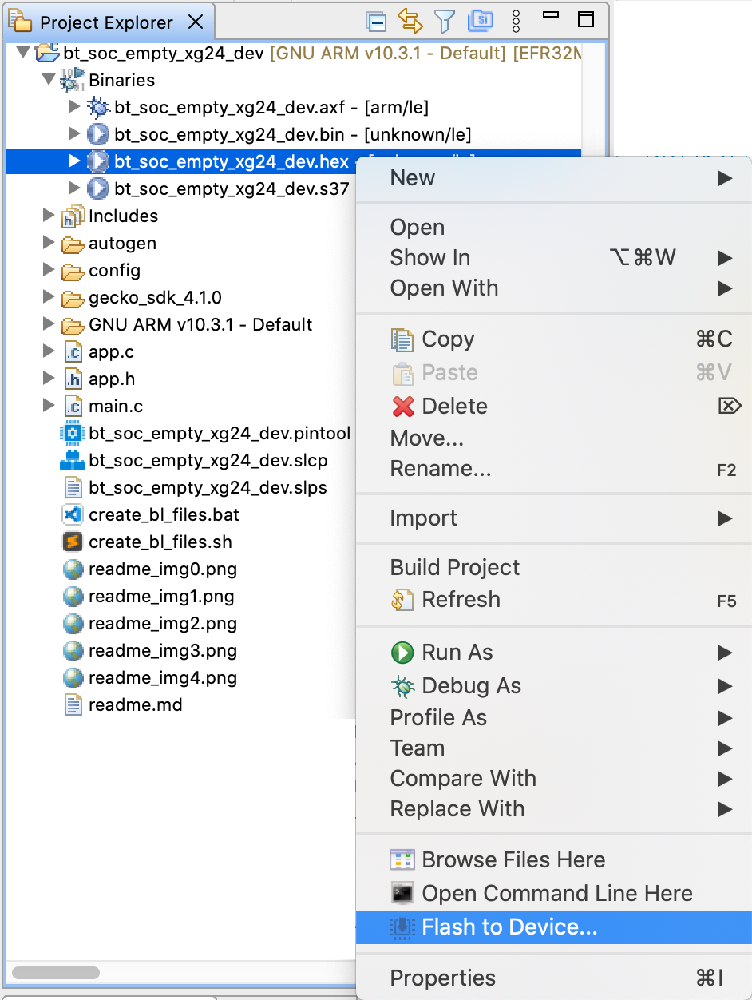   
</div>  
<div align="center">
  <b>Figure 3.6. Build and Program to the device</b>
</div>   
</br>  

After flashing the application image to your device, you can find the advertisement signal with the Bluetooth Browser in the EFR Connect mobile app.   
Start EFR Connect, tap the Develop tab, and tap Bluetooth Browser. Sort the scanned devices by RSSI descending and you will be able to find the device easily. Tap the device to get more information about the data it provides.   
<div align="center">
  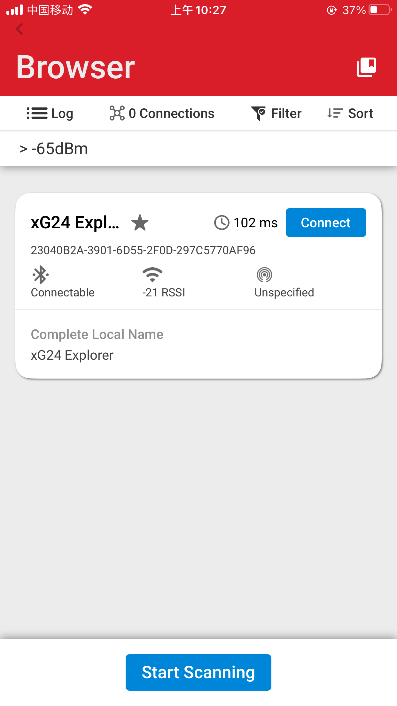   
</div>  
<div align="center">
  <b>Figure 3.7. Scan device with EFR Connect</b>
</div>   
</br>  

**Note**: Beginning with Bluetooth SDK version 2.7.0.0, all devices must be loaded with the Gecko Bootloader as well as the application. While you are getting started, the easiest way to do this is to load any of the precompiled demo images that come with the bootloader configured as part of the image. When you flash your application it overwrites the demo application, but the bootloader
remains. Subsequently you may wish to build your own bootloader, as described in [UG266: Silicon Labs Gecko Bootloader User’s Guide](https://www.silabs.com/documents/public/user-guides/ug266-gecko-bootloader-user-guide.pdf) for GSDK 3.2 and Lower or [UG489: Silicon Labs Gecko Bootloader User’s Guide](https://www.silabs.com/documents/public/user-guides/ug489-gecko-bootloader-user-guide-gsdk-4.pdf) for GSDK 4.0 and Higher.   

## 3.3. Component Installation
As introduced above, from Bluetooth SDK v3.x, all of the Bluetooth application project are based on Gecko Platform component-based architecture. Software features and functions can be installed and configured through Simplicity Studio’s Component Editor. 
When you install a component, the installation process will:
1. Copy the corresponding SDK files from the SDK folder into the project folder.
2. Copy all the dependencies of the given component into the project folder.
3. Add new include directories to the project settings.
4. Copy the configurations files into the /config folder.
5. Modify the corresponding auto-generated files to integrate the component into the application.

This section demonstrates how to extend the device capability for advertising iBeacon. iBeacon is a component available in Simplicity Studio's component editor and can be fully integrated into the Bluetooth application to perform a specific event handler automatically without the need ot any additional code.    

To see the component library, click the <project-name>.slcp tab of your project, and click Software Components. A number of filters as well as a keyword search are available to help you explore the various component categories. Click Bluetooth >> Application >> iBeacon >> Install, the iBeacon component will be installed, and all of the source will be added to the project automatically.   

<div align="center">
  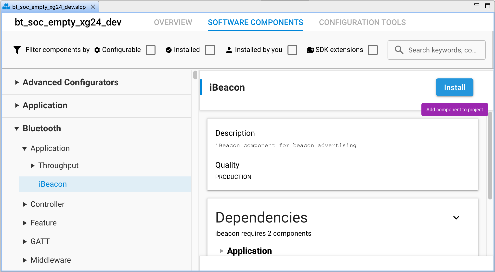   
</div>  
<div align="center">
  <b>Figure 3.8. Install iBeacon component</b>
</div>   
</br>  

Build and program the application image to the device, and you will be able to scan the legacy advertisement and iBeacon simultaneously.   
<div align="center">
  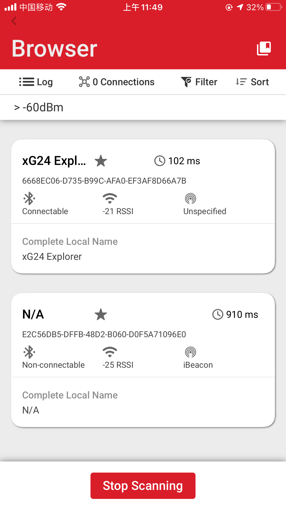   
</div>  
<div align="center">
  <b>Figure 3.9. Scan iBeacon</b>
</div>   
</br> 

As the EFR32xG24 explorer kit includes a mikroBUS™ socket and Qwiic® connector, allowing users to add features to the kit with a large selection of off-the-shelf boards from mikroE, sparkfun, AdaFruit, and Seeed Studios.   
The mikroBUS socket allows inserting mikroBUS add-on boards which interface with the EFR32xG24 through SPI, UART or I2C. The Qwiic connector can be used to connect hardware from the Qwiic Connect System through I2C. And the Simplicity Studio v5 with the latest Gecko SDk also provide a rich set of peripheral driver components (such as I2CSPM, SPIDRV, UARTDRV) that can simplify the development process for driving the external components.   

# 4. Multi-Node Energy Profiler
Multi-Node Energy profiler is an add-on tool, with which you can easily measure the energy consumption of your device in runtime. You can easily find peak and average consumption, and check for sleep mode current.   

The Dev kit (e.g., xG24-DK2601B) or Explorer Kit (e.g., xG24-EK2703A) does not support energy profiling as they don't have the AEM (Advanced Energy Monitor) circuitry, so if you'd like to use the Multi-Node Energy Profile functionality on the Dev kit, Explorer Kit or custom design board, an external Wireless Starter Kit (WSTK) should be used in "DEBUG MODE: OUT" to power the testing device for current measurement. The connector between them is detailed in [AN958: Debugging and Programming Interfaces for Custom Designs](https://www.silabs.com/documents/public/application-notes/an958-mcu-stk-wstk-guide.pdf), the Mini Simplicity 10 pin connector shown below can be used with all EFM32 and EFR32 parts.   

<div align="center">
  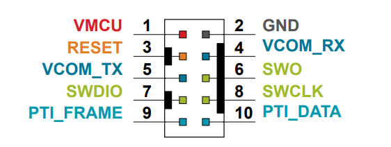  
</div>  
<div align="center">
  <b>Figure 4‑1 10 Pin Mini Simplicity Connector Pin-Out</b>
</div>  
</br>  

As mentioned in AN958, using the Silicon Labs debug adapter board (BRD8010A) is the easiest way to get the Mini Simplicity pinout from a Silicon Labs STK or WSTK development kit.   

<div align="center">
  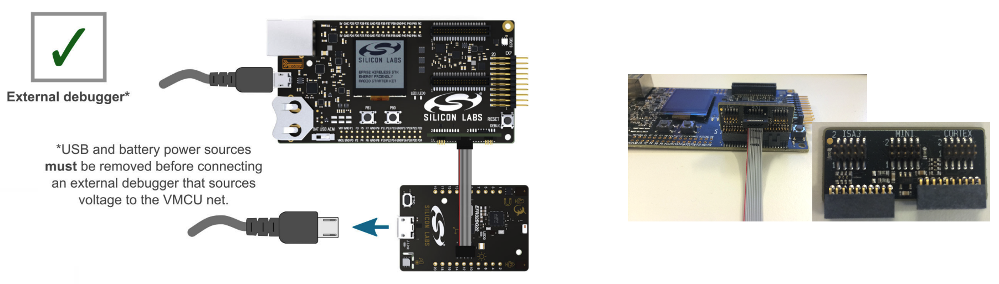  
</div>  
<div align="center">
  <b>Figure 4‑2 Connect with BRD4001A</b>
</div>  
</br>  

It is only necessary to use the debug adapter to get access to the Mini Simplicity Connector when using the Wireless STK Mainboard (BRD4001A). If using the Wireless Pro Kit Mainboard (BRD4002A), use the Mini Simplicity Connector on the mainboard directly.   

The Wireless Pro Kit Mainboard is the successor to the Wireless Starter Kit Mainboard, which comes with some improvements and added features including increased AEM measurement range and sample rate, variable VMCU voltage, joystick, and a Mini Simplicity Connector.    

<div align="center">
  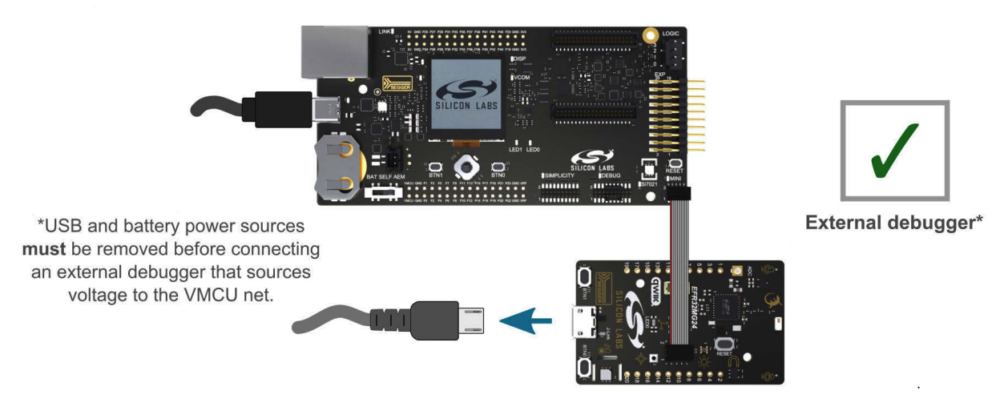  
</div>  
<div align="center">
  <b>Figure 4‑3 Connect with BRD4002A</b>
</div>  
</br>  

Note: The SDK sample applications for EFR32BG24 enable EM2 debug (see init_mcu.c), which adds current consumption overhead compared to the datasheet values. You can disable debug connectivity in EM2 with the "Device Init: EMU" component.   

To profile the current project, click "Tools" in the menu bar and select "Energy Profiler" or right-click on the <project>.slcp file in the Project Explorer view and select "Profile As >> Simplicity Energy Profiler Target". This automatically builds your project, uploads it to the device, and starts Energy Profiler. A new Energy Profiler perspective appears then.   

Take the SoC-iBeacon project as demonstration, per the SoC-iBeacon application’s default settings, the Series 2 EFR32BG24 device broadcasts a beacon with a frame of 46 octets every 100 ms, at a 0 dBm TX output power level, running from the DCDC converter.   
The figure below shows the average current consumption of the 913.08s measure period, and also you can measure any selected range by clicking and dragging across the waveforms. Once a range is selected, a light gray section summarizing the energy statistics for the selected region is displayed.   
The range in yellow below illustrates the current consumption we measured while the device in EM2 mode is 2.9uA. 
Note: the device is working as 256 kB RAM and full Radio RAM retention, RTC running from LFXO.   

<div align="center">
  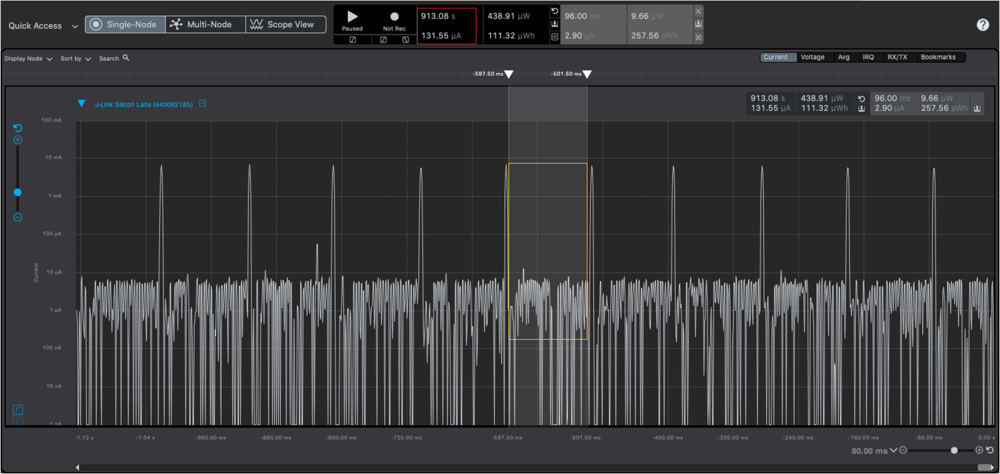  
</div>  
<div align="center">
  <b>Figure 4‑4 Current Profile for EFR32xG24 Running SoC-iBeacon </b>
</div>  
</br>  

# 5. Network analyzer
Silicon Labs Network Analyzer is a free-of-charge packet capture and debugging tool that can be used to debug a wide variety of short-range wireless protocols like Bluetooth Low Energy, Zigbee, proprietary protocols and others.

With it, the user can tap into the data buffers of the radio transceiver via a dedicated serial hardware interface called the Packet Trace Interface (PTI). PTI is an interface giving serial data access directly to the radio transmitter/receiver frame controller. PTI data can be then transferred via USB or Ethernet to a computer running Simplicity Studio. Finally, the time-stamped data can be interpreted and displayed in Network Analyzer.   

<div align="center">
  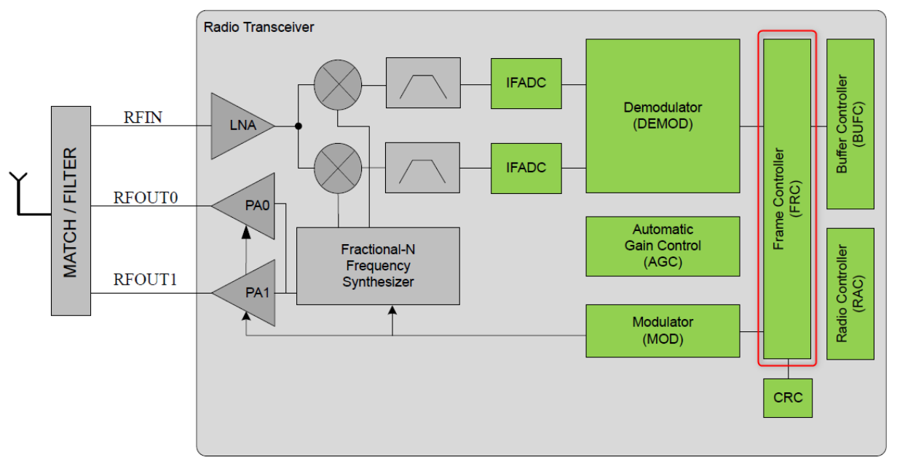  
</div>  
<div align="center">
  <b>Figure 5‑1 Packet Trace Interface (PTI) </b>
</div>  
</br>  

The Network Analyzer significantly accelerates the network and application development process with graphical views of network traffic, activity, and duration.   

Most Silicon Labs’ development kits, such as the Wireless Starter Kit (WSTK), Development Kit (DK) and Explorer Kit (EK) have the PTI embedded and ready to use. And you can also use the network analysis features of the Silicon Labs' development kits for debugging the custom hardware if the PTI pins are exposed via a debug interface.   

## 5.1. Capture Bluetooth LE Packets
Network Analyzer can capture data from the connected adapters, and display data from Live sessions as well as Recorded sessions.

The following procedure describes how to start a network data capture on a single device:
1. In Preferences > Simplicity Studio > SDKs select the desired SDK.
2. In Preferences > Network Analyzer > Decoding > Stack Version, Make sure “Bluetooth Low Energy” is added in the decoding preferences. Also you can chose "auto-detecting decoder stack", network analyzer will capture and decode the data of different stack profile automatically.
3. Connect to the adapter   
<div align="center">
  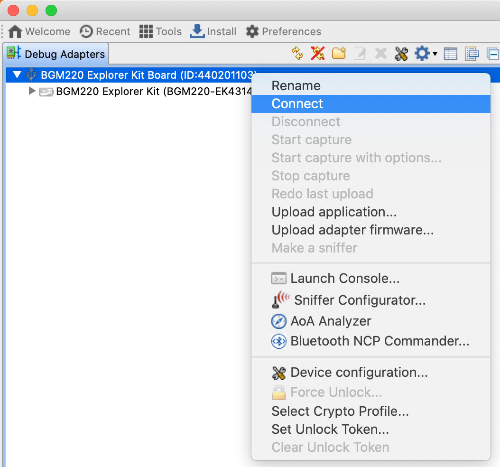  
</div>  
<div align="center">
  <b>Figure 5‑2 Connect to the adapter </b>
</div>  
</br>  

4. Start capture.   
<div align="center">
  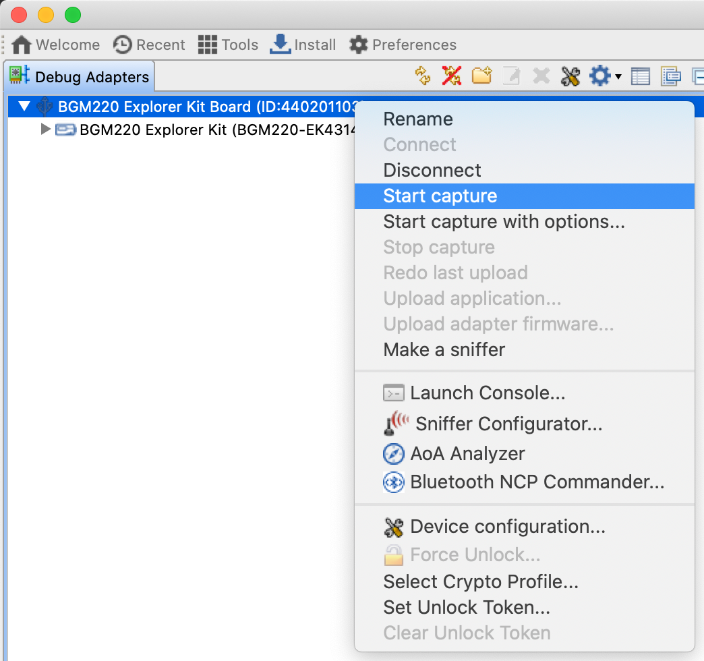  
</div>  
<div align="center">
  <b>Figure 5‑3 Capture Network data </b>
</div>  
</br>  

5. Bluetooth LE network traffic will show in a live session.   
<div align="center">
  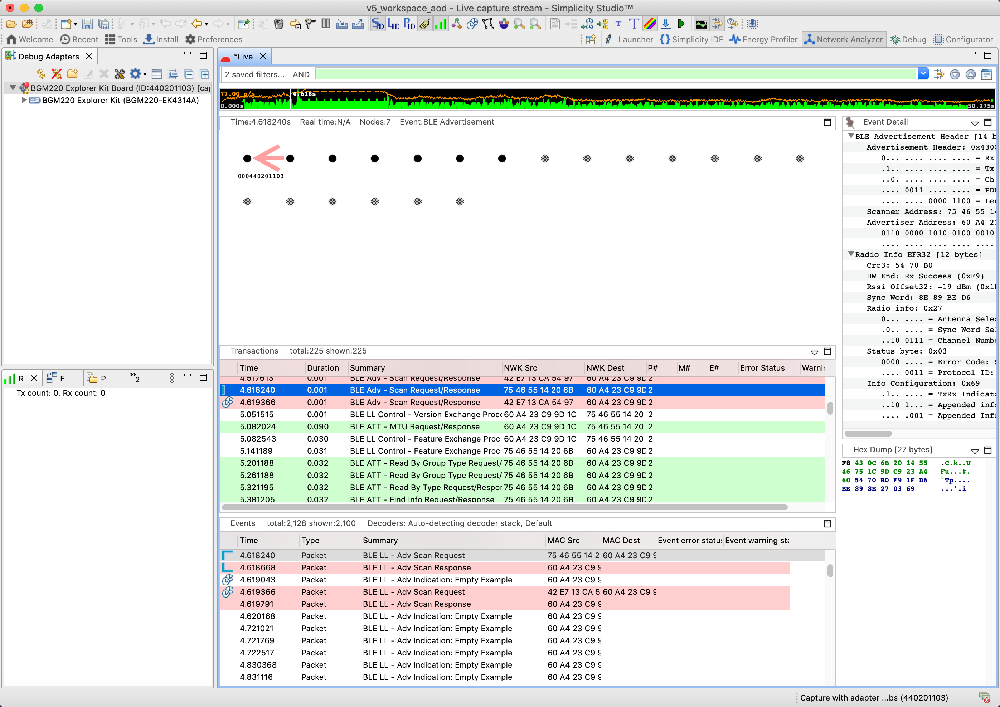  
</div>  
<div align="center">
  <b>Figure 5‑4 Network data </b>
</div>  
</br>  

**Bookmarks**   
Bookmarks can be used for marking events, it's useful for pointing a certain event in a huge network traffic file. 
You can select any event or transaction you'd like to add bookmark to, and right-click it and click "Add bookmark...", Enter the bookmark name.
<div align="center">
  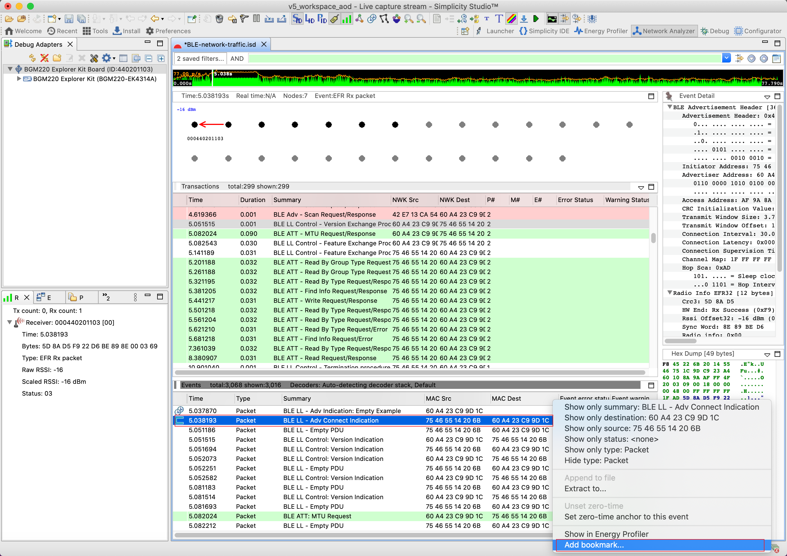  
</div>  
<div align="center">
  <b>Figure 5‑5 Add bootmarks </b>
</div>  
</br>  

**Set Zero-Time Anchor**   
Timestamp is a very important information while analyzing a particular event or transaction, Network Analyzer provide the flexibility to set Zero-time anchor, it's an excellent way to verify the Bluetooth Low Energy advertising or connection timings (advertising interval, connection interval, and so on).

Select the particular transaction or event, right-click to open the context menu, and then click *Set zero-time event anchor to this event*.
<div align="center">
  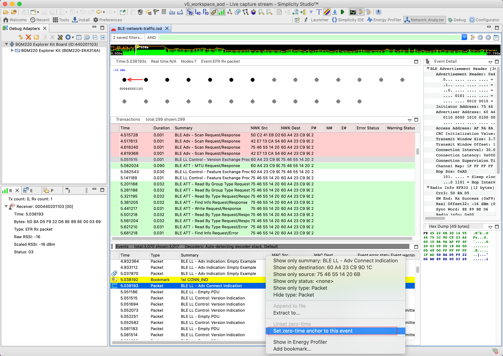  
</div>  
<div align="center">
  <b>Figure 5‑6 Set Zero-Timer anchor </b>
</div>  
</br>  

**Filters**   
The Network Analyzer will monitor all packets received/transmitted by the chip itself, so the filter is necessary for the user to filter transactions and events they are interested in.   
Network Analyzer supports use of a set of built-in and manual filters. For the manual filters, multiple filters can be combined using logical expressions:   
• && - And operator   
• || – Or operator   
Alternatively, conditions for individual filters can also be used:   
• == - Equals   
• != - Not equal   
• |= - Contains   

The following example illustrates how to filter the transaction between the BLE master device "75 46 55 14 20 6B" and slave device "60 A4 23 C9 9D 1C".   
```(transaction.source == "60 A4 23 C9 9D 1C" && transaction.dest == "75 46 55 14 20 6B") || (transaction.dest == "60 A4 23 C9 9D 1C" && transaction.source == "75 46 55 14 20 6B")```   

<div align="center">
  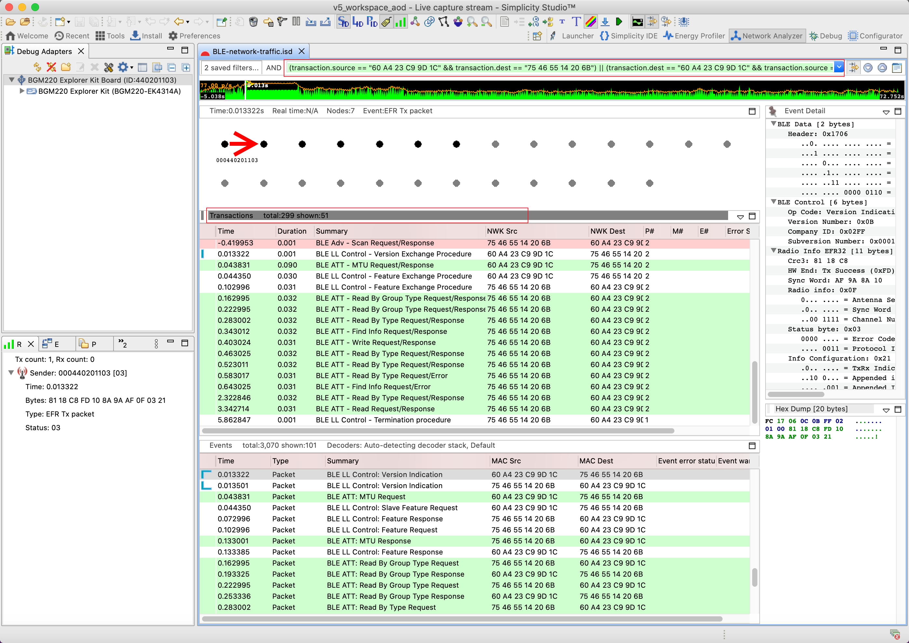  
</div>  
<div align="center">
  <b>Figure 5‑7 Add filters </b>
</div>  
</br>  

## 5.2. Analyze Bluetooth LE network traffic
This section describes how to interpret the captured Bluetooth Low Energy network data. 

### 5.2.1. Message Sequence Charts of Initiating a Connection
Take the initiating connection process as an example. A device can initiate a connection to an advertiser. Below is the message sequence chars illustrates a successful initiation, resulting in both devices able to send application data. (BLUETOOTH CORE SPECIFICATION Version 5.2 | Vol 6, Part D, 5.1 INITIATING A CONNECTION)   

<div align="center">
  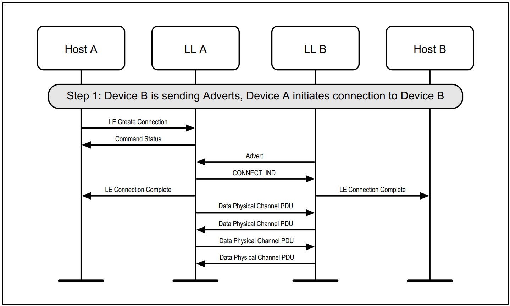  
</div>  
<div align="center">
  <b>Figure 5‑8 Sequence Charts of Initiating a Connection </b>
</div>  
</br> 

In the sequence char, Device B is sending advertisement and Device A is scanning to finding the advertising device. The initiator may send a connect request (CONNECT_IND PDU) to request the Link Layer to enter the Connection state.   

<div align="center">
  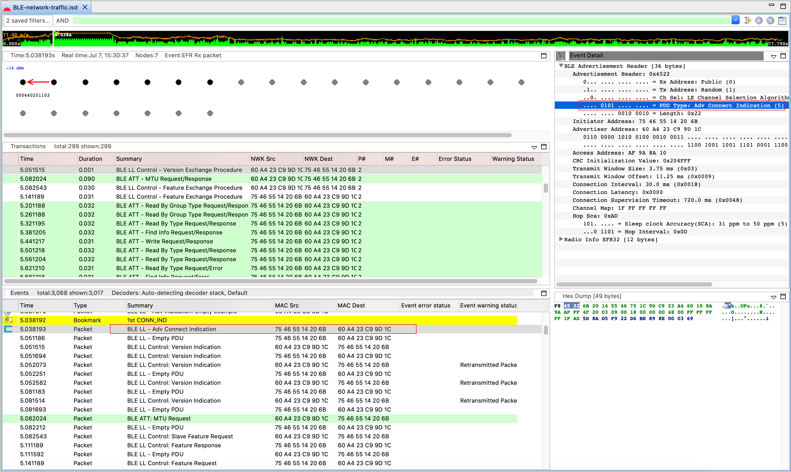  
</div>  
<div align="center">
  <b>Figure 5‑9 Send CONNECT_IND </b>
</div>  
</br>  

If the advertiser receives a CONNECT_IND PDU that contains its device address, from an initiator allowed by the advertising filter policy, the Link Layer shall exit the Advertising state and transition to the Connection state in the Slave Role.   
With the network data below, the initiator "75 46 55 14 20 6B" sends the CONNECT_IND PDU to the advertiser "60 A4 23 C9 9D 1C".

<div align="center">
  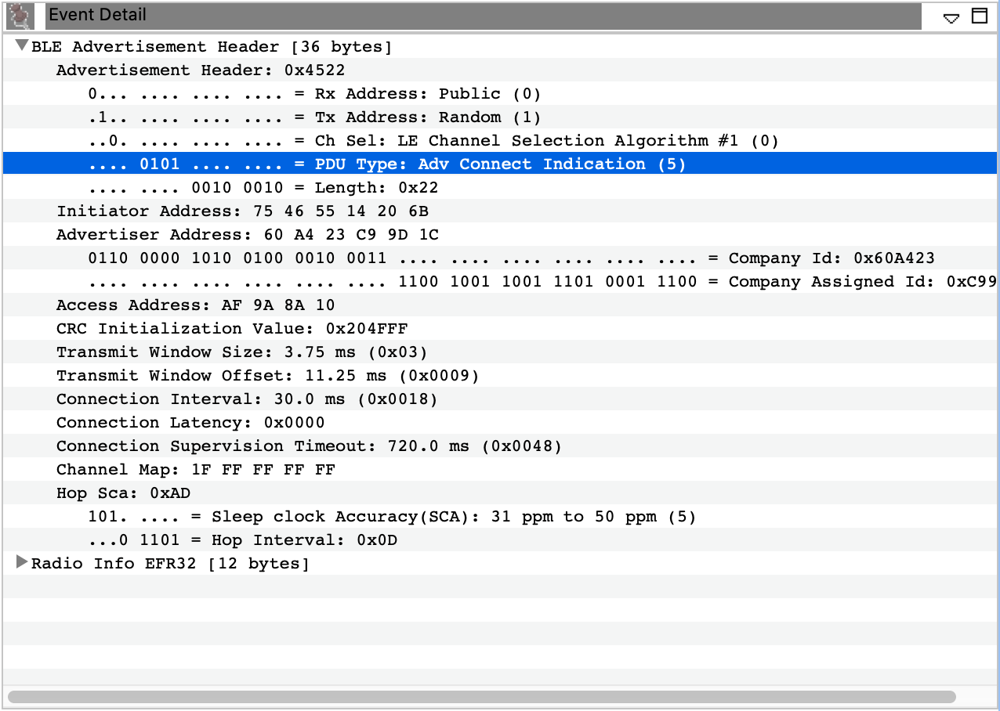  
</div>  
<div align="center">
  <b>Figure 5‑10 CONNECT_IND PDU </b>
</div>  
</br>  

After the initiator sends a CONNECT_IND PDU on the primary advertising physical channel, the Link Layer is in the Connection state in the Master Role. The master shall start to send the first packet within the transmit window.
After the advertiser receives a CONNECT_IND PDU on the primary advertising physical channel, the Link Layer is in the Connection state in the Slave Role. The slave shall start to listen for the first packet within the transmit window.   

The Link Layer parameters for version information (companyID, subVerNum, linkLayerVer) may be exchanged after entering the Connection State. Either the Link Layer of the master or slave can initiate this procedure by sending an LL_VERSION_IND PDU. If the Link Layer receives an LL_VERSION_IND PDU and has not already sent an LL_VERSION_IND then the Link Layer shall send an LL_VERSION_IND PDU to the peer device.   

The procedure has completed when an LL_VERSION_IND PDU has been received from the peer device.   
<div align="center">
  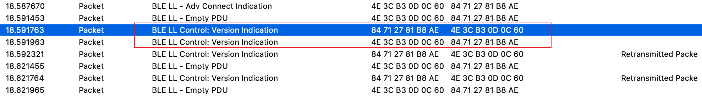  
</div>  
<div align="center">
  <b>Figure 5‑11 Send LL_VERSION_IND </b>
</div>  
</br>  

The LL_VERSION_IND CtrData consists of three fields:
<div align="center">
  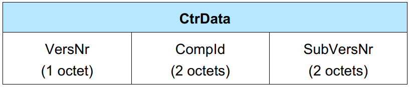  
</div>  
<div align="center">
  <b>Figure 5‑12 LL_VERSION_IND </b>
</div>  
</br>  

* VersNr field shall contain the version of the Bluetooth Link Layer specification (see [Assigned Numbers](https://www.bluetooth.com/specifications/assigned-numbers/) ). The EFR32xG24 with Bluetooth SDK v3.2.x or above supports Bluetooth 5.3, so the version is 0x0C.   
<div align="center">
  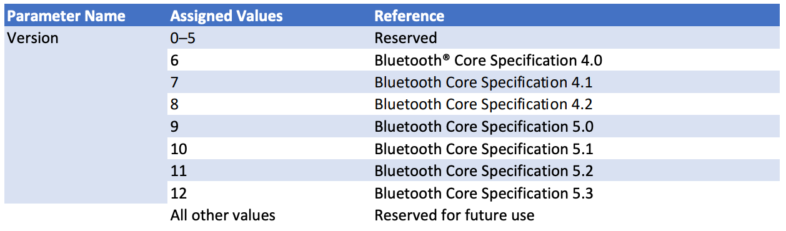  
</div>  
<div align="center">
  <b>Figure 5‑13 Bluetooth Core Specification version </b>
</div>  
</br>  

* CompId field shall contain the company identifier of the manufacturer of the Bluetooth Controller.   
<div align="center">
  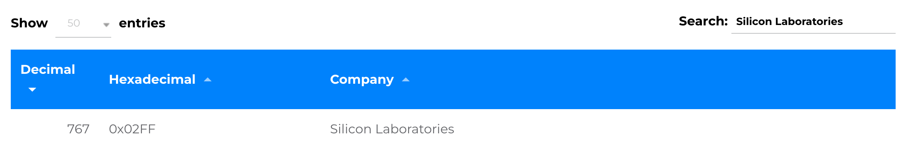  
</div>  
<div align="center">
  <b>Figure 5‑14 Company ID </b>
</div>  
</br>  

* SubVersNr field shall contain a unique value for each implementation or revision of an implementation of the Bluetooth Controller.   

<div align="center">
  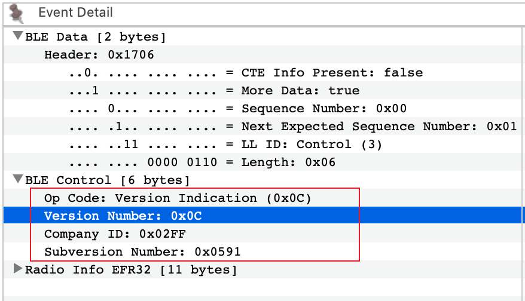  
</div>  
<div align="center">
  <b>Figure 5‑15 Bluetooth Controller unique value </b>
</div>  
</br>  

# 6. Appendix
[Simplicity Studio® 5 User's Guide](https://docs.silabs.com/simplicity-studio-5-users-guide/latest/ss-5-users-guide-overview/)   
[QSG169: Bluetooth® Quick-Start Guide for SDK v3.x and Higher](https://www.silabs.com/documents/public/quick-start-guides/qsg169-bluetooth-sdk-v3x-quick-start-guide.pdf)   
[UG533: EFR32xG24 Explorer Kit User's Guide](https://www.silabs.com/documents/public/user-guides/ug533-xg24-ek2703a.pdf)   
[AN1317: Using Network Analyzer with Bluetooth® Low Energy and Mesh](https://www.silabs.com/documents/public/application-notes/an1317-network-analyzer-with-bluetooth-mesh-le.pdf)   
[Managing Coexistence Between Wi-Fi, Zigbee, Thread, and Bluetooth](https://www.silabs.com/wireless/wi-fi/wi-fi-coexistence)   