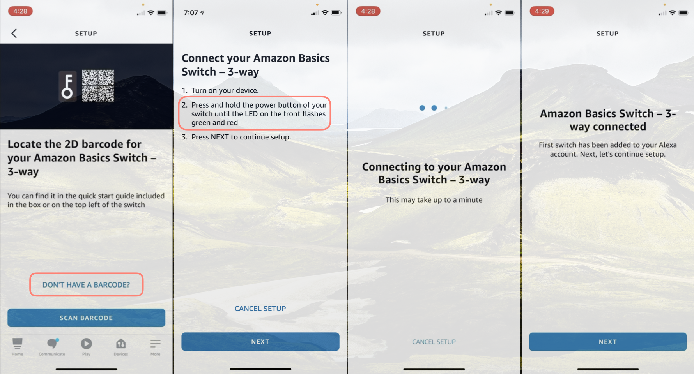
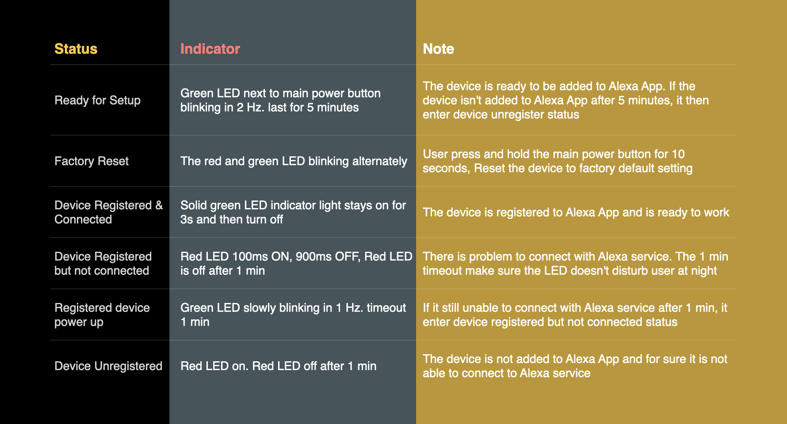
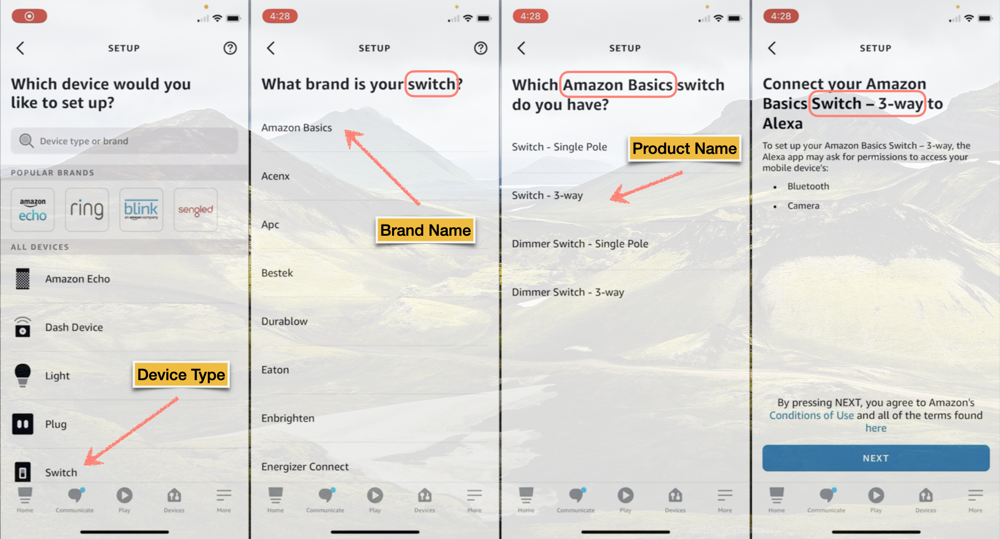
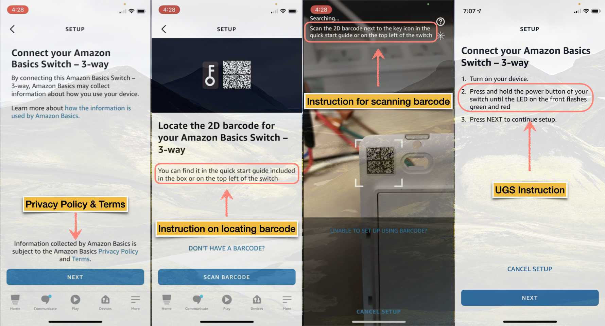

# 1. Introduction
In this article, we would like to introduce everything you need to know about the development of ACK product. Including what is Zero Touch Setup(ZTS), Barcode Setup(BCS), User Guided Setup(UGS); What is LED indicator for different status; What should be prepared for the Alexa App Onboarding. What is the product functional capabilities? 

# 2. Setup Modes
Frustration-Free Setup(FFS) technology is promoted by Amazon to lower the complexities of setup for connected devices. Frustration-Free Setup has two different modes of operation: Zero-Touch Setup (ZTS) and Barcode Setup (BCS). If the device is not able to successfully set up using BCS, it should fall back to User Guided Setup(UGS). 

Frustration-Free Setup (FFS) utilizes two-dimensional barcodes in the DataMatrix ECC200 format.

* Device Barcode (Inner Barcode) - This is printed on the device surface and/or quick start guide. 
* Package Barcode (Outer Barcode) - This is printed on the outside of the packaging of the device. 

## 2.1. Barcode Setup(BCS) Mode
Barcode Setup (BCS) is a mode of Frustration-Free Setup, where the customer uses an app on their mobile device to scan the device's product barcode and trigger the setup process. The BCS is called “authenticated setup mode”, where only the App scans the device barcode to get authentication material can register the device. 

The following GIF shows the whole procedure of the Barcode Setup(BCS) for adding a smart switch device to Alexa App. 

## 2.2. Zero Touch Setup(ZTS) Mode
Zero-Touch Setup (ZTS), a mode of FFS, requires the customer to purchase the device for themselves from Amazon.com. The package barcode is scanned at the fulfillment center by the associates while shipping the device. The customer has a provisioner device(eg. Echo Plus) within range during the setup process.

The customer takes the device out of its packaging, and powers it on to initiate FFS.

## 2.3. User Guided Setup(UGS) Mode
UGS is called “unauthenticated setup mode” where an end-user can register the device using Alexa app without needing to scan the barcode.
Typically user would need to trigger the user guided setup by pressing a special combination of buttons on the device. 

While adding a device to Alexa App we can select "DON'T HAVE A BARCODE?" to open the UGS instruction page. Following up instructions on the page to put the device into UGS mode. The Alexa App starts scanning device nearby and registers it to Alexa App.

# 3. Status Indicator
An indicator is needed for the user to know the status of the device. The user would like to know whether the device is ready for setup. Whether the factory reset is triggered. etc. For the smart device with screen, user can watch the message displayed on screen to know the status of device. For devices without screen that needs LED to indicate the status of the device. For device without LED and screen, like light bulb, we need to define the breath of the light bulb to indicate the status. 

Here is the example of a smart switch with LED indicator which needs firmware developer to implement. 

# 4. Alexa App Onboarding
Developer can add smart device to Alexa App by fullfill an intake form with necessary information. Refer to below Alexa App snapshot in sequence, developer needs to provide following info:
* Device Type: **Switch**
* Brand Name: **Amazon Basics**
* Product Name: **Switch - 3-way**

Also, developer needs to provide following info:
* Link of Privacy & Terms
* Instruction on locating the barcode
* Instruction for scanning barcode
* Instruction to enter UGS mode
  

With all the info above ready, developer contacts with Amazon technical support team, the team will help to coordinate internal resources to make the smart device live on the Alexa App.

# 5. Product Capabilities
The Alexa functionality for your product comes from the Alexa Smart Home capabilities that you add in [ACK Console][ack-console]. 
By default, your product comes with the Alexa.PowerController capability which controls the power on/off of the product. Developer can choose any of the supported capabilities to customize product. For example, a smart dimmable light bulb needs an additional BrightnessController for brightness control. 

The following GIF shows steps to add BrightnessController in ACK console. 
* Click on **Edit** button from Alexa smart home capabilities
* Click on drop-down menu and select Brightness Controller
* Click on **Add** button to add Brightness capability in form of JSON.
* Click on **Save** button and Brightness capability is enabled for this product.

Once you add a device to Alexa App, you should find a brightness bar from your device GUI page. Alexa App will send the brightness directive to the smart device when you drag the brightness bar or via voice command. The device firmware should handle the directive and make brightness changes on the device.

[ack-console]:https://developer.amazon.com/alexa/console/ack