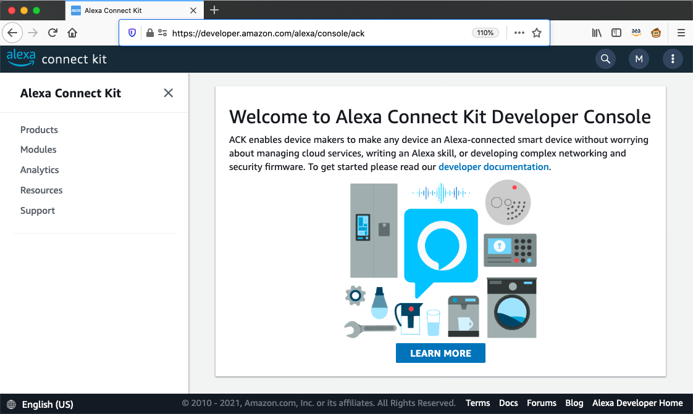
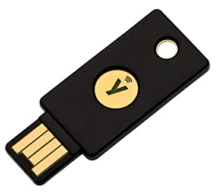

# 介绍
怎样才能使得Alexa Connect Kit(ACK)设备是被Alexa智能音箱或者Alexa App控制的呢? 本文将会分4个环节来详细介绍这背后的内部运作的细节原理 - **创建产品, 认证设备, 添加设备和操控设备**

# 创建产品
我们知道ACK设备和Alexa智能音箱或Alexa App的通信是通过AWS的云服务完成的. 可以参考视频[ACK Introuction][ack-intro]. AWS云端负责ACK产品的注册和管理, ACK的AWS云服务是由Amazon运维, 用户通过Amazon提供的[ACK终端接口][ack-console]来创建和管理产品.

<div align="center">

</div>

用户在ACK终端创建产品, 在Alexa Capabilites配置里选择该产品支持功能特性, 比如Power Control, Brightness Control等. 产品创建完成后, 系统为该产品产生了唯一的Product ID, Device Type以及ZTS key(DSS public key is used to verify the signature of requests from DSS), AWS云端把这些信息和内部的IoT core服务的Thing Name, MQTT Topics等关联起来, 用户无需关注AWS IoT Core的内部实现细节, 只要专注于Prduct ID, Device Type等和产品相关的信息. 

# 认证设备
那么终端硬件设备怎么和我们在ACK终端里创建的产品关联起来? 设备怎么可以访问云端的服务呢? 这里我们采用的方式是在互联网通信中广泛应用的数字证书方式来实现设备的认证和通信的安全. 

## Provision设备
ACK提供了已认证的WiFi/BLE模组, 比如Espressif和USI. 模组生产过程会被写入唯一的Device Serial Number(DSN), 模块的Device Type, Device ID, Public/Private密钥对等. 

用户拿到认证好的ACK WiFi模组并布置到硬件设备上, 要做Provision动作, 把和产品相关的信息作为输入参数来产生数字证书. Amazon提供了一个Java的电脑端应用程序Provisioner, 通过串口和ACK模组通信. 还提供和电脑连接的包含有此产品特定的非对称设备认证密钥(Asymmetric Device Attestation Key(DAK))和Private Key的Yubikey用于产生数字证书.

<div align="center">

</div>

* 首先Provisoner写入Product ID和Product Device Type到ACK模组
* 然后用模组内部的Public Key产生Certificate Signing Request(CSR),包含Product Device Type, ACK DSN和ACK Device ID.
* 再用Yubikey的DAK+Private Key产生完整认证链,包括含有Product Device Type, ACK DSN, ACK Device ID标题的X.509证书, 并写入ACK模组.
* 重启模组, 用Private Key加密一段随机信息,并用Public Key解密, 完成签名验签
* 写入lock bit来锁定ACK模组

这样我们就完成了设备的Provision. 

在开发阶段没有拿到Yubikey的情况下也可以采用网上认证的方式, Provisioner会发起认证请求, 用户登陆ACK终端的开发者账号允许访问请求, 云端会产生完整证书链发送回并写入ACK模组.

## 产生二维码
接着我们可以继续用JAVA Provisioner应用程序来产生这个硬件设备特定的Device Barcode和Package Barcode, 包含有Product ID, Public Key等信息, 方便以后扫码加载设备. 具体格式介绍可以参看[Provisionee 2D Barcode Specification][barcode]如下:

**Device Barcode**
```
ABV:IB01;SERNUM:G3A0PA01802300PE;PID:ebK3;PUK:MDkwEwYHKoZIzj0CAQYIKoZIzj0DAQcDIgADLZXG+MzHkCUT1F88yQpaiDW7vu8XDSIhJwsVr2bmmag=;PIN:957AD9640;
```

**Package Barcode**
```
ABV:OB01;SERNUM:G3A0PA01802300PE;PID:ebK3;PUK:MDkwEwYHKoZIzj0CAQYIKoZIzj0DAQcDIgADLZXG+MzHkCUT1F88yQpaiDW7vu8XDSIhJwsVr2bmmag=;UPC:841667145075;
```

Device Barcode也叫Inner Barcode, 放置在设备或者说明书上的, 最终用户可以通过扫描Device Barcode来添加设备到Alexa App里. 

Package Barcode也叫Outter Barcode, 放置在外包装上, 如果你产品是在Amazon商城售卖的, 那么仓库管理人员在出货时扫描这个二维码, 这个设备就和消费者的Amazon账号关联起来. 设备到家通电后会自动和家里的同一个Amazon账号的智能音箱通信,加入到家庭的智能设备列表里, 这个过程叫做Zero Touch Setup(ZTS), 极大提高用户体验.

# 添加设备
用户拿到ACK设备, 首次上电会进入5分钟的Ready for Setup模式, ACK模组蓝牙发送Beacon广播等待被发现. 用户在Alexa App里选择添加设备, 扫描Device Barcode, 然后开始Scan Beacon来发现正在广播Beacon的ACK设备, 比对必要信息后, Alexa App通过蓝牙和设备建立起连接. 这时会跳出一个附近可用的WiFi列表, 选择并输入WiFi密码. WiFi的信息会传递给ACK设备模组, 同时也存放在云端, 下次重新添加设备就不用再次输入WiFi密码. 
ACK模组通过WiFi连接到ACK云服务, 以设备的数字证书发起连接请求, 云端验证设备的的证书有效并保存. 然后ACK云服务会在AWS IoT上建立对应的Thing, ThingName, Device Shadow, Policy和Default Rule. 设备加入到Whitelist Certificate, 然后通知到用户找到新设备. 

# 操控设备
当通过Alexa智能音箱或者Alexa App发送控制指令, ACK设备是如何接受到指令?或者在ACK设备端进行人机交互, Alexa App又是如何得知ACK设备的状态变化呢?

ACK的云服务构建于AWS之上, AWS提供了IoT Core服务来管理智能设备. IoT Core提供ThingName来唯一表示该智能设备, Shadow来缓冲设备和云端的状态变化. 智能设备和云端通过MQTT协议通信, 基于发布/订阅不同的主题来进行命令和状态的交互. 这方面的介绍可以参看视频[非洲灰鹦鹉通过Alexa控制灯的开关][parrot-alexa]. 

当我们通过Alexa App或者Alexa智能音箱发出控制命令, 指令会传递到ACK的云服务. 云端将指令发布到MQTT主题, 比如“**avs/ThingName/directive**”, 而ACK设备作为这个主题的订阅者收到指令. ACK设备执行完指令后产生event message并发布到MQTT主题, 比如“**/avs/ThingName/event**”. ACK的云服务作为这个主题的订阅者会收到ACK设备的消息.

当用户直接在ACK设备上进行人机交互, 设备将状态的变化发送到MQTT主题, 比如**aws/things/ThingName/shadow/update/accepted**. 作为订阅者的ACK云服务收到消息并反馈给Alexa States Reporting Listener Service(ASRLS), Alexa App上的显示状态做相应变化.


# 结束语
至此我们完成了ACK的开发者指南介绍, 大家有什么疑问欢迎在下面的评论区提出, 下次见.


[ack-console]:https://developer.amazon.com/alexa/console/ack
[barcode]:https://developer.amazon.com/docs/frustration-free-setup/provisionee-manufacturing-barcode-specification.html
[parrot-alexa]:https://www.bilibili.com/video/BV1Bp4y1b7Hc/
[parrot-alexa-yb]:https://www.youtube.com/watch?v=RTKvwu2UY6E&t=8s
[ack-intro]:https://www.bilibili.com/video/BV1Eh411v7BE