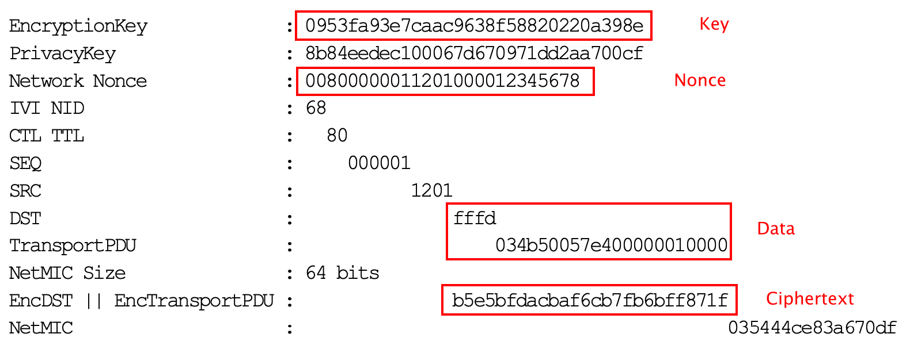

# 如何用Python实现AES CCM加解密
-----
# 1.简介
AES CCM被广泛应用于现代通讯中，在学习过程中需要验证数据的加解密的结果，那么有个方便修改的Python脚本工具就是一个迫切的需求。

# 2. 实施
我们下面介绍如何实现AES CCM的Python脚本语言
## 2.1  安装 pycryptodomex
假设你已经安装好了Python3.9（2020.11.11）。在命令行执行
```shell
pip3 install pycryptodomex
```
## 2.2 Python 脚本编写
打开编辑器，输入以下代码
```python
from Cryptodome.Cipher import AES
import binascii

data = binascii.unhexlify(b'fffd034b50057e400000010000')
nonce = binascii.unhexlify(b'00800000011201000012345678')
key = binascii.unhexlify(b'0953fa93e7caac9638f58820220a398e')

cipher = AES.new(key, AES.MODE_CCM, nonce=nonce)
ciphertext, tag = cipher.encrypt_and_digest(data)
print("ciphertext:", binascii.hexlify(ciphertext))

cipher = AES.new(key, AES.MODE_CCM, cipher.nonce)
decrptdata = cipher.decrypt_and_verify(ciphertext, tag)
print("decrptdata:",binascii.hexlify(decrptdata))
```
其中**data**变量是你要加解密的源数据；**nonce**在密码学中是一个只被使用一次的任意或非重复的随机数值; **Key**是用来加密的密钥。

## 2.3 验证
这里我们采用了蓝牙Mesh协议spec里面的样本数据来验证我们的脚本运行是否正确，如下图所示。

<div align="center">

</div>

运行脚本，输出结果显示加密后和解密后的数据与spec上的数值完全一致。
```shell
ciphertext: b'b5e5bfdacbaf6cb7fb6bff871f'
decrptdata: b'fffd034b50057e400000010000'
```

# 3. 总结
至此我们已经介绍了如何用Python脚本语言来轻松验证AES CCM的加解密结果，对于我们深入了解通讯协议内容更有帮助。 