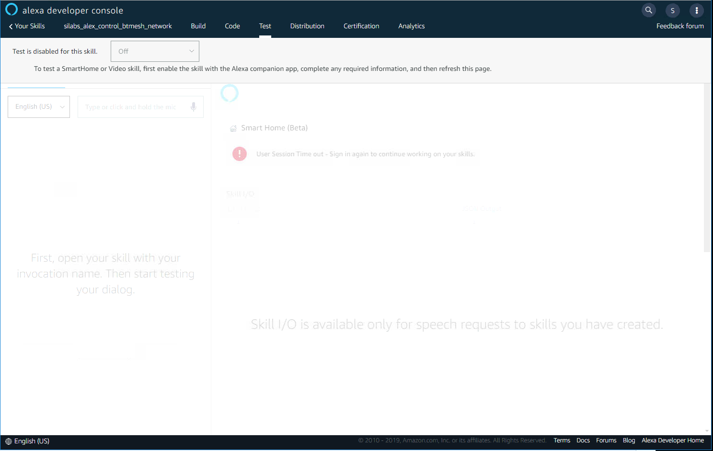

<details>   
<summary><font size=5>Table of Contents</font> </summary>

- [1. Project Background:](#1-project-background)
    - [1.1. Project Preparation:](#11-project-preparation)
- [2. Project Overview](#2-project-overview)
    - [2.1. Topology](#21-topology)
        - [2.1.1. Amazon Echo Plus 2](#211-amazon-echo-plus-2)
        - [2.1.2. AWS Lambda](#212-aws-lambda)
        - [2.1.3. Alexa Skill](#213-alexa-skill)
        - [2.1.4. AWS IoT Core](#214-aws-iot-core)
        - [2.1.5. AWS FreeRTOS](#215-aws-freertos)
        - [2.1.6. Bluetooth mesh network:](#216-bluetooth-mesh-network)
    - [2.2. Technical details:](#22-technical-details)
        - [2.2.1. Alexa Smart Home Skill](#221-alexa-smart-home-skill)
        - [2.2.2. Lambda function](#222-lambda-function)
        - [2.2.3. AWS IoT Core](#223-aws-iot-core)
        - [2.2.4. ESP32 and AWS freeRTOS](#224-esp32-and-aws-freertos)
        - [2.2.5. Bluetooth Mesh Network](#225-bluetooth-mesh-network)
        - [2.2.6. Communications](#226-communications)
- [3. Replication the project](#3-replication-the-project)
    - [3.1. Preparation](#31-preparation)
        - [3.1.1. Components:](#311-components)
        - [3.1.2. Software Used:](#312-software-used)
    - [3.2. Procedures:](#32-procedures)
        - [3.2.1. Create and Configure device within AWS IoT](#321-create-and-configure-device-within-aws-iot)
            - [3.2.1.1. Create AWS account](#3211-create-aws-account)
            - [3.2.1.2. Navigate to IoT Core Service](#3212-navigate-to-iot-core-service)
            - [3.2.1.3. Register Device in AWS IoT Registry](#3213-register-device-in-aws-iot-registry)
            - [3.2.1.4. Create an AWS IoT Policy](#3214-create-an-aws-iot-policy)
            - [3.2.1.5. Attach an AWS IoT Policy to a Device Certificate](#3215-attach-an-aws-iot-policy-to-a-device-certificate)
            - [3.2.1.6. Edit the Device Shadow](#3216-edit-the-device-shadow)
            - [3.2.1.7. Test the Created Device](#3217-test-the-created-device)
            - [3.2.1.8. Further Reading](#3218-further-reading)
        - [3.2.2. Create Alexa Smart Home Skill](#322-create-alexa-smart-home-skill)
            - [3.2.2.1. Create account on Amazon Developer Console](#3221-create-account-on-amazon-developer-console)
            - [3.2.2.2. Create your Smart Home Skill](#3222-create-your-smart-home-skill)
            - [3.2.2.3. Configure your Smart Home Skill (Step1)](#3223-configure-your-smart-home-skill-step1)
            - [3.2.2.4. Provide Account Linking Information](#3224-provide-account-linking-information)
            - [3.2.2.5. Configure your Smart Home Skill (Step2)](#3225-configure-your-smart-home-skill-step2)
            - [3.2.2.6. Test Your Skill](#3226-test-your-skill)
        - [3.2.3. Add a Lambda Function](#323-add-a-lambda-function)
            - [3.2.3.1. Create a lambda function](#3231-create-a-lambda-function)
            - [3.2.3.2. Configure the IAM Role for Lambda](#3232-configure-the-iam-role-for-lambda)
            - [3.2.3.3. Test the Lambda function](#3233-test-the-lambda-function)
            - [3.2.3.4. Further reading 2](#3234-further-reading-2)
        - [3.2.4. Download and set up freeRTOS SDK on ESP32:](#324-download-and-set-up-freertos-sdk-on-esp32)
            - [3.2.4.1. Download the project](#3241-download-the-project)
            - [3.2.4.2. Use CMake to generate project build files and build project](#3242-use-cmake-to-generate-project-build-files-and-build-project)
                - [3.2.4.2.1. Install ESP-IDF](#32421-install-esp-idf)
                - [3.2.4.2.2. Install CMake](#32422-install-cmake)
                - [3.2.4.2.3. Generate build file by CMake](#32423-generate-build-file-by-cmake)
                - [3.2.4.2.4. To build the application](#32424-to-build-the-application)
                - [3.2.4.2.5. Flash and Run Amazon FreeRTOS](#32425-flash-and-run-amazon-freertos)
            - [3.2.4.3. Add the custom source code for Alexa BTmesh Bridge](#3243-add-the-custom-source-code-for-alexa-btmesh-bridge)
                - [3.2.4.3.1. Choose the shadow demo and Build the esp32 program](#32431-choose-the-shadow-demo-and-build-the-esp32-program)
                - [3.2.4.3.2. Configure permission related setting](#32432-configure-permission-related-setting)
                - [3.2.4.3.3. Configure certification information](#32433-configure-certification-information)
                - [3.2.4.3.4. Configure the serial port of ESP32](#32434-configure-the-serial-port-of-esp32)
        - [3.2.5. Create the Bluetooth Mesh network](#325-create-the-bluetooth-mesh-network)
            - [3.2.5.1. Build EFR32BG13 embedded provisioner program](#3251-build-efr32bg13-embedded-provisioner-program)
            - [3.2.5.2. Build MG21 Bluetooth mesh light/switch/sensor/sensor monitor program](#3252-build-mg21-bluetooth-mesh-lightswitchsensorsensor-monitor-program)
        - [3.2.6. Control the light node from Alexa App](#326-control-the-light-node-from-alexa-app)
- [4. To-do](#4-to-do)
- [5. Conclusion:](#5-conclusion)

<!-- /TOC -->

</details>


# 1. Project Background:
As the development of the smart home market, the need for controlling smart devices using human voice grows rapidly. The leading companies all over the world introduced many different solutions in the area of smart home to satisfy their customers’ requirements. Among those solutions, the most popular pattern is to control smart devices via a central smart speaker, which listens to the user’s voice command and responds with actions, such as turning on/off smart lights, adjusting the room temperature through sending remote signals to the AC, and even cooking a nice meal by operating an intelligent robot. 
However, one thing often happens that breaks this good image is that the customers often find the smart speaker does not support their smart devices. That happens mainly due to one big reason—the communicating protocols used by the smart speaker and the endpoint device are not same.  
Currently, there are three protocols mostly used in the smart home industry: Bluetooth mesh, Zigbee, and Z-Wave. In Chinese and the U.S. market, Bluetooth mesh and Zigbee are the mainly used protocols due to their many advantages, such as low power consumption, extendible network size, and strong security.  
In the US, the Zigbee is selected by Amazon as the communicating protocol between its smart speaker brand —Amazon Echo -- and the various smart devices in its ecosystem.  
While in China, the Bluetooth mesh is the primary protocol that most smart devices company are using. Therefore, the Amazon Echo is not able to control those devices due to the incompatible communicating protocol.  
In this project, a solution is proposed to solve this problem.  
A Bluetooth mesh network is going to be controlled by an Amazon Echo Plus 2 via cloud-to-cloud approach. The user can turn on and turn off a Bluetooth mesh light by giving a voice command to the Echo Plus.  

## 1.1. Project Preparation:
* Install the Alexa App in you iOS device. Note that the Alexa App is only available for some special regions, for e,g. US, you need to Login the AppStore with a special Apple ID. And below is an Apple ID hosted by APAC regional apps team, you can feel free to use it.
   * UserName: xxxxxxxxxxxxx_apac@outlook.com  
   * Password: xxxxxxxxxxxxx  
* Register the Amazon with your own account or use the available account below. For this demonstration, we have registered the account as below.
   * UserName: xxxxxxxxxxxxx_apac@outlook.com  
   * Password: xxxxxxxxxxxxx
* Also you can / should Sign-in the Alexa App with the same account as above.
* If Amazon requests for account verification with email, please sign in the outlook with the account below.
   * UserName: xxxxxxxxxxxxx_apac@outlook.com  
   * Password: xxxxxxxxxxxxx  

* Register AWS in https://portal.aws.amazon.com/billing/signup#/start. The AWS is used for holding the lambda function, and credit card information is needed for registering a new account of the AWS.
   * The account information for AWS is not public.
   * UserName: yuancheng@xxxxxx
   * Password: xxxxxxxxxxxxx

# 2. Project Overview
## 2.1. Topology
Below is the block diagram of this project.
<div align="center">
  
</div>

### 2.1.1. Amazon Echo Plus 2
Amazon Echo is a brand of smart speakers developed by Amazon. Echo devices connect to the voice-controlled intelligent personal assistant service Alexa, and the Echo Plus has a built-in Zigbee hub to easily setup and control your compatible smart home devices.

### 2.1.2. AWS Lambda
AWS Lambda lets you run code without provisioning or managing servers. You pay only for the compute time you consume - there is no charge when your code is not running. 
With Lambda, you can run code for virtually any type of application or backend service - all with zero administration. Just upload your code and Lambda takes care of everything required to run and scale your code with high availability. You can set up your code to automatically trigger from other AWS services or call it directly from any web or mobile app.
<div align="center">
  
</div>

### 2.1.3. Alexa Skill
The Alexa skill is the bridge that connects the users to AWS IoT could.  
After Amazon Echo receiving the user’s voice commands, it will sent the voice record to AWS Alexa server(AI assistant server), where interprets the voice command to control directives. Then, the Alexa server sends the directives to lambda server, **a place running the skill code**. In the Lambda server, the specific action is executed according to the content of the directives. For example, if the user says “Alexa, turn on my light”, the Alexa will analysis this voice command and sending a JSON formatted file which listed a bunch of information about the light and actions to be executed to lambda, and then lambda will modify the light status from “OFF” to “ON” in the database.

### 2.1.4. AWS IoT Core 
AWS IoT Core is a powerful platform to manage IoT devices remotely. It has a service called **Thing Shadow**, which is a JSON document recording the information of the devices it manages. In this project, the AWS IoT plays the role of the system database. It records every device’s status in the Thing Shadow document and could be visited by ESP32 via the integrated [AWS freeRTOS](#aws-freertos) SDK.
**Thing Shadows**: a JSON document that is used to store and retrieve current state information.

### 2.1.5. AWS FreeRTOS  
AWS freeRTOS is running on ESP32 board. It connects the local network to the AWS cloud.  
ESP32: ESP32 is the gateway in this project. When it runs, it continuously gets the Thing Shadow document from the AWS IoT Core, and then it translates the JSON directives to simple character strings. Through UART communication, it passes the commands to the provisioner in the Bluetooth Mesh network, and the provisioner will give the specific directives to appointed devices.

### 2.1.6. Bluetooth mesh network:
In this project, a simple Bluetooth network is created that includes two mesh node and of course a provisioner.  
The provisioner in the network to provision new devices and receive commands from ESP32 via UART, and also parse the commands from ESP32 and transfer to the mesh command and transmit it to the mesh network for controlling other nodes.  
There are total two Bluetooth mesh nodes in the network, a light node and a switch node. Once the user presses the button on the switch node, the light node would receive a BLE mesh message and turn on/off the embedded LED on it.  

<div align="center">
  
</div>

<div align="center">
  
</div>

Also, the switch node is capable to change the online shadow document. When the user give it a long press on left button, the switch node will send a message to provisioner to update the online shadow document.

<div align="center">
  
</div>

## 2.2. Technical details:
In this section, the technical details below will be introduced.
* Alexa Smart Home Skill
* Lambda function
* ESP32 freeRTOS application
* Bluetooth Mesh provisioner

sample codes, including lambda function, Alexa smart home skill, ESP32 freeRTOS application, and the codes of the Bluetooth Mesh provisioner (based on EFR32BG13) will also be explained.  

However, because of the limited length of this article, if the reader wants to replicate this project, please read the section of [Replication the project](#replication-the-project) for the step by step guidance, and access the GitHub page: [Alexa Control Bluetooth Mesh Devices](https://github.com/ChengYuan-CY/Alexa-Control-Bluetooth-Mesh-Devices) and find the mentioned packages accordingly.

### 2.2.1. Alexa Smart Home Skill
Alexa smart home skill interface is designed for controlling smart home devices using Amazon Echo series smart speaker by Amazon. In this project, an Echo plus 2 was utilized to receive the voice command and transmit the voice command to the Alexa server.
The skill is held by a lambda function, which means the code is running on the Amazon lambda server. When a user gives the smart speaker a voice command, the command will be firstly analyzed on Alexa server. Then, a JSON format directive will be sent to lambda. There are many different directives. The most important one is the discovery directive, which indicates the speaker to find any available devices and report back to the Alexa server.
In this project, the response is also generated by the same lambda function. After receiving the discovery directive, the lambda function will directly send a response message back. Therefore, the device information needs to be programmed in the codes.

```
if namespace == 'Alexa.Discovery':  
    if name == 'Discover':  
        adr = AlexaResponse(namespace='Alexa.Discovery', name='Discover.Response')  
        #create capability part for the response  
        adr = create_discover_response(adr)               
        return send_response(adr.get())   
```

The “```AlexaResponse()```” function is used to generate the response — a JSON document. It uses **kwags parameter to receive whatever the user appointed attributes. Among those attributes, the “namespace” and “name” is necessary to add. Alexa server will use this information to identify what the response is and give a feedback to the user.

```
#create the discover response   
#first create the capabilities that the endpoints need   
#then add the endpoints to the response entity, and add the capability information to the endpoints  
def create_discover_response(response):  
    #general response  
    capability_alexa = response.create_payload_endpoint_capability()  
    #specific capabilities  
    #power controller--turn on turn off operations  
    capability_alexa_PowerController = response.create_payload_endpoint_capability(  
        interface='Alexa.PowerController',  
        supported=[{'name': 'powerState'}])  
    #create colorcontroller capability  
    capability_alexa_ColorController = response.create_payload_endpoint_capability(  
        interface='Alexa.ColorController',  
        supported=[{'name': 'color'}])  
    #create brightnessController capability  
    capability_alexa_BrightnessController = response.create_payload_endpoint_capability(  
        interface='Alexa.BrightnessController',  
        supported=[{'name': 'brightness'}])  
    #create colortemperature capability  
    capability_alexa_ColorTemperatureController = response.create_payload_endpoint_capability(  
        interface='Alexa.ColorTemperatureController',  
        supported=[{'name': 'colorTemperatureInKelvin'}])  
    #create lock controller capability  
    capability_alexa_lockcontroller = response.create_payload_endpoint_capability(  
        interface='Alexa.LockController',  
        supported=[{'name':'lockState'}]  
    )  
    capability_alexa_endpointHealth = response.create_payload_endpoint_capability(  
        interface='Alexa.EndpointHealth',  
        supported = [{'name':'connectivity'}]  
    )       
```

The ```capability``` and ```endpoint``` id compose the virtual representation of a smart device. One device can simultaneously own several different capabilities. For example, a light can support PowerController, ColorController, and ColorTemperatureController capabilities to control the on/off, color, and temperature attributes.
After constructing the capabilities of the device, we also need to add other device information and the endpoint id to the response.

```
response.add_payload_endpoint(  
    friendly_name='Sample Switch',  
    endpoint_id='sample-switch-01',  
    manufactureName = 'silicon labs',  
    display_categories = ["SWITCH"],  
    discription = 'silicon labs product',   
    capabilities=[capability_alexa, capability_alexa_PowerController])  
```

The "```display_categories```" item will tell Alexa what type of the device is. Alexa will show the corresponding icon on the Alexa phone application.
The discovery response is needed only once. It is similar to the process of registering the device to Alexa server. After this registration, Alexa is connected to the smart devices; the user can see the device on the Alexa application.  
Every time Alexa gives a directive, the lambda function will respond a corresponding message to Alexa and execute the directive via changing the status of the device on the IoT core. In the lambda function, every controller interface needs a specific method to handle.  

```
def respond_brightnessControl_dir(request):  
    # Note: This sample always returns a success response for either a request to TurnOff or TurnOn  
    endpoint_id = request['directive']['endpoint']['endpointId']  
    correlation_token = request['directive']['header']['correlationToken']  
    token = request['directive']['endpoint']['scope']['token']  
    name = request['directive']['header']['name']  
    #get the brightness from the directive  
    brightness_value = request['directive']['payload']['brightness']  
    thingshadow_updated = update_thing_shadow(thing_name_id=endpoint_id,brightness=brightness_value)  
      
    #check the operation if successful  
    if not (thingshadow_updated):  
        return AlexaResponse(  
        name='ErrorResponse',  
        payload={'type': 'ENDPOINT_UNREACHABLE', 'message': 'Unable to reach endpoint database.'}).get()  
    #abtr: alexa brightness response  
    abtr = AlexaResponse(  
        coorelation_token = correlation_token,  
        endpoint_id=endpoint_id,  
        token = token)      
    abtr.add_context_property(namespace = 'Alexa.BrightnessController',name = "brightness",value = brightness_value)  
```

For instance, a brightness controlling directive for light could be executed and responded by the function above. The lambda function will first analyze the directive, extract the information such as the ```endpoint_id```, the ```correlation_token``` (which is used in response to Alexa), and the specific actions to be done. Then the lambda function will access to the IoT core, update the corresponding attribute information on the appointed virtual device using ```update_thing_shadow``` function. If the updating action is done successfully, lambda will give an acknowledging response to Alexa; else it will give an ```ErrorResponse```.  

### 2.2.2. Lambda function
As mentioned above, the **Lambda function** is the place to hold **Alexa skill**. The codes in the lambda function are basically the essence of the Alexa skill. However, to associate a Lambda function and an Alexa smart home skill, several steps need to be done. Please see the section [Replication the project](#replication-the-project) for the detailed steps for replicating this project on your end.
More information about the lambda function, please refer to the online documentation [EN](https://docs.aws.amazon.com/lambda/latest/dg/getting-started.html) | [CN](https://docs.aws.amazon.com/zh_cn/lambda/latest/dg/getting-started.html) provided by Amazon.
The lambda function has multiple servers in different areas of the world. However, some of them don’t support Alexa smart home skills. This project chooses **US East(N.Virgina)** server to hold the skill.
It is worth to mention the rating of the lambda function. The AWS lambda has free tiers for each user, up to 1,000,000 free requests per month. In this project, only requests to lambda function and IoT Core are used, so the free tier is totally enough.

<div align="center">
  
  <center> <b>Figure: AWS lambda free tiers</b> </center>
</div>  

### 2.2.3. AWS IoT Core
AWS IoT Core is another platform of AWS IoT service. It stores the status information of the remote IoT devices in a special service called Thing Shadow. Briefly speaking, the thing shadow is a JSON document for recording the real-time changes of the device status.

<div align="center">
  
  <center> <b>Figure: IoT Core Thing Shadow</b> </center>
</div>  

The Thing shadow can be modified by both lambda function and local mesh network. In this project, it has been set with four nested layers: state, desired/reported, device name, and attributes. 
The “state” and “desired/reported” is required for each document uploaded, and once the user uploads a new document, only the items in the new document will be updated. The rest of the items will remain the same value. Also, if the desired/reported sections are not the same value, the document will automatically generate a new section called delta, which records the differences between the desired section and reported section.

<div align="center">
  
  <center> <b>Figure: JSON document for thing shadow</b> </center>
</div>  

### 2.2.4. ESP32 and AWS freeRTOS
ESP32 is the network gateway and responsible for downloading the shadow document, uploading new shadow document, and forwarding directives to the local mesh network. It communicates with the provisioner of the mesh network via UART communication. The JSON document will be first converted to a local string directive and then sent to the provisioner board.  
The ESP32 board acquires shadow document from IoT core via MQTT protocol. On the IoT Core, each device has a virtual counterpart. To get the shadow document of a device, the user needs to publish a blank message to the MQTT topic ```$aws/things/device name/shadow/get```. The MQTT server will respond with the specified shadow document. Similar operations such as update the shadow and delete the shadow can also be done in this way.
The code in the ESP32 follows a linear structure. There are two ways to get the thing shadow from IoT console. 
For the first one, it begins with establishing internet connection and MQTT connection, then using the function “AwsIotShadow_Get” to acquire the shadow document continuously in an infinite loop. Once it obtained the shadow, it transfers the text into a more straightforward string directive. The provisioner will also give an acknowledging message with the same format after the directive has been executed. The esp32 will according to the message to update the thing shadow document in the next loop.
For the second one, the callback mechanism is used which will notify of different desired and reported Shadow states.
The second method is recommended, and you can find all of the source for these two methods from the [github](https://github.com/ChengYuan-CY/amazon-freertos/blob/master/demos/shadow/).

<div align="center">
  
  <center> <b>Figure: ESP32</b> </center>
</div>  

### 2.2.5. Bluetooth Mesh Network
The Bluetooth mesh network is composed of three parts: A switch node, a light node, and a provisioner node.
The provisioner in the network is responsible for establishing the mesh network, authorizing new devices, and receiving messages from outside. The provisioner program obeys the “event-driven” pattern in a big “switch” structure. Every coming event will have an event id and the even data. The application invokes different handler functions to extract information and give responses back according to the event id. Through using the UART interrupt, the provisioner can detect messages come from the esp32 board. Also, when the provisioner receives the event id, which indicates the status changes from mesh network endpoints, it will invoke the UART TX handler to send messages to the ESP32. Moreover, the switch node can control the light node. The provisioner also subscribed the switch node message, which means that it will receive a notification when the switch turns on or turns off the light. The status information of the node will be displayed directly on the Alexa phone application, and the user can also control the devices via the app.

### 2.2.6. Communications
This project uses different protocols to do communications among different parts. The MQTT protocol is utilized for communicating between the ESP32 and **AWS IoT Core** console, where the thing shadow document is stored; and the Bluetooth mesh is used to organize local devices. Between the ESP32 and the provisioner node in the mesh network, a self-defined simple UART protocol is also used to transmit the devices information and attribute information. Each packet of the UART protocol contains 41 char bytes, and the format is shown below.

<div align="center">
  
  <center> <b>Figure: UART packet format</b> </center>
</div>  
</br>

The first byte is used to identify what type of operation is. Currently, the operation supports only change device state; the following bytes are used to determine the device type, the attribute name, and the attribute value. What is worth to pay attention is that the attribute value possibly number or string, therefore, in the code it has to be adjusted using the function “atoi()”

<div align="center">
  
  <center> <b>Figure: Operation type definition</b> </center>
</div>  

<div align="center">
  
  <center> <b>Figure: Device type definition</b> </center>
</div>  

<div align="center">
  
  <center> <b>Figure: Attribute type definition</b> </center>
</div>  

<div align="center">
  
  <center> <b>Figure: Light default data definition</b> </center>
</div>  


*** 

# 3. Replication the project
In this section, a step-by-step instruction will be provided to the reader to replicate the project.
## 3.1. Preparation
### 3.1.1. Components: 
* 1. SiliconLabs Wireless starter kits x3 (EFR32xG12, EFR32xG13 or EFR32xG21)
* 2. Espressief ESP32-DevKitC or ESP-WROVER-KIT x1  
* 3. Wire jumpers x3  
* 4. CP210x kit(for debugging)  
### 3.1.2. Software Used:  
* 1. Simplicity Studio IDE  
* 2. Bluetooth mesh SDK v1.5.0 or above  
* 3. Amazon AWS freeRTOS SDK
* 4. Any serial port monitor tool (Tera Term)  

## 3.2. Procedures:
The picture below illustrates the block diagram of controlling Physical Device (that is Bluetooth Mesh devices in this project) via Amazon Echo. We will split the procedures as several parts below.
<div align="center">
  
</div>  
</br>

* [Create and Configure device within AWS IoT](#create-and-configure-device-within-aws-iot)
* [Create Alexa Skill](#create-alexa-skill)
* [Lambda function](#lambda-function)
* [Download and set up freeRTOS SDK on ESP32](#download-and-set-up-freertos-sdk-on-esp32)
* [Reference](#reference)

###	3.2.1. Create and Configure device within AWS IoT
<div align="center">
  
</div>  
</br>

AWS IoT provides secure, bi-directional communication between internet-connected devices such as sensors, embedded microcontrollers and the AWS Cloud. This makes it possible for you to collect telemetry data from multiple devices, and store and analyze the data. You can also create applications that enable your users to control these devices from their phones or tablets.
The tutorial below shows you how to create resources required to send, receive, and process MQTT messages from devices using AWS IoT. And the section [Download and set up freeRTOS SDK on ESP32](#download-and-set-up-freertos-sdk-on-esp32) show you how to use an MQTT client to emulate IoT device(s).

#### 3.2.1.1. Create AWS account
If you do not have an AWS account, create one by referring to the knowledge base [How do I create and activate a new Amazon Web Services account?](https://aws.amazon.com/premiumsupport/knowledge-center/create-and-activate-aws-account/). 

#### 3.2.1.2. Navigate to IoT Core Service
Log into [AWS IoT console](https://us-east-1.console.aws.amazon.com/iot/home?region=us-east-1#/dashboard), open the services and choose **N.Virginia** as the server. Because some of the necessary features (IoT Core, Amazon FreeRTOS, etc.) are only supported on this server, so it's recommended to choose this server, and continue the following steps.
Navigate to the **IoT Core Service**, below is the screenshot if you log into the AWS IoT console successfully.

<div align="center">
  
  <center> <b>Figure: AWS IoT console</b> </center>
</div>  

#### 3.2.1.3. Register Device in AWS IoT Registry
Devices connected to AWS IoT are represented by IoT things in the AWS IoT registry. The registry allows you to keep a record of all of the devices that are registered to your AWS IoT account.
Register a thing and name it as ```esp32_btmesh_bridge``` on your AWS console: 
click Manage -> Thing -> Register a thing -> Create -> Create a Single thing -> Create certificate -> Download the certificate and Activate. 
**Note**: Carefully preserve the thing certificates downloaded. The keys will be used in the amazon freeRTOS SDK running on the ESP32.

<div align="center">
  
  <center> <b>Figure: Create a thing</b> </center>
</div>  
</br>

#### 3.2.1.4. Create an AWS IoT Policy
AWS IoT policies are used to authorize your device to perform AWS IoT operations, such as subscribing or publishing to MQTT topics. Your device presents its certificate when sending messages to AWS IoT. To allow your device to perform AWS IoT operations, you must create an AWS IoT policy and attach it to your device certificate.
Go back to console -> secure -> policy -> create. The policy statements define the types of actions that can be performed by a resource, you can just follow the screenshot below to set your statement for this policy.

<div align="center">
  
  <center><b>Figure: Create a policy in this interface</b></center>
</div>  
</br>

After creating the policy, the UI will similar like below.
<div align="center">
  
</div>  
</br>

#### 3.2.1.5. Attach an AWS IoT Policy to a Device Certificate
Go back to the console, open your thing ```esp32_btmesh_bridge```. Click Security -> Your certificate -> Policies -> Actions -> Attach Policy. And choose the Policy you created just now, and click Attach then.
<div align="center">
  
  <center> <b>Figure: Attach Policy</b> </center>
</div>  
</br>

Please don’t forget to check/modify the “Resource” of the policy and make sure it's like below.
```
{
  "Version": "2012-10-17",
  "Statement": [
    {
      "Effect": "Allow",
      "Action": "iot:Connect",
      "Resource": "arn:aws:iot:us-east-1:879362360571:*"
    },
    {
      "Effect": "Allow",
      "Action": "iot:Publish",
      "Resource": "arn:aws:iot:us-east-1:879362360571:*"
    },
    {
      "Effect": "Allow",
      "Action": "iot:Subscribe",
      "Resource": "arn:aws:iot:us-east-1:879362360571:*"
    },
    {
      "Effect": "Allow",
      "Action": "iot:Receive",
      "Resource": "arn:aws:iot:us-east-1:879362360571:*"
    }
  ]
}
```

#### 3.2.1.6. Edit the Device Shadow
A device's shadow is a JSON document that is used to store and retrieve current state information for a device. 
The Device Shadow service maintains a shadow for each device you connect to AWS IoT. You can use the shadow to get and set the state of a device over MQTT or HTTP, regardless of whether the device is connected to the Internet. Each device's shadow is uniquely identified by the name of the corresponding thing.

Click on the Manage -> Thing -> Your Things -> Shadow -> Edit, paste the initial shadow document below. The initial shadow document must have the same desired and reported section, if you want to change the shadow document, remember to change the shadow document template on both the Things board and Alexa skill, otherwise the program won’t run correctly.

<div align="center">
  
  <center><b>Figure: Shadow document</b></center>
</div>  
</br>

Below is the initial Shadow document utilized in this project.
```
{
  "desired": {
    "Lights": {
      "device info": "default information",
      "brightness": 55,
      "value": {
        "value": 0,
        "hue": 0,
        "saturation": 1,
        "brightness": 1
      },
      "colorTemperatureInKelvin": 3000,
      "ON_OFF": "OFF",
      "LightID": "sample-light"
    },
    "Switch": {
      "Switch value": "OFF"
    },
    "Lock": {
      "Lock value": "LOCKED"
    },
    "Thing name": "sample-switch-01",
    "color": "RED",
    "sequence": [
      "RED",
      "GREEN",
      "BLUE"
    ]
  },
  "reported": {
    "Lights": {
      "device info": "default information",
      "brightness": 55,
      "value": {
        "value": 0,
        "hue": 0,
        "saturation": 1,
        "brightness": 1
      },
      "colorTemperatureInKelvin": 3000,
      "ON_OFF": "OFF",
      "LightID": "sample-light"
    },
    "Switch": {
      "Switch value": "OFF"
    },
    "Lock": {
      "Lock value": "LOCKED"
    },
    "Thing name": "sample-light",
    "color": "GREEN"
  },
  "delta": {
    "Thing name": "sample-switch-01",
    "color": "RED",
    "sequence": [
      "RED",
      "GREEN",
      "BLUE"
    ]
  }
}
```
#### 3.2.1.7. Test the Created Device
After creating the Things, you can use the test function on AWS IoT console to check if the rule that using the MQTT works or not.
Click on the “Interact” option, choose the corresponding topic which represents the operations that you wish to do, subscribe to the topic. Below are the all available MQTT topics for subscribe or publish. For example, you can publish the message to the topic ```$aws/things/<things Name>/shadow/update``` to update the thing shadow, and subscribe to the MQTT topics ```$aws/things/<things Name>/shadow/update/accepted``` and ```$aws/things/<things Name>/shadow/update/documents``` for the accepted messages, also you can monitor the topic ```$aws/things/<things Name>/shadow/update/rejected``` for debugging purpose. If the message was rejected, you can get the error code by subscribing the ```$aws/things/<things Name>/shadow/update/rejected``` topic.
Receiving the MQTT message via the subscribing topic ```$aws/things/<things Name>/shadow/update/accepted``` means that the thing shadow works now.

<div align="center">
  
  <center><b>Figure: Topic to subscribe</b></center>
</div>  
</br>  

<div align="center">  
    
  <center><b>Figure: Subscribe the topic and publish content you want</b></center>  
</div>  
</br>  

You can find an example shadow document [here](https://docs.aws.amazon.com/iot/latest/developerguide/using-device-shadows.html). When you send shadow update messages to the topic ```$aws/things/<shadow-name>/shadow/update```, please make sure it at least contains the **state** field.
You can use the message below directly for replicating this project.

```
{
  "state": {
    "desired": {
      "Lights": {
        "device info": "default information",
        "brightness": 85,
        "value": {
          "value": 0,
          "hue": 0,
          "saturation": 1,
          "brightness": 1
        },
        "colorTemperatureInKelvin": 3000,
        "ON_OFF": "ON",
        "LightID": "sample-light"
      },
      "Switch": {
        "Switch value": "OFF"
      },
      "Lock": {
        "Lock value": "LOCKED"
      },
      "Thing name": "sample-light"
    },
    "reported": {
      "Lights": {
        "device info": "default information",
        "brightness": 55,
        "value": {
          "value": 0,
          "hue": 0,
          "saturation": 1,
          "brightness": 1
        },
        "colorTemperatureInKelvin": 3000,
        "ON_OFF": "OFF",
        "LightID": "sample-light"
      },
      "Switch": {
        "Switch value": "OFF"
      },
      "Lock": {
        "Lock value": "LOCKED"
      },
      "Thing name": "sample-light"
    }
  }
}
```
#### 3.2.1.8. Further Reading
Read the documentations below from Amazon for more information about the AWS IoT Service.
[Register a Device in the AWS IoT Registry](https://docs.aws.amazon.com/iot/latest/developerguide/register-device.html)
[Device Shadow Service for AWS IoT](https://docs.aws.amazon.com/iot/latest/developerguide/iot-device-shadows.html)

###	3.2.2. Create Alexa Smart Home Skill
**What is Lambda?**
AWS Lambda lets you run code without provisioning or managing servers. Alexa sends your code user requests and your code can inspect the request, take any necessary actions (such as looking up information online) and then send back a response. You can write Lambda functions in Node.js, Java, Python, C#, or Go.
**What is Alexa Smart Home Skill?**
Alexa provides a set of built-in capabilities, referred to as skills. The smart home skill lets a user control and query cloud-enabled smart home devices such as lights, door locks, cameras, thermostats and smart TVs.
**The relationship between Skill and Lambda?**
The code for your smart home skill is hosted as a Lambda function on AWS.
For a skill that controls smart home devices such as lights, thermostats, and entertainment devices you can use the Smart Home Skill API. In this case, you develop an AWS Lambda function that running n the Lambda to accept device directives from Alexa.
You provide code to handle directives in an AWS Lambda function. Your skill receives requests in the form of device directives to control a particular device. Your code then handles the request appropriately (for example, by turning on the requested light or turning up the volume).

After creating and configuring device within AWS IoT, we need to create Alexa Smart Home Skill.
<div align="center">
  
</div>
</br>

#### 3.2.2.1. Create account on Amazon Developer Console
To configure a new smart home skill, you need an account on the Amazon Developer Console. If you don't already have an account, go to https://developer.amazon.com/alexa/console/ask and create an account. Sign in the [Alexa developer console](https://developer.amazon.com/alexa/console/ask) with your amazon account.

#### 3.2.2.2. Create your Smart Home Skill
Choose Create skill->Smart Home->Enter the skill name->Create. Once you created the Smart Home Skill, <span id = "YourSkillID"><font color="red">Your Skill ID</font></span> will be assigned that will used by Lambda function.

<div align="center">
  
</div>
</br>

<div align="center">
  
</div>
</br>

Jump to the next section to [Add a Lambda Function](#add-a-lambda-function) and <span id = "backToSkillDeveloperConsole"><font color="red">then back to here</font></span>.


#### 3.2.2.3. Configure your Smart Home Skill (Step1)
You must provide the ARN for your Lambda function in the skill configuration in the developer console.
Navigate back to your skill in the Developer Console. Under **2. Smart Home service endpoint**, in the **Default endpoint** box, provide the ARN number from the Lambda function you created and click Save.
Therefore, the skill is associated with the lambda function.

<div align="center">
  
</div>   
</br>

<div align="center">
  
  <center> <b>Figure: Lambda function adding Alexa smart home trigger</b> </center>
</div>  

#### 3.2.2.4. Provide Account Linking Information
**Question**: What is Account Linking?
**Answer**: Account linking enables your skill to connect the user's identity with their identity in a different system. All smart home, video, and meetings skills must connect the identity of the Alexa user with an identity in the service provider's system. This is known as account linking, because the goal is to create a link between the Alexa user and the service provider. For more information about the Account Linking, please see the section [Further Reading 2](#further-reading-2)

After you created the skill, the first step is to setup the account linking. Smart Home skills require that a user completes account linking during skill enablement. This step asks customers to associate their device cloud account with your smart home skill. You will need an OAuth provider in order to implement this process. If you don't already have an OAuth provider, you can use Login with Amazon (LWA).  

**Setup the LWA**:
For a skill that includes the smart home, video, baby activity, or meetings model, the account linking is required. Account linking must be configured with authorization code grant.
https://developer.amazon.com/docs/devconsole/build-your-skill.html#account-linking

* i. Connect to https://developer.amazon.com/login.html and authenticate with your Amazon credentials.
* ii. Click "Login with Amazon"
* iii. Click on “Create a New Security Profile”

<div align="center">
  
</div> 

* iv. Fill in all three required fields to create your security profile and click “Save”. 
For the “Consent Privacy Notice URL”, please fill it with your own privacy notice URL. If there is no privacy notice, you can just fill it with ```https://www.privacypolicies.com/blog/gdpr-consent-examples/```.

<div align="center">
  
</div> 

* v. Before you complete this step, be sure to click on the link named “Show Client ID and Client Secret” and save these values to a secure location so they're easily available later. You’ll need these values later in a next step.  

<div align="center">
  
</div> 


#### 3.2.2.5. Configure your Smart Home Skill (Step2)
* i. Go back to https://developer.amazon.com/home.html and sign in as needed
* ii. Go to Alexa > Alexa Skills Kit > the Alexa skill you created earlier
* iii. In the Configuration tab:
* iv. Lambda ARN default = enter your <a href="#LambdaARN" target="_self">Lambda ARN</a> noted in the next section.
* v. Authorization URI = https://www.amazon.com/ap/oa
* vi. Access Token URI = https://api.amazon.com/auth/o2/token
* vii. Client ID = your client ID from LWA noted in a previous step
* viii.	Client Secret: your client secret from LWA noted in a previous step
* ix. Client Authentication Scheme: HTTP Basic (Recommended)
* x. Scope: profile (click *Add Scope* first to edit it)
* xi. Click Save
* xii. Provide the Redirect URL's (as illustrated in the following screenshot) to LWA:
* xiii. The Configuration page for your Skill lists several Redirect URL's. Open the LWA security profile you created earlier and visit the Web Settings dialog. Provide each of the Redirect URL values from your Skill in the “Allowed Return URLs” field.

After mutual association, the second step would be account linking. On the Alexa console, click on the account linking option, input the authorization URI and the access token URI as shown below.

<div align="center">
  
  <center> <b>Figure: Account linking</b> </center>
</div>  
</br>

<div align="center">
  
</div>  
</br>

#### 3.2.2.6. Test Your Skill
Amazon console also supports the skill-testing.
However, to test a SmartHome or Video skill, you need first enable the skill with the Alexa companion app (cannot finish it with webpage).
<div align="center">
  
</div>  
</br>

<div align="center">
  
</div>  
</br>

And then you can try to discovery new devices with the App. After finishing the discoverying process, it will list all of the devices it discovered.
<div align="center">
  
</div>  
</br>

Then you can control all of the discovered devices with the Alexa App, also you can test them on the [Alexa developer Console](https://developer.amazon.com/alexa/console/ask).
The developer can choose either typing or using JSON formatted directive to test the Alexa skill. It simulates a real echo plus speaker to send the directives to the server where holding the Alexa skill.
For example, if the user type or say “turn off light”, the Alexa server will send a turn-off directive to the lambda(the skill holder server).

<div align="center">
  
  <center> <b>Figure: Skill-testing</b> </center>
</div>  

###	3.2.3. Add a Lambda Function
#### 3.2.3.1. Create a lambda function
The code for your smart home skill is hosted as a Lambda function on AWS. AWS Lambda is a service that lets you run code in the cloud without managing servers. Alexa sends your skill requests and your code inspects the request, takes any necessary actions such as communicating with the device cloud for that customer, and then sends back a response.

1.	Go to https://console.aws.amazon.com/console/home and sign in
2.	Switch the AWS server to “US East (N.Virginia)” on the top right of the page, because some of the features are only supported on this server. Below is the recommended service for different regions.
* N.Virginia for English (US) or English (CA) skills
* EU (Ireland) region for English (UK), English (IN), German or French (FR) skills
* US West (Oregon) for Japanese and English (AU) skills.

3.	Go to Services > Compute > Lambda
4.	Click on Create Function
5.	Click on “Author from scratch”
6.	Configure your Lambda function
* Name = alexaBtmeshBridgeLambda (or whatever you want)
* Runtime = Python 3.6 (You can choose any language used to write your function, in this demo, we are using Python 3.6)
* Permission = “Create a new role with basic Lambda permissions”
* Click Create Function

<div align="center">
  
</div>  
</br>

7.	Click Triggers -> Add Trigger and select **Alexa Smart Home**
* Application Id = <a href="#YourSkillID" target="_self">Skill ID</a> of your test skill that your created above.
* Enable trigger = checked
* Click Submit

<div align="center">
  
</div>  
</br>

8.	Click the icon of the lambda function for Configuration

<div align="center">
  
</div>  
</br>

Regarding to the lambda function, we take the *Alexa Smart Home skill sample* released by Amazon as starting point, you can access it from the repository [skill-sample-python-smarthome-switch](https://github.com/alexa/skill-sample-python-smarthome-switch). 
And also you can just reuse the lambda function we have implemented for this project, the zip package [**alexa-control-btmesh-lambda.zip**](./files/CM-Smart-Speaker/lambda_function/alexa-control-btmesh-lambda.zip) is included in the sub directory and also you can get it from the [github](https://github.com/ChengYuan-CY/Alexa-Control-Bluetooth-Mesh-Devices/tree/master/lambda_function).

* Runtime = Python 3.7
* Code entry type = select the "Upload a .ZIP file" (the Alexa skill package)
* Click on Upload and find the alexa-control-btmesh-lambda.zip you created earlier. The Things name is ```esp32_btmesh_bridge``` in the lambda_function.py, update it according to the real Thing name you created before.
* Handler = self_defined_lambda.lambda_handler
* Click Next
* Click Save
* After uploading the .ZIP file, please make sure that the lambda_function.py in the root folder.
* On the top right corner, note the <span id = "LambdaARN"><font color="red">Lambda ARN</font></span>.
* Lambda ARN: Copy the ARN and it will be used in the Alexa Skill section as mentioned above. 

And also please pay attention to the <span id = "ExistingRole"><font color="red">"Existing role"</font></span> of the Lambda function, we will configure the role in the next section [Configure the IAM Role for Lambda](#configure-the-iam-role-for-lambda).

<div align="center">
  
</div>  
</br>

After uploading the ZIP package successfully, please make sure that the directory structure is similar as below, and the lambda function file name should be lambda_function.py

<div align="center">
  
</div>  

#### 3.2.3.2. Configure the IAM Role for Lambda
IAM (AWS Identity and Access Management) is a web service that helps you securely control access to AWS resources. You use IAM to control who is authenticated (signed in) and authorized (has permissions) to use resources. 
Please see the [user guide](https://docs.aws.amazon.com/freertos/latest/userguide/freertos-account-and-permissions.html) for how to set up your account and permission with IAM.

To grant the role with the following policy, the <a href="#ExistingRole" target="_self">role</a> was created automatically during creating the Lambda function which is ```alexaBtmeshBridgeLambda-role-lft8jt47``` here.

Attach the following IAM policies to the role used by the Lambda function:
* AmazonFreeRTOSFullAccess
* AWSIoTFullAccess  
* AWSIoTDataAccess  
* AWSLambdaFullAccess  

<div align="center">
  
</div>  
</br>
After that, the Lambda function created above should able to access the following resources now.
<div align="center">
  
</div>  
</br>

<a href="#backToSkillDeveloperConsole" target="_self">Now navigate back to your skill in the Developer Console.</a> 

#### 3.2.3.3. Test the Lambda function
If you want to perform a quick test of the Discovery request in the Lambda code editor, you can click on Test. The Configure test event page appears.
Leave Create new test event selected. For Event template, leave the default Hello World. In the Event name, enter discovery and replace the entire contents in the editor with the following code.

```
{
    "directive": {
        "header": {
            "namespace": "Alexa.Discovery",
            "name": "Discover",
            "payloadVersion": "3",
            "messageId": "1bd5d003-31b9-476f-ad03-71d471922820"
        },
        "payload": {
            "scope": {
                "type": "BearerToken",
                "token": "access-token-from-skill"
            }
        }
    }
}
```

<div align="center">
  
</div>  
</br>

Do the Test, if successful, the Execution Result should be similar to the following:

```
{
  "event": {
    "header": {
      "namespace": "Alexa.Discovery",
      "name": "Discover.Response",
      "messageId": "00c40bcd-75e5-406e-a4d2-de476dbc7992",
      "payloadVersion": "3",
      "correlation_token": "INVALID"
    },
    "payload": {
      "endpoints": [
        {
          "capabilities": [
            {
              "type": "AlexaInterface",
              "interface": "Alexa",
              "version": "3"
            },
            {
              "type": "AlexaInterface",
              "interface": "Alexa.PowerController",
              "version": "3",
              "properties": {
                "supported": [
                  {
                    "name": "powerState"
                  }
                ],
                "proactivelyReported": true,
                "retrievable": true
              }
            }
          ],
          "description": "Sample Endpoint Description",
          "displayCategories": [
            "SWITCH"
          ],
          "endpointId": "sample-switch-01",
          "friendlyName": "Sample Switch",
          "manufacturerName": "Sample Manufacturer"
        },
      ]
    }
  }
}
```

#### 3.2.3.4. Further reading 2
[Steps to Build a Smart Home Skill](https://developer.amazon.com/docs/smarthome/steps-to-build-a-smart-home-skill.html#test-your-skill)

[Understand Account Linking](https://developer.amazon.com/docs/account-linking/understand-account-linking.html)

###  3.2.4. Download and set up freeRTOS SDK on ESP32:
#### 3.2.4.1. Download the project
Go to GitHub page to download the SDK or clone it by using git clone https://github.com/aws/amazon-freertos.git, and also you can clone the [forked amazon freeRTOS SDK](https://github.com/ChengYuan-CY/amazon-freertos) that we are using for this project.

#### 3.2.4.2. Use CMake to generate project build files and build project
Setup the SDK with correct Toolchains and establish the serial connection to your ESP32 board. The very detailed official instruction can be found HERE [EN](https://docs.aws.amazon.com/freertos/latest/userguide/getting_started_espressif.html) | [CN](https://docs.aws.amazon.com/zh_cn/freertos/latest/userguide/getting_started_espressif.html).

##### 3.2.4.2.1. Install ESP-IDF 
Read the page here [EN](https://docs.espressif.com/projects/esp-idf/en/v3.1.5/get-started-cmake/windows-setup.html) for how to get start with CMake on windows. 
ESP-IDF is the official development framework for the ESP32 chip. Please note that due to some compatibility issue, the version 3.1.5 of ESP-IDF (the version used by Amazon FreeRTOS) does not support the latest version of the ESP32 compiler. You must use the compiler that is compatible with version 3.1.5 of the ESP-IDF. The compatible compiler is provided within the installation package ```esp-idf-tools-setup-1.1.exe```, please get the installation package from the link above.

The installer will automatically install the **ESP32 Xtensa gcc toolchain**, **Ninja** build tool, and a configuration tool called **mconf-idf**. The installer can also download and run installers for CMake and Python 2.7 if these are not already installed on the computer. However, the CMake included in the installer is an elder version, for CMake installing method, please read the section [Install CMake](#install-cmake) below.

<div align="center">

</div>  
</br>

After setup has finished installing ESP-IDF tools, the GUI now should looks like this. 
   
<div align="center">

</div>  
</br>

Click the **Finish** button. By default, the ESP-IDF installer updates the Windows Path environment variable automatically so all of these tools can be run from anywhere.
<div align="center">

</div>  
</br>  

If you didn't see these path included in the System Environment, you will need to configure the environment where you are using ESP-IDF with the correct paths by yourself.

##### 3.2.4.2.2. Install CMake
Install the CMake (Cross-Platform Makefile Generator). The CMake build system is required to build the Amazon FreeRTOS demo and test applications for this device. Amazon FreeRTOS supports CMake versions 3.13 or above, and you can get download the latest version of CMake from [CMake.org](https://cmake.org/download/).

Form you native build system, it can be GNU Make or Ninja. Ninja is recommended by Amazon since it is faster than Make and also provides native support to all desktop operating systems. And we also use the Ninja in this project.

##### 3.2.4.2.3. Generate build file by CMake
Use the following CMake command to generate the build files, and then use ```ninja``` to build the application.
```cmake -DVENDOR=espressif -DBOARD=esp32_devkitc -DCOMPILER=xtensa-esp32 -GNinja -S . -B your-build-directory```

##### 3.2.4.2.4. To build the application
Change directories to the build directory ```your-build-directory``` you just specified above, i.e, ```build```.
Invoke Ninja to build the application.
```ninja```
<div align="center">

</div>  
</br>

##### 3.2.4.2.5. Flash and Run Amazon FreeRTOS
Establish serial connection between your host machine and the ESP32 kit. You must install CP210x USB to UART Bridge VCP drivers. You can download these [drivers](https://www.silabs.com/products/development-tools/software/usb-to-uart-bridge-vcp-drivers) from Silicon Labs.

Use Espressif's IDF utility ( amazon-freertos/vendors/espressif/esp-idf/tools/idf.py ) to flash your board, run the application, and see logs.
To erase the board's flash, go to the <amazon-freertos> directory and use the following command:  
```python ./vendors/espressif/esp-idf/tools/idf.py erase_flash -p COM17 -B build```

To flash the application binary to your board, use the IDF script to flash your board:
```python ./vendors/espressif/esp-idf/tools/idf.py flash -p COM17 -B build```

To monitor:
```python ./vendors/espressif/esp-idf/tools/idf.py monitor -p COM17 -B build```

You can combine these commands. For example, suppose the com port of your ESP32 kit is COM5:
```python ./vendors/espressif/esp-idf/tools/idf.py erase_flash flash monitor -p COM17 -B build```  

Make sure that you can build the default demo, and flash it to the ESP32 kit, and also can get debug log output on the console.

#### 3.2.4.3. Add the custom source code for Alexa BTmesh Bridge

Please carefully read the [documentation page](https://docs.aws.amazon.com/freertos/latest/userguide/freertos-getting-started.html) on how to setup the AWS freeRTOS SDK on your computer. The chinese version documentation is available [here](https://docs.aws.amazon.com/zh_cn/freertos/latest/userguide/freertos-getting-started.html).  

#####	3.2.4.3.1. Choose the shadow demo and Build the esp32 program 
In the file: ```…/vendors/espressif/boards/esp32/aws_demos/config_files/aws_demo_config.h```, enable the shadow demo by ```#define CONFIG_SHADOW_DEMO_ENABLED```.
If you are using the amazon freeRTOS sdk cloned from Amazon repo, please open the SDK folder, in the folder …/demos/shadow, replace the C file ```aws_iot_demo_shadow.c``` with the provided [aws_iot_demo_shadow.c](https://github.com/ChengYuan-CY/amazon-freertos/blob/master/demos/shadow/aws_iot_demo_shadow.c) file. Also, add the file [aws_iot_shadow_blem.h](https://github.com/ChengYuan-CY/amazon-freertos/blob/master/demos/shadow/aws_iot_shadow_blem.h) to the folder.   

###### 3.2.4.3.2. Configure permission related setting
The WiFi settings can be done in the file ```…/demos/include/aws_clientcrediential.h```
Set ```clientcredentialMQTT_BROKER_ENDPOINT``` as your AWS IoT endpoint. You can find it from the Things' interact information.
<div align="center">

</div>  
</br>  

Set ```clientcredentialIOT_THING_NAME``` to the unique name of your IoT Thing.
Set ```clientcredentialWIFI_SSID``` to your network name.
Set ```clientcredentialWIFI_PASSWORD``` as your password.  

###### 3.2.4.3.3. Configure certification information
Paste the certificate you acquired when you create the “esp32_btmesh_hub” thing on AWS IoT console to the file ```…/demos/includes/aws_clientcrediential_keys.h```.

Alternatively, you can use the quick setup which instructed on [this page](https://docs.aws.amazon.com/freertos/latest/userguide/getting_started_espressif.html) under Configure the Amazon FreeRTOS Demo Applications section.  

###### 3.2.4.3.4. Configure the serial port of ESP32
The esp32 will parse and forward the received MQTT message to the bluetooth provisioner (EFR32BG13) via uart port, so you need to configure the serial port for ESP32. GPIO16 and GPIO17 of ESP32 are configured as Tx and Rx pin in this project.  
```
#define ECHO_TEST_TXD (GPIO_NUM_16)
#define ECHO_TEST_RXD (GPIO_NUM_17)
```
### 3.2.5. Create the Bluetooth Mesh network
#### 3.2.5.1. Build EFR32BG13 embedded provisioner program
a.	Download the [provisioner project](https://github.com/ChengYuan-CY/Alexa-Control-Bluetooth-Mesh-Devices/tree/master/BluetoothMeshProvisioner).
b.	Open the project in simplicity studio, build, flash to BG13 board

#### 3.2.5.2. Build MG21 Bluetooth mesh light/switch/sensor/sensor monitor program
a.	The mesh light and switch are using the demo applications in the simplicity studio Bluetooth mesh SDK v1.5.0, you can use other Bluetooth mesh light device in this project.
b.	The mesh switch application is also the demo program in simplicity studio, it has three functions: adjusting the lightness of the light, adjusting the temperature, turning on/off the light. A long press will turn on/off the light, a short press will adjust the lightness, and a normal press will change the temperature. Currently, the provisioner only subscribes the on/off function, when the user give it a short press or long press, the provisioner will report the light’s on/off status to IoT console(while the lightness is not 0, the light’s on/off state will be “ON”).
c.	Sensor/monitor program. The sensor/monitor program is only available after the version 1.5.0 of the Bluetooth mesh SDK. Currently, the IoT console doesn’t monitor the state of the sensor. Once the sensor and the monitor are provisioned, they are functioning as local devices. 

**Bluetooth mesh network operation**
a.	Flash the provisioner program to the BG13 board.
b.	Hold left button and reset button to reset the board
c.	Flash the switch program and light program into board
d.	Open a COM tool and connect it to the BG13 board, when seeing the prompt to provision the switch board and light board, press left button to provision.

### 3.2.6. Control the light node from Alexa App
As the Alexa App has discovered all of the device we defined in the ESP32_btmesh_bridge Things, and you can control the bluetooth mesh node by using the Alexa App now.

# 4. To-do
Port EFR32 on Amazon FreeRTOS. And then we can interface to AWS IoT by using the combination of EFR32+WGM160P.

# 5. Conclusion:
This project uses multiple protocols and Amazon AWS services. It breaks the limitation between the Zigbee embedded smart speaker and Bluetooth mesh embedded smart devices and realizes voice control. Although it is just a brief demonstration, it reveals the potential of multi-platform cooperation and smart automation.
