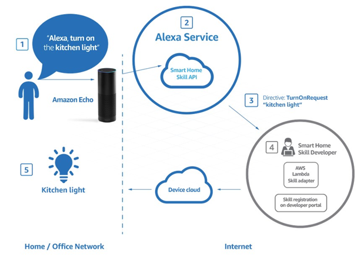
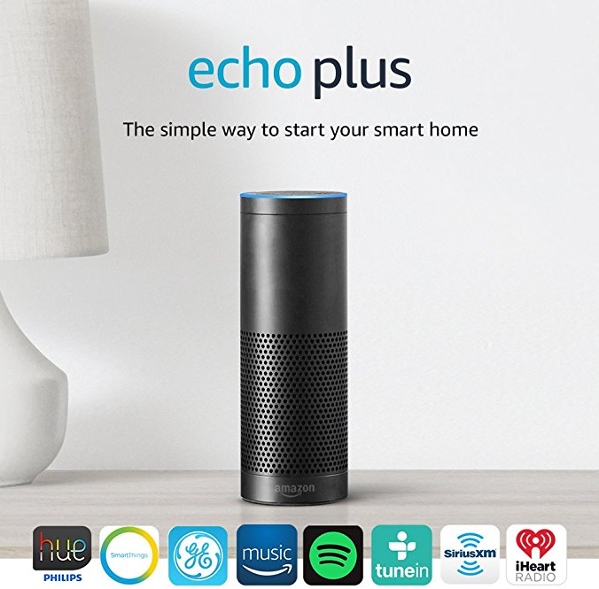
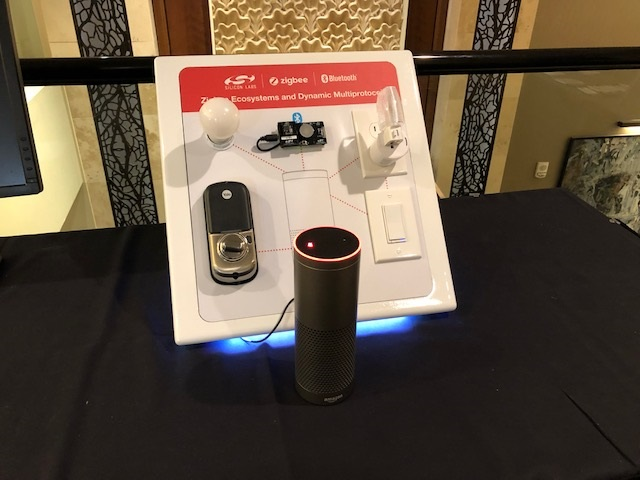
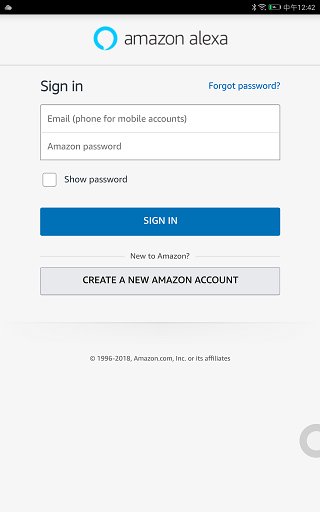
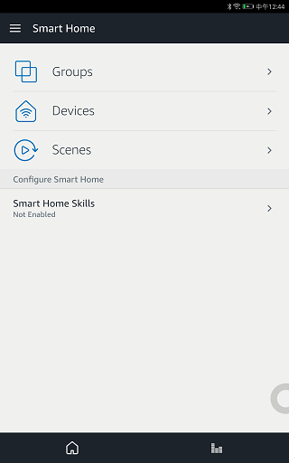
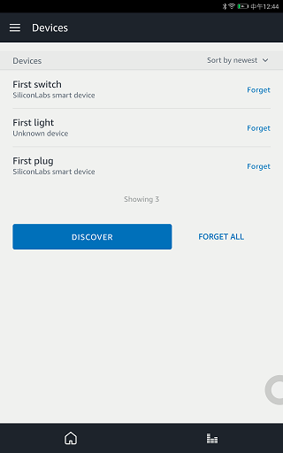
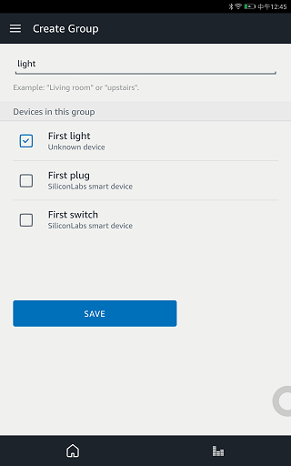
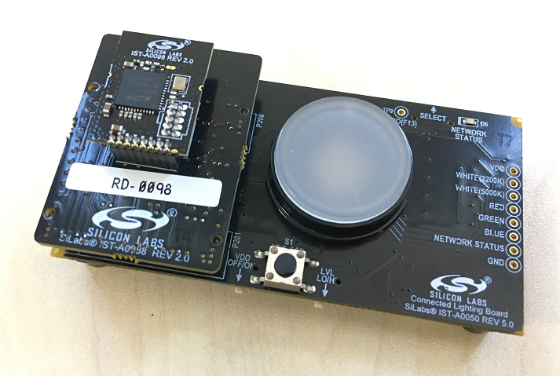
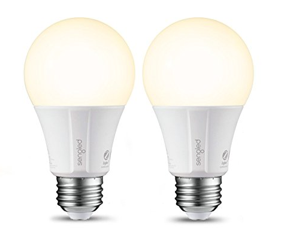

Table of Contents 

- [1. Introduction](#1-introduction)
  - [1.1. Alexa smart Home ecosystem](#11-alexa-smart-home-ecosystem)
  - [1.2. Control Zigbee device with Alexa](#12-control-zigbee-device-with-alexa)
- [2. Setup Echo Plus](#2-setup-echo-plus)
- [3. Setup ZigBee Lighting Reference Design demo board](#3-setup-zigbee-lighting-reference-design-demo-board)
- [4. Setup Sengled Bulb](#4-setup-sengled-bulb)
- [5. Conclusion](#5-conclusion)

***

# 1. Introduction
The documentation show you how to setup the Zigbee or Zigbee+BLE DMP demo with Alexa, and how to control them with Alexa voice command.   
Below is the block diagram of the system, there is a built-in Zigbee Hub in Amazon Echo Plus, it will form a Zigbee network and other Zigbee devices can join it. User can control the Zigbee devices with Echo Plus via voice command.   

    

  

## 1.1. Alexa smart Home ecosystem
Alexa is Amazon’s voice service and the brain behind millions of devices like the Amazon Echo. Alexa provides capabilities, or skills, that enable customers to create a more personalized experience. Customers can use Alexa to control smart home devices such as cameras, door locks, entertainment systems, lighting, and thermostats.   

    

  

## 1.2. Control Zigbee device with Alexa
As mentioned above, a lot of devices can be added to the Alexa smart home ecosystem, and be controlled by voice. The documentation will show you how to add the Zigbee products into the Alexa ecosystem.   
Below is the devices be included in the show.   
* Echo Plus
* ZigBee Lighting Reference Design demo board (RD-0098-0401) or Might Gecko Wireless starter kit
* Sengled Bulb

    

  

# 2. Setup Echo Plus
Echo Plus is a simple way to start your smart home. It has a built-in ZigBee smart home hub, which allows for simple and direct setup of compatible ZigBee lights, locks, plugs, and in-wall switches from brands like Philips Hue, GE, and Yale. No additional hub required. But before you can start using your Echo Plus, you need to set it up.   

To start, download the Amazon Alexa app for your iPhone or Android device. You'll need this to set up the Amazon Echo Plus, control its settings, and add skills.   
For android devices, if you cannot access the Google Play or Amazon Appstore directly, please try to download the APK and install it manually. For ios devices, the Appstore do not support Alexa application download outside USA, you may need a USA Appstore account.   

With the app installed on your device and your Echo unwrapped and plugged into a power source, follow these steps to set it up:   
* Register Amazon account and login.  

    

  

* After login, you can setup the Echo plus follow the voice guide of the Echo plus. Network accessing is necessary for using the voice server of Alexa, and after setup the Echo plus, click “Setting” -> “Smart Home” to manage your devices.   

    

  
 

* Add the new devices by clicking DISCOVER, the Echo Plus will start to discovery the Zigbee smart devices nearby, and you can create group for difference device for easy controlling.   

    

  

    

  

# 3. Setup ZigBee Light Devices with demo board
Silicon Labs released on November 2017 the new Dynamic Multiprotocol Software (DMP) for our Wireless Geckos. In summary, the DMP software enables the simultaneous operation of Zigbee and Bluetooh Low Energy (BLE) on a single radio chip.   
The best example to showcase this technology is by controlling and monitoring a Zigbee-based Light directly over Bluetooth with a smartphone mobile application. We will demonstrate the Zigbee and Bluetooth DMP with our ZigBee Lighting Reference Design (RD-0098-0401). Get more information about the reference designer from [UG252](https://www.silabs.com/documents/public/user-guides/ug252-lighting-rd.pdf).   
Download the firmware to the DMP demo board, and Power cycling (or reset) the bulb for 10 or more times will force the bulb to leave the network and attempt to find a new network. All of the bulb parameters (on/off, level, color control if available) will be reset to the factory defaults.   

    

  

You can also setup a Zigbee light device with any of our [Mighty Gecko Wireless starter kit](https://www.silabs.com/wireless/zigbee), and program it with Z3Light or DynamicMultiprotocolLight example.   

    

  

After resetting the DMP demo board or wireless starter kit, the Alexa should be able to discover the devices now. Supposed the device name of the Demo board is “First Light”, you can control the bulb on the demo board by voice command “Turn on the first light” or “Turn off the first light”. Also you can add the “First Light” to the “Light” group, and then control it by voice command “Turn on the light”.   
If you are using the DMP demo, you can control the DMP board via BLE with the application of “Wireless Gecko” as well.   

# 4. Setup Sengled Bulb
There are lots home automation devices powered by Zigbee on the market, and we will take the [Sengled bulbs](https://us.sengled.com/pages/amazon-alexa) as example and show you how to control them with Echo Plus.   

    

  

While the bulb is on, quickly turn the bulb off and then on 10 times in quick succession (using a light switch or power bar works best). If the reset is successful, the bulb will flash five times. If it does not flash five times, you will have to try again.   
After resetting the bulbs, Echo plus should be able discover the device, and control it via voice.   
Similar as the light demo with our DMP demo board or wireless starter kit, you also can create a new group for the Sengled Bulb or add them into other groups, and then control them with the group name.   

Here is example Alexa voice Commands.   

Turning lights on and off:   
* "Alexa, turn on [bulb/group name]"
* "Alexa, turn off [bulb/group name]"
* "Alexa, switch on [bulb/group name]"
* "Alexa, switch off [bulb/group name]"

Adjusting bulb brightness:   
(The "brighten" and "dim" commands will increase/decrease brightness by 25%. The "set" command must be used in conjunction with the word "percent".)   
* "Alexa, brighten [bulb/group name]"
* "Alexa, dim [bulb/group name]"
* "Alexa, set [bulb/group name] to [X%]"
* "Alexa, set brightness of [bulb/group name] to [X%]"
* "Alexa, set [bulb/group name]'s brightness to [X%]"

# 5. Conclusion
The Amazon Echo Plus has a built-in smart home hub that seamlessly connects and controls Zigbee smart devices, such as light bulbs, door locks, in-wall switches, and plugs, without the need for separate hubs or a Smart Home skill. It's pretty easy to build your home automation system with this powerful smart speaker.   