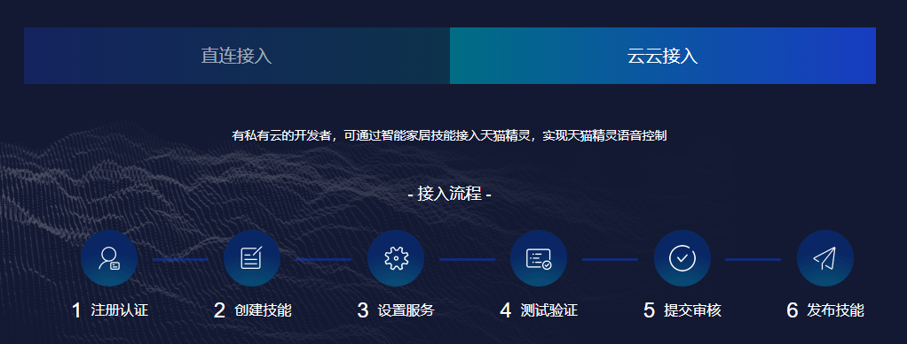

# 国内智能音箱生态系统对比分析

   

目录 

<!-- TOC -->

- [国内智能音箱生态系统对比分析](#国内智能音箱生态系统对比分析)
- [1. 概述](#1-概述)
- [2. 市场占有率对比](#2-市场占有率对比)
- [3. 智能音箱系统对比](#3-智能音箱系统对比)
    - [3.1. AliGenie开放平台](#31-aligenie开放平台)
        - [3.1.1. 语音技能](#311-语音技能)
        - [3.1.2. IoT接入平台](#312-iot接入平台)
        - [3.1.3. 硬件接入平台](#313-硬件接入平台)
    - [3.2. 小爱开放平台](#32-小爱开放平台)
        - [3.2.1. 语音服务平台](#321-语音服务平台)
        - [3.2.2. IoT设备接入](#322-iot设备接入)
        - [3.2.3. 智能设备接入](#323-智能设备接入)
    - [3.3. DuerOS开放平台](#33-dueros开放平台)
        - [3.3.1. 智能设备开放平台](#331-智能设备开放平台)
        - [3.3.2. 技能开放平台](#332-技能开放平台)
    - [3.4. 小结](#34-小结)
- [4. IoT设备接入方式对比](#4-iot设备接入方式对比)
    - [4.1. AliGenie IoT开放平台](#41-aligenie-iot开放平台)
        - [4.1.1. 云云接入](#411-云云接入)
        - [4.1.2. 直接接入](#412-直接接入)
            - [4.1.2.1. WIFI设备接入](#4121-wifi设备接入)
            - [4.1.2.2. 蓝牙Mesh设备接入](#4122-蓝牙mesh设备接入)
            - [4.1.2.3. 低功耗蓝牙设备接入](#4123-低功耗蓝牙设备接入)
    - [4.2. 小米IoT开放平台](#42-小米iot开放平台)
        - [4.2.1. 设备直接接入](#421-设备直接接入)
            - [4.2.1.1. WiFi模组模组接入](#4211-wifi模组模组接入)
            - [4.2.1.2. WiFi Linux SDK开发](#4212-wifi-linux-sdk开发)
            - [4.2.1.3. WiFi Android SDK开发](#4213-wifi-android-sdk开发)
            - [4.2.1.4. BLE SDK开发](#4214-ble-sdk开发)
    - [4.3. DuerOS IoT开放平台](#43-dueros-iot开放平台)
- [5. 总结](#5-总结)

<!-- /TOC -->

# 1. 概述

智能音箱作为智慧家庭的一个重要控制入口，受到各个科技大厂的青睐。相比于传统的仅支持音乐播放功能的音箱而言，智能音箱加入了语音对话，语义理解，智能家居设备控制等功能。

为了对目前国内市场上所流行的智能音箱有一个更为深入的了解，我们通过此文章来对其作一个分析对比。我们选取了目前国内市场上最为流行的三款智能音箱设备来作对比，它们分别是阿里巴巴的天猫精灵，小米的小爱同学以及百度的小度。因为我们主要关注于智能音箱来控制IoT智能家居设备，因此该文章也主要侧重于智能音箱的智能系统，IoT设备接入方式等几个方面。

# 2. 市场占有率对比

根据Canalys的最新预测，到2019年，中国智能音箱的使用率将增长166%。Canalys估计，至2018年底，中国智能音箱用户达到2250万。在其追踪的所有国家地区中，中国智能音箱的增长率名列前茅。Canalys和Strategy Analytics的统计数据显示，2018年底，阿里巴巴在中国智能音箱市场的份额约为40%。同时，Canalys预测，阿里巴巴设备的市场份额仍将维持基本不变，为39%。小米的小爱同学预计将占据25%的市场份额，百度的小度占24%，其他所有智能音箱设备占比为12%。

下图是Canalys所统计的2018年中国市场智能音箱的出货量及市场占有率，以及2019年的预估值。

# 3. 智能音箱系统对比

智能系统作为智能音箱的核心部分，提供自然语言处理、开放平台、深度学习、等人工智能能力，从而让智能音箱具有理解力、执行力甚至是进化力。阿里巴巴，小米和百度都相应地开发有自己的智能系统，分别是AliGenie开放平台, 小爱智能开放平台以及DuerOS开放平台。

## 3.1. AliGenie开放平台

[AliGenie开放平台](https://www.aligenie.com)是阿里巴巴人工智能实验室(AI-Labs)面向软硬件厂商和开发者推出的，将人工智能中ASR语音识别、NLP自然语言处理、TTS语音合成等自然语言处理技术和能力对外共享的开放式平台。平台针对不同类型的开发者提供了丰富的开发工具，协助开发者完成语音技能的开发、智能设备的接入、云端服务的接入等。

### 3.1.1. 语音技能

语音技能是部署在音箱或集成AliGenie语音系统智能硬件设备的语音应用，以语音交互为主要交互形式，不需要下载，不需要安装，由端口直接对接。服务接入成功后可触达各个AliGenie的所有用户。

### 3.1.2. IoT接入平台

天猫精灵IoT开放平台是阿里巴巴人工智能实验室（Alibaba A.I.Labs）面向品牌商、方案商以及个人开发者推出的，将AIoT技术、阿里系生态服务对外输出的开放式平台。开发者可通过直连接入（WiFi模组、蓝牙Mesh模组）、云云接入（OAuth2.0）两类方式，接入天猫精灵软硬件生态，实现语音和触屏交互，为用户提供天猫精灵IoT控制、查询、播报和主动服务。目前已支持40+个IoT类目，1000+型号。

如上图所示，AliGenie提供两种不同的智能设备接入方式，直接连入和云云接入。该部分将在"**IoT设备接入方式对比**"中详细介绍并和其它厂商加以对比。

### 3.1.3. 硬件接入平台

AliGenie硬件接入开放平台（AliGenie Intelligent Devices Platform），是AliGenie为企业级用户提供AI语音解决方案的开放平台。相关企业用户可以在完成开发者认证后，通过平台来申请获取AliGenie SDK、模组、麦克风阵列等能力和技术支持。

## 3.2. 小爱开放平台

小爱开放平台包括**语音服务平台**和**技能开放平台**两个部分。开发者可以借助小爱开放平台提供的硬件、软件、API接口、解决方案和文档等资源，创建更多更好的语音服务产品和技能。智能家居作为技能开放平台的一部分，是面向硬件设备厂商的快速接入渠道，无需任何语义开发，即可让设备自动被搭载小爱同学语音服务的智能设备所控制，如小米AI音箱、小米手机等。

### 3.2.1. 语音服务平台

小爱同学语音服务基于小米声学实验室、大数据及全生态建设，涵盖语音、NLP、搜索推荐等技术，为开发者提供高效、 便捷、智能的语音服务。 在手机、电视、音箱、穿戴、智能家居、车载各品类等智能硬件设备及应用程序上均有成熟解决方案。

小爱同学语音服务涵盖影音视听，实用工具，生活，知识教育，游戏趣玩，休闲娱乐，儿童等近百款自研精品技能及上千款第三方技能，且支持语音控制所有小米IoT设备。请前往[小爱开放平台](https://xiaoai.mi.com/)查看更多资料。

### 3.2.2. IoT设备接入

小米IoT开发者平台面向智能家居、智能家电、健康可穿戴、出行车载等领域，开放智能硬件接入、智能硬件控制、自动化场景、AI技术、新零售渠道等小米特色优质资源，与合作伙伴一起打造极致的物联网体验。小米IoT开发者平台为智能硬件的接入提供两类技术方案，分别是设备直连接入和云对云接入。

**注**：小米IoT开发者平台当前仅面向中国大陆地区的企业开放，暂未面向个人开发者开放。

更多详细信息，请参考"**小米IoT开放平台**"。

### 3.2.3. 智能设备接入

"智能设备接入" 是为希望搭载小爱同学语音服务的硬件设备提供适配各系统的SDK，集成SDK后即拥有小爱同学语音能力。若智能设备希望被"小爱同学"控制(如台灯、空气净化器等)，请前往[小米IoT开发者平台](https://iot.mi.com/a)注册申请以获取更多的技术支持。

## 3.3. DuerOS开放平台

DuerOS开放平台是[百度](http://www.baidu.com)为企业及开发者提供的一整套对话式人工智能解决方案的开放平台。该开放平台集成了DuerOS的能力，是百度全球领先人工智能技术的重要应用之一。DuerOS开放平台包括：**智能设备开放平台**和**技能开放平台**。

智能设备开放平台提供了灵活的分层解决方案，满足家居、车载、可穿戴等数十种设备和场景需求，并已为数百家顶级客户的产品和设备集成了对话式人工智能的能力。

技能开放平台提供了全套语音技能开发工具和方案，开发者利用可视化界面即可高效的完成开发部署，将技能发布在搭载DuerOS的硬件设备中。

### 3.3.1. 智能设备开放平台

DuerOS智能设备开放平台（英文全称，DuerOS Intelligent Devices Platform）让您可以轻松赋予您的设备可对话的能力。 通过集成DuerOS智能硬件开放平台的能力，可以实现如下功能：

*   用语音控制设备来播放音乐、查询天气及最新新闻，获取最新的交通情况以及通用知识询问
*   用语音来设置闹钟、提醒
*   用语音来获取服务，如叫车、订外卖等
*   同时，也可以通过语音来获取来自百度第三方合作伙伴创建的技能

**支持场景**

DIDP 支持多种场景解决方案：

*   智能手机语音助手
*   智能TV
*   智能音箱
*   轻量设备（如：电饭煲、故事机、豆浆机、便携式音箱等）
*   智能冰箱等等

**接入方式**

DIDP 提供软件、devkit 两种接入方式，具体如下图：

### 3.3.2. 技能开放平台

技能开放平台（以下简称DBP平台）提供了对话式技能所需的NLU(自然语义理解)处理和开发提供了直观的可视化编辑界面。通过编辑界面，可以便捷设计技能的意图、词典等内部逻辑，开发对话式技能。DBP平台支持自定义技能、智能家居技能和内容播报技能，你可以根据技能提供的服务选择相应的技能类型。

**自定义技能**

你可以通过自定义技能处理用户的请求（即意图）以及用户请求时所说的相关话语，为用户提供相应的服务。

**智能家居技能**

你可以通过智能家居技能处理用户的控制智能设备请求(设备的指令)，然后执行相应的指令，使设备达到用户请求的状态。智能家居技能可以为用户提供以下服务。

*   打开、关闭电灯
*   调节空调温度
*   打开电视，切换电视频道，调节音量等。

**内容播报技能**

你可以通过内容播报技能为用户播放所需的新闻、有声资源等信息。 内容播报技能将你的资源以顺序播放的形式提供给用户，不需要用户选择。

## 3.4. 小结

综上所述，无论是阿里巴巴的AliGenie开放平台，还是小米的小爱开放平台，或是百度的DurOS 开放平台，都提供有语音服务的能力为开发者提供高效，智能的语音服务，开发者可以通过集成各厂商所提供SDK的方式来获取语音服务。同时，各个开放平台还提供有智能设备的接入，通过云云对接或者本地Bluetooth Mesh/BLE/WIFI的方法来实现对设备的控制。

该表格从语音服务平台，所支持的IoT设备接入方式，开放程度等各个方面对各厂商的开放平台作作了一个横向的对比，从对比结果我们可以看出，目前AliGenie 和小爱开放平台提供有IoT智能设备直接接入的能力，而DurOS暂时还不支持该功能，同时小爱开放平台目前仅对企业用户开放，而其它两家则同时对企业和个人用户开放。

# 4. IoT设备接入方式对比

我们希望通过该文章的分析对比让大家对目前国内的智能音箱生态系统有一个较为深入的了解，同时我们作为一家IoT方案提供商，则更多的关注于这几个生态系统对于IoT设备接入的开放程度，下面逐一介绍。

## 4.1. AliGenie IoT开放平台

在AliGenie IoT开放平台下，用户可以选择直连接入（WiFi模组、蓝牙Mesh模组）或者云云接入（OAuth2.0）两类方式，将其IoT设备接入天猫精灵软硬件生态（天猫精灵音箱、天猫精灵App、AliGenie Inside智能设备）及阿里巴巴集团生态服务。

其系统框图如下所示：

### 4.1.1. 云云接入

开发者将其IoT设备连接在其私有云，以OAuth2.0鉴权方式，通过开发者私有云接入天猫精灵云端的协议，实现天猫精灵语音控制，其框图如下所示：

通用的OAuth2.0开放授权协议，可以让AliGenie在不获取合作方用户名和密码的前提下，访问用户授权的资源，协议规范可以访问[OAuth2.0官方网站](https://oauth.net/2/)。

具体的AliGenie智能家居接入流程请参考[AliGenie官方文档](https://doc-bot.tmall.com/docs/doc.htm?spm=0.7629140.0.0.1b4517806Vbl3Q&amp;treeId=393&amp;articleId=107616&amp;docType=1)。

### 4.1.2. 直接接入

直接接入是指IoT设备通过模组/SoC芯片（WiFi或蓝牙Mesh），经WiFi/蓝牙网关（Gateway）直连接入天猫精灵云端的通讯协议。在AliGenie的生态系统中，天猫精灵音箱支持蓝牙Mesh网络，其作为蓝牙网关，可以管理蓝牙Mesh设备的接入，控制。

#### 4.1.2.1. WIFI设备接入

天猫精灵IoTConnect Kit Wi-Fi SDK是阿里巴巴人工智能实验室基于AliOS-Things，封装好对接天猫精灵语音配网与控制的功能完备的SDK，赋能给广大开发者。基于该SDK，用户只需要在精灵开放平台上定义好产品，然后进行设备属性控制部分的开发，数小时内便可开发出一款完整的Wi-Fi IoT产品接入到天猫精灵生态。

其开发流程如下，设备开发者需要先安装精灵Wi-Fi SDK的开发工具以及获取代码，配置运行的目标模组，然后进行产品功能的开发。

#### 4.1.2.2. 蓝牙Mesh设备接入

所有接入天猫精灵的蓝牙mesh设备必须具备mesh协议里定义的Relay、Proxy功能，同时LPN和Friend功能可选。低功耗设备可以采用精灵低功耗(GLP)方案，或者mesh协议里所定义的LPN方案。

天猫精灵在对蓝牙mesh设备配网时遵循蓝牙mesh标准的Provisioning流程，但是蓝牙mesh设备需要在Provisioning Capabilities阶段提供OOB方式，要求唯一支持Static OOB方式，其中的AuthValue计算过程如下：

`_ AuthValue = SHA256(Product ID,MAC,Secret)_`

这里的ProductID，MAC，Secret三元组需要通过[AliGenie开发者平台](https://iot.aligenie.com/home)申请获取。

同时，阿里巴巴在标准mesh协议的基础上为智能家居设备制定了蓝牙mesh扩展消息，以便于更多的智能家居设备通过蓝牙mesh技术来接入天猫精灵生态。由于SIG Mesh的Model目前尚未覆盖所有的家电，在扩展协议中，需采用Vendor Model来实现智能家居设备的控制和状态上报。下表所示为vendor model的定义，SIG定义其格式为4字节(其中2字节的Company ID和2字节的Vendor-assigned Model ID)，其中Alibaba的Company ID为0x01A8。

了解更多信息，请参考[阿里巴巴开放平台指导手册](https://doc-bot.tmall.com/docs/doc.htm?spm=0.7629140.0.0.58e51780xAiFoO&amp;treeId=578&amp;articleId=109049&amp;docType=1)。

#### 4.1.2.3. 低功耗蓝牙设备接入

阿里巴巴物联平台支持低功耗蓝牙设备的接入，同时对接入规范作了详细的定义，包括蓝牙广播规范和蓝牙接入服务规范等，可以供阿里巴巴的合作厂商作为阿里巴巴物联平台蓝牙设备的接入标准。

**广播规范**

蓝牙广播包格式遵循蓝牙4.0规范，由若干AD Structure组成（参见Bluetooth 4.2 Core Specification, Volume 3, Part C, Chapter 11），每一个ADStructure结构由Length、AD Type、AD Data组成。

接入阿里巴巴物联平台的蓝牙设备的广播包必须包含阿里巴巴制定的厂商自定义格式（Manufacturer Specific Data，AD Type：0xFF）。阿里巴巴自定义广播格式总共由(6+n)字节组成，不同广播类型，对应不同的n值和Content。具体请参考[天猫精灵智能家居蓝牙设备GATT规范](https://doc-bot.tmall.com/docs/doc.htm?spm=0.7629140.0.0.59581780rCvepg&amp;treeId=578&amp;articleId=118129&amp;docType=1)。

**数据传输规范**

由于蓝牙4.0一次只能发送20字节的有效数据，当一包数据超过20字节时，蓝牙无法一次完成数据的传送，所以在发送长数据包时，需要发送时拆包，接收时组包。不同的蓝牙版本下，蓝牙在应用层可以传输长度和本规范应用数据长度如下表所示。下文用N代表规范数据长度。

<table class="wrapped"><colgroup><col /><col /><col /></colgroup>
<tbody>
<tr>
<th>BLE版本</th>
<th>应用层数据长度</th>
<th>规范数据长度(N)</th></tr>
<tr>
<td>BLE4.0</td>
<td>20</td>
<td>16</td></tr>
<tr>
<td>BLE4.2</td>
<td>244</td>
<td>240</td></tr>
<tr>
<td>BLE5.0</td>
<td>244</td>
<td>240</td></tr></tbody></table>

注：部分手机系统支持最长数据长度已经超过244，此规范规定应用层数据长度上限244，超过244按照 244处理。合规应用层最长数据长度 20-244。

**安全认证**

安全认证主要用于设备和手机互相校验身份，避免仿冒情况，应用于安全性要求较高的设备或场景，安全认证需要依赖云端能力。使用安全认证的设备，需要将广播的FMSK第三个Bit位置为0b1。手机在每次连接的时候，会进行安全认证流程。安全认证通过后，手机和设备的数据传输会通过密文传输。

## 4.2. 小米IoT开放平台

了解更多信息，请前往[小米IoT开发者平台](https://iot.mi.com/new/index.html)。

小米IoT开发者暂时只向以下类型的开发者开放合作：

*   智能硬件企业：企业希望自己的智能硬件支持小爱同学控制、支持米家APP控制、支持与米家智能硬件互联互通。
*   智能硬件方案商：企业希望将智能硬件接入小米IoT平台作为解决方案提供给自己的客户；同时，优秀的方案商也有机会成为平台的认证方案商，平台会引荐有研发资源支持需要的智能硬件企业。
*   语音AI平台：企业希望其语音AI服务的智能家居技能支持控制小米智能家居。
*   酒店/公寓/地产企业：企业希望其智慧化项目引入小米智能家居。

注：小米IoT开发者平台当前仅面向中国大陆地区的企业开放，暂未面向个人开发者开放。

目前所支持的智能硬件接入方式有如下两类技术方案：

方案一：设备直连接入

*   设备直连接入，即智能硬件通过嵌入小米智能模组或集成SDK的方式直接连接到小米IoT平台。该方案适用于以下开发者（任一条件）：
*   新产品接入，同时无自有智能云、或相对缺少产品智能化经验。
*   希望产品与米家APP在体验上深度集成，用户可使用米家APP完成从配网添加到控制管理的全部操作。
*   希望产品在小米众筹平台或小米有品中销售。
*   希望产品接入后获得合作推广资源（如营销、运营等）。

方案二：云对云接入

云对云接入，即开发者自有智能云与小米IoT平台对接，其智能硬件连接自有智能云后，也间接实现了与小米IoT平台的接入。该方案适用于以下开发者：

*   已有自己的智能云和智能家居APP，产品主要在自有APP中进行添加和管理，但希望同时能被小爱同学、米家APP控制，或者希望与小米IoT平台的其他智能硬件实现互联互通。
*   希望产品接入后获得合作推广资源（如营销、运营等）。

### 4.2.1. 设备直接接入

平台支持WiFi、BLE、2G/4G、Zigbee等接入方式，目前主要开放的接入方式为WiFi和BLE两种。WiFi适合较大带宽、低延迟、交流供电的场景，如净化器、电饭煲、空调等大小家电。BLE相对来说适合低功耗、低成本的产品，像电池供电的传感器、穿戴式设备。

<table class="wrapped"><colgroup><col /><col /><col /></colgroup>
<tbody>
<tr>
<th>接入方式</th>
<th>开发方式</th>
<th>适用产品</th></tr>
<tr>
<td>通用模组接入</td>
<td>MCU+模组方式。独立MCU，通过串口与WiFi模组通信</td>
<td>大多数产品，净化器、空调、吸顶灯等，强烈推荐</td></tr>
<tr>
<td>Linux SDK开发</td>
<td>MIoT提供SDK，客户集成到产品</td>
<td>采用Linux系统的设备，如摄像头等</td></tr>
<tr>
<td>Andriod SDK开发</td>
<td>MIoT提供SDK，客户集成到产品</td>
<td>采用Android系统的设备</td></tr>
<tr>
<td colspan="1">BLE SDK开发</td>
<td colspan="1">MIoT提供库文件，客户集成到产品。客户需要选择MIoT支持列表中芯片</td>
<td colspan="1">所有BLE产品</td></tr></tbody></table>

#### 4.2.1.1. WiFi模组模组接入

平台提供小米智能模组，帮助用户快速开发自己的智能设备。WiFi模组都是采用轻量级RTOS（realtime OS），相对来说具有低功耗、低成本、开发简单等特点。

通用模组接入：WiFi模组提供一个透传通道，客户只需要完成MCU上的程序开发。模组与MCU的程序互相独立，开发简单，客户产品的可维护性好，灵活性高。

#### 4.2.1.2. WiFi Linux SDK开发

平台提供名为miio_client的lib，负责连接MIoT cloud，如果客户的产品还支持BLE，则还可以集成MIoT的miio_bt lib，使得该产品支持BLE gateway功能。

#### 4.2.1.3. WiFi Android SDK开发

平台提供设备SDK，Android设备集成该SDK后，可以把设备接入到MIoT平台，然后设备可以提供各种属性供MIoT后台查询，也可以接收服务端发送的各种控制命令。

#### 4.2.1.4. BLE SDK开发

平台提供三种不同的BLE接入方式：普通BLE接入、高安全级BLE接入、BLE MESH接入。三种接入方式各有特点，平台会提供相应的固件端软硬件支持，完成设备的认证，帮助产品接入到米家APP中。

**标准BLE接入开发**

标准BLE接入方式的软件SDK，由三部分组成：芯片原厂SDK，米家标准认证库，米家标准认证示例Demo，目前可支持的BLE设备有SiliconLabs, Nordic等。开发者可以参考[开发指南](https://iot.mi.com/new/guide.html?file=04-%E5%B5%8C%E5%85%A5%E5%BC%8F%E5%BC%80%E5%8F%91%E6%8C%87%E5%8D%97/06-BLE%E4%BA%A7%E5%93%81%E6%8E%A5%E5%85%A5/02-%E6%A0%87%E5%87%86BLE%E6%8E%A5%E5%85%A5%E5%BC%80%E5%8F%91)了解更多详细信息。

**高安全级BLE接入开发**

高安全级BLE接入方式的软件SDK，由三部分组成：芯片原厂SDK，米家高安全级认证库，米家智能门锁示例Demo。

**BLE Mesh 接入开发**

小米BLE Mesh系统会涉及到MIoT Spec和Mesh Spec两种Profile。

MIoT Spec是小米定义的产品应用层的功能规范，它对智能设备功能进行归类和统一，描述设备的功能和操作方法，并做了预定义。同样SIG也提供BLE Mesh的应用层规范，如Mesh Model、Status、Message等，本文称为Mesh Spec。

可以简单理解为，MIoT Spec是小米定义并实现的设备描述规范，Mesh网关、米家APP 、小爱同学，AI大脑、米家服务器均采用这套规范对设备进行控制；Mesh Spec是SIG定义的BLE Mesh应用层规范，用于BLE Mesh设备之间进行相互通信。

有关这BLE Mesh设备接入小米IoT平台的方法，请参考[开发指南](https://iot.mi.com/new/guide.html?file=04-%E5%B5%8C%E5%85%A5%E5%BC%8F%E5%BC%80%E5%8F%91%E6%8C%87%E5%8D%97/06-BLE%E4%BA%A7%E5%93%81%E6%8E%A5%E5%85%A5/04-BLE%20Mesh%E6%8E%A5%E5%85%A5%E5%BC%80%E5%8F%91)。

## 4.3. DuerOS IoT开放平台

DuerOS 暂不支持IoT智能设备的直接接入，请持续关注[DurOS IoT开放平台](https://dueros.baidu.com/)更新。

# 5. 总结

通过该文章的对比分析，我们对目前内国市场最为普遍的三种智能音箱生态有了一个较为深入的了解，阿里巴巴为主导的AliGenie生态系统以其开放性，易用性等优点获得了大量企业或个人开发者的欢迎，并持续引领国内智能音箱生态系统的发展。

小米致力于不断构建完善其小米生态键，以提供给用户更好的体验。旗下智能灯具厂商Yeelight基于SiliconLabs BluetoothMesh方案所打造的智能照明产品，在市场广受好评。

百度作为后入者，依托其在搜索领域的技术积累，给广大用户提供了良好的语音及内容服务，不过在IoT智能设备接入部分，DuerOS仍在持续完善中。
