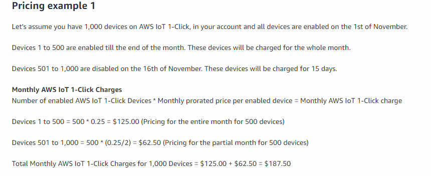

Table of Contents 

<!-- TOC -->

- [1. Cost of Development](#1-cost-of-development)
    - [1.1. Amazon Web Service (AWS)](#11-amazon-web-service-aws)
        - [1.1.1. Amazon Lambda](#111-amazon-lambda)
        - [1.1.2. AWS IoT 1-Click](#112-aws-iot-1-click)
        - [1.1.3 AWS IoT Core](#113-aws-iot-core)
    - [1.2 Google IoT Core](#12-google-iot-core)
- [2. Product Specs](#2-product-specs)
- [3. Ecosystem Comparison](#3-ecosystem-comparison)
- [4. Google &amp; Amazon Smart Home Strategy Analysis](#4-google-amp-amazon-smart-home-strategy-analysis)
    - [4.1 Google is better on software](#41-google-is-better-on-software)
    - [4.2 Amazon is good at hardware](#42-amazon-is-good-at-hardware)

<!-- /TOC -->

# 1. Cost of Development

## 1.1. Amazon Web Service (AWS)

### 1.1.1. Amazon Lambda

The Amazon lambda is free for limited usage but totally enough for developing purpose. Developers need also choose the closest Lambda servers to ensure their customers could get high-quality services. However, because it charges by the request number it handles($0.28 per 1M REQUESTS after free trials), so it won't be cheap if the product has a large group of users. More about Lambda function and pricing please check [here](https://aws.amazon.com/lambda/).

Figure 1. Amazon Lambda function supported area

Figure 1.1 Some free trials of Amazon Lambda

The complete ratings and free tier details for Amazon Lambda please check [here](https://aws.amazon.com/free/?all-free-tier.sort-by=item.additionalFields.SortRank&amp;all-free-tier.sort-order=asc&amp;awsf.Free%2520Tier%2520Types=categories%2523alwaysfree%257Ccategories%2523featured).

### 1.1.2. AWS IoT 1-Click

AWS IoT 1-Click is a service that enables simple devices to trigger AWS Lambda functions that can execute an action. AWS IoT 1-Click supported devices enable you to easily perform actions such as notifying technical support, tracking assets, and replenishing goods or services. AWS IoT 1-Click supported devices are ready for use right out of the box and eliminate the need for writing your own firmware or configuring them for secure connectivity. AWS IoT 1-Click supported devices can be easily managed. You can easily create device groups and associate them with a Lambda function that executes your desired action when triggered. You can also track device health and activity with the pre-built reports.

Figure 1.2 AWS 1-Click Pricing

Sample example:

Figure 1.3 AWS 1-Click Example

For more information please visit [here](https://aws.amazon.com/iot-1-click/pricing/).

### 1.1.3 AWS IoT Core

AWS IoT Core is a managed cloud service that lets connected devices easily and securely interact with cloud applications and other devices. AWS IoT Core can support billions of devices and trillions of messages and can process and route those messages to AWS endpoints and to other devices reliably and securely. This service is billed separately for the usage of Connectivity, Messaging, Device Shadow usage (device state storage), Registry usage (device metadata storage), and Rules Engine usage (message transformation and routing).  

Taking Messaging as an example, the pricing list shows below:

Figure 1.4 AWS IoT Core Messaging Pricing List

  

The full pricing lists for AWS IoT Core are [here](https://aws.amazon.com/iot-core/pricing/).

A pricing example for a workload using all AWS IoT core components:

Figure 1.5 AWS IoT Pricing Example

AWS IoT Core also has free tiers:

Figure 1.6 AWS IoT Free Tiers

## 1.2 Google IoT Core

Google has different pricing strategy from Amazon. It doesn't charge for create, read, update, and delete operations through its device manager. Instead, it charges by data volume of each device produced monthly.

Figure 1.7 Pricing Strategy of Google

Figure 1.8 Small Message Pricing Example

Google also gives new user 300 dollars credits and some limited free access to its IoT service. Specific details [here](https://cloud.google.com/iot/pricing).

# 2. Product Specs

<table class="wrapped relative-table" style="width: 86.4841%;"><colgroup><col style="width: 18.5412%;" /><col style="width: 29.2434%;" /><col style="width: 22.7676%;" /><col style="width: 29.3115%;" /></colgroup>
<tbody>
<tr>
<td colspan="4" style="text-align: center;"> Amazon Echo products </td></tr>
<tr>
<td>Device</td>
<td>Echo Plus</td>
<td colspan="1">Google Home</td>
<td colspan="1">Apple Hompod</td></tr>
<tr>
<td>Price</td>
<td>$150</td>
<td colspan="1">$99</td>
<td colspan="1">$299</td></tr>
<tr>
<td>Supported OS</td>
<td>Fire OS</td>
<td colspan="1">Android OS</td>
<td colspan="1">iOS</td></tr>
<tr>
<td colspan="1">Supported Technologies</td>
<td colspan="1">Wi-Fi 802.11 b/g/n/ac, Zigbee, Bluetooth 4.0</td>
<td colspan="1">Wi-Fi 802.11 b/g/n/ac, Bluetooth 4.0</td>
<td colspan="1">Wi-Fi 802.11 ac, Bluetooth 5.0</td></tr>
<tr>
<td>Speaker specs</td>
<td>0.8" tweeter, 3" woofer</td>
<td colspan="1">2" driver + dual 2" passive radiators</td>
<td colspan="1">High-excursion woofer with custom amplifier</td></tr>
<tr>
<td>Screen specs</td>
<td>No screen</td>
<td colspan="1">Capacitive touch</td>
<td colspan="1">Touch Surface</td></tr>
<tr>
<td>Camera specs</td>
<td>No camera</td>
<td colspan="1">No camera</td>
<td colspan="1">No camera</td></tr>
<tr>
<td>Smart home control</td>
<td>Yes, also includes built-in device hub</td>
<td colspan="1">Yes</td>
<td colspan="1">Yes</td></tr>
<tr>
<td>Can be used wirelessly</td>
<td>No</td>
<td colspan="1">No</td>
<td colspan="1">No</td></tr></tbody></table>

Table 1: Echo Main Products

More product detailed analysis pleases visit [here](https://arstechnica.com/gadgets/2018/11/amazon-echo-and-alexa-products-comparison/) (need VPN to visit).

# 3. Ecosystem Comparison

<table class="relative-table wrapped" style="width: 94.3463%;"><colgroup><col style="width: 17.9319%;" /> <col style="width: 23.9925%;" /> <col style="width: 25.1796%;" /> <col style="width: 32.8647%;" /> </colgroup>
<tbody>
<tr>
<td>
</td>
<td>Alexa Smart Home ecosystem</td>
<td>Google Smart Home ecosystem</td>
<td>Apple Siri Homekit ecosystem</td></tr>
<tr>
<td>Supported technology</td>
<td>Bluetooth, Zigbee, Wi-Fi</td>
<td> Bluetooth, Wi-Fi</td>
<td>Bluetooth, Wi-Fi</td></tr>
<tr>
<td>Flexibility</td>
<td>Good, Integrable</td>
<td>Average</td>
<td>Bad</td></tr>
<tr>
<td>Difficulty of development</td>
<td>Medium</td>
<td>Medium</td>
<td>No access</td></tr>
<tr>
<td>Overall cost of development</td>
<td>Average</td>
<td>Average</td>
<td>High</td></tr>
<tr>
<td>Market occupancy(2018)</td>
<td>61.1%</td>
<td>23.9%</td>
<td>4.1%</td></tr>
<tr>
<td>Chinese supported</td>
<td>No</td>
<td>No</td>
<td>Yes</td></tr>
<tr>
<td>Open-loop</td>
<td>Yes</td>
<td>Yes</td>
<td>No</td></tr>
<tr>
<td>Technical support </td>
<td>Very good</td>
<td>Very good</td>
<td>Need license</td></tr>
<tr>
<td>Documentation system</td>
<td>Systemitic and complete</td>
<td>Complete</td>
<td>Need license to get access</td></tr>
<tr>
<td colspan="1">Development environment</td>
<td colspan="1">Very complete</td>
<td colspan="1">Complete</td>
<td colspan="1">Good but need license first</td></tr>
<tr>
<td colspan="1">Service Type</td>
<td colspan="1">Clould to Cloud, Locally, Direct to Amazon Cloud, Built-in Alexa</td>
<td colspan="1">Cloud to Cloud, Locally(In development)</td>
<td colspan="1">Direct to Apple Cloud</td></tr></tbody></table>

Table 2: Ecosystem Comparison

The Market Occupancy data comes from [here](https://techcrunch.com/2019/03/08/over-a-quarter-of-u-s-adults-now-own-a-smart-speaker-typically-an-amazon-echo/).

# 4. Google &amp; Amazon Smart Home Strategy Analysis

Undoubtedly, Google and Amazon are two dominators in the US home automation market. Over 85% of market shares belong to these two companies; Amazon 61% and Google 24%. However, Google and Amazon have a completely different strategy in developing their smart home ecosystem.

Google focuses on partnering with other hardware companies while Amazon prefers to push out more products with Amazon bandage.

## 4.1 Google is better on software

For the AI assistant, the Google Assistant has natural advantages over Amazon Alexa. Relying on the powerful Google search engine, the Google Assistant basically has infinite resources to use. Frankly speaking, the Google Assistant is much smarter than Alexa. This point has already been reflected in the products and user experience. Taking an example, Google Assistant now supports logic home map function. If a smart lock user wants to open the door of the room he/she is current in, he just needs to say a natural sentence like "Google, open the door for me", instead of saying "Google open the bedroom door for me". The implementation of this function relies on the Google Home Graph database, which can record the logic map of user's places. Also, Google maps has provided Google Assistant a much more convenient way to access user's data. Google maps can trace user's daily activities and collect user data. With this data, Google can easily predict the needs of the user and target corresponding ads and service to its users. Imaging such a scenario: after done a whole day's hard work, you get off from your company. The Google Assistant on your phone prompts you that your car has already started up, navigation to home has already been set. If you want, you can now tell Google Assistant what you want to eat and which restaurant you want to go. Google Assistant will immediately change all plans. By the way, it now can book a table for you through making a real phone call with your mimicked voice([Google's virtual assistant mimic a human voice to book an appointment by phone](https://www.theguardian.com/technology/video/2018/may/09/new-google-assistant-mimics-human-voice-video)).

Also, as the developer of the Android operating system, which now is assembled in billions of phones, Google has an unmatched advantage on the number of user groups over Amazon. Today is the time which people's lives are centered around smartphones. No matter what smart devices, the support from phone software is indispensable. Although Amazon also has it's own phone application which is called Amazon Alexa, there is no possibility that it could be well matched to Google Assistant, a software which is pre-installed on its original system. A good way to illustrate the ability to make phone applications could be taking a glance on their products at a third-party platform.

Both Amazon and Google have published their AI assistant applications on iOS platform, while Google separates Google Home and Google Assistant as two independent applications and has a combined version. Let's see the customer reviews for both.

Figure 1.9 Google Phone Application on iOS Platform

Both Google Home and Google Assistant achieved a rating more than 4.0 with thousands of users. While Alexa also has thousands of users, it has only 2.6 overall review scores.

Figure 2.0 Aamazon Alexa on iOS Platform

## 4.2 Amazon is good at hardware 

However, a less smart voice assistant doesn't mean Amazon would lose the game. Amazon is the biggest online shopping platform. Since it was founded in 1996, Amazon has become known as the go-to online retailer for almost everything. Its membership--- Amazon prime provides only free shipping service, but also many entertainment contents including movies, music, books, and other media. Furthermore, Amazon Web Service (AWS) has gradually become one of the most prominent cloud vendors on earth. In 2018, Amazon's cloud business grew 46%, reached a $26 billion annual run rate(source). Google didn't share its yearly run rate of 2018, but Google Cloud's run rate in 2017 is about $4 billion(source).

For Amazon, the hardware is the strategy of competing with Google. Amazon has designed dozens of smart speaker. The price range varies from $49.99, the echo dot, to $229, the echo show. Amazon declares more than 100 million devices with Alexa on board have been sold up to 2019. Moreover, Amazon has opened the Alexa built-in technology to other companies. The smart device manufacturers can now have their devices set up with Alexa integrated modules with the help of bunches of system development tools released by Amazon. There are more than 150 different products right now with Alexa built in, and 100 shipped in 2018 aren't made by Amazon at all. Amazon makes profits from both the hardware module and its Works With Alexa badge.

Figure 2.1 Alexa Built-in Device System Development Kits  

Amazon also controls the biggest retail platform in the United States. It's a very interesting phenomenon when you type "Google Home" in the product search bar of [Amazon.com](http://Amazon.com), it gives you a list of echo products. Also, Google products have been forbidden to sell in the China market, one of the hottest AI product markets. Amazon doesn't have this limit, even if it's still doesn't support Chinese.