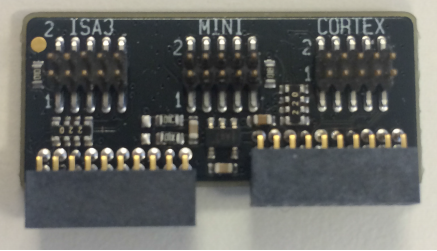
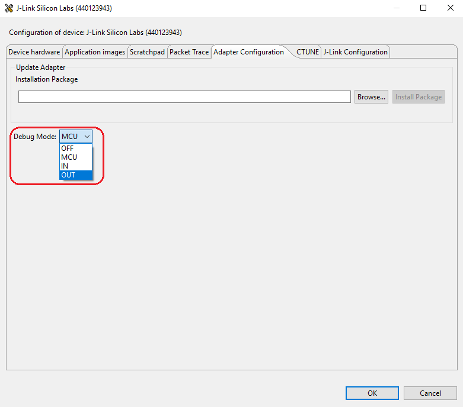

Table of Contents 

&nbsp;  

- [1. Overview](#1-overview)
- [2. Connector](#2-connector)
- [3. Debug Modes](#3-debug-modes)
- [4. Reference](#4-reference)

  

********

## 1. Overview
The wireless starter kit (WSTK) consists of a mother board (acts as a debugger and programmer) and a radio board (the real target board). The mother board is actually a multi-function debugger and can be used to debug custom boards.  

In this article, we will introduce how we debug a custom board with the mother board of the WSTK.

## 2. Connector
Below is the layout of the WSTK. In the right bottom, there is two debug connector.  

  

Silicon Labs provides a "Simplicity Debug Adapter Board" to pair with these two connectors.  

  

We will use the 10-pin mini debug connector to debug custom board. The pin-out of the mini debug connector is as below:  

  

It's recommended to reserve this mini debug connector in your custom board, so that it could be easily connected to the WSTK, then you can start debugging, programming, and make captures using the WSTK.

## 3. Debug Modes
As we know, the WSTK can be used as a programmer, debugger and sniffer. It can be used to program/debug the radio board which pluged onto the WSTK. It can also be used to program/debug custom board connected to the WSTK through the mini connector. But the WSTK can not program/debug the radio board and custom board at the same time. There are three debug modes of the WSTK:  

|Mode|Comments|  
|:-|:-|
|MCU|The debugger of WSTK is connected to the radio board|
|Debug out|The debugger of WSTK is connected to the mini connector|
|Debug in|The debugger is not used at all. The mini connector is connected to the radio board|

You can set the debug mode by the following steps:  
1. Connect the WSTK to PC, then you will see a debug adapter listed in the "Debug Adapter" windows.  
2. Select the WSTK, right click and select "Device Configuration".
3. Turn to "Adapter Configuration" tab, select the mode you want.
  
  

**Note: Please make sure the radio board is unpluged when you set the mode to "OUT".**

## 4. Reference
- [AN958: MCU/STK/WSTK Guide](https://www.silabs.com/documents/public/application-notes/an958-mcu-stk-wstk-guide.pdf)
- [UG261: EFR32MG12 2.4 GHz 10 dBm Radio Board User's Guide](https://www.silabs.com/documents/public/user-guides/ug261-brd4162a.pdf)
