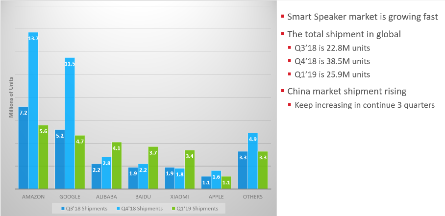
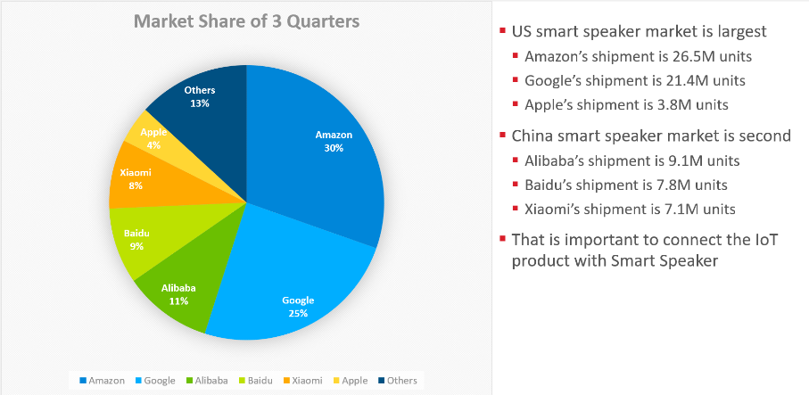

# Table of Contents

* [Alexa Smart Speaker ecosystem Introduction and Setup](Alexa-Smart-Speaker-ecosystem-Introduction-and-Setup)
    * [Alexa control the Bluetooth Mesh devices via cloud](Alexa-control-the-Bluetooth-Mesh-devices-via-cloud)
    * [Alexa control the Zigbee devices with the built-in hub](Alexa-control-the-Zigbee-devices-with-the-built-in-hub)
* [China Smart Speaker Ecosystem Investigation](China-Smart-Speaker-Ecosystem-Investigation)
* [The US Smart Speaker Ecosystem Investigation](The-US-Smart-Speaker-Ecosystem-Investigation)
    * [Cost of Development Analyses and Ecosystem Comparisons](Cost-of-Development-Analyses-and-Ecosystem-Comparisons)
* [Tmall Genie Smart Speaker ecosystem Introduction and Setup](Tmall-Genie-Smart-Speaker-ecosystem-Introduction-and-Setup)
    * [Tmall Genie control the Bluetooth Mesh Devices with the Built-in Hub](Tmall-Genie-control-the-Bluetooth-Mesh-Devices-with-the-Built-in-Hub)
    * [Tmall Genie control the WIFI devices via cloud](Tmall-Genie-control-the-WIFI-devices-via-cloud)
    * [Tmall Genie control the Zigbee devices via cloud with AliOS](Tmall-Genie-control-the-Zigbee-devices-via-cloud-with-AliOS)
    * [Tmall Genie control the Zigbee devices via cloud with Micrium OS](Tmall-Genie-control-the-Zigbee-devices-via-cloud-with-Micrium-OS)

# Background

