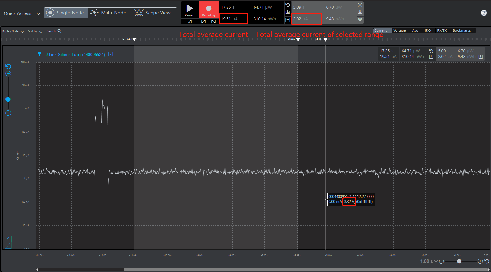
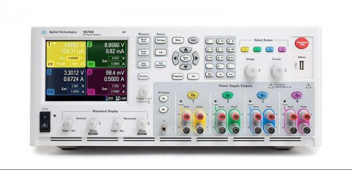
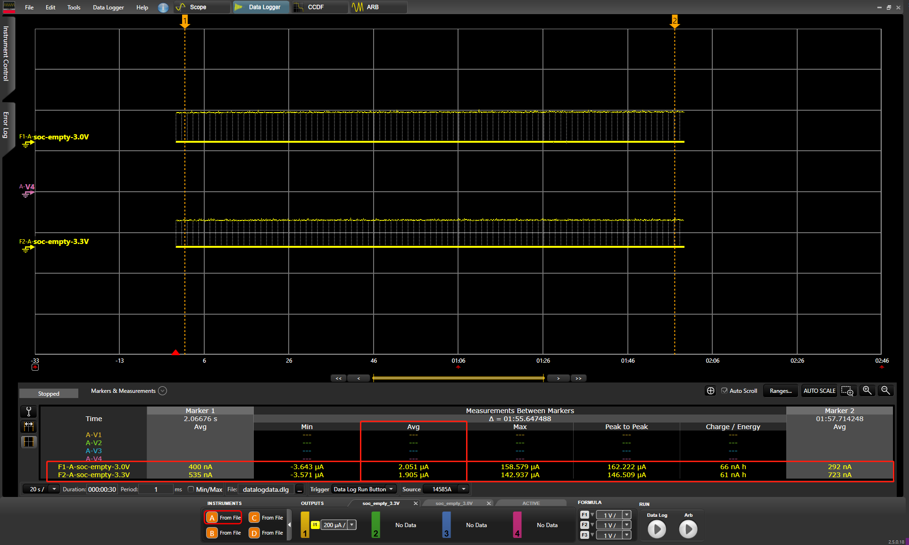
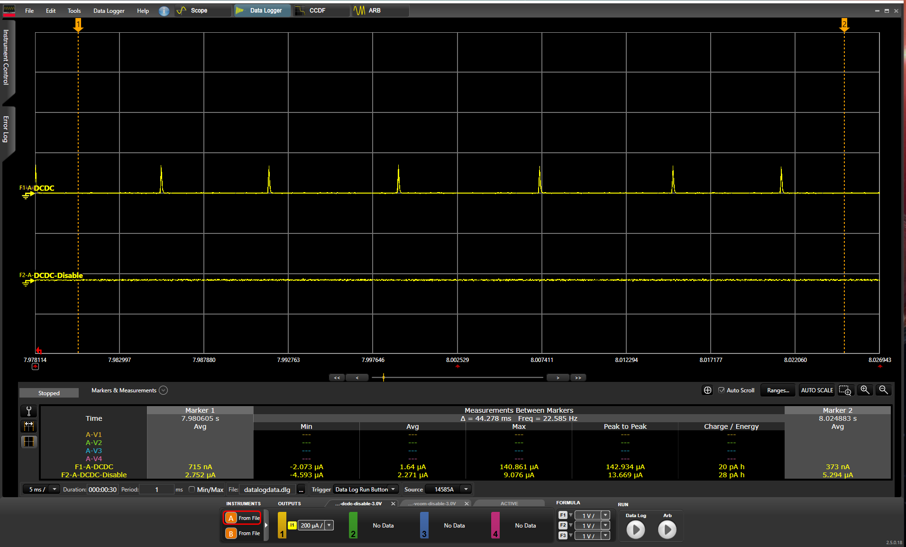
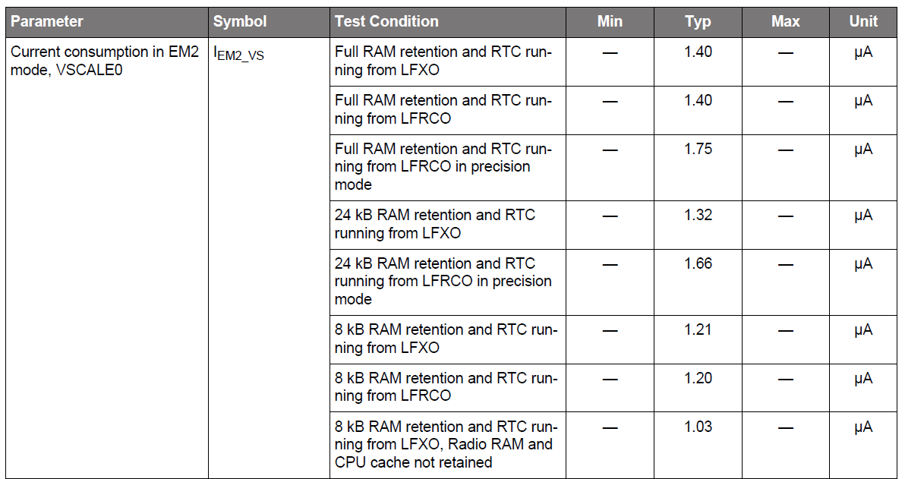
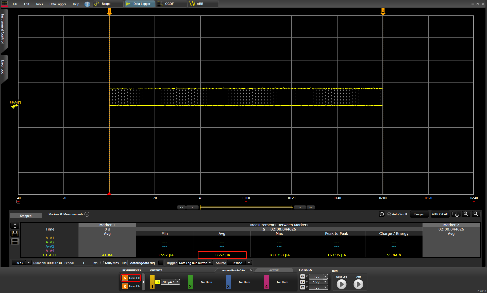
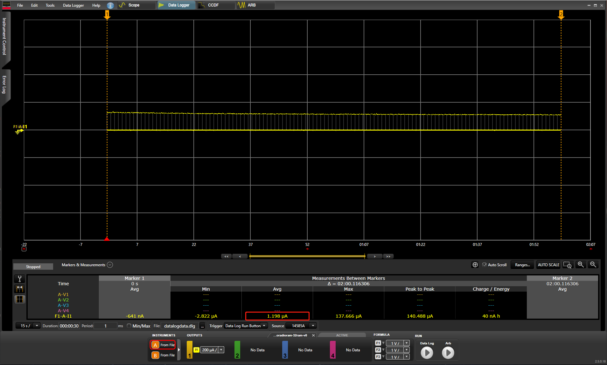

# EFR32xG22-Power-Consumption-Optimization
 
English | [中文](EFR32xG22-Power-Consumption-Optimization-CN)

## Introduction
One of the new features highlighted in EFR32xG22 is the Low System Energy Consumption which can reach 1.40 µA EM2 DeepSleep current with 32 kB RAM retention and RTC running from LFRCO. This article discusses how to measure the minimum current consumption in EFR32xG22 EM2, as well how to reduce current consumption.
 
## Discussion
According to the datasheet of EFR32MG22, the typical test conditions should be: VREGVDD = 3.0 V. AVDD = DVDD = IOVDD = RFVDD = PAVDD = 1.8 V from DCDC Voltage scaling level VSCALE0 in EM2 with TA = 25 °C.
 
When creating an "SoC - Empty" project, we can measure the initial sleep current at around 2 µA in EM2 which is not 1.4 µA mentioned in the datasheet. This is mainly because certain peripherals like VCOM and Debug mode are enabled in SoC Empty project for the convenience of development. Users can disable these functions to reduce consumption if they are not needed.
 
The figure below shows the result tested from Energy Profiler in Simplicity Studio. From the view, we can find two current measuring results. The left one represents the total average current which include the huge increasing of current while reset. And the right one calculated from the selected range should be the values user read from.
  
 
 
In accordance with "AEM Accuracy and Performance" section from [UG172](https://www.silabs.com/documents/public/user-guides/ug172-brd4320a-user-guide.pdf), the AEM is capable of measuring currents in the range of 0.1 µA to 95 mA. For currents above 250 µA, the AEM is accurate within 0.1 mA. When measuring currents below 250 µA, the accuracy increases to 1 µA. Even though the absolute accuracy is 1 µA in the sub 250 µA range, Energy Profiler is still not accurate enough to measure low power consumption especially in Deep Sleep mode.

Besides, as can be seen from the figure above, the radio board voltage is at around 3.3 V which is not correspond to 3.0 V mentioned in the datasheet. This is because when using AEM mode, a low noise 3.3 V LDO on the mainboard is used to power the radio board.

In order to get more accurate results, the following discussion and test will strictly obey the testing conditions in datasheet as well as using a high-accuracy DC analyzer instead of Energy Profiler.

<div align="center">
  
</div>  
</br>

The DC Power Analyzer used in this article is N6705B from Agilent, whose ammeter accuracy is up to 0.025% + 8 nA. Besides, it provides Data logger function with Mesurement Interval from 20 µs to 60s so that we can easily get the average value of the current consumption.  

</br>In the following section, we will discuss how different testing conditions and peripherals effect on current consumption.


### Supply Voltage
Firstly, we are going to do a simple comparison when supply voltage is 3.0 V and 3.3 V.

The figure below shows testing results of "SoC Empty Project" with different supply voltage. The upper line is the current consumption with 3.0 V supply voltage while the lower line is with 3.3 V. We can find from the table below that with 3.0 V supply voltage will consume higher current consumption than with 3.3 V supply voltage. This is because the device will maintain constant power in EM2. According to the formula **P = U x I**, voltage is inversely proportional to current under constant power.

 


### Debugger
Debug connectivity can be enabled by setting the EM2DBGEN field on the EMU_CTRL register, and will consume about 0.5 µA extra supply current. To reduce current consumption, comment out the line below.

```c
//Force PD0B to stay on EM2 entry. This allow debugger to remain connected in EM2
//EMU->CTRL |= EMU_CTRL_EM2DBGEN; 
```


### DCDC
A DC-DC buck converter is a type of switching regulator that efficiently converts a high input voltage to a lower output voltage and it covers a wide range of load currents, provides high efficiency in energy modes EM0, EM1, EM2 and EM3. For more information about DCDC, please refer to [AN0948](https://www.silabs.com/documents/public/application-notes/an0948-power-configurations-and-dcdc.pdf).

```c
  // Enable DC-DC converter
  EMU_DCDCInit_TypeDef dcdcInit = EMU_DCDCINIT_DEFAULT;
  EMU_DCDCInit(&dcdcInit);
```

DCDC is enable by default in SoC Empty project. The figure below show the current curve comparison with and without DCDC usage after disabling debug mode in soc empty project. We can see from the average current that using DCDC can save a great amount of current.

 


### External flash
The external flash “MX25R8035F” equipped in the BRD4182A radio board is standby by default. Typical current draw in standby mode for the MX25R8035F device used on EFR32 radio boards is 5 µA, which makes observing the difference between VS2 and VS0 voltage scaling levels difficult. 

Fortunately, JEDEC standard SPI flash memories have a lower current deep power-down mode, in which the typical current draw can be up to 0.35 µA is typically 0.007 µA. With the command below will put the MX25 into deep power down mode.

```c
 /* Disable external flash memory*/
  MX25_init();
  MX25_DP();
```  
MX25_init initializes the SPI Flash and calling MX25_DP sends the byte necessary to put the Flash into DP mode.


### Voltage scaling
Voltage scaling helps to optimize the energy efficiency of the system by operating at lower voltages when possible. Three supply voltage operating points are available:

| VSCALE Setting | DECOUPLE Voltage | Operating Conditions |
| :-------- | :-------- | :-------- |
| VSCALE2 | 1.1 V | EM0/EM1 Operation up to 80 MHz, EM2 and EM3 |
| VSCALE1 | 1.0 V | EM0/EM1 Operation up to 40 MHz, EM2 and EM3 |
| VSCALE0 | 0.9 V | EM2 and EM3 Only |

The voltage sale level for EM2 and EM3 is set using the EMU_CTRL_EMU23VSCALE field. The lowest sleep current will be obtained by setting EMU23VSCALE to VSCALE0.

```c
  EMU_EM23Init_TypeDef em23_init = EMU_EM23INIT_DEFAULT;
  em23_init.vScaleEM23Voltage = emuVScaleEM23_LowPower;
  EMU_EM23Init(&em23_init);
```

It has two Voltage scaling modes in EM2 and EM3, which are emuVScaleEM23_LowPower mode (vscale0) and emuVScaleEM23_FastWakeup (vscale2). Current reduction between different scaling modes will be show in the latter sections.


### Radio RAM retention
The EFR32xG22 device contains several blocks of SRAM for various purposes including general data memory (RAM) and various RF subsystem RAMS (SEQRAM, FRCRAM).
Frame Rate Controller SRAM(FRCRAM) and all part of Sequencer SRAM(SEQRAM) may be powered down in EM2/EM3 if not required. To control retention of these areas, set FRCRAMRETNCTRL or SEQRAMRETNCTRL in SYSCFG_RADIORAMRETNCTRL to the desired value
```c
  /* Disable Radio RAM memories (FRC and SEQ) */
  CMU_ClockEnable(cmuClock_SYSCFG, true);
  SYSCFG->RADIORAMRETNCTRL = 0x103UL;
```
**Note** : The command above can only be implemented in a MCU project. The wireless stacks won't work as expected if the FRCRAM and SEQRAM are disabled.

Disable different Radio RAM will result in different reduction. The following table lists the current draw measured in MCU project with different RADIO RAM retention as well as 32 KB RAM.

||FRC RETENTION|SEQ RETENTION|BOTH RADIO RAM RETENTION|NO RADIO RAM RETENTION|
|:-----:|:-----:|:-----:|:-----:|:-----:|
|VSCALE2| 2.33 µA| 2.66 µA | 2.75 µA | 2.22 µA |
|VSCALE1| 1.68 µA| 1.89 µA | 1.97 µA| 1.60 µA|
|VSCALE0| 1.24 µA| 1.38 µA | 1.43 µA| 1.19 µA|
 

### GPIO
All unconnected pins on the EFR32 should be configured to Disabled mode (high impedance, no pull resistor), and the reset state of the IO pins is disabled as well. This would be done by setting GPIO gpioModeDisabled. Refer to the gpio setting in MX25_deinit() which used to disable SPI communication.
```c
MX25_deinit();
``` 
Also, if you are reproducing the EM2 current consumption test using some of the example come with our SDK (either MCU or Wireless), please also check the status of the VCOM. Enable VCOM will increase the current consumption. Deassert the VCOM Enable pin as well as the TX and RX pins when not needed.
```c
//initVcomEnable();
```


### Power Domain 
The EFR32xG22 implements several independent power domains which are powered down to minimize supply current when not in use. Power domains are managed automatically by the EMU. It includes lowest-energy power domain (PDHV), low power domain (PD0), low power domain A (PD0A) and auxiliary PD0 power domains (PD0B, PD0C, etc.…). When entering EM2 or EM3, if any peripheral on an auxiliary low power domain (PD0B, PD0C, etc.) is enabled, that auxiliary low power domain will be powered, causing higher current draw. Otherwise, the auxiliary power domain will be powered down.
 
The entire PD0B will be kept on in EM2/EM3 if any module in PD0B is enabled on EM2/EM3 entry. So be sure the High Power peripherals disabled when entering EM2.


### Impact of heating
Note that the temperature has a **major** impact on the consumption. The recommended ambient temperature for this test is 25°C as what documented in the datasheet.


##### Besides, when no need to follow the condition to reserve full RAM and use LFRCO. You can either disable RAM retention or use other oscillator rather than LFRCO for even lower power consumption.
 
### SRAM Retention
RAM is divided into two 24 KB and 8 KB banks, beginning at address 0x20000000 and 0x20006000 respectively. By default both banks are retained in EM2/EM3. Sleep mode current can be significantly reduced by power down a bank that does not need to be retained. RAMRETENCTRL in the SYSCFG_DMEM_RETNCTRL register controls which bank are retained in EM2/EM3.
```c
/* Disable MCU RAM retention */
// EMU_RamPowerDown(SRAM_BASE, SRAM_BASE + SRAM_SIZE);
/* Power down BLK0 0x20000000 - 0x20006000: 0x01; BLK1 0x20006000 - 0x20008000: */
CMU_ClockEnable(cmuClock_SYSCFG, true);
SYSCFG->DMEM0RETNCTRL = 0x01UL;
```
 Disable different RAM will result in different reduction. The following table lists the current draw measured in MCU project with different RAM retention and no RADIO RAM retention.

 ||32 KB RAM|24 KB RAM|8 KB RAM|
|:-----:|:-----:|:-----:|:-----:|
|VSCALE2| 2.22 µA | 2.20 µA | 1.66 µA |
|VSCALE1| 1.60 µA | 1.59 µA | 1.24 µA |
|VSCALE0| 1.19 µA | 1.19 µA | 0.98 µA|

**Note**: No RAM retention does not make sense (achievable but wake up failed).


### Low Frequency Oscillator Setting
The LFRCO is an integrated low-frequency 32.768 kHz RC oscillator for low power operation without an external crystal. It provides precision mode on certain part numbers which enable hardware that periodically recalibrates the LFRCO against the 38.4 MHz HFXO crystal when temperature changes to provide a fully internal 32.768 kHz clock source with +/- 500 ppm accuracy. In the scene with temperature variations, PLFRCO(LFRCO in precision mode) will autonomously calibrate frequently which cost an increase in consumption. 

The Low Frequency Crystal Oscillator (LFXO) uses an external 32.768 kHz crystal to provide an accurate low-frequency clock. Using LFXO instead of PLFRCO will reduce the current consumption. 
```c
CMU_LFXOInit_TypeDef lfxoInit = CMU_LFXOINIT_DEFAULT;
CMU_LFXOInit(&lfxoInit);
CMU_OscillatorEnable(cmuOsc_LFRCO, false, false);
CMU_OscillatorEnable(cmuOsc_LFXO, true, true);
CMU_ClockSelectSet(cmuClock_LFXO, cmuSelect_LFXO);
```
According to the datasheet of EFR32xG22, MCU current consumption using DC-DC at 3.0 V input in EM2 mode, VSCALE0 are listed as below:

 


**Note** : Enter EM2 mode immediately after reset may bricks the device and the debugger may no longer can be attached.
To remedy this, set the WSTK switch next to the battery holder to USB (powers down the EFR). Execute Simplicity Commander with command line parameters "./commander.exe device recover" and then immediately move the switch to the AEM position.
 

# Test example
The example project adopted most of the strategies mentioned above to reduce energy consumption. Since the low power methods implenmented in MCU project and wireless project is quite different. The experiment will be introduced seperetely in these two domains.

**Hardware Environment** 
    1 WSTK Main Development Board
    1 EFR32xG22 2.4GHz 6 dBm Radio Board (BRD4182A Rev B04)

**Software Environment**
    Simplicity Studio SV4.0.0.0
    Gecko SDK v2.7.6

**Note** : This article focus on the strategies to reduce current consumption. The low power stategies can also be implemented in Simplicity Studio SV5.0.0.0 with Gecko SDK 3.0.0.


### BLE project example

#### Example experiment

1.Create a new SoC - Empty application project with Bluetooth SDK using version 2.13.6 or newer.
2.Open app.c and comment out the code in system_boot to ban advertising so that we can measure the sleep current in EM2.

```c
      case gecko_evt_system_boot_id:

//        bootMessage(&(evt->data.evt_system_boot));
//        printLog("boot event - starting advertising\r\n");
//
//        /* Set advertising parameters. 100ms advertisement interval.
//         * The first parameter is advertising set handle
//         * The next two parameters are minimum and maximum advertising interval, both in
//         * units of (milliseconds * 1.6).
//         * The last two parameters are duration and maxevents left as default. */
//        gecko_cmd_le_gap_set_advertise_timing(0, 160, 160, 0, 0);
//
//        /* Start general advertising and enable connections. */
//        gecko_cmd_le_gap_start_advertising(0, le_gap_general_discoverable, le_gap_connectable_scannable);
        break;
```
 
3.Comment out EMU_CTRL_EM2DBGEN in init_mcu.c to disable debug in EM2.

```c
// EMU->CTRL |= EMU_CTRL_EM2DBGEN;
```

4.Comment out VCOM in main.c to disable VCOM.

```c
// initVcomEnable();
```
 
5.Build the project and download to your radio board xg22.
 
#### Experiment results
The experiment results show the sleep current consumption in two minutes. We can see from the overall statistics in the table at the bottom and the average current consumption is about 1.65 µA. 

 

Since we are testing in a wireless BLE project (SoC empty project), Radio RAM (both FRC and SEQ) should be retained even in EM2 which consume about 0.25 µA extra supply current. Therefore, the testing result will be higher than 1.4 µA. If the wireless radio functions are not required, xG22 can reach lower than 1.4 µA consumption in MCU project.

### MCU project example

#### Example experiment

1. Import a MCU project from github example. Choose "File -> import" and browse to import the project below.
```C:\SiliconLabs\SimplicityStudio\v4\developer\sdks\gecko_sdk_suite\v2.7\peripheral_examples\series2\emu\em23_voltage_scaling\SimplicityStudio```

2. Replace main.c with the file attached in this article.
   
3. Build the project and download it to your radio board xg22.


#### Experiment results

We can see from the testing results in MCU project that the current consumption can reach lower than 1.4 µA.

  

## Conclusion
From this experiment, we can find that enable or disable different peripherals will have different impacts on the current consumption. To reduce current draw, it is recommended to use adjusted voltage to optimize the energy efficiency of the system. Besides, user should adopt different strategies depending on their requirements to reach the minimum consumption in their cases.

**Note**: Even though Energy Profiler is not accurate enough for low power measurement, it is able to detect changes in the current consumpption as small as 100nA. It will be always recommended to use higher accuracy equipment if appliable.
 
 
## Reference
* [github peripheral example](https://github.com/SiliconLabs/peripheral_examples/tree/master/series2/emu/em23_voltage_scaling)
* [AN969: Measuring Power Consumption on Wireless Gecko Devices](https://www.silabs.com/documents/public/application-notes/an969-measuring-power-consumption.pdf)
* [Enabling sleep mode of the MX25 series SPI flash](https://www.silabs.com/community/wireless/zigbee-and-thread/knowledge-base.entry.html/2018/12/10/enabling_sleep_mode-V2wx)

 
### Attached file
[main.c](files/CM-Reduce-Current-Consumption/main.c)