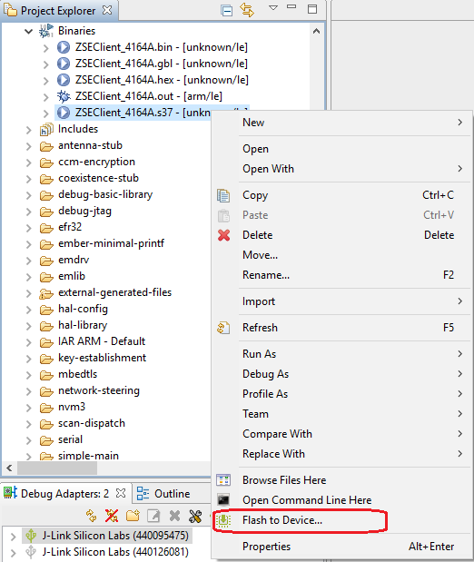
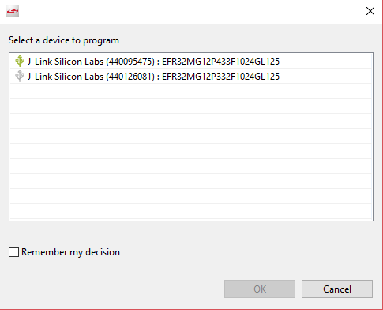
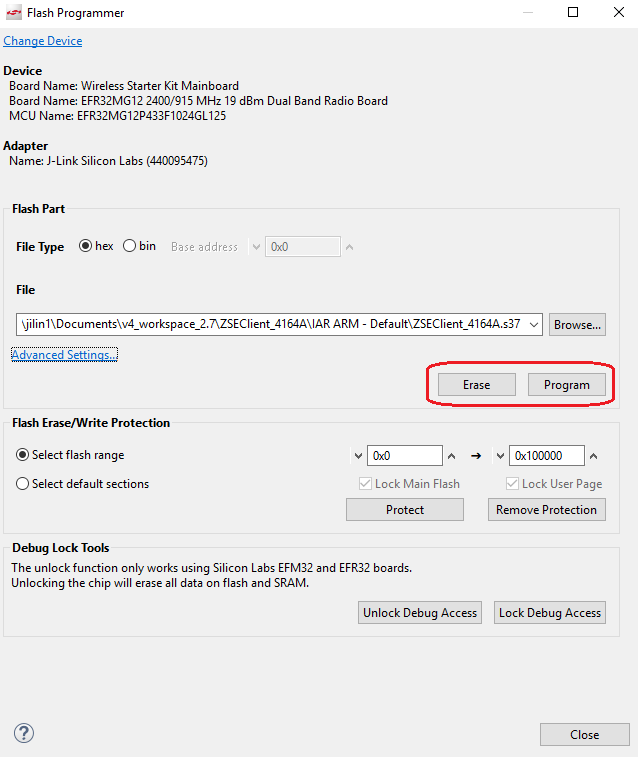
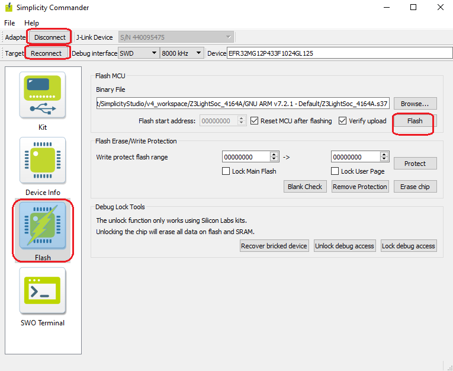

Table of Contents 

&nbsp;  

- [1. Flash Programmer](#1-flash-programmer)
- [2. Simplicity Commander](#2-simplicity-commander)

  

********

Currently we have two common approaches to flash a image into a device:  
- Use Flash Programmer
- Use Simplicity Commander
&nbsp;  

## 1. Flash Programmer
Using Flash Programmer is the most common approach to flash a image into a device. You can select the generated flash image (.hex or .s37) in "Project Explorer", right click and then select "Flash to Device".  

  

After that, the "Flash Programmer" will be started. There might be a pop-out window to let you choose the device if there is multiple devices connected.  

  

Then you can see the main window of "Flash Programmer". By default, the file is the one you selected.

  

Just click "Program" button to start the programming.  
If you click "Erase" button, it will erase the main flash (Starting from address 0). **All data saved in the main flash such as network info, security key, etc, will be lost.**

## 2. Simplicity Commander
You can also use "Simplicity Commander" to flash program.  
First, start "Simplicity Commander". Change to "Launcher" perspective, click the button  in toolbar, then select "Simplicity Commander".  

  

Select file and click "Flash" button.
