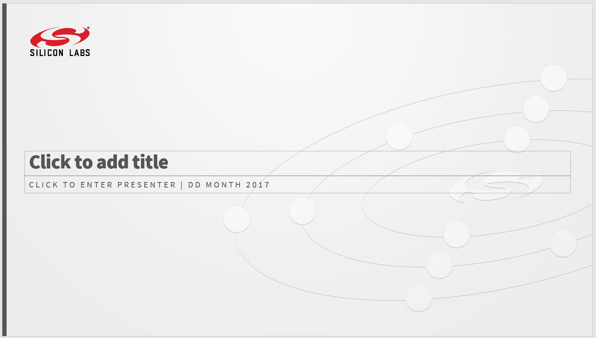
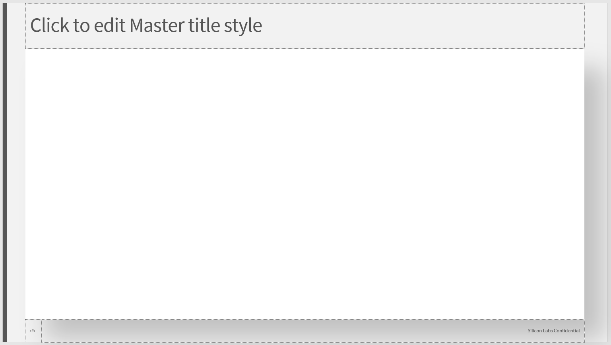
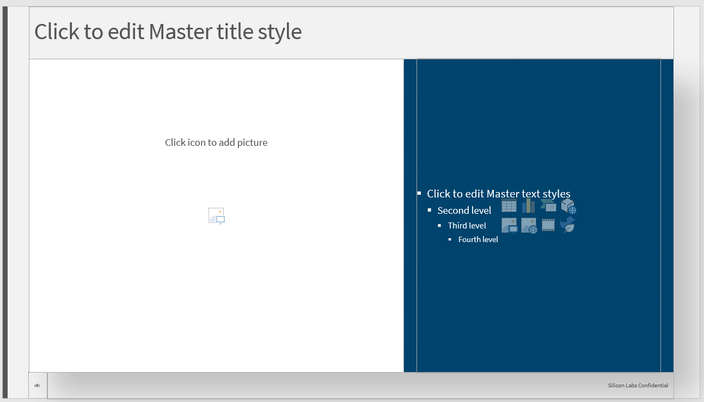
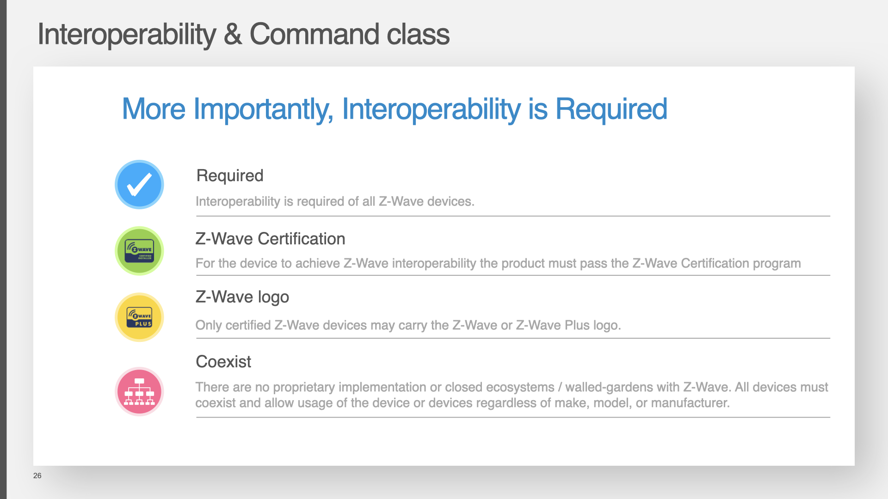
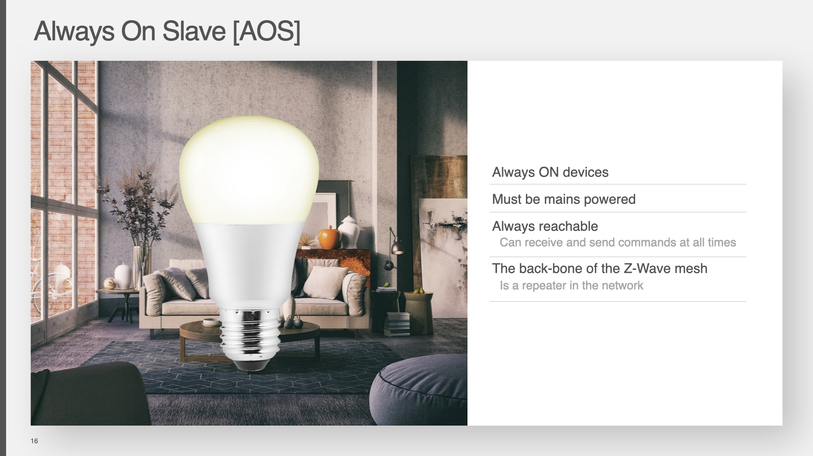
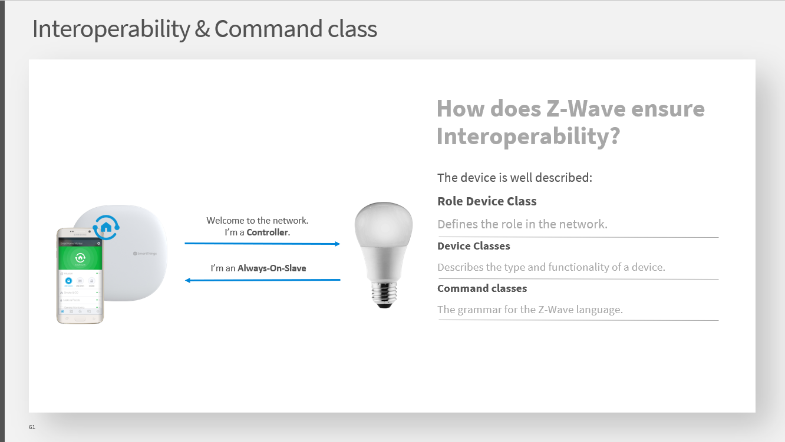
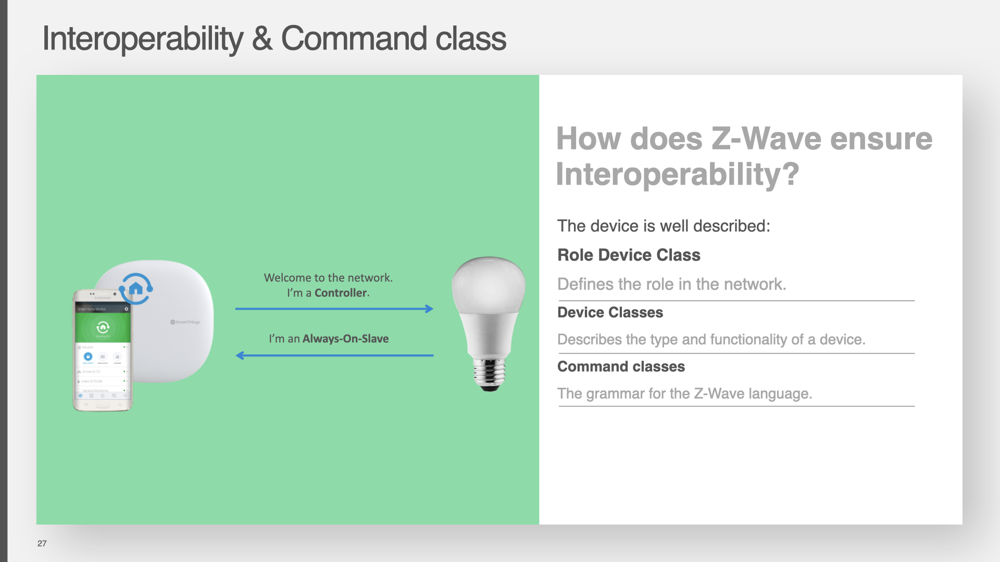
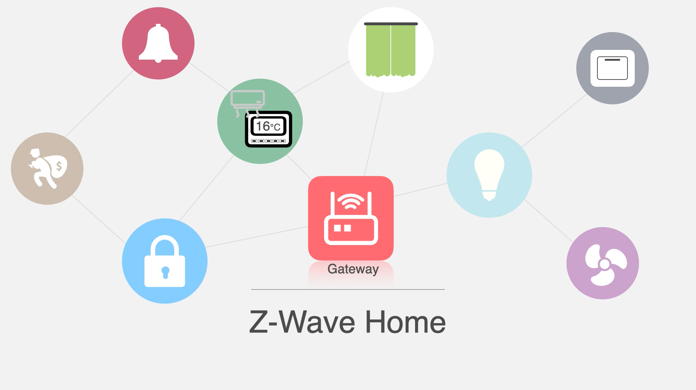
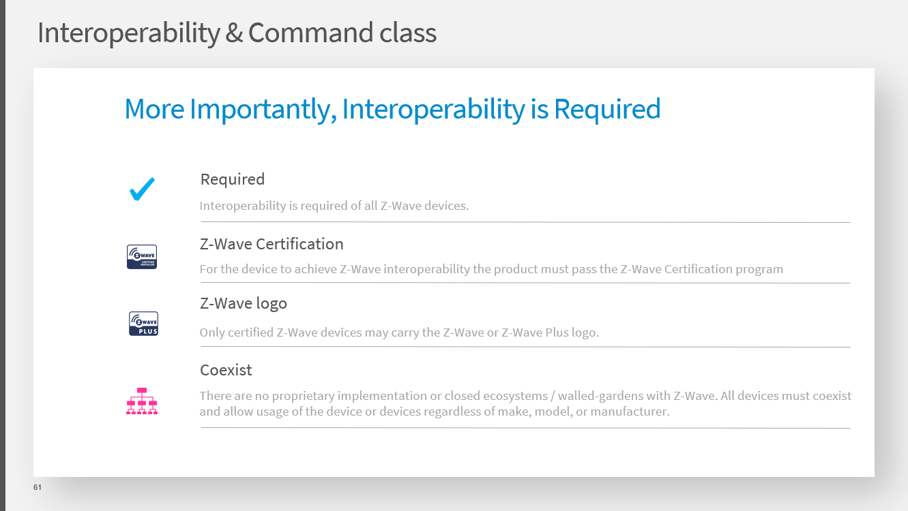
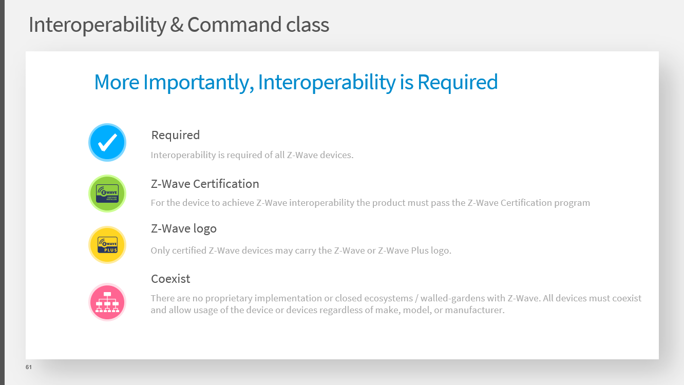

How To Create a Wonderful Slide
======   

   
# 母版
[Keynote母版下载](https://www.dropbox.com/s/2oygkb4n8ok8htc/Silabs%2BV_Slide_Theme.kth?dl=0)   
[PPT母版下载](https://www.dropbox.com/s/2yiaj74yvlm36og/Silabs%2BV_Slide_Theme.thmx?dl=0)   
母版修改自SiliconLabs官方模板，可以根据喜好自由选用某个布局，推荐一下四款布局，分别为母版布局1,2,3,4。  
   
   
   
   

# Slide布局   
根据内容选用合适的布局，总体原则建议多图片少文字
## Slide标题页面
可以采用母版布局1，或者在母版布局3的基础上添加背景图片和标题，如下图

## 只有文字的页面
提炼出重点作为提纲式布局，使用一些简介的小图标作为点缀。采用母版布局2

## 图片和文字共存的页面
可以使用左右布局来应对文字和图片共存的页面，采用母版布局4

当图片面积较小，不足以使用左右布局时，可以在图片后添加对比明显的背景色块。如下图，加了色块后比不加时更加稳重和舒服

## 只有图片的页面
采用母版布局3,注意色彩搭配，可以自由发挥   

# 色彩
要想搭配出舒服的色彩非常难，色彩搭配更像是一个哲学问题。搭配不好可能会毁掉整个slide。有一种不会犯错的搭配方式“使用低饱和的颜色，一个页面的颜色不超过三种（黑白灰除外），多使用黑白灰”
这是配色表链接 [《配色表》](http://tool.c7sky.com/webcolor/)，建议使用分类中的“柔和、明亮、温柔”和“柔和、洁净、爽朗”中的颜色，高饱和的颜色尽可能不用，使用不当容易翻车。

# 文字
全文保持一种字体类型，可以使用黑体等非衬线字体，不要使用宋体等衬线字体。 如需强调可以通过改变文字的字号和颜色深浅，尽可能只使用黑白灰来给文字上色。

# 整齐和对齐
## 整齐
确保图片大小一致，文字大小间距一致。
当遇到图片大小不一，可以使用背景色块来协调，如下两图对比，加色块后的图标更显统一和干净   

## 对齐
确保文字和图标在垂直和水平方向上的对齐，可以使用细小的线条来装饰对齐，如上图使用线条会使内容看上去比下图更清晰。

# 动画
Keynote建议多使用magic move，PPT则可使用Morph。

# Example
提供了一个例程供参考，大家可以直接复制slide某一页，在上面修改成你需要的内容： slide_example.pptx   slide_example.key 
提供了一个动画例程供参考如何使用Moroph：animation_example.pptx animation_example.key   
[示例下载](https://github.com/hoo-way/How-To-Create-a-Wonderful-Slide)