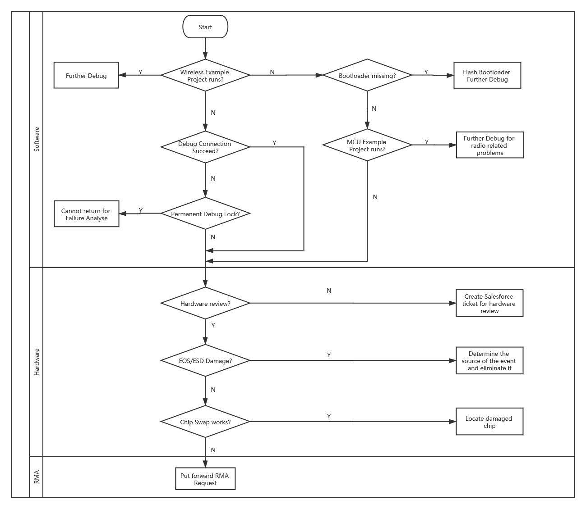
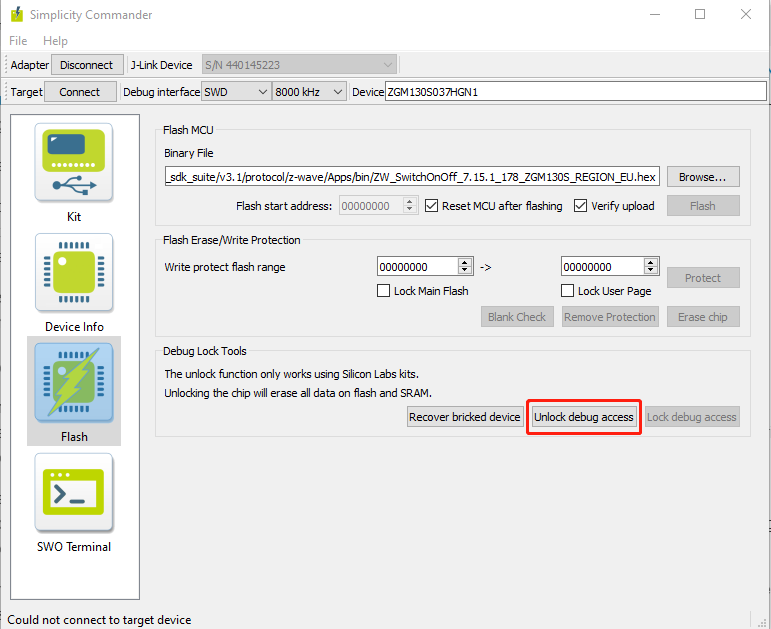
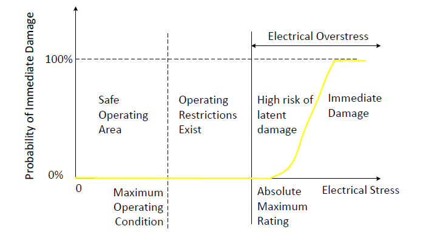
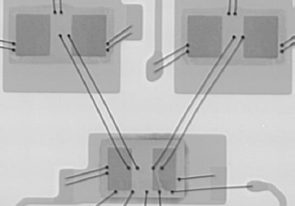
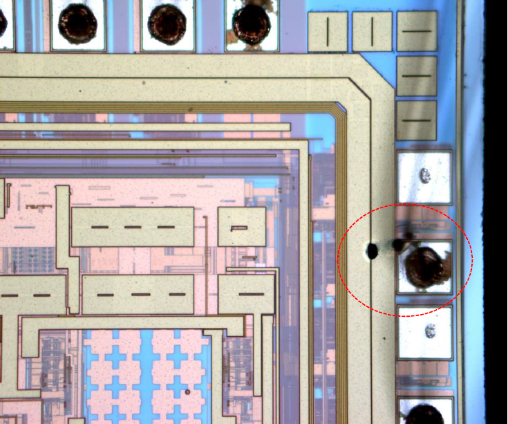

# IC boot up Failure Troubleshoot

## Introduction
Some of our customers may encounter the boot up failure issue caused by unexpected debug lock, unreasonable power supply, EOS/ESD damage, etc.   
This KBA sort out a general workflow for customer to troubleshoot this kind of boot up problem during development.


## Discussion
Chips have a failure rate measured in 0.0001%. Some failures (extremely low rate) are expected, but excessive failure rates coule be the result of a manufacturing issue. For the Failure Rate Estimation of Silicon Labs products, please refer to the [Quality and Reliability Report](https://www.silabs.com/documents/public/miscellaneous/QR-Report.pdf). In this article, a workflow is introduced to check and locate the start-up failure step by step.

<div align="center">
  
</div>  
</br>  

The giving flowchart shown above is divided into three parts, corresponding to the recommended process of chip failure analysis.   
The first thing to check is software. If the sample applications cannot run properly, hardware need to be verified. If no problems are found during the hardware inspection, an RMA request need to be made to Silicon Labs for further IC failure analysis. Different stages of inspection are described in details in the following sections.

### Software
In the first step, we need to narrow down whether the problem is from hardware or software.   

To confirm whether a software fault had occurred in the chip, the first step is to flash an example project to see if it can run properly.  

EFR32 series of products are similar with EFM32 Series 1 other than EFR32 devices having integrated radios while EFM32 devices do not.   

* To test the wireless capabilities of EFR32, you should flash with Wireless example project which can be found from Simplicity Studio. 
* To test the peripheral in EFR32/EFM32 devices, you can get MCU example project from [peripheral example](https://github.com/SiliconLabs/peripheral_examples).

If you run the example projects with no errors, congratulations! Your chips performe well. The problems occurred here might come from your software design and you should debug on your code to locate the issue.
If the example project cannot run on your device, take your time. Let's try to figure out the problem step by step.

#### Software should be compatible with hardware design
Improperly programmed application or incorrect configuration of peripherals can be the cause of unexpected behavior. This is because different hardware design might differ in flash size, GPIO configuration, power supply and so on, which causes incompatible software fails to work. 

**Note:** Please note to use hardware-compatible software designs.

#### Bootloader missing
If you intend to run a wireless application, it should be noted that Bootloader is required to allow your application to run. Wireless example project in Simplicity Studio do not include Gecko Bootloader by default, so you need to add it separately.  

The most reliable method is to build a bootloader for your device using the Appbuilder and flash the generated .s37 or .hex bootloader image file using Simplicity Commander.  

**Note:** Please remember to flash the Bootloader before running a wireless example.

#### Debugger Connection
To analyze an application to get to the root cause of an issue, it is often very useful to be able to see what is running on inside the software. You can debug your code to see if the program, configuration information, and state variables are correctly written, and monitor the program while it is running.

Sometimes it is possible to lose debug access to the MCU, unintentionally. A few examples include:

* disabling the debug pins
* turning off the HF oscillator the core is running from
* entering EM4

In this case, you can try to execute 'Debug Unlock' or 'Recover bricked device' to regain the debug access. It can be found from the Simplicity Commander Tool. For more details, please refer to KBA [Unlock a 'Bricked' EFM32](https://www.silabs.com/community/mcu/32-bit/knowledge-base.entry.html/2014/05/21/unlock_a_brickede-xkAm).

<div align="left" style="zoom:80%">
  
</div>  
</br>  

If you encounter problems in flashing the firmware, you can also do simple test to determine if the Debug Port is disbled or not. For example, you can open Simplicity Commander to see if you can "Erase chip". You can also use Command-Line Interface to simply dump flash content from Flash to check if it is available to read the Flash.

```c
commander readmem --region <startaddress>: +<length>
```

If the operation above failed, it could be a problem with debug port design or usage. In this case, please refer to [AN958: Debugging and Programming Interfaces for Custom Designs](https://www.silabs.com/documents/public/application-notes/an958-mcu-stk-wstk-guide.pdf) for more details.  

#### Debug Lock
Another possible reason is that debug lock is engaged. There are many reasons why a device maker does not want to allow anyone to dig into the chip and see the application. This prevents attachkers from using the debug interface to perform reprogramming the device, interrogating the device, interfering with the operation of the device, etc.

For these reasons, a chip is usually locked down when it leaves production to prevent adversaries from being able to gain access to the chip, often including internal company personnel who want to perform failure analysis.

Three properties govern the behavior of the debug lock.


| Property | Description IF Set | Default Value |
| :----- | :----- | :----- |
| Debug Lock| The debug port is kept locked on boot.|False (Disabled) |
| Device Erase| The Device erase command is available.|True (Enabled) |
| Secure Debug| Secure debug unlock is available.|False (Disabled) |

Using a different set of properties, three different locks can be put on Series 2 debug interface:

| | Secure Debug | Device Erase | Debug Lock | Description |
| :----- | :----- | :----- | :----- | :----- |
|**Standard Debug Lock**| Disabled| Enabled| Standard| The Device erase command will wipe the main Flash and RAM,and then a reset will yield an unlocked device.|
|**Permanent Debug Lock**| Disabled| Disabled| Permanent| The part cannot be unlocked. Devices with Permanent Debug Lock engaged cannot be returned for failure analysis.|
**Secure Debug Lock**| Enabled| Disabled| Secure| Secure debug unlock is enabled, which makes it possible to securely open the debug lock temporarily to reprogram or debug a locked device.|

Secure Debug Lock is one of the Secure Element Subsystem operations which is dedicated for Series 2 devices. The Secure Element Subsystem of Series 2 devices can be implemented by hardware or software. Please refer to the device reference manual for details.

**Note:** If your device had engaged with Permanent Debug Lock, it cannot be unlock thus make debug impossible.

For more information about Debug Lock of series 2 devices, please refer to [AN1190: Series 2 Secure Debug](https://www.silabs.com/documents/public/application-notes/an1190-efr32-secure-debug.pdf).

### Hardware
If the above software checks have been completed and still fails to locate the problem, then this could be a hardware fault. Next, we will try to figure out the breakdown in hardware.

Failure analysis sometimes goes on to other simple things, including looking for shorts, loose connections or soldering issues. Please carefully check if your board have below behaviors:
* Soldering at wrong profile could lead to delamination issues.
* Tensions in the PCB could crack the package and leads. 
* Submersion in liquids could cause formation of metal whiskers leading to shorts.
* Improper handling could lead to ESD damage.
* Sustained operation of IOs outside current / voltage limits over time could alter their characteristics.
* Significant transient voltage overshoot on pads could lead to damage.
* Excessive writes to the same flash regions could wear out specific flash bit-cells.
* Accelerated wear-out due to operation at high temperatures.

If your custom board design havn't been reviewed by Silabs Hardware Engineer, it is highly recommended to apply for **hardware review**.
You can request for support by creating salesforces ticket from [Connect Support](https://siliconlabs.force.com/s/contactsupport).

#### Power supply
An important consideration for all devices is the voltage requirements and dependencies between the power supply pins. The system designer needs to ensure that these power supply requirements are met, regardless of power configuration or topology. Take the EFR32 S2 as example:
* VREGVDD = AVDD (Must be the highest voltage in the system)
* VREGVDD ≥ DVDD
* VREGVDD ≥ IOVDD
* DVDD ≥ DECOUPLE

Please check if the Decouple output for on-chip voltage regulator is normal and ensure there is no power supply voltage dropping below the specs mentioned in the datasheet.
The analog peripheral performance of the device is impacted by the quality of the AVDD power supply.
The IOVDD pin(s) provide power for all the GPIO pins on the device.

For more details about hardware design considerations, please refer to the document below.  


[AN0002.1: EFM32 and EFR32 Wireless Gecko Series 1 Hardware Design Considerations](https://www.silabs.com/documents/public/application-notes/an0002.1-efr32-efm32-series-1-hardware-design-considerations.pdf)  
[AN0002.2: EFM32 and EFR32 Wireless Gecko Series 2 Hardware Design Considerations](https://www.silabs.com/documents/public/application-notes/an0002.2-efr32-efm32-series-2-hardware-design-considerations.pdf)

#### Oscillator
Most microcontrollers can use a crystal oscillator as their clock source. The main advantages of a crystal oscillator are good frequency accuracy, stability, and low power consumption. To solve common problems with crystal oscillators and to achieve high reliabiliy, it is important to pay attention to the configuration used, the components and their values, and the layout. If the oscillator doesn't work properly, it is possible that the selected crystal has poor operating characteristic and is not within the datasheet requirement. Please refer to the table 'High Frequency Crystal Oscillator' in the datasheet as per part number.

The failure of external crystal oscillator may also be the reason for the failure of chip to boot up normally. Please read the documents below for the oscillator design considerations of Silicon Labs EFR32/EFM32 device families.

[AN0016.1: EFM32 and EFR32 series 1 oscillator design considerations](https://www.silabs.com/documents/public/application-notes/an0016.1-efm32-series-1-oscillator-design-considerations.pdf)
[AN0016.2: EFR32 series 2 oscillator design considerations](https://www.silabs.com/documents/public/application-notes/an0016.2-efr32-series-2-oscillator-design-considerations.pdf)

#### EOS Damage
An electrical device suffers an Electrical Over-Stress(EOS) event when a maximum limit for either the voltage across, or the current through, or power dissipated in the device is exceeded and causes immediate damage or malfunction, or latent damage resulting in an unpredictable reduction of its lifetime


<div align="center">
  
</div>  
</br>  

The most common cause for this (over voltage failure, VDD or Vout is short to ground) is that the VDD exceeded its maximum rating by 0.5V.  If either of these events occurs in your system, then an electrical over stress (EOS) has occurred and can cause this type of permanent damage. Please note that this usually happen on a GPIO pin.   

To eliminate this issue the best thing to do is determine the source of the event and eliminate it. If not possible, then add transient voltage suppressors as a safeguard.

#### ESD Damage
When traces from MCU pins are routed to external circuits outside the PCB, to headers or connectors, those traces may experience electrostatic discharge (ESD), latch-up, or even possibly share signals with other systems with no common ground potential (should we move this after the words header or connector). Ensure there are no power (VCC & GND) shorts.

MCU pins can be protected from such conditions in many ways:

 * Galvanic Isolation
 * Filtering
 * Transorb or Schottky Diodes

Each of the above methods of protection and a detailed discussion on latch-up, ESD and ground loops can be found in [AN203](https://www.silabs.com/documents/public/application-notes/AN203.pdf) in Section 4 'Isolation and Protection'. 

#### Chip Swap
If you have finished checking the possible issue of hardware design, another way to confirm a damage chip is by doing chip swap from your target devices.

### RMA (Return Materials Authorization)
If all the above steps are checked out and still cannot locate the problem, you need to start Failure Analysis RMA.

When devices are sent to Silicon Labs for a failure analysis RMA, the devices are tested to determine how and why the devices failed.   

The failure analysis application procedures are as follows:  
(1) Create salesforce ticket at [Contact Technical Support](https://www.silabs.com/support/Pages/contacttechnicalsupport.aspx), submit a full description of the problem. The Applications team will review your case and approve your application (If you check all the above steps, still can't find the problem).  
(2) Contact with local FAE or sales team to ship your damaged chips.  
(3) The failure analysis team will provide a final report after full testing is completed.  
(4) Based on the results of the testing, you can contact the application teams for further investigation.  

For more details, please refer to [Starting an RMA](https://www.silabs.com/community/interface/knowledge-base.entry.html/2014/11/24/starting_an_rma-m5j4).

During the Failure Analysis procedure, a series of services are provided for test, including but not limited to the following technologies used.
* Acoustic Microscopy
* X-Ray Microscopy
* Decapsulation  
* Cross-section  
* Curve Tracing  

The result of Failure Analysis will be returned in term of "QI-xxxx —— Final Failure Analysis Report". Summary of results are detailed in the report. The following images show some examples of test results. 

(1) X-Ray inspection for a normal device
<div align="left">
  
</div>  
</br>
(2) EOS damage was observed via Decapsulation analysis
<div align="left" style="zoom:40%">
  
</div>  
</br>  


## Reference

[How to do Failure Analysis on Locked IoT Devices](https://www.silabs.com/documents/public/white-papers/how-to-do-failure-analysis-on-locked-iot-devices.pdf)  
[Quality, Environmental, Supply Chain and Corporate FAQs](https://www.silabs.com/about-us/corporate-responsibility/environmental-sustainability/quality-faq#quality-one)  
[Failure Analyses Techniques](https://eesemi.com/fa-techniques.htm)
