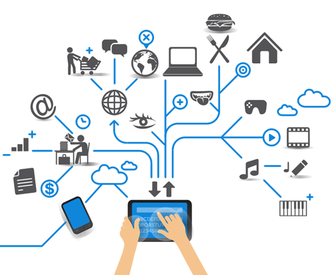
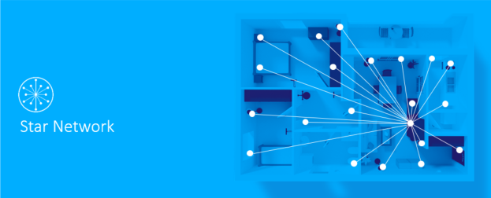
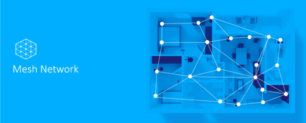
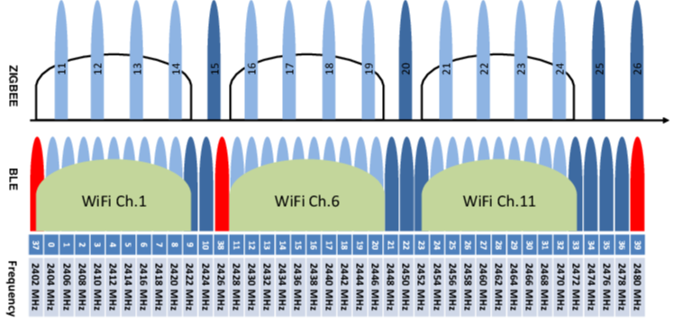
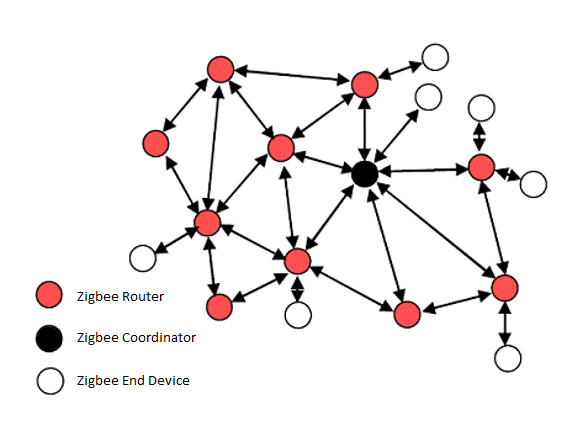
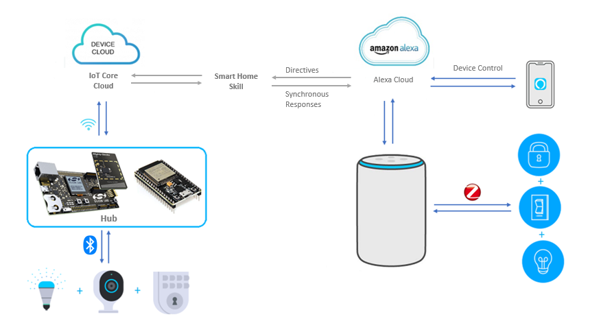
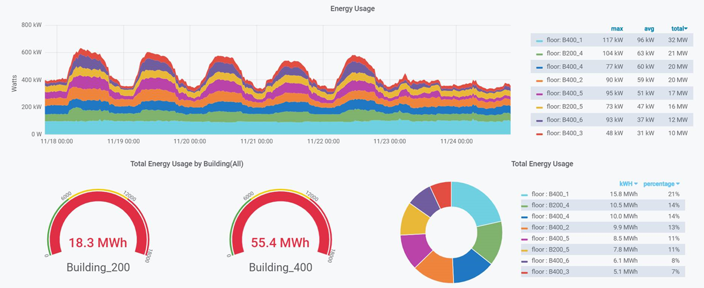

[English](IoT-Introduction) | 中文

目录 

- [1. 简介](#1-简介)
- [2. 智能家居](#2-智能家居)
- [3. 选择无线协议](#3-选择无线协议)
- [4. 网络管理](#4-网络管理)
- [5. 云服务](#5-云服务)
- [6. 物联网将如何改变我们的生活？](#6-物联网将如何改变我们的生活)

********

# 1. 简介
物联网是物与物连接的一个巨大网络，“物体”可以指代各种各样的设备，物理设备、车辆、家用电器等。物联网使这些对象能够连接和交换数据。物联网正在影响我们的生活方式，譬如使用智能手机来控制机器人，获取房间中的火灾报警传感器数据，使用智能手表来跟踪身体状况，这些都已经融入到您日常生活的方方面面。

物联网设备的应用通常划分为智能家居，智慧商业和智能工业。智能家居是了解物联网的绝佳起点。

# 2. 智能家居
物联网设备是更大范围的智能家居概念的一部分，其中可以包括照明、供暖和空调、媒体和安全系统等。智能家居可以自动化确认照明、电子设备关闭来节省能源，以维护消费的长远利益。

智能家居或自动化家居设备与网关/Hub建立连接，网关/Hub可能对智能设备和电器进行控制。例如，使用Amazon Echo Plus控制灯光，空调或感测室温。同样，您可以使用智能手机应用程序来对智能家居设备进行操作。

在智能家居应用中，整个物联网由三部分组成：

* __终端设备__
  厨房灯、运动探测器或空调等，它们加入到由Hub/网关所创建的网络中，并与Hub/网关或者网络中的其它终端设备进行交互。
* __Hub或网关__
  具有内置Hub/网关的智能音箱，例如Amazon Echo Plus，它构建网络，并将终端设备加入到该网络。它使得设备之间可以相互通信，并且负责整个网络的安全性。同时，网关/Hub设备使得终端设备、传感器等可以和云端相连，网络中的所有数据都可以通过网关/Hub传输至云端，同时云端的命令也可以通过网关/Hub下发至各个终端设备。
* __云服务__
  云服务提供了一种方法，允许移动设备App通过云从终端设备访问数据或向终端设备发送控制命令。在更为广泛的应用中，云服务还保留了与第三方云的接口，该接口可以与第三方生态系统中的终端设备进行交互。

这三个部分之间的所有连接都是无线的。
那么，我们需要选择哪一种无线协议来进行项目的开发？ 我们又如何来实现网络的创建、加入、离开，如何通过Hub/网关或移动设备应用程序与终端设备交互呢？
在以下各节中，我们将详细讨论。

# 3. 选择无线协议  
无线协议包括WiFi，Zigbee，Bluetooth Mesh，Z-Wave等。每个无线协议都是为特定目的而设计的。

**WiFi**是我们日常生活中最常使用无线协议。它基于IEEE 802.11，主要用于高速率的数据传输。它通常具有一个WiFi路由器来创建网络，每个终端设备搜索SSID，并使用用户名和密码加入网络。这也是我们常见的计算机和移动设备通过WiFi上网的方式。

WiFi具有高的数据速率，但随之而来的是高功耗，使其不太适合电池供电设备。它是一个星型网络，每个设备都与路由器交互，不能直接与其它终端设备通信，某些终端设备可能将无法与较远距离的路由器建立连接，在日常生活中我们也会经常遇到这种问题。
WiFi可用于智能音箱（Hub/网关）中，它与云服务连接以解析自然语音，或者接收来自移动设备所发送的命令。

**Zigbee**在物联网应用中非常受欢迎。它基于2003年定义的IEEE 802.15.4标准。Zigbee支持网状网络，低功耗，较低的数据速率，支持更远距离的传感器或其它终端设备间的通讯。由于该协议在数据速率、传输范围和功耗方面的技术限制，Zigbee更适合于小型有源无线网络。

**蓝牙mesh**是Bluetooth SIG 于2017年7月发布的mesh网络。

ISM（工业科学医疗频段）2.4G频段是一个全球开放的可使用频段，它支持WiFi（IEEE 802.11b/g/n），Zigbee/Thread（IEEE 802.15.4）， 经典蓝牙和低功耗蓝牙。

**WiFi** 在2.4 GHz频带范围内，WiFi支持14个相互重叠的20/22 MHz的信道。其中，信道1-13的中心频率为2.412GHz至2.472GHz，其信道与信道间中心频率间隔为5 MHz，信道14的中心频率为2.484 GHz，它与前一个信道的中心频率间隔为12 MHz。每个信道具有标称的22MHz带宽，但是802.11n可以绑定两个相邻的通道，从而形成标称的44MHz带宽。

**ZigBee**包含16个通道（11-26），中心频率为2.405GHz至2.480GHz，每个信道的标称带宽为2MHz。

**蓝牙mesh**低功耗蓝牙（BLE）规范定义了40个信道，其信道间隔为2 MHz。在40个信道中，有3个是广播信道（以红色显示），用于设备发现，连接建立和广播。蓝牙mesh是建立在蓝牙4.0之上的规范，它仅仅使用3个广播信道。

# 4. 网络管理
我们如何管理网络中的设备？

**WiFi**
路由器是WiFi网络的中心。它构建网络，并允许你使用无线信号连接计算机或移动设备。大多数路由器在各个方向都提供约30米的覆盖范围。您可以更改路由器的设置。例如，网络名称-SSID，路由器所使用的通道等。
通常，在WiFi网络中，WiFi Protected Access 2（WPA2）是推荐的安全性标准。您的终端设备通过选择正确的网络名称加入网络，并使用WPA2选项输入用户名和密码。 

**Zigbee**
Zigbee网络包含三种类型的节点：Zigbee协调器（ZC），Zigbee路由器（ZR）和Zigbee终端设备（ZED）。

* 协调器是构成网络的特殊路由器。在给定的网络中，只能有一个协调器。通常，网关/Hub充当协调器角色。
* 路由器不仅具有发送和接收数据包的能力，而且还具有为网络中其他节点进行中继的能力。
* 终端设备不中继数据包。终端设备依靠其父节点与网络进行通信。父节点通常是路由器节点，也可能是协调器。

**蓝牙mesh**
在蓝牙mesh网络中，Provisioner创建网络，并通过在网络中添加、配置和删除设备来管理网络。Hub/网关可以是创建网络的Provisioner。
蓝牙mesh网络由不同类型的节点组成：代理节点，中继节点，朋友节点和低功耗节点。

* 中继节点能够中继来自其他节点的消息，它们对于增加蓝牙mesh网络的规模和通讯范围至关重要。
* 代理节点可以充当蓝牙mesh网络和蓝牙设备（例如智能手机）之间的代理。
* 低功耗节点在其整个生命周期内，大部分时间都处在低功耗睡眠模式下。它需要一个朋友节点，该节点可在低功耗节点处于睡眠状态时缓存所有针对该低功耗节点的消息。
* 朋友节点可以为低功率节点缓存消息并存储它们，直到低功率节点唤醒并获取消息为止。

# 5. 云服务
从上面的描述中，我们知道网关/Hub/路由器在构建和管理网络方面起着关键作用。它通过专用协议（如WiFi，Zigbee或Bluetooth Mesh）与本地设备通信。此外，网关/Hub/路由器通过WiFi或以太网连接到因特网。它提供了一种方法，使得移动设备应用程序可以通过云服务来访问智能家居设备。

下图是亚马逊生态系统的智能家居模型。Alexa是内置在亚马逊智能音箱Echo Plus中的语音助手。在图的右侧，带有内置Zigbee Hub的Echo Plus构建了网络，智能终端设备通过Zigbee网状网络连接到Echo Plus，Alexa获取语音命令并通过云端来进行语义解析，然后通过Zigbee协议来控制终端设备。移动设备也可以通过以下路径与终端设备进行通信：移动设备-> Alexa Cloud-> Echo Plus->终端设备。

Amazon智能音箱支持Zigbee协议，那么它如何与支持其它协议，例如蓝牙mesh的终端设备进行通信呢？ 它提供了云到云服务，使之成为可能。  
从图的左侧开始，我们可以看到智能音箱的指令发送到Alexa Cloud，然后再发送到Device Cloud。支持Bluetooth Mesh协议的Hub从Device Cloud接收指令，并通过Bluetooth Mesh协议与终端设备进行交互。当然，移动应用程序也可以通过云控制这些Bluetooth Mesh终端设备。

**大数据分析**
智能家居或智能建筑的所有数据都发送到云中，这样我们就可以构建一个仪表板，以一种易于理解的方式来显示所有数据。下图是使用开源的分析与监控平台Grafana所创建的一个用于显示整个建筑用电量的仪表板。

# 6. 物联网将如何改变我们的生活？
物联网是当今最新兴的技术之一，对于每个人来说，我们都已清楚地认识到，我们正在朝着智慧城市，智能家庭，智慧建筑的方向发展。物联网使我们能够生活在一个更美好的世界中，并使之更加美好！

在智能家居的应用中，人们可以通过语音命令控制灯光的开/关，带指纹和密码的智能锁使您无需将钥匙放在口袋里，温度和湿度传感器以预定值打开/关闭空调，连接的摄像机可帮助你在线了解家庭中发生的情况。此外，物联网设备可用于启用远程健康监控和紧急情况通知系统。  

物联网使这一切成为可能，并使生活比以往更加舒适和美好。物联网正在不断带来巨大的变化，我们深处其中，我们无法预知未来世界将如何改变，或许世界将会有许多不同world line，让我们一起参与其中，并为改变世界做出贡献。

********

