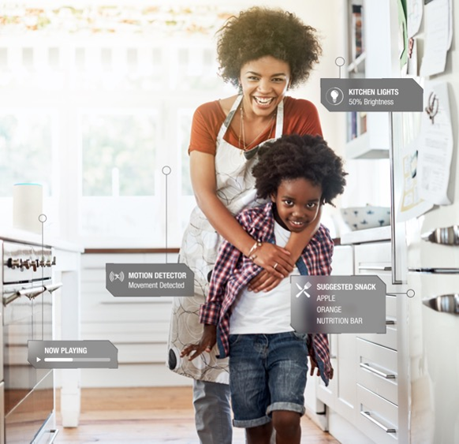
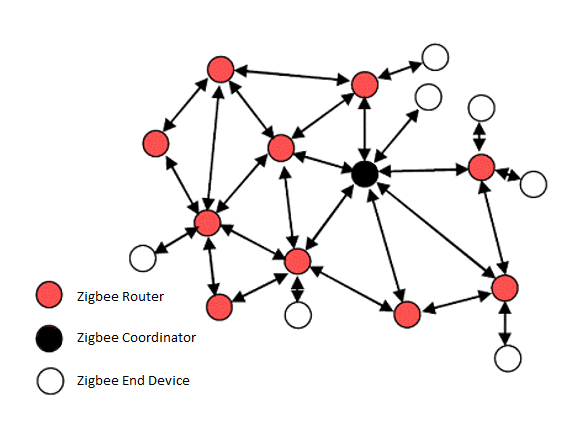
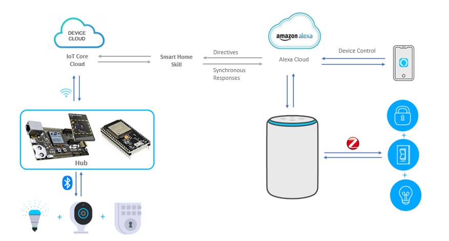

English | [中文](IoT-Introduction-CN) 

Table of Contents 

- [1. Introduction](#1-introduction)
- [2. Smart Home](#2-smart-home)
- [3. Choose wireless protocol](#3-choose-wireless-protocol)
- [4. Network management](#4-network-management)
- [5. Cloud Service](#5-cloud-service)
- [6. How IoT will change our life?](#6-how-iot-will-change-our-life)

********

# 1. Introduction
The Internet of Things or IoT is a giant network of “Things”. “Things” can refer to a wide variety of devices. physical devices, vehicles, home appliances. IoT enables these objects to connect and exchange data. IoT is influencing our lifestyle. From droids you control with the smartphone to fire alarm sensor in your room, or your smartwatch which is tracking your body status. It is almost everything that you came across in daily life. 

The extensive set of applications for IoT devices is often divided into smart home, consumer, commercial and industrial. The smart home is an excellent start point to understand IoT. 

# 2. Smart Home
IoT devices are a part of the larger concept of home automation, which can include lighting, heating and air conditioning, media and security systems. Long-term benefits could include energy savings by automatically ensuring lights and electronics are turned off.  

A smart home or automated home could be based on a platform or hub that controls smart devices and appliances. For instance, using Amazon Echo Plus to control the light, air conditioners, or sensing the room temperature. And the same way you can do with your smartphone app.  

In the smart home applications, the IoT environment consists of three parts:
* __End Devices__  
  Kitchen Lights, Motion detectors or air conditioners, it joins the network formed by Hub/Gateway, 
  Interact with Hub/Gateway or other end devices. 
* __Hub or Gateway__  
  The smart speaker - Amazon Echo PLus with built-in Hub/Gateway forms the network. It facilitates communication between your devices, maintains security. The Gateway/Hub device bridges the communication gap between end devices, sensors, equipment, systems and the cloud. All data moving to the cloud, or vice versa, goes through the gateway.
* __Cloud Service__  
  Cloud service provides a way that allows mobile device App to access data from or send control command to end devices via the cloud. In extensive usage, the cloud service also reserves an interface to 3rd party cloud that can interact with 3rd party ecosystem end devices. 

All the connections between the three parts are wireless. Which wireless protocol do we choose for the applications? How do we achieve all functionalities like network create/join/leave, interaction with end devices through Hub/Gateway or mobile device app? We will talk more about it in the following sections. 

# 3. Choose wireless protocol  
The wireless protocols vary that include WiFi, Zigbee, Bluetooth Mesh, Z-Wave.etc. Every wireless protocol is designed for a purpose. 

__WiFi__ is the most popular wireless protocol we are using in daily life. It is based on IEEE 802.11. It is for high-speed data transfer usage. It generally has a WiFi router to create the network. Each end device searches the SSID, joins the network with user name and password. That is how our computer and mobile device surging the internet via WiFi. 

WiFi's high data rate is matched by high power consumption, making it a poor fit for battery power devices. And it is a star network. Each device interacts with the router, cannot directly talk with other end devices. Some end devices might have a problem to connect with the router at the corner of the network. That how we are seeking the WiFi signal in our daily life. WiFi can be used in smart speaker (Hub/Gateway) to connect with cloud service for interpreting natural voice, or accessing data and sending command from mobile device. 

__Zigbee__ is very popular in IoT applications. It is based on the IEEE 802.15.4 standard defined in 2003. Zigbee enables mesh networking, low power consumption, lower data rate, allowing sensors and other end devices to connect to each other over longer distance.  Because of the protocol’s technological limitations about data rate, range, and power consumption, Zigbee is more appropriate for small-scale powered wireless networks.

__Bluetooth Mesh__ is a mesh network released in July 2017. 

ISM(Industrial Scientific Medical) Band 2.4G is reserved internationally for the use of radio frequency (RF) energy. It supports WiFi (IEEE 802.11b/g/n), Zigbee/Thread (IEEE 802.15.4), Bluetooth®, and Bluetooth low energy. 

__WiFi__ contains 13 overlapping channels (1-13) with center frequencies from 2.412GHz to 2.472GHz. Plus the 14th channel at 2.484 GHz. it is designated in the 2.4 GHz range, spaced 5 MHz apart from each other except for a 12 MHz space before channel 14. Each channel has a nominal 22MHz bandwidth, but 802.11n can bond two adjacent channels resulting in a nominal 44MHz bandwidth.

__ZigBee__ contains 16 channels (11-26) with center frequencies from 2.405GHz to 2.480GHz and each channel with a nominal 2MHz bandwidth. 

__Bluetooth Mesh__ Bluetooth low energy (BLE) specification defines 40 channels with 2 MHz channel spacing. Three of the 40 channels are advertising channels (shown in red) used for device discovery, connection establishment, and broadcast. Bluetooth Mesh is a specification on top of Bluetooth 4.0 which use only 3 advertising channels.

# 4. Network management
How do we manage the devices in a network?  

__WiFi__  
The router is the center of the WiFi network. It forms the network and allows you to use wireless signals to connect your computer or mobile devices. Most routers provide coverage for about 30 meters in all directions. You can change the setting of the router. For example, the name of the network - SSID. The channel that the router uses. Your router's security options, in general, WiFi Protected Access 2 (WPA2) is the recommended security standard for WiFi networks. Your end device joins the network by selecting the correct network name, input the user name and password with the WPA2 option. 

__Zigbee__  
The Zigbee network contains three types for basic node types: Zigbee Coordinator (ZC), Zigbee Router (ZR) and Zigbee End Device(ZED). 
* Coordinator is a special router that forms the network. In a given network there can only be one coordinator. In general, the Hub/Gateway play as coordinator role. 
* Router has the ability not only to send and receive its packets but also to relay for other nodes in the network. 
* End Device does not relay packets. An end device relies on its parent for communication with the network. The parent means there is some router node, potentially the coordinator.

__Bluetooth Mesh__  
In Bluetooth Mesh network, the provisioner creates and manages the network by adding, configuring and removing devices into/from the network. The Hub/Gateway can be the provisioner to create the network. A Bluetooth Mesh network consists of different types of nodes: Proxy, Relay, Friend and Low Power node.
* Relay Node is capable of relaying messages from other nodes and they are essential in increasing the scale and range of a Bluetooth mesh network.
* Proxy Node can act as a proxy between the Bluetooth mesh network and a Bluetooth device such as a smartphone.
* Low Power Node can spend most of their lifetime in a low power sleep mode. It needs a friend node that caches any messages targeted to the low power nodes while they are sleeping.
* Friend Node can cache messages for the low power nodes and store them until low power nodes wake up and fetch the messages. 

# 5. Cloud Service
From the above description, we know that a Gateway/Hub/Router plays a key role to form and manage the network. It communicates with the local devices with a dedicate protocol like WiFi, Zigbee or Bluetooth Mesh. Also, the Gateway/Hub/Router connects to the Internet through WiFi or Ethernet. It provides a way that your mobile device app can access smart home devices through cloud services. 

The below figure is the Amazon ecosystem smart home model. 
Alexa is a voice assistant which is built in the Amazon smart speaker Echo Plus. 
On the right side of the figure, the Echo Plus with built-in Zigbee hub forms the network. The smart end devices join the Zigbee mesh network and connected to Echo Plus. Alexa interpret natural language in the cloud and communicate with end devices via Zigbee protocol. The mobile device can communicate with end devices through the path: Mobile Device --> Alexa Cloud --> Echo Plus --> End Devices. 

The Amazon smart speaker supports the Zigbee protocol. How to communicate with other protocol enabled end devices? For example, Bluetooth Mesh. It provides a cloud to cloud service to make it possible. From the left side of the figure. We can see Smart Speaker directives were sent to Alexa Cloud and then goes to Device Cloud. The Hub that supports Bluetooth Mesh protocol receives the directives from Device Cloud and interacts with the end devices via Bluetooth mesh protocol. Of course, the mobile app also can control those Bluetooth Mesh end devices via the cloud. 

__Big Data Analysis__  
All data of Smart Home or Smart Building were sent to the cloud. We can build a dashboard to show the data in an easily understandable way. Here is a dashboard of a smart building created by Grafana which the open-source analytics & monitoring solution for every database is. 

# 6. How IoT will change our life?
IoT is one of the most emerging technologies nowadays and it is starting to be clear for everyone that we move towards smart cities, smart home, smart buildings. IoT allows us to live in a better world and make it even better! 

In the smart home applications. People can control lights on/off by voice command. The smart lock with fingerprint and password lets you are free from keeping a key in the pocket. The sensor of temperature and humidity turn on/off the air conditioner at the predefined value. The connected video camera helps you to know what happens in your home online.  Also, IoT devices can be used to enable remote health monitoring and emergency notification systems. Like smartwatch used in the sport.  

The IoT enables these and makes life more comfortable and better than before. We are on the way to the great changes that IoT brings to us. There is no idea how the world will be changed in the future. Many different possible world lines can be. Take part in it and contribute your passion to change the world. 

********

