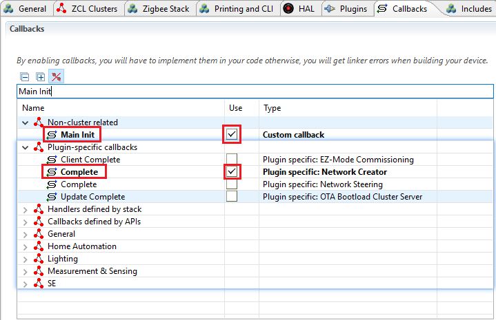
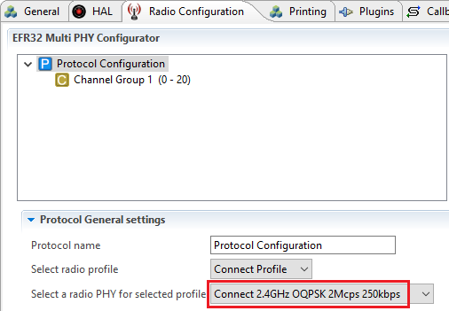
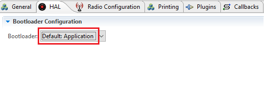
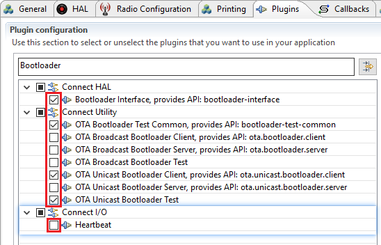
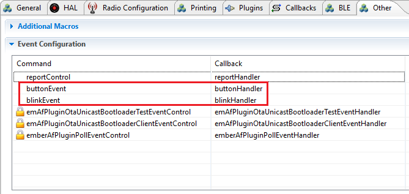

<details>
<summary><font size=5>Table of Contents</font> </summary>

- [1. Introduction](#1-introduction)
- [2. Prerequisite](#2-prerequisite)
  - [2.1 Hardware requirement](#21-hardware-requirement)
  - [2.2 Software requirement](#22-software-requirement)
- [3. Zigbee OTA Update](#3-zigbee-ota-update)
  - [3.1. Current OTA process](#31-current-ota-process)
  - [3.2. New OTA process](#32-new-ota-process)
  - [3.3. Implementation](#33-implementation)
    - [3.3.1 Zigbee OTA Client](#331-zigbee-ota-client)
    - [3.3.2 Zigbee OTA Server](#332-zigbee-ota-server)
    - [3.3.3 Zigbee OTA Update](#333-zigbee-ota-update)
- [4. Proprietary OTA Update](#4-proprietary-ota-update)
  - [4.1. Current OTA process](#41-current-ota-process)
  - [4.2. New OTA process](#42-new-ota-process)
  - [4.3. Implementation](#43-implementation)
    - [4.3.1 Proprietary OTA Client](#431-proprietary-ota-client)
    - [4.3.2 Proprietary OTA Server](#432-proprietary-ota-server)
    - [4.3.3 Proprietary OTA Update](#433-proprietary-ota-update)
- [5. Bluetooth LE OTA Update](#5-bluetooth-le-ota-update)
  - [5.1. Current OTA process](#51-current-ota-process)
  - [5.2. New OTA process](#52-new-ota-process)
  - [5.3. Implementation](#53-implementation)
    - [5.3.1 Bluetooth OTA Client](#531-bluetooth-ota-client)
    - [5.3.2 Bluetooth OTA Server](#532-bluetooth-ota-server)
    - [5.3.3 Bluetooth OTA Update](#533-bluetooth-ota-update)

</details>


# 1. Introduction
OTA (over-the-air) is a mechanism for remotely updating IoT device with new settings or firmware. The OTA Update mechanism is a core part of a IoT system’s architecture. OTA architectures for IoT contains two major part: Client and Server. The name can be vary on different wireless product. We define the terms here to make it not confused by different name of the role. 

__Client__: It can be the IoT end device or gateway which is capable of receiving new firmware image from a remote server. 

__Server__: It is responsible for sending firmware image to the client. It can be cloud or local host that is able to locally connect with client device. 

Silicon Labs has various wireless products, like Bluetooth LE/Mesh, Zigbee, Proprietary and Z-Wave. The operations are vary, some of them require many human interactions. Here we would like to simplify and reduce the operation and interactions during the OTA update procedure. 

Here is current design of a OTA update implementation. The OTA server includes a PC running host application, a WSTK board in NCP mode communicate with the host application via serial UART and deal with the wireless communication with client device. A OTA client is a WSTK board in SOC mode. The OTA image stored on host PC and sent to the NCP WSTK via UART and then send to the OTA client via wireless protocol.

<div align="center">
  
</div> 

We would talk in details for different protocol OTA optimization at following sections. We will show how it works right now, and what we are gonna to do to optimize the OTA procedure. As a final result, user should experience the same feeling on the OTA procedure no matter Bluetooth LE/Mesh, Zigbee or Proprietary. 


# 2. Prerequisite 
<details> <summary>Click on me to learn details</summary>

## 2.1 Hardware requirement
* 2 WSTK main development boards
* 2 EFR32MG12 radio boards (BRD4162A)

The BRD4162A radio board supports three wireless protocols. Bluetooth LE/Mesh, Zigbee and Proprietary. It has large size of internal and external flash which is a very good platform match with requirement of the implementation here. 

<div align="center">
    
</div> 


We will be using the LED0, LED1 as indicator of the status of network or OTA process. And The PB1 or PB0 to start the OTA procedure from the client device. 

## 2.2 Software requirement
**Simplicity Studio** is a free Eclipse-based Integrated Development Environment (IDE) and a collection of value-add tools provided by Silicon Labs. Developers can use Simplicity Studio to develop, debug and analyze their applications.  

**Wireless SDKs**. Please install latest Zigbee, Bluetooth and Proprietary SDK in Simplicity Studio. It generates or builds the software running on client or server side. The SDK version we are using in this article is "Gecko SDK Suite v2.7.2: 7.13.2.0, Bluetooth 2.13.0.0, EmberZNet 6.7.2.0, Flex 2.7.2.0, MCU 5.9.0.0". 

**Cygwin** is designed to let you take source code written to use POSIX APIs, and build them to run on Windows. The host app runs on server built with Cygwin.

Please take a reference at [Zigbee Preparatory Course](https://github.com/MarkDing/IoT-Developer-Boot-Camp/wiki/Zigbee-Preparatory-Course) for detailed description of software requirement. 
 
</details>

# 3. Zigbee OTA Update
First at all, we would like to do simple comparison between current design and new design we propose here. That helps us better understanding what is major changes and how we optimized the OTA procedure. 

Get reference of detailed introduction of current design at [AN728: Over-the-Air Bootload Server and Client Setup][AN728].

## 3.1. Current OTA process
* Connect client SoC WSTK device with UART console to PC
* Manually copy the client OTA image file under OTA server host application Z3Gatewayhost directory
* Run Z3GatewayHost.exe from PC to connect with NCP WSTK board
* Execute following commands from OTA server Z3GatewayHost to form and open the network
  * $net leave
  * $plugin network-creator start 1
  * $plugin network-creator-security open-network
* Execute following command from OTA client to join the network and then start OTA process. 
  * $plugin network-steering start 0
  * $plugin ota-client start

  It takes 5.5 minutes to complete the OTA update. 

## 3.2. New OTA process
* Run Z3GatewayHost.exe to connect with NCP WSTK board. It form and open the network
* Press any button on client WSTK board. It join the network and start OTA update without any interaction. 

The two LEDs on board show the status of network and OTA update. 


## 3.3. Implementation

Here we start the detailed steps on implementation to achieve above design idea. 
### 3.3.1 Zigbee OTA Client
<details> <summary>Click on me to learn details</summary>

For the design of OTA client. We would like to achieve following functionalities. 
* Press any button on board to start joining network and the OTA update
* LED1 ON indicates that the device has joined the network. LED OFF is opposite meaning
* LED0 Blinking indicates the OTA update in progress

A) Click on "New Project" in Simplicity Studio. Choose "Silicon Labs Zigbee", press Next; Choose "EmberZNet 6.7.2.0 GA SoC 6.7.2.0", press Next; Select "ZigbeeMinimal", press Next; Change the project name as "ZigbeeOTAClient", press Next and then press Finish. 

It open a ZigbeeOTAClient.isc which can config Zigbee related functionalities. There many Tabs on it for configuring different settings of project. 

B) In **ZCL Clusters** tab, Select ZCL device type as **HA devices->HA On/Off Switch**, Check the **Over the Air Bootloading ** client check box from Cluster List pane. The profile ID should be "Home automation (0x0104)"

<div align="center">
  
</div> 

C) In **Printing and CLI** tab, Enable the **Compiled-in** and **Enabled at startup** checkboxes for the **Ota Bootload cluster** 

<div align="center">
  
</div> 


D) In **Plugins** tab, Enable following plugins
* OTA Bootload Cluster Client
* OTA Bootload Cluster Client Policy
  *	Change the Firmware version to **0x100**. OTA update only works while the version number changed. 
* OTA Bootload Cluster Common Code
* OTA Bootload Cluster Storage Common Code
* OTA Cluster Platform Bootloader
* OTA Simple Storage Module
* OTA Simple Storage EEPROM Driver
  *	Set EEPROM Device Read-modify-write support to false
* EEPROM

<div align="center">
  
</div> 

E) In **Callbacks** tab, enable **Hal Button Isr** because we are going to start the OTA update by pressing a button.

<div align="center">
  
</div> 

F) In **Includes** tab, add steeringEventControl and its callback steeringEventHandler to manage the joining network operation.

<div align="center">
  
</div> 

G) Click on the Generate button on top-right of ZigbeeOTAClient.isc to generate source code of the project

H) Open the ZigbeeOTAClient_callbacks.c and add following function

```c
EmberEventControl steeringEventControl;
/*
 * LED1 ON if the client device already joined the network. And start the OTA Update
 * If the client device is not in the network, start joining network process.
 */
void steeringEventHandler(void)
{
  emberAfCorePrintln("steeringEventHandler\n\r");
  emberEventControlSetInactive(steeringEventControl);

  if (emberAfNetworkState() == EMBER_JOINED_NETWORK) {
    halSetLed(BOARDLED1);
    otaStartStopClientCommand(true);
  } else {
    EmberStatus status = emberAfPluginNetworkSteeringStart();
    emberAfCorePrintln("%p network %p: 0x%X", "Join", "start", status);
  }
}

/* 
 * LED1 ON while button pressed. LED1 OFF while button released and active 
 * the event steeringEventControl 
 */
void emberAfHalButtonIsrCallback(int8u button, int8u state)
{
  halSetLed(BOARDLED1);
  if (state == BUTTON_RELEASED) {
    halClearLed(BOARDLED1);
    emberEventControlSetActive(steeringEventControl);
  }
}

/*
 * This callback is fired when the Network Steering plugin is complete
 * If the status is success, then LED1 ON, active event steeringEventControl
 * with 1000 ms delay, start the OTA update in the steeringEventHandler(). 
 */
void emberAfPluginNetworkSteeringCompleteCallback(EmberStatus status,
                                                  uint8_t totalBeacons,
                                                  uint8_t joinAttempts,
                                                  uint8_t finalState)
{
  emberAfCorePrintln("%p network %p: 0x%X", "Join", "complete", status);
  if (status == EMBER_SUCCESS) {
    halSetLed(BOARDLED1);
    emberEventControlSetDelayMS(steeringEventControl, 1000);
  }
}
```

I) Build the project and download the firmware image ZigbeeOTAUpdate.s37 into the client WSTK board. 

If you don't know how to process it. Please get detailed reference at [Download firmware Image][Flash-Image]

J) Generate client OTA image
We need to have a new client image file for OTA update. Just simply change the **firmware version** in "ZigbeeOTAClient.isc->Plugins->OTA Bootload Cluster Client Policy" to 0x200. 

<div align="center">
  
</div> 

Generate the source code and build the project. Copy generated ZigbeeOTAClient.ota file to build/exe/ota-files under Z3GatewayHost project.

Python script can do this in automatic way. 

</details>

### 3.3.2 Zigbee OTA Server
<details> <summary>Click on me to learn details</summary>

For the design of OTA Server. We would like to achieve following functionalities.

* The PC host application Z3GatewayHost.exe automatic form and open the network to let client device join the network
* Z3GatewayHost.exe start OTA update according the request from client device. (It is default setting of current design)  

A) Click on "New Project" in Simplicity Studio. Choose "Silicon Labs Zigbee", press Next; Choose "EmberZNet 6.7.2.0 GA Host 6.7.2.0", press Next; Select "Z3Gateway", press Next; Keep project name as "Z3GatewayHost" unchanged, press Next and then press Finish.

It open a Z3GateHost.isc which can config Zigbee related functionalities. There many Tabs on it for configuring different settings of project. 

The OTA related plugins are enabled by default setting. We need to add several callback functions and event to enable automatic form and open network. 

B) In **Callbacks** tab, enable "Non-cluster related->Main Init" to active commissioning event to form or open network. Enabled "Plugin-specific callbacks->Complete" to active commissioning event to open network after forming network is done. 

<div align="center">
  
</div> 

C) In **Includes** tab, add **commissioningEventControl** command and **commissioningEventHandler** callback to maintain form and open network. 

<div align="center">
  
</div> 

D) Click on the Generate button on top-right of Z3GatewayHost.isc to generate source code of the project

E) Open the ZigbeeOTAClient_callbacks.c and add following function

```c
EmberEventControl commissioningEventControl;
/*
 * It active the commissioning event with 1000 ms delay
 */
void emberAfMainInitCallback(void)
{
  emberEventControlSetDelayMS(commissioningEventControl, 1000);
}
/*
 * It form network if network doesn't exist. It open the network 
 * if network exist to allow client device to join the network. 
 */
void commissioningEventHandler(void)
{
  EmberStatus status;

  emberAfCorePrintln("commissioningEventHandler\n\r");
  emberEventControlSetInactive(commissioningEventControl);
    
  status = emberAfNetworkState();
  emberAfCorePrintln("Network state = %d", status);

  if (status == EMBER_NO_NETWORK) {
    status = emberAfPluginNetworkCreatorStart(true); 
    emberAfCorePrintln("Form centralized network Start: 0x%X", status);
    return;
  }

  if (status == EMBER_JOINED_NETWORK) {
    status = emberAfPluginNetworkCreatorSecurityOpenNetwork();
    emberAfCorePrintln("Open network: 0x%X", status);
    return;
  }
}

/* 
 * This callback notifies the user that the network creation process has
 * completed successfully. It activate commissioning event to open the network
 * with 1000 ms delay.
 */
void emberAfPluginNetworkCreatorCompleteCallback(const EmberNetworkParameters *network,
                                                 bool usedSecondaryChannels)
{
  EmberStatus status;
  emberAfCorePrintln("emberAfPluginNetworkCreatorCompleteCallback");
  emberEventControlSetDelayMS(commissioningEventControl, 1000);
}

```

F) Build the Z3GatewayHost project under Cygwin terminal
Enter Z3GatewayHost project directory from Cygwin terminal, execute command
* $make -j8

<div align="center">
  
</div> 

The Z3GatewayHost.exe has been generated at ./build/exe/ folder

</details>

### 3.3.3 Zigbee OTA Update
<details> <summary>Click on me to learn details</summary>

* Connect NCP WSTK and Client SoC WSTK to PC
* Run Z3GatewayHost.exe from PC, make sure new OTA image has been put under ./ota-files folder. 
  * ./build/exe/Z3GatewayHost.exe -p COM5
* Press any button on Client SoC WSTK start joining network and begin OTA update
  * The LED1 is ON while joined network. The LED0 keep rapidly blinking during OTA update procedure
  * The LEDs are OFF while OTA upgrade end response and reboot 
  * Wait one minute for client to complete the image update to application area. 

The below GIF shows the OTA update procedure

<div align="center">
  
</div> 

</details>

# 4. Proprietary OTA Update
Again, we would like to do simple comparison between current design and new design we propose here. That helps us better understanding what is major changes and how we optimized the OTA procedure. 

The proprietary is flexible, customer can define the behavior according to their real need. No standard SDK, pre-defined operations. That means we can choose whatever is best suit for our application. Here, we will not choose NCP on the server side.(In fact, only 6 NCP questions were raised during pass 15 months). We keeps a SoC as OTA server. Sending firmware image to the OTA serve via UART interface from PC. That makes thing much easier to implement. 

Get reference of detailed introduction of current design at [UG235.06: Bootloading and OTA with Silicon Labs Connect][UG235.06].

## 4.1. Current OTA process
* Connect client and server SoC WSTK devices with UART console from PC
* Program OTA image file(sensorB.gbl) to OTA server
  * $commander.exe extflash write sensorB.gbl
* OTA server bootloader init, validate image, form and open network
  * $bootloader init
  * $bootloader validate-image
  * $form 0
  * $pjoin 120
* OTA client bootloader init, erase slot flash, join the network
  * $bootloader init
  * $bootloader flash-erase
  * $join 0
  * $bootloader set-tag 0xaa
* Start OTA update from OTA server
  * $bootloader unicast-set-target 0x0001
  * $bootloader unicast-dstribute 112560 0xaa  
    * Where 122560 is the size of the GBL image file in bytes. 
  * $bootloader unicast-request-bootload 1000 0xaa
    * Requests client bootloading after OTA update completed 
  

## 4.2. New OTA process
* Run terminal tool to connect with OTA server WSTK, it forms and open the network
* Press any button on client WSTK board. It join the network and start OTA update without any interaction. 

The two LEDs on board show the status of network and OTA update. 

## 4.3. Implementation
Here we start the detailed steps on implementation to achieve above design idea.
### 4.3.1 Proprietary OTA Client
<details> <summary>Click on me to learn details</summary>
Same as Zigbee OTA client. We would like to achieve following functionalities.

* Press any button on board to start joining network and the OTA update
* LED1 ON indicates that the device has joined the network. LED OFF is opposite meaning
* LED0 Blinking indicates the OTA update in progress

A) Click on "New Project" in Simplicity Studio. Choose "Silicon Labs Flex SDK", press Next; Choose "Connect(SoC):Sensor", press Next; Change the project name as "sensor", press Next and then press Finish.

It open a sensor.isc which can config Proprietary related functionalities. There many Tabs on it for configuring different settings of project.

B) In **Radio Configuration** tab, change the radio PHY to **Connect 2.4GHz OQPSK 2Mcps 250kbps** because the radio board we use is 2.4GHz. 

<div align="center">
  
</div> 

C) In **Hal** tab, choose **Application** in Bootloader Configuration.

<div align="center">
  
</div> 

D) In **Plugins** tab, 
* Enable following plugins
  * Bootloader Interface 
  * OTA Bootloader Test Common
  * OTA Unicast Bootloader Client 
  * OTA Unicast Bootloader Test 
* Disable Heartbeat plugin, it do nothing but toggling the LED1, we need the LED to indicate status.
  * Heartbeat

<div align="center">
  
</div> 

E) In **Other** tab, add blinkEvent and buttonEvent to manage joining network operation and show the network status.

<div align="center">
  
</div> 

F) Click on the Generate button on top-right of sensor.isc to generate source code of the project

G) Open flex-callbacks.c add following source codes and comment emberAfMainTickCallback() to release LED0

```C
EmberEventControl buttonEvent;
EmberEventControl blinkEvent;
static bool flash_is_erased = false;

void bootloaderFlashEraseCommand(void);
void bootloaderInitCommand(void);

/*
 * Join the network
 */
EmberStatus joinNetwork(void)
{
  EmberStatus status;
  EmberNetworkParameters parameters;

  emberSetSecurityKey(&securityKey);

  MEMSET(&parameters, 0, sizeof(EmberNetworkParameters));
  parameters.radioTxPower = txPower;
  parameters.radioChannel = 0;
  parameters.panId = SENSOR_SINK_PAN_ID;

  emberClearSelectiveJoinPayload();

  status = emberJoinNetwork(EMBER_STAR_END_DEVICE, &parameters);
  emberAfCorePrintln("join end device 0x%x", status);
  return status;
}

/*
 * Device joined network: LED1 ON, LED0 blinking
 * Device no network: LED1 OFF, LED0 OFF
 */
void blinkHandler(void){
  if (EMBER_JOINED_NETWORK == emberNetworkState()) {
    halSetLed(BOARDLED1);
    halToggleLed(BOARDLED0);
  } else {
    halClearLed(BOARDLED1);
    halClearLed(BOARDLED0);
  }
  emberEventControlSetDelayMS(blinkEvent, 300);
}

/*
 * It erase the slot flash for the first boot up.
 * Start joining the network if the device no network
 */
void buttonHandler(void)
{
  emberEventControlSetInactive(buttonEvent);

  if (flash_is_erased == false) {
    bootloaderInitCommand();
    bootloaderFlashEraseCommand();
	  flash_is_erased = true;
    emberEventControlSetDelayMS(blinkEvent, 300);
  }
  if (EMBER_NO_NETWORK == emberNetworkState()){
    joinNetwork();
  }
}

/*
 * LED1 ON while button pressed. LED1 OFF while button released.
 * And then active buttonEvent
 */
void halButtonIsr(uint8_t button, uint8_t state)
{
  halSetLed(BOARDLED1);
  if (state == BUTTON_RELEASED) {
    halClearLed(BOARDLED1);
    emberEventControlSetActive(buttonEvent);
  }
}

void emberAfMainTickCallback(void)
{
  #ifndef UNIX_HOST
//  if (emberStackIsUp()) {
//    halSetLed(NETWORK_UP_LED);
//  } else {
//    halClearLed(NETWORK_UP_LED);
//  }
  #endif
}
```

H) Build the project and download the firmware image sensor.s37 into the client WSTK board. 

If you don't know how to process it. Please get detailed reference at [Download firmware Image][Flash-Image]

I) Generate client OTA image
 Make any changes in the source code and build the project to generate OTA image sensor.gbl. 

</details>

### 4.3.2 Proprietary OTA Server
### 4.3.3 Proprietary OTA Update

# 5. Bluetooth LE OTA Update
## 5.1. Current OTA process
## 5.2. New OTA process
## 5.3. Implementation
### 5.3.1 Bluetooth OTA Client
### 5.3.2 Bluetooth OTA Server
### 5.3.3 Bluetooth OTA Update


[AN728]:https://www.silabs.com/documents/public/application-notes/an728-ota-client-server-setup.pdf
[UG235.06]:https://www.silabs.com/documents/public/user-guides/ug235-06-bootloading-and-ota-with-connect.pdf
[Flash-Image]:https://github.com/MarkDing/IoT-Developer-Boot-Camp/wiki/Flashing-Image