<details>
<summary><font size=5>Table of Contents</font> </summary>

- [1. Introduction](#1-introduction)
    - [1.1. Silicon Labs Solution Introduction](#11-silicon-labs-solution-introduction)
    - [1.2. IoT OTA Update Structure Definition](#12-iot-ota-update-structure-definition)
- [2. Prerequisite](#2-prerequisite)
    - [2.1. Hardware Requirement](#21-hardware-requirement)
    - [2.2. Software Requirement](#22-software-requirement)
    - [2.3. Bootloader Requirement](#23-bootloader-requirement)
- [3. Zigbee OTA Update](#3-zigbee-ota-update)
    - [3.1. Current OTA process](#31-current-ota-process)
    - [3.2. New OTA process](#32-new-ota-process)
        - [3.2.1. NCP-based Server and SoC Client](#321-ncp-based-server-and-soc-client)
        - [3.2.2. SoC Server and SoC Client](#322-soc-server-and-soc-client)
    - [3.3. Implementation](#33-implementation)
        - [3.3.1. NCP-based Server and SoC Client](#331-ncp-based-server-and-soc-client)
            - [3.3.1.1. Zigbee OTA Client](#3311-zigbee-ota-client)
            - [3.3.1.2. Zigbee OTA Server in NCP mode with host program](#3312-zigbee-ota-server-in-ncp-mode-with-host-program)
            - [3.3.1.3. Zigbee OTA Update](#3313-zigbee-ota-update)
        - [3.3.2. SoC Server and SoC Client](#332-soc-server-and-soc-client)
            - [3.3.2.1. Zigbee OTA Client](#3321-zigbee-ota-client)
            - [3.3.2.2. Zigbee OTA Server in SoC mode](#3322-zigbee-ota-server-in-soc-mode)
            - [3.3.2.3. Zigbee OTA Update](#3323-zigbee-ota-update)
- [4. Proprietary OTA Update](#4-proprietary-ota-update)
    - [4.1. Current OTA process](#41-current-ota-process)
    - [4.2. New OTA process](#42-new-ota-process)
    - [4.3. Implementation](#43-implementation)
        - [4.3.1. Proprietary OTA Client](#431-proprietary-ota-client)
        - [4.3.2. Proprietary OTA Server](#432-proprietary-ota-server)
        - [4.3.3. Proprietary OTA Update](#433-proprietary-ota-update)
- [5. Bluetooth LE OTA Update](#5-bluetooth-le-ota-update)
    - [5.1 Current OTA process](#51-current-ota-process)
    - [5.2 New OTA process](#52-new-ota-process)
        - [5.2.1 SoC Server and SoC Client](#521-soc-server-and-soc-client)
        - [5.2.2 NCP-based Server and SoC Client](#522-ncp-based-server-and-soc-client)
    - [5.3 Implementation](#53-implementation)
        - [5.3.1 SoC Server and SoC Client](#531-soc-server-and-soc-client)
            - [5.3.1.1 Internal Flash Bootloader](#5311-internal-flash-bootloader)
            - [5.3.1.2 BLE OTA Client](#5312-ble-ota-client)
            - [5.3.1.3 BLE OTA Server](#5313-ble-ota-server)
            - [5.3.1.4 BLE OTA Update](#5314-ble-ota-update)
        - [5.3.2 NCP-based Server and SoC Client](#532-ncp-based-server-and-soc-client)
            - [5.3.2.1 BLE OTA Server Host design](#5321-ble-ota-server-host-design)
            - [5.3.2.2 BLE OTA Server NCP design](#5322-ble-ota-server-ncp-design)
            - [5.3.2.3 BLE OTA Client](#5323-ble-ota-client)
            - [5.3.2.4 BLE OTA Update](#5324-ble-ota-update)
- [6. OTA Update Configuration](#6-ota-update-configuration)
    - [6.1 Commander Tool Operation](#61-commander-tool-operation)
    - [6.2 Protocol Definition ](#62-protocol-definition)
    - [6.3 Usage of the JSON Configuration](#63-usage-of-the-json-configuration)
    - [6.4. Python Script File](#64-python-script-file)

</details>


# 1. Introduction
OTA (over-the-air) is a mechanism for remotely updating IoT device with new settings or firmware. The OTA Update mechanism is a core part of a IoT system’s architecture. OTA architectures for IoT contains two major part: Client and Server. The name can be vary on different wireless product. We define the terms here to make it not confused by different name of the role. 

__Client__: It can be the IoT end device or gateway which is capable of receiving new firmware image from a remote server. 

__Server__: It is responsible for sending firmware image to the client. It can be cloud or local host(gateway) that is able to locally connect with client device. 

Silicon Labs has various wireless products, like Bluetooth LE/Mesh, Zigbee, Proprietary and Z-Wave. The operations are vary, some of them require many human interactions. Here we would like to unify the process and simplify the operation during the OTA update procedure. 

We would talk in details for different protocol OTA optimization start from 3rd sections. We will show how it works right now, and what we are gonna to do to optimize the OTA process. As a final result, user should experience the same feeling on the OTA procedure no matter Bluetooth LE/Mesh, Zigbee or Proprietary. 


## 1.1. Silicon Labs Solution Introduction
Before we start the discussion we would like to clarify some terms and basic knowledge of current design. 

* System on Chip(SoC) mode
  
  The SoC mode means full functional firmware running on Silicon Labs Wireless Starter Kit(WSTK) Board. The role can be client or server depends what function enabled in the firmware. 
* Network Coprocessor(NCP) mode
  
  The NCP mode mean it needs to cooperate with a host processor to achieve the full function protocol. In general, it is used in OTA server. Here is diagram of a OTA server(Host+NCP) and OTA client.
<div align="center">
  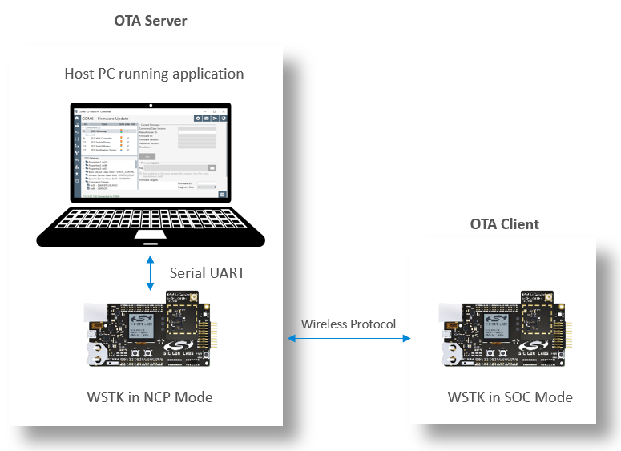
</div> 

* Standalone bootloader and application bootloader
  
  The bootloader consists of two parts. Main BL and First stage BL. The Main BL is for update application firmware. The first stage BL is for update Main BL. 

  * The standalone bootloader works with NCP mode firmware. The Main BL supports XModem protocol that receive NCP image from host and update the application firmware. 
<div align="center">
  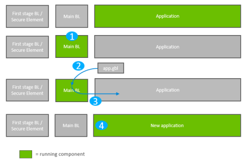
</div> 

  * The application bootloader works with SoC mode firmware. The application firmware receives the OTA image and store it on the internal flash. Then reboot to bootloader and Main BL read OTA image from internal flash storage area and update it to the application area. 

<div align="center">
  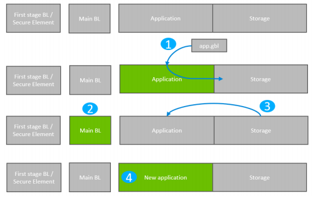
</div> 

detailed info of bootloader can be found at [UG266: Silicon Labs Gecko Bootloader User’s Guide][UG266].

## 1.2. IoT OTA Update Structure Definition
We define the general OTA update structure that implements to all protocols: Zigbee, Proprietary and Bluetooth. That helps us to simplify the design and make it more clear to users. 

* **Client** is same for each product(Proprietary, Zigbee, Bluetooth)
  * The Bootloader and the first copy of Client Application image need be programmed by Commander.exe
  * Client Application start OTA request, received the OTA image and store it into internal flash slot
  * Internal Storage Application Bootloader, get OTA image from internal flash and update the application area

* **Server** consists of two mode, SoC and NCP.

  * **SoC**:
    * The Bootloader, Server Application and OTA image need to be programmed by Commande.exe
    * Server Application running from EFR32 read the OTA image from its internal flash slot and send it to client
    * Internal Storage Application Bootloader

  * **NCP**:
    * The Bootloader and first copy of NCP image need to be programmed by Commander.exe.
    * The Server Application need to be built in host system, the OTA image need to be copied on specific host directory.
    * Server Application runs from host and co-work with NCP via UART connection, read OTA image from host filesystem and send it to client
    * Standalone XModem Bootloader, get NCP image from host by XModem protocol and update NCP image


# 2. Prerequisite 

## 2.1. Hardware Requirement
* 2 WSTK main development boards
* 2 EFR32MG12 radio boards (BRD4162A)

  Or
* 2 [EFR32BG22 Thunderboard Kit(BRD4184A)](https://www.silabs.com/development-tools/thunderboard/thunderboard-bg22-kit)

The BRD4162A radio board supports three wireless protocols. Bluetooth LE/Mesh, Zigbee and Proprietary. It has large size of internal and external flash which is a very good platform match with requirement of the implementation here. 

<div align="center">
  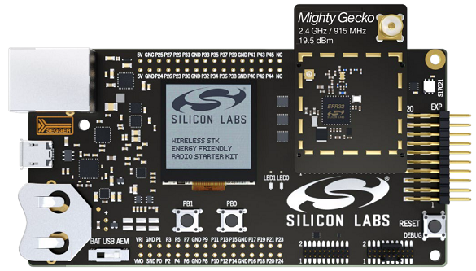  
</div> 


We will be using the LED0, LED1 as indicator of the status of network or OTA process. And The PB1 or PB0 to start the OTA procedure from the client device. 

The Thunderboard™ EFR32BG22 is a small form-factor, low cost product, it support Bluetooth LE/Mesh and Proprietary. In this article BLE/Proprietary OTA are implemented on this kit(TB BG22).
<div align="center">
  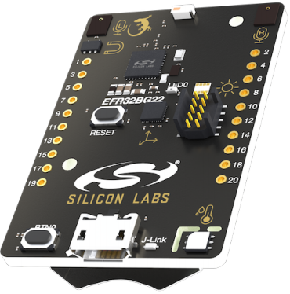  
</div> 
We will be using the LED0 as indicator of the status of network and OTA process. And The BTN0 to start the OTA procedure from the client device. 

## 2.2. Software Requirement
**Simplicity Studio** is a free Eclipse-based Integrated Development Environment (IDE) and a collection of value-add tools provided by Silicon Labs. Developers can use Simplicity Studio to develop, debug and analyze their applications.   
Silicon Labs recently released the [Simplicity Studio 5](https://www.silabs.com/products/development-tools/software/simplicity-studio/simplicity-studio-5) which is based on the latest versions of Eclipse and the C/C++ Development Tooling. Builds off the features of the previous version and includes advanced SecureVault technology, a new web-like interface, and solid performance improvements.   

**Wireless SDKs**. Please install latest Zigbee, Bluetooth and Proprietary SDK in Simplicity Studio. It generates or builds the software running on client or server side. The SDK version we are using in this article is "Gecko SDK Suite: Bluetooth 3.0.0.2, EmberZNet 6.8.0.1, Flex 3.0.0.2, MCU 5.10.0.1, Platform 3.0.0.0".

**Cygwin** is designed to let you take source code written to use POSIX APIs, and build them to run on Windows. The host app runs on server built with Cygwin.

Please take a reference at [Zigbee Preparatory Course][preparatory-course] for detailed description of software requirement. 

## 2.3. Bootloader Requirement
The Gecko Bootloader consists of standalone and application bootloader. For application bootloader, it needs to store the received OTA image in storage area. The application bootloader consists of internal storage and external storage bootloader. To unify the bootloader to address the requirement from different products. We choose **Internal Storage Application Bootloader**. The first thing we need to define the size of the storage area which calls slot.  

A) Click on "Create New Project" in Simplicity Studio 5 launcher perspective. Choose "Bootloader"; Select "Internal Storage Bootloader(single image on 1MB device)" because EFR32MG12 internal flash size is 1MB, press Next; Keep the project name unchanged, press Next and then press Finish.   

It open a bootloader-storage-internal-single.isc which can config Bootloader related functionalities. There are some Tabs on it for configuring different settings of project.   

B) In **Storage** tab, for 1MB flash device, the default slot size is 458752(0x70000) bytes, plus start address 540672(0x84000), the end address is 0xF4000. For 512KB flash device, the default slot size is 196608(0x30000) bytes, plus start address 278528(0x44000), the end address is 0x74000. The last 48K bytes flash will be reserved for NVM3. We can just keep the default storage setting as it is. More information about NVM3, please see [AN1135 Using Third Generation Non-Volatile Memory][AN1135].    

<div align="center">
  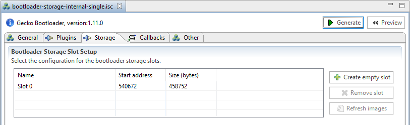  
</div> 

C) Click on **Generate** button on top-right of bootloader-storage-internal-single.isc/bootloader-storage-internal-single-512k.isc to generate source code of the project.

D) Build the project and program the bootloader-storage-internal-single-combined.s37/bootloader-storage-internal-single-512k.s37 to target board. 
 


# 3. Zigbee OTA Update
First at all, we would like to do simple comparison between current design and new design we propose here. That helps us better understanding what is major changes and how we optimized the OTA procedure. 

Zigbee OTA bootloading session involves two devices, OTA Client device and OTA Server device. Generally, Client is the Zigbee device running on System-on-Chip mode which will request and receive the new firmware image from the Server device. 

And the Zigbee OTA Server can run on either SoC or NCP mode with a host, OTA Server will store the new Client firmware image in the local storage or host's local file system depends on which mode the OTA Server is using.
The following figures show diagram of two different scenarios of Zigbee OTA.
<div align="center">
  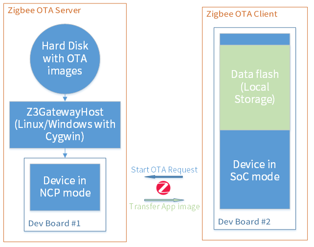  
</div> 
<div align="center">
  <b>NCP-based OTA server and SoC mode Client hardware diagram</b>
</div>  
</br>

<div align="center">
  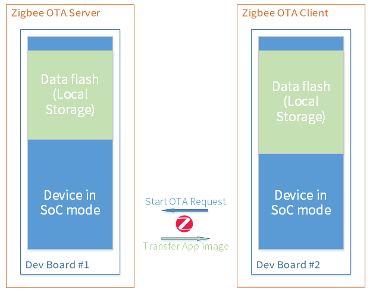  
</div> 
<div align="center">
  <b>SoC mode OTA server and SoC mode Client hardware diagram</b>
</div>  
</br>

Get reference of detailed introduction of current design at [AN728: Over-the-Air Bootload Server and Client Setup][AN728].

## 3.1. Current OTA process

The existing AN728 show how to configure the NCP-based Server and SoC mode client for OTA process as below.   
* Connect client SoC WSTK device with UART console to PC
* Manually copy the client OTA image file under OTA server host application Z3Gatewayhost directory
* Run Z3GatewayHost.exe from PC to connect with NCP WSTK board
* Execute following commands from OTA server Z3GatewayHost to form and open the network
  * $net leave
  * $plugin network-creator start 1
  * $plugin network-creator-security open-network
* Execute following command from OTA client to join the network and then start OTA process. 
  * $plugin network-steering start 0
  * $plugin ota-client start

  It takes 5.5 minutes to complete the OTA update. 

## 3.2. New OTA process
### 3.2.1. NCP-based Server and SoC Client
* Run Z3GatewayHost.exe to connect with NCP WSTK board. It form and open the network
* Press any button on client WSTK board. It join the network and start OTA update without any interaction. 

The two LEDs on board show the status of network and OTA update. 

### 3.2.2. SoC Server and SoC Client
* Power on the OTA Server device, it will form and open the network.
* Store the new client firmware image into the local storage of OTA Server device.
* Press any button on client WSTK board. It join the network and start OTA update without any interaction.

The two LEDs on board show the status of network and OTA update.

## 3.3. Implementation

Here we start the detailed steps on implementation to achieve above design idea. 

### 3.3.1. NCP-based Server and SoC Client

#### 3.3.1.1. Zigbee OTA Client

For the design of OTA client. We would like to achieve following functionalities. 
* Press any button on board to start joining network and the OTA update
* LED1 ON indicates that the device has joined the network. LED OFF is opposite meaning
* LED0 Blinking indicates the OTA update in progress

A) Click on "New Project" in Simplicity Studio. Choose "Silicon Labs Zigbee", press Next; Choose "EmberZNet 6.8.0.1 GA SoC 6.8.0.1", press Next; Select "ZigbeeMinimal", press Next; Change the project name as "ZigbeeOTAClient", press Next and then press Finish. 

It open a ZigbeeOTAClient.isc which can config Zigbee related functionalities. There many Tabs on it for configuring different settings of project. 

B) In **ZCL Clusters** tab, Select ZCL device type as **HA devices->HA On/Off Switch**, Check the **Over the Air Bootloading ** client check box from Cluster List pane. The profile ID should be "Home automation (0x0104)"

<div align="center">
  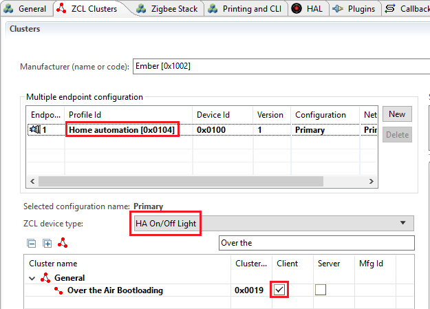
</div> 
</br>

C) In **Printing and CLI** tab, Enable the **Compiled-in** and **Enabled at startup** checkboxes for the **Ota Bootload cluster** 

<div align="center">
  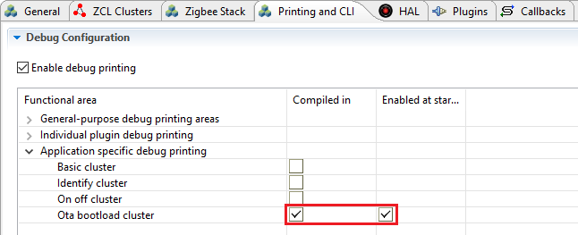
</div> 
</br>

D) In **Plugins** tab, Enable following plugins
* OTA Bootload Cluster Client
* OTA Bootload Cluster Client Policy
  *	Change the Firmware version to **0x100**. OTA update only works while the version number changed. 
* OTA Bootload Cluster Common Code
* OTA Bootload Cluster Storage Common Code
* OTA Cluster Platform Bootloader
* OTA Simple Storage Module
* OTA Simple Storage EEPROM Driver
  *	Set EEPROM Device Read-modify-write support to "false"
  * Set Gecko Bootloader Storage Support to "Use first slot"
* EEPROM
* Slot Manager
  

<div align="center">
  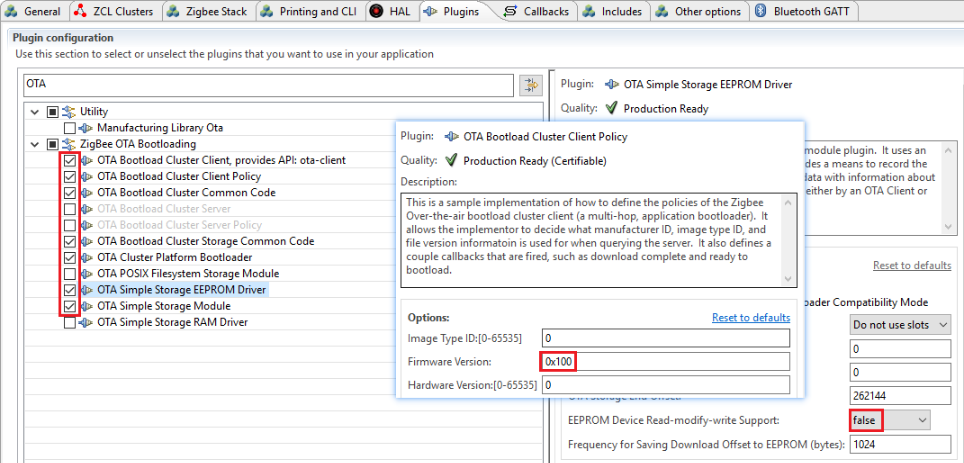
</div> 
</br>

E) In **Callbacks** tab, enable **Hal Button Isr** because we are going to start the OTA update by pressing a button. Also enable the **Main Init** under "Non-cluster related" and we'll print the version of the running software in this callback function.  

<div align="center">
  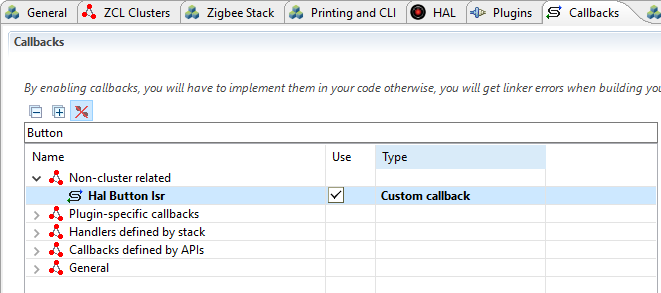
</div> 
<br>

<div align="center">
  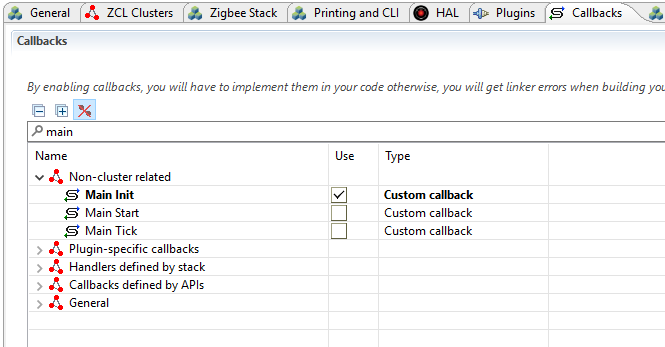
</div> 
</br>

F) In **Includes** tab, add steeringEventControl and its callback steeringEventHandler to manage the joining network operation.

<div align="center">
  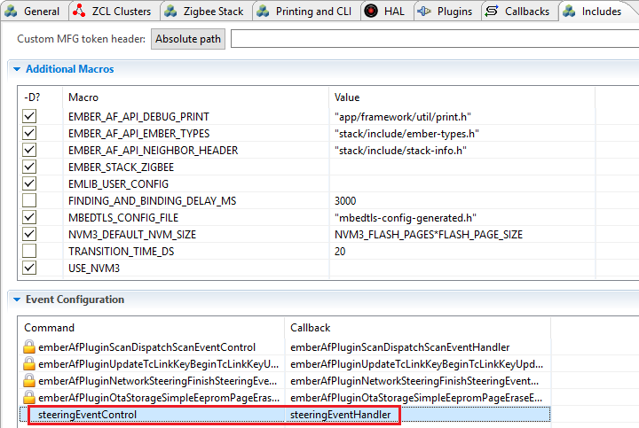
</div> 

G) Click on the Generate button on top-right of ZigbeeOTAClient.isc to generate source code of the project

H) Open the ZigbeeOTAClient_callbacks.c and add following function

```c
EmberEventControl steeringEventControl;
/*
 * LED1 ON if the client device already joined the network. And start the OTA Update
 * If the client device is not in the network, start joining network process.
 */
void steeringEventHandler(void)
{
  emberAfCorePrintln("steeringEventHandler\n\r");
  emberEventControlSetInactive(steeringEventControl);

  if (emberAfNetworkState() == EMBER_JOINED_NETWORK) {
    halSetLed(BOARDLED1);
    otaStartStopClientCommand(true);
  } else {
    EmberStatus status = emberAfPluginNetworkSteeringStart();
    emberAfCorePrintln("%p network %p: 0x%X", "Join", "start", status);
  }
}

/* 
 * LED1 ON while button pressed. LED1 OFF while button released and active 
 * the event steeringEventControl 
 */
void emberAfHalButtonIsrCallback(int8u button, int8u state)
{
  halSetLed(BOARDLED1);
  if (state == BUTTON_RELEASED) {
    halClearLed(BOARDLED1);
    emberEventControlSetActive(steeringEventControl);
  }
}

/*
 * This callback is fired when the Network Steering plugin is complete
 * If the status is success, then LED1 ON, active event steeringEventControl
 * with 1000 ms delay, start the OTA update in the steeringEventHandler(). 
 */
void emberAfPluginNetworkSteeringCompleteCallback(EmberStatus status,
                                                  uint8_t totalBeacons,
                                                  uint8_t joinAttempts,
                                                  uint8_t finalState)
{
  emberAfCorePrintln("Join network complete: 0x%X", status);  
  if (status == EMBER_SUCCESS) {
    halSetLed(BOARDLED1);
    emberEventControlSetDelayMS(steeringEventControl, 1000);
  }
}

/** @brief Main Init
 *
 * This function is called from the application's main function. It gives the
 * application a chance to do any initialization required at system startup. Any
 * code that you would normally put into the top of the application's main()
 * routine should be put into this function. This is called before the clusters,
 * plugins, and the network are initialized so some functionality is not yet
 * available.
        Note: No callback in the Application Framework is
 * associated with resource cleanup. If you are implementing your application on
 * a Unix host where resource cleanup is a consideration, we expect that you
 * will use the standard Posix system calls, including the use of atexit() and
 * handlers for signals such as SIGTERM, SIGINT, SIGCHLD, SIGPIPE and so on. If
 * you use the signal() function to register your signal handler, please mind
 * the returned value which may be an Application Framework function. If the
 * return value is non-null, please make sure that you call the returned
 * function from your handler to avoid negating the resource cleanup of the
 * Application Framework itself.
 *
 */
void emberAfMainInitCallback(void)
{
  otaPrintClientInfo();
}
```

I) Build the project and download the firmware image ZigbeeOTAClient.s37 into the client WSTK board. 

If you don't know how to process it. Please get detailed reference at [Download firmware Image][Flash-Image]. After the device boot up, it will output the version of the running software as below which is 0x100.  
<div align="center">
  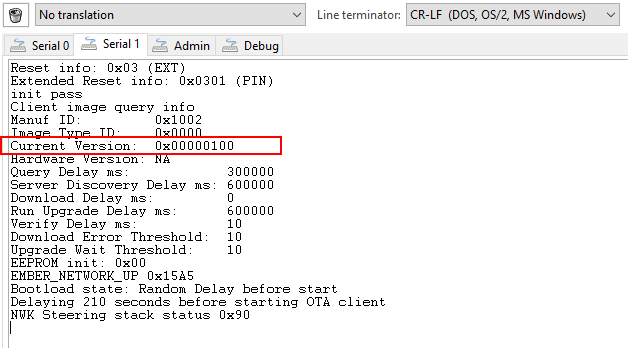
</div> 

J) Generate client OTA image   
We need to have a new client image file for OTA update. Just simply change the **firmware version** in "ZigbeeOTAClient.isc->Plugins->OTA Bootload Cluster Client Policy" to 0x200. 

<div align="center">
  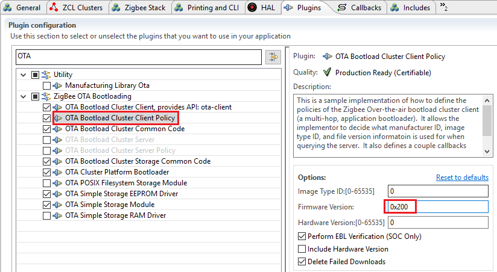
</div> 
</br>

Generate the source code and build the project. Copy generated ZigbeeOTAClient.ota file to build/exe/ota-files under Z3GatewayHost project.


#### 3.3.1.2. Zigbee OTA Server in NCP mode with host program

For the design of NCP-based OTA Server. We would like to achieve following functionalities.

* The PC host application Z3GatewayHost.exe automatic form and open the network to let client device join the network
* Z3GatewayHost.exe start OTA update according the request from client device. (It is default setting of current design)  

A) Click on "New Project" in Simplicity Studio. Choose "Silicon Labs Zigbee", press Next; Choose "EmberZNet 6.8.0.1 GA Host 6.8.0.1", press Next; Select "Z3Gateway", press Next; Keep project name as "Z3GatewayHost" unchanged, press Next and then press Finish.

It open a Z3GatewayHost.isc which can config Zigbee related functionalities. There many Tabs on it for configuring different settings of project. 

The OTA related plugins are enabled by default setting. We need to add several callback functions and event to enable automatic form and open network. 

B) In **Callbacks** tab, enable **Main Init** under "Non-cluster related" to active commissioning event to form or open network. Enable **Complete** of "Network Creator" plugin and **Update Complete** of "OTA Bootloader Cluster Server" under "Plugin-specific callbacks" to active commissioning event to open network after forming network is done and exit the program while OTA update complete.  

<div align="center">
  
</div> 
</br>

C) In **Includes** tab, add **commissioningEventControl** command and **commissioningEventHandler** callback to maintain form and open network. 

<div align="center">
  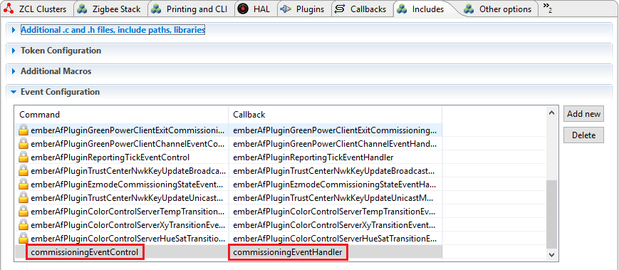
</div> 
</br>

D) Click on the Generate button on top-right of Z3GatewayHost.isc to generate source code of the project

E) Open the Z3GatewayHost_callbacks.c and add following function

```c
EmberEventControl commissioningEventControl;
static uint8_t exit_program = false;
/*
 * It active the commissioning event with 1000 ms delay
 */
void emberAfMainInitCallback(void)
{
  emberEventControlSetDelayMS(commissioningEventControl, 1000);
}
/*
 * It form network if network doesn't exist. It open the network
 * if network exist to allow client device to join the network.
 */
void commissioningEventHandler(void)
{
  EmberStatus status;

  if(exit_program == true) {
	  exit(0);
  }
  emberAfCorePrintln("commissioningEventHandler\n\r");
  emberEventControlSetInactive(commissioningEventControl);

  status = emberAfNetworkState();
  emberAfCorePrintln("Network state = %d", status);

  if (status == EMBER_NO_NETWORK) {
    status = emberAfPluginNetworkCreatorStart(true);
    emberAfCorePrintln("Form centralized network Start: 0x%X", status);
    return;
  }

  if (status == EMBER_JOINED_NETWORK) {
    status = emberAfPluginNetworkCreatorSecurityOpenNetwork();
    emberAfCorePrintln("Open network: 0x%X", status);
    return;
  }
}

/*
 * This callback notifies the user that the network creation process has
 * completed successfully. It activate commissioning event to open the network
 * with 1000 ms delay.
 */
void emberAfPluginNetworkCreatorCompleteCallback(const EmberNetworkParameters *network,
                                                 bool usedSecondaryChannels)
{
  EmberStatus status;
  emberAfCorePrintln("emberAfPluginNetworkCreatorCompleteCallback");
  emberEventControlSetDelayMS(commissioningEventControl, 1000);
}

/*
 * This function will be called when an OTA update has finished.
 */
void emberAfPluginOtaServerUpdateCompleteCallback(uint16_t manufacturerId,
                                                  uint16_t imageTypeId,
                                                  uint32_t firmwareVersion,
                                                  EmberNodeId source,
                                                  uint8_t status)
{
  emberAfCorePrintln("OTA update completed");
  exit_program = true; // Wait 10 seconds to exit the program
  emberEventControlSetDelayMS(commissioningEventControl, 10000);
}

```

F) Build the Z3GatewayHost project under Cygwin terminal
Enter Z3GatewayHost project directory from Cygwin terminal, execute command
* $make -j8

<div align="center">
  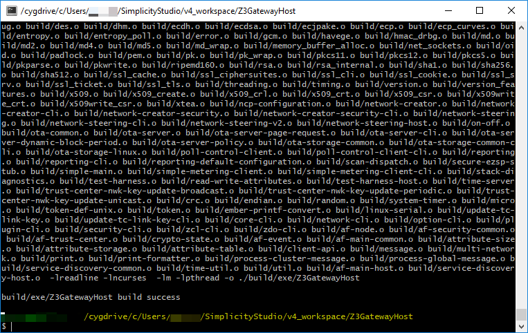
</div> 
</br>

The Z3GatewayHost.exe has been generated at ./build/exe/ folder


#### 3.3.1.3. Zigbee OTA Update

* Connect NCP WSTK and Client SoC WSTK to PC
* Run Z3GatewayHost.exe from PC, make sure new OTA image has been put under ./ota-files folder. 
  * ./build/exe/Z3GatewayHost.exe -p COM5
* Press any button on Client SoC WSTK start joining network and begin OTA update
  * The LED1 is ON while joined network. The LED0 keep rapidly blinking during OTA update procedure
  * The LEDs are OFF while OTA upgrade end response and reboot 
  * Wait one minute for client to complete the image update to application area. 

<div align="center">
  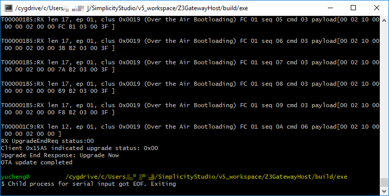
</div> 

* Reset the Client and you can get the updated firmware version information.
<div align="center">
  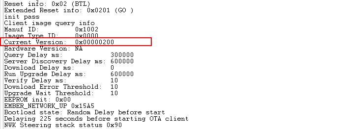
</div> 

### 3.3.2. SoC Server and SoC Client
#### 3.3.2.1. Zigbee OTA Client
From the OTA Client viewpoint, the overall OTA process is the same in both the remote OTA server is SoC mode or NCP mode with host program. The process for OTA Client setup here is identical as section [3.3.1.1 Zigbee OTA Client](#3311-zigbee-ota-client).

#### 3.3.2.2. Zigbee OTA Server in SoC mode

Different with the OTA Server in NCP mode with host program, the OTA Server can be setup on a system-on-chip(SoC) system. For the design of OTA Server in SoC mode, We would like to achieve following functionalities.
* The SoC Server automatic form and open the network to let client device join the network.
* OTA Server in SoC mode start OTA update according the request from client device. (It is default setting of current design)

A) Click on "New Project" in Simplicity Studio. Choose "Silicon Labs Zigbee", press Next; Choose "EmberZNet 6.8.0.1 GA SoC 6.8.0.1", press Next; Select "ZigbeeMinimal", press Next; Change the project name as "ZigbeeOTAServer", press Next and then press Finish.

It opens a ZigbeeOTAServer.isc which can config Zigbee related functionalities. There many Tabs on it for configuring different settings of project.   

B) In **ZCL Clusters** tab, Select ZCL device type as HA devices->HA On/Off Light, Check the **Over the Air Bootloading** Server check box from Cluster List pane. The profile ID should be "Home automation (0x0104)"
<div align="center">
  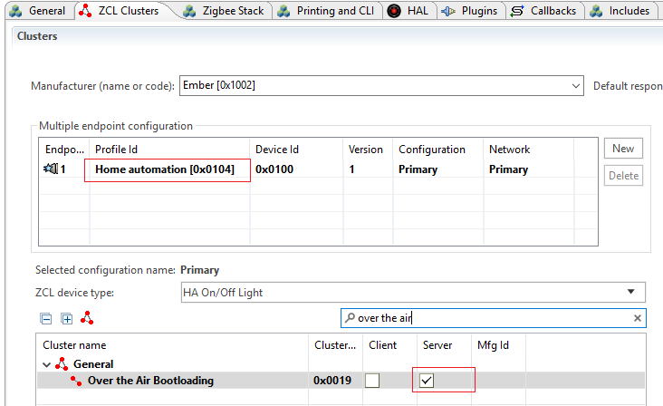
</div> 
</br>

C) In **Zigbee Stack** tab, set the "Zigbee Device Type" as Coordinator or Router.
<div align="center">
  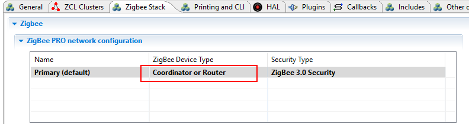
</div> 
</br>

D) In Printing and CLI tab, Enable the "Compiled-in" and "Enabled at startup" checkboxes for the Ota Bootload cluster, and also enable the "Include command and argument descriptions in the embedded code" checkbox.
<div align="center">
  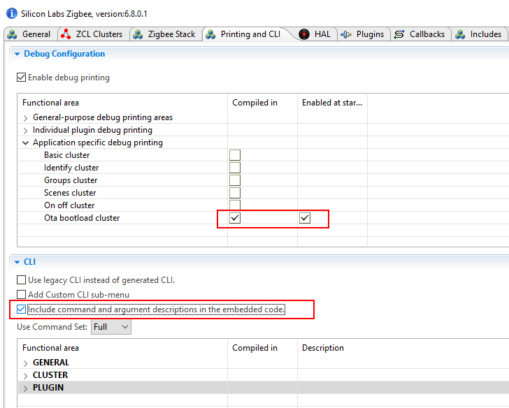
</div> 
</br>

E) In **HAL** tab, keep the bootloader type as the default "Application".
<div align="center">
  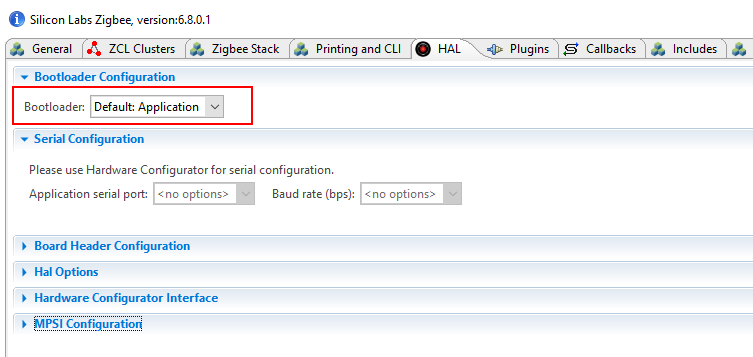
</div> 
</br>

F) In **Plugins** tab, Enable following plugins
* Network Creator
* Network Creator Security
* Security Link Keys Library
* Source Route Library   
</br>

* OTA Bootload Cluster Common Code
* OTA Bootload Cluster Server
* OTA Bootload Cluster Server Policy
* OTA Bootload Cluster Storage Common Code
* OTA Simple Storage EEPROM Driver
  * Uncheck the option labeled "SOC Bootloading Support"
  * Set the OTA Storage Start Offset as 540672
  * Set the OTA Storage End Offset as 540672 + 458752 = 999424
  * Set EEPROM Device Read-modify-write support to "false"   
**Note:** The parameter "OTA Storage Start Offset" and "OTA Storage End Offset" mean the offset used in storage, here they mean the offset in internal flash. We just align this setting with the default slot start address and size setting in the [gecko bootloader project](#23-bootloader-requirement).   
* OTA Simple Storage Module
<div align="center">
  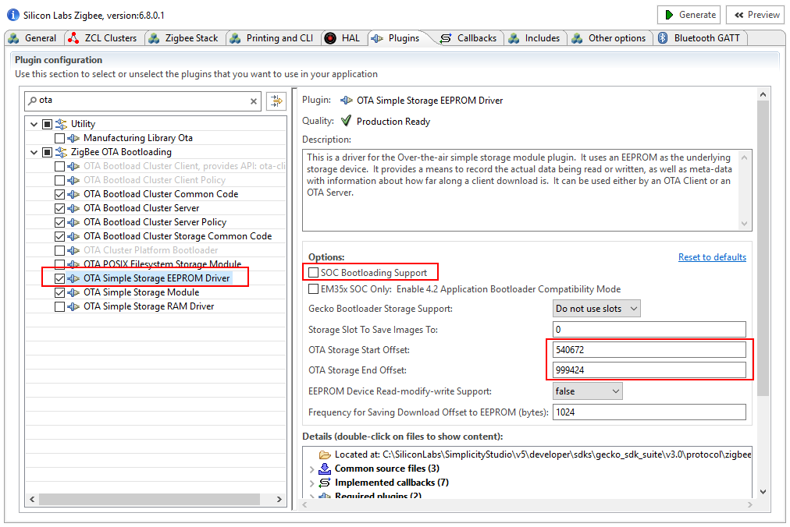
</div> 
</br>

G) In Callbacks tab, enable Main Init under "Non-cluster related" to active commissioning event to form or open network.  
Enable Complete of "Network Creator" plugin and Update Complete of "OTA Bootloader Cluster Server" under "Plugin-specific callbacks" to active commissioning event to open network after forming network is done and output some information while OTA update complete.

<div align="center">
  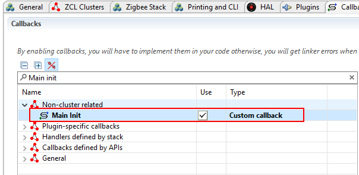
</div> 
</br>

<div align="center">
  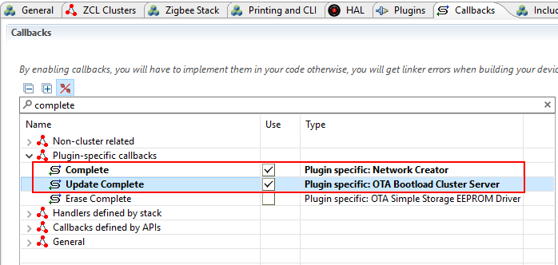
</div> 
</br>

H) In **Includes** tab, add commissioningEventControl event and commissioningEventHandler callback to maintain form and open network.  
<div align="center">
  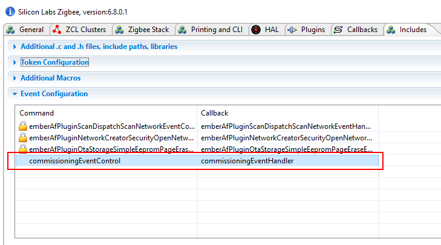
</div> 
</br>

I) Click on the Generate button on top-right of ZigbeeOTAServer.isc to generate source code of the project.   

J) Modify function "emAfOtaStorageDriverGetRealOffset()" in ota-storage-simple-eeprom\ota-storage-eeprom.c   
A Warning message will pop-up to remind that you are editing a shared file in the SDK. Click the "Make a Copy", and continue to edit the copy of the source file.
<div align="center">
  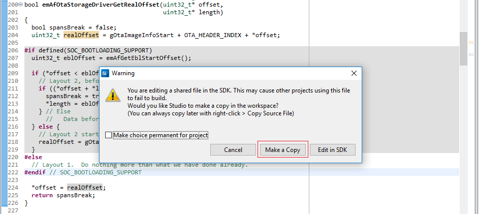
</div> 
</br>

```c
bool emAfOtaStorageDriverGetRealOffset(uint32_t* offset,
                                       uint32_t* length)
{
  *offset += gOtaImageInfoStart;
  return false;
}  
```

K) Open the ZigbeeOTAServer_callbacks.c and add following function

```c
EmberEventControl commissioningEventControl;

/*
 * It active the commissioning event with 1000 ms delay
 */
void emberAfMainInitCallback(void)
{
  emberEventControlSetDelayMS(commissioningEventControl, 1000);
}
/*
 * It form network if network doesn't exist. It open the network
 * if network exist to allow client device to join the network.
 */
void commissioningEventHandler(void)
{
  EmberStatus status;

  emberAfCorePrintln("commissioningEventHandler\n\r");
  emberEventControlSetInactive(commissioningEventControl);

  status = emberAfNetworkState();
  emberAfCorePrintln("Network state = %d", status);

  if (status == EMBER_NO_NETWORK) {
    status = emberAfPluginNetworkCreatorStart(true);
    emberAfCorePrintln("Form centralized network Start: 0x%X", status);
    return;
  }

  if (status == EMBER_JOINED_NETWORK) {
    status = emberAfPluginNetworkCreatorSecurityOpenNetwork();
    emberAfCorePrintln("Open network: 0x%X", status);
    return;
  }
}

/*
 * This callback notifies the user that the network creation process has
 * completed successfully. It activate commissioning event to open the network
 * with 1000 ms delay.
 */
void emberAfPluginNetworkCreatorCompleteCallback(const EmberNetworkParameters *network,
                                                 bool usedSecondaryChannels)
{
  EmberStatus status;
  emberAfCorePrintln("emberAfPluginNetworkCreatorCompleteCallback");
  emberEventControlSetDelayMS(commissioningEventControl, 1000);
}

/*
 * This function will be called when an OTA update has finished.
 */
void emberAfPluginOtaServerUpdateCompleteCallback(uint16_t manufacturerId,
                                                  uint16_t imageTypeId,
                                                  uint32_t firmwareVersion,
                                                  EmberNodeId source,
                                                  uint8_t status)
{
  emberAfCorePrintln("OTA update completed");
}
```

L) Build the project and download the firmware image ZigbeeOTAServer.s37 into the OTA Server device.

#### 3.3.2.3. Zigbee OTA Update
* Store the new Client firmware image into the internal flash of OTA Server device with commander.   
**Note:** We need to rename the new Client firmware image with a *.bin extension. The flash starts at 0x84000 with 448kB length is reserved for OTA Storage as illustrated below.   

```
commander.exe flash .\ZigbeeOTAClient.ota.bin --address 0x84000 --serialno 440056128
```

<div align="center">
  
</div> 

* Reset the OTA Server device, it will form and open network automatically.
* Press any button on SoC Client WSTK start joining network and begin OTA update
  * The LED1 is ON while joined network. The LED0 keep rapidly blinking during OTA update procedure
  * The LEDs are OFF while OTA upgrade end response and reboot 
  * Wait one minute for client to complete the image update to application area. 

<div align="center">
  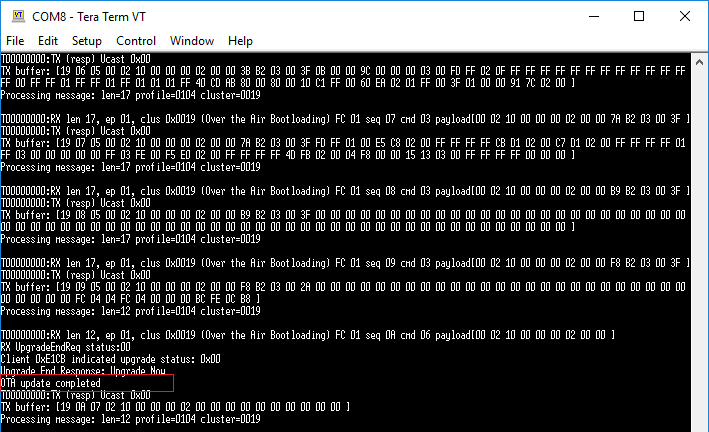
</div> 
</br>

* The Client will be reset and you can get the updated firmware version information.
<div align="center">
  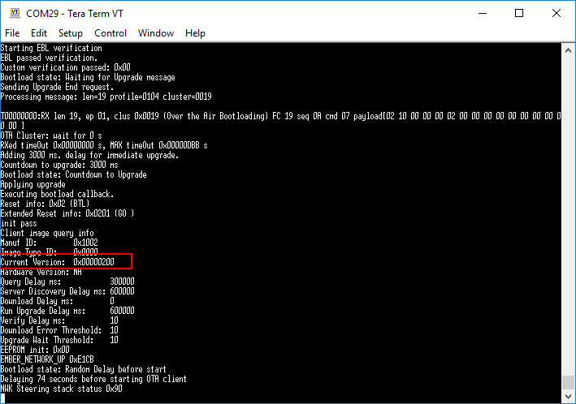
</div> 

# 4. Proprietary OTA Update
Again, we would like to do simple comparison between current design and new design we propose here. That helps us better understanding what is major changes and how we optimized the OTA procedure. 

The proprietary is flexible, customer can define the behavior according to their real need. No standard SDK, pre-defined operations. That means we can choose whatever is best suit for our application. Here, we will not choose NCP on the server side.(In fact, only 6 NCP questions were raised during pass 15 months). We keeps a SoC as OTA server. Sending firmware image to the OTA serve via UART interface from PC. That makes thing much easier to implement. 

Get reference of detailed introduction of current design at [UG235.06: Bootloading and OTA with Silicon Labs Connect][UG235.06].

## 4.1. Current OTA process
* Connect OTA Client and OTA Server with UART console from PC
* Program OTA image file(sensorB.gbl) to OTA server
  * $commander.exe extflash write sensorB.gbl
* OTA server bootloader init, validate image, form and open network
  * $bootloader init
  * $bootloader validate-image
  * $form 0
  * $pjoin 120
* OTA client bootloader init, erase slot flash, join the network
  * $bootloader init
  * $bootloader flash-erase
  * $join 0
  * $bootloader set-tag 0xaa
* Start OTA update from OTA server
  * $bootloader unicast-set-target 0x0001
  * $bootloader unicast-dstribute 112560 0xaa  
    * Where 122560 is the size of the GBL image file in bytes. 
  * $bootloader unicast-request-bootload 1000 0xaa
    * Requests client bootloading after OTA update completed 
  

## 4.2. New OTA process
* Run terminal tool to connect with OTA Server, it forms and open the network
* Press BTN0 button on OTA Client. It joins the network and start OTA update automatically. 

The LED0 on board show the status of network and OTA update. 

## 4.3. Implementation
Here we start the detailed steps on implementation to achieve above design idea.
### 4.3.1. Proprietary OTA Client

We would like to achieve following functionalities.

* Press BTN0 button on OTA Client to start joining network and the OTA update
* LED0 ON indicates that OTA Client has joined the network. LED OFF is opposite meaning
* LED0 rapidly blinking(200ms on, 200ms off) indicates the OTA update in progress

A) Click on **Create New Project** in Simplicity Studio 5 launcher perspective. Choose **Proprietary**, Choose **Flex(Connect)-SoC Sensor**, press Next; Keep the project name as "sensor" unchanged, press Finish.

It open a sensor.slcp which can config Proprietary related functionalities. 

B) In **SOFTWARE COMPONENTS** tab, filter "bootloader" in search texbox.
* Install following components
  * OTA Unicast Bootloader Client
  * OTA Bootloader Test Common
  * OTA Unicast Bootloader Test 

<div align="center">
  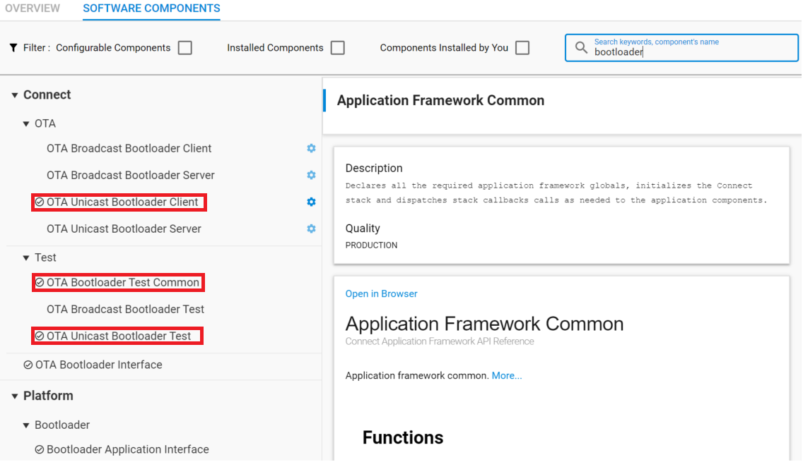
</div> 

C) If want to change the radio PHY, move to component **Radio Configurator**, default setting for TB BG22 is **Connect 2.4GHz OQPSK 2Mcps 250kbps**, no need to change. 

<div align="center">
  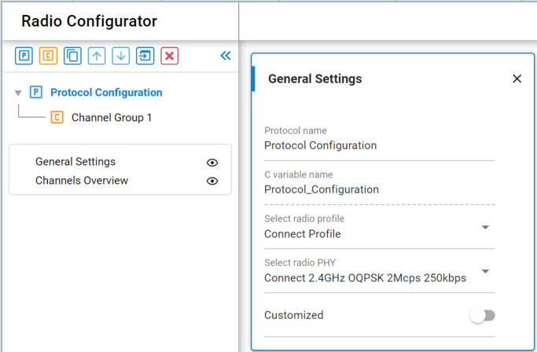
</div> 

D) Open app_process.c, add halButtonIsr() in sl_button_on_change() for key event handle.

```C
void sl_button_on_change(const sl_button_t *handle)
{
  halButtonIsr(sl_button_get_state(handle));
  if (sl_button_get_state(handle) == SL_SIMPLE_BUTTON_PRESSED) {
    enable_sleep = !enable_sleep;
  }
}
```
E) Open app_callbacks.c add following source codes.

```C
#include "sl_ota_bootloader_test_common.h"
#include "sl_btl-interface.h"
#include "sl_simple_button.h"

EmberEventControl *button_event_control;
EmberEventControl *led_control;

#define SENSOR_SINK_COMMAND_ID_OTA_REQUEST  (0xA5)  //Don't overlap with enum define in sl_app_common.h

static bool flash_is_erased = false;
static bool ota_update = false;
extern EmberKeyData security_key;

void OtaImageDownloadCompleteCallback(void)
{
  ota_update = false;
}
/*
 * Join the network
 */
void joinNetwork(void)
{
  EmberNetworkParameters parameters;

  MEMSET(&parameters, 0, sizeof(EmberNetworkParameters));
  parameters.radioTxPower = SENSOR_SINK_TX_POWER;
  parameters.radioChannel = 0;
  parameters.panId = SENSOR_SINK_PAN_ID;

  emberClearSelectiveJoinPayload();

  emberJoinNetwork(EMBER_STAR_END_DEVICE, &parameters);
}

/*
 * Erase the slot flash for the first boot up.
 * Start joining the network if the device no network
 * Sending OTA update request to server once joined the network
 */
void button_handler(void)
{
  EmberNetworkStatus status;

  emberEventControlSetInactive(*button_event_control);

  if (flash_is_erased == false) {
    flash_is_erased = true;

    status = emberAfPluginBootloaderInterfaceInit();
    if (status) {
      APP_INFO("bootloader init succeeded!\n\r");
    } else {
      APP_INFO("bootloader init failed! wrong chip?\n\r");
    }

    APP_INFO("flash erase started\n");
    emberAfPluginBootloaderInterfaceChipErase();
    ota_resume_start_counter_reset = true;
  }

  status = emberNetworkState();
  APP_INFO("network status = 0x%x\n\r", status);
  if (EMBER_NO_NETWORK == status){
    APP_INFO("Joining the network\n\r");
    joinNetwork();
    emberEventControlSetDelayMS(*button_event_control, 2000);
  }

  if(EMBER_JOINED_NETWORK == status){
    char* is_ack = ((tx_options & EMBER_OPTIONS_ACK_REQUESTED) ? "enabled" : "disabled");
    char* is_security = ((tx_options & EMBER_OPTIONS_SECURITY_ENABLED) ? "enabled" : "disabled");
    char* is_high_prio = ((tx_options & EMBER_OPTIONS_HIGH_PRIORITY) ? "enabled" : "disabled");

    APP_INFO("Info:\r\n");
    APP_INFO("         MCU Id: 0x%llX\r\n", SYSTEM_GetUnique());
    APP_INFO("  Network state: 0x%02X\r\n", emberNetworkState());
    APP_INFO("      Node type: 0x%02X\r\n", emberGetNodeType());
    APP_INFO("        Node id: 0x%04X\r\n", emberGetNodeId());
    APP_INFO("         Pan id: 0x%04X\r\n", emberGetPanId());
    APP_INFO("        Channel: %d\r\n", (uint16_t)emberGetRadioChannel());
    APP_INFO("          Power: %d\r\n", (int16_t)emberGetRadioPower());
    APP_INFO("     TX options: MAC acks %s, security %s, priority %s\r\n", is_ack, is_security, is_high_prio);

    ota_update = true;

    //Slow down report period
    sensor_report_period_ms = (10 * MILLISECOND_TICKS_PER_SECOND);
    APP_INFO("Report period set to %d ms\n\r", sensor_report_period_ms);

    APP_INFO("Sending OTA update request\n\r");
    send(EMBER_COORDINATOR_ADDRESS, SENSOR_SINK_COMMAND_ID_OTA_REQUEST, NULL, 0);
  }
}

void halButtonIsr(uint8_t state)
{
  if (state == SL_SIMPLE_BUTTON_RELEASED) {
    emberEventControlSetDelayMS(*button_event_control, 300);
  }
}

void led_handler(void)
{
  emberEventControlSetInactive(*led_control);
  if (ota_update == true) {
    emberEventControlSetDelayMS(*led_control, 200);
    sl_led_toggle(&sl_led_led0);
  }else {
    emberEventControlSetDelayMS(*led_control, 2000);
    if (EMBER_NO_NETWORK == emberNetworkState()) {
      sl_led_turn_off(&sl_led_led0);
    } else {
      sl_led_turn_on(&sl_led_led0);
    }
  }
}
```
Replace emberAfInitCallback().
```c
void emberAfInitCallback(void)
{
  emberAfAllocateEvent(&report_control, &report_handler);
  emberAfAllocateEvent(&button_event_control, &button_handler);
  emberAfAllocateEvent(&led_control, &led_handler);
  // CLI info message
  APP_INFO("Sensor\r\n");

  ota_update = false;

  emberSetSecurityKey(&security_key);

  emberNetworkInit();

  emberEventControlSetDelayMS(*led_control, 1000);

#if defined(EMBER_AF_PLUGIN_BLE)
  bleConnectionInfoTableInit();
#endif
}
```
Comment out LED0 control in emberAfTickCallback().
```c
void emberAfTickCallback(void)
{
//  if (emberStackIsUp()) {
//    sl_led_turn_on(&sl_led_led0);
//  } else {
//    sl_led_turn_off(&sl_led_led0);
//  }
}
```
F) Open $(SDK_PATH)\gecko_sdk_3.0.0\app\flex\component\connect\sl_connect_ota_unicast_bootloader_test\sl_connect_ota_unicast_bootloader_test.c, add OtaImageDownloadCompleteCallback() in emberAfPluginOtaUnicastBootloaderClientImageDownloadCompleteCallback().
```c
void emberAfPluginOtaUnicastBootloaderClientImageDownloadCompleteCallback(EmberAfOtaUnicastBootloaderStatus status,
                                                                          uint8_t imageTag,
                                                                          uint32_t imageSize)
{
  OtaImageDownloadCompleteCallback();
  if (status == EMBER_OTA_UNICAST_BOOTLOADER_STATUS_SUCCESS) {
    APP_INFO("Image download COMPLETED tag=0x%x size=%lu\n",
             imageTag, imageSize);
    unicast_download_start_index = 0;
  } else {
    APP_INFO("Image download FAILED status=0x%x\n", status);
  }
}
```
Please don't modify SDK file directly, copy it to local then modify.
<div align="center">
  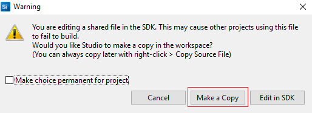
</div> 


G) Build the project and download the firmware image sensor.s37 into the OTA Client. 

If you don't know how to process it. Please get detailed reference at [Download firmware Image][Flash-Image]

H) Generate client OTA image by double click "connect_create_gbl_image.bat" file.
 Make any changes in the source code and build the project to generate OTA image sensor.gbl. For example, print "Sensor V2" in emberAfInitCallback() function.

```c
void emberAfInitCallback(void)
{
  emberAfAllocateEvent(&report_control, &report_handler);
  emberAfAllocateEvent(&button_event_control, &button_handler);
  emberAfAllocateEvent(&led_control, &led_handler);
  // CLI info message
  APP_INFO("Sensor V2\r\n");

  ota_update = false;

  emberSetSecurityKey(&security_key);

  emberNetworkInit();

  emberEventControlSetDelayMS(*led_control, 1000);

#if defined(EMBER_AF_PLUGIN_BLE)
  bleConnectionInfoTableInit();
#endif
}
```

### 4.3.2. Proprietary OTA Server
For the design of OTA Server. We would like to achieve following functionalities.

The "SoC sink" running on OTA Server. It automatic form and open the network to let OTA Client join the network. It starts the OTA update while received OTA update request from OTA Client. And it send the reboot request to OTA Client once OTA image transfer complete. 

A) Click on **Create New Project** in Simplicity Studio 5 launcher perspective. Choose **Proprietary**, Choose **Flex(Connect)-SoC sink**, press Next; Keep the project name as "sink" unchanged, press Finish.

It open a sink.slcp which can config Proprietary related functionalities. 

B) In **SOFTWARE COMPONENTS** tab, filter "bootloader" in search texbox.
* Install following components
  * OTA Unicast Bootloader Server
  * OTA Bootloader Test Common
  * OTA Unicast Bootloader Test 

<div align="center">
  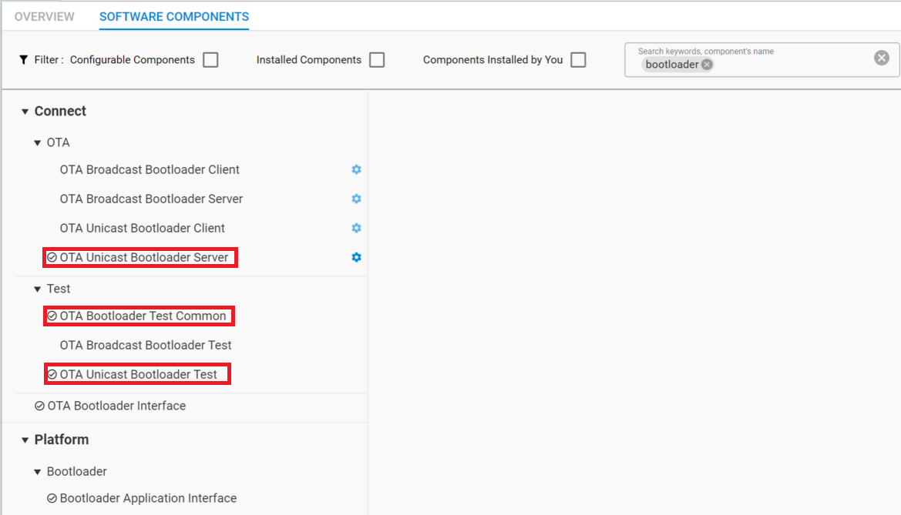
</div> 

C) If want to change the radio PHY, move to component **Radio Configurator**, default setting for TB BG22 is **Connect 2.4GHz OQPSK 2Mcps 250kbps**, no need to change. 

<div align="center">
  
</div> 

D) Open app_callbacks.c add following source codes.

```C
#include "sl_ota_bootloader_test_common.h"
#include "sl_btl-interface.h"

EmberEventControl *commission_control;
EmberEventControl *led_control;

#define GBL_End_Tag                         (0xFC0404FC)
#define NETWORK_WINDOW_OPEN                 (240)
#define NETWORK_WINDOW_CLOSE                (0)
#define BOOTLAODER_DELAY_MS                 (1000)
#define SENSOR_SINK_COMMAND_ID_OTA_REQUEST  (0xA5)  //Don't overlap with enum define in sl_app_common.h

static bool first_boot = true;
static uint8_t client_node_id = 0xFF;
static bool ota_update = false;

typedef struct {
  uint32_t tag;
  uint32_t len;
} GblTag_t;

bool emberAfPluginBootloaderInterfaceRead(uint32_t startAddress,uint32_t length,uint8_t *buffer);
uint16_t emberAfPluginBootloaderInterfaceValidateImage(void);


/**
 * Read TAG of OTA GBL image and calculate the size of GBL
 */
uint32_t parseGBLSize(void)
{
  uint32_t size = 0;
  GblTag_t gbl;
  while(1){
    emberAfPluginBootloaderInterfaceRead(size,8, (uint8_t *)&gbl);
    size = size + 8 + gbl.len;
    APP_INFO("GBL tag = 0x%4x, len = 0x%4x, size = 0x%4x\r\n", gbl.tag, gbl.len, size);
    // reach end tag of GBL
    if (gbl.tag == GBL_End_Tag){
        APP_INFO("reach end of tag of GBL\r\n");
      break;
    }
  }
  return size;
}

/**
 * Start the OTA update process. Default tag = 0x89
 */
void otaUnicastStartDistribution(EmberNodeId node_id)
{
  uint32_t size = 0;
  uint8_t status;

  client_node_id = node_id;
  size = parseGBLSize();
  status = emberAfPluginOtaUnicastBootloaderServerInitiateImageDistribution(
              client_node_id, size, DEFAULT_IMAGE_TAG);

  if (status){
    APP_INFO("unicast image distribution failed 0x%x\r\n", status);
  }else{
    APP_INFO("unicast image distribution initiated.\r\n");
  }
}

/**
 * Sending the client reboot request
 */
void OtaUnicastDistributionCompleteCallback(void)
{
  APP_INFO("Request client reboot.\r\n");
  ota_update = false;
  emberAfPluginUnicastBootloaderServerInitiateRequestTargetBootload(BOOTLAODER_DELAY_MS, DEFAULT_IMAGE_TAG, client_node_id);
}

/**
 * For the network
 */
void formNetwork(void)
{
  EmberStatus status;
  EmberNetworkParameters parameters;

  MEMSET(&parameters, 0, sizeof(EmberNetworkParameters));
  parameters.radioTxPower = SENSOR_SINK_TX_POWER;
  parameters.radioChannel = 0;
  parameters.panId = SENSOR_SINK_PAN_ID;

  status = emberFormNetwork(&parameters);

  APP_INFO("form 0x%x\r\n", status);
}

/**
 * Open the network for 240 seconds.
 */
void permitJoinNetwork(uint8_t duration)
{
  emberClearSelectiveJoinPayload();
  if(duration)
    APP_INFO("Permit Joining Network %d\r\n", duration);
  else
    APP_INFO("Network Joining Disable.\r\n");
  emberPermitJoining(duration);
}

/**
 * Validate the OTA image at first boot up
 * Form and open the network is network is down
 */
void commission_handler()
{
  emberEventControlSetInactive(*commission_control);

  if (first_boot) {
    //cli_bootloader_init(0);
    if (emberAfPluginBootloaderInterfaceInit()) {
      APP_INFO("bootloader init succeeded!\r\n");
    } else {
      APP_INFO("bootloader init failed! wrong chip?\r\n");
    }

    if (!emberAfPluginBootloaderInterfaceValidateImage()) {
      APP_INFO("Image is invalid!\r\n");
      return;
    } else {
      first_boot = 0;
      APP_INFO("Image is valid!\r\n");
    }

  }
  //if(!emberStackIsUp()){
  if (EMBER_NO_NETWORK == emberNetworkState()){
    formNetwork();
  }

  if (EMBER_NO_NETWORK != emberNetworkState()){
    APP_INFO("Open the network!\r\n");
    permitJoinNetwork(NETWORK_WINDOW_OPEN);
  }

  ota_update = false;

  //Show out network status.
  char* is_ack = ((tx_options & EMBER_OPTIONS_ACK_REQUESTED) ? "enabled" : "disabled");
  char* is_security = ((tx_options & EMBER_OPTIONS_SECURITY_ENABLED) ? "enabled" : "disabled");
  char* is_high_prio = ((tx_options & EMBER_OPTIONS_HIGH_PRIORITY) ? "enabled" : "disabled");

  APP_INFO("Info:\r\n");
  APP_INFO("         MCU Id: 0x%llX\r\n", SYSTEM_GetUnique());
  APP_INFO("  Network state: 0x%02X\r\n", emberNetworkState());
  APP_INFO("      Node type: 0x%02X\r\n", emberGetNodeType());
  APP_INFO("        Node id: 0x%04X\r\n", emberGetNodeId());
  APP_INFO("         Pan id: 0x%04X\r\n", emberGetPanId());
  APP_INFO("        Channel: %d\r\n", (uint16_t)emberGetRadioChannel());
  APP_INFO("          Power: %d\r\n", (int16_t)emberGetRadioPower());
  APP_INFO("     TX options: MAC acks %s, security %s, priority %s\r\n", is_ack, is_security, is_high_prio);

}

void led_handler(void)
{
  emberEventControlSetInactive(*led_control);
  if (ota_update == true) {
    emberEventControlSetDelayMS(*led_control, 200);
    sl_led_toggle(&sl_led_led0);
  }else {
    emberEventControlSetDelayMS(*led_control, 2000);
    if (EMBER_NO_NETWORK == emberNetworkState()) {
      sl_led_turn_off(&sl_led_led0);
    } else {
      sl_led_turn_on(&sl_led_led0);
    }
  }
}
```
Replace emberAfInitCallback().
```c
void emberAfInitCallback(void)
{
  emberAfAllocateEvent(&advertise_control, &advertise_handler);
  emberAfAllocateEvent(&data_report_control, &data_report_handler);
  emberAfAllocateEvent(&commission_control, &commission_handler);
  emberAfAllocateEvent(&led_control, &led_handler);
  // CLI info message
  APP_INFO("Sink\r\n");

  emberSetSecurityKey(&security_key);
  sink_init();
  emberNetworkInit();

  emberEventControlSetDelayMS(*commission_control, 1000);
  emberEventControlSetDelayMS(*led_control, 1000);
#if defined(EMBER_AF_PLUGIN_BLE)
  bleConnectionInfoTableInit();
#endif
}
```
Add start distribution process in emberAfIncomingMessageCallback().
```c
void emberAfIncomingMessageCallback(EmberIncomingMessage *message)
{
  if (message->length < SENSOR_SINK_MINIMUM_LENGTH
      || (emberFetchLowHighInt16u(message->payload + SENSOR_SINK_PROTOCOL_ID_OFFSET)
          != SENSOR_SINK_PROTOCOL_ID)) {
    return;
  }

  switch (message->payload[SENSOR_SINK_COMMAND_ID_OFFSET]) {
    case SENSOR_SINK_COMMAND_ID_OTA_REQUEST:
      permitJoinNetwork(NETWORK_WINDOW_CLOSE);
      ota_update = true;

      APP_INFO("Start the OTA process! NodeId:0x%x\r\n", message->source);
      otaUnicastStartDistribution(message->source);
      break;

    case SENSOR_SINK_COMMAND_ID_ADVERTISE_REQUEST:
```
Comment out LED0 control in emberAfTickCallback().
```c
void emberAfTickCallback(void)
{
  // Time out sensors that have not reported in a while.
  uint32_t nowMs = halCommonGetInt32uMillisecondTick();
  uint8_t i;
  for (i = 0; i < SENSOR_TABLE_SIZE; i++) {
    if (sensors[i].node_id != EMBER_NULL_NODE_ID) {
      if (SENSOR_TIMEOUT_MS
          < elapsedTimeInt32u(sensors[i].last_report_ms, nowMs)) {
        APP_INFO("EVENT: timed out sensor 0x%04X\n",
                 sensors[i].node_id);
        sensors[i].node_id = EMBER_NULL_NODE_ID;
      }
    }
  }

  //if (emberStackIsUp()) {
  //  sl_led_turn_on(&sl_led_led0);
  //} else {
  //  sl_led_turn_off(&sl_led_led0);
  //}
}
```
E) Open $(SDK_PATH)\gecko_sdk_3.0.0\app\flex\component\connect\sl_connect_ota_unicast_bootloader_test\sl_connect_ota_unicast_bootloader_test.c, add OtaUnicastDistributionCompleteCallback() in emberAfPluginOtaUnicastBootloaderServerImageDistributionCompleteCallback().
```c
void emberAfPluginOtaUnicastBootloaderServerImageDistributionCompleteCallback(EmberAfOtaUnicastBootloaderStatus status)
{
  APP_INFO("image distribution completed, 0x%x\n", status);
  OtaUnicastDistributionCompleteCallback();
}
```
Please don't modify SDK file directly, copy it to local then modify.
<div align="center">
  
</div> 


F) Build the project and download the firmware image sink.s37 into the OTA Server. 

If you don't know how to process it. Please get detailed reference at [Download firmware Image][Flash-Image]


### 4.3.3. Proprietary OTA Update
* Connect OTA Server and OTA Client to PC
* Program OTA image sensor.bin(GBL format) to OTA Server
  * commander.exe flash --address 0x84000 --serialno 440045424 sensor.bin
  * Change the address to 0x44000 for a 512KB flash devide
  * Change serialno accordingly
* Press BTN0 on OTA Client start joining network and begin OTA update
  * The LED0 is ON for indicates joined network
  * The LED0 keep rapidly blinking(200ms on, 200ms off) during OTA update procedure
  * Once the OTA Client recieve complete it will reboot and update new image to application area


# 5. Bluetooth LE OTA Update

In this section, we are going to introduce the current BLE OTA Update method also propose a new implementation here to optimize the OTA Update procedure.

BLE OTA Update procedure consists of two parts, OTA Client and OTA server. Generally, BLE OTA Client running on System-on-Chip mode which receive new firmware image from the Server device. And BLE OTA Server running on either SoC or NCP mode with a host, which will store new firmware image in the local storage or host’s file system and provide new firmware image to the Client device.

Get reference of current Bluetooth OTA detailed introduction at [AN1086: Using the Gecko Bootloader with the Silicon Labs Bluetooth Applications](https://www.silabs.com/documents/public/application-notes/an1086-gecko-bootloader-bluetooth.pdf).

## 5.1 Current OTA process

The existing AN1086 show how to configure the NCP-based Server and SoC mode client for OTA process as below.
* Power on OTA Client SoC device
* Connect NCP board to PC  
* Run ota-dfu.exe from PC and execute the following command to connect with NCP board via BGAPI protocol and start OTA process to the remote Client device
  * ./ota-dfu.exe COM5 115200 application.gbl D0:CF:5E:68:A6:95
  
## 5.2 New OTA process

### 5.2.1 SoC Server and SoC Client

* Power on OTA Server and OTA Client SoC device.
* Store the new client firmware image into the local storage of OTA Server device.
* Set up connection between two devices.
* Press button0 on OTA Client board to send OTA Update request.
* OTA Server device will receive the OTA request and send new client firmware image to the OTA Client device.
* OTA Client device receive the image and finish OTA Update automatically.

LED on board shows the status of OTA Update.

### 5.2.2 NCP-based Server and SoC Client
The proposed new OTA process provide method to Update both Client SoC device and Server NCP device.

* Power on OTA Client SoC device.
* Connect NCP board to PC.
* Run ota_uart_dfu.exe from PC and execute the following command to connect with NCP board via BGAPI protocol and start OTA process to the remote Client device.
  * ./ota_uart_dfu.exe ota COM5 115200 application.gbl D0:CF:5E:68:A6:95
* Run ota_uart_dfu.exe from PC and execute the following command to connect with NCP board via **UART XMODEM Bootloader** and start NCP device update process.
  * ./ota_uart_dfu.exe uart COM5 115200 full.gbl 
  

## 5.3 Implementation
Here we start the detailed steps on implementation to achieve above design idea.

### 5.3.1 SoC Server and SoC Client

For the design of SoC-based OTA Server. We would like to send the new firmware image only when receiving OTA request from the OTA Client.
BLE SoC OTA procedure will be shown as the figure below.

  <div align="center">
  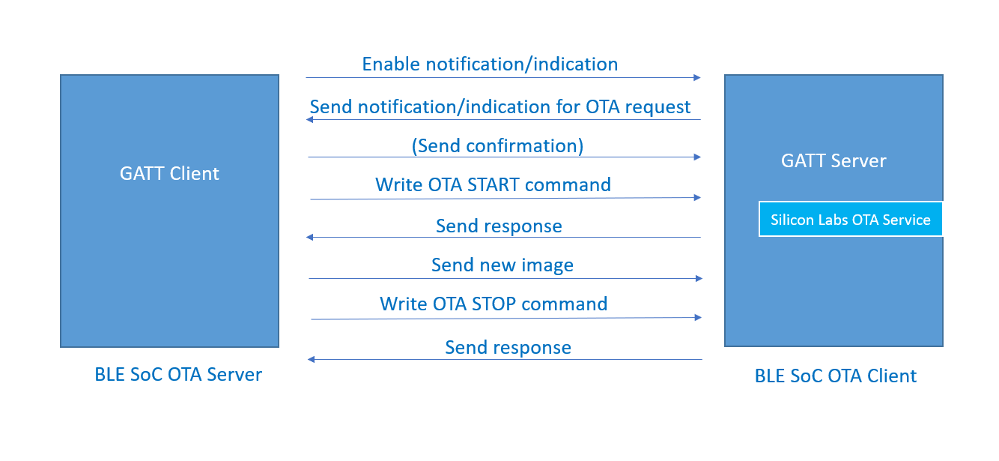  
  </div>  
  </br> 

#### 5.3.1.1 Internal Flash Bootloader

Both SoC Client and SoC Server need Bootloader for development. Here we use Internal Flash Bootloader for both.

A) Click on "EXAMPLE PROJECT" in Launcher perspective in Simplicity Studio. Choose "Bootloader" to select for "Internal Storage Bootloader (single image on 512kB device)". Choose CREATE, press FINISH.

B) Click on the Generate button on top-right of bootloader-storage-internal-single-512k.isc to generate source code of the project.

C) Save and build the project. Download the firmware image bootloader-storage-internal-single-512k.s37 into both SoC OTA Client and OTA Server board.

#### 5.3.1.2 BLE OTA Client

For the design of BLE OTA client, we would like to achieve following functionalities.
* Press button0 on board to start OTA Update request
* LED0 ON indicates that OTA Client begins sending OTA request and the OTA Update is in progress
* LED0 OFF indicates that OTA Client finish receiving image

A) Click on "Create New Project" in Simplicity Studio. Choose "Bluetooth" and select "Bluetooth - SoC Empty", press "Next". Rename the project with "soc_empty_CLIENT" and then press Finish.

It open gatt_configuration.btconf in which we can config BLE related service and characteristics.

B) The default OTA DFU Service is unconfigurable and it use Bluetooth Apploader to do OTA DFU. For the design of OTA Client, we would like to Remove Apploader area to save memory and implement OTA Firmware Update in User Application.

  <div align="center">
  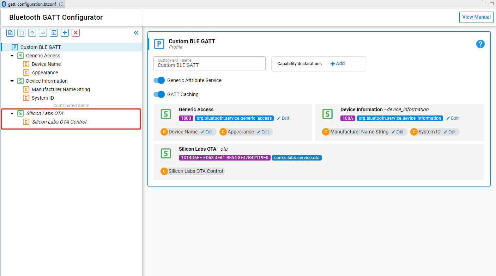  
  </div>  
  </br> 

In order to remove the apploader defined by default, open "soc_empty_CLIENT.slcp" and then select to open "SOFTWARE COMPONENTS" tab, filter "OTA DFU" in search texbox. Choose "Uninstall"

  <div align="center">
  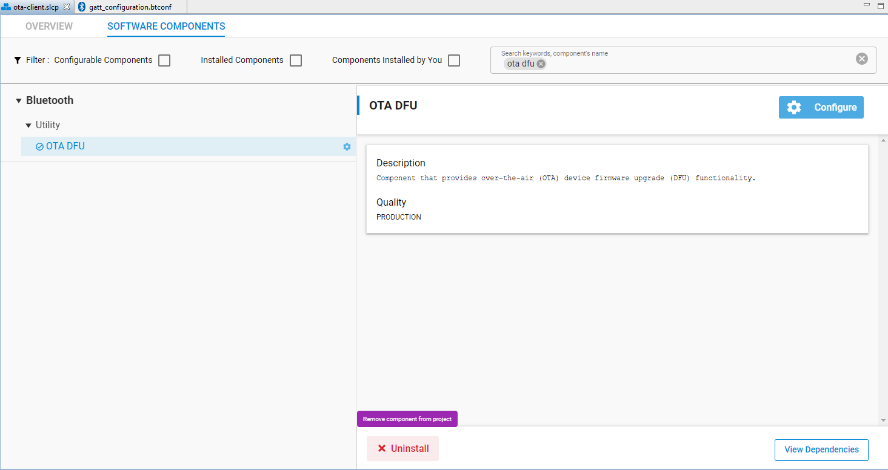  
  </div>  
  </br>  

After uninstalling the OTA DFU component, Silicon Labs OTA (Contributed Item in GATT Configurator) is disappeared. Next, we need to create configurable custom service and characteristics.  

C) Open "gatt_configuration.btconf", you can directly download and import the attached GATT database [gatt_configuration.bgconf](files/CM-IoT-OTA-Update/bluetooth/src/gatt_configuration.btconf) into the project.

Or you can follow steps below to create one by one the service and characteristic.

1. Click "Toggle - Add Standard Bluetooth GATT items - view" in the upper left tab, select "Services" and add "Silicon Labs OTA" Service.
2. Select "Silicon Labs OTA Control" Characteristic. 
   * set its type to "user" instead of "hex". 
   * select "Write", "Write without response" and "Indicate" properties.
   
  <div align="center">
  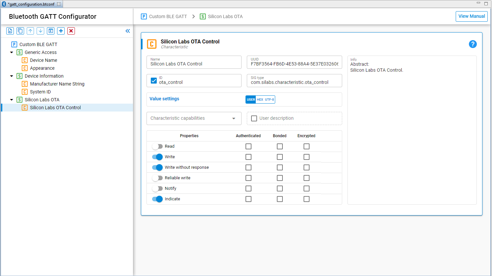  
  </div>  
  </br>  

3. Select "Silicon Labs OTA" Service, click "Add new item" in the upper left tab and select "New Characteristic".
   * Rename this new characteristic to "Silicon Labs OTA Data". 
   * Click the ID below and type in "ota_data". 
   * Set its type to "user".
   * Select "Write" and "Write without response" properties. 
   * Also specify the UUID value of the characteristic as defined by Silabs rules itself as 984227F3-34FC-4045-A5D0-2C581F81A153
   
  <div align="center">
  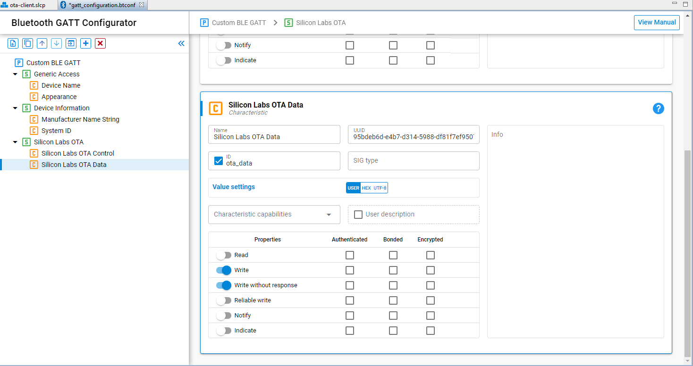  
  </div>  
  </br>  

**Note：** If you create OTA service and characteristic yourself, please remember to specify the UUID of service and characteristic as documented in section "3.4 Silicon Labs OTA GATT service" of AN1086. The service and characteristic content and the UUID value are fixed and must not be changed.
Otherwise, OTA Server can not set up connection with OTA Client.

D) Now your GATT database should look like this.

**Note:** Need to open the **Advertise service** for Silicon Labs OTA service so that the OTA Server can find and connect with it.

  <div align="center">
  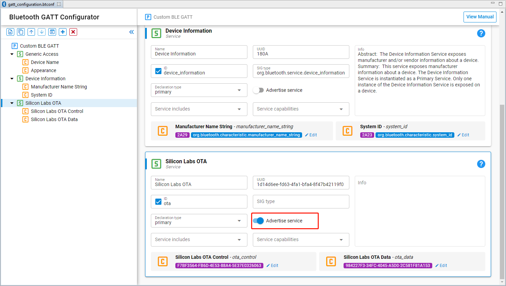  
  </div>  
  </br>  


E) Go back to "soc_empty_CLIENT.slcp", some more components need to be added.

1. To enable the usage of button, filter "button" then Install "Simple Button" as "btn0".
2. To enable the usage of led, filter "led" and Install "Simple Led" as "led0".
3. To enable the usage of debug printing, filter and Install "IO Stream", "Log" and "Tiny printf" related components. 

<div align="center">
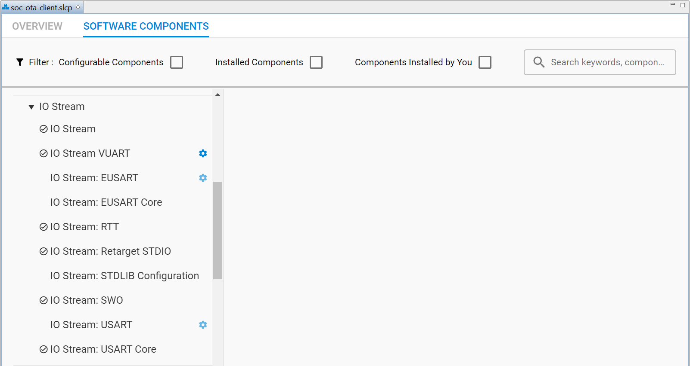  
</div>  
</br>

F) Copy the attached [app.c](files/CM-IoT-OTA-Update/bluetooth/src/app.c) file to the project (overwrites the default app.c).

G) Save. Build the project and flash it to your target board.

H) We need to have a new client image file for OTA update. Just simply change the Device name in "gatt_configuration.btconf" -> "Device name" -> Value settings -> Initial value to "OTA Example" also change value length to "11"

<div align="center">
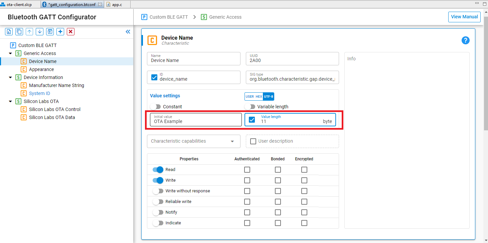  
</div>  
</br>  

I) Save. Rebuild the project.

J) Then, generate new firmware image by clicking "create_bl_files.bat". The .gbl files will be created automatically in to "output_gbl" folder in the project. Rename the generated “application.gbl” to “application.bin” so as to flash it to OTA Server later.


#### 5.3.1.3 BLE OTA Server

For the design of BLE OTA server, we would like to achieve following functionalities.
* LED0 ON indicates that the device has received OTA Update request
* LED0 OFF indicates that OTA Server finish sending image

A) Click on "Create New Project" in Simplicity Studio. Choose "Bluetooth" and select "Bluetooth - SoC Empty", press "Next". Rename the project with "soc_empty_SERVER" and then press Finish.

B) Open SOFTWARE COMPONENTS in the project, to enable the usage of led, filter "led" and Install "Simple Led" as "led0".

C) To enable the usage of debug printing, filter and Install "IO Stream", "Log" and "Tiny printf" related components.

<div align="center">
  
</div>  
</br> 


D) Open app.c, copy the attached [soc-server-app.c](files/CM-IoT-OTA-Update/bluetooth/src/soc-server-app.c) file to the project (overwrites the default app.c).

E) Build the project and flash it to your target.

#### 5.3.1.4 BLE OTA Update

* Store the new Client firmware image into the internal flash of OTA Server device with commander.
**Note:** We need to rename the new Client firmware image with a *.bin extention. BG22 flash starts at 0x44000 with 192kB length is reserved for OTA storage as illustrated below.
```
commander flash application.bin --address 0x44000 --serailno 440179535
```

<div align="center">
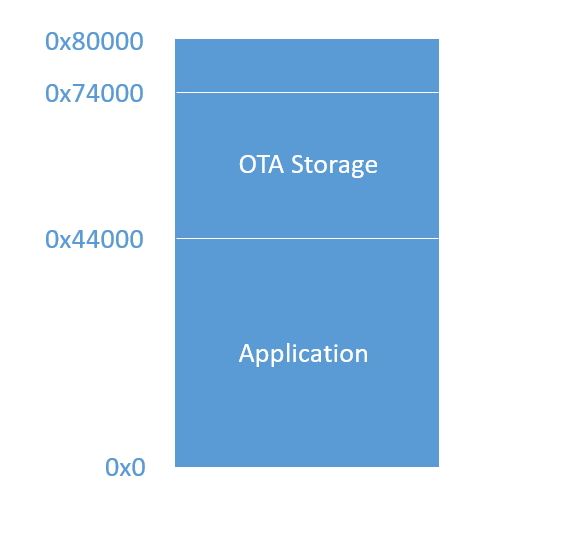  
</div>  
</br> 

* Launch Console for these two devices in Simplicity Studio.
* Press BTN0 in  OTA Client to start OTA DFU Request.

<div align="center">
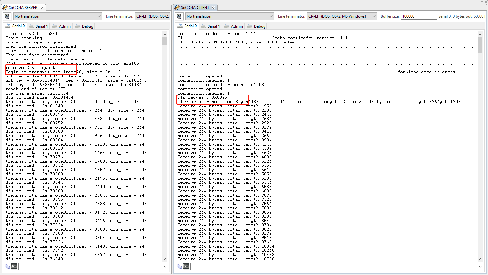  
</div>  
</br> 

* OTA Server receives the OTA DFU Request and begin to send new firmware image.
* OTA Client will receive new image and finish DFU automatically. 
* Use **EFR Connect** to check SoC Client device advertising with new name.
  
<div align="center">
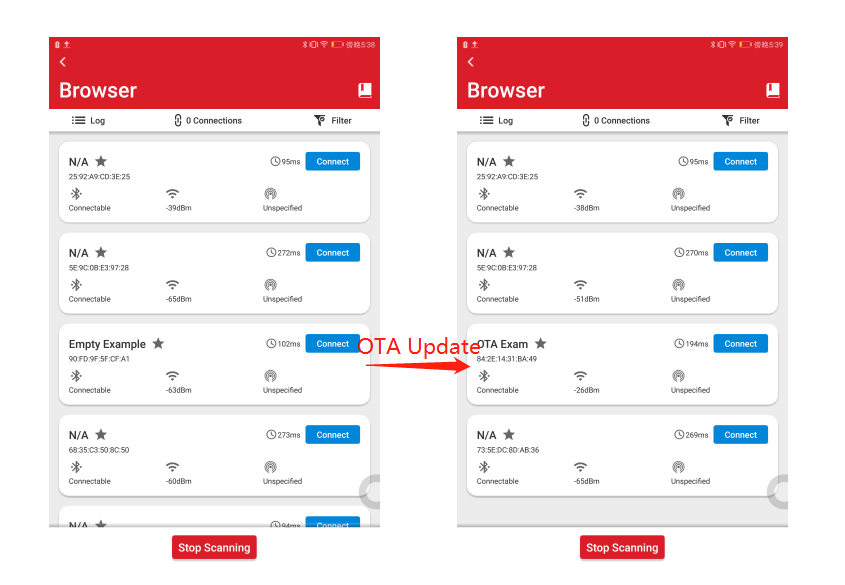  
</div>  
</br> 


### 5.3.2 NCP-based Server and SoC Client

For the design of NCP-based OTA Server. We would like to achieve the following functionalities.
* The PC host application ota_uart_dfu.exe start OTA update for remote OTA Client device (default setting of current design).
* The PC host application ota_uart_dfu.exe start UART DFU update for NCP device via **XModem bootloader** instead of BGAPI bootloader.

<div align="center">
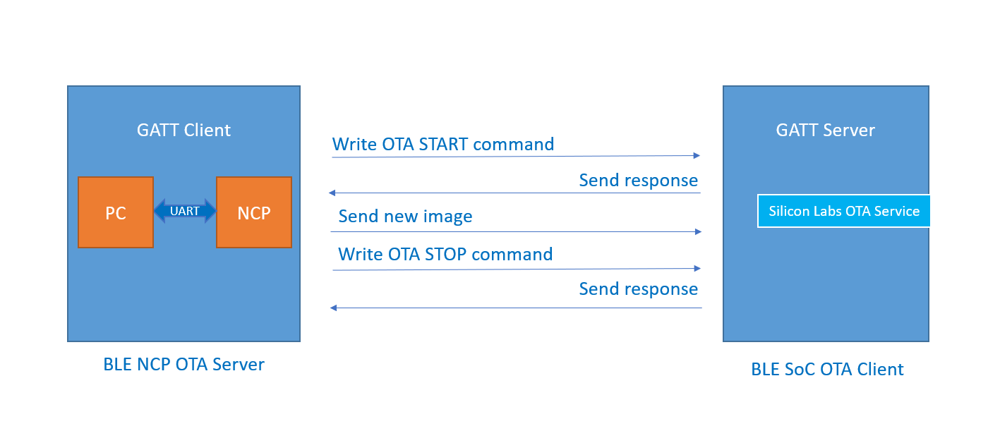  
</div>  
</br>

#### 5.3.2.1 BLE OTA Server Host design

The host application running on PC communicates with NCP target via a virtual serial port connection. Current OTA host example is found in the following directory.

```C:\SiliconLabs\SimplicityStudio\v5\developer\sdks\gecko_sdk_suite\v3.0\app\bluetooth\examples_host\ota_dfu```

The project folder contains a makefile that allows the program to be built using for example MinGW (by running mingw32-make) or Cygwin (by running make). After successful compilation, the executable named **ota-dfu.exe** is placed in subfolder named exe.

The current design provide only SoC Client OTA Update, in order to vary its function to do NCP DFU via XModem Bootloader. We need to do some change in the current main.c file.

Here, we assume that you've successfully download and install Cygwin so that we can use it directly.

A) Open the following directory, and create an empty file folder named "ota_uart_dfu".
```C:\SiliconLabs\SimplicityStudio\v5\developer\sdks\gecko_sdk_suite\v3.0\app\bluetooth\example_host```

B) Download and copy the attached [main.c](files/CM-IoT-OTA-Update/bluetooth/src/main.c) and [makefile](files/CM-IoT-OTA-Update/bluetooth/src/makefile) file to this folder.

D) Open Cygwin in current directory
```C:\SiliconLabs\SimplicityStudio\v5\developer\sdks\gecko_sdk_suite\v3.0\app\bluetooth\example_host\ota_uart_dfu```

E) Running **make** to get executable file name **ota_uart_dfu.exe** under subfolder /ota_uart_dfu/exe

<div align="center">
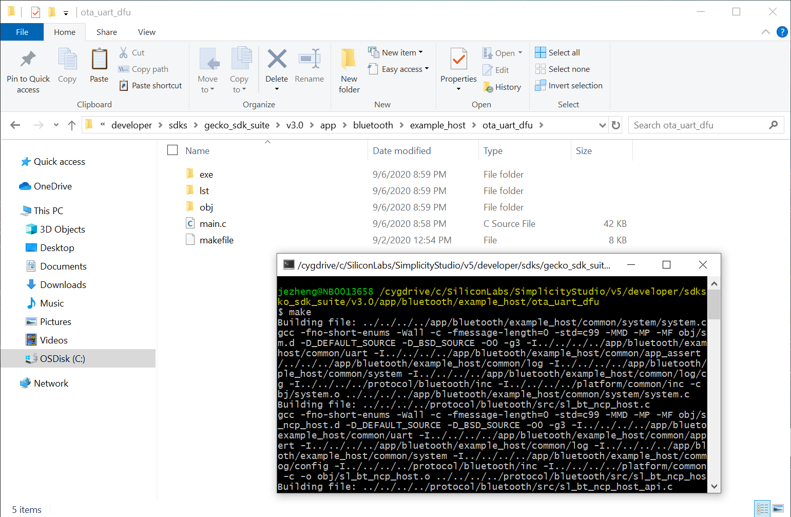  
</div> 
</br>

#### 5.3.2.2 BLE OTA Server NCP design

The development kit that is used as NCP target should be programmed with bootloader as well as NCP application.

A) Click on "EXAMPLE PROJECT" in Launcher perspective in Simplicity Studio. Choose "Bootloader" to select for **UART XMODEM Bootloader**. Choose CREATE, press FINISH.

It open a bootloader-uart-xmodem.isc in which we can config XModem Bootloader related functionalities. There are many Tabs on if for configuring different settings of project.

B) Click on the Generate button on top-right of bootloader-uart-xmodem.isc to generate source code of the project.

C) Save and build the project. Download the firmware image bootloader-uart-xmodem.s37 into the NCP board.

D) Go back into "EXAMPLE PROJECT" in Laucher perspective, create **Bluetooth - NCP Empty** project.

E) Build the project and download the firmware image ncp_empty.s37 into the NCP board.

F) We need to have a new NCP image file for NCP update. Just simply change the Device name in "gatt_configuration.btconf" -> "Device name" -> Value settings -> Initial value to "NCP Example" also change value length to "11".

<div align="center">
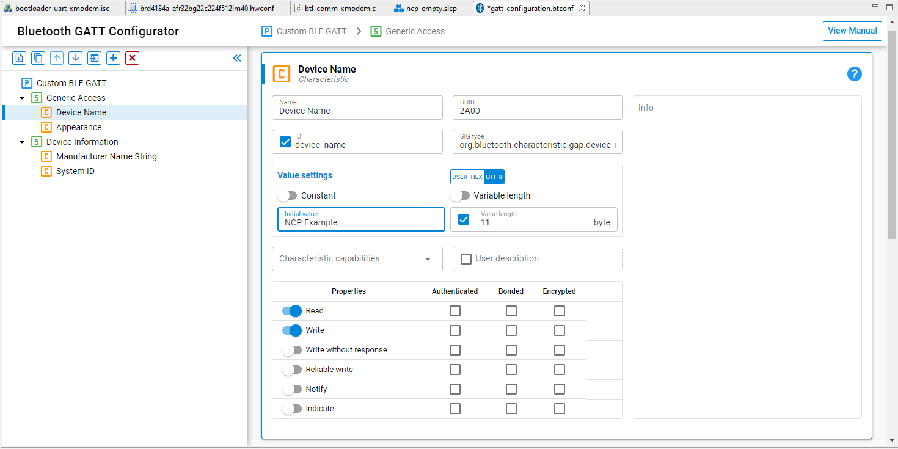  
</div>  
</br>

Generate the source code and build the project. Click **create_bl_files.bat** in the project, it will generate .gbl files in "output_gbl" folder. Copy the generated full.gbl to the folder below.
```C:\SiliconLabs\SimplicityStudio\v5\developer\sdks\gecko_sdk_suite\v3.0\app\bluetooth\example_host\ota_uart_dfu\exe```

**Note:** If you are using Gecko SDK Suite v3.x, please make sure that you've defined two environmental variables, PATH_SCMD and PATH_GCCARM before running the script to generate upgrade images, please see chapter [2.3 Creating Upgrade Images for the Bluetooth NCP Application](https://www.silabs.com/documents/public/application-notes/an1086-gecko-bootloader-bluetooth.pdf) of AN1086 for more information.

#### 5.3.2.3 BLE OTA Client

From the OTA Client viewpoint, the overall OTA process performs the same behavior in both SoC mode OTA Server and NCP mode OTA Server with host program. The process for OTA Client setup here is identical as section [5.3.1.2 BLE OTA Client](#5312-ble-ota-client).

Also generate OTA update image by Clicking **create_bl_files.bat** in the project, and copy the generated application.gbl to the folder below.
```C:\SiliconLabs\SimplicityStudio\v5\developer\sdks\gecko_sdk_suite\v3.0\app\bluetooth\example_host\ota_uart_dfu\exe```

BLE OTA Client is the target device to be upgraded over-the-air. It is identified by its Bluetooth address. The Bluetooth address can be found in Simplicity Commander in Unique ID after connecting the target.

For example, the bluetooth address for the given device below is 84:2E:14:31:BA:49.

<div align="center">
  
</div>  
</br>

#### 5.3.2.4 BLE OTA Update

* Connect NCP device to PC and also power on the OTA Client device
* Run ota_uart_dfu.exe from PC, make sure new OTA iamge has been put under ota-ncp-dfu/exe folder
  * ./ota_uart_dfu.exe ota COM5 115200 application.gbl xx:xx:xx:xx:xx:xx

<div align="center">
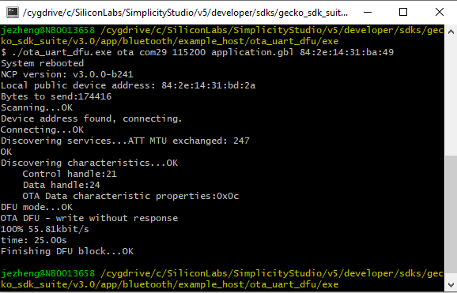  
</div>  
</br>

* Use **EFR Connect** to check SoC Client device advertising with new name. NCP device originally advertise by "Empty Example". After updating, it advertises with new name "OTA Example".
  
<div align="center">
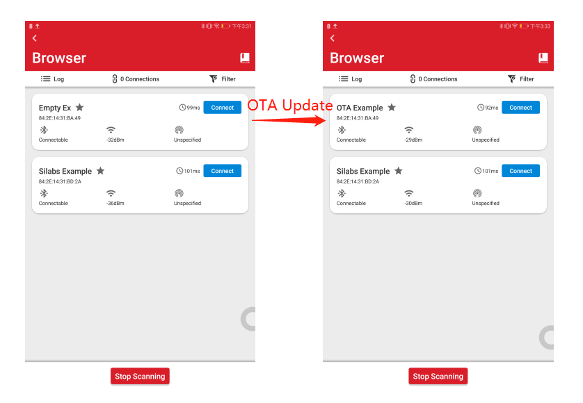  
</div>  
</br>
  
* Run ota_uart_dfu.exe from PC, make sure new ncp iamge has been put under ota-ncp-dfu/exe folder
  * ./ota_uart_dfu.exe uart COM5 115200 full.gbl

<div align="center">
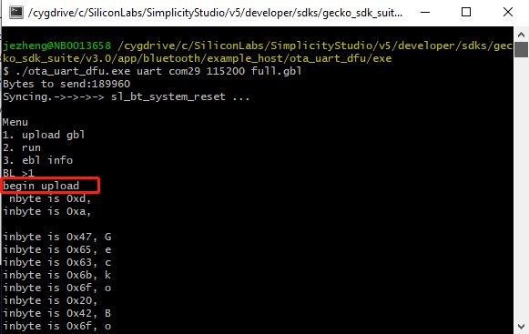  
</div>  
</br>

After initializing NCP Host, a Menu shows up for selecting the following procedure. Typing '1' to choose "upload gbl" to begin uploading NCP Update image to NCP device.

<div align="center">
  
</div>  
</br>

After finishing Uploading, the Menu shows up again. In this time, typing '2' for sending command to reboot the NCP device and run with the new image. This process will finish the NCP Device Firmware Update process. 

* Use **BG Tool** to advertise in NCP device. Connect with the NCP target and click "Create Set" to create advertisement set, then click "Start" to begin advertising.
  
<div align="center">
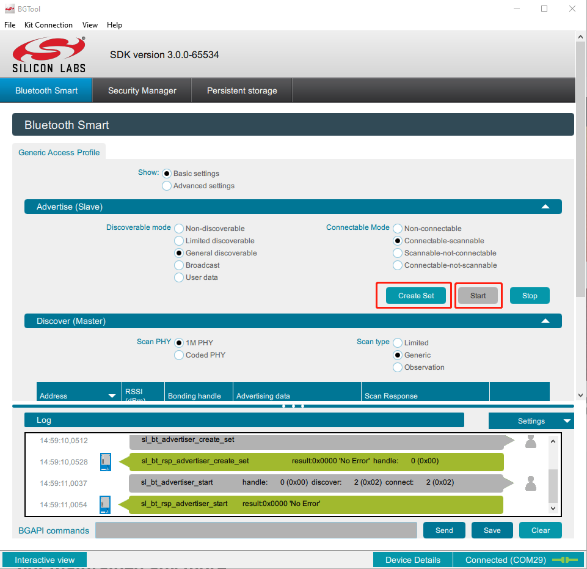  
</div>  
</br>

* Then use **EFR Connect** to check NCP device advertising with new name. NCP device originally advertise by "Silabs Example". After updating, it advertises with new name "NCP Example".

<div align="center">
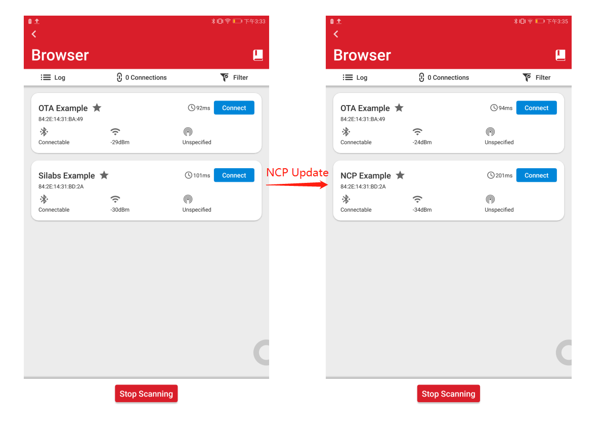  
</div>  
</br>

# 6. OTA Update Configuration 
We would like to simplify the operation of OTA update for various products because we need to dynamic switch different protocol when doing the test. It is not very convenient to update bootloader, application image, ota image, ncp image one by one with commander.exe tool accompany with various parameters. Here we choose Python + JSON to make dynamic protocol switch in single step. We would like to talk in details on JSON configuration setting in following sections.  

## 6.1. Commander Tool Operation
The commander.exe tool is used for device erase and application firmware programming
* The **device masserase** is needed while switching the protocol or doing a clean start test. 
* The **flash -address 0x0** that program the application firmware on the WSTK board
* The **--serialno 440045424** to choose which WSTK board for operation with the specific serial number. 

```json
  "commander":{
    "path":"C:/SiliconLabs/SimplicityStudio/v5/developer/adapter_packs/commander/commander.exe",
    "erase":"device masserase",
    "flash":"flash --address 0x0",
    "wstk":["--serialno 440045424", "--serialno 440145729"]
  },
```

## 6.2. Protocol Definition 
Define the name of **server** and **client** image for each protocol object. The OTA **hostApp** which can be the specific application runs from host like Z3GatewayHost.exe for Zigbee, ota-dfu.exe for Bluetooth, or it can be commander.exe only like for SoC mode proprietary server. 

Here is the full contents of the [configuration.json](files/CM-IoT-OTA-Update/configuration.json) file. 

## 6.3. Usage of the JSON Configuration
* Switch the protocol
  
  Changing the value of **protocol** while switching the different protocol for test. Like Zigbee. 
  ```JSON
    "protocol":"zigbee",
  ```
* Enable or disable the **Device Erase**
  
  When doing the clean start test or switching different protocol, the device erase is required. But if we stick on the same protocol and don't want do device erase every time then we can disable it by adding a **"-"** before the value of **"erase"** under **"commander"** object.
  ```JSON
  "erase":"-device masserase",
  ```

* Programming server or client image. 
  We can control which image we want to program on the WSTK board. In each protocol object. Simply adding a **"-"** before the value of name **"server"** or **"client"**. 
  ```JSON
   "proprietary":{
      "server":"-./proprietary/sink.s37", 
      "client":"-./proprietary/sensor.s37", 
      ...
    }
  ```
  
## 6.4. Python Script File
The [ota-update.py](files/CM-IoT-OTA-Update/ota-update.py) is designed for parsing the configuration.json contents and execute the operation intended. 
Please check attached file for detailed info. 


[AN728]:https://www.silabs.com/documents/public/application-notes/an728-ota-client-server-setup.pdf
[UG235.06]:https://www.silabs.com/documents/public/user-guides/ug235-06-bootloading-and-ota-with-connect.pdf
[Flash-Image]:https://github.com/MarkDing/IoT-Developer-Boot-Camp/wiki/Flashing-Image
[preparatory-course]:https://github.com/MarkDing/IoT-Developer-Boot-Camp/wiki/Zigbee-Preparatory-Course
[AN1135]:https://www.silabs.com/documents/public/application-notes/an1135-using-third-generation-nonvolatile-memory.pdf
[UG266]:https://www.silabs.com/documents/public/user-guides/ug266-gecko-bootloader-user-guide.pdf