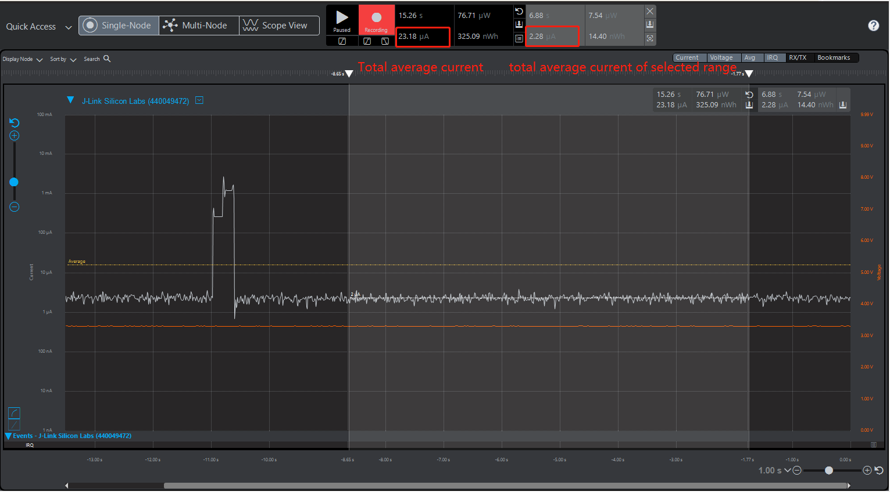
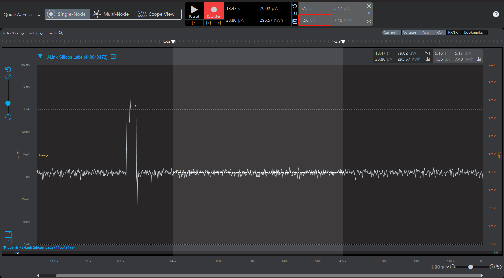

# 如何测量EFR32xG22的EM2电流消耗（1.40 µA）
 
[English](Measure-EM2-Current-Consumption-under-1.4uA-in-EFR32xG22) | 中文

## 介绍
EFR32xG22最突出的新特性之一就是低功耗，可以在保留32 KB RAM及使用LFRCO的条件下，达到1.40 µA的EM2深度睡眠电流。本文将讨论如何达到EFR32xG22 EM2的最小电流消耗，以及如何降低电流消耗。
 
## 讨论
根据EFR32MG22的数据手册，标准的试验条件为:VREGVDD = 3.0 V，AVDD = DVDD = IOVDD = RFVDD = PAVDD = 1.8 V。EM2模式下选取的DCDC电压缩放电平为VSCALE0时的电压值，且室内温度为 25℃。
 
在创建一个“SoC - Empty”项目时，我们可以测量EM2中的睡眠电流为2.3 µA左右，而不是数据表中提到的1.40 µA。这是由于为了方便开发，在SoC Empty 项目中启用了如VCOM和debug等外围设备。如果不需要，用户可以禁用这些功能来减少功耗。
 
下图显示了在Simplicity Studio中从Energy Profiler测试的结果。从图中，我们可以看到有两个测量结果。左侧为总平均电流，该电流值包括复位时产生的电流。用户应该读取从选择的范围计算出的平均电流。
 
   
 
启用或禁用不同的外设将对当前的功耗产生影响。为了减少电流消耗，建议调整电压来优化系统的能源效率。稍后我们将讨论不同外围设备对当前功耗的影响。
 
##### VCOM 
如果您使用我们的SDK附带的一些示例 (MCU或无线示例) 来复现EM2当前的功耗测试，请检查VCOM的状态。启用VCOM会增加功耗。在不需要时，禁用EN引脚以及TX和RX引脚可以降低功耗。
```c
//initVcomEnable();
```
根据我们的实验结果，禁用Vcom Enable引脚将会减少大约0.25 µA到0.3 µA的能耗。
 
##### Debugger
可以通过在EMU_CTRL寄存器上设置EM2DBGEN字段来启用调试连接，这将消耗大约0.5 µA的额外电流。在不需要debug功能的条件下，为了减少当前消耗，可以注释下面一行。
```c
//Force PD0B to stay on EM2 entry. This allow debugger to remain connected in EM2
//EMU->CTRL |= EMU_CTRL_EM2DBGEN; 
```
##### 外部 flash
BRD4182A radio board中配备的外部flash“MX25R8035F”默认为待机，这将产生很大的额外电流量，可以通过以下语句禁用外部flash。
```c
 /* Disable external flash memory*/
  MX25_init();
  MX25_DP();
```  
MX25_init 初始化SPI Flash，调用MX25_DP发送将Flash放入DP模式所需的字节，这减少将大约0.5 µA电流。
 
##### Voltage scaling
电压调整通过尽可能在较低的电压下运行系统，优化系统的能源效率。三种电压等级可供使用:

| VSCALE 等级设置 | DECOUPLE Voltage | 使用条件 |
| :-------- | :-------- | :-------- |
| VSCALE2 | 1.1 V | EM0/EM1 下最高可达 80 MHz, EM2 和 EM3 |
| VSCALE1 | 1.0 V | EM0/EM1 下最高可达 40 MHz, EM2 和 EM3 |
| VSCALE0 | 0.9 V | 只能在EM2、EM3下工作  |

EM2和EM3模式下的电压等级可以通过EMU_CTRL_EMU23VSCALE字段设置。将EMU23VSCALE设置为VSCALE0可以使得在EM2和EM3模式下获得最低的睡眠电流。
```c
  EMU_EM23Init_TypeDef vsInit = EMU_EM23INIT_DEFAULT;
  vsInit.vScaleEM23Voltage = emuVScaleEM23_LowPower;
  EMU_EM23Init(&vsInit);
```
在EM2和EM3中有两个电压缩放等级，分别是emuVScaleEM23_LowPower模式 (vscale0) 和emuVScaleEM23_FastWakeup (vscale2)。使用emuVScaleEM23_LowPower将比使用emuVScaleEM23_FastWakeup节省大约1.3 µA的电流。
 
##### Radio RAM
EFR32xG22设备包含用于各种功能的SRAM块，包括通用数据存储器(RAM)和各种RF子系统RAM (SEQRAM, FRCRAM)。
如果不需要，在EM2/EM3模式下，可以关闭帧速率控制器SRAM(FRCRAM)和序列SRAM(SEQRAM)的所有部分。SYSCFG_RADIORAMRETNCTRL中设置了FRCRAMRETNCTRL和SEQRAMRETNCTRL用于控制这些区域是否保留。
```c
  /* Disable Radio RAM memories (FRC and SEQ) */
  CMU_ClockEnable(cmuClock_SYSCFG, true);
  SYSCFG->RADIORAMRETNCTRL = 0x103UL;
```
禁用不同的Radio RAM可以产生不同程度的电流减少。结果将在后面的实验结果中列出了。
  
##### DCDC
DC-DC降压变换器涵盖广泛的负载电流范围，在EM0, EM1, EM2和EM3能量模式下提供高效率。
```c
  // Enable DC-DC converter
  EMU_DCDCInit_TypeDef dcdcInit = EMU_DCDCINIT_DEFAULT;
  EMU_DCDCInit(&dcdcInit);
```
 
##### GPIO
所有未连接的引脚在EFR32上应配置到 Disable模式(高阻抗，无外接电阻)，和reset相关的IO引脚也是禁用的。这可以通过调用MX_25deinit()来完成。
```c
MX25_deinit();
```

##### Peripherals 
EFR32xG22设置了不同的power domain，在外设不使用时，会被降至最低的供应电流。Power domain由EMU自动管理。它包括最低能量功率域(PDHV)、低功率域(PD0)、低功率域A (PD0A)和辅助PD0功率域(PD0B、PD0C等)。当进入EM2或EM3时，如果辅助低功率域中的任何外设(PD0B、PD0C等)被启用，则辅助低功率域中的任何外设将被通电，导致较高的电流。否则，辅助电源域将被关闭。
 
如果在EM2/EM3模式下启用了PD0B中的任何模块，那么整个PD0B将在EM2/EM3中继续运行。因此，在进入EM2时，请确保禁用高功率的外设。

 
##### 温度
注意，温度对功耗有很大的影响。此测试的推荐环境温度为25℃，如数据手册所示。
 

###### 另外，如果不需要遵循保留32 KB RAM及LFRCO的情况下，您还可以禁用部分RAM或使用其他振荡器代替LFRCO来降低功耗。

 
##### SRAM Retention
RAM可以被分为24 KB和8 KB的bank，分别从地址0x20000000和0x20006000开始。默认情况下，EM2/EM3中保留了这两个bank。在不需要用到32 KB RAM的情况下，可以通过关闭其中的bank减少电流消耗。RETNCTRL寄存器控制这两种bank的保留。
```c
/* Disable MCU RAM retention */
// EMU_RamPowerDown(SRAM_BASE, SRAM_BASE + SRAM_SIZE);
/* Power down BLK0 0x20000000 - 0x20006000: 0x01; BLK1 0x20006000 - 0x20008000: */
CMU_ClockEnable(cmuClock_SYSCFG, true);
SYSCFG->DMEM0RETNCTRL = 0x01UL;
```
禁用不同的RAM可以产生不同程度的电流减少。结果将在后面的实验结果中列出了。

##### LFXO
根据我们的测试结果，使用LFXO代替LFRCO可以降低70 nA- 100 nA的电流消耗
```c
CMU_LFXOInit_TypeDef lfxoInit = CMU_LFXOINIT_DEFAULT;
CMU_LFXOInit(&lfxoInit);
CMU_OscillatorEnable(cmuOsc_LFRCO, true, false);
CMU_OscillatorEnable(cmuOsc_LFXO, true, true);
CMU_ClockSelectSet(cmuClock_LFXO, cmuSelect_LFXO);
```
 
**注意**: 重置设备后立即进入EM2模式，可能会让debugger不能再被连接。
为了解决这个问题，请将电池盒旁边的WSTK开关设置为USB(关闭EFR电源)。执行简单命令命令行参数"./command .exe device recover"后，立即将开关移动到AEM位置。
 

# 测试实例
以下实例项目采用了上述大部分策略来降低能耗。
 
##### 实验示例
附加的示例项目可用于重现本文中所示的结果。
 
1.使用版本2.13.6或更新版本的Bluetooth SDK创建一个新的SoC - Empty应用程序项目。
2.打开app.c并注释掉system_boot中的代码禁止广播，以便我们可以测量EM2中的睡眠电流。

```c
      case gecko_evt_system_boot_id:

//        bootMessage(&(evt->data.evt_system_boot));
//        printLog("boot event - starting advertising\r\n");
//
//        /* Set advertising parameters. 100ms advertisement interval.
//         * The first parameter is advertising set handle
//         * The next two parameters are minimum and maximum advertising interval, both in
//         * units of (milliseconds * 1.6).
//         * The last two parameters are duration and maxevents left as default. */
//        gecko_cmd_le_gap_set_advertise_timing(0, 160, 160, 0, 0);
//
//        /* Start general advertising and enable connections. */
//        gecko_cmd_le_gap_start_advertising(0, le_gap_general_discoverable, le_gap_connectable_scannable);
        break;
```
 
3.注释掉main.c中的VcomEnable以关闭VCOM。
 
 ```c
 int main(void)
{
  /* Initialize device */
  initMcu();
  /* Initialize board */
  initBoard();
  /* Initialize application */
  initApp();
  //initVcomEnable();
  /* Start application */
  appMain(&config);
}
 ```

4.注释掉init_mcu.c中的EMU_CTRL_EM2DBGEN，以禁用EM2中的debug功能。

```c
// CAUTION! With the line below, EM2 enters Debug Mode to support development.
// Removing that line will lower power draw but also makes further flashing and
// debugging impossible while in EM2 sleep!
// To remedy this, set the WSTK switch next to the battery holder to USB (powers
// down the EFR). Execute Simplicity Commander with command line parameters:
// "./commander.exe device recover"
// and then immediately move the switch to the AEM postion. An additional
// "./commander.exe device masserase"
// command completes the recovery procedure.
  //EMU->CTRL |= EMU_CTRL_EM2DBGEN;
```
 
4.编译项目并烧录到 radio board xg22。
5.打开 Energy Profiler, 在快速访问菜单中选择 'Start Energy Profiler' 开始电流检测。
 
##### 实验结果
实验结果显示了EM2模式下的睡眠电流消耗情况。
 
 

下表列出了在不同 Radio RAM、RAM和电压调整条件下的测试结果:

<table border=0 cellpadding=0 cellspacing=0 width=512 style='border-collapse:
 collapse;table-layout:fixed;width:384pt'>
 <col width=64 span=8 style='width:48pt'>
 <tr height=20 style='height:15.0pt'>
  <td height=20 class=xl159155 width=64 style='height:15.0pt;width:48pt'><span
  style='mso-spacerun:yes'>&nbsp;</span></td>
  <td colspan=4 class=xl729155 width=256 style='width:192pt'>RADIO RAM
  Retention</td>
  <td colspan=3 class=xl729155 width=192 style='width:144pt'>RAM Retention</td>
 </tr>
 <tr height=20 style='height:15.0pt'>
  <td height=20 class=xl159155 style='height:15.0pt'><span
  style='mso-spacerun:yes'>&nbsp;</span></td>
  <td class=xl159155>FRC</td>
  <td class=xl159155>SEQ</td>
  <td class=xl159155>BOTH</td>
  <td class=xl159155>NO</td>
  <td class=xl159155>32KB</td>
  <td class=xl159155>24KB</td>
  <td class=xl159155>8KB</td>
 </tr>
 <tr height=20 style='height:15.0pt'>
  <td height=20 class=xl159155 style='height:15.0pt'>VSCALE2</td>
  <td class=xl159155 align=right>2.26</td>
  <td class=xl159155 align=right>2.57</td>
  <td class=xl159155 align=right>2.68</td>
  <td class=xl159155 align=right>2.16</td>
  <td class=xl159155 align=right>2.68</td>
  <td class=xl159155 align=right>2.5</td>
  <td class=xl159155 align=right>2.25</td>
 </tr>
 <tr height=20 style='height:15.0pt'>
  <td height=20 class=xl159155 style='height:15.0pt'>VSCALE1</td>
  <td class=xl159155 align=right>1.73</td>
  <td class=xl159155 align=right>1.92</td>
  <td class=xl159155 align=right>1.99</td>
  <td class=xl159155 align=right>1.66</td>
  <td class=xl159155 align=right>1.99</td>
  <td class=xl159155 align=right>1.89</td>
  <td class=xl159155 align=right>1.67</td>
 </tr>
 <tr height=20 style='height:15.0pt'>
  <td height=20 class=xl159155 style='height:15.0pt'>VSCALE0</td>
  <td class=xl159155 align=right>1.37</td>
  <td class=xl159155 align=right>1.47</td>
  <td class=xl159155 align=right>1.54</td>
  <td class=xl159155 align=right>1.33</td>
  <td class=xl159155 align=right>1.54</td>
  <td class=xl159155 align=right>1.49</td>
  <td class=xl159155 align=right>1.33</td>
 </tr>
 <![if supportMisalignedColumns]>
 <tr height=0 style='display:none'>
  <td width=64 style='width:48pt'></td>
  <td width=64 style='width:48pt'></td>
  <td width=64 style='width:48pt'></td>
  <td width=64 style='width:48pt'></td>
  <td width=64 style='width:48pt'></td>
  <td width=64 style='width:48pt'></td>
  <td width=64 style='width:48pt'></td>
  <td width=64 style='width:48pt'></td>
 </tr>
 <![endif]>
</table>

**注意**:完全移除32 KB RAM是没有意义的(可以实现，但是会导致唤醒失败)。

从实验结果中来看，我们并没有达到数据手册上所说的1.4 µA,这是因为我们在无线BLE项目(SoC Empty Project)中进行测试。无线工程即使在EM2中，也应该保留Radio RAM (FRC和SEQ)，这会导致大约0.2 µA的额外供电电流。因此，测试结果会高于1.4 µA。xG22在不需要无线电 radio功能的情况下，即MCU项目中可以达到低于1.4 µA的功耗。请参考附件。
 
##### 总结
从这个实验中，我们可以发现有多种方法可以用来限制EM2的电流消耗。用户可以根据他们的需求采取不同的策略，以达到他们的情况下的最小消耗。
 
 
### 参考
* [github peripheral example](https://github.com/SiliconLabs/peripheral_examples/tree/master/series2/emu/em23_voltage_scaling)
* [Enabling sleep mode of the MX25 series SPI flash](https://www.silabs.com/community/wireless/zigbee-and-thread/knowledge-base.entry.html/2018/12/10/enabling_sleep_mode-V2wx)
* [GPIO pin state during programming](https://www.silabs.com/community/mcu/32-bit/knowledge-base.entry.html/2017/09/01/gpio_pin_state_durin-z5Zh)
 
 
### 附件文件
[main.c](files/CM-Reduce-Current-Consumption/main.c)

