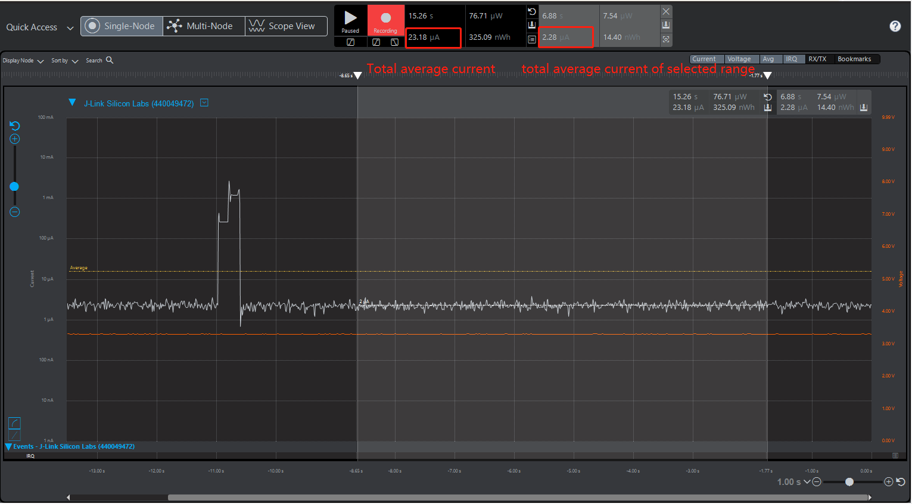
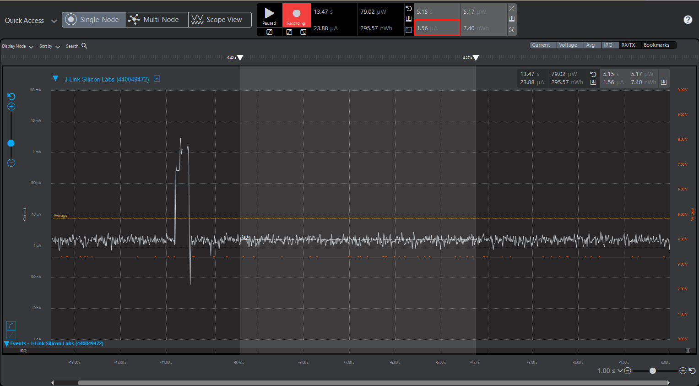

# Measure the lowest EM2 current consumption (1.40 µA) in EFR32xG22
 
English | [中文](Measure-EM2-Current-Consumption-under-1.4uA-in-EFR32xG22-CN)

## Introduction
One of the new features highlighted in EFR32xG22 is the Low System Energy Consumption which can reach 1.40 µA EM2 DeepSleep current with 32 kB RAM retention and RTC running from LFRCO. This article discusses how to measure the minimum current consumption in EFR32xG22 EM2, as well how to reduce current consumption.
 
## Discussion
According to the datasheet of EFR32MG22, the typical test conditions should be: VREGVDD = 3.0 V. AVDD = DVDD = IOVDD = RFVDD = PAVDD = 1.8 V from DCDC Voltage scaling level = VSCALE0 in EM2. TA = 25 °C.
 
When creating an "SoC - Empty" project, we can measure the initial sleep current at around 2.3 µA in EM2 which is not 1.4 µA mentioned in the datasheet. This is because multiple peripherals like VCOM and Debug mode are enabled in SoC Empty project for the convenience of development. Users can disable these functions to reduce consumption if they are not needed.
 
The figure below shows the result tested from Energy Profiler in Simplicity Studio. From the view, we can find two current measuring results. The left one represents the total average current which include the huge increasing of current while reset. And the right one calculated from the selected range should be the values user read from.
 
  
 
Enable or disable different peripherals will have an impact on the current consumption. To reduce current draw, it is recommended to use adjusted   voltage to  optimize the energy efficiency of the system. We will discuss later the effect of different peripherals on current consumption.
 
##### VCOM 
If you are reproducing the EM2 current consumption test using some of the example come with our SDK (either MCU or Wireless), please also check the status of the VCOM. Enable VCOM will increase the current consumption. Deassert the EN pin as well as the TX and RX pins when not needed.
```c
//initVcomEnable();
```
Commenting out the line above will get around 0.25µA - 0.3µA energy reduction according to the results of our experiments.
 
##### Debugger
Debug connectivity can be enabled by setting the EM2DBGEN field on the EMU_CTRL register, and will consume about 0.5 µA extra supply current. To reduce current consumption, comment out the line below.
```c
//Force PD0B to stay on EM2 entry. This allow debugger to remain connected in EM2
//EMU->CTRL |= EMU_CTRL_EM2DBGEN; 
```
##### External flash
The external flash “MX25R8035F” equipped in the BRD4182A radio board is standby by default and has a great amount of current, it should be shut off.
```c
 /* Disable external flash memory*/
  MX25_init();
  MX25_DP();
```  
MX25_init initializes the SPI Flash and calling MX25_DP sends the byte necessary to put the Flash into DP mode which should lower the current to about 0.5 µA.
 
##### Voltage scaling
Voltage scaling helps to optimize the energy efficiency of the system by operating at lower voltages when possible. Three supply voltage operating points are available:

| VSCALE Setting | DECOUPLE Voltage | Operating Conditions |
| :-------- | :-------- | :-------- |
| VSCALE2 | 1.1 V | EM0/EM1 Operation up to 80 MHz, EM2 and EM3 |
| VSCALE1 | 1.0 V | EM0/EM1 Operation up to 40 MHz, EM2 and EM3 |
| VSCALE0 | 0.9 V | EM2 and EM3 Only |

The voltage sale level for EM2 and EM3 is set using the EMU_CTRL_EMU23VSCALE field. The lowest sleep current will be obtained by setting EMU23VSCALE to VSCALE0.
```c
  EMU_EM23Init_TypeDef vsInit = EMU_EM23INIT_DEFAULT;
  vsInit.vScaleEM23Voltage = emuVScaleEM23_LowPower;
  EMU_EM23Init(&vsInit);
```
It has two Voltage scaling modes in EM2 and EM3, which are emuVScaleEM23_LowPower mode (vscale0) and emuVScaleEM23_FastWakeup (vscale2). Using emuVScaleEM23_LowPower will save approximately 1.3 µA comparing to emuVScaleEM23_FastWakeup.
 
##### Radio RAM retention
The EFR32xG22 device contains several blocks of SRAM for various purposes including general data memory (RAM) and various RF subsystem RAMS (SEQRAM, FRCRAM).
Frame Rate Controller SRAM(FRCRAM) and all part of Sequencer SRAM(SEQRAM) may be powered down in EM2/EM3 if not required. To control retention of these areas, set FRCRAMRETNCTRL or SEQRAMRETNCTRL in SYSCFG_RADIORAMRETNCTRL to the desired value
```c
  /* Disable Radio RAM memories (FRC and SEQ) */
  CMU_ClockEnable(cmuClock_SYSCFG, true);
  SYSCFG->RADIORAMRETNCTRL = 0x103UL;
```
Disable different Radio RAM will result in different reduction. The results of current draw are listed in the experiments results in latter section.
  
##### DCDC
The DC-DC buck converter covers a wide range of load currents, provides high efficiency in energy modes EM0, EM1, EM2 and EM3.
```c
  // Enable DC-DC converter
  EMU_DCDCInit_TypeDef dcdcInit = EMU_DCDCINIT_DEFAULT;
  EMU_DCDCInit(&dcdcInit);
```
 
##### GPIO
All unconnected pins on the EFR32 should be configured to Disabled mode (high impedance, no pull resistor), and the reset state of the IO pins is disabled as well. This would be done by calling MX_25deinit().
```c
MX25_deinit();
```

##### Peripherals 
The EFR32xG22 implements several independent power domains which are powered down to minimize supply current when not in use. Power domains are managed automatically by the EMU. It includes lowest-energy power domain (PDHV), low power domain (PD0), low power domain A (PD0A) and auxiliary PD0 power domains (PD0B, PD0C, etc.…). When entering EM2 or EM3, if any peripheral on an auxiliary low power domain (PD0B, PD0C, etc.) is enabled, that auxiliary low power domain will be powered, causing higher current draw. Otherwise, the auxiliary power domain will be powered down.
 
The entire PD0B will be kept on in EM2/EM3 if any module in PD0B is enabled on EM2/EM3 entry. So be sure the High Power peripherals disabled when entering EM2.

 
##### Impact of heating
Note that the temperature has a major impact on the consumption. The recommended ambient temperature for this test is 25°C as what documented in the datasheet.


###### Besides, when no need to follow the condition to reserve full RAM and use LFRCO. You can either disable RAM retention or use other oscillator rather than LFRCO for even lower power consumption.
 
##### SRAM Retention
RAM is divided into two 24 KB and 8 KB banks, beginning at address 0x20000000 and 0x20006000 respectively. By default both banks are retained in EM2/EM3. Sleep mode current can be significantly reduced by power down a bank that does not need to be retained. RAMRETENCTRL in the SYSCFG_DMEM)RETNCTRL register controls which bank are retained in EM2/EM3.
```c
/* Disable MCU RAM retention */
// EMU_RamPowerDown(SRAM_BASE, SRAM_BASE + SRAM_SIZE);
/* Power down BLK0 0x20000000 - 0x20006000: 0x01; BLK1 0x20006000 - 0x20008000: */
CMU_ClockEnable(cmuClock_SYSCFG, true);
SYSCFG->DMEM0RETNCTRL = 0x01UL;
```
 Disable different RAM will result in different reduction. The results of current draw are listed in the experiments results in latter section.

##### LFXO
According to our test result, there is 70-100 nA current consumption reduction when using LFXO instead of LFRCO
```c
CMU_LFXOInit_TypeDef lfxoInit = CMU_LFXOINIT_DEFAULT;
CMU_LFXOInit(&lfxoInit);
CMU_OscillatorEnable(cmuOsc_LFRCO, true, false);
CMU_OscillatorEnable(cmuOsc_LFXO, true, true);
CMU_ClockSelectSet(cmuClock_LFXO, cmuSelect_LFXO);
```
 
**Note** : Enter EM2 mode immediately after reset may bricks the device and the debugger may no longer can be attached.
To remedy this, set the WSTK switch next to the battery holder to USB (powers down the EFR). Execute Simplicity Commander with command line parameters "./commander.exe device recover" and then immediately move the switch to the AEM position.
 

# Test example
The example project adopted most of the strategies mentioned above to reduce energy consumption.
 
##### Example experiment
The attached example project can be used to reproduce the result shown in this article.
 
1.Create a new SoC - Empty application project with Bluetooth SDK using version 2.13.6 or newer.
2.Open app.c and comment out the code in system_boot to ban advertising so that we can measure the sleep current in EM2.

```c
      case gecko_evt_system_boot_id:

//        bootMessage(&(evt->data.evt_system_boot));
//        printLog("boot event - starting advertising\r\n");
//
//        /* Set advertising parameters. 100ms advertisement interval.
//         * The first parameter is advertising set handle
//         * The next two parameters are minimum and maximum advertising interval, both in
//         * units of (milliseconds * 1.6).
//         * The last two parameters are duration and maxevents left as default. */
//        gecko_cmd_le_gap_set_advertise_timing(0, 160, 160, 0, 0);
//
//        /* Start general advertising and enable connections. */
//        gecko_cmd_le_gap_start_advertising(0, le_gap_general_discoverable, le_gap_connectable_scannable);
        break;
```
 
3.Comment out VcomEnable in main.c to close VCOM.

 ```c
 int main(void)
{
  /* Initialize device */
  initMcu();
  /* Initialize board */
  initBoard();
  /* Initialize application */
  initApp();
  //initVcomEnable();
  /* Start application */
  appMain(&config);
}
 ```  

4.Comment out VcomEnable as well as EMU_CTRL_EM2DBGEN in init_mcu.c to disable debug in EM2.

```c
// CAUTION! With the line below, EM2 enters Debug Mode to support development.
// Removing that line will lower power draw but also makes further flashing and
// debugging impossible while in EM2 sleep!
// To remedy this, set the WSTK switch next to the battery holder to USB (powers
// down the EFR). Execute Simplicity Commander with command line parameters:
// "./commander.exe device recover"
// and then immediately move the switch to the AEM postion. An additional
// "./commander.exe device masserase"
// command completes the recovery procedure.
  //EMU->CTRL |= EMU_CTRL_EM2DBGEN;
```
 
5.Build the project and download to your radio board xg22.
6.Open Energy Profiler, select 'Start Energy Profiler' in Quick Access to start energy detection
 
##### Experiment results
The experiment results show the sleep current consumption in EM2 mode. 
 
 

The testing result for different the retain of RADIO RAM, RAM and voltage scaling are listed as the table below:

<table border=0 cellpadding=0 cellspacing=0 width=512 style='border-collapse:
 collapse;table-layout:fixed;width:384pt'>
 <col width=64 span=8 style='width:48pt'>
 <tr height=20 style='height:15.0pt'>
  <td height=20 class=xl159155 width=64 style='height:15.0pt;width:48pt'><span
  style='mso-spacerun:yes'>&nbsp;</span></td>
  <td colspan=4 class=xl729155 width=256 style='width:192pt'>RADIO RAM
  Retention</td>
  <td colspan=3 class=xl729155 width=192 style='width:144pt'>RAM Retention</td>
 </tr>
 <tr height=20 style='height:15.0pt'>
  <td height=20 class=xl159155 style='height:15.0pt'><span
  style='mso-spacerun:yes'>&nbsp;</span></td>
  <td class=xl159155>FRC</td>
  <td class=xl159155>SEQ</td>
  <td class=xl159155>BOTH</td>
  <td class=xl159155>NO</td>
  <td class=xl159155>32KB</td>
  <td class=xl159155>24KB</td>
  <td class=xl159155>8KB</td>
 </tr>
 <tr height=20 style='height:15.0pt'>
  <td height=20 class=xl159155 style='height:15.0pt'>VSCALE2</td>
  <td class=xl159155 align=right>2.26</td>
  <td class=xl159155 align=right>2.57</td>
  <td class=xl159155 align=right>2.68</td>
  <td class=xl159155 align=right>2.16</td>
  <td class=xl159155 align=right>2.68</td>
  <td class=xl159155 align=right>2.5</td>
  <td class=xl159155 align=right>2.25</td>
 </tr>
 <tr height=20 style='height:15.0pt'>
  <td height=20 class=xl159155 style='height:15.0pt'>VSCALE1</td>
  <td class=xl159155 align=right>1.73</td>
  <td class=xl159155 align=right>1.92</td>
  <td class=xl159155 align=right>1.99</td>
  <td class=xl159155 align=right>1.66</td>
  <td class=xl159155 align=right>1.99</td>
  <td class=xl159155 align=right>1.89</td>
  <td class=xl159155 align=right>1.67</td>
 </tr>
 <tr height=20 style='height:15.0pt'>
  <td height=20 class=xl159155 style='height:15.0pt'>VSCALE0</td>
  <td class=xl159155 align=right>1.37</td>
  <td class=xl159155 align=right>1.47</td>
  <td class=xl159155 align=right>1.54</td>
  <td class=xl159155 align=right>1.33</td>
  <td class=xl159155 align=right>1.54</td>
  <td class=xl159155 align=right>1.49</td>
  <td class=xl159155 align=right>1.33</td>
 </tr>
 <![if supportMisalignedColumns]>
 <tr height=0 style='display:none'>
  <td width=64 style='width:48pt'></td>
  <td width=64 style='width:48pt'></td>
  <td width=64 style='width:48pt'></td>
  <td width=64 style='width:48pt'></td>
  <td width=64 style='width:48pt'></td>
  <td width=64 style='width:48pt'></td>
  <td width=64 style='width:48pt'></td>
  <td width=64 style='width:48pt'></td>
 </tr>
 <![endif]>
</table>

**Note**: No RAM retention does not make sense (achievable but wake up fails).

Since we are testing in a wireless BLE project (SoC empty project), Radio RAM (both FRC and SEQ) should be retained even in EM2 which consume about 0.2 µA extra supply current. Therefore, the testing result will be higher than 1.4 µA. If the wireless radio functions are not required, xG22 can reach lower than 1.4 µA consumption in MCU project. Please refer to the attached file.
 
Conclusion
From this experiment, we can find that multiple ways can be used to limit the current consumption in EM2. User should adopt different  strategies depending on their requirements to reach the minimum consumption in their cases.
 
 
### Reference
* [github peripheral example](https://github.com/SiliconLabs/peripheral_examples/tree/master/series2/emu/em23_voltage_scaling)
* [Enabling sleep mode of the MX25 series SPI flash](https://www.silabs.com/community/wireless/zigbee-and-thread/knowledge-base.entry.html/2018/12/10/enabling_sleep_mode-V2wx)
* [GPIO pin state during programming](https://www.silabs.com/community/mcu/32-bit/knowledge-base.entry.html/2017/09/01/gpio_pin_state_durin-z5Zh)
 
 
### Attached file
[main.c](files/CM-Reduce-Current-Consumption/main.c)

