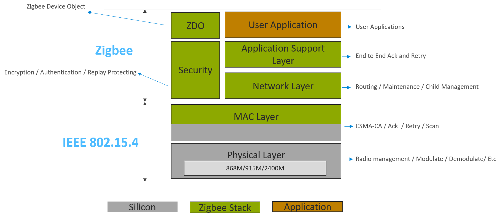
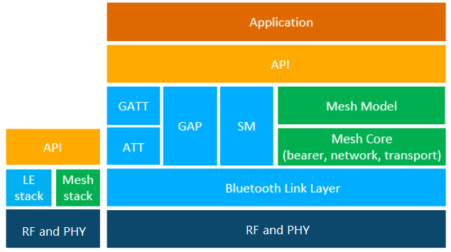

Table of Contents 

- [1. Wireless network introduction](#1-wireless-network-introduction)
  - [1.1. Network Topology](#11-network-topology)
    - [1.1.1. Point-to-Point](#111-point-to-point)
    - [1.1.2. Star](#112-star)
    - [1.1.3. Tree](#113-tree)
    - [1.1.4. Mesh](#114-mesh)
- [2. Commonly used mesh network](#2-commonly-used-mesh-network)
  - [2.1. Zigbee Mesh network](#21-zigbee-mesh-network)
  - [2.2. Bluetooth Mesh network](#22-bluetooth-mesh-network)
- [3. Comparing Zigbee and Bluetooth Mesh](#3-comparing-zigbee-and-bluetooth-mesh)
- [4. Reference](#4-reference)

***

# 1. Wireless network introduction
While the term - "wireless network" may technically be used to refer to any type of network that functions without the need for interconnecting wires. Wireless telecommunications networks are generally implemented with radios for the carrier or physical layer of the network.   

As you probably know that the radio spectrum is regulated by government agencies and by international treaties. Most transmitting stations, including commercial broadcasters, military, scientific, industrial, and amateur radio stations, require a license to operate. Each license typically defines the limits of the type of operation, power levels, modulation types, and whether the assigned frequency bands are reserved for exclusive or shared use.   

A common strategy in wireless network is to use 2400 MHz which was the one of the first worldwide unlicensed bands and is a very commonly-used frequency band. Both Bluetooth SIG and Zigbee Alliance endorse the use of this band, and of course the Zigbee Alliance can also use other SubGHz bands to expand their capabilities.   

## 1.1. Network Topology
Before talking about the mesh network, we'd like to introduce something more about the network topology.   
Network topology is the topological structure of a network, it refers to how nodes or devices in the network are physically or logically connected. There are a lot of different type of network topologies, including point-to-point, star, tree, mesh etc.   

### 1.1.1. Point-to-Point
Point-to-point topology is the simplest topology which has a dedicated link between two endpoints. Due to the direct link between these two devices, it can provide a fast and reliable connections, however, it can only be used for small area with only two devices involved.   

    

  

### 1.1.2. Star
In star topology, every peripheral node is connected to a central node called a hub, and all traffic that traverses the network passes through the central hub, which acts as a signal repeater.   
The advantage of the star topology is the simplicity of adding additional nodes, and each node in the network is independently connected to the central hub and will not affect others. On the flipside, since all of the peripheral are connected to the central hub and all peripheral communication must flow through the central hub, if the central hub goes down, the reset of the network cannot work anymore. And the network size will be limited by the capability of the central hub.   

    

  

### 1.1.3. Tree
A tree topology can be viewed as a collection of star networks arranged in a hierarchy.   
Unlike the star topology that each node is directly connected to the central hub, a tree topology has a parent-child hierarchy to how the nodes are connected. 
The advantage of the tree network is that you can expand the network easily, and each branch of the network can individually work.   

Similar to the star topology, the whole network depends on the health the central hub, if the central hub goes down, the entire network cannot work. In the tree network, each branch of the tree network also depends on the health of the root of the tree branch. And each two device in the network cannot communicate without the participation of the network or tree central device.   

    

  

### 1.1.4. Mesh 
A mesh topology is a type of network topology that each node in the network has a point-to-point connect to every other node. In the mesh network, devices may relay data to other devices not in direct radio range of the originating device. In this way, mesh networks can span very large physical areas and contain large numbers of devices.   

In general, mesh networks can relay messages using either a flooding technique or a routing technique.   
* With routing, the message is propagated along a path by hopping from node to node until it reaches its destination. To ensure that all its paths are available, the network must allow for continuous connections and must reconfigure itself around broken paths by using self-healing algorithms.   
* With flooding, the messages are not routed by a process which results in them being transmitted along a specific path comprising a sequence of only certain devices. Instead, all devices in range receive messages and those which are acting as relays, retransmit the message to all other devices in range. And there are generally two types of flooding available, uncontrolled flooding and controlled flooding.   

The mesh topology provides multi-hop communications and this basically allows you to increase the range between devices and cover large areas because messages can be delivered over multiple hops. Mesh topology also allows you to increase the scale of the network to tens or even hundreds of devices. The third thing the Mesh topology solved is reliability of message delivery, the network is not dependent on single nodes or routes, but the messages can reach the destinations through multiple routes and this of course increases the reliability of communications.   

    

  

***

# 2. Commonly used mesh network
The wireless communications systems based around mesh network topologies have proved themselves to offer an effective approach to providing coverage of large areas, extending range and providing resilience. The most wildly used mesh network for local communications in Internet of Things (IoT) is Zigbee and Bluetooth Mesh.   

## 2.1. Zigbee Mesh network
Zigbee is intended as a cost-effective and low power solution adopts the IEEE 802.15.4 standard at the physical and MAC layer. It is targeted to several markets including home automation, building automation, sensor networks, smart energy, and personal health care monitoring.   
Silicon Labs is a founding member of the ZigBee Alliance and is active with helping customers adopt Zigbee technology through its Ember Zigbee solution. The Silicon Labs (originally Ember which was acquired by Silicon Labs in July 2012) Zigbee platform has been a Golden Unit for testing and certification for all new revisions of the standard to date.   

The general characteristics for a Zigbee network are as follows:  
• Low power – Devices can typically operate for several years on AA type batteries using suitable duty cycles.  
• Low data rate – The 2.4 GHz band supports a radio data rate of 250 kbps.  
• Small and large networks – Zigbee networks vary from several devices to thousands of devices communicating seamlessly.  
• Range – Typical devices provide sufficient range to cover a normal home. Readily available designs with power amplifiers extend the range substantially.  
• Simple network installation, start up and operation – The Zigbee standard supports several network topologies. The simple protocols for forming and joining networks allow systems to self-configure and fix routing problems as they occur.  

The picture below illustrates the protocol architecture.   

    

  

## 2.2. Bluetooth Mesh network
Bluetooth mesh is a new topology available for Bluetooth LE devices and applications. Previously Bluetooth devices have been using point-to-point connectivity or broadcasting topologies to communicate with other devices. Bluetooth mesh extends that and allows both many-to-many device communications and using Bluetooth devices in a mesh topology. This enables multi-hop communications between Bluetooth devices and much larger-scale Bluetooth device networks than have been possible previously.   

Bluetooth mesh uses Bluetooth LE advertising channels to send and receive messages between the Bluetooth mesh nodes, but it can also use Bluetooth connections and GATT services to communicate with devices that do not natively support Bluetooth mesh.   

Bluetooth mesh also uses its own security architecture, which is separate from the normal Bluetooth LE security architecture, although the same AES-CCM 128-bit and Elliptic Curve Diffie Hellman (ECDH) security algorithms are used.   

Bluetooth mesh also defines its own application layer called mesh model which is different than the GATT-based profiles and services non-mesh Bluetooth LE devices use. The new application layer was defined to address the requirements and needs of mesh-based topologies and also to make Bluetooth mesh a full stack solution and enable interoperable mesh devices to be built.   

The picture below illustrates the Bluetooth mesh protocol architecture, and you can see it's almost a second stack sitting next to the BLE stack.   

    

 

***

# 3. Comparing Zigbee and Bluetooth Mesh
Both Zigbee and Bluetooth mesh are mesh networking protocol and each has unique characteristics, there is no simple answer about which protocol is better than another since the performance varies based on the application and use case.   

A major advantage of BLE mesh is it's capability to interface with mobile phones and tablets. This offers users an easy way to control the network and collect data from the network. This can be useful for controlling the light bulbs, obtaining sensor data, etc.   

Zigbee is a more mature standard with a well defined application layer for other applications besides lighting.  While BLE Mesh only supports the 2.4 GHz band, Zigbee is available in several sub-GHz bands. The frequencies are country-dependent. A Zigbee network interfaces to the outside world through a Zigbee gateway.   

And a major difference between BLE Mesh and Zigbee is routing. While Zigbee uses full, table-based routing BLE Mesh uses a controlled or managed flood.   
In Bluetooth Mesh network, the messages are sent from one node to another through relay nodes by re-broadcasting. When a node receives a message that is not intended for itself, the message is rebroadcasted. Packets are given a time-to-live (TTL) value to avoid continually re-broadcasting.   

All mesh networks have some similar concept about the network joining process, network topology, security feature, however, the implementation are different. We can have a comparison between these two protocols about the items below for understanding them better.    
* [Mesh network joining process comparison](Mesh-Network-Joining-Process-Comparison)
* [Mesh network topology comparison](Mesh-Network-Topology-Comparison)
* [Mesh network security comparison](Mesh-Network-Security-Comparison)
* [Mesh network performance comparison](Mesh-Network-Performance-Comparison)

*** 

# 4. Reference
* [Network Topology](https://en.wikipedia.org/wiki/Network_topology)
* [Zigbee Fundamentals](https://www.silabs.com/documents/public/user-guides/ug103-02-fundamentals-zigbee.pdf)