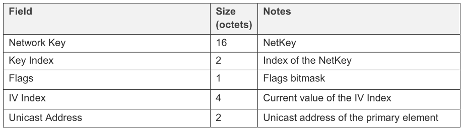

<details>
<summary><font size=5>Table of Contents</font> </summary>

- [1. Background](#1-background)
- [2. Zigbee](#2-zigbee)
  - [2.1. Architecture Introduction](#21-architecture-introduction)
  - [2.2. 802.15.4 Network topology](#22-802154-network-topology)
    - [2.2.1. Device type in IEEE 802.15.4 network](#221-device-type-in-ieee-802154-network)
    - [2.2.2. Star and Peer-to-Peer topology](#222-star-and-peer-to-peer-topology)
  - [2.3. Mesh Network maintenance](#23-mesh-network-maintenance)
    - [2.3.1. Device type in Zigbee network](#231-device-type-in-zigbee-network)
    - [2.3.2. Establish a New Network](#232-establish-a-new-network)
    - [2.3.3. Permit Device to Join a Network](#233-permit-device-to-join-a-network)
    - [2.3.4. Network Discovery](#234-network-discovery)
    - [2.3.5. Joining a Network](#235-joining-a-network)
      - [2.3.5.1. Joining a secured network](#2351-joining-a-secured-network)
      - [2.3.5.2. Authorization](#2352-authorization)
- [3. Bluetooth Mesh](#3-bluetooth-mesh)
  - [3.1. Architecture Introduction](#31-architecture-introduction)
  - [3.2. Network topology](#32-network-topology)
  - [3.3. Member of Bluetooth Mesh network](#33-member-of-bluetooth-mesh-network)
  - [3.4. Provisioning behavior](#34-provisioning-behavior)
    - [3.4.1. Beaconing](#341-beaconing)
      - [3.4.1.1. PB-ADV](#3411-pb-adv)
      - [3.4.1.2. PB-GATT](#3412-pb-gatt)
    - [3.4.2. Invitation](#342-invitation)
    - [3.4.3. Exchanging public keys](#343-exchanging-public-keys)
    - [3.4.4. Authentication](#344-authentication)
    - [3.4.5. Distribution of the Provisioning Data](#345-distribution-of-the-provisioning-data)
- [4. Conclusion](#4-conclusion)
  - [4.1. Network joining process in Zigbee](#41-network-joining-process-in-zigbee)
  - [4.2. Provisioning process in Bluetooth Mesh](#42-provisioning-process-in-bluetooth-mesh)
- [5. Reference](#5-reference)
</details>

***

# 1. Background
Silicon Labs is developing products designed to meet the demands of customers as we move to an ever-connected world of devices in the home, what is often referred to as the IoT (Internet of Things). And we offers the Flex, EmberZNet, BLE, Bluetoooth Mesh and Z-Wave stack for development on the Wireless Gecko family to meet different requirement from customer.   

This document describes the different process about how a device joining the mesh network in Zigbee and Bluetooth Mesh protocol.   

***

# 2. Zigbee
## 2.1. Architecture Introduction
As you already know that the Zigbee networks are based on the IEEE 802.15.4 MAC and physical layer. The figure below illustrates the architecture of Zigbee.   

<div align="center">
    
</div>  

The 802.15.4 MAC layer is used for basic message handling and congestion control. This MAC layer includes mechanisms for forming and joining a network, a Carrier Sense Multiple Access (CSMA) mechanism for devices to listen for a clear channel, as well as a link layer to handle retries and acknowledgment of messages for reliable communications between adjacent devices.   

The Zigbee network layer, the **Next higher layers** in the architecture below, builds on these underlying mechanisms to provide network configuration, manipulation, and message routing for reliable end-to-end communications in the network.    

<div align="center">
    
</div>  

## 2.2. 802.15.4 Network topology
Zigbee uses 802.15.4 MAC layer, and the MAC layer defined the mechanism for network forming and joining.   

### 2.2.1. Device type in IEEE 802.15.4 network
There are two different device type in an IEEE 802.15.4 network: a full-function device (FFD) and a reduced-function device (RFD).   
An FFD is a device that is capable of serving as a personal area network (PAN) coordinator or a coordinator.   
An RFD is a device that is not capable of serving as either a PAN Coordinator or a coordinator. An RFD is intended for applications that are extremely simple, such as a light switch or a passive infrared sensor; it does not have the need to send large amounts of data and only associates with a single FFD at a time. Consequently, the RFD can be implemented using minimal resources and memory capacity.   

### 2.2.2. Star and Peer-to-Peer topology
Depending on the application requirements, an IEEE 802.15.4 low-rate wireless personal area network (LR-WPAN) operates in either star topology or peer-to-peer topology as shown in the figure below.   
<div align="center">
    
</div>  

In the star topology, the communication is established between devices and a single central controller, called the Personal Area Network (PAN) Coordinator. The PAN Coordinator is the primary controller of the PAN.   

The peer-to-peer topology also has a PAN Coordinator, however, it differs from the star topology in that any device is able to communicate with any other device as long as they are in range of one another. Peer-to-peer topology allows more complex network formations to be implemented, such as mesh networking topology.   
**Note**: A peer-to-peer topology is different from the point-to-point network. In a peer-to-peer topology, each device is capable of communicating with any other device within its radio communications range. However, in the point-to-point topology, there is only two devices get involved.   

A peer-to-peer network allows multiple hops to route messages from any device to any other device on the network. Such functions can be added at the higher layer, which is Network layer in Zigbee architecture.   

The PAN Coordinator forms a network by choosing an unused PAN ID and broadcasting beacon frames to neighboring devices. Once the PAN ID is chosen, the PAN Coordinator allows other devices, potentially both FFDs and RFDs, to join its network. A candidate device receiving a beacon frame is able to request to join the network at the PAN Coordinator. If the PAN Coordinator permits the device to join, it adds the new device as a child device in its neighbor list. Then the newly joined device adds the PAN Coordinator as its parent in its neighbor list and begins transmitting periodic beacons; other candidate devices are able to then join the network at that newly joined device. If the original candidate device is not able to join the network at the PAN Coordinator, it will search for another parent device.   


## 2.3. Mesh Network maintenance
The network formation is performed by next higher layer which is network layer, and we will discuss how to maintain the network from network layer view.   

### 2.3.1. Device type in Zigbee network

* **ZigBee coordinator**: an IEEE 802.15.4 PAN coordinator. The PAN coordinator is the principal controller of an IEEE 802.15.4-based network that is responsible for network formation. The PAN coordinator must be a full function device (FFD).   
* **ZigBee router**: an IEEE 802.15.4 FFD participating in a ZigBee network, which is not the ZigBee coordinator but may act as an IEEE 802.15.4 coordinator within its personal operating space, that is capable of routing messages between devices and supporting associations. 
* **ZigBee end device**: an IEEE 802.15.4 RFD or FFD participating in a ZigBee network, which is neither the ZigBee coordinator nor a ZigBee router. 

In Zigbee network, the ZigBee coordinators shall provide functionality to establish a new network. ZigBee routers and end devices shall provide the support of portability within a network.   

### 2.3.2. Establish a New Network
The procedure to successfully start a new network is illustrated in the message sequence chart shown as below.   
<div align="center">
    
</div>  

1. The procedure to establish a new network is initiated through use of the *NLME-NETWORK-FORMATION.request* primitive, the primitive allows the next higher layer to request that the device start a new ZigBee network with itself as the coordinator. Only the device which is capable of becoming the Zigbee coordinator and not currently joined to a network shall attempt to establish a new network.    

2. When this procedure is initiated, the Network Layer Management Entity (NLME) shall first request that the MAC sub-layer(s) perform an energy detection scan over either a specified set of channels or, by default, the complete set of available channels, as dictated by the PHY layer(s), to search for possible interferers. In EmberZNet stack based project, you can configure the channel mask in the **Network Creator** plugin. And of course, the energy detection scan is not necessary if there is only one channel specified.   
On receipt of the results from a successful energy detection scan, the NLME shall order the channels on each interface according to increasing energy measurement and discard those channels whose energy levels are beyond an acceptable level.   

3. The NLME shall then perform an active scan, by issuing the *MLME-SCAN.request* primitive on each MAC Interface with the ScanType parameter set to active scan and ChannelList set to the list of acceptable channels and ChannelPage set to the relevant value for that interface, to search for other ZigBee devices. To determine the best channel on which to establish a new network, the NLME shall review the list of returned PAN descriptors and find the first channel for each MAC Interface with the lowest number of existing networks, favoring a channel with no detected networks.   

4. If a suitable channel is found, the NLME shall select a PAN identifier for the new network. To do this the device shall choose a random PAN identifier less than 0xffff that is not already in use on the selected channel.   
Once a PAN identifier is selected, the NLME shall select a 16-bit network address equal to 0x0000 as its network address. And then the NLME shall check the value of the extended PAN identifier for the PAN. If this value is 0x0000000000000000 means the extended PAN identifier is unknown, this attribute will be initialized as well.   

5. Then, the NLME shall initiate a new PAN by issuing the *MLME-START.request* primitive to each MAC sub-layer. And each MAC interface will response the status of the PAN startup via the *MLME-START.confirm* primitive.   
6. On receipt of the status of the PAN startup, the NLME shall inform the next higher layer of the status of its request to initialize the ZigBee coordinator.   

### 2.3.3. Permit Device to Join a Network
The procedure for permitting devices to join a network is illustrated as below.   

<div align="center">
    
</div>  

The procedure for permitting devices to join a network is initiated through the *NLME-PERMIT-JOINING.request* primitive, the primitive allows the next higher layer of a Zigbee coordinator or router to set its MAC sub-layer association permit flag for a fixed period when it may accept devices onto its network. Only the ZigBee coordinator or a ZigBee router shall attempt to permit devices to join the network.   

When this procedure is initiated with the *PermitDuration* parameter set to value between 0x01 and 0xfe, indicate the permit is allowed for a fixed period, the NLME shall set the *macAssociationPermit* attribute in the MAC sub-layer to TRUE indicates that association is permitted.   

The NLME shall then start a timer to expire after the specified duration. On expiration of this timer, the NLME shall set the macAssociationPermit attribute in the MAC sub-layer to FALSE.   

### 2.3.4. Network Discovery
The procedure for network discovery shall be initiated by issuing the *NLME-NETWORK-DISCOVERY.request* primitive with the ScanChannelsListStructure parameter set to indicate which channels are to be scanned for networks and the ScanDuration parameter set to indicate the length of time to be spent scanning each channel.   

Upon receipt of this primitive, the NWK layer shall issue a *MLME-SCAN.request* primitives asking each MAC sub-layer to perform an active scan, the *MLME-SCAN.request* primitive may cause the transmission of an unsecured beacon request frame.   

Every beacon frame received during the scan having a non-zero length payload shall cause the *MLME-BEACON-NOTIFY.indication* primitive to be issued from the relevant MAC sub-layer of the scanning device to its NLME. This primitive includes information such as the addressing information of the beaconing device, whether or not it is permitting association and the beacon payload. The NLME of the scanning device shall check the protocol ID field in the beacon payload and verify that it matches the ZigBee protocol identifier. If not, the beacon is ignored. Otherwise, the device shall copy the relevant information from each received beacon into its neighbor table.    
Please see the figure below for the structure of the beacon payload.   

<div align="center">
    
</div>  
<div align="center">
  <b> Format of the MAC Sub-Layer Beacon Payload </b>
</div>  
<br>

Below is the network data captured by Network Analyzer integrated in Simplicity Studio, the beacon frame conveys the information that the device is capable of accepting join request from router-capable devices, and a value of 0x00 for the Depth field indicates it's the Zigbee coordinator for the network, also the extended PAN identifier is included in the payload.   
<div align="center">
    
</div>  
<div align="center">
  <b> Beacon frame </b>
</div>  
<br>

Once all MAC sub-layer(s) signal the completion of the scan by issuing the *MLME-SCAN.confirm* primitive to the NLME, the NWK layer shall issue the *NLME-NETWORK-DISCOVERY.confirm* primitive containing a description of each network that was heard. Every network description contains the ZigBee version, stack profile, Extended PAN Id, PAN Id, logical channel, and information on whether it is permitting joining.   


### 2.3.5. Joining a Network
The section below describes the procedure of a device (child) opts to join a network using the underlying association capabilities provided by the MAC, as well as the procedure of the Zigbee coordinator or router (parent) shall follow upon receipt of the association request.   

#### 2.3.5.1. Joining a secured network
For joining a network using the MAC layer association procedure, the joiner device will issue an *NLME-NETWORK-DISCOVERY.request* primitive, this primitive will invoke an *MLME-SCAN.request* primitive which may case the transmission of an unsecured beacon request frame. That's the procedure what we've discussed in the section [Network Discovery](#234-network-discovery).   

The joiner device receives beacons from nearby routers and the NWK issues an *NLME-NETWORK-DISCOVERY.confirm* primitive. Upon receipt of the *NLME-NETWORK-DISCOVERY.confirm* primitive, the next higher layer shall either choose a network to join from the discovered networks or redo the network discovery. Once a network is selected, it shall then issue the *NLME-JOIN.request* primitive to request to join the network.   

Note that only those devices that are not already joined to a network shall initiate the join procedure. Otherwise, the NLME shall terminate the procedure and notify the next higher layer of the illegal request.   

For a device that is not already joined to a network, the NLME shall issue an *MLME-ASSOCIATE.request* primitive to the MAC sub-layer which will cause an *Association request command* to be sent to the router.    
The Association Request command Content field shall be formatted as illustrated in figure below.   

<div align="center">
    
</div>  
<div align="center">
  <b> Association Request command Content field format </b>
</div>  
<br>

The bit-fields of the *CapabilityInformation* parameter in the *Association Request* shall have the values shown in table below. The right side of the figure is the network data captured by the Network Analyzer, the Device type field is 1 which indicates that a Zigbee router is joining the network.   

<div align="center">
    
</div>  
<div align="center">
  <b> Capability Information field format & network data </b>
</div>  
<br>

A *Data Request* command will be sent from the joiner device to the coordinator following the acknowledgment to an Association Request command.   

Upon receipt of an *Association request* MAC command, the router shall issue an *MLME-ASSOCIATE.indication* primitive. Next, the NWK layer will issue an *NLME-JOIN.indication* primitive to the router's ZDO. The router shall now know the joiner device's address and security capabilities. The router will also issue an *MLME-ASSOCIATE.response*. This primitive will cause an *Association response command* to be sent to the joiner.   
The *Association Response command* Content field shall be formatted as illustrated in figure below.    

<div align="center">
    
</div>  
<div align="center">
  <b> Association Response command Content field format </b>
</div>  
<br>

If the coordinator was able to associate the device to its PAN, this field shall contain the short address that the device may use in its communications on the PAN until it is disassociated.   
Below is the network data captured by Network Analyzer, it indicates that the coordinator associated the device to its PAN, and the short address of the device is 0xA895.   

<div align="center">
    
</div>  
<div align="center">
  <b> Association Response command </b>
</div>  
<br>

Upon receipt of the *Association response* MAC command, the joiner shall issue the *NLME-JOIN.confirm* primitive. The joiner is now declared "joined, but unauthorized" to the network.   

<div align="center">
    
</div>  
<div align="center">
  <b> Joining a Secured Network </b>
</div>  
<br>

#### 2.3.5.2. Authorization
Once a device joins a secured network and is declared "joined but unauthorized", it must be authorized by receiving an *APS Transport Key* command containing the active network key.   

In centralized security networks, if the router is the Trust Center, the authorization procedure shall be activated after receipt of the *NLME-JOIN.indication* primitive.   

After being activated for the authorization procedure, the Trust Center shall determine whether or not to allow the device onto the network. This decision will be based on its own security policies. If it decides to allow the device onto the network, it shall send the device the active network key by issuing the *APSME-TRANSPORT-KEY.request* primitive with the DestAddress parameter set to the address of the newly joined device, and the *StandardKeyType* parameter set to 0x01 (that is, standard network key). The KeySeqNumber sub-parameter of the *APSME-TRANSPORT-KEY.request* shall be set to the sequence count value for the active network key and the NetworkKey sub-parameter shall be set to the active network key.   
The network data of the *Transport Key* command captured by the Network Analyzer below indicates that the trust center are transporting a standard network key ```{0x73,0xAA,0x2B,0xE0,0x12,0x37,0x22,0xFA,0x1D,0x85,0x99,0xD4,0xA0,0x4D,0xCB,0xAE}``` to the destination device ```000B57FFFE648D95```.   
<div align="center">
    
</div>  
<div align="center">
  <b> Transport Key </b>
</div>  
<br>

After successfully joining a secured network, the joined and authorized device shall always apply NWK layer security to outgoing frames unless the frame is destined for a newly joined but unauthorized child. In a secured network, if the device does not become authorized within a preconfigured amount of time, it shall leave the network.   

*** 

# 3. Bluetooth Mesh

## 3.1. Architecture Introduction

Bluetooth mesh is a new topology available for Bluetooth LE devices and applications. Previously Bluetooth devices have been using point-to-point connectivity or broadcasting topologies to communicate with other devices. Bluetooth mesh extends that and allows both many-to-many device communications and using Bluetooth devices in a mesh topology. This enables multi-hop communications between Bluetooth devices and much larger-scale Bluetooth device networks than have been possible previously.   

Bluetooth mesh uses Bluetooth LE advertising channels to send and receive messages between the Bluetooth mesh nodes, but it can also use Bluetooth connections and GATT services to communicate with devices that do not natively support Bluetooth mesh. Bluetooth mesh also uses its own security architecture, which is separate from the normal Bluetooth LE security architecture, although the same AES-CCM 128-bit and Elliptic Curve Diffie Hellman (ECDH) security algorithms are used.   

Bluetooth mesh also defines its own application layer called mesh model which is different than the GATT-based profiles and services non-mesh Bluetooth LE devices use. The new application layer was defined to address the requirements and needs of mesh-based topologies and also to make Bluetooth mesh a full stack solution and enable interoperable mesh devices to be built.   

The architecture picture below illustrates the Bluetooth mesh architecture, at the bottom of the mesh architecture, there is a layer entitled as Bluetooth Low Energy. In fact, it's the Bluetooth LE stack which is required to provide fundamental wireless communications capabilities which are leveraged by the mesh architecture which sits on top of it. It should be clear that the mesh system is dependent upon the availability of the Bluetooth LE stack.   
<div align="center">
    
</div>  
<div align="center">
  <b> Bluetooth mesh architecture </b>
</div>  
<br>

And the architecture of the Bluetooth Mesh stack below illustrates that the Bluetooth Mesh is almost a second stack sitting next to the Bluetooth LE stack but share the Bluetooth link layer and RF.   
<div align="center">
    
</div>  
<div align="center">
  <b> SiliconLabs Bluetooth mesh stack architecture </b>
</div>  
<br>

## 3.2. Network topology
Unlike the Zigbee which uses IEEE 802.15.4 MAC layer, and the MAC layer defined the mechanism for network forming and joining, the Bluetooth Mesh use the Bluetooth Low energy transfer as the fundamental wireless communication, and the provisioner will create the mesh network, and add devices to the mesh network. And the Network layer as illustrated in the Bluetooth mesh architecture defines the network PDU format, decrypts and authenticates and forwards the received incoming message to upper layer, and encrypt and authenticates and forwards outgoing message to lower layer.   

Below is a typical network topology for using the smart phone as a provisioner. The Bluetooth mesh mobile application running on the smart phone will discovery and provision devices over GATT.   
<div align="center">
    
</div>  
<div align="center">
  <b> Bluetooth mesh network topology </b>
</div>  
<br>

As most of the smartphones in the market at this point do not natively support Bluetooth mesh, a Bluetooth mesh stack for the phones is necessary for the phone to be able to provision, configure, and control the Bluetooth mesh nodes over the GATT bearer. Below is the typical architecture of the Bluetooth stack and application on smartphones.   
<div align="center">
    
</div>  
<div align="center">
  <b> Bluetooth Stacks and Application architecture on smartphone </b>
</div>  
<br>

## 3.3. Member of Bluetooth Mesh network
**Provisioner**: 
The provisioner is the node that is capable of setting up a mesh network and adding a device to a mesh network.   
The provisioner will implement a ***Configuration Client model*** which will manage the network resources and allocate them to nodes. It manages allocation of addresses to make sure no duplicate unicast addresses are allocated, whereas a Configuration Client generates and distributes network and application keys and makes sure that devices that need to communicate with each other share proper keys for both network and access layers.   

**Device**:
A device that is not a member of a mesh network is known as an unprovisioned device. A device that is a member of a mesh network is known as a node. A Provisioner is used to manage the transitions between an unprovisioned device and a node.   

**Node**:
A node in the Bluetooth mesh network can send or receive mesh messages and is managed by a Configuration Client, that may also be the same device as the Provisioner, over the mesh network to configure how the node communicates with other nodes.   

You probably know that in the Bluetooth mesh network, there are some optional features the node may support: the Relay, Proxy, Friend, and the Low Power features. However, that's something will not be involved during the provisioning process, and is beyond the scope of this article. We will discuss it more in the [Mesh network topology comparison](Mesh-Network-Topology-Comparison).   

## 3.4. Provisioning behavior
The process which transforms an unprovisioned device into a node is called "provisioning". Consider purchasing a new Bluetooth light with mesh support, bringing it home and setting it up. To make it part of your mesh network, so that it can be controlled by your existing Bluetooth light switches and dimmers, you would need to provision it.   

Provisioning is a secure procedure which results in an unprovisioned device possessing a series of encryption keys and being known to the Provisioner device, typically a tablet or smartphone. One of these keys is called the network key. All nodes in a mesh network possess at least one NetKey and it is possession of this key which makes a device a member of the corresponding network and as such, a node.    

Provisioning is performed using a five-step process: beaconing, invitation, exchanging public keys, authentication, and distribution of the provisioning data.   

### 3.4.1. Beaconing
An unprovisioned device may support PB-ADV and may support PB-GATT. It is strongly recommended to support PB-ADV and PB-GATT in Bluetooth Mesh profile specification. And we will focus on the PB-ADV since most of the unprovisioned device support it.   
A Provisioner shall support at least one of PB-ADV or PB-GATT. It is strongly recommended to support PB-ADV in Bluetooth Mesh profile, however, most of the smart phone do support that at this point.   

#### 3.4.1.1. PB-ADV
PB-ADV is a provisioning bearer used to provision a device using *Generic Provisioning PDUs* over the advertising channels. A device that supports PB-ADV, has not been provisioned, and is not in the process of being provisioned, shall advertise the *Unprovisioned Device beacon*, otherwise a device shall not advertise the Unprovisioned Device beacon.   

The Unprovisioned Device beacon is used by devices that are unprovisioned to allow them to be discovered by a Provisioner.   

<div align="center">
    
</div>  
<div align="center">
  <b>  Unprovisioned device beacon format </b>
</div>  
<br>

The out-of-band (OOB) Information field in the Unprovisioned Device beacon is used to help drive the provisioning process by indicating the availability of OOB data. A separate non-connectable advertising packet with a ***Uniform Resource Identifer*** (URI) data type that points to OOB information will be advertised if use OOB. In this case, to allow the association of the advertised URI with the Unprovisioned Device beacon, the beacon may contain an optional 4-octet URI Hash field.   

Below is a example of the Unprovisioned Device beacon of the device that supports PB-ADV, the Device UUID is ```{0x53,0x69,0x6C,0x61,0x62,0x73,0x44,0x65,0x76,0x2D,0x95,0x8D,0x64,0x57,0x0B,0x00}``` and it doesn't use the OOB, so the URI Hash field is not included there.   

<div align="center">
    
</div>  
<div align="center">
  <b>  Unprovisioned device beacon data </b>
</div>  
<br>

#### 3.4.1.2. PB-GATT
PB-GATT is a provisioning bearer used to provision a device using Proxy PDUs to encapsulate Provisioning PDUs within the Mesh Provisioning Service. And the PB-GATT is provided for support when a Provisioner does not support PB-ADV due to limitations of the application interfaces.   

### 3.4.2. Invitation 
In this step, the Provisioner shall sends an invitation to the device to be provisioned, in the form of a *Provisioning Invite PDU*. And the Beaconing device responds with information about itself in a provisioning Capabilities PDU.   
The figure below illustrates the message sequence for provisioning invitation.   

<div align="center">
    
</div>  
<div align="center">
  <b>  Unprovisioned device beacon data </b>
</div>  
<br>

A Provisioner sends the *Provisioning Invite PDU* to indicate to the device that the provisioning process is starting. The format of the parameters for this PDU is defined as below.   

<div align="center">
    
</div>  
<div align="center">
  <b>  Provisioning Invite PDU parameters format </b>
</div>  
<br>

The *Attention Timer state* is generally intended to allow an element to attract human attention during provisioning, e.g., LED blinks. A device may not support the Attention Timer, then the Attention Timer state shall always be set to zero.   
The network data below is a example that the *Attention Timer* field was set to zero.   

<div align="center">
    
</div>  
<div align="center">
  <b>  Provisioning Invite PDU data </b>
</div>  
<br>


Then the device will sends the *Provisioning capabilities PDU* to indicate its supported provisioning capabilities to a Provisioner. It includes the information on the number of elements the device supports, the set of security algorithms supported, the availability of its public key using an OOB technology, the ability for this device to output a value to the user, the ability for this device to allow a value to be input by the user, and if the device has a block of OOB data that can be used for authentication.   
We will not elaborate the value of each sub field except the *Number of Elements*, *Algorithms* and *Public Key Type* in this article, please refer to [Bluetooth Mesh Profile](https://www.bluetooth.com/specifications/mesh-specifications/) specification for more information about other sub field.   
<div align="center">
    
</div>  
<div align="center">
  <b>   Provisioning capabilities PDU parameters format </b>
</div>  
<br>

* **Number of Elements**
Indicates the number of elements supported by the device, the available value is 0x01 to 0xFF.
* **Algorithms**
The supported algorithms, bit 0 indicates if the FIPS P-256 Elliptic Curve algorithm is supported or not. In bluetooth mesh network, all devices and Provisioners shall support the FIPS P-256 Elliptic Curve Algorithm. Bit 1-15 is reserved for further use.
* **Public Key Type**
Indicates if the Public Key OOB information is available.   

Below is the network data captured by the Network Analyzer, we can get the information from the *Provisioning capabilities* PDU that there are two elements in the device, and it supports FIPS P-256 Elliptic Curve algorithm. And the OOB Public Key will not be used.   
<div align="center">
    
</div>  
<div align="center">
  <b>   Provisioning capabilities PDU data </b>
</div>  
<br>


### 3.4.3. Exchanging public keys

Once the Provisioner has determined that it can provision the device, it shall send a *Provisioning Start* PDU to indicate the method it has selected from the options in the Provisioning Capabilities PDU.   
<div align="center">
    
</div>  
<div align="center">
  <b> Provisioning Start PDU parameters format </b>
</div>  
<br>
In the example below, the provisioner selects the "FIPS P-256 Elliptic Curve" algorithm used for provisioning, and No OOB public key is used.   
<div align="center">
    
</div>  
<div align="center">
  <b> Provisioning Start PDU </b>
</div>  
<br>

Then the Provisioner and the device to be provisioned, exchange their public keys, which may be static or ephemeral, either directly or using an out-of-band (OOB) method. If the public key was not available using an OOB technology, then the public keys are exchanged between both devices. The device shall send its public key if the key is not delivered OOB.   

<div align="center">
    
</div>  
<div align="center">
  <b>  Public key exchange without OOB public key </b>
</div>  
<br>

The format of the *Provisioning Public Key* PDU is defined as below.   
<div align="center">
    
</div>  
<div align="center">
  <b>   Provisioning capabilities PDU data </b>
</div>  
<br>

Below are the Public Key PDU exchanged between the provisioner and the end device, and the public key is delivered use the ECDH calculations.   

<div align="center">
    
</div>  
<div align="center">
  <b>  Exchanging public keys: Provisioner to New Device </b>
</div>  
<br>

<div align="center">
    
</div>  
<div align="center">
  <b>  Exchanging public keys: New Device to Provisioner </b>
</div>  
<br>

### 3.4.4. Authentication
If Output OOB authentication is used, during the authentication step, the device to be provisioned outputs a random, single or multi-digit number to the user in some form, using an action appropriate to its capabilities. For example, it might flash an LED several times. The user enters the digit(s) output by the new device into the Provisioner and a cryptographic exchange takes place between the two devices.   

Once input of the number has been performed, a confirmation exchange followed by a random number exchange is performed. The confirmation values are a cryptographic hash of all the parameters below.   
1. The values exchanged so far, that include the value of the *Provisioning Invite PDU* fields,  the value of the *Provisioning Capabilities PDU* fields, the value of the *Provisioning Start PDU* fields and the value of the *Public Key X* and *Public Key Y* fields from the *Public Key PDU* that was sent by the Provisioner or the device.   
2. The random number that is yet to be revealed, and will be exchanged within the following *Provisioning Random*.   
3. The number that has been output by the device and user entered into the Provisioner.   

The Provisioner shall send the *Provisioning Random* PDU after it has received the *Provisioning Confirmation* PDU. And the device shall also send the Provisioning Random after verifying the confirmation value against the random number it has received. Both the *Provisioning Random* PDU sent from Provisioner and device is a string of random bits generated by it's random number generator.   
<div align="center">
    
</div>  
<div align="center">
  <b>  Authentication with Output OOB </b>
</div>  
<br>

If static OOB authentication is used, or No OOB authentication is used, then the Provisioner shall immediately use the confirmation and random number exchanges. The figure below illustrates the message sequence for authentication with Static OOB or No OOB used.   

<div align="center">
    
</div>  
<div align="center">
  <b>  Authentication with static OOB or no OOB </b>
</div>  
<br>

### 3.4.5. Distribution of the Provisioning Data
Once the device has been authenticated, the Provisioner and device shall use the calculated DiffieHellman shared secret ECDHSecret and generate a session key from that shared secret. That session key shall then be used to encrypt and authenticate the provisioning data. The Provisioner then shall send the *Provisioning Data PDU* containing the encrypted and authenticated provisioning data to the device.   
The provisioning data format is described in table below.   

<div align="center">
    
</div>  
<div align="center">
  <b>  Provisioning data format </b>
</div>  
<br>

* The Network Key shall contain the NetKey.  
* The Key Index field shall identify the global NetKey Index of the Network Key.   
* The Flags indicates the Key refresh procedure and the IV Update progress state.   
* The IV Index field shall contain the current value of the IV Index.   
* The Unicast Address shall contain the Unicast Address of the primary element of the node being added to the network.   

Upon receiving the Provisioning Data PDU from the Provisioner, the device shall decrypt and authenticate the provisioning data. Upon successful authentication of the provisioning data, the device shall set the network key, set the IV index, set the IV Update procedure state and the Key Refresh Phase based on the Key Refresh Flag, and assign unicast addresses to all device elements starting from primary element using consecutive range of addresses starting from provided unicast address value.   
Upon successful completion of the address assigning procedure, the device shall respond with a *Provisioning Complete PDU* to confirm that it has been provisioned. The message sequence for distribution of provisioning data is illustrated as below.   

<div align="center">
    
</div>  
<div align="center">
  <b>  Distribution of provisioning data </b>
</div>  
<br>

Upon receiving the *Provisioning Complete PDU* from the device, the Provisioner shall assume that provisioning process is completed successfully and the device is using a consecutive range of address starting from the value of the unicast address. The device is now a node in the mesh network.   

***

# 4. Conclusion
## 4.1. Network joining process in Zigbee
Zigbee networks are based on the IEEE 802.15.4 MAC and physical layer. The IEEE 802.15.4 MAC MAC layer includes mechanisms for forming and joining a network, and the Zigbee network layer provide network configuration, manipulation, and message routing for reliable end-to-end communications in the network.   

For establishing a centralized Zigbee network, a Zigbee coordinator (PAN coordinator) and not currently joined to a network is required, and the network layer management entity will request the MAC sub-layer perform an energy detection and active scan. If a suitable channel is found, the network layer management entity will select a PAN identity for the new network and initiate a new PAN. Then the ZigBee coordinator shall attempt to permit devices to join the network.   

For joining a network using the MAC layer association procedure, the joiner device will issue an NLME-NETWORK-DISCOVERY.request primitive, this primitive will invoke an MLME-SCAN.request primitive which may case the transmission of an unsecured *Beacon Request* frame. The joiner device receives *Beacon* from nearby routers (router or coordinator) which conveys the information that the device is capable of accepting join request from router-capable devices or end device, and the extended PAN identifier is included in the payload, and so on.   

The joiner device will choose a network from the discovered networks to join. Once a network is selected, it shall then send *Association request* to the router. Upon receipt of an *Association request* MAC command, the router will send an *Association response* to the joiner device. If the router was able to associate the device to the PAN, this field of the *Association response* shall contain the short address that the device may use in its communications on the PAN until it is disassociated.   

Once a device joins a secured network and is declared "joined but unauthorized", and the trust center shall determine whether or not to allow the device onto the network. If it decides to allow the device onto the network, it shall send the device the active network key. And the joiner device has now successfully joined a secured network.   

## 4.2. Provisioning process in Bluetooth Mesh
The Bluetooth Mesh use the Bluetooth Low energy transfer as the fundamental wireless communication, and the provisioner (similar as coordinator in Zigbee network) will create a mesh network, and add devices to the mesh network. The provisioner will manage the network resources and allocate them to nodes. It manages allocation of addresses to make sure no duplicate unicast addresses are allocated, generates and distributes network and application keys to the devices.   

The process which transforms an unprovisioned device into a node is called "provisioning". For joining the Bluetooth Mesh network, the device shall advertise the Unprovisioned Device beacon to allow it to be discovered by Provisioner. After receiving the Unprovisioned Device beacon, the Provisioner shall sends an invitation to the device to be provisioned.   

Then the device will sends the Provisioning capabilities PDU to indicate its supported provisioning capabilities to a Provisioner, it includes the information on the number of elements the device supports, the set of security algorithms supported, and so on.   

Once the Provisioner has determined that it can provision the device, it shall send a Provisioning Start PDU to indicate the method it has selected from the options in the Provisioning Capabilities PDU, and then the Provisioner and the device to be provisioned will exchange their public keys, and the public key is delivered use the ECDH calculations.   

During the authentication step, all of the values exchanged so far and random number exchanged within the following *Provisioning Random* PDU will be used for authentication.  

Once the device has been authenticated, the Provisioner and device shall use the calculated DiffieHellman shared secret ECDHSecret and generate a session key from that shared secret. That session key shall then be used to encrypt and authenticate the provisioning data that include the network key, key index, unicast address of the primary element of the node being provisioned to the network.   

Upon receiving the *Provisioning Data PDU* from the Provisioner, the device shall decrypt and authenticate the provisioning data, and response the provisioner with Provisioning Complete PDU to confirm that it has been provisioned. And the device is now a node in the mesh network.   

*** 

# 5. Reference
* [Bluetooth Mesh Profile Specification](https://www.bluetooth.com/specifications/mesh-specifications/)
* [Zigbee Specification](https://zigbeealliance.org/)
* [Understanding bluetooth mesh lighting demo](https://www.silabs.com/documents/public/application-notes/an1098-understanding-bluetooth-mesh-lighting-demo.pdf)
