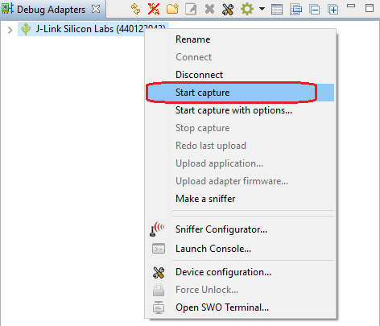
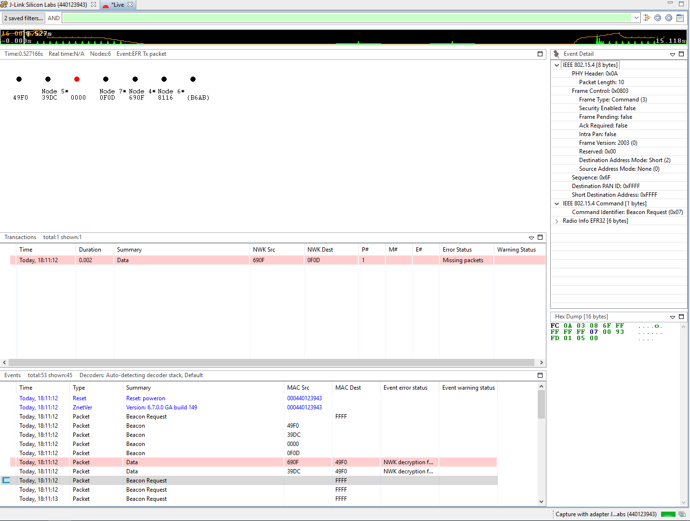
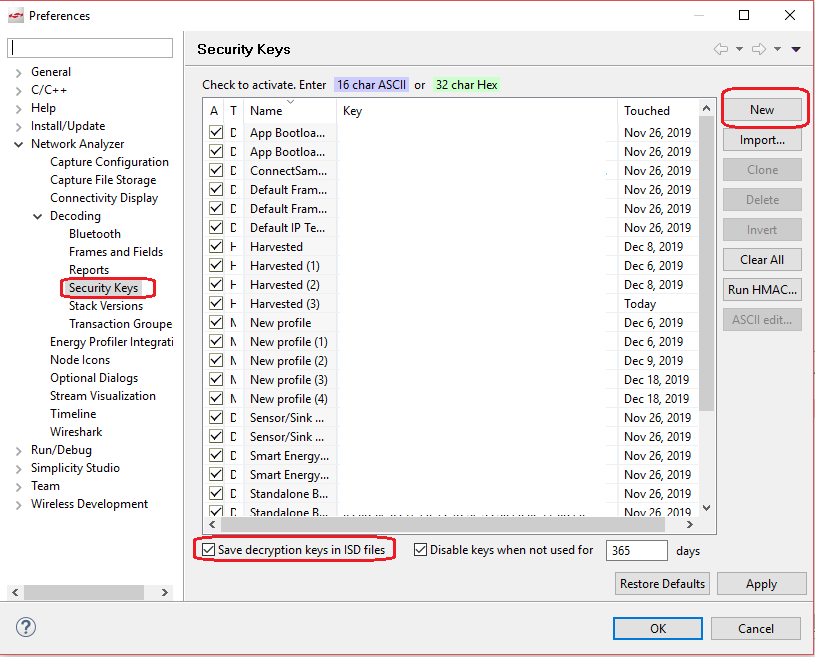

Table of Contents 

&nbsp;  
 
- [Network Analyzer](#network-analyzer)

  

********

## Network Analyzer
Network Analyzer is very helpful to debug wireless issues. Packets over the air can be captured by the WSTK and then decoded detailly.  

To start a capture, you just need to follow the steps below:  

1. Select the WSTK from the list of the "Debug Adapters" window. Right click and select "connect".  

2. Right click again and select "Start Capture". 

  

3. After that, Network Analyzer will be started.  

  

4. Some of the packets might be encrypted. You will need to configure the security keys for decoding them. To configure the security keys, turn to menu "Windows"-->"Preferences":

  

It's recommended to select the option "Save decrypton keys in ISD files", so that when you pass the ISD files to others, you don't need to pass them the security keys again.  

The security keys will take place when you start the capture next time. If you have enabled the capture before setting the keys, you can save the captured packets to an ISD file and open it after the keys configured.  

