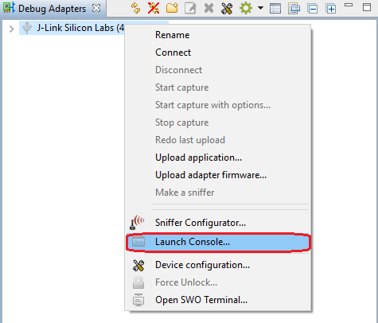
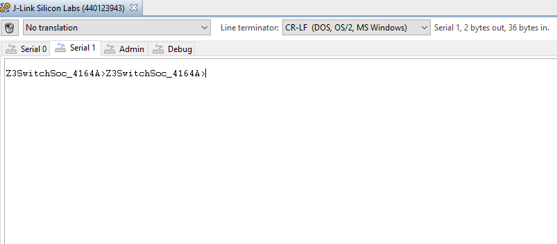

Table of Contents 

&nbsp;  
 
- [Open Console](#open-console)

  

********

## Open Console
Simplicity Studio has integrated a console which is very convenient to debug the WSTK. It's quite easy to open the console. You just need to follow the steps below :  
1. Select the WSTK from the list of the "Debug Adapters" window. Right click and select "Launch Console".  

2. Then select the "Serial 1" tab, hit enter on the console.

 