
   

目录 

<!-- TOC -->

- [Background](#background)
- [1. Amazon Alexa ecosystem](#1-amazon-alexa-ecosystem)
    - [1.1. Alexa Connected Devices](#11-alexa-connected-devices)
        - [1.1.1. In the Cloud](#111-in-the-cloud)
        - [1.1.2. Locally](#112-locally)
        - [1.1.3. On Your Device](#113-on-your-device)
        - [1.1.4. Echo-paired(Bluetooth)](#114-echo-pairedbluetooth)
    - [1.2. Alexa Voice Service (AVS) and Alexa Built-in Devices](#12-alexa-voice-service-avs-and-alexa-built-in-devices)
    - [1.3. Alexa Ecosystem Skills](#13-alexa-ecosystem-skills)
        - [1.3.1. Lambda function](#131-lambda-function)
        - [1.3.2. Alexa Skills Account Linking](#132-alexa-skills-account-linking)
        - [1.3.3. Two types of grants](#133-two-types-of-grants)
            - [1.3.3.1. Authorization Code Grants---Full Access Grant Typ](#1331-authorization-code-grants---full-access-grant-typ)
            - [1.3.3.2. Implicit Grant--Limited Access Grant Type:](#1332-implicit-grant--limited-access-grant-type)
    - [1.4. Learning Amazon Alexa](#14-learning-amazon-alexa)
        - [1.4.1. Video Courses and Tutorials](#141-video-courses-and-tutorials)
        - [1.4.2. Documentation System](#142-documentation-system)
        - [1.4.3. Alexa SDKs](#143-alexa-sdks)
- [2. Google Smart Home](#2-google-smart-home)
    - [2.1. Google Smart Home Execute Paths](#21-google-smart-home-execute-paths)
    - [2.2. Develop Google Smart Home Automations](#22-develop-google-smart-home-automations)
    - [2.3. Documentations](#23-documentations)
        - [2.3.1. Guides](#231-guides)
        - [2.3.2. Reference](#232-reference)
        - [2.3.3. Codelabs](#233-codelabs)
        - [2.3.4. Support System](#234-support-system)
        - [2.3.5. Actions SDK](#235-actions-sdk)
- [3. Siri, HomePod and HomeKit](#3-siri-homepod-and-homekitspan)

<!-- /TOC -->

# Background

In the U.S. market, many types of smart speakers are on selling, and the development tendency of using voice to control smart home devices is soaring. To explore the possibility of incorporating Silicon Labs products with smart speakers on the U.S. market, the investigation of smart speaker ecosystems is a must. This article investigates the mainstream products of smart speakers in U.S. market in details, including the technologies used, the characteristics of the ecosystems, and the popularity of different products in the U.S. market.

# 1. Amazon Alexa ecosystem

## 1.1. Alexa Connected Devices

Alexa is a voice assistant, unlike Siri presented by Apple Inc., it can be incorporated into many products. To some extent, it is pretty much similar to Tmall Genie, an open-loop ecosystem. However, one big difference is that Alexa could be an independent hardware module to be integrated into an endpoint device while Tmall Genie cannot. There are two options to develop an Amazon Alexa supported device---connecting a third-party device to Alexa or directly building an Alexa integreted device.

For connected devices, there are four ways to connect the device to Alexa.

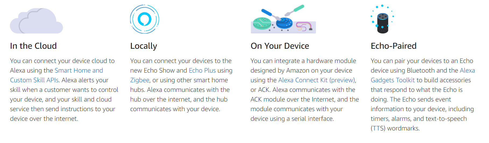

Figure 1.0 Options connecting to Alexa

### 1.1.1. In the Cloud

This way is pretty much a traditional way of controlling a smart device. It's through Cloud to Cloud to transmit user's directives. The smart speakers or Alexa is only responsible for interpreting voice messages to code directives, and through Amazon cloud, sending the code directives to the AWS Lambda, where the custom skills are held. Then, the AWS Lambda communicates with the developer's cloud to assign the specific commands, and finally, the end devices will receive the commands through the internet using Wi-Fi or cable connection. For every directive, the developer can choose an either synchronous or asynchronous way to respond to Alexa whether the directives were received or not, and Alexa gives feedback to the user accordingly. This mode is implemented through Amazon Smart Home Skill API, which provides the interfaces for describing the device attributes and their supported directives. Customer can also through Alexa phone application to check the status of their devices and give directives.

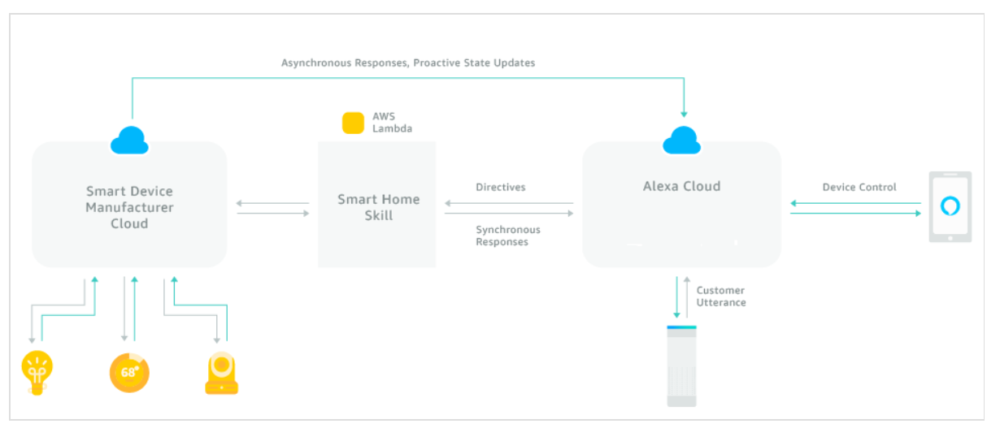

Figure 1.1: The Directives Flow Between Clouds

The very detailed process about how the directives are transmitted can be found [here](https://developer.amazon.com/docs/smarthome/understand-the-smart-home-skill-api.html).

### 1.1.2. Locally

Two ways to connect Zigbee-based device to Alexa.

1.  Connecting the Zigbee-based smart devices to Alexa using the Zigbee hub built-in to the new Echo Show and Echo Plus
2.  Through other Zigbee Certified hubs such as those from SmartThings and Wink

Amazon also provides a badge called** Works with Alexa** to certify the products that will be selling in the market. To obtain the badge, the developer must follow all[ program guidelines. ](https://developer.amazon.com/support/legal/wwa-program-guidelines)

### 1.1.3. On Your Device

Amazon provides a hardware module that can be integrated into the device. This module may have multiple functions, such as communicating with Amazon Cloud. It plays a role as a middle man, communicating with the device through serial communication and communicating with Alexa Cloud over the internet. Under this way, the product is joined the Alexa ecosystem. This way needs company level cooperations.

### 1.1.4. Echo-paired(Bluetooth)

Developers can make their own smart devices using bluetooth connections to connect with Amazon Echo, and Amazon Echo could communicates with Alexa Cloud. This process is implemented through [Alexa Godget Toolkit.](https://developer.amazon.com/alexa/alexa-gadgets)

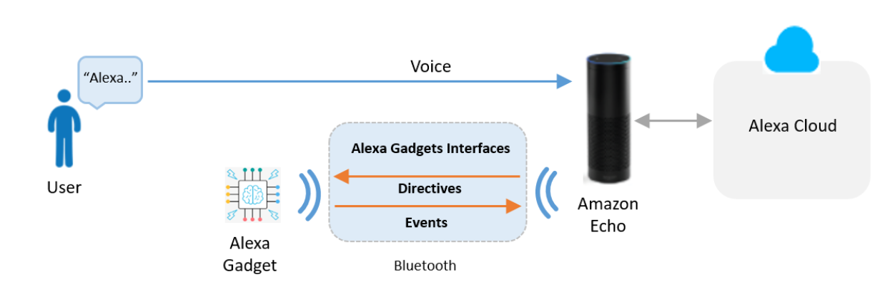

Figure 1.2 Directives Flow between Gadgets and Alexa server

Except for these four ways connecting devices to Amazon Alexa, Amazon also provides Alexa Voice Service (AVS) which allows developing product with built-in Alexa. Customers can talk to these products directly with the wake word "Alexa," and receive voice responses and content instantly. Alexa built-in products work with Alexa skills and Alexa-compatible smart home devices, bringing familiar capabilities from the Amazon Echo family of devices to a range of new form factors and use cases developed by leading brands.

More details [here.](https://developer.amazon.com/alexa-voice-service)

## 1.2. Alexa Voice Service (AVS) and Alexa Built-in Devices

Alexa Voice Service (AVS) is Amazon's suite of services built around its voice-controlled AI assistant for the home and other environments, and Alexa built-in is a category of devices created with the Alexa Voice Service (AVS) that have a microphone and speaker. The Alexa Voice Service enables user to access cloud-based Alexa capabilities with the support of AVS APIs, hardware kits, software tools, and documentation. Many smart device manufacturers through AVS to join the Alexa ecosystem, providing services to their customers. 

Amazon provides an AVS Device SDK which has the software interface using C++ based libraries to developers to leverage Amazon AVS APIs. Also, Amazon now has many AVS hardware development kits which can be used to simplify the development process and accelerate the developing speed.

A typical system designed for AVS requires a microphone and speaker with three processing blocks: an audio front end (AFE) to clean up the input speech, a wake word engine (WWE) to recognize the voice command for "Alexa," and an AVS client to send utterances to and receive directives from the cloud. Now there are new SoC solutions that achieve these three processing block functions on a Single-Chip. The first single-chip SoC solutions qualified by Amazon are development kits from Qualcomm, Amlogic, and Allwinner:

*   [Qualcomm's Smart Audio 6-Mic Development Kit for Amazon AVS](https://developer.amazon.com/alexa-voice-service/dev-kits/qualcomm-6-mic) is based on the Qualcomm&reg; Smart Audio platform. It supports the development of Alexa-enabled table-top smart home devices and premium smart speakers. The kit includes Qualcomm&rsquo;s Snapdragon&trade; application processor and system software; Fluence IoT technology for beamforming, echo cancellation, noise suppression, barge-in support, and far-field voice capture in high-noise environments; integrated audio decoding and post-processing algorithms to support premium sound quality; WWE tuned to "Alexa"; and AllPlay&trade; multi-room networking capabilities.
*   [Amlogic's A113X1 Far-Field Development Kit for Amazon AVS](https://developer.amazon.com/alexa-voice-service/dev-kits/amlogic-6-mic) is designed for commercial developers integrating Alexa into smart speakers, smart home hubs, and other devices. The development kit comes with a board that is configurable for 2-mic linear, 4-mic triangular, and 6-mic circular arrays, making it a flexible solution for a range of hands-free and far-field applications. The SoC supports advanced algorithms for echo cancellation, beamforming, noise reduction, as well as audio post-processing effects. The A113X SoC boasts high performance with low power consumption, enabling application headroom for cost-sensitive OEM designs with option for battery-powered applications.
*   [Allwinner's SoC-Only 3-Mic Far-Field Development Kit for Amazon AVS](https://developer.amazon.com/alexa-voice-service/dev-kits/allwinner-3-mic) is designed for OEMs and ODMs integrating Alexa into devices including smart speakers, table-top smart home devices with displays, home appliances, and robotic gadgets. The development kit offers far-field performance with a 3-mic array, and uses a single quad-core SoC architecture that does not require an external DSP &ndash; the combination of which delivers a compelling and cost-effective solution for integrating Alexa into finished products. The SoC supports advanced algorithms for audio echo cancellation, beamforming, and noise reduction, and provides application headroom for OEM designs with option for battery-operated designs.

More details about AVS Development Kits is [here](https://developer.amazon.com/alexa-voice-service/dev-kits/).

## 1.3. Alexa Ecosystem Skills

Alexa provides multiple APIs for developers to build different types of skills. Developer can develop custom skills through either **AWS Lambda function** or **web service.**

### 1.3.1. Lambda function

a service that lets you run code in the cloud without managing servers. Alexa sends your code user requests and your code can inspect the request, take any necessary actions (such as looking up information online) and then send back a response. You can write Lambda functions in Node.js, Java, Python, C#, or Go.

Figure 1.3 How Lambda works

To develop skills controlling smart home devices such as lights, thermostats, and entertainment devices, developers can use the[ Smart Home Skill API.](https://developer.amazon.com/docs/smarthome/understand-the-smart-home-skill-api.html)

*   Providing code to handle directives in an AWS Lambda function.
*   The skill receives requests in the form of device directives to control a particular device. The code then handles the request appropriately (for example, by turning on the requested light or turning up the volume).
*   All voice interactions with the user are handled by the Smart Home Skill API so developers don't need to define the words users say to use the skill.

Another way to develop the skills is through web service, here is the brief process.

1.  Build web server through any other cloud hosting provider, for example, we can use Alibaba cloud to build a server or just use the cloud to connect Amazon Alexa
2.  The web service must accept requests over HTTPS.
3.  Alexa sends requests to the web service and the service takes any necessary actions and sends back a response.
4.  Can write the web service in any language.

Details please reference Figure 1.1 and documents [here](https://developer.amazon.com/docs/smarthome/understand-the-smart-home-skill-api.html).

### 1.3.2. Alexa Skills Account Linking

Some skills need the information from other systems, for example, a music playing skill may need user's music website account information so that the Alexa could able to aquire that specific user's playlists on the music website. Account linking enables connecting the identity of the user with a user account in a different system.

Alexa skills have six models that support account linking:

1.  Custom model
2.  Smart home pre-built model
3.  Video pre-built model
4.  Music pre-built model
5.  Baby activity pre-built model
6.  Meetings pre-built model
7.  Detailed explanations [here](https://developer.amazon.com/docs/account-linking/understand-account-linking.html#account-linking-and-the-skill-model)

### 1.3.3. Two types of grants

#### 1.3.3.1. Authorization Code Grants---Full Access Grant Typ

A grant type for requesting the end user's authorization to access their information in another system. In the authorization code grant, the authorization server returns a code once the user logs in. Alexa then uses this code to request an access token / refresh token pair from the server, using the access token endpoint (URI). The refresh token can then be used to request a new access token after the old token expires.

#### 1.3.3.2. Implicit Grant--Limited Access Grant Type:

A grant type for requesting the end user's authorization to access their information in another system. In implicit grant, the authorization server returns the access token once the user logs in. This grant type is limited compared to authorization code grant.

Alexa uses OAuth 2.0 to technology to empower the Account Linking:

1.  [OAuth 2.0 details](https://developer.amazon.com/docs/account-linking/understand-account-linking.html#who-owns)
2.  [Steps to Implement Account Linking](https://developer.amazon.com/docs/account-linking/understand-account-linking.html#steps-to-implement)

The corresponding authorization used for different models:

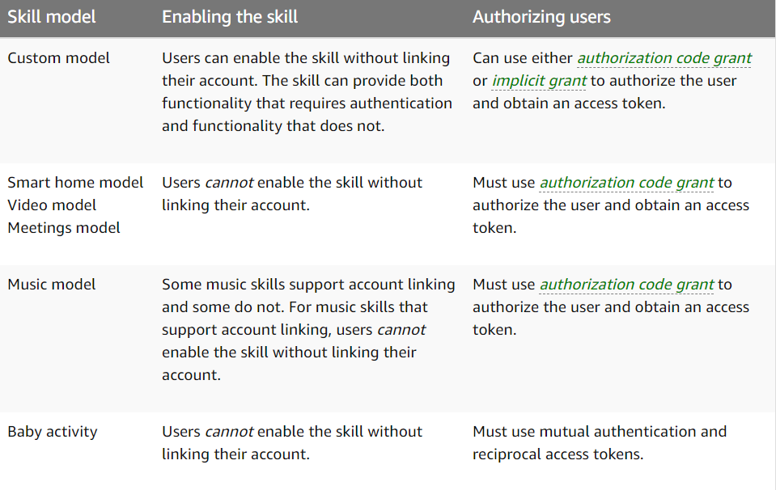

Figure 1.4 Corresponding Authorizations for Different Models

Up to now, Amazon has presented many echo smart speaker products. They have been gradually establishing a very complete ecosystem that involves other smart home devices such as smart Locks, smart doorbells, and smart outlets. Below are echo product specs lists.

## 1.4. Learning Amazon Alexa

### 1.4.1. Video Courses and Tutorials

Alexa has very systemic learning courses. From bottom to up, developers can learn how to develop their own voice controlled devices quickly. Now, Amazon has cooperations with many learning platforms such as Codecademy, Markers Academy, and Udacity, etc. However, each platform only provides one aspect of training. The costs for taking a course on these online platforms are different, and they also offer different level courses to developers.

  

Figure 1.5 Training courses providing platforms

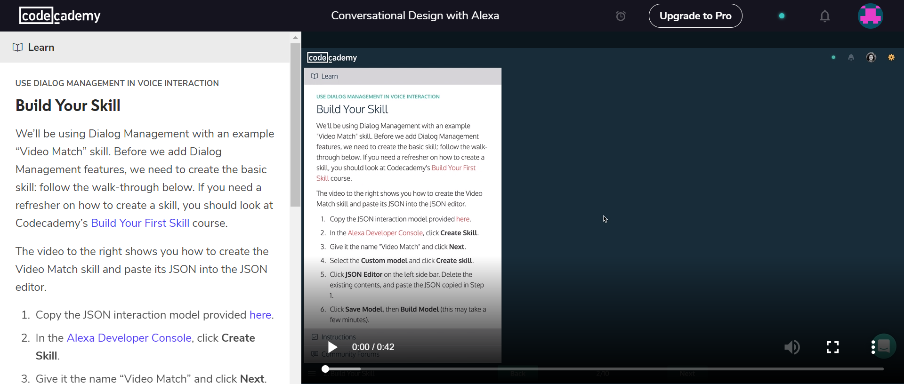

Figure 1.6 CodeCademy course interface

Course platform links are [here](https://developer.amazon.com/alexa-skills-kit/alexa-skills-developer-training#Beginner).

Amazon also provides a quick start system, which enables developers to build a skill in 6 steps. I tried this system and found it's really pretty simple to use. 

Figure 1.7 Quick start page

Figure 1.8 Alexa developer console

### 1.4.2. Documentation System

The text documentation system for developing Amazon Alexa is also very complete. Amazon classify the developers into two different groups &ndash; Skill Builders and Device Makers. Device Makes are also divided into Built-in Device Builders and Connected Device Builders. Each group has a very complete developing routine, learn &mdash; design &mdash; build &mdash; lanuch. 

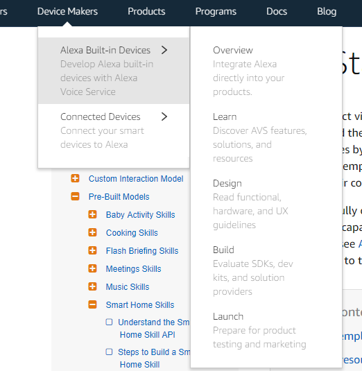   

Figure 1.9 Developing Routine for a Built-in Device Maker

And the technical documentations are also very easy to read and use. To visit full documentation system please see [here](https://developer.amazon.com/docs/smarthome/get-started-with-device-templates.html).

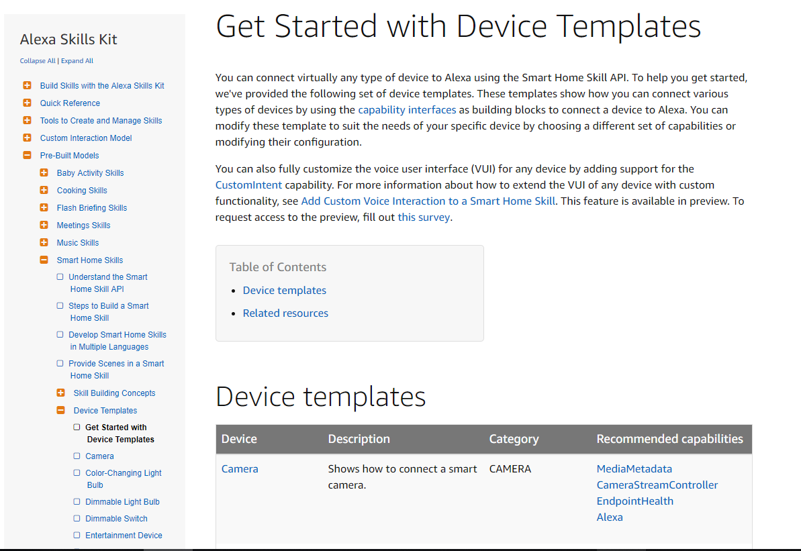  

Figure 2.0 Technical Documentations

### 1.4.3. Alexa SDKs

Amazon provides multiple SDKs to developers to develop Alexa related projects. Because there are many SDKs to serve different development purposes, I just list them here to be a reference.

For Built-in Device Makers:

*   [Alexa Skills Kit SDKs](https://developer.amazon.com/docs/sdk/alexa-skills-kit-sdks.html) &ndash; A list of SDKs that you can use to build skills for Alexa.
*   [Smart Home Skill Kit API Documentation ](https://developer.amazon.com/docs/smarthome/smart-home-skill-api-message-reference.html)&mdash; Find detailed information about authentication, messaging, directives and other aspects of the Smart Home Skill Kit API.

For Built-in Device Makers:

*   [AVS Device SDK ](https://developer.amazon.com/alexa-voice-service/sdk)--- AVS provides programming interfaces, or APIs, that enable you to access our cloud-based voice service from your connected devices.
*   [Alexa Smart Screen and TV Device SDK](https://developer.amazon.com/alexa-voice-service/alexa-smart-screen-sdk) &mdash; The Alexa Voice Service enables device makers to build screen-based products that complement Alexa voice responses with rich visuals.
*   [Alexa Auto SDK ](https://developer.amazon.com/alexa-voice-service/alexa-auto-sdk)---The Alexa Auto SDK brings the Alexa experience that has delighted customers at home into the vehicle. It adds automotive-specific functionality and contextualizes the experience for the vehicle.

# 2. Google Smart Home

All smart home devices that supported Google Smart Home can be controlled through phone application or Google Assistant. Just like Amazon Alexa, Google Assistant is another artificial intelligent voice assistant powered by Google. 

## 2.1. Google Smart Home Execute Paths

Google Smart Home doesn't have too many ways of developing smart home devices. Currently, the only way is to connect Google Assistant to developer cloud. Google Assistant is supported on many devices, including Google smart speakers, wearables, Android Phones, and TVs. The message flow path is shown in Figure 1.5. Users give voice commands to Google Assistant via phone application or Google smart speakers. Google Assistant will handle all audio signal process and give the execute requests to the developer cloud, where the specific services are defined and conducted.

**
**

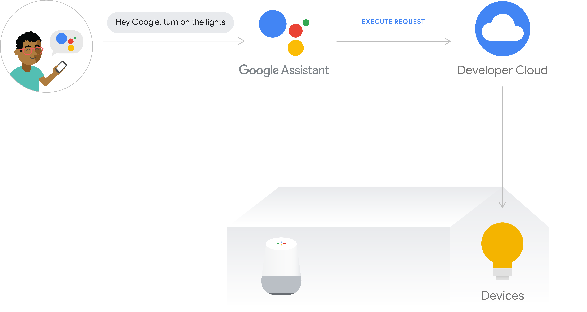  

 
Figure 2.1 Google Cloud Excute Flow Path

Google now is planning to launch a new mode called local execute path through its Local Home SDK. The execute flow path is shown in Figure 1.6. Under this mode, the smart speaker is able to control smart home devices locally, which means the user intent is executed over local area network(LAN), and the developer cloud serves as a fallback path when the local path failed. However, this path mode is still under constructing, and the Local Home SDK hasn't been released.

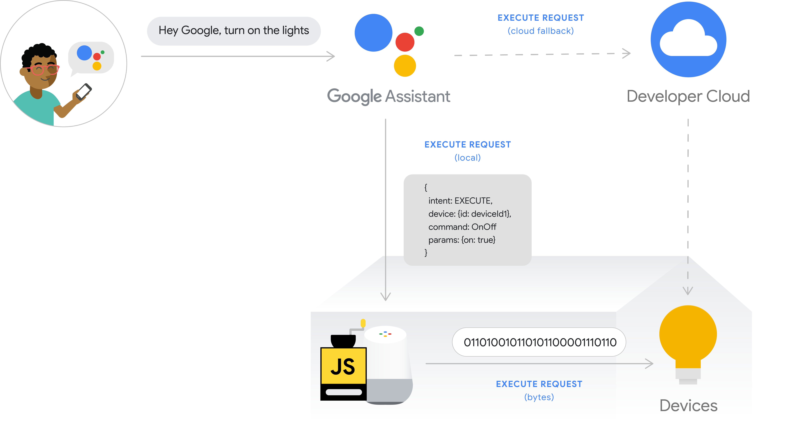  

Figure 2.2 Local Excute Path

## 2.2. Develop Google Smart Home Automations

Google Smart Home is a platform which enables developers to use Google Assistant to control smart home devices. There are several concepts defined by Google used in developing Smart Home Devices.

**Home Graph:** A database that stores and provides contextual data about the home and its devices.
**Device types:** Let the Google Assistant know what grammar should be used with your device. 
**Device traits:** Device traits define the capabilities of a device type. 
**Smart home intent:** Simple messaging objects that describe how to perform a smart home Action such as turn on a light or cast audio to a speaker.
**Fulfillment :** A service that handles a smart home intent and carries out the corresponding Action. 
**Authentication:** Links your users' Google accounts with user accounts in your authentication system.

What is worth to mention is that the concept Home Graph. Before connecting every device to Google Home, the user needs first create a Home Graph which is a database storing the logic information of the user's home. This enables the user to have a natural conversation with Google Assistant, for example, the user doesn't need to point out which door he wants to open explicitly, he just need to give a command "open the door", and the Google Assistant will open the closest smart lock to the user.

Google Smart Home also uses OAuth 2.0 to do the authentication between Google Assistant and user account.

Here is [the link ](https://developers.google.com/actions/smarthome/concepts/homegraph)of detailed explanations for each concept.

Also, Google has defined its own standard for developing the smart home device. The smart home Action, which is called Skills in Alexa, is the bridge between the user's directives and the implementation by the developer cloud and devices. To create a smart home Action, the developer must set up an Aaoth 2.0 server first, then using Action console to create a Smart Home Action. It is the same process with In the Cloud way mentioned in Alexa part. 

These are the specific steps to [create a Google Smart Home Action](https://developers.google.com/actions/smarthome/develop/):

*   [Create a smart home Action](https://developers.google.com/actions/smarthome/develop/create)
*   [Process smart home intents](https://developers.google.com/actions/smarthome/develop/process-intents)
*   [Implement Request Sync](https://developers.google.com/actions/smarthome/develop/request-sync)
*   [Implement Report State](https://developers.google.com/actions/smarthome/develop/report-state)
*   [Test and submit your Action](https://developers.google.com/actions/smarthome/develop/testing-submitting)

Once the developer have created a smart home Action and provided fulfillment, the fulfillment must process the smart home intents and return responses. The user can use any programming language as long as it adhere to the request and response formats. The fulfillment should minimize latency between the Assistant and your cloud API.

An REQUEST example is [here](https://developers.google.com/actions/smarthome/develop/process-intents#request):

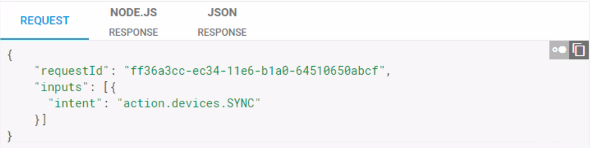

Figure 2.3 An REQUEST example

  

Figure 2.4 Google Action Console

  

Because Google Smart Home currently only support Cloud Execute Flow Path, and Google Home only has Wi-Fi and Bluetooth connectivities, therefore, the smart devices that support Google Smart Home must support either Wi-Fi or Bluetooth. Most smart device manufacturers have their own phone applications, and the user needs to set up the smart devices first on the application of the device manufacturers, then they can be added to Google Home. To verify if all Google Home products are not supporting Zigbee or Z-wave, I inquired their technical support and got the answer that currently they are not.

Figure 2.5 Google Home Doesn't Support Zigbee and Z-wave

## 2.3. Documentations

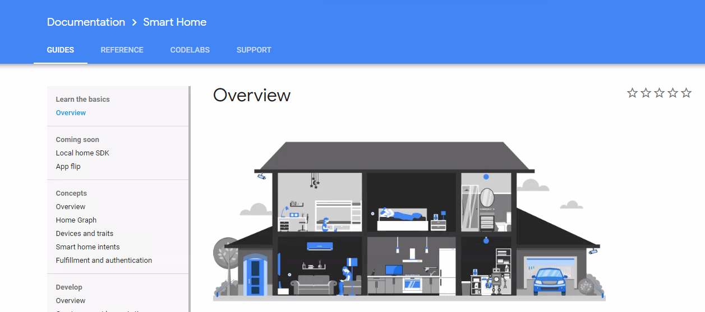

Figure 2.6 Google Smart Home Documentation System

Google's documentation system has four part:

*    [Guides](https://developers.google.com/actions/smarthome/)
*    [Reference](https://developers.google.com/actions/smarthome/traits/)
*    [Codelabs ](https://developers.google.com/actions/smarthome/codelabs/)
*    [Support System](https://developers.google.com/actions/smarthome/support)

### 2.3.1. Guides

Guides section provides the basic concepts and knowledge needed to develop Smart Home devices Actions. It also has some samples and libraries, which give the quick start experiences for beginners. All examples and libraries are stored in GitHub, and developers need to read those documents to realize the examples. I tried to achieve one of the examples, however, it turns out this implementation process is not easy. In my estimation, it would spend about two to three hours to finish.

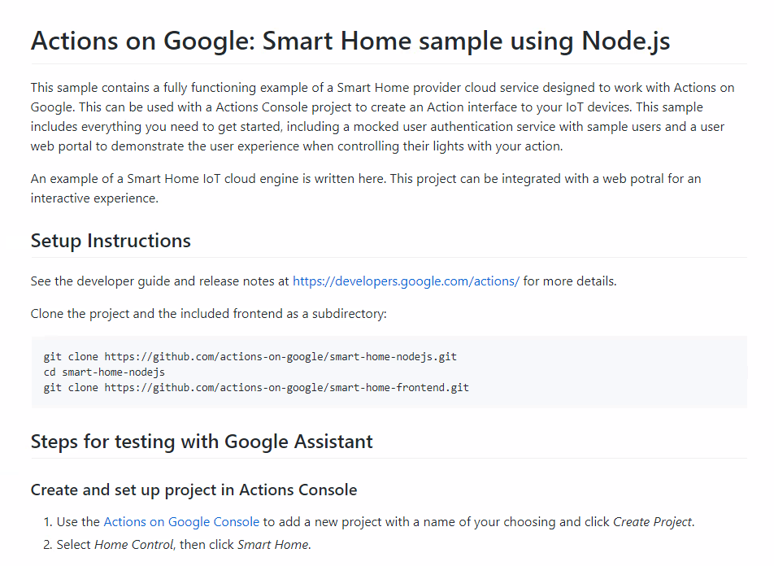

Figure 2.7 One Sample Example for Beginners

### 2.3.2. Reference

Reference section provides the definitions of Devices Traits and Device Types. It is pretty easy to use and to find what is the needed attribute. Also, every Device Trait contains a piece sample codes in different programming languages.

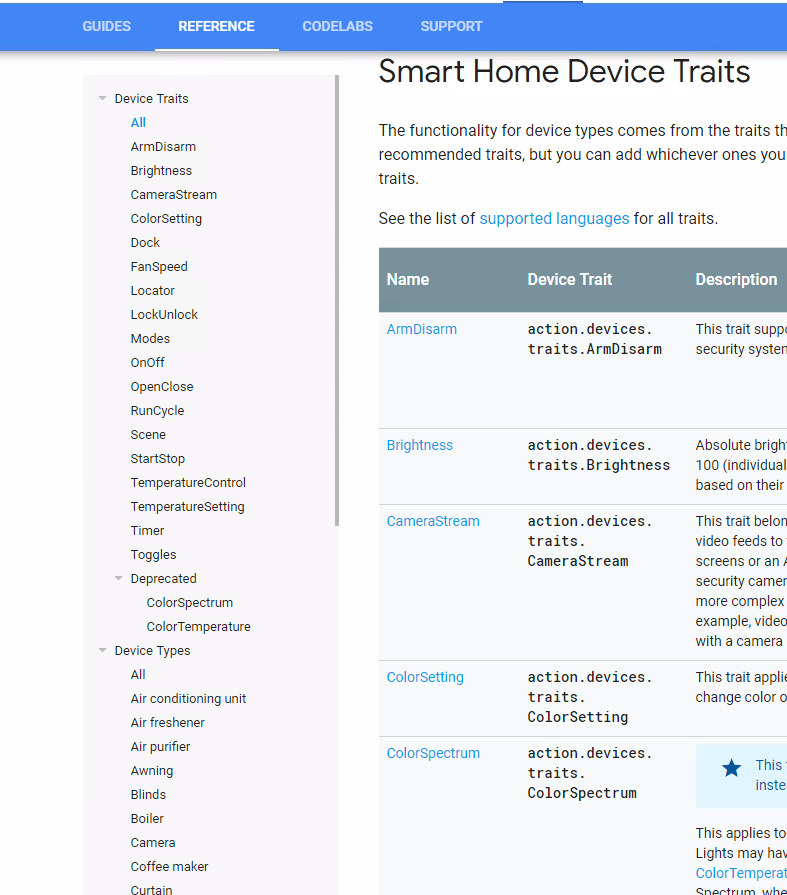

Figure 2.8 Reference

### 2.3.3. Codelabs

[Codelabs section provides a step by step hands-on experience for building a smart home Action.](https://developers.google.com/actions/smarthome/codelabs/)

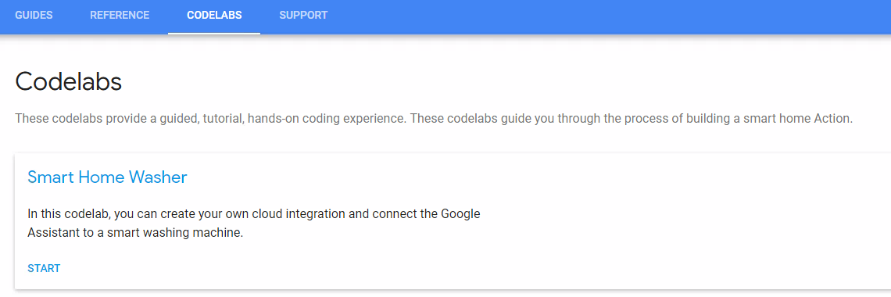
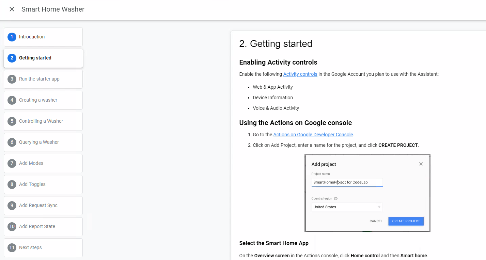

Figure 2.9 Codelabs Step by Step Hands-on Interface

### 2.3.4. Support System

No matter what kinds of support, the developers need first gives a brief introduction. The follow-up time is **10 business days.**

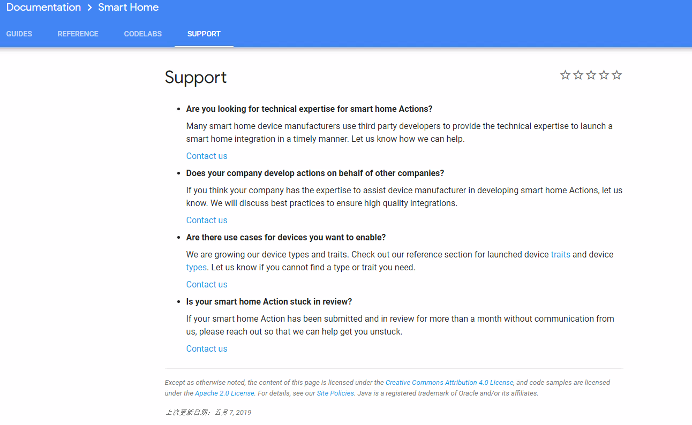

Figure 3.0 Support Interface

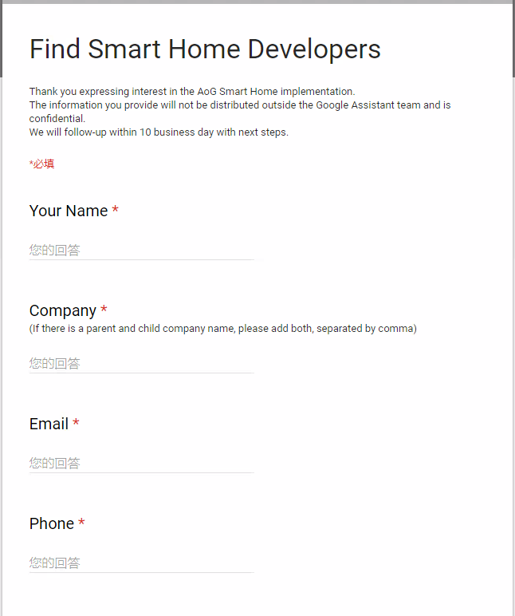

Figure 3.1 Table Need to Fill Out to Get Technical Support

### 2.3.5. Actions SDK

Serval steps need to be done to build an Action.

*   [Create an Actions Project on Action Console](https://developers.google.com/actions/sdk/create-a-project)
*   [Create Actions in an Action package by mapping an intent to fulfillment](https://developers.google.com/actions/sdk/create-a-project)
*   [Build and deploy fulfillment](https://developers.google.com/actions/sdk/fulfillment)
*   [Submit project for approval and make it abailable to users](https://developers.google.com/actions/sdk/submit)

Developers can build an Action through steps mentioned above, check [here](https://developers.google.com/actions/sdk/) for details of Actions SDK.

# 3. Siri, HomePod and HomeKit

Like Alexa of Amazon, Google Assistant of Google, Siri is an AI voice assistant can handle user's voice directives. Apple presented HomeKit in 2014, sooner than Google and Amazon. However, it is a closed-loop system, and accordingly, the ecosystem is also closed, which means that Apple itself or its contract-partnered company produces all products existed in their ecosystem.

On June 5, 2017, Apple announced its second smart speaker, HomePod. However, it receives mixed reviews. Its lack of support for third-party services and platforms was criticized, but it's also praised by excellent sound effects. It doesn't support many applications like Amazon Echo or Google Home, which allows the user to add new Skills or Actions to control smart home devices with their voice assistants, HomePod only works for Apple products, and it can only execute the skills or actions defined by Apple.

To develop a smart home device application, the developer must use Xcode on a macOS system. Also, Apple is very restrictive in allowing third-party integrations with Siri. If the device manufacturers are interested in developing or manufacturing a HomeKit accessory, they must enroll in the Apple MFi program. To access technical specifications, for example, the HomeKit technology, a license must be acquired to get the corresponding technical support and necessary hardware component which can connect to Apple products.

There are two license types; The Development License is needed to acquire technical specifications for those companies wants to develop a device only, and the Manufacturing License is for Manufacturer to make MFi accessories.

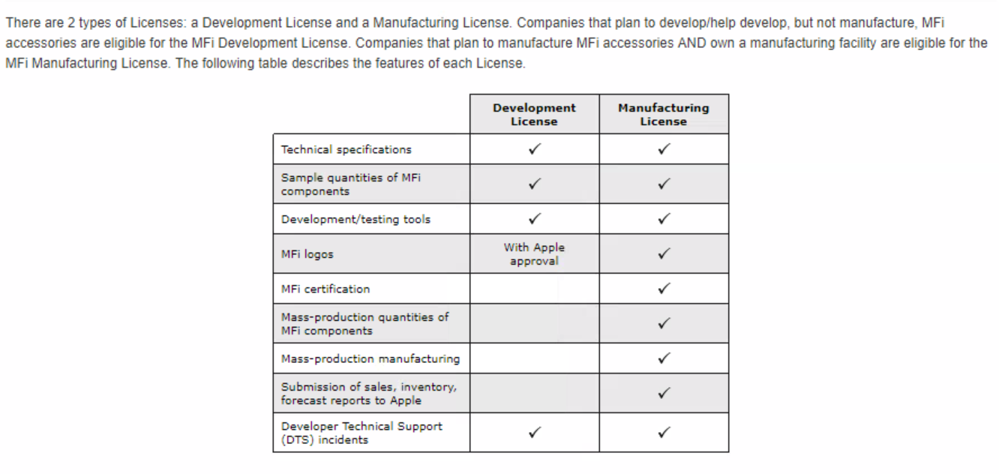

Figure 3.1 is the specific access details for each license

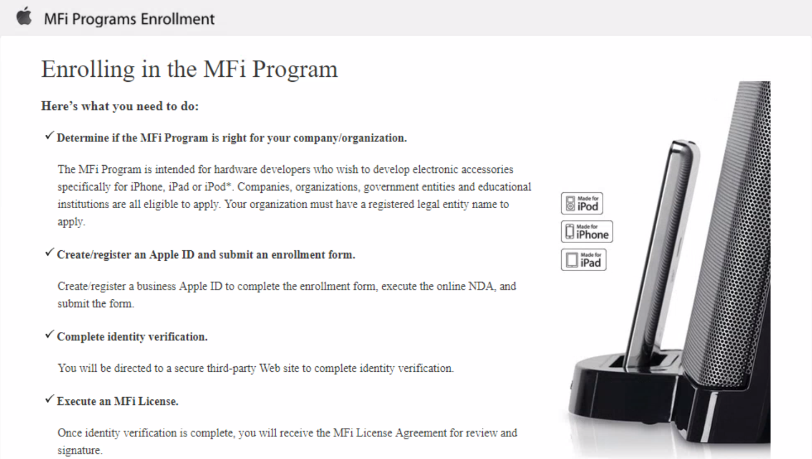

Figure 3.3 Enrolling MFi Program

Apple also listed the MFi licensed technologies:

*   Technologies
*   AirPlay audio
*   CarPlay
*   GymKit
*   HomeKit
*   iPod Accessory Protocol (iAP), the protocol used to communicate with iPhone, iPad and iPod
*   MFi Game Controller
*   MFi Hearing Aid
*   Wi-Fi Accessory Configuration (WAC)

Connectors and components

*   Authentication coprocessors
*   Headset Remote and Mic
*   Audio Module
*   Lightning Analog Headset Module
*   Lightning to Headset Jack Adapter Module
*   Lightning connectors and receptables
*   Magnetic Charging Module
*   Smart Connector

For personal developers who want to make smart devices, the developers don't need to apply for licenses. Apple gives a recommendation is to use third-party hobbyist solutions that can enable the developer to connect their device to iOS devices serially, and there is no license requirement on using BLE technology to develop personal devices. However, in this way, the developer won't be able to utilize resources of HomeKit or anything that in Apple HomeKit ecosystem. Also, only after the acquisition of at least one license, the developer could get technical support.
