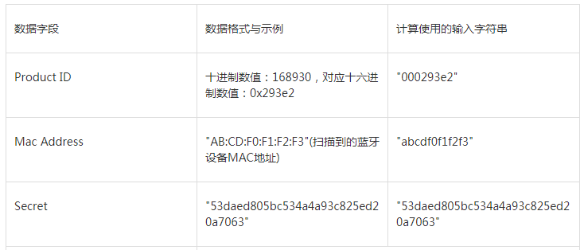
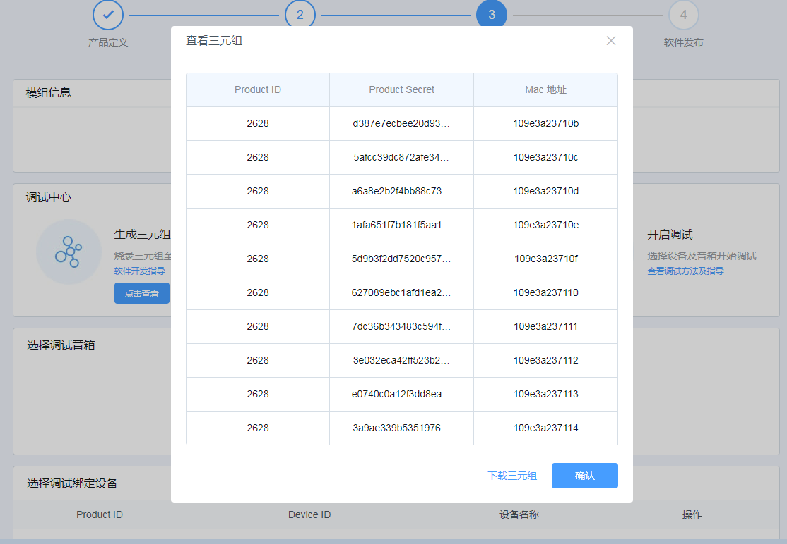
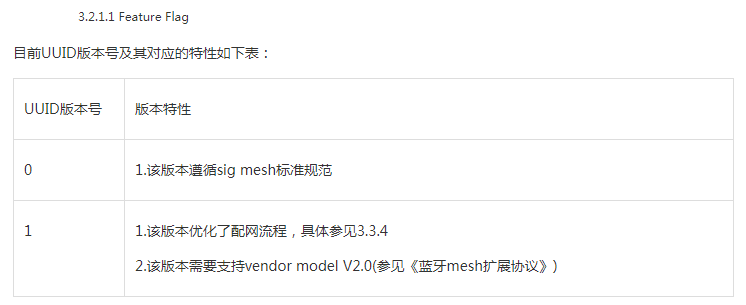
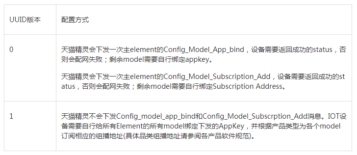
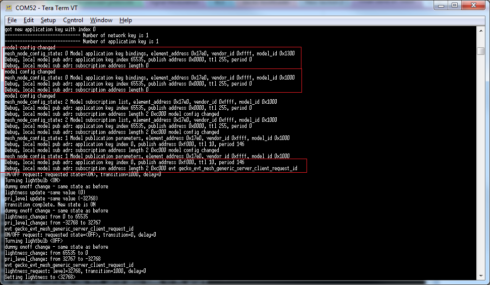
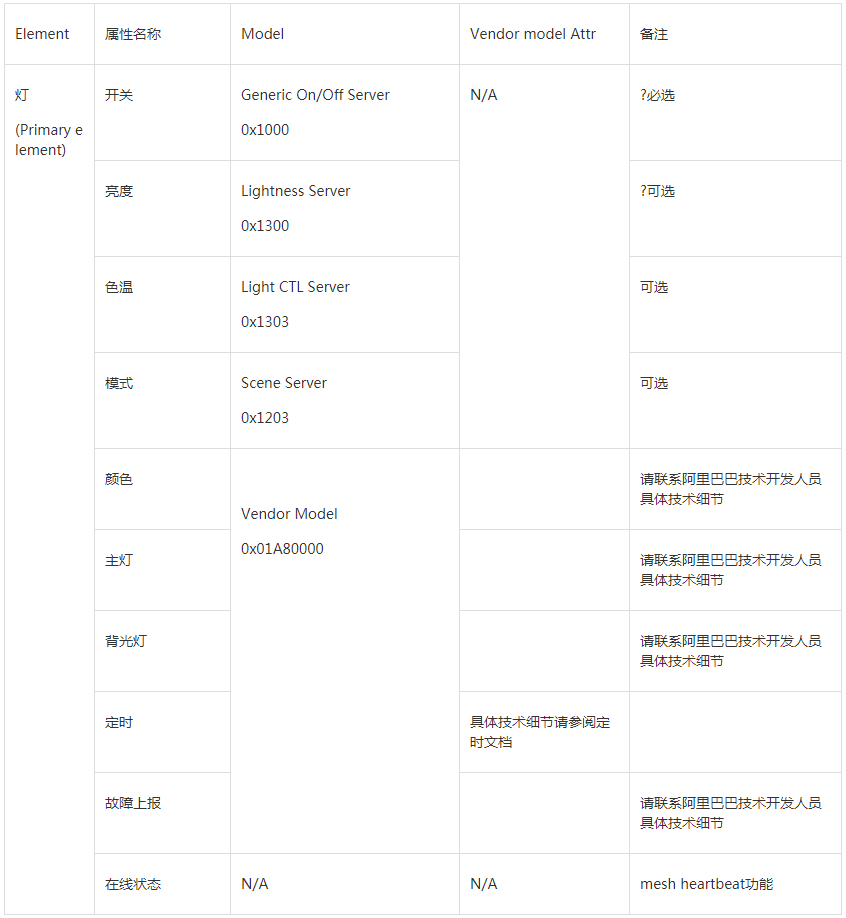
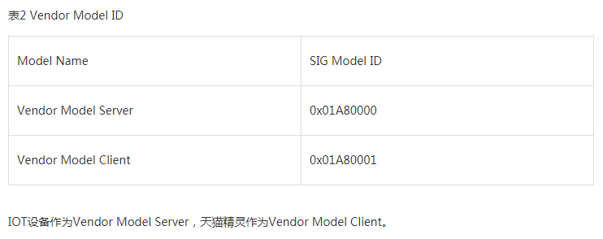
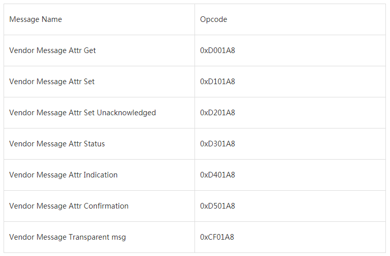
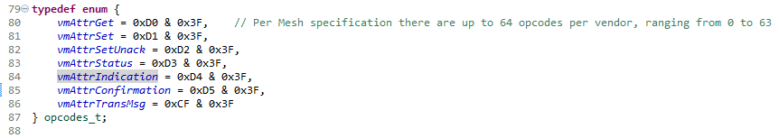

   

Table of Contents 

<!-- TOC -->

- [1. Background](#1-background)
    - [1.1. Before Implementation](#11-before-implementation)
    - [1.2. Two different provisioning method of Tmall Genie](#12-two-different-provisioning-method-of-tmall-genie)
    - [1.3. Bind models to an Appkey locally](#13-bind-models-to-an-appkey-locally)
    - [1.4. Add local model's subscribe address](#14-add-local-models-subscribe-address)
    - [1.5. Set local model's publication address](#15-set-local-models-publication-address)
    - [1.6. Send version information to Tmall Genie with Vendor Model](#16-send-version-information-to-tmall-genie-with-vendor-model)
- [2. Example](#2-example)

<!-- /TOC -->

   

# 1. Background

Several customers raised questions in Salesforce system since Alibaba added another new method to provision Bluetooth Mesh devices. Here is the updated solution demonstration.

The Tmall Genie is a smart speaker developed by Chinese e-commerce company Alibaba Group, using the intelligent personal assistant service AliGenie. Tmall Genie supports Bluetooth mesh, and it acts as a provisioner in the Bluetooth mesh network. The article guide how to add EFR32 based Bluetooth Mesh device to Tmall Genie mesh network.

Please read the spec below from Ali to get more information about the process.
[https://doc-bot.tmall.com/docs/doc.htm?spm=0.7629140.0.0.6ad717808u3Ntk&amp;treeId=578&amp;articleId=109585&amp;docType=1](https://doc-bot.tmall.com/docs/doc.htm?spm=0.7629140.0.0.6ad717808u3Ntk&amp;treeId=578&amp;articleId=109585&amp;docType=1)  

*** 

## 1.1. Before Implementation

As a pre-condition for adding your Bluetooth mesh device into Tmall Genie ecosystem, you need to apply for the "ProductID", "Mac Address" and "Secret" from Ali.

[https://iot.aligenie.com/home](https://iot.aligenie.com/home)

And then generate the OOB with the formula below. Please note that all of the character for generating the SHA256 should be lower-case.

_AuthValue = SHA256(Product ID,MAC,Secret)_

Below is the "Product ID" "Mac address" and "Secret" that applied from Ali. Take the first group as an example, convert the decimal "Product ID" value to 4 byte HEX value, and generate the OOB with the sequence below.

_00000a44,109e3a23710b,d387e7ecbee20d930055fb53f6a96c2a_

[http://www.convertstring.com/Hash/SHA256](http://www.convertstring.com/Hash/SHA256)

Use the first 16 bytes of the SHA256 result as static out-of-band authentication data.

_CA99038C2BA3CC2FFF5D24B7E2D134419C6B2F380B268AB3501AB6096A1CF089
_

## 1.2. Two different provisioning method of Tmall Genie

At present, Tmall Genie support two kinds of provisioning, it provision the mesh device with different process depends on the UUID version information of the mesh device.

Set the "Feature Flag" as 0, the Tmall Genie will provision the mesh device follow the steps defined in mesh profile specification. And if set the "Feature Flag" as 1, the Tmall Genie will provision the mesh device follow the Tmall Genie extended mesh specification, the vendor model will be involved during the provisioning process.

According to the debug information below, when set the "Feature Flag" as 0, Tmall Genie will bind the Appkey to few models of the node, and then configure the Pub/Sub group address for some model in the first element of the node. The subscribe address is 0xC000 for light node, and publish address is 0xF000 by default.

However, If set the "Feature Flag" as 1, Tmall Genie will not bind the Appkey to models, and will also not configure the Pub/Sub group address for all model. User need to finish it by themselves.  Bind a model to an Appkey locally by using the API "gecko_cmd_mesh_test_bind_local_model_app", set local model's publication address with the API "cmd_mesh_test_set_local_model_pub", add an address to a local model's subscription list with the API "cmd_mesh_test_add_local_model_sub".

## 1.3. Bind models to an Appkey locally

## 1.4. Add local model's subscribe address

## 1.5. Set local model's publication address

According to the Tmall Genie mesh spec, all of the models below in the lighting node should bind to the Appkey, and sub/pub to the group address 0xC000, 0xCFFF.

And also vendor model is necessary for the lighting node in Tmall Genie ecosystem. And the vendor model ID is 0x01A80000.

[https://doc-bot.tmall.com/docs/doc.htm?spm=0.7386797.0.0.9df21780jsYGUR&amp;source=search&amp;treeId=578&amp;articleId=109015&amp;docType=1](https://doc-bot.tmall.com/docs/doc.htm?spm=0.7386797.0.0.9df21780jsYGUR&amp;source=search&amp;treeId=578&amp;articleId=109015&amp;docType=1)

## 1.6. Send version information to Tmall Genie with Vendor Model

According to the Tmall Genie mesh spec, after finishing the model's configuration (bind, sub, pub), the mesh node should send the version information to Tmall Genie with no more than 50 times until receive the confirmation from Tmall Genie.

Read the spec below for how to send the version information to the Tmall Genie. The vendor ID is 0x01A8, and server model ID is 0x0000.

The IoT mesh node is vendor Server, and the Tmall Genie is the vendor Client.

[https://doc-bot.tmall.com/docs/doc.htm?spm=0.7386797.0.0.9df21780jsYGUR&amp;source=search&amp;treeId=578&amp;articleId=109049&amp;docType=1](https://doc-bot.tmall.com/docs/doc.htm?spm=0.7386797.0.0.9df21780jsYGUR&amp;source=search&amp;treeId=578&amp;articleId=109049&amp;docType=1)

Ali has defined all of the OPCODE for the vendor mode, please see the table below. The 3 bytes OPCODE consist of vendor ID (0x01A8) and OPCode with range 0 to 63. 

# 2. Example

Please refer to the enclosed [example project](files/CM-Smart-Speaker/soc-btmesh-light_tmall.sls) that support these two kinds of provisioning. Please comment the macro "Ali_EXTENDED_MESH" in app.h to enable different modes.
