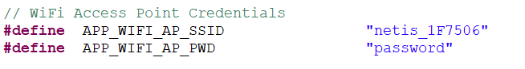
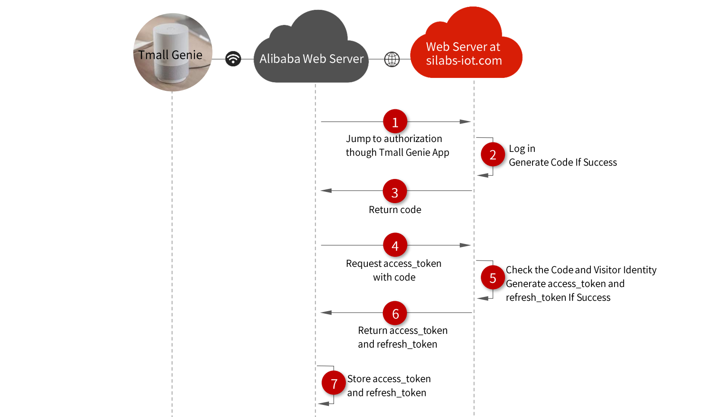

   

Table of Contents 

<!-- TOC -->

- [Background](#background)
- [1. Introduction](#1-introduction)
- [2. Preparation](#2-preparation)
    - [2.1 Device Connection](#21-device-connection)
    - [2.2 Firmware](#22-firmware)
    - [2.3 Bind the device with your account](#23-bind-the-device-with-your-account)
- [3. Control device by Browser](#3-control-device-by-browser)
- [4. Control device by Tmall Genie smart speaker](#4-control-device-by-tmall-genie-smart-speaker)
- [5. Web Server](#5-web-server)
    - [5.1 Processes of Control by Tmall Genie](#51-processes-of-control-by-tmall-genie)
    - [5.2 Authorization between  Alibaba and silabs-iot](#52-authorization-betweennbsp-alibaba-and-silabs-iot)
    - [5.3 Communication between device and silabs-iot](#53-communication-between-device-and-silabs-iot)

<!-- /TOC -->

  

# Background

People used to regard mobile phones, TVs or routers as the control centers of smart homes until the emergence of smart speakers. It should be that you control your smart devices just by saying a sentence such as "Open the light of living room", rather than by clicking on the phone screen. Now, there are so many smart speakers in market for controlling the smart device, two of the most famous are Google Home from Google and Echo from Amazon. In China, the most famous smart speaker are XiaoAi from XiaoMi and Tmall Genie from Alibaba. Now, all of these companies have developed IoT platform so that the manufacturer who produce smart homes can connect their smart productions to these smart speakers. This project is intended to introduce how to control a  Silicon Labs Wi-Fi device. with TmallGenie.

# 1. Introduction

People used to regard mobile phones, TVs or routers as the control centers of smart homes until the emergence of smart speakers. It should be that you control your smart devices just by saying a sentence such as "Open the light of living room", rather than by clicking on the phone screen. Now, there are so many smart speakers in market for controlling the smart device, two of the most famous are Google Home from Google and Echo from Amazon. In China, the most famous smart speaker are XiaoAi from XiaoMi and Tmall Genie from Alibaba. Now, all of these companies have developed IoT platform so that the manufacturer who produce smart homes can connect their smart productions to these smart speakers. This project is intended to introduce how to control a Silicon Labs Wi-Fi device.with TmallGenie.

The software architecture of project consists of:

*   Firmware running on EFM32GG11 STK
*   Web server running on cloud.

The hardware consists of :

*   A EFM32GG11 STK
*   A WGM110 Wi-Fi Expansion Kit
*   A Tmall Genie smart speaker.

User can control the LED0 in EFM32GG11 STK through one of two methods below.

*   Speak a command to Tmall Genie smart speaker.
*   Visit [https://www.silabs-iot.com](https://www.silabs-iot.com/) and control it by website.

We assume the whole device combine the EFM32GG11 STK and the WGM110 module is a smart light. The block is illustrated below.

# 2. Preparation

## 2.1 Device Connection

Connect the boards as illustrated in the picture below. Configure the EFM32GG11 STK board switch as AEM and configure the WGM110 Expansion Kit switch as High Power. 

## 2.2 Firmware

Import the firmware to Simplicity Studio, open file "app_wifi_cfg.h", modify the macro APP_WIFI_AP_SSID to your Wi-Fi SSID and modify APP_WIFI_AP_PWD to your Wi-Fi password, as the picture shown below. Then compile it. Program the Hex file to EFM32GG11 Giant Gecko Starter Kit (SLSTK3701A) to make it as a smart light device. The compiled firmware is located directory Bin/, the default Wi-Fi SSID is "netis_1F7506" and the password is "password", if you want to recompile the firmware you can configure your Wi-Fi.

When the firmware is runing for the first time, it needs to report itself to silabs-iot. It will issue a http request to silabs-iot so that web server of silabs-iot will add information of the device to database, then the device can been used by one of users.

## 2.3 Bind the device with your account

You need to bind the device and declare it belongs to you then you can control it. Please follow to the steps below to bind a device.

*   Visit [https://www.silabs-iot.com/signup](https://www.silabs-iot.com/signup) to get an account, you can log in [https://www.silabs-iot.com](https://www.silabs-iot.com/) if you already have an account. 

*   After you sign up or log in, you will enter the MyDevice page, as the picture shown below. 

*   Click icon "+" to add a device, fill the Mac address and device name in the pop-up window, the Mac address can be found in the EFM32GG11 STK LCD screen when you push BTN1(Before that, make sure your devcice have connect Wi-Fi correctly, you can only bind the device which has connected internect and hasn't been binded by other users. For testing, we provide 3 fictitious mac addr: 0123456789, 0123456788 and 0123456787, you can choose one for testing and remeber to unbind it after using). Click "OK" will finish binding. 

# 3. Control device by Browser

After binding your device, you can see it on the MyDevice page. click the device and will pop up a window on which there is a switch, you can turn on/off the LED just by click the switch. 

# 4. Control device by Tmall Genie smart speaker

At first, you need to download a Tmall Genie App into your phone and bind your Tmall Genie following the hint of Tmall Genie App. Please follow to the steps below to bind Silabs-iot with Tmall Genie.

*   Click "我的" ("Mine")
*   Click "添加智能设备" ("Add Smart Device")
*   Find SiliconLabs in device list and click it
*   Click "绑定账号" ("Bind Account")
*   Input the account and password that you get from [silabs-iot.com](http://silabs-iot.com/) and click "LOGIN AND AUTHORIZE".
*   Return to "我的" the device in [silabs-iot.com](http://silabs-iot.com/) will be shown in the window. 

Now, you can control the device just by talking to Tmall Genie, such as "天猫精灵，开灯" ("Tmall Genie, Open Light Please"). The video below demonstrate how to control the device with Tmall Genie by voice.

Note: The Tmall Genie only supports Chinese and it supports turn on/off and query on this case.

# 5. Web Server

The web server of silabs-iot is developed with ThinkPHP5.1, ThinkPHP is a free, open source, fast and simple object-oriented PHP development framework for web application development, visit it from [https://www.kancloud.cn/manual/thinkphp5_1/353946](https://www.kancloud.cn/manual/thinkphp5_1/353946).

## 5.1 Processes of Control by Tmall Genie

The following image illustrates the processes of communication among the web server of user, Tmall Genie, silabs-iot, alibaba web server and device.

*   Alibaba web server needs to obtain limited access to silabs-iot so that it can get device information and control it, get details from section 5.2  Authorization between Alibaba and silabs-iot .
*   Alibaba will issue a http request to silabs-iot to get all device information. The web server of silabs-iot will check the identify of visitor and then return all devices list owned by the user.
*   Alibaba get the deice information and display them in device list of Tmall Genie App.
*   User say a command to Tmall Genie.
*   Tmall genie will upload the voice to Alibaba web server.
*   Alibaba parse the voice.
*   Alibaba issue a new http request to silabs-iot according to the result of voice parsing, for example turn on light. The web server of silabs-iot will update the database after receiving the request from alibaba and return response immediately.
*   The device will poll the state by issue a http request periodic to silabs-iot and update itself. Get details from section 5.3 Communication between device and silabs-iot
*   Alibaba return response to Tmall Genie
*   Tmall Genie plays a voice as a repsonse of user's voice command.

## 5.2 Authorization between  Alibaba and silabs-iot

The authorization protocol between them is based on OAuth2.0. OAuth2.0 is an open protocol to allow secure authorization in a simple and standard method from web, mobile and desktop applications, get more details from  [https://oauth.net/2/](https://oauth.net/2/) . The OAuth2.0 server on this case is based on the library from Brent Shaffer, download it from GitHub:  [https://github.com/bshaffer/oauth2-server-php](https://github.com/bshaffer/oauth2-server-php). The process is divided into the following steps, as the picture shown below.

1.  The Alibaba web server will jump into the Log in page of [silabs-iot.com](http://silabs-iot.com) when you click 3rd-party login in Tmall Genie App.
2.  Input account and password to log in, if success, the web server of silabs-iot will generate a code.
3.  Return the new code to Alibaba web server, the code only used by Alibaba and can only use once.
4.  Alibaba get the code and request an access_token to [silabs-iot.com](http://silabs-iot.com) with it.
5.  The web server of silabs-iot checks the code and identify of visitor, it will generate a access_token and refresh token if success. The access_token is time-sensitive and the time can be configured, it is 2 days in this case. The refresh_token is used to request a new access_token when the access_token is expired.
6.  Alibaba web server will store the access_token and refresh_token. Now, it can access silabs-iot with access_token.

## 5.3 Communication between device and silabs-iot

The communication between devices and web server is based on Http protocol. The device need to visit web server periodic so that it can update the LED0 once the Tmall Genie change the state of light.

1.  Device issues a new http request to silabs-iot.
2.  The web server gets the mac address and query the state in database.
3.  The web server returns the state value of the device.
4.  The device parses the http response and update LED0 according to the results.

All source code can be found in stash: [https://stash.silabs.com/projects/MCU8_FW/repos/examples/browse/internal/connect_tmall_genie](https://stash.silabs.com/projects/MCU8_FW/repos/examples/browse/internal/connect_tmall_genie)
