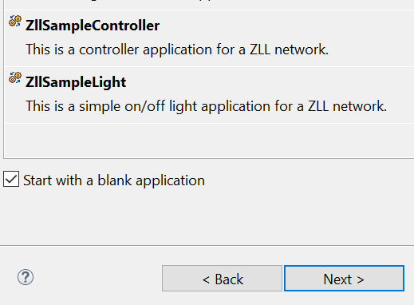
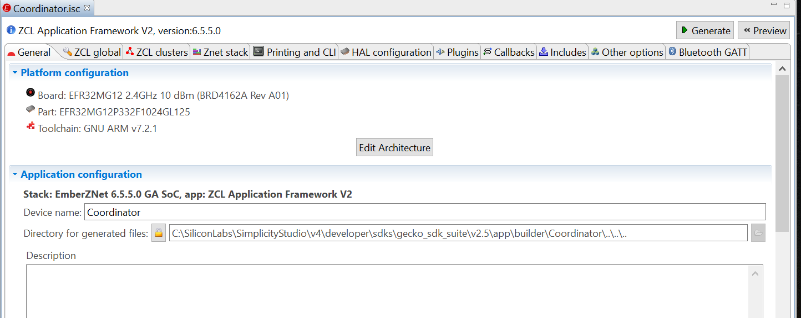
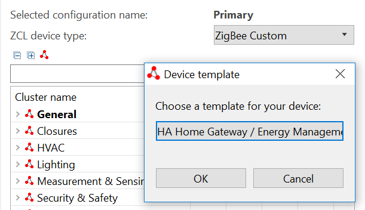
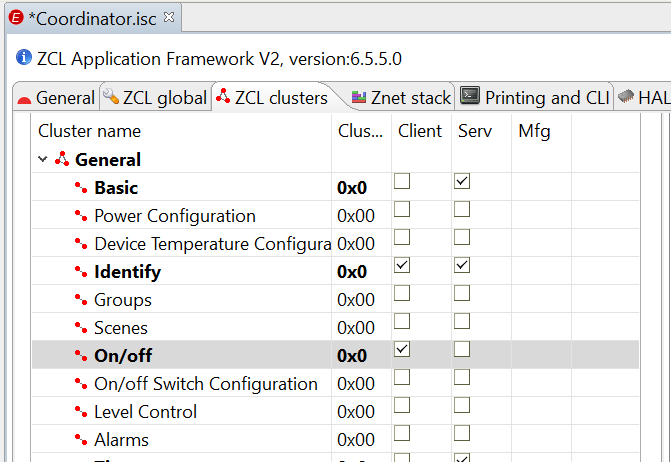
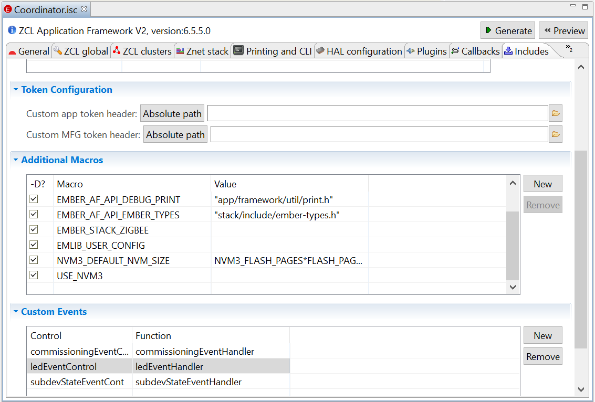
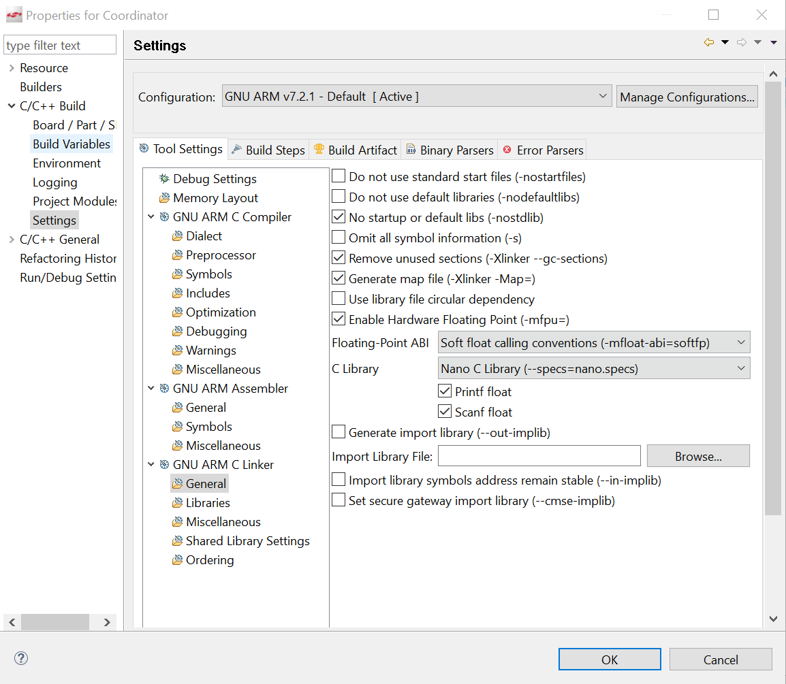

<details>   
<summary><font size=5>目录</font> </summary>
<!-- TOC -->

- [天猫精灵对接AliOS 设备](#天猫精灵对接alios-设备)
    - [1. 介绍](#1-介绍)
    - [2. 安装AliOS Things Studio](#2-安装alios-things-studio)
    - [3. Link Kit SDK介绍](#3-link-kit-sdk介绍)
    - [4. 编译运行Linkkit的示例代码](#4-编译运行linkkit的示例代码)
    - [5. 在阿里云物联网平台建立设备](#5-在阿里云物联网平台建立设备)
    - [6. 定制linkkitapp的代码](#6-定制linkkitapp的代码)
        - [a. app\example\linkkitapp\linkkit_example_solo.c](#a-app\example\linkkitapp\linkkit_example_soloc)
        - [b. app\example\linkkitapp\app_entry.c](#b-app\example\linkkitapp\app_entryc)
        - [c. 编译linkkit app并下载到ESP板子上.](#c-编译linkkit-app并下载到esp板子上)
    - [7. 云智能App和设备配网](#7-云智能app和设备配网)
    - [8. 天猫精灵语音控制灯](#8-天猫精灵语音控制灯)
- [天猫精灵控制Zigbee设备](#天猫精灵控制zigbee设备)
    - [1. 介绍](#1-介绍-1)
    - [2. 生成Zigbee的Coordinator](#2-生成zigbee的coordinator)
        - [2.1.  生成一个blank project](#21--生成一个blank-project)
        - [2.2 增添文件和功能函数](#22-增添文件和功能函数)
    - [3. 生成WiFi的网桥](#3-生成wifi的网桥)
        - [3.1. 网桥设备注册登录阿里云](#31-网桥设备注册登录阿里云)
        - [3.2. 获取网桥子设备拓扑关系](#32-获取网桥子设备拓扑关系)
        - [3.3. 子设备的登入和登出](#33-子设备的登入和登出)
        - [3.4. 子设备的添加与删除](#34-子设备的添加与删除)
        - [3.5. 子设备灯的开关控制](#35-子设备灯的开关控制)
    - [4. 天猫精灵控制设备灯的开关](#4-天猫精灵控制设备灯的开关)

<!-- /TOC -->
</details>

# 天猫精灵对接AliOS 设备

## 1. 介绍
  IoT物联网变得越来越火热, 智能家居已经走入家庭. 智能设备,如灯, 开关, 空调, 温湿度传感器, 风扇, 扫地机器人都可以通过智能音箱来控制. 
极大方便了我们日常的生活和智能家居控制管理. 针对IoT市场, Alibaba提供了完善的生态系统, 包括[AliOS Things](https://github.com/alibaba/AliOS-Things)针对终端设备, 含有Link Kit SDK
来连接阿里云IoT物联网平台-[智能生活开放平台](https://living.aliyun.com). 同时允许天猫精灵无缝连接, 通过语音来控制智能设备.
  在本文, 我们利用ESP32的平台来跑AliOS, 连接到阿里云IoT物联网平台, 通过阿里巴巴的云智能App来控制灯的开/关, 然后绑定天猫精灵,使得我
们能够通过语音来控制灯的开/关和了解灯的状态. 
     
## 2. 安装AliOS Things Studio
  阿里巴巴提供了详细的文档介绍如何安装开发环境, 下载AliOS Things的代码, 编译示例代码, 下载代码到目标板. ESP32 devkitc是AliOS Things
  支持一款开发板. 详细介绍可以参看此网址 [AliOS Things Studio](https://github.com/alibaba/AliOS-Things/wiki/AliOS-Things-Studio). 
  
## 3. Link Kit SDK介绍
  Link Kit SDK是阿里云提供给设备厂商并通过该SDK将设备安全接入到阿里云IoT物联网平台, 从而设备可以被阿里云IoT平台控制, 同样可以被阿里
云的App, 或者天猫精灵控制. 详细介绍可以参看此网址设备接入[Link Kit SDK](https://help.aliyun.com/document_detail/96596.html?spm=a2c4g.11186623.6.542.217265567uqowz)
  AliOS 已经包含Link Kit SDK, 我们可以直接生成示例代码. 
  
## 4. 编译运行Linkkit的示例代码
  打开Visual Studio Code, 点击下方工具栏红色方框中的编译选项, 输入linkkitapp选择示例代码按回车, 再输入esp32devkitc选择开发平台再回车. 
  点击编译按钮生成烧录文件, 再点击烧录. 在这里它会每次提示你选择串口, 如果觉得烦就直接修改\AliOS-Things\build\site_scons\upload\esp32.json, 
  将"@PORT@"修改成你的串口号比如"COM11". 
  点击串口工具图标观察输出, 如果有看到设备反复重启, 应该是没有烧录正确, 可以通过ESP32原厂的烧录工具来验证. 
  对此过程有疑问的可以参考网址[AliOS Things Studio](https://github.com/alibaba/AliOS-Things/wiki/AliOS-Things-Studio)

## 5. 在阿里云物联网平台建立设备
  我们需要在阿里云物联网平台建立设备, 生成product key, device key等信息, 并把信息加入到Linkkit的示例代码中, 双方才可以建立连接. 
阿里云IoT提供两个云服务平台:[生活物联网平台](https://living.aliyun.com/#/) 和 [物联网管理平台](https://www.aliyun.com/product/iot-devicemanagement?spm=ilop), 其中生活物联网平台, 提供设备端的SDK, 公版App, 开发门槛较低, 我们这里采用的就
是这个平台. 
  进入[生活物联网平台](https://living.aliyun.com/#/)
*  首先[创建产品](https://living.aliyun.com/doc?spm=a2c9o.12549863.0.0.4e9d38e48XXAqy#readygo.html), 我们选择灯的产品, 选项都默认, 这个灯只具有开关功能. 创建完后, 在右侧的基本信息中, 把Product Secret的值拷贝下来.
*  [设备调试](https://living.aliyun.com/doc?spm=a2c9o.12549863.0.0.4e9d38e48XXAqy#evgs8e.html), 选择认证模组/芯片里面没有ESP32, 我们选择最后一个品牌,型号不限. 在这里我们可以添加测试设备, 生成 Product Key, 
   Device Name, DeviceSecret等信息用于调试. 
* [人机交互](https://living.aliyun.com/doc?spm=a2c9o.12549863.0.0.4e9d38e48XXAqy#swz51p.html), 这一步可以下载公版App, 并可生成产品配网二维码, 用App扫描此二维码即可添加设备. 
* [产品发布](https://living.aliyun.com/doc?spm=a2c9o.12549863.0.0.4e9d38e48XXAqy#gs40p8.html), 在这一步可以发布产品, 购买激活码并分配给产品, 我们就可以在App里面找到我们自定义的产品.在这里点击量产管理, 选择量产记录, 
  找到你已经发布的设备,点击查看, 在弹出窗口下载激活码, 在一个excel文件里包含了Product key, Device Name 和 Device Secret. 

## 6. 定制linkkitapp的代码
### a. app\example\linkkitapp\linkkit_example_solo.c

i. 用生活物联网平台得到的产品信息更新如下宏定义. 
```c
#define PRODUCT_KEY "a1X2bEnP82z"
#define PRODUCT_SECRET "7jluWm1zql7bt8qK"
#define DEVICE_NAME "test_06"
#define DEVICE_SECRET "wQ1xOzFH3kLdjCTLfi8Xbw4otRz0lHoq"
```

ii. 添加GPIO18初始化设置
```c
gpio_dev_t led;
#define GPIO_LED_IO 18

void init_gpio(void)
{
  led.port = GPIO_LED_IO;
  led.config = OUTPUT_PUSH_PULL;
  hal_gpio_init(&led);
}

int linkkit_main(void *paras)
{
  /* Adding GPIO initialization at beginning of linkkit_main() */
  init_gpio(); 
  …
}
```

iii. 添加处理LED on/off的代码
	 在处理阿里云发送过来的JSON格式的命令处理函数添加对LightSwitch的处理
```c
static int thing_prop_changed(const void *thing_id, const char *property,void *ctx)
{
    if (strstr(property, "HSVColor") != 0) {
  …
  else if (strstr(property, "LightSwitch") != 0) {
    int sw_on = 0xFF;
    linkkit_get_value(linkkit_method_get_property_value, thing_id,
              property, &sw_on, &value_str);
    if (value_str) {
      free(value_str);
      value_str = NULL;
    }
    if (sw_on == 1) {
      hal_gpio_output_high(&led);
    }
    if (sw_on == 0) {
      hal_gpio_output_low(&led);
    }
  }
```

### b. app\example\linkkitapp\app_entry.c
  设备端和App有个配网过程, 首先App加入到一个WiFi网络内, 它会把WiFi的SSID和密码通过组播的UDP传输方式发送给设备, 设备加入WiFi后和App
建立匹配, 并注册信息到阿里云. 以后App可通过阿里云对灯设备进行控制.
  设备配网的起始函数是do_awss_active(), 原代码中要等一个按键事件才开始配网. 我们可以添加一个2秒定时器来自动运行配网. 
  
```c
static void app_delayed_action(void *arg)
{
  do_awss_active();
}

int application_start(int argc, char **argv)
{
  …
  aos_post_delayed_action(2000, app_delayed_action, NULL); 
  aos_loop_run();
  return 0;
}
```

### c. 编译linkkit app并下载到ESP板子上.

## 7. 云智能App和设备配网
* 打开云智能App, 选择扫描, 扫描生活物联网平台上人机交互阶段生成的二维码, 输入WiFi网络的SSID和密码,开始扫描设备. 
* 复位ESP32板子,2秒后开始接收App发送过来的SSID和密码. 
* 配网成功, 云智能App显现设备列表, 点击设备进入控制界面, 可以控制设备的灯的on/off

## 8. 天猫精灵语音控制灯
* 安装天猫精灵App, 并用淘宝账户登陆
* 在云智能App中选择"我的"->"第三方服务", 选择天猫精灵. 点击绑定账号, 登陆同一个淘宝账号. 灯设备出现在可控设备列表里面. 
* 在天猫精灵App里面, 找到你的灯, 分配好名字, 如书房的灯. 
* 对天猫精灵说"打开书房的灯", 灯开; "关闭书房的灯", 灯灭; "现在灯是开的么?", 回答"现在灯处于关闭状态"


***

# 天猫精灵控制Zigbee设备

## 1. 介绍
我们在[天猫精灵控制ESP32设备](https://github.com/MarkDing/TmallGenieControlsESP32)的文章中已经知道如何利用阿里巴巴的Link Kit SDK跑在ESP32平台，连接到阿里云的智能生活开放平台，从而使得天猫精灵能够控制WiFi设备的灯的开关。理论上我们可以添加各种协议的方案通过串口和WiFi设备交换信息和命令，从而实现天猫精灵控制终端设备。 例如Zigbee, Bluetooth Mesh, Z-Wave, Proprietary等。天猫精灵本身就支持Bluetooth Mesh设备的直接控制，就没有必要通过这种云对云的方式来控制。那么我们今天要讨论的是如何基于以上技术来实现天猫精灵控制Zigbee的设备。

为了实现控制Zigbee的终端设备，我们需要一个Coordinator来组建Zigbee的Mesh网络，实现终端设备的加网，退网，控制，状态获取等，并通过自定义的协议和WiFi设备通讯，作为一个网络桥接器，和阿里云进行交互，进而实现天猫精灵对Zigbee终端设备的语音控制。

在这个文章中我们选择Silicon Laboratories公司的WSTK板，Radio Board型号是BRD4162A，板上芯片为EFR32MG12来做Zigbee的Coordinator。 
	
## 2. 生成Zigbee的Coordinator
Zigbee协议中Coordinator作为控制中心可以创建Mesh网络，管理子设备入网，退网，命令和信息传输。 
在[官网](https://www.silabs.com/products/development-tools/software/simplicity-studio.)下载并安装好Simplicity Studio (SS)， 然后在SS里面下载好Zigbee SDK. 
	
### 2.1.  生成一个blank project
A) 在SS里点击"New Project"， 选择"ZCL Application Framework V2"，再选"EmberZNet 6.5.5.0 GA SoC 6.5.5.0"，然后勾选"Start with a blank application"，按Next

<div align="center">

</div>

项目名起为Coordinator，按Next再Finish就生成了一个空的项目工程。 
我们会看到项目里只有一个Coordinator.isc的文件，这个是用来配置Zigbee相关的参数，并根据配置自动生成源代码。

<div align="center">

</div>

如图可以看到许多Tab用来配置不同的参数。

B) 选ZCL global tab，在Manufacturer code输入Ember [0x1002]

C) 选ZCL Clusters， 选择 ZCL device type为"ZigBee Custom->HA Home Gateway / Energy Management"。

<div align="center">

</div>

选General->Basic->On/off, 使能Client

<div align="center">

</div>

D) 选Plugins tab，使能
* Network Creator
* Network Creator Security
* Device Table
* NVM3 Library
* Simulated EEPROM version2 to NVM3 Upgrade Stub

  禁止Simulated EEPROM version 1 Libray, 这个和NVM3功能重叠了

E) 配置串口

在Plugins tab，选择Serial plugin，使能USART3。
选择HAL configuration tab， 点击"Open Hardware Configurator"打开硬件配置，enable"Virtual COM Port". 选择USART3，关掉Flow control mode, 存盘触发自动生成硬件配置文件，退出Hardware Configurator

F) 选Callbacks tab, 使能如下Callback函数
* Non-cluster related
  * Main Init, Main Tick, Hal Button Isr, Message Sent
* Plugins-specific callbacks
  * Device Left, New Device, State Change -  Device Table plugin specific
  * Complete - Network Creator plugin specific
  
  在下面的章节我们会介绍这些callback函数的用法。

G) 选Includes tab，在Custom Event列表中添加commisioning, led, subdevState event controls

<div align="center">

</div>

H) 打开项目属性， 将C Library中Print float和Scanf float勾选上，这样处理以后的JSON浮点数就没有问题了

<div align="center">

</div>

I) 在Coordinator.isc右上角点击Generate按钮生成源代码

J) 去除编译错误

由于Device Table是默认在Linux下Gateway工程下工作，有些配置在Soc下编译是不能通过的，需要修改。
* device-table-discovery.c

  添加头文件的包含
```c
#include "app/util/zigbee-framework/zigbee-device-common.h"
```
  去除ezsp的调用，改为ember的调用函数。

```c
static void setCurrentSourceRoute(uint16_t nodeId)
{
  emberAppendSourceRouteHandler(nodeId, EMBER_NULL_MESSAGE_BUFFER);
}
```

* device-table.c

  添加include的路径， 以及NVM3的头文件和KEY的定义
```c
#include "app/framework/util/af-main.h"
#include "app/framework/util/attribute-storage.h"
#include "app/framework/util/common.h"

#if defined (USE_NVM3)
#include "nvm3.h"
#include "nvm3_hal_flash.h"
// Device table counter key and data key
#define NVM3_DT_CNT_KEY 0x1000
#define NVM3_DT_KEY     0x2000
#endif
```

Device Table的存取默认是在Linux下用文件形式操作，但是在Soc上我们要把接口替换为NVM3的方式来操作

```c
void emAfDeviceTableSave(void)
{
  EmberAfPluginDeviceTableEntry *deviceTable = emberAfDeviceTablePointer();
  uint8_t i;
  uint32_t counter = 0;

  for (i = 0; i < EMBER_AF_PLUGIN_DEVICE_TABLE_DEVICE_TABLE_SIZE; i++) {
    if (deviceTable[i].nodeId != EMBER_AF_PLUGIN_DEVICE_TABLE_NULL_NODE_ID) {
      nvm3_writeData(nvm3_defaultHandle,NVM3_DT_KEY + counter, &deviceTable[i], sizeof(deviceTable[i]));
      counter++;
    }
  }
  // Write counter
  nvm3_writeCounter(nvm3_defaultHandle, NVM3_DT_CNT_KEY, counter);
}

void emAfDeviceTableLoad(void)
{
  EmberAfPluginDeviceTableEntry *deviceTable = emberAfDeviceTablePointer();
  uint8_t i;
  uint32_t counter = 0;
  // Read number of object of device table
  nvm3_readCounter(nvm3_defaultHandle, NVM3_DT_CNT_KEY, &counter);
  for (i = 0; i < counter; i++) {
    nvm3_readData(nvm3_defaultHandle,NVM3_DT_KEY + i, &deviceTable[i], sizeof(deviceTable[i]));
    deviceTable[i].state = EMBER_AF_PLUGIN_DEVICE_TABLE_STATE_JOINED;
    deviceTable[i].lastMsgTimestamp = halCommonGetInt32uMillisecondTick();
  }
}
```

处理完毕编译通过。
	
### 2.2 增添文件和功能函数
A) device-table-tracking.c 

getCurrentState()函数需要被外部调用，去除其static的定义。另外添加一个getLastDeviceId()函数同样为外部调用。

B) cJSON.c, 用来处理JSON格式的信息

将本Repo的network\utility\cjson\下的cJSON.c和cJSON.h拷贝到和Coordinator_callbacks.c的同目录下。
把其中的动态内存分配的宏改为标准函数名字
```c
#define internal_malloc malloc
#define internal_free free
#define internal_realloc realloc      
```
由于Zigbee的SDK没有考虑动态内存分配的事情，需要我们在Coordinator_callbacks.c定义一个64KB的数组，section为".heap"，这样动态内存分配函数就可以在heap区工作。

C) hal-config\hal-config.h, 将此头文件里的HAL_SERIAL_USART3_ENABLE 设置为1，否则USART3不能工作，每次isc重新生成文件后，此文件都会被覆盖，需要人工把它改过来。

D) Coordinator_callbacks.c

在这个文件里集中了我们生成的所有callback函数，我们把协议处理和WiFi处理器通讯部分都在此函数实现. 详情可以看本Repo的coordinator\coordinator_callbacks.c. 下面我们简要的介绍些流程和功能函数。

* emberAfMainInitCallback()

  此函数初始化时被调用，我们在这里初始化串口，LED，并启动一个延时子设备状态查询的Event，每30秒查询一次。
```c
void emberAfMainInitCallback(void)
{
  halInternalInitLed();
  emberSerialInit(APP_COM, 115200, PARITY_NONE, 1);
  emberEventControlSetDelayMS(subdevStateEventControl, SUBDEV_STATE_PERIOD_MS);
}
```
* emberAfHalButtonIsrCallback()

  在有按键的情况下激活commissioningEventControl

* commissioningEventHandler()

  建立一个centralized network。 在网络建好后，button0触发开放网络允许子设备加入， button1关闭网络禁止设备加入。

* subdevStateEventHandler()

  从device table里依次找出子设备的device index, 发送Identify命令给子设备。子设备由于断电和加电会使得命令发送失败或者成功，我们就可以知道子设备在线与否。 

* emberAfMessageSentCallback()

  每条对子设备发送的命令都会回调此函数，通过判断通讯成功和失败，来改变子设备的登记状态。

* emberAfPluginDeviceTableNewDeviceCallback()

  当有子设备加网成功，此函数会被调用，我们会在这里通知WiFi控制器新设备加入的信息，进而更新阿里云服务器上的设备拓扑关系。

* emberAfPluginDeviceTableDeviceLeftCallback()

  子设备退网触发此函数，同样通知阿里云改变设备拓扑关系。

* emberAfPluginDeviceTableStateChangeCallback()

  当子设备的device table的状态发生变化， 如在线，离线，未知等，发送response packet到WiFi控制器，进而改变设备在阿里云服务器上的在线和离线状态。

* cmdHandler() and sendResponsePacket()

  用来处理和WiFi控制器之间的通讯。

* emberAfMainTickCallback()

  在每个系统tick结尾处调用，用来查看串口是否有命令数据进来。超过4个字节就调用cmdHandler()来处理命令。

## 3. 生成WiFi的网桥
我们需要在network\app\example\linkkit_gateway\linkkit_example_gateway.c中做适当的修改来适应我们的完整功能需求。另外添加comm.c和comm.h来处理和Coordinator之间的通讯。
阿里巴巴在三月份更新了设备管理的[API](https://help.aliyun.com/document_detail/97569.html)，原来旧有的接口例程放在了本目录的deprecated子目录下。 新的API接口还有些地方没有完善或者功能欠缺，给后期的开发带来不少麻烦，通过其他方式来做了补充。

下面我们按照执行顺序和功能模块来进行介绍。

### 3.1. 网桥设备注册登录阿里云
网桥设备是一机一密的方式，没有采用动态登录方式。
创建主设备，选择上海的云服务器，选择非动态登录方式，连接到阿里云

```c
/* Register Callback */
IOT_RegisterCallback(ITE_TOPOLIST_REPLY, user_topolist_reply_event_handler);
IOT_RegisterCallback(ITE_INITIALIZE_COMPLETED, user_initialized);

/* Create Master Device Resources */
user_example_ctx->master_devid = IOT_Linkkit_Open(IOTX_LINKKIT_DEV_TYPE_MASTER, &master_meta_info);

/* Choose Login Server */
int domain_type = IOTX_CLOUD_REGION_SHANGHAI;
IOT_Ioctl(IOTX_IOCTL_SET_DOMAIN, (void *)&domain_type);

/* Choose Login Method */
int dynamic_register = 0;
IOT_Ioctl(IOTX_IOCTL_SET_DYNAMIC_REGISTER, (void *)&dynamic_register);

/* Start Connect Aliyun Server */
res = IOT_Linkkit_Connect(user_example_ctx->master_devid);
```

### 3.2. 获取网桥子设备拓扑关系
在网桥设备连云初始化完成后，会调用ITE_INITIALIZE_COMPLETED对应的回调函数user_initialized()。然后可以用ITM_MSG_QUERY_TOPOLIST选项来调用IOT_Linkkit_Query以获取与其存在拓扑关系的所有子设备信息. 列表信息将在ITE_TOPOLIST_REPLY事件回调中返回。

```c
res = IOT_Linkkit_Query(user_example_ctx->master_devid, ITM_MSG_QUERY_TOPOLIST,NULL, 0);
```

数据为JSON格式,如下两个设备范例

```json
{"id":2,"code":200,"devid":0,
"topo":[{"deviceSecret":"ZI0OtnNGd4fFExOerguZRH0huyiUcDrW","productKey":"a1dOIDDEMGM","deviceName":"000b57fffe648d84"},
{"deviceSecret":"OODoAak2RWyHHxftQWbMhDEuQvtvzdJk","productKey":"a1dOIDDEMGM","deviceName":"000b57fffe648dc2"}]}
```

将接收到的子设备信息进行解析，调用device_table_add_subdev()添加到本地设备列表方面以后操作管理。

### 3.3. 子设备的登入和登出
在创建完本地的设备列表后，通过device_get_property()和Zigbee的Coordinator进行通讯查看相应的子设备是否在线。
命令格式 为 packet_len, ~packet_len, {"cmd":CMD_GET_PROPERTY,"dn":"000b57fffe648dc2"}

Coordinator收到命令后会汇报子设备的状态。响应包格式，packet_len, ~packet_len, {"dn":"000b57fffe648dc2","cmd":RSP_DEV_PROPERTY, "online":online}. 根据返回的online的值来向阿里云汇报子设备的登入和登场状态。

```c
if (online) {
    res = IOT_Linkkit_Report(devid, ITM_MSG_LOGIN, NULL, 0);    
} else {
    res = IOT_Linkkit_Report(devid, ITM_MSG_LOGOUT, NULL, 0);    
}
```

### 3.4. 子设备的添加与删除
当有新的子设备加入，Coordinator会向网桥汇报RSP_DEV_ADDED。命令中包含"model",表示是什么设备。 目前我们只支持两种设备，    DEVICE_ID_DIMMABLE_LIGHT和DEVICE_ID_COLOR_DIMMABLE_LIGHT。其他的model我们会不处理。
准备好子设备的meta三元组数据，创建子设备，连接阿里云，更新本地设备列表，子设备登入。

```c
devid = IOT_Linkkit_Open(IOTX_LINKKIT_DEV_TYPE_SLAVE, meta_info);
res = IOT_Linkkit_Connect(devid);
device_table_add_subdev(meta_info, devid);
res = IOT_Linkkit_Report(devid, ITM_MSG_LOGIN, NULL, 0);
```

删除子设备时，Coordinator向网桥汇报RSP_DEV_REMOVED。
登出子设备，汇报阿里云删除拓扑关系，关闭子设备，更新本地设备列表

```c
res = IOT_Linkkit_Report(devid, ITM_MSG_LOGOUT, NULL, 0);   
res = IOT_Linkkit_Report(devid, ITM_MSG_DELETE_TOPO, NULL, 0);
res = IOT_Linkkit_Close(devid);
res = device_table_del_subdev(devid);
```

### 3.5. 子设备灯的开关控制
云端发送过来设备控制命令会触发ITE_PROPERTY_SET注册的回调函数。命令以JSON形式，如{"LightSwitch":1}。 我们对云端发送过来的命令不做任何修改，跟随设备信息直接发送给coordinator。格式如下{"cmd":67,"dn":"000b57fffe648dc2","pk":"a1dOIDDEMGM","payload":{"LightSwitch":1}}。这样做有利于以后支持新设备，不用修改网桥控制部分代码。
然后向阿里云汇报子设备开关状态，这里直接假设控制成功，如果子设备因为离线没能控制，会在RSP_DEV_PROPERTY中处理正确的状态。 

```c
res = IOT_Linkkit_Report(devid, ITM_MSG_POST_PROPERTY, (uint8_t *)request, request_len);
```


## 4. 天猫精灵控制设备灯的开关
在云智能App选择第三方服务，选中天猫精灵，设置好用户名和密码。在天猫精灵App里发现新添加的设备，起好名字。
对天猫精灵说"打开书房的灯", 灯开; "关闭书房的灯", 灯灭; "现在灯是开的么?", 回答"现在灯处于关闭状态"

至此我们实现了天猫精灵以云对云的方式来控制Zigbee设备。
