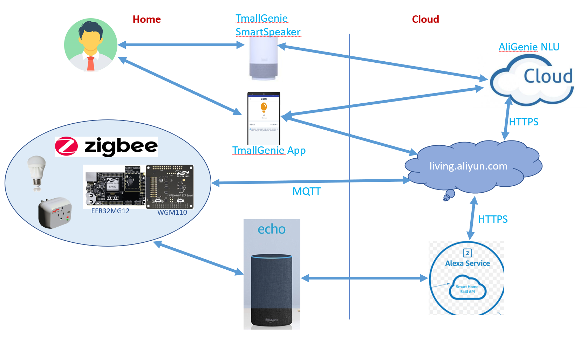
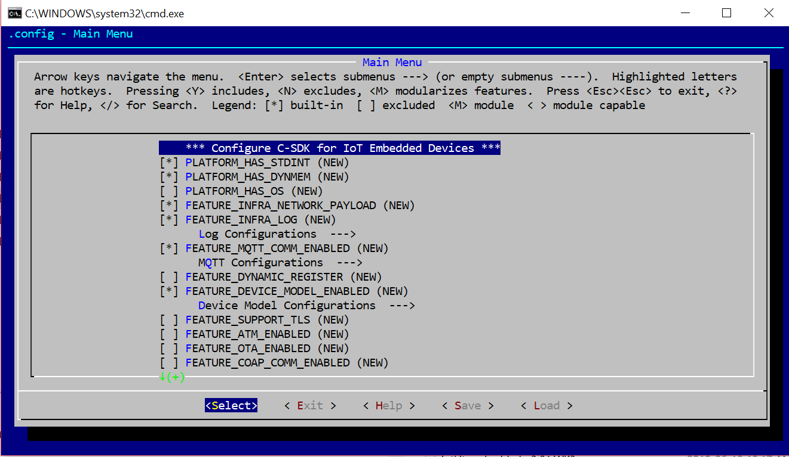
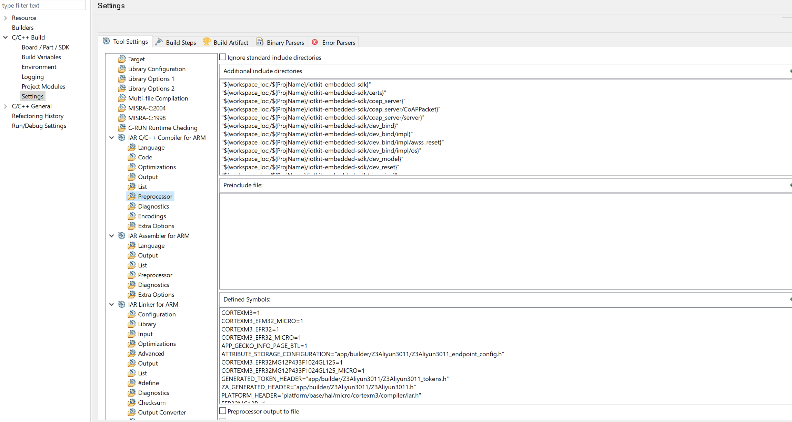
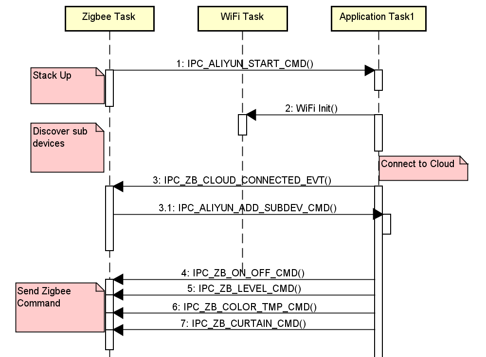

<div align="center">
  <font size=7>Zigbee Router Bridge连接到阿里云</font>
</div>
<br>

<details>   
<summary><font size=5>目录</font> </summary>

- [1. 简介](#1-简介)
- [2. 创建Zigbee工程](#2-创建zigbee工程)
    - [2.1. 创建工程](#21-创建工程)
    - [2.2. 配置工程](#22-配置工程)
- [3. 移植阿里物联生活平台设备侧SDK](#3-移植阿里物联生活平台设备侧sdk)
  - [3.1. 下载SDK](#31-下载sdk)
  - [3.2. 配置SDK](#32-配置sdk)
  - [3.3. 根据配置提取SDK代码](#33-根据配置提取sdk代码)
  - [3.4. 配置头文件路径](#34-配置头文件路径)
  - [3.5. 实现wrapper.c中的适配接口](#35-实现wrapperc中的适配接口)
  - [3.6. 参照阿里云物联网SDK的网关参考代码实现云对接的功能](#36-参照阿里云物联网sdk的网关参考代码实现云对接的功能)
- [4. 使用WGM110模组连接网络](#4-使用wgm110模组连接网络)
- [5. Zigbee 部分的功能实现](#5-zigbee-部分的功能实现)
  - [5.1. Device Table](#51-device-table)
  - [5.2. Micrium RTOS 配置修改](#52-micrium-rtos-配置修改)
  - [5.3. Watchdog 门限修改](#53-watchdog-门限修改)
  - [5.4. IPC 通信](#54-ipc-通信)
  - [5.5. 启动流程](#55-启动流程)
  - [5.6. 异常恢复](#56-异常恢复)
- [6. 参考材料](#6-参考材料)

</details>

***

# 1. 简介
本项目的主要目的开发一个Zigbee的bridge，通过这个bridge将Zigbee设备连接到阿里云，从而实现使用天猫精灵来控制Zigbee网络中的设备。项目的示意图如下：
<div align="center">
    
</div>
</br>

此外，在本项目中，使用Amazon的Echo Plus作为Zigbee的coordinator，首先将Zigbee设备加入由echo plus创建的Zigbee网络中，通过echo plus可以直接控制。另外一方面，本项目开发的router bridge也是加入到echo plus的网络中，然后通过这个bridge将zigbee网络中的设备加入阿里云。最终可以实现同时使用天猫精灵和echo plus来控制。

1. 项目中涉及的平台和组件包括：

   * [天猫精灵平台](https://open.aligenie.com/)，只需购买一台天猫精灵智能音箱，使用淘宝账号登录即可。
   * [阿里物联生活平台](https://living.aliyun.com/)，需要注册帐号，并创建相关产品。
   * Zigbee router bridge, 即本项目开发的目标。由WiFi和Zigbee两部分组成，用UART接口连接二者。  

     * Zigbee部分，基于Silicon Labs公司的EFR32MG12以及EmberZnet SDK开发；
     * WiFi部分，基于Silicon Labs公司的WGM110模组开发；
   * [Amazon Echo Plus](https://www.amazon.com/All-new-Echo-Plus-2nd-built/dp/B0794W1SKP)，用户需要在手机端下载Alexa APP来控制echo plus

2. 涉及的资源和资料链接:

   * [阿里物联生活平台](https://living.aliyun.com/doc#index.html)
   * [阿里物联生活平台设备侧SDK](https://github.com/aliyun/iotkit-embedded)
   * [Silicon Labs公司Zigbee产品以及开发工具](https://www.silabs.com/products/wireless/mesh-networking/zigbee)
   * [Amazon alexa开发](https://developer.amazon.com/alexa)

* * *

# 2. 创建Zigbee工程
Silicon Labs公司的Simplicity Studio可以从[官网](https://www.silabs.com/products/development-tools/software/simplicity-studio)下载，建议安装到默认的路径(C盘预留20GB以上的空间)。由于需要下载Zigbee协议SDK, 需要购买[Zigbee开发套件](https://www.silabs.com/products/development-tools/wireless/mesh-networking)才能拥有下载权限。本项目基于EmberZnet SDK 6.7.6版本开发。此外，此项目中还是用到了Micrium OS操作系统，也需要从Simplicity Studio中下载安装。最后由于EmberZnet中支持Micrium OS的插件现在只支持使用IAR来编译，因此需要安装IAR。对于没有IAR的用户，可以通过如下的方式来支持Micrium OS，但是Silicon Labs官方不提供技术支持。
- 下载[Micrium RTOS plugin的配置文件](files/CM-Smart-Speaker/micrium-rtos-plugin.properties)， 替代`protocol\zigbee\app\framework\plugin-soc\micrium-rtos\plugin.properties`. (请提前做好备份)
- 下载[BLE plugin的配置文件](files/CM-Smart-Speaker/ble-plugin.properties)， 替代`protocol\zigbee\app\framework\plugin-soc\ble\plugin.properties`. (请提前做好备份)

推荐使用GCC来编译，因为使用IAR来编译阿里云的SDK的时候，会出现很多编译错误，需要逐条修改，这些编译错误大部分都是一些类型不严格匹配的问题。

### 2.1. 创建工程

主要步骤如下:  
1. 启动Simplicity Studio, 打开菜单`File`-->`New`-->`Project`;
2. 选择`Silicon Labs AppBuilder Project`, 然后点击`Next`继续;
3. 选择`Silicon Labs Zigbee`, 然后点击`Next`继续;
4. 选择`EmberZnet 6.7.6.0 GA Soc 6.7.6.0`, 然后点击`Next`继续;
5. 选择`ZigbeeMinimal`, 然后点击`Next`继续;
6. 输入工程名称`Z3Aliyun`, 然后点击`Next`继续;
7. 在`Boards`列表框, 选择`BRD4162A`， 然后`Part`框会自动更新成对应的芯片型号。在编译器中选择GCC，最后点击`Finish`完成。 上述步骤完成后，Simplicity Studio会自动打开锁创建的工程对应的isc文件。

### 2.2. 配置工程

1. 选择`ZCL Clusters` tab, 选中Endpoint 1, 然后在下面的`ZCL device type`一栏选择`Zigbee Custom` -> `HA Devices` -> `HA Color Dimmer Switch`。然后选择如下的Cluster:  
    - [x] On/Off Cluster client side
    - [x] Level Control Cluster client side
    - [x] Shade Configuration Cluster client side
    - [x] Color Control Cluster client side
2. 选择`Zigbee Stack` tab, 修改设备类型为`Coordinator or Router`。
3. 选择`Plugins` tab, 勾选或取消如下plugins:
    - [x] Counters
    - [x] Device Table
    - [ ] Ember Minimal Printf
    - [x] Standard Printf Support
    - [x] Idle/Sleep
    - [x] Micrium-RTOS
      - [ ] CPU Usage Tracking
      - [x] Application Task 1, `Stack Size` set to `2048`
    - [x] Network Creator
    - [x] Network Creator Security
    - [x] Network Steering
      - [ ] Optimize scans
      - [x] `Radio output power` set to `10dbm` 
    - [ ] RAIL Library
    - [x] RAIL Library Multiprotocol
    - [ ] Simple main
    - [x] Source Route Library
      - [x] `Source Route Table Size` set to `32` 
    - [x] Stack Diagnostics
    - [x] NVM3 Library
      - [x] `Cache Size` set to `254` 
    - [x] Zigbee PRO Stack Library
      - [x] `Child Table Size` set to `32`
      - [x] `Packet Buffer Count` set to `32`
      - [x] `Broadcast Table Size` set to `32` 
4. 选择`Printing and CLI` tab, 勾选`Add Custom CLI sub-menu`
5. 选择`Callbacks` tab, 勾选/取消如下callbacks函数:
   - [ ] emberAfPluginNetworkSteeringCompleteCallback
   - [x] emberAfStackStatusCallback
   - [x] emberAfHalButtonIsrCallback
   - [x] emberAfMainInitCallback
   - [x] emberAfMainTickCallback
   - [x] emberAfReadAttributesResponseCallback
   - [x] emberAfPluginMicriumRtosAppTask1InitCallback
   - [x] emberAfPluginMicriumRtosAppTask1MainLoopCallback
6. 选择`Includes` tab, 添加如下自定义宏:
   - [x] `NO_LED` 值为 `1`
   - [x] `MBEDTLS_CIPHER_MODE_CBC` 值为 `1`
   - [x] `MBEDTLS_CIPHER_MODE_CFB` 值为 `1`
7. 选择`Includes` tab, 添加如下自定义Event:
   - [x] Event `pollAttrEventControl`,  Handler `pollAttrEventHandler`
   - [x] Event `clearWiFiEventControl`,  Handler `clearWiFiEventHandler`
   - [x] Event `commissionEventControl`,  Handler `commissionEventHandler`
   - [x] Event `softWdgEventControl`,  Handler `softWdgEventHandler`
   - [x] Event `wifiCheckEventControl`,  Handler `wifiCheckEventHandler`
8. 选择`Includes` tab, 添加如下自定义token:
    ``` C
    /***************************************************************************//**
    * @file
    * @brief Tokens for Z3Aliyun301.
    *******************************************************************************
    * # License
    * <b>Copyright 2018 Silicon Laboratories Inc. www.silabs.com</b>
    *******************************************************************************
    *
    * The licensor of this software is Silicon Laboratories Inc. Your use of this
    * software is governed by the terms of Silicon Labs Master Software License
    * Agreement (MSLA) available at
    * www.silabs.com/about-us/legal/master-software-license-agreement. This
    * software is distributed to you in Source Code format and is governed by the
    * sections of the MSLA applicable to Source Code.
    *
    ******************************************************************************/

   #define CREATOR_KV_PAIRS            (0x6801)
   #define NVM3KEY_KV_PAIRS            (NVM3KEY_DOMAIN_USER | 0x6801)

   #define CREATOR_DEV_TABLE           (0x6901)
   #define NVM3KEY_DEV_TABLE           (NVM3KEY_DOMAIN_USER | 0x6901)

   #define CREATOR_WIFI_INFO           (0x6931)
   #define NVM3KEY_WIFI_INFO           (NVM3KEY_DOMAIN_USER | 0x6931)

   #ifdef DEFINETYPES
   // Include or define any typedef for tokens here
   typedef struct {
     char    kv_key[63];
     uint8_t value_len;
     uint8_t value[64];
   } tokTypeKvs;

   typedef struct {
     uint8_t     endpoint;
     uint16_t    deviceId;
     EmberNodeId nodeId;
     EmberEUI64  eui64;
   } tokTypeDevTable;

   typedef struct {
     char    ssid[64];
     char    passwd[64];
   } tokTypeWiFiInfo;

   #endif //DEFINETYPES

   #ifdef DEFINETOKENS
   // Define the actual token storage information here

   #define MAX_KV_NUMBER 16
   DEFINE_INDEXED_TOKEN(KV_PAIRS,
                        tokTypeKvs,
                        MAX_KV_NUMBER,
                        { {0, }, 0, {0, } })
                           
   #define MAX_DEV_TABLE_NUMBER 32
   DEFINE_INDEXED_TOKEN(DEV_TABLE,
                        tokTypeDevTable,
                        MAX_DEV_TABLE_NUMBER,
                        { 0xFF, 0xFFFF, 0xFFFF, {0xFF, 0xFF, 0xFF, 0xFF, 0xFF, 0xFF, 0xFF, 0xFF} })

   DEFINE_BASIC_TOKEN(WIFI_INFO, tokTypeWiFiInfo, {0})                        
   #endif //DEFINETOKENS
    ```
    这里主要增加了3个token:
    - Key-value pair, 这里主要是用于存储阿里云SDK所需的一些数据，是以key-value配对的形式保存的
    - Device table
    - WiFi的用户名密码

* * *

# 3. 移植阿里物联生活平台设备侧SDK

参考[阿里物联生活平台的开发指南](https://living.aliyun.com/doc#index.html)，首先下载最新版本的[SDK(V3.01)](https://code.aliyun.com/linkkit/c-sdk/repository/archive.zip?ref=tag-v3.0.1), 参考SDK的[用户手册](https://code.aliyun.com/edward.yangx/public-docs/wikis/user-guide/Linkkit_User_Manual)进行配置和移植。

## 3.1. 下载SDK

    https://code.aliyun.com/linkkit/c-sdk/repository/archive.zip?ref=tag-v3.0.1

## 3.2. 配置SDK

以windows为例，运行config.bat脚本，会弹出如下配置窗口：

<div align="center">
    
</div>
</br>

用方向键进行控制，空格键或者Enter进行选择或者取消，ESC键返回。
在默认配置的基础上，需要配置的选项有：
- [x] PLATFORM_HAS_OS
- [x] FEATURE_DYNAMIC_REGISTER
- [x] Device Model Configurations
  - [x] FEATURE_DEVICE_MODEL_GATEWAY
  - [x] FEATURE_ALCS_ENABLED
- [x] FEATURE_DEV_RESET
- [x] FEATURE_WIFI_PROVISION_ENABLED
  - [ ] FEATURE_AWSS_SUPPORT_SMARTCONFIG
  - [x] FEATURE_AWSS_SUPPORT_DEV_AP 

保存配置退出。

## 3.3. 根据配置提取SDK代码

配置完成后，用户的配置保存在make.settings文件中。运行extract.bat脚本，自动提取相应的SDK源码，放置在output/eng文件夹下面。将eng文件夹拷贝到前面创建的Zigbee工程中，将eng文件夹名称修改为iotkit-embeded-sdk。

## 3.4. 配置头文件路径

编译Zigbee工程，会有一些编译错误。主要原因是提取的SDK的头文件路径没有包含到工程中。
选择工程，右键，"Properties"，将SDK各个部分的路径添加到Include中，如下图：

<div align="center">
    
</div>
</br>

反复检查修改，直至编译通过。

## 3.5. 实现wrapper.c中的适配接口

wrapper.c中有一些接口是需要根据各自平台的具体情况来实现。这里我们使用的是运行在EFR32(ARM Cortex-M4)上的Micrium OS, IP通信依赖WGM110模组来实现。
wrapper.c中的接口主要分成几类：

*   IP 通信相关接口，包括：
    *   TCP 连接以及读写
    *   UDP 读写
    *   TLS 连接以及读写
    *   读取本地IP以及MAC
*   操作系统相关接口：
    *   定时器Timer
    *   内存分配Memory (malloc/free)
    *   信号量Semaphore
    *   互斥量Mutex
    *   任务管理Task
*   AES加密解密
*   WiFi配网相关接口
*   其他平台接口，包括：
    *   打印和格式化
    *   获取运行tick
    *   随机数生成
*   对接阿里物联网平台所需的接口，包括：
    *   读取设备名称和产品key
    *   读取和保存设备secret
    *   读取和保存平台特有的key-value对

其中OS相关的接口可以参考[Micrium OS的文档和手册](https://doc.micrium.com/pages/viewpage.action?pageId=10753180)来逐步实现。wrapper.c 的实现可以参考`iotkit-embedded-sdk/wrappers/wrapper.c`.

## 3.6. 参照阿里云物联网SDK的网关参考代码实现云对接的功能

主要参考linkkit_example_gateway.c，将其修改为动态注册，以便支持一型一密。
设备名称采用Eui64+Endpoint的方式来格式化，例如Eui64为000D6F00056AE60A的设备，有两个endpoint，1和2，因此需要要云端添加两个子设备，子设备名称分别是000D6F00056AE60A_1和000D6F00056AE60A_2。这样做的好处是解析云端的命令时，可以直接根据云端的devid提取设备名称，进而知道要操作的Zigbee设备的Eui64和endpoint。

详细实现可以参考`iotkit-embedded-sdk/wrappers/aliyun_main.c`.
* * *

# 4. 使用WGM110模组连接网络

开发WGM110的驱动软件，主要参考[API手册](https://www.silabs.com/documents/login/reference-manuals/wgm110-api-rm.pdf)。需要注意的是，EFR32与WGM110是通过UART连接的，速率115200，因此报文收发速度有限。另外，发送比较大的包时，需要分割成128字节的片来发送，否则容易出错。 WGM110驱动实现主要包括以下几个部分，详细的情况直接参考`wifi/wgm110.c`

*   串口初始化和读写
*   WiFi 消息接收任务
*   所有WiFi相关的接口都用的是同步方式实现，即发送命令给WiFi模组后，同步等待回应直至超时
*   分别实现TCP/UDP的数据接收队列
* * *

# 5. Zigbee 部分的功能实现

## 5.1. Device Table
当前Device Table是保存在文件系统里面的一个txt文件，这个不适用于SoC的模式。针对这里，需要做一些修改：
1. 修改函数 `emAfDeviceTableSave` and `emAfDeviceTableLoad`, 改成从token来保存和恢复device table
2. 修改函数 `emberAfDeviceTableCommandIndexSendWithEndpoint`， 在发送失败的情况下重试一次.
3. 修改文件`device-table-discovery.c`里面的函数`newEndpointDiscovered`， 以便我们可以在一个新的endpoint发现的时候，获取到Endpoint ID, Eui64和Device ID。

详细的修改可以参考工程中的代码。

## 5.2. Micrium RTOS 配置修改
1. 修改rtos_cfg.h中的assert宏：  
    从
    ``` C
    #define  RTOS_CFG_ASSERT_DBG_ARG_CHK_EXT_MASK                    (RTOS_CFG_MODULE_ALL)

    #define  RTOS_CFG_RTOS_ASSERT_DBG_FAILED_END_CALL(ret_val)       while (1) {; }

    #define  RTOS_CFG_RTOS_ASSERT_CRITICAL_FAILED_END_CALL(ret_val)  CPU_SW_EXCEPTION(ret_val)
    ```
    修改为
    ``` C
    void halInternalAssertFailed(const char *filename, int linenumber);

    #define  RTOS_CFG_ASSERT_DBG_ARG_CHK_EXT_MASK                    (RTOS_CFG_MODULE_ALL)

    #define  RTOS_CFG_RTOS_ASSERT_DBG_FAILED_END_CALL(ret_val)       halInternalAssertFailed(__FILE__, __LINE__	);//while (1) {; }

    #define  RTOS_CFG_RTOS_ASSERT_CRITICAL_FAILED_END_CALL(ret_val)  halInternalAssertFailed(__FILE__, __LINE__	);//CPU_SW_EXCEPTION(ret_val)
    ```
    目的是方便调试定位。
2. 修改os_cfg_app.h，将其中的消息数`OS_CFG_MSG_POOL_SIZE`修改为`256`

## 5.3. Watchdog 门限修改
修改函数`halInternalEnableWatchDog`， 将`init.perSel = wdogPeriod_64k`修改为`init.perSel = wdogPeriod_128k`，从而将门限从1.5s修改为3s

## 5.4. IPC 通信
在这个项目中，有多个task同时运行。入口部分主要是3个task：
- Zigbee Application， 是Zigbee 任务运行的task
- Application Task 1， 是Aliyun SDK启动的第一个task
- WiFi task，是负责WiFi模组的task

项目中，创建了两个消息队列:
- ZBMsgQueue, 用于其它task跟Zigbee task通信的时候用；
- AliyunMsgQueue，用于其它task跟Aliyun的task通信时使用；

相关代码在`msgQue.c`和`ipc.c`中。

## 5.5. 启动流程
<div align="center">
  
</div>
</br>

## 5.6. 异常恢复
在实际调试过程中，发现网络不稳定的时候，即使WiFi能够重连，但linkkit SDK内部仍然不能恢复的情况。此外，WGM110模组概率性出现不响应复位命令的情况。为了规避问题增加了软件看门狗。其实现如下：
- 在Zigbee task中增加计数。阿里云的task中定时查询云端的时间戳，如果查询成功，表明云端连接OK，这种情况下发送消息给Zigbee task来清除计数。如果计数长时间未清除，120s后复位恢复。
- 在Zigbee task中定时检测与WiFi模组的通信是否正常。如果长时间通信不成功，复位恢复。

# 6. 参考材料
- [Z3Aliyun项目](files/CM-Smart-Speaker/Z3Aliyun.sls)
- [ug161-wbm110-wifi-module-configuration](https://www.silabs.com/documents/public/user-guides/ug161-wbm110-wifi-module-configuration.pdf)
- [wgm110-api-rm](https://www.silabs.com/documents/public/reference-manuals/wgm110-api-rm.pdf)
- [Linkkit_User_Manual](https://code.aliyun.com/edward.yangx/public-docs/wikis/user-guide/Linkkit_User_Manual)
- [micrium-api-rm](https://www.silabs.com/documents/public/reference-manuals/micrium-api-rm.pdf)